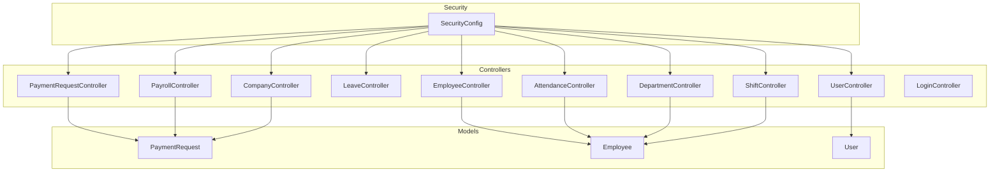
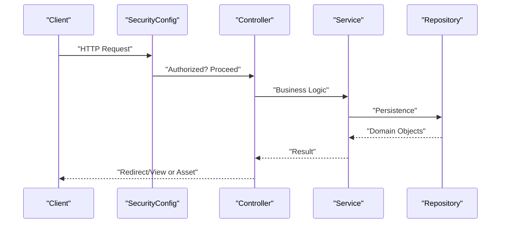
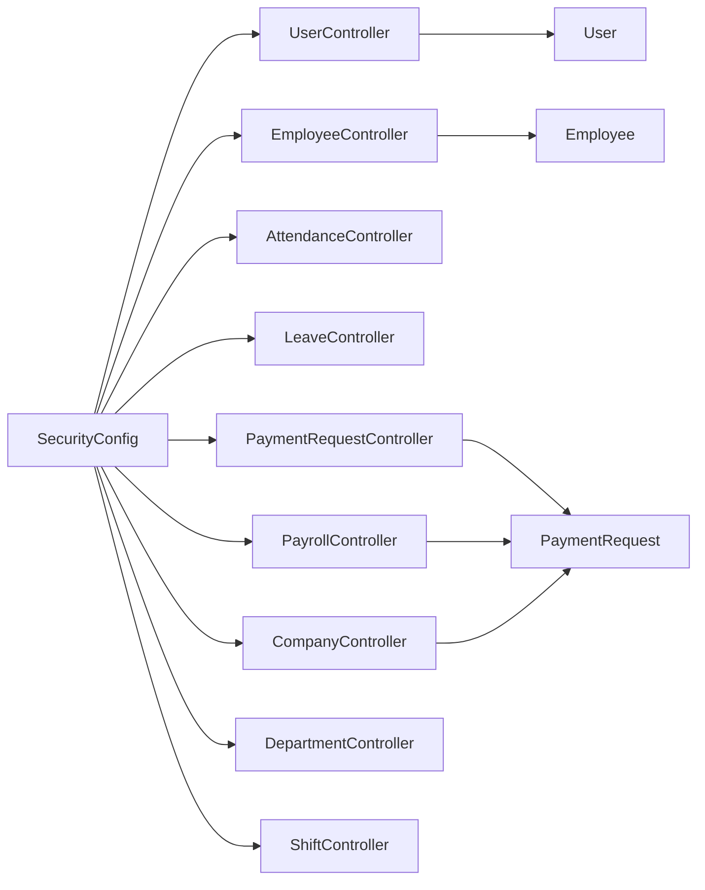
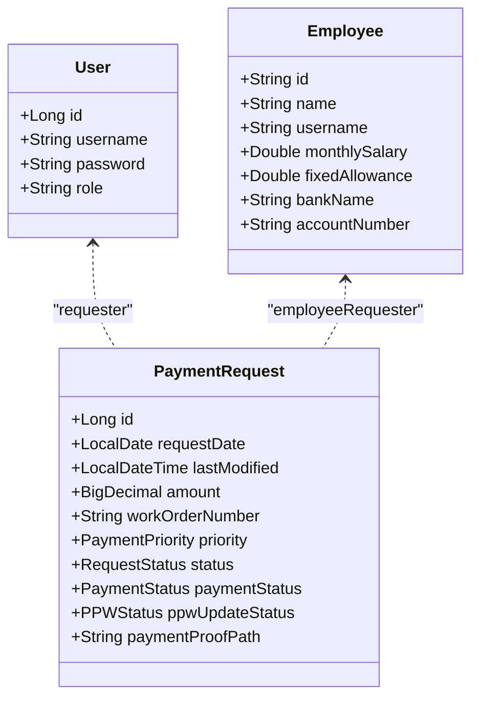

# API Reference

<cite>
**Referenced Files in This Document**
- [UserController.java](file://src/main/java/root/cyb/mh/attendancesystem/controller/UserController.java)
- [EmployeeController.java](file://src/main/java/root/cyb/mh/attendancesystem/controller/EmployeeController.java)
- [AttendanceController.java](file://src/main/java/root/cyb/mh/attendancesystem/controller/AttendanceController.java)
- [LeaveController.java](file://src/main/java/root/cyb/mh/attendancesystem/controller/LeaveController.java)
- [PayrollController.java](file://src/main/java/root/cyb/mh/attendancesystem/controller/PayrollController.java)
- [PaymentRequestController.java](file://src/main/java/root/cyb/mh/attendancesystem/controller/PaymentRequestController.java)
- [CompanyController.java](file://src/main/java/root/cyb/mh/attendancesystem/controller/CompanyController.java)
- [DepartmentController.java](file://src/main/java/root/cyb/mh/attendancesystem/controller/DepartmentController.java)
- [ShiftController.java](file://src/main/java/root/cyb/mh/attendancesystem/controller/ShiftController.java)
- [LoginController.java](file://src/main/java/root/cyb/mh/attendancesystem/controller/LoginController.java)
- [SecurityConfig.java](file://src/main/java/root/cyb/mh/attendancesystem/config/SecurityConfig.java)
- [PaymentRequest.java](file://src/main/java/root/cyb/mh/attendancesystem/model/PaymentRequest.java)
- [Employee.java](file://src/main/java/root/cyb/mh/attendancesystem/model/Employee.java)
- [User.java](file://src/main/java/root/cyb/mh/attendancesystem/model/User.java)
- [application.properties](file://src/main/resources/application.properties)
</cite>

## Table of Contents
1. [Introduction](#introduction)
2. [Project Structure](#project-structure)
3. [Core Components](#core-components)
4. [Architecture Overview](#architecture-overview)
5. [Detailed Component Analysis](#detailed-component-analysis)
6. [Dependency Analysis](#dependency-analysis)
7. [Performance Considerations](#performance-considerations)
8. [Troubleshooting Guide](#troubleshooting-guide)
9. [Conclusion](#conclusion)
10. [Appendices](#appendices)

## Introduction
This document provides a comprehensive API reference for the Skylink Custom Backend. It catalogs REST endpoints organized by functional domains, including user management, employee operations, attendance tracking, leave management, payroll processing, and payment operations. For each endpoint, you will find HTTP methods, URL patterns, request/response characteristics, authentication and authorization requirements, and error handling behavior. Practical examples and integration patterns are included to help developers integrate with the backend effectively.

Important note: The backend exposes primarily server-side rendered pages via Spring MVC controllers. Many endpoints return redirects or render Thymeleaf views. Where applicable, this document indicates whether an endpoint is intended for browser navigation or programmatic consumption. For programmatic integrations, prefer endpoints that return downloadable assets (PDFs, Excel) or focus on administrative endpoints that support filtering and export.

## Project Structure
The backend follows a conventional Spring Boot MVC structure with controllers under a dedicated package, domain models, repositories, services, and configuration classes. Controllers are annotated with @RequestMapping and @ResponseBody-free handlers returning view names or redirects. Security is configured centrally.

**Diagram sources**
- [UserController.java:12-56](file://src/main/java/root/cyb/mh/attendancesystem/controller/UserController.java#L12-L56)
- [EmployeeController.java:16-212](file://src/main/java/root/cyb/mh/attendancesystem/controller/EmployeeController.java#L16-L212)
- [AttendanceController.java:20-131](file://src/main/java/root/cyb/mh/attendancesystem/controller/AttendanceController.java#L20-L131)
- [LeaveController.java:18-175](file://src/main/java/root/cyb/mh/attendancesystem/controller/LeaveController.java#L18-L175)
- [PayrollController.java:16-222](file://src/main/java/root/cyb/mh/attendancesystem/controller/PayrollController.java#L16-L222)
- [PaymentRequestController.java:30-687](file://src/main/java/root/cyb/mh/attendancesystem/controller/PaymentRequestController.java#L30-L687)
- [CompanyController.java:12-202](file://src/main/java/root/cyb/mh/attendancesystem/controller/CompanyController.java#L12-L202)
- [DepartmentController.java:14-68](file://src/main/java/root/cyb/mh/attendancesystem/controller/DepartmentController.java#L14-L68)
- [ShiftController.java:14-75](file://src/main/java/root/cyb/mh/attendancesystem/controller/ShiftController.java#L14-L75)
- [LoginController.java:7-13](file://src/main/java/root/cyb/mh/attendancesystem/controller/LoginController.java#L7-L13)
- [SecurityConfig.java:18-84](file://src/main/java/root/cyb/mh/attendancesystem/config/SecurityConfig.java#L18-L84)
- [PaymentRequest.java:13-116](file://src/main/java/root/cyb/mh/attendancesystem/model/PaymentRequest.java#L13-L116)
- [Employee.java:9-63](file://src/main/java/root/cyb/mh/attendancesystem/model/Employee.java#L9-L63)
- [User.java:6-23](file://src/main/java/root/cyb/mh/attendancesystem/model/User.java#L6-L23)

**Section sources**
- [SecurityConfig.java:18-84](file://src/main/java/root/cyb/mh/attendancesystem/config/SecurityConfig.java#L18-L84)
- [application.properties:1-1](file://src/main/resources/application.properties#L1-L1)

## Core Components
- Authentication and Authorization: Form-based login with role-based access control. CSRF is disabled for compatibility with existing forms; remember-me is enabled.
- Controllers: Each functional area is represented by a dedicated controller class. Many endpoints return redirects or render views; a few expose downloadable assets.
- Models: Domain entities such as PaymentRequest, Employee, and User define the data structures used by controllers and services.

Key security highlights:
- Role gating for administrative areas (e.g., /users/**, /devices/**, /employees/**).
- Mixed roles across endpoints (ADMIN, HR, EMPLOYEE).
- CSRF disabled in the current configuration.

**Section sources**
- [SecurityConfig.java:18-84](file://src/main/java/root/cyb/mh/attendancesystem/config/SecurityConfig.java#L18-L84)
- [User.java:6-23](file://src/main/java/root/cyb/mh/attendancesystem/model/User.java#L6-L23)
- [Employee.java:9-63](file://src/main/java/root/cyb/mh/attendancesystem/model/Employee.java#L9-L63)
- [PaymentRequest.java:13-116](file://src/main/java/root/cyb/mh/attendancesystem/model/PaymentRequest.java#L13-L116)

## Architecture Overview
The backend uses Spring MVC with Thymeleaf for rendering. Controllers handle HTTP requests, enforce security, and delegate to services and repositories. Security is configured centrally to permit or restrict access to endpoints based on roles.

**Diagram sources**
- [SecurityConfig.java:18-84](file://src/main/java/root/cyb/mh/attendancesystem/config/SecurityConfig.java#L18-L84)
- [UserController.java:12-56](file://src/main/java/root/cyb/mh/attendancesystem/controller/UserController.java#L12-L56)
- [EmployeeController.java:16-212](file://src/main/java/root/cyb/mh/attendancesystem/controller/EmployeeController.java#L16-L212)
- [PaymentRequestController.java:30-687](file://src/main/java/root/cyb/mh/attendancesystem/controller/PaymentRequestController.java#L30-L687)

## Detailed Component Analysis

### User Management
Endpoints for listing, adding, and deleting users. Designed for administrative access.

- GET /users
  - Description: Lists all users.
  - Authentication: ADMIN required.
  - Response: Renders a users view with a list of users.
  - Notes: Returns a Thymeleaf view; not a JSON API.

- POST /users/add
  - Description: Adds a new user.
  - Authentication: ADMIN required.
  - Form Parameters:
    - username: string
    - password: string
    - role: string (ADMIN/HR)
  - Behavior: Encodes password and persists user; redirects with success/error indicators.

- GET /users/delete/{id}
  - Description: Deletes a user by ID.
  - Authentication: ADMIN required.
  - Behavior: Prevents self-deletion; clears related references; redirects with success indicator.

Security and roles:
- Requires ADMIN role.

**Section sources**
- [UserController.java:25-55](file://src/main/java/root/cyb/mh/attendancesystem/controller/UserController.java#L25-L55)
- [SecurityConfig.java:28-29](file://src/main/java/root/cyb/mh/attendancesystem/config/SecurityConfig.java#L28-L29)

### Employee Operations
Endpoints for listing, creating/updating, bulk assignment, and managing employee resources.

- GET /employees
  - Description: Lists employees with pagination, sorting, and optional keyword search.
  - Authentication: ADMIN/HR required.
  - Query Parameters:
    - page: integer (default 0)
    - size: integer (default 10)
    - sortField: string (default id)
    - sortDir: string (asc/desc)
    - keyword: string (optional)
  - Response: Renders employees view with paginated list and dropdown options.

- POST /employees
  - Description: Saves an employee (create or update).
  - Authentication: ADMIN/HR required.
  - Form Parameters:
    - Employee fields (name, role, email, etc.)
    - departmentId: long (optional)
    - reportsToId: string (optional)
    - reportsToAssistantId: string (optional)
  - Behavior: Updates or creates employee; encodes username if provided; sets reporting relationships.

- GET /employees/delete/{id}
  - Description: Deletes an employee by ID.
  - Authentication: ADMIN/HR required.
  - Response: Redirects to employees list.

- POST /employees/bulk/assign-department
  - Description: Assigns a department to multiple employees.
  - Authentication: ADMIN/HR required.
  - Form Parameters:
    - employeeIds: list of strings
    - departmentId: long
  - Response: Redirects to employees list.

- GET /employees/{empId}/resources
  - Description: Manages employee-specific shared resources.
  - Authentication: ADMIN/HR required.
  - Response: Renders a view with resource list and form.

- POST /employees/{empId}/resources
  - Description: Saves a shared resource for an employee.
  - Authentication: ADMIN/HR required.
  - Form Parameters:
    - resource fields (resourceName, resourceLink, loginId, password)
  - Response: Redirects to resources page.

- GET /employees/{empId}/resources/delete/{resourceId}
  - Description: Deletes a shared resource.
  - Authentication: ADMIN/HR required.
  - Response: Redirects to resources page.

Security and roles:
- Requires ADMIN or HR.

**Section sources**
- [EmployeeController.java:32-210](file://src/main/java/root/cyb/mh/attendancesystem/controller/EmployeeController.java#L32-L210)
- [SecurityConfig.java:32-33](file://src/main/java/root/cyb/mh/attendancesystem/config/SecurityConfig.java#L32-L33)

### Attendance Tracking
Endpoints for device management and attendance log browsing.

- GET /
  - Description: Home page; serves as entry for device and attendance views.
  - Response: Renders a view (not an API endpoint).

- GET /devices
  - Description: Lists devices.
  - Authentication: ADMIN/HR required.
  - Response: Renders device-status view.

- POST /devices
  - Description: Adds a device.
  - Authentication: ADMIN/HR required.
  - Form Parameters:
    - Device fields
  - Response: Redirects to devices list.

- POST /devices/update
  - Description: Updates a device.
  - Authentication: ADMIN/HR required.
  - Form Parameters:
    - Device fields
  - Response: Redirects to devices list.

- POST /devices/delete
  - Description: Deletes a device.
  - Authentication: ADMIN/HR required.
  - Form Parameters:
    - id: long
  - Response: Redirects to devices list.

- POST /sync
  - Description: Triggers manual synchronization.
  - Authentication: ADMIN/HR required.
  - Response: Redirects to devices list.

- POST /devices/download
  - Description: Queues a command to download attendance logs.
  - Authentication: ADMIN/HR required.
  - Response: Redirects to devices list.

- POST /devices/download-users
  - Description: Queues a command to download users.
  - Authentication: ADMIN/HR required.
  - Response: Redirects to devices list.

- GET /attendance
  - Description: Browses attendance logs with filtering and sorting.
  - Authentication: ADMIN/HR required.
  - Query Parameters:
    - departmentId: long (optional)
    - page: integer (default 0)
    - size: integer (default 10)
    - sortField: string (default id)
    - sortDir: string (asc/desc)
  - Response: Renders attendance view with paginated logs and departments.

Security and roles:
- Requires ADMIN or HR.

**Section sources**
- [AttendanceController.java:33-130](file://src/main/java/root/cyb/mh/attendancesystem/controller/AttendanceController.java#L33-L130)
- [SecurityConfig.java:34-34](file://src/main/java/root/cyb/mh/attendancesystem/config/SecurityConfig.java#L34-L34)

### Leave Management
Endpoints for employee leave application and admin/HR/supervisor management.

- GET /leave/employee
  - Description: Employee’s leave history and application form.
  - Authentication: EMPLOYEE required.
  - Response: Renders employee-leave view.

- POST /leave/employee/apply
  - Description: Submits a leave application for the logged-in employee.
  - Authentication: EMPLOYEE required.
  - Form Parameters:
    - LeaveRequest fields
  - Response: Redirects to employee leave page.

- GET /leave/manage
  - Description: Admin/HR view of all requests or supervisor view of team requests.
  - Authentication: ADMIN/HR or supervisor required.
  - Response: Renders admin-leave-requests view with appropriate title and list.

- POST /leave/manage/update
  - Description: Updates leave request status and comments.
  - Authentication: ADMIN/HR or supervisor required.
  - Form Parameters:
    - id: long
    - status: string (enum-like)
    - comment: string (optional)
  - Response: Redirects to manage page; may include error query param.

- POST /leave/manage/delete
  - Description: Deletes a leave request (admin/HR).
  - Authentication: ADMIN/HR required.
  - Form Parameters:
    - id: long
  - Response: Redirects to manage page.

- GET /leave/calendar
  - Description: Approved leaves calendar for FullCalendar.
  - Authentication: ADMIN/HR required.
  - Response: Renders admin-leave-calendar view with events JSON.

Security and roles:
- Requires ADMIN, HR, or supervisor; supervisor access validated against reporting hierarchy.

**Section sources**
- [LeaveController.java:33-174](file://src/main/java/root/cyb/mh/attendancesystem/controller/LeaveController.java#L33-L174)
- [SecurityConfig.java:46-47](file://src/main/java/root/cyb/mh/attendancesystem/config/SecurityConfig.java#L46-L47)

### Payroll Processing
Endpoints for payroll dashboard, details, status updates, bonus adjustments, and exports.

- GET /payroll
  - Description: Payroll summary dashboard grouped by month.
  - Authentication: ADMIN/HR required.
  - Response: Renders admin-payroll-dashboard view.

- GET /payroll/details/{month}
  - Description: Monthly payroll details with optional department filters.
  - Authentication: ADMIN/HR required.
  - Path Parameters:
    - month: string (format: yyyy-mm)
  - Query Parameters:
    - departmentIds: list of long (optional)
  - Response: Renders admin-payroll-details view.

- POST /payroll/status/update
  - Description: Updates a payslip status; marks as paid via service.
  - Authentication: ADMIN/HR required.
  - Form Parameters:
    - payslipId: long
    - status: string
  - Response: Redirects to details page.

- POST /payroll/status/bulk-paid
  - Description: Marks all DRAFT payslips for a month as paid.
  - Authentication: ADMIN/HR required.
  - Form Parameters:
    - month: string (format: yyyy-mm)
  - Response: Redirects to details page.

- POST /payroll/run
  - Description: Triggers payroll generation for a given month.
  - Authentication: ADMIN/HR required.
  - Form Parameters:
    - month: string (format: yyyy-mm)
  - Response: Redirects to payroll dashboard.

- POST /payroll/bonus/update
  - Description: Updates bonus and recalculates net salary for a DRAFT payslip.
  - Authentication: ADMIN/HR required.
  - Form Parameters:
    - payslipId: long
    - amount: double
  - Response: Redirects to details page.

- GET /payroll/delete/{id}
  - Description: Deletes a payslip (admin).
  - Authentication: ADMIN required.
  - Path Parameters:
    - id: long
  - Response: Redirects to payroll or referer.

- GET /employee/payroll
  - Description: Employee’s payroll history and financial insights.
  - Authentication: EMPLOYEE required.
  - Response: Renders employee-payroll view with charts and metrics.

- GET /payroll/export/bank-advice
  - Description: Exports bank advice Excel for non-zero paid payslips.
  - Authentication: ADMIN/HR required.
  - Query Parameters:
    - month: string (format: yyyy-mm)
  - Response: Returns Excel file attachment.

Security and roles:
- Requires ADMIN or HR for most operations.

**Section sources**
- [PayrollController.java:29-220](file://src/main/java/root/cyb/mh/attendancesystem/controller/PayrollController.java#L29-L220)
- [SecurityConfig.java:38-38](file://src/main/java/root/cyb/mh/attendancesystem/config/SecurityConfig.java#L38-L38)

### Payment Operations
Endpoints for payment request lifecycle, approvals, exports, invoices, and proof viewing.

- GET /payment-requests
  - Description: Lists payment requests with extensive filters and sorting.
  - Authentication: ADMIN/HR or requester/supervisor.
  - Query Parameters:
    - view: string (all/team/self)
    - sortField: string (default lastModified)
    - sortDir: string (asc/desc)
    - startDate: date (optional)
    - endDate: date (optional)
    - contractorId: long (optional)
    - clientId: long (optional)
    - paymentMethodId: long (optional)
    - workOrderNumber: string (optional)
    - requesterName: string (optional)
    - priority: enum (optional)
    - status: enum (optional)
    - paymentStatus: enum (optional)
    - ppwUpdateStatus: enum (optional)
  - Response: Renders payment-request/list view with filtered and sorted results.

- GET /payment-requests/export
  - Description: Exports payment requests to CSV or PDF.
  - Authentication: ADMIN/HR or requester/supervisor.
  - Query Parameters:
    - view: string (all/team/self)
    - sortField: string (default lastModified)
    - sortDir: string (asc/desc)
    - format: string (csv/pdf)
    - columns: list of strings (optional)
    - Filters as above
  - Response: HTTP response with CSV/PDF attachment.

- GET /payment-requests/new
  - Description: Renders new request form.
  - Authentication: ADMIN/HR or requester/supervisor.
  - Response: Renders payment-request/form view.

- POST /payment-requests
  - Description: Submits a new payment request.
  - Authentication: ADMIN/HR or requester/supervisor.
  - Form Parameters:
    - PaymentRequest fields
  - Response: Redirects to list.

- GET /payment-requests/{id}
  - Description: Views a single request; auto-updates check status if accessible.
  - Authentication: ADMIN/HR or requester/supervisor.
  - Path Parameters:
    - id: long
  - Response: Renders payment-request/view with statuses and permissions.

- POST /payment-requests/{id}/review
  - Description: Reviews and updates request (status, payment status, check status, remarks, PPW status, reference number).
  - Authentication: ADMIN/HR or supervisor.
  - Path Parameters:
    - id: long
  - Form Parameters:
    - status: enum (optional)
    - paymentStatus: enum (optional)
    - checkStatus: string (optional)
    - ppwUpdateStatus: enum (optional)
    - paymentReferenceNumber: string (optional)
    - remarks: string (optional)
    - proofFile: multipart file (optional)
  - Response: Redirects to view; may include error query param.

- POST /payment-requests/{id}/delete
  - Description: Deletes a REJECTED request (admin only).
  - Authentication: ADMIN required.
  - Path Parameters:
    - id: long
  - Response: Redirects to list with flash message.

- GET /payment-requests/{id}/invoice
  - Description: Downloads invoice PDF for a PAID request.
  - Authentication: ADMIN/HR or requester.
  - Path Parameters:
    - id: long
  - Response: Returns PDF attachment or HTTP error.

- POST /payment-requests/{id}/send-email
  - Description: Sends invoice email to a specified address.
  - Authentication: ADMIN/HR or requester.
  - Path Parameters:
    - id: long
  - Form Parameters:
    - email: string
  - Response: Redirects to view with success/error flash message.

- POST /payment-requests/{id}/employee-note
  - Description: Adds a note from the requester (PENDING only).
  - Authentication: Requester only.
  - Path Parameters:
    - id: long
  - Form Parameters:
    - employeeNote: string
  - Response: Redirects to view with success/error flash message.

- GET /payment-requests/{id}/proof
  - Description: Streams payment proof file if accessible.
  - Authentication: ADMIN/HR or requester/supervisor.
  - Path Parameters:
    - id: long
  - Response: Returns file stream or 404.

Data model highlights:
- PaymentRequest includes requester (User or Employee), contractor, client, payment method, amounts, statuses, and metadata.

Security and roles:
- Mixed roles: ADMIN, HR, supervisors, and requesters depending on action.

**Section sources**
- [PaymentRequestController.java:65-687](file://src/main/java/root/cyb/mh/attendancesystem/controller/PaymentRequestController.java#L65-L687)
- [PaymentRequest.java:13-116](file://src/main/java/root/cyb/mh/attendancesystem/model/PaymentRequest.java#L13-L116)
- [SecurityConfig.java:35-36](file://src/main/java/root/cyb/mh/attendancesystem/config/SecurityConfig.java#L35-L36)

### Master Data and Administration
Administrative endpoints for companies and departments.

- GET /master-data/companies
  - Description: Lists companies.
  - Authentication: ADMIN required.
  - Response: Renders company/list view.

- POST /master-data/companies
  - Description: Saves a company.
  - Authentication: ADMIN required.
  - Form Parameters:
    - Company fields
  - Response: Redirects with flash messages.

- POST /master-data/companies/update
  - Description: Updates a company.
  - Authentication: ADMIN required.
  - Form Parameters:
    - Company fields
  - Response: Redirects with flash messages.

- POST /master-data/companies/{id}/toggle
  - Description: Toggles company active status.
  - Authentication: ADMIN required.
  - Path Parameters:
    - id: long
  - Response: Redirects with flash messages.

- GET /master-data/companies/{id}/dashboard
  - Description: Company dashboard with analytics.
  - Authentication: ADMIN required.
  - Path Parameters:
    - id: long
  - Response: Renders company/dashboard view with computed metrics.

- GET /departments
  - Description: Lists departments with sorting.
  - Authentication: ADMIN required.
  - Query Parameters:
    - sortField: string (default id)
    - sortDir: string (asc/desc)
  - Response: Renders departments view.

- POST /departments
  - Description: Creates or updates a department.
  - Authentication: ADMIN required.
  - Form Parameters:
    - id: long (optional)
    - name: string
    - description: string
  - Response: Redirects to departments list.

- GET /departments/delete/{id}
  - Description: Deletes a department if not assigned to employees.
  - Authentication: ADMIN required.
  - Path Parameters:
    - id: long
  - Response: Redirects to departments list with success/error flash message.

Security and roles:
- ADMIN required for most endpoints.

**Section sources**
- [CompanyController.java:29-201](file://src/main/java/root/cyb/mh/attendancesystem/controller/CompanyController.java#L29-L201)
- [DepartmentController.java:22-67](file://src/main/java/root/cyb/mh/attendancesystem/controller/DepartmentController.java#L22-L67)
- [SecurityConfig.java:37-40](file://src/main/java/root/cyb/mh/attendancesystem/config/SecurityConfig.java#L37-L40)

### Shift Management
Administrative endpoints for shift creation, assignment, and updates.

- GET /admin/shifts
  - Description: Index view for shifts and assignments.
  - Authentication: ADMIN/HR required.
  - Response: Renders shifts view.

- POST /admin/shifts/create
  - Description: Creates a new shift.
  - Authentication: ADMIN/HR required.
  - Form Parameters:
    - Shift fields
  - Response: Redirects to shifts list.

- GET /admin/shifts/delete/{id}
  - Description: Deletes a shift (may fail due to constraints).
  - Authentication: ADMIN/HR required.
  - Path Parameters:
    - id: long
  - Response: Redirects to shifts list.

- POST /admin/shifts/assign
  - Description: Assigns a shift to an employee for a date range.
  - Authentication: ADMIN/HR required.
  - Form Parameters:
    - employeeId: string
    - shiftId: long
    - startDate: date (yyyy-MM-dd)
    - endDate: date (yyyy-MM-dd)
  - Response: Redirects to shifts list.

- POST /admin/shifts/assignments/update
  - Description: Updates an existing assignment date range.
  - Authentication: ADMIN/HR required.
  - Form Parameters:
    - id: long
    - shiftId: long
    - startDate: date (yyyy-MM-dd)
    - endDate: date (yyyy-MM-dd)
  - Response: Redirects to shifts list.

- GET /admin/shifts/assignments/delete/{id}
  - Description: Deletes an assignment.
  - Authentication: ADMIN/HR required.
  - Path Parameters:
    - id: long
  - Response: Redirects to shifts list.

Security and roles:
- ADMIN/HR required.

**Section sources**
- [ShiftController.java:24-72](file://src/main/java/root/cyb/mh/attendancesystem/controller/ShiftController.java#L24-L72)
- [SecurityConfig.java:34-34](file://src/main/java/root/cyb/mh/attendancesystem/config/SecurityConfig.java#L34-L34)

### Authentication
- GET /login
  - Description: Renders the login page.
  - Response: Returns login view.

- Security behavior:
  - Form login with custom success handler.
  - Remember-me token with 7-day validity.
  - CSRF disabled in current configuration.

**Section sources**
- [LoginController.java:9-12](file://src/main/java/root/cyb/mh/attendancesystem/controller/LoginController.java#L9-L12)
- [SecurityConfig.java:50-60](file://src/main/java/root/cyb/mh/attendancesystem/config/SecurityConfig.java#L50-L60)

## Dependency Analysis
The controllers depend on models, repositories, and services. Security configuration centralizes authorization rules per endpoint pattern and role.

**Diagram sources**
- [SecurityConfig.java:18-84](file://src/main/java/root/cyb/mh/attendancesystem/config/SecurityConfig.java#L18-L84)
- [UserController.java:12-56](file://src/main/java/root/cyb/mh/attendancesystem/controller/UserController.java#L12-L56)
- [EmployeeController.java:16-212](file://src/main/java/root/cyb/mh/attendancesystem/controller/EmployeeController.java#L16-L212)
- [AttendanceController.java:20-131](file://src/main/java/root/cyb/mh/attendancesystem/controller/AttendanceController.java#L20-L131)
- [LeaveController.java:18-175](file://src/main/java/root/cyb/mh/attendancesystem/controller/LeaveController.java#L18-L175)
- [PayrollController.java:16-222](file://src/main/java/root/cyb/mh/attendancesystem/controller/PayrollController.java#L16-L222)
- [PaymentRequestController.java:30-687](file://src/main/java/root/cyb/mh/attendancesystem/controller/PaymentRequestController.java#L30-L687)
- [CompanyController.java:12-202](file://src/main/java/root/cyb/mh/attendancesystem/controller/CompanyController.java#L12-L202)
- [DepartmentController.java:14-68](file://src/main/java/root/cyb/mh/attendancesystem/controller/DepartmentController.java#L14-L68)
- [ShiftController.java:14-75](file://src/main/java/root/cyb/mh/attendancesystem/controller/ShiftController.java#L14-L75)
- [User.java:6-23](file://src/main/java/root/cyb/mh/attendancesystem/model/User.java#L6-L23)
- [Employee.java:9-63](file://src/main/java/root/cyb/mh/attendancesystem/model/Employee.java#L9-L63)
- [PaymentRequest.java:13-116](file://src/main/java/root/cyb/mh/attendancesystem/model/PaymentRequest.java#L13-L116)

**Section sources**
- [SecurityConfig.java:18-84](file://src/main/java/root/cyb/mh/attendancesystem/config/SecurityConfig.java#L18-L84)

## Performance Considerations
- Pagination and sorting: Several endpoints accept page, size, sortField, and sortDir parameters to control result volume and ordering.
- Filtering: Payment requests support numerous filter parameters; use them to reduce payload sizes.
- Export endpoints: Prefer CSV/PDF exports for large datasets to offload rendering to the client.
- Image/file handling: Proof files are stored on disk; ensure adequate storage and access controls.

[No sources needed since this section provides general guidance]

## Troubleshooting Guide
Common issues and resolutions:
- Access Denied (403): Ensure the user has the required role for the endpoint. Some endpoints require ADMIN, HR, or supervisor privileges.
- Self-deletion prevention: Deleting a user prevents self-deletion; confirm identity before attempting deletion.
- Supervisor access: Leave management and payment reviews validate supervisor hierarchy; ensure reporting relationships are configured.
- Locked status for paid records: Restricted users cannot change major fields for PAID requests; adjust review limits via system settings.
- CSRF disabled: Existing forms may rely on CSRF being disabled; enabling CSRF requires updating forms to include tokens.
- Export failures: Verify filters and column selections when exporting payment requests.

**Section sources**
- [UserController.java:46-54](file://src/main/java/root/cyb/mh/attendancesystem/controller/UserController.java#L46-L54)
- [LeaveController.java:74-84](file://src/main/java/root/cyb/mh/attendancesystem/controller/LeaveController.java#L74-L84)
- [PaymentRequestController.java:385-425](file://src/main/java/root/cyb/mh/attendancesystem/controller/PaymentRequestController.java#L385-L425)
- [SecurityConfig.java:81-81](file://src/main/java/root/cyb/mh/attendancesystem/config/SecurityConfig.java#L81-L81)

## Conclusion
Skylink Custom Backend exposes a comprehensive set of administrative and operational endpoints across user management, employees, attendance, leave, payroll, and payments. While many endpoints return views or redirects, several support programmatic consumption via exports and asset downloads. Security is role-based and centralized, with CSRF disabled for backward compatibility. Integrate by targeting the documented endpoints, applying appropriate authentication, and respecting role requirements.

[No sources needed since this section summarizes without analyzing specific files]

## Appendices

### Authentication and Authorization Summary
- Roles: ADMIN, HR, EMPLOYEE.
- Protected paths:
  - /users/**, /devices/**: ADMIN
  - /employees/**: ADMIN/HR
  - /admin/shifts/**: ADMIN/HR
  - /master-data/**: ADMIN
  - /departments/**: ADMIN
  - /employee/**: EMPLOYEE
  - /leave/manage/**: ADMIN/HR/EMPLOYEE (context-dependent)
- Login: /login; remember-me token valid for 7 days.

**Section sources**
- [SecurityConfig.java:28-47](file://src/main/java/root/cyb/mh/attendancesystem/config/SecurityConfig.java#L28-L47)

### Rate Limiting and Versioning
- No explicit rate limiting or API versioning is implemented in the provided configuration and controllers.

**Section sources**
- [SecurityConfig.java:18-84](file://src/main/java/root/cyb/mh/attendancesystem/config/SecurityConfig.java#L18-L84)

### Data Models Overview

**Diagram sources**
- [User.java:6-23](file://src/main/java/root/cyb/mh/attendancesystem/model/User.java#L6-L23)
- [Employee.java:9-63](file://src/main/java/root/cyb/mh/attendancesystem/model/Employee.java#L9-L63)
- [PaymentRequest.java:13-116](file://src/main/java/root/cyb/mh/attendancesystem/model/PaymentRequest.java#L13-L116)