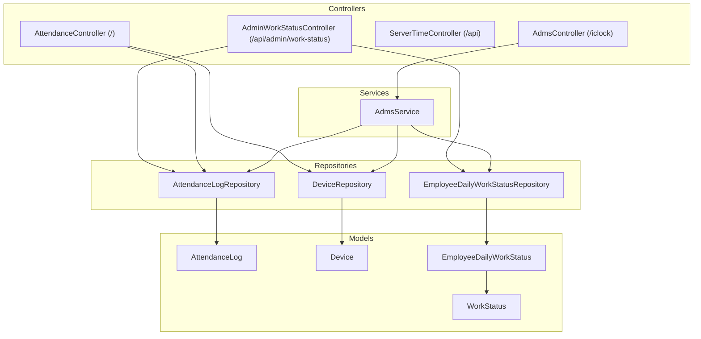
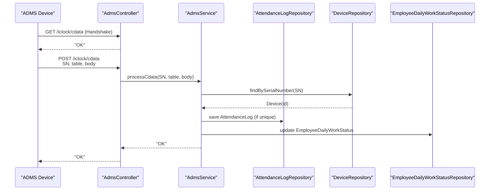
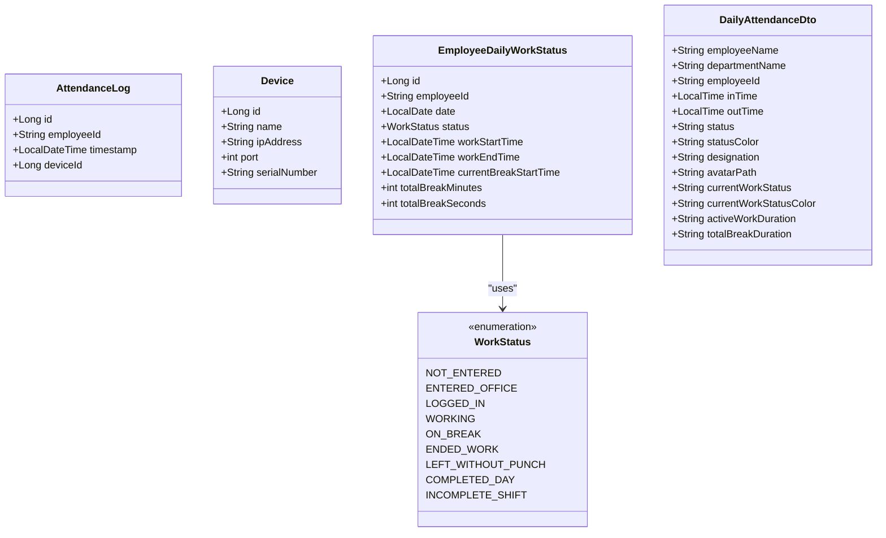
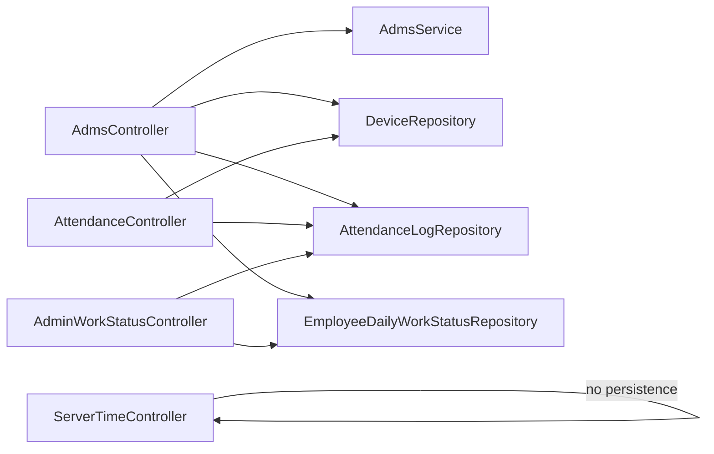

# Attendance API

<cite>
**Referenced Files in This Document**
- [AdmsController.java](file://src/main/java/root/cyb/mh/attendancesystem/controller/AdmsController.java)
- [AttendanceController.java](file://src/main/java/root/cyb/mh/attendancesystem/controller/AttendanceController.java)
- [ServerTimeController.java](file://src/main/java/root/cyb/mh/attendancesystem/controller/ServerTimeController.java)
- [AdminWorkStatusController.java](file://src/main/java/root/cyb/mh/attendancesystem/controller/AdminWorkStatusController.java)
- [AdmsService.java](file://src/main/java/root/cyb/mh/attendancesystem/service/AdmsService.java)
- [AttendanceLog.java](file://src/main/java/root/cyb/mh/attendancesystem/model/AttendanceLog.java)
- [Device.java](file://src/main/java/root/cyb/mh/attendancesystem/model/Device.java)
- [EmployeeDailyWorkStatus.java](file://src/main/java/root/cyb/mh/attendancesystem/model/EmployeeDailyWorkStatus.java)
- [WorkStatus.java](file://src/main/java/root/cyb/mh/attendancesystem/model/WorkStatus.java)
- [AttendanceLogRepository.java](file://src/main/java/root/cyb/mh/attendancesystem/repository/AttendanceLogRepository.java)
- [DeviceRepository.java](file://src/main/java/root/cyb/mh/attendancesystem/repository/DeviceRepository.java)
- [EmployeeDailyWorkStatusRepository.java](file://src/main/java/root/cyb/mh/attendancesystem/repository/EmployeeDailyWorkStatusRepository.java)
- [DailyAttendanceDto.java](file://src/main/java/root/cyb/mh/attendancesystem/dto/DailyAttendanceDto.java)
</cite>

## Table of Contents
1. [Introduction](#introduction)
2. [Project Structure](#project-structure)
3. [Core Components](#core-components)
4. [Architecture Overview](#architecture-overview)
5. [Detailed Component Analysis](#detailed-component-analysis)
6. [Dependency Analysis](#dependency-analysis)
7. [Performance Considerations](#performance-considerations)
8. [Troubleshooting Guide](#troubleshooting-guide)
9. [Conclusion](#conclusion)
10. [Appendices](#appendices)

## Introduction
This document describes the Attendance API for real-time attendance logging, device integration, and attendance history. It covers endpoints for device communication (ADMS protocol), server time synchronization, live work status reporting, and batch operations for downloading device data. It also documents request/response formats, timestamp handling, and validation rules for attendance records.

## Project Structure
The attendance system is organized around Spring MVC controllers, Spring Data JPA repositories, domain models, and a service layer implementing the ADMS protocol and work status logic.

**Diagram sources**
- [AdmsController.java:1-65](file://src/main/java/root/cyb/mh/attendancesystem/controller/AdmsController.java#L1-L65)
- [AttendanceController.java:1-132](file://src/main/java/root/cyb/mh/attendancesystem/controller/AttendanceController.java#L1-L132)
- [ServerTimeController.java:1-28](file://src/main/java/root/cyb/mh/attendancesystem/controller/ServerTimeController.java#L1-L28)
- [AdminWorkStatusController.java:1-61](file://src/main/java/root/cyb/mh/attendancesystem/controller/AdminWorkStatusController.java#L1-L61)
- [AdmsService.java:1-263](file://src/main/java/root/cyb/mh/attendancesystem/service/AdmsService.java#L1-L263)
- [AttendanceLogRepository.java:1-22](file://src/main/java/root/cyb/mh/attendancesystem/repository/AttendanceLogRepository.java#L1-L22)
- [DeviceRepository.java:1-11](file://src/main/java/root/cyb/mh/attendancesystem/repository/DeviceRepository.java#L1-L11)
- [EmployeeDailyWorkStatusRepository.java:1-21](file://src/main/java/root/cyb/mh/attendancesystem/repository/EmployeeDailyWorkStatusRepository.java#L1-L21)
- [AttendanceLog.java:1-27](file://src/main/java/root/cyb/mh/attendancesystem/model/AttendanceLog.java#L1-L27)
- [Device.java:1-26](file://src/main/java/root/cyb/mh/attendancesystem/model/Device.java#L1-L26)
- [EmployeeDailyWorkStatus.java:1-45](file://src/main/java/root/cyb/mh/attendancesystem/model/EmployeeDailyWorkStatus.java#L1-L45)
- [WorkStatus.java:1-14](file://src/main/java/root/cyb/mh/attendancesystem/model/WorkStatus.java#L1-L14)

**Section sources**
- [AdmsController.java:1-65](file://src/main/java/root/cyb/mh/attendancesystem/controller/AdmsController.java#L1-L65)
- [AttendanceController.java:1-132](file://src/main/java/root/cyb/mh/attendancesystem/controller/AttendanceController.java#L1-L132)
- [ServerTimeController.java:1-28](file://src/main/java/root/cyb/mh/attendancesystem/controller/ServerTimeController.java#L1-L28)
- [AdminWorkStatusController.java:1-61](file://src/main/java/root/cyb/mh/attendancesystem/controller/AdminWorkStatusController.java#L1-L61)
- [AdmsService.java:1-263](file://src/main/java/root/cyb/mh/attendancesystem/service/AdmsService.java#L1-L263)
- [AttendanceLogRepository.java:1-22](file://src/main/java/root/cyb/mh/attendancesystem/repository/AttendanceLogRepository.java#L1-L22)
- [DeviceRepository.java:1-11](file://src/main/java/root/cyb/mh/attendancesystem/repository/DeviceRepository.java#L1-L11)
- [EmployeeDailyWorkStatusRepository.java:1-21](file://src/main/java/root/cyb/mh/attendancesystem/repository/EmployeeDailyWorkStatusRepository.java#L1-L21)
- [AttendanceLog.java:1-27](file://src/main/java/root/cyb/mh/attendancesystem/model/AttendanceLog.java#L1-L27)
- [Device.java:1-26](file://src/main/java/root/cyb/mh/attendancesystem/model/Device.java#L1-L26)
- [EmployeeDailyWorkStatus.java:1-45](file://src/main/java/root/cyb/mh/attendancesystem/model/EmployeeDailyWorkStatus.java#L1-L45)
- [WorkStatus.java:1-14](file://src/main/java/root/cyb/mh/attendancesystem/model/WorkStatus.java#L1-L14)

## Core Components
- ADMS device integration endpoints under /iclock for handshake, data push, command requests, registry checks, and command result callbacks.
- Attendance history browsing via HTML controller with filtering and pagination.
- Server time endpoint for time synchronization.
- Real-time work status reporting for administrators.
- Domain models for attendance logs, devices, daily work status, and status enumeration.
- Repositories for persistence and queries.

**Section sources**
- [AdmsController.java:15-64](file://src/main/java/root/cyb/mh/attendancesystem/controller/AdmsController.java#L15-L64)
- [AttendanceController.java:33-130](file://src/main/java/root/cyb/mh/attendancesystem/controller/AttendanceController.java#L33-L130)
- [ServerTimeController.java:20-26](file://src/main/java/root/cyb/mh/attendancesystem/controller/ServerTimeController.java#L20-L26)
- [AdminWorkStatusController.java:36-61](file://src/main/java/root/cyb/mh/attendancesystem/controller/AdminWorkStatusController.java#L36-L61)
- [AttendanceLog.java:17-26](file://src/main/java/root/cyb/mh/attendancesystem/model/AttendanceLog.java#L17-L26)
- [Device.java:15-25](file://src/main/java/root/cyb/mh/attendancesystem/model/Device.java#L15-L25)
- [EmployeeDailyWorkStatus.java:12-44](file://src/main/java/root/cyb/mh/attendancesystem/model/EmployeeDailyWorkStatus.java#L12-L44)
- [WorkStatus.java:3-13](file://src/main/java/root/cyb/mh/attendancesystem/model/WorkStatus.java#L3-L13)

## Architecture Overview
The system integrates external ADMS devices using a standardized protocol. Devices push attendance logs and user data, while the server queues commands for the devices. The service layer parses incoming data, deduplicates logs, and updates daily work statuses. Administrators can view real-time work status and attendance history.

**Diagram sources**
- [AdmsController.java:15-29](file://src/main/java/root/cyb/mh/attendancesystem/controller/AdmsController.java#L15-L29)
- [AdmsService.java:42-89](file://src/main/java/root/cyb/mh/attendancesystem/service/AdmsService.java#L42-L89)
- [DeviceRepository.java:9](file://src/main/java/root/cyb/mh/attendancesystem/repository/DeviceRepository.java#L9)
- [AttendanceLogRepository.java:11](file://src/main/java/root/cyb/mh/attendancesystem/repository/AttendanceLogRepository.java#L11)
- [EmployeeDailyWorkStatusRepository.java:13](file://src/main/java/root/cyb/mh/attendancesystem/repository/EmployeeDailyWorkStatusRepository.java#L13)

## Detailed Component Analysis

### ADMS Device Integration Endpoints
- Endpoint: GET /iclock/cdata
  - Purpose: Device handshake.
  - Response: Plain text "OK".
- Endpoint: POST /iclock/cdata
  - Purpose: Receive device data (attendance logs, user info, operator logs).
  - Query params: SN (serial number), table (attlog, userinfo, operlog), body (tab-separated lines).
  - Response: "OK" after parsing and saving.
- Endpoint: GET /iclock/getrequest
  - Purpose: Device polls for queued commands.
  - Query param: SN (serial number).
  - Response: Pending command string or "OK" if none.
- Endpoint: GET /iclock/registry
  - Purpose: Registry check for device registration.
  - Query param: SN (serial number).
  - Response: Registry code string.
- Endpoint: POST /iclock/fdata
  - Purpose: Device acknowledges receipt and optionally pushes data.
  - Query params: SN, table, body.
  - Response: "OK".
- Endpoint: POST /iclock/devicecmd
  - Purpose: Device reports command execution results.
  - Query params: SN, body.
  - Response: "OK".

Validation and deduplication:
- Attendance logs are deduplicated by employeeId, timestamp, and deviceId before insertion.

Timestamp handling:
- Logs are parsed as yyyy-MM-dd HH:mm:ss and stored as LocalDateTime.
- Device timezone is treated as UTC-5; timestamps are parsed directly.

Work status updates:
- On first log of the day, status transitions from NOT_ENTERED to ENTERED_OFFICE.
- On subsequent logs during ENDED_WORK, status recalculates completion rules with a 30-minute grace window.

**Section sources**
- [AdmsController.java:15-64](file://src/main/java/root/cyb/mh/attendancesystem/controller/AdmsController.java#L15-L64)
- [AdmsService.java:29-40](file://src/main/java/root/cyb/mh/attendancesystem/service/AdmsService.java#L29-L40)
- [AdmsService.java:42-89](file://src/main/java/root/cyb/mh/attendancesystem/service/AdmsService.java#L42-L89)
- [AdmsService.java:184-261](file://src/main/java/root/cyb/mh/attendancesystem/service/AdmsService.java#L184-L261)
- [AttendanceLogRepository.java:11](file://src/main/java/root/cyb/mh/attendancesystem/repository/AttendanceLogRepository.java#L11)

### Device Management Endpoints
- GET /devices
  - Purpose: Render device management page with all devices and a new device form.
- POST /devices
  - Purpose: Add a new device.
- POST /devices/update
  - Purpose: Update an existing device.
- POST /devices/delete
  - Purpose: Delete a device by id.
- POST /sync
  - Purpose: Trigger manual synchronization (placeholder).
- POST /devices/download
  - Purpose: Queue a command to download attendance logs from devices.
- POST /devices/download-users
  - Purpose: Queue a command to download user info from devices.

Device model fields:
- id, name, ipAddress, port, serialNumber.

**Section sources**
- [AttendanceController.java:33-80](file://src/main/java/root/cyb/mh/attendancesystem/controller/AttendanceController.java#L33-L80)
- [Device.java:15-25](file://src/main/java/root/cyb/mh/attendancesystem/model/Device.java#L15-L25)

### Attendance History and Filtering
- GET /attendance
  - Purpose: Browse attendance logs with pagination and sorting.
  - Query params: departmentId (optional), page, size, sortField, sortDir.
  - Returns: Paged logs, departments, employee map for name sorting, and sort metadata.

Filtering and sorting:
- Supports department-based filtering.
- Sort by id; name sorting is handled via an in-memory map due to lack of a database column for employee name.

**Section sources**
- [AttendanceController.java:88-130](file://src/main/java/root/cyb/mh/attendancesystem/controller/AttendanceController.java#L88-L130)
- [AttendanceLogRepository.java:17-20](file://src/main/java/root/cyb/mh/attendancesystem/repository/AttendanceLogRepository.java#L17-L20)

### Server Time Synchronization
- GET /api/time
  - Purpose: Provide server time for device synchronization.
  - Response: JSON object containing time and datetime formatted strings.

Access control:
- Requires ADMIN or HR roles.

**Section sources**
- [ServerTimeController.java:20-26](file://src/main/java/root/cyb/mh/attendancesystem/controller/ServerTimeController.java#L20-L26)
- [ServerTimeController.java:14](file://src/main/java/root/cyb/mh/attendancesystem/controller/ServerTimeController.java#L14)

### Real-Time Work Status Reporting
- GET /api/admin/work-status/realtime
  - Purpose: Retrieve real-time work status for all employees.
  - Response: List of DTOs with employee details, current work status, and formatted durations.

Integration:
- Combines employee data, today's attendance logs, and daily work status records.

**Section sources**
- [AdminWorkStatusController.java:36-61](file://src/main/java/root/cyb/mh/attendancesystem/controller/AdminWorkStatusController.java#L36-L61)

### Data Models and DTOs

**Diagram sources**
- [AttendanceLog.java:17-26](file://src/main/java/root/cyb/mh/attendancesystem/model/AttendanceLog.java#L17-L26)
- [Device.java:15-25](file://src/main/java/root/cyb/mh/attendancesystem/model/Device.java#L15-L25)
- [EmployeeDailyWorkStatus.java:12-44](file://src/main/java/root/cyb/mh/attendancesystem/model/EmployeeDailyWorkStatus.java#L12-L44)
- [WorkStatus.java:3-13](file://src/main/java/root/cyb/mh/attendancesystem/model/WorkStatus.java#L3-L13)
- [DailyAttendanceDto.java:7-23](file://src/main/java/root/cyb/mh/attendancesystem/dto/DailyAttendanceDto.java#L7-L23)

## Dependency Analysis
- Controllers depend on services and repositories for business logic and persistence.
- AdmsService orchestrates device data ingestion, deduplication, and work status updates.
- Repositories encapsulate data access patterns for attendance logs, devices, and daily work statuses.

**Diagram sources**
- [AdmsController.java:12-13](file://src/main/java/root/cyb/mh/attendancesystem/controller/AdmsController.java#L12-L13)
- [AdmsService.java:21-27](file://src/main/java/root/cyb/mh/attendancesystem/service/AdmsService.java#L21-L27)
- [AttendanceController.java:24-28](file://src/main/java/root/cyb/mh/attendancesystem/controller/AttendanceController.java#L24-L28)
- [ServerTimeController.java:14](file://src/main/java/root/cyb/mh/attendancesystem/controller/ServerTimeController.java#L14)
- [AdminWorkStatusController.java:27-34](file://src/main/java/root/cyb/mh/attendancesystem/controller/AdminWorkStatusController.java#L27-L34)

**Section sources**
- [AdmsController.java:12-13](file://src/main/java/root/cyb/mh/attendancesystem/controller/AdmsController.java#L12-L13)
- [AdmsService.java:21-27](file://src/main/java/root/cyb/mh/attendancesystem/service/AdmsService.java#L21-L27)
- [AttendanceController.java:24-28](file://src/main/java/root/cyb/mh/attendancesystem/controller/AttendanceController.java#L24-L28)
- [ServerTimeController.java:14](file://src/main/java/root/cyb/mh/attendancesystem/controller/ServerTimeController.java#L14)
- [AdminWorkStatusController.java:27-34](file://src/main/java/root/cyb/mh/attendancesystem/controller/AdminWorkStatusController.java#L27-L34)

## Performance Considerations
- Deduplication: AttendanceLogRepository checks uniqueness by employeeId, timestamp, and deviceId before insert to avoid duplicates.
- Batch parsing: ADMS data is processed line-by-line; consider batching writes for high-volume scenarios.
- Sorting by name: Name sorting is performed in-memory due to missing database column; this may impact performance for large datasets.
- Pagination: Use page and size parameters to limit response sizes for attendance history.

[No sources needed since this section provides general guidance]

## Troubleshooting Guide
Common issues and resolutions:
- Unknown device serial number: The service logs unknown SN and does not persist logs for unregistered devices. Register the device first or enable auto-registration in the service.
- Duplicate logs: Deduplication prevents duplicate entries; verify that employeeId, timestamp, and deviceId match exactly.
- Work status not updating: Ensure logs occur on the same date as the daily status record and that the device timestamp falls within the 30-minute window for post-end-of-day punches.
- Timezone mismatch: Device timestamps are parsed as UTC-5; ensure device clock and server timezone alignment.

**Section sources**
- [AdmsService.java:49-51](file://src/main/java/root/cyb/mh/attendancesystem/service/AdmsService.java#L49-L51)
- [AdmsService.java:219-227](file://src/main/java/root/cyb/mh/attendancesystem/service/AdmsService.java#L219-L227)
- [AdmsService.java:240-256](file://src/main/java/root/cyb/mh/attendancesystem/service/AdmsService.java#L240-L256)

## Conclusion
The Attendance API provides robust ADMS device integration, real-time work status reporting, and historical attendance browsing. By leveraging deduplication, timezone-aware timestamp handling, and structured work status updates, it ensures accurate attendance tracking and supports administrative oversight.

[No sources needed since this section summarizes without analyzing specific files]

## Appendices

### API Reference

- GET /iclock/cdata
  - Description: Device handshake.
  - Response: OK

- POST /iclock/cdata
  - Description: Receive device data.
  - Query: SN, table, body.
  - Response: OK

- GET /iclock/getrequest
  - Description: Poll for pending commands.
  - Query: SN.
  - Response: Command string or OK

- GET /iclock/registry
  - Description: Registry check.
  - Query: SN.
  - Response: Registry code

- POST /iclock/fdata
  - Description: Acknowledge receipt and optionally push data.
  - Query: SN, table, body.
  - Response: OK

- POST /iclock/devicecmd
  - Description: Report command result.
  - Query: SN, body.
  - Response: OK

- GET /api/time
  - Description: Server time for synchronization.
  - Response: { time, datetime }

- GET /api/admin/work-status/realtime
  - Description: Real-time work status for all employees.
  - Response: Array of DailyAttendanceDto-like objects

- GET /attendance
  - Description: Attendance history with pagination and sorting.
  - Query: departmentId, page, size, sortField, sortDir.
  - Response: Paged logs and metadata

- GET /devices
  - Description: Device management page.
  - Response: HTML page with devices list

- POST /devices
  - Description: Add a device.
  - Request: Device fields.
  - Response: Redirect to devices page

- POST /devices/update
  - Description: Update a device.
  - Request: Device fields.
  - Response: Redirect to devices page

- POST /devices/delete
  - Description: Delete a device.
  - Query: id.
  - Response: Redirect to devices page

- POST /sync
  - Description: Manual sync trigger.
  - Response: Redirect to devices page

- POST /devices/download
  - Description: Queue download of attendance logs.
  - Response: Redirect to devices page

- POST /devices/download-users
  - Description: Queue download of user info.
  - Response: Redirect to devices page

**Section sources**
- [AdmsController.java:15-64](file://src/main/java/root/cyb/mh/attendancesystem/controller/AdmsController.java#L15-L64)
- [ServerTimeController.java:20-26](file://src/main/java/root/cyb/mh/attendancesystem/controller/ServerTimeController.java#L20-L26)
- [AdminWorkStatusController.java:36-61](file://src/main/java/root/cyb/mh/attendancesystem/controller/AdminWorkStatusController.java#L36-L61)
- [AttendanceController.java:88-130](file://src/main/java/root/cyb/mh/attendancesystem/controller/AttendanceController.java#L88-L130)
- [AttendanceController.java:33-80](file://src/main/java/root/cyb/mh/attendancesystem/controller/AttendanceController.java#L33-L80)

### Data Formats

- AttendanceLog
  - Fields: id, employeeId, timestamp, deviceId
  - Example: { "id": 1, "employeeId": "123", "timestamp": "2025-06-01T09:01:00", "deviceId": 5 }

- Device
  - Fields: id, name, ipAddress, port, serialNumber
  - Example: { "id": 1, "name": "Main Entrance", "ipAddress": "192.168.1.10", "port": 4370, "serialNumber": "SN123456" }

- EmployeeDailyWorkStatus
  - Fields: id, employeeId, date, status, workStartTime, workEndTime, currentBreakStartTime, totalBreakMinutes, totalBreakSeconds
  - Example: { "id": 1, "employeeId": "123", "date": "2025-06-01", "status": "ENTERED_OFFICE", "workStartTime": null, "workEndTime": null, "currentBreakStartTime": null, "totalBreakMinutes": 0, "totalBreakSeconds": 0 }

- DailyAttendanceDto (for real-time status)
  - Fields: employeeName, departmentName, employeeId, inTime, outTime, status, statusColor, designation, avatarPath, currentWorkStatus, currentWorkStatusColor, activeWorkDuration, totalBreakDuration
  - Example: { "employeeName": "John Doe", "departmentName": "Engineering", "employeeId": "123", "inTime": "09:00", "outTime": "17:30", "status": "PRESENT", "statusColor": "success", "designation": "Developer", "avatarPath": "/avatars/john.png", "currentWorkStatus": "WORKING", "currentWorkStatusColor": "primary", "activeWorkDuration": "08h 30m", "totalBreakDuration": "01h 00m" }

**Section sources**
- [AttendanceLog.java:17-26](file://src/main/java/root/cyb/mh/attendancesystem/model/AttendanceLog.java#L17-L26)
- [Device.java:15-25](file://src/main/java/root/cyb/mh/attendancesystem/model/Device.java#L15-L25)
- [EmployeeDailyWorkStatus.java:12-44](file://src/main/java/root/cyb/mh/attendancesystem/model/EmployeeDailyWorkStatus.java#L12-L44)
- [DailyAttendanceDto.java:7-23](file://src/main/java/root/cyb/mh/attendancesystem/dto/DailyAttendanceDto.java#L7-L23)

### Validation Rules

- Deduplication: AttendanceLogRepository.existsByEmployeeIdAndTimestampAndDeviceId prevents duplicate entries.
- Work status rules:
  - First log of the day sets status to ENTERED_OFFICE.
  - Post-end-of-day logs within 30 minutes re-evaluate completion:
    - If total active minutes meet threshold, mark COMPLETED_DAY; otherwise INCOMPLETE_SHIFT.
    - If outside the 30-minute window, mark LEFT_WITHOUT_PUNCH.

**Section sources**
- [AttendanceLogRepository.java:11](file://src/main/java/root/cyb/mh/attendancesystem/repository/AttendanceLogRepository.java#L11)
- [AdmsService.java:236-256](file://src/main/java/root/cyb/mh/attendancesystem/service/AdmsService.java#L236-L256)