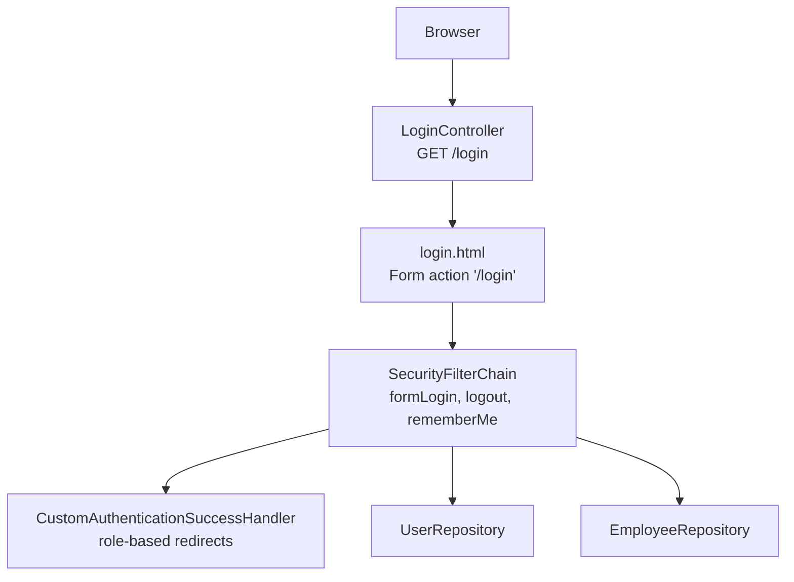
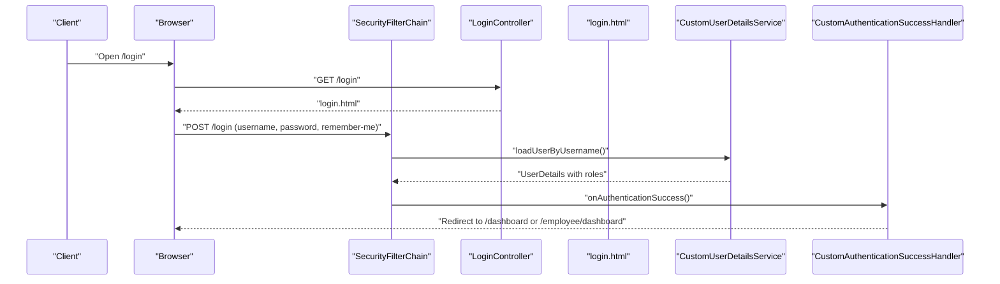
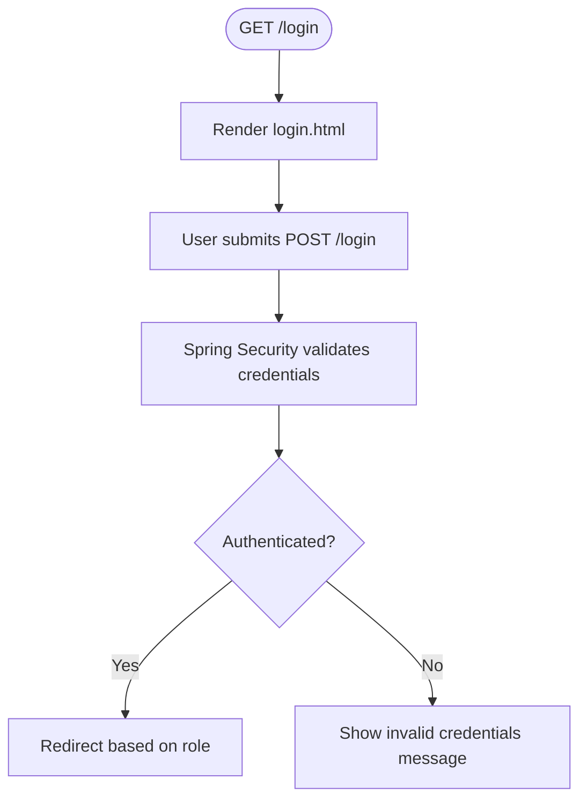
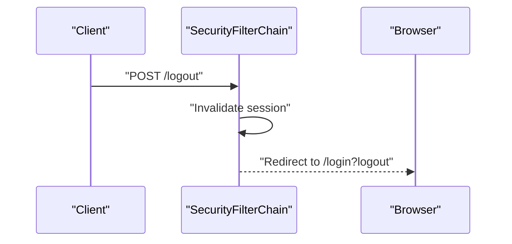
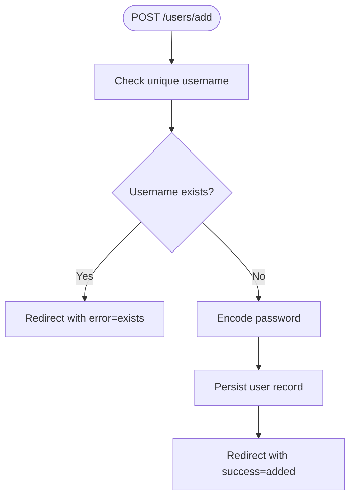
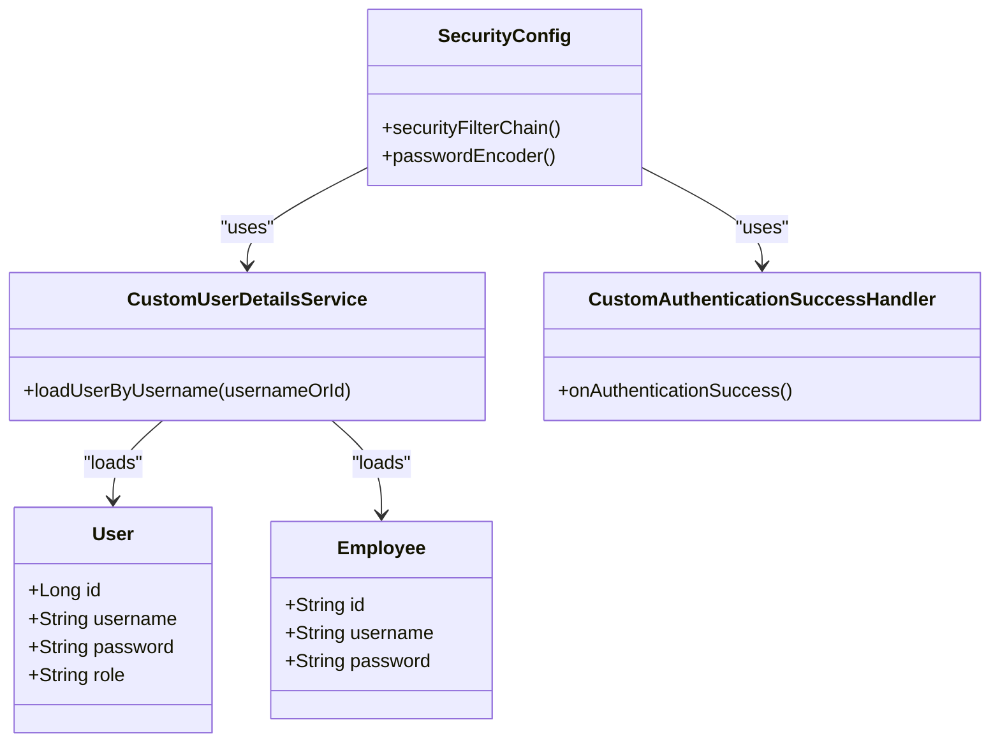
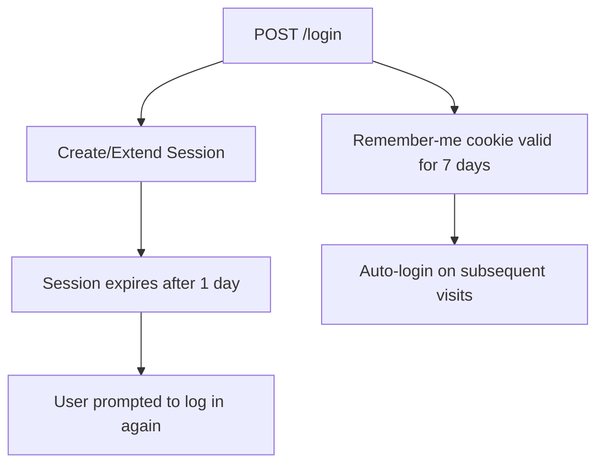
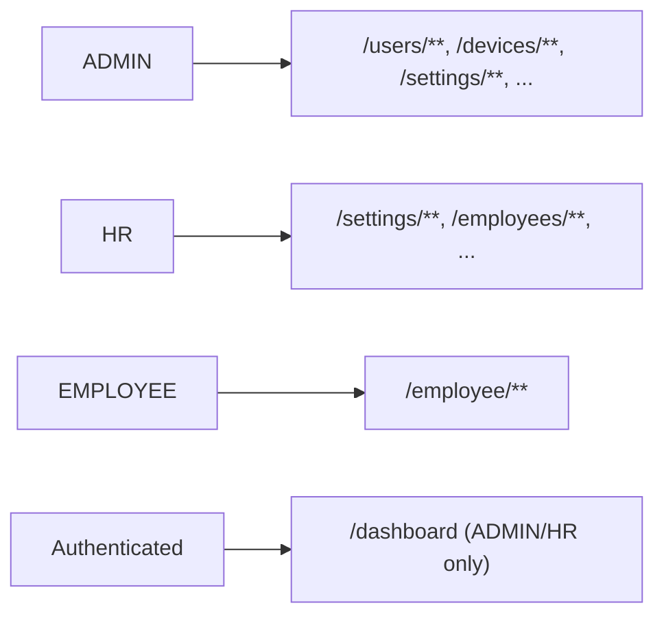
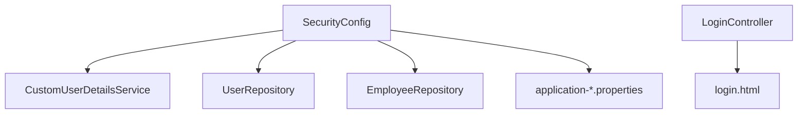

# Authentication API

<cite>
**Referenced Files in This Document**
- [SecurityConfig.java](file://src/main/java/root/cyb/mh/attendancesystem/config/SecurityConfig.java)
- [CustomAuthenticationSuccessHandler.java](file://src/main/java/root/cyb/mh/attendancesystem/config/CustomAuthenticationSuccessHandler.java)
- [CustomUserDetailsService.java](file://src/main/java/root/cyb/mh/attendancesystem/service/CustomUserDetailsService.java)
- [LoginController.java](file://src/main/java/root/cyb/mh/attendancesystem/controller/LoginController.java)
- [UserController.java](file://src/main/java/root/cyb/mh/attendancesystem/controller/UserController.java)
- [User.java](file://src/main/java/root/cyb/mh/attendancesystem/model/User.java)
- [Employee.java](file://src/main/java/root/cyb/mh/attendancesystem/model/Employee.java)
- [login.html](file://src/main/resources/templates/login.html)
- [application-prod.properties](file://src/main/resources/application-prod.properties)
- [application-dev.properties](file://src/main/resources/application-dev.properties)
</cite>

## Table of Contents
1. [Introduction](#introduction)
2. [Project Structure](#project-structure)
3. [Core Components](#core-components)
4. [Architecture Overview](#architecture-overview)
5. [Detailed Component Analysis](#detailed-component-analysis)
6. [Dependency Analysis](#dependency-analysis)
7. [Performance Considerations](#performance-considerations)
8. [Troubleshooting Guide](#troubleshooting-guide)
9. [Conclusion](#conclusion)

## Introduction
This document describes the authentication system for the Skylink Attendance System backend. It focuses on the available authentication endpoints and mechanisms, including login, logout, and user registration. It also documents session management, role-based access control, and security considerations such as CSRF protection and session timeouts.

The backend uses Spring Security with form-based authentication. The login page is served via a dedicated controller and Thymeleaf template. Users can authenticate using either administrative accounts stored in the database or employee credentials derived from employee records. Role-based access control restricts access to various application areas.

## Project Structure
Authentication-related components are organized across configuration, controllers, services, models, and templates:

- Security configuration defines form login, logout, remember-me, and authorization rules.
- Controllers expose the login page and manage user creation.
- Services handle user lookup and role assignment.
- Models represent administrative users and employees.
- Templates render the login page and support form submission.

**Diagram sources**
- [SecurityConfig.java:18-84](file://src/main/java/root/cyb/mh/attendancesystem/config/SecurityConfig.java#L18-L84)
- [LoginController.java:9-12](file://src/main/java/root/cyb/mh/attendancesystem/controller/LoginController.java#L9-L12)
- [login.html:68](file://src/main/resources/templates/login.html#L68)

**Section sources**
- [SecurityConfig.java:18-84](file://src/main/java/root/cyb/mh/attendancesystem/config/SecurityConfig.java#L18-L84)
- [LoginController.java:9-12](file://src/main/java/root/cyb/mh/attendancesystem/controller/LoginController.java#L9-L12)
- [login.html:68](file://src/main/resources/templates/login.html#L68)

## Core Components
- Form-based authentication with Spring Security
- Login page served at GET /login
- Form submission to POST /login handled by Spring Security
- Logout via POST /logout with success redirect to /login?logout
- Remember-me token with 7-day validity
- Role-based access control for protected paths
- User registration endpoint for administrative users

**Section sources**
- [SecurityConfig.java:50-60](file://src/main/java/root/cyb/mh/attendancesystem/config/SecurityConfig.java#L50-L60)
- [SecurityConfig.java:54-56](file://src/main/java/root/cyb/mh/attendancesystem/config/SecurityConfig.java#L54-L56)
- [UserController.java:31-42](file://src/main/java/root/cyb/mh/attendancesystem/controller/UserController.java#L31-L42)

## Architecture Overview
The authentication flow integrates browser requests, Spring Security, and custom handlers:

**Diagram sources**
- [SecurityConfig.java:50-53](file://src/main/java/root/cyb/mh/attendancesystem/config/SecurityConfig.java#L50-L53)
- [CustomUserDetailsService.java:24-52](file://src/main/java/root/cyb/mh/attendancesystem/service/CustomUserDetailsService.java#L24-L52)
- [CustomAuthenticationSuccessHandler.java:27-64](file://src/main/java/root/cyb/mh/attendancesystem/config/CustomAuthenticationSuccessHandler.java#L27-L64)
- [LoginController.java:9-12](file://src/main/java/root/cyb/mh/attendancesystem/controller/LoginController.java#L9-L12)
- [login.html:68](file://src/main/resources/templates/login.html#L68)

## Detailed Component Analysis

### Login Endpoint
- Method: GET
- URL: /login
- Purpose: Serve the login page
- Behavior: Returns the login Thymeleaf template
- Notes: The form action on the template submits to /login using POST

**Diagram sources**
- [LoginController.java:9-12](file://src/main/java/root/cyb/mh/attendancesystem/controller/LoginController.java#L9-L12)
- [login.html:68](file://src/main/resources/templates/login.html#L68)
- [SecurityConfig.java:50-53](file://src/main/java/root/cyb/mh/attendancesystem/config/SecurityConfig.java#L50-L53)

**Section sources**
- [LoginController.java:9-12](file://src/main/java/root/cyb/mh/attendancesystem/controller/LoginController.java#L9-L12)
- [login.html:68](file://src/main/resources/templates/login.html#L68)

### Logout Endpoint
- Method: POST
- URL: /logout
- Purpose: Invalidate the current session and redirect to the login page with a logout message
- Behavior: Uses configured logout URL and success URL

**Diagram sources**
- [SecurityConfig.java:57-60](file://src/main/java/root/cyb/mh/attendancesystem/config/SecurityConfig.java#L57-L60)

**Section sources**
- [SecurityConfig.java:57-60](file://src/main/java/root/cyb/mh/attendancesystem/config/SecurityConfig.java#L57-L60)

### User Registration Endpoint
- Method: POST
- URL: /users/add
- Purpose: Create a new administrative user
- Request parameters:
  - username: unique identifier for the user
  - password: plaintext password (will be encoded server-side)
  - role: ADMIN or HR
- Response: Redirects to /users with success or error query parameters

**Diagram sources**
- [UserController.java:31-42](file://src/main/java/root/cyb/mh/attendancesystem/controller/UserController.java#L31-L42)

**Section sources**
- [UserController.java:31-42](file://src/main/java/root/cyb/mh/attendancesystem/controller/UserController.java#L31-L42)

### Password Reset
There is no dedicated password reset endpoint exposed by the controllers reviewed. Administrative users can be created with initial passwords via the registration endpoint. Employees use their employee identifiers for authentication; their "password" is derived from the employee record.

**Section sources**
- [UserController.java:31-42](file://src/main/java/root/cyb/mh/attendancesystem/controller/UserController.java#L31-L42)
- [CustomUserDetailsService.java:24-52](file://src/main/java/root/cyb/mh/attendancesystem/service/CustomUserDetailsService.java#L24-L52)

### Authentication Mechanisms
- Form-based authentication with Spring Security
- Login page served at /login
- Credentials validated against:
  - Administrative users stored in the database
  - Employee records where the employee's username field serves as the hashed password
- Role-based redirection after successful login:
  - ADMIN/HR → /dashboard
  - EMPLOYEE → /employee/dashboard

**Diagram sources**
- [SecurityConfig.java:18-89](file://src/main/java/root/cyb/mh/attendancesystem/config/SecurityConfig.java#L18-L89)
- [CustomUserDetailsService.java:16-52](file://src/main/java/root/cyb/mh/attendancesystem/service/CustomUserDetailsService.java#L16-L52)
- [CustomAuthenticationSuccessHandler.java:19-64](file://src/main/java/root/cyb/mh/attendancesystem/config/CustomAuthenticationSuccessHandler.java#L19-L64)
- [User.java:9-23](file://src/main/java/root/cyb/mh/attendancesystem/model/User.java#L9-L23)
- [Employee.java:13-39](file://src/main/java/root/cyb/mh/attendancesystem/model/Employee.java#L13-L39)

**Section sources**
- [SecurityConfig.java:18-89](file://src/main/java/root/cyb/mh/attendancesystem/config/SecurityConfig.java#L18-L89)
- [CustomUserDetailsService.java:24-52](file://src/main/java/root/cyb/mh/attendancesystem/service/CustomUserDetailsService.java#L24-L52)
- [CustomAuthenticationSuccessHandler.java:27-64](file://src/main/java/root/cyb/mh/attendancesystem/config/CustomAuthenticationSuccessHandler.java#L27-L64)
- [User.java:9-23](file://src/main/java/root/cyb/mh/attendancesystem/model/User.java#L9-L23)
- [Employee.java:13-39](file://src/main/java/root/cyb/mh/attendancesystem/model/Employee.java#L13-L39)

### Session Management and Token Handling
- Session timeout is configured to 1 day via application properties
- Remember-me functionality is enabled with a 7-day validity period
- CSRF protection is disabled in the security configuration

**Diagram sources**
- [SecurityConfig.java:54-60](file://src/main/java/root/cyb/mh/attendancesystem/config/SecurityConfig.java#L54-L60)
- [application-prod.properties:17](file://src/main/resources/application-prod.properties#L17)
- [application-dev.properties:17](file://src/main/resources/application-dev.properties#L17)

**Section sources**
- [SecurityConfig.java:54-60](file://src/main/java/root/cyb/mh/attendancesystem/config/SecurityConfig.java#L54-L60)
- [application-prod.properties:17](file://src/main/resources/application-prod.properties#L17)
- [application-dev.properties:17](file://src/main/resources/application-dev.properties#L17)

### Role-Based Access Patterns
- ADMIN and HR users can access administrative areas and dashboards
- Employee users can access employee-specific areas
- Authorization rules are defined centrally in the security configuration

**Diagram sources**
- [SecurityConfig.java:28-48](file://src/main/java/root/cyb/mh/attendancesystem/config/SecurityConfig.java#L28-L48)

**Section sources**
- [SecurityConfig.java:28-48](file://src/main/java/root/cyb/mh/attendancesystem/config/SecurityConfig.java#L28-L48)

## Dependency Analysis
Authentication depends on:
- Security configuration for form login, logout, remember-me, and authorization
- Custom user details service for loading users and assigning roles
- Login controller and template for serving the login page
- Application properties for session timeout

**Diagram sources**
- [SecurityConfig.java:18-89](file://src/main/java/root/cyb/mh/attendancesystem/config/SecurityConfig.java#L18-L89)
- [CustomUserDetailsService.java:16-52](file://src/main/java/root/cyb/mh/attendancesystem/service/CustomUserDetailsService.java#L16-L52)
- [LoginController.java:9-12](file://src/main/java/root/cyb/mh/attendancesystem/controller/LoginController.java#L9-L12)
- [login.html:68](file://src/main/resources/templates/login.html#L68)
- [application-prod.properties:17](file://src/main/resources/application-prod.properties#L17)
- [application-dev.properties:17](file://src/main/resources/application-dev.properties#L17)

**Section sources**
- [SecurityConfig.java:18-89](file://src/main/java/root/cyb/mh/attendancesystem/config/SecurityConfig.java#L18-L89)
- [CustomUserDetailsService.java:16-52](file://src/main/java/root/cyb/mh/attendancesystem/service/CustomUserDetailsService.java#L16-L52)
- [LoginController.java:9-12](file://src/main/java/root/cyb/mh/attendancesystem/controller/LoginController.java#L9-L12)
- [login.html:68](file://src/main/resources/templates/login.html#L68)
- [application-prod.properties:17](file://src/main/resources/application-prod.properties#L17)
- [application-dev.properties:17](file://src/main/resources/application-dev.properties#L17)

## Performance Considerations
- Password encoding uses BCrypt, which is computationally intensive; ensure appropriate server capacity for concurrent logins
- Remember-me token validity impacts session lifecycle; adjust as needed for security and usability trade-offs
- Session timeout affects idle user retention; verify alignment with organizational policies

[No sources needed since this section provides general guidance]

## Troubleshooting Guide
- Invalid credentials: The login page displays an error message when authentication fails
- Logout success: The login page shows a success message after logging out
- Session timeout: Users are redirected to the login page after the session expires
- CSRF errors: CSRF is disabled; if encountering 403 errors, verify form actions and ensure CSRF is enabled or forms include CSRF tokens

**Section sources**
- [login.html:61-66](file://src/main/resources/templates/login.html#L61-L66)
- [SecurityConfig.java:81](file://src/main/java/root/cyb/mh/attendancesystem/config/SecurityConfig.java#L81)

## Conclusion
The authentication system provides form-based login, logout, and user registration for administrative users. It supports role-based access control and includes remember-me and session timeout configurations. CSRF protection is currently disabled to maintain compatibility with existing forms. Administrators can create new users via the registration endpoint, while employees authenticate using employee identifiers.