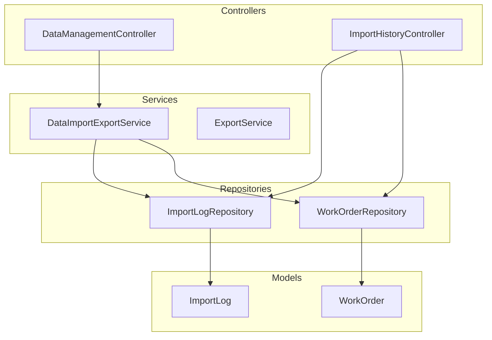
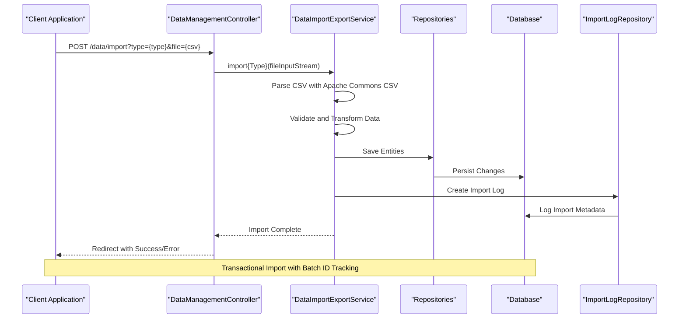
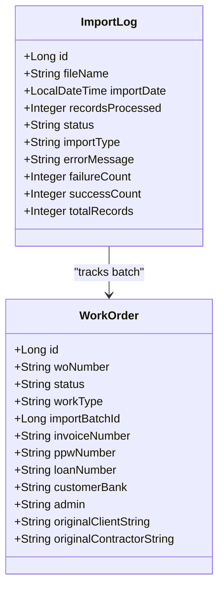
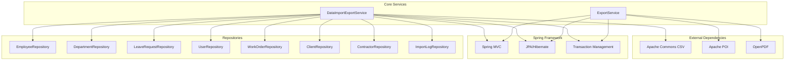

# Data Management API

<cite>
**Referenced Files in This Document**
- [DataManagementController.java](file://src/main/java/root/cyb/mh/attendancesystem/controller/DataManagementController.java)
- [ImportHistoryController.java](file://src/main/java/root/cyb/mh/attendancesystem/controller/ImportHistoryController.java)
- [DataImportExportService.java](file://src/main/java/root/cyb/mh/attendancesystem/service/DataImportExportService.java)
- [ExportService.java](file://src/main/java/root/cyb/mh/attendancesystem/service/ExportService.java)
- [ImportLog.java](file://src/main/java/root/cyb/mh/attendancesystem/model/ImportLog.java)
- [ImportLogRepository.java](file://src/main/java/root/cyb/mh/attendancesystem/repository/ImportLogRepository.java)
- [WorkOrder.java](file://src/main/java/root/cyb/mh/attendancesystem/model/WorkOrder.java)
- [WorkOrderRepository.java](file://src/main/java/root/cyb/mh/attendancesystem/repository/WorkOrderRepository.java)
- [import-history.html](file://src/main/resources/templates/admin/import-history.html)
</cite>

## Table of Contents
1. [Introduction](#introduction)
2. [Project Structure](#project-structure)
3. [Core Components](#core-components)
4. [Architecture Overview](#architecture-overview)
5. [Detailed Component Analysis](#detailed-component-analysis)
6. [Dependency Analysis](#dependency-analysis)
7. [Performance Considerations](#performance-considerations)
8. [Troubleshooting Guide](#troubleshooting-guide)
9. [Conclusion](#conclusion)

## Introduction
This document provides comprehensive API documentation for data import/export and bulk operations endpoints in the Skylink Custom Backend system. The API enables administrators to perform CSV/Excel exports for various data types, import structured data from CSV files, track import history, and manage bulk operations with validation and error handling capabilities.

The system supports:
- CSV and Excel exports for employees, departments, leaves, devices, settings, users, and attendance reports
- CSV imports for employees, departments, leaves, devices, settings, users, and work orders
- Import history tracking with success/failure status and error reporting
- Bulk operations with transactional safety and batch ID tracking
- Data validation and transformation for robust import processing

## Project Structure
The data management functionality is organized across controllers, services, repositories, and models:

**Diagram sources**
- [DataManagementController.java:13-84](file://src/main/java/root/cyb/mh/attendancesystem/controller/DataManagementController.java#L13-L84)
- [ImportHistoryController.java:16-53](file://src/main/java/root/cyb/mh/attendancesystem/controller/ImportHistoryController.java#L16-L53)
- [DataImportExportService.java:16-37](file://src/main/java/root/cyb/mh/attendancesystem/service/DataImportExportService.java#L16-L37)

**Section sources**
- [DataManagementController.java:1-84](file://src/main/java/root/cyb/mh/attendancesystem/controller/DataManagementController.java#L1-L84)
- [ImportHistoryController.java:1-53](file://src/main/java/root/cyb/mh/attendancesystem/controller/ImportHistoryController.java#L1-L53)
- [DataImportExportService.java:1-925](file://src/main/java/root/cyb/mh/attendancesystem/service/DataImportExportService.java#L1-L925)

## Core Components

### Data Management Controller
The primary controller for data import/export operations with endpoints for:
- GET `/data/export` - CSV export endpoint for multiple data types
- POST `/data/import` - CSV import endpoint supporting multiple data types

**Section sources**
- [DataManagementController.java:14-82](file://src/main/java/root/cyb/mh/attendancesystem/controller/DataManagementController.java#L14-L82)

### Import History Controller
Administrative controller for import tracking and management:
- GET `/admin/imports` - View import history page
- POST `/admin/imports/{id}/delete` - Delete specific import batch
- POST `/admin/imports/cleanup` - Cleanup legacy data

**Section sources**
- [ImportHistoryController.java:17-52](file://src/main/java/root/cyb/mh/attendancesystem/controller/ImportHistoryController.java#L17-L52)

### Data Import/Export Service
Core service implementing all import/export functionality:
- CSV export methods for employees, departments, leaves, devices, settings, users
- CSV import methods for the same entities plus work orders
- Payment request export to CSV/PDF with customizable columns
- Transactional import processing with batch ID tracking
- Validation and transformation utilities for dates, currency, and percentages

**Section sources**
- [DataImportExportService.java:16-925](file://src/main/java/root/cyb/mh/attendancesystem/service/DataImportExportService.java#L16-L925)

### Export Service
Additional export functionality for attendance reports:
- Daily, weekly, monthly attendance reports in CSV/Excel formats
- Employee-specific reports with detailed statistics
- Bank advice exports for payroll processing

**Section sources**
- [ExportService.java:22-579](file://src/main/java/root/cyb/mh/attendancesystem/service/ExportService.java#L22-L579)

## Architecture Overview

**Diagram sources**
- [DataManagementController.java:49-82](file://src/main/java/root/cyb/mh/attendancesystem/controller/DataManagementController.java#L49-L82)
- [DataImportExportService.java:750-884](file://src/main/java/root/cyb/mh/attendancesystem/service/DataImportExportService.java#L750-L884)

## Detailed Component Analysis

### Import/Export Endpoints

#### CSV Export Endpoints
The system provides CSV export functionality for multiple data types:

**Endpoint**: `GET /data/export`
**Parameters**:
- `type`: String - Export type (employees, departments, leaves, devices, settings, users)

**Response**: CSV file download with appropriate headers

**Supported Types**:
- `employees`: Exports employee ID, name, department ID, card ID
- `departments`: Exports department ID, name  
- `leaves`: Exports leave request details with status
- `devices`: Exports device information
- `settings`: Exports work schedule configurations
- `users`: Exports user credentials and roles

**Section sources**
- [DataManagementController.java:20-47](file://src/main/java/root/cyb/mh/attendancesystem/controller/DataManagementController.java#L20-L47)
- [DataImportExportService.java:40-92](file://src/main/java/root/cyb/mh/attendancesystem/service/DataImportExportService.java#L40-L92)

#### CSV Import Endpoints
The import system supports multiple data types with validation:

**Endpoint**: `POST /data/import`
**Parameters**:
- `type`: String - Import type (employees, departments, leaves, devices, settings, users, workorders)
- `file`: MultipartFile - CSV file containing data

**Response**: Redirect with success/error status

**Import Processing Flow**:
1. File validation and emptiness check
2. Type-specific CSV parsing with Apache Commons CSV
3. Data transformation and validation
4. Entity creation/update with transactional safety
5. Import log creation with batch ID tracking

**Section sources**
- [DataManagementController.java:49-82](file://src/main/java/root/cyb/mh/attendancesystem/controller/DataManagementController.java#L49-L82)
- [DataImportExportService.java:96-209](file://src/main/java/root/cyb/mh/attendancesystem/service/DataImportExportService.java#L96-L209)

### Import History Management

#### Import History Endpoint
**Endpoint**: `GET /admin/imports`
**Response**: HTML page displaying import history with status indicators

**Features**:
- View all import operations with timestamps and record counts
- Success/failure status with error messages
- Batch ID tracking for bulk operations
- Administrative controls for undo operations

**Section sources**
- [ImportHistoryController.java:26-32](file://src/main/java/root/cyb/mh/attendancesystem/controller/ImportHistoryController.java#L26-L32)
- [import-history.html:52-103](file://src/main/resources/templates/admin/import-history.html#L52-L103)

#### Undo Import Operations
**Endpoint**: `POST /admin/imports/{id}/delete`
**Action**: Permanently removes all work orders associated with a specific import batch

**Cleanup Operations**:
**Endpoint**: `POST /admin/imports/cleanup`
**Action**: Removes legacy data not linked to any import batch

**Section sources**
- [ImportHistoryController.java:34-51](file://src/main/java/root/cyb/mh/attendancesystem/controller/ImportHistoryController.java#L34-L51)

### Data Models and Validation

#### Import Log Model
Tracks import operations with comprehensive metadata:

**Diagram sources**
- [ImportLog.java:8-113](file://src/main/java/root/cyb/mh/attendancesystem/model/ImportLog.java#L8-L113)
- [WorkOrder.java:11-109](file://src/main/java/root/cyb/mh/attendancesystem/model/WorkOrder.java#L11-L109)

#### Data Transformation Utilities
The service includes robust data transformation methods:

**Date Parsing**: Supports multiple date formats (MM-dd-yy, M-d-yy, MM/dd/yy, M/d/yy)
**Currency Processing**: Handles dollar amounts with commas and spaces
**Percentage Conversion**: Processes percentage values with % symbol removal
**Null Safety**: Comprehensive null checking and default value assignment

**Section sources**
- [DataImportExportService.java:886-923](file://src/main/java/root/cyb/mh/attendancesystem/service/DataImportExportService.java#L886-L923)

### Payment Request Export Functionality

#### Customizable Export Columns
The system supports flexible payment request exports with predefined column mappings:

**Available Columns**:
- date: Date of Request
- requester: Requested By
- workOrder: Work Order
- amount: Amount
- contractor: Contractor
- method: Method ID
- accountDetails: Account Details
- client: Client Code
- priority: Priority
- approval: Approval Authority
- reason: Reason
- status: Approval Status
- paymentStatus: Payment Status
- ppw: PPW Update
- refNumber: Payment Ref #
- internalNotes: Internal Notes

**Section sources**
- [DataImportExportService.java:214-257](file://src/main/java/root/cyb/mh/attendancesystem/service/DataImportExportService.java#L214-L257)

## Dependency Analysis

**Diagram sources**
- [DataImportExportService.java:3-9](file://src/main/java/root/cyb/mh/attendancesystem/service/DataImportExportService.java#L3-L9)
- [ExportService.java:3-7](file://src/main/java/root/cyb/mh/attendancesystem/service/ExportService.java#L3-L7)

### Repository Layer
The system uses Spring Data JPA repositories for data access:

**Core Repositories**:
- EmployeeRepository: Employee entity management
- DepartmentRepository: Department entity management  
- LeaveRequestRepository: Leave request processing
- UserRepository: User authentication and authorization
- WorkOrderRepository: Work order lifecycle management
- ClientRepository: Client entity management
- ContractorRepository: Contractor entity management
- ImportLogRepository: Import operation tracking

**Section sources**
- [DataImportExportService.java:19-36](file://src/main/java/root/cyb/mh/attendancesystem/service/DataImportExportService.java#L19-L36)
- [WorkOrderRepository.java:15-80](file://src/main/java/root/cyb/mh/attendancesystem/repository/WorkOrderRepository.java#L15-L80)

## Performance Considerations

### Import Performance Optimization
- **Batch Processing**: Work orders are processed in batches with transactional boundaries
- **Memory Management**: CSV parsing uses streaming with BufferedReader for large files
- **Database Optimization**: Entities are saved in bulk operations to minimize database round trips
- **Error Recovery**: Failed imports are logged with detailed error messages for debugging

### Export Performance Optimization
- **Streaming Output**: CSV exports use PrintWriter for memory-efficient streaming
- **Excel Optimization**: Apache POI workbook creation with auto-size columns for optimal file sizes
- **Lazy Loading**: Export services avoid unnecessary entity loading through DTO patterns

### Scalability Recommendations
- **File Size Limits**: Configure appropriate upload limits in application.properties
- **Background Processing**: Consider async processing for large imports using Spring TaskExecutor
- **Database Indexing**: Ensure proper indexing on frequently queried fields (work order numbers, employee IDs)

## Troubleshooting Guide

### Common Import Issues

#### File Upload Problems
**Symptoms**: Import fails with empty file error
**Solution**: Verify file upload contains data and proper CSV format

#### Data Validation Errors
**Symptoms**: Import logs show validation failures
**Common Causes**:
- Missing required fields in CSV
- Incorrect data types (dates, numbers)
- Invalid foreign key references
- Duplicate identifiers

#### Transaction Rollback Issues
**Symptoms**: Partial imports with inconsistent data
**Solution**: Check database constraints and ensure proper transaction boundaries

### Import History Management

#### Undo Operation Failures
**Symptoms**: Cannot undo import operations
**Causes**:
- Missing batch ID linking
- Data already deleted
- Permission issues

**Section sources**
- [ImportHistoryController.java:34-51](file://src/main/java/root/cyb/mh/attendancesystem/controller/ImportHistoryController.java#L34-L51)
- [DataImportExportService.java:750-884](file://src/main/java/root/cyb/mh/attendancesystem/service/DataImportExportService.java#L750-L884)

### Error Handling and Logging

The system implements comprehensive error handling:
- Detailed error messages stored in ImportLog.errorMessage
- Transaction rollback on import failures
- Graceful degradation for optional fields
- Validation feedback for malformed CSV data

**Section sources**
- [ImportLog.java:24-25](file://src/main/java/root/cyb/mh/attendancesystem/model/ImportLog.java#L24-L25)
- [DataImportExportService.java:877-883](file://src/main/java/root/cyb/mh/attendancesystem/service/DataImportExportService.java#L877-L883)

## Conclusion

The Data Management API provides a comprehensive solution for data import/export operations with robust validation, transactional safety, and administrative oversight. Key strengths include:

- **Flexible Import/Export**: Support for multiple data types with customizable export columns
- **Transaction Safety**: Batch ID tracking ensures reliable undo operations
- **Administrative Controls**: Comprehensive import history with error tracking
- **Performance Optimization**: Streaming processing for large datasets
- **Extensible Design**: Modular architecture supporting future data types and formats

The system is production-ready with proper error handling, logging, and administrative interfaces for managing data operations at scale.