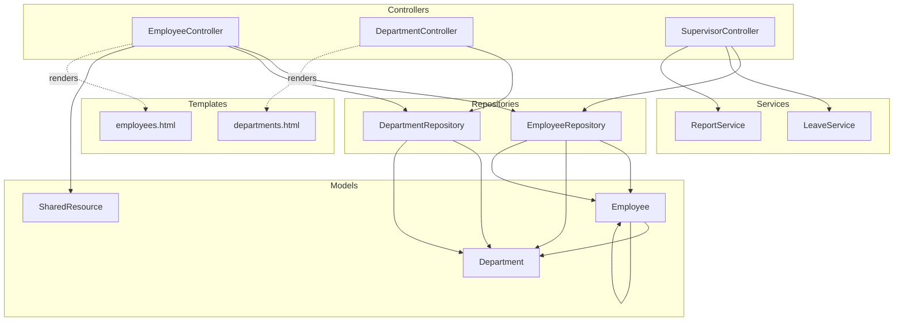
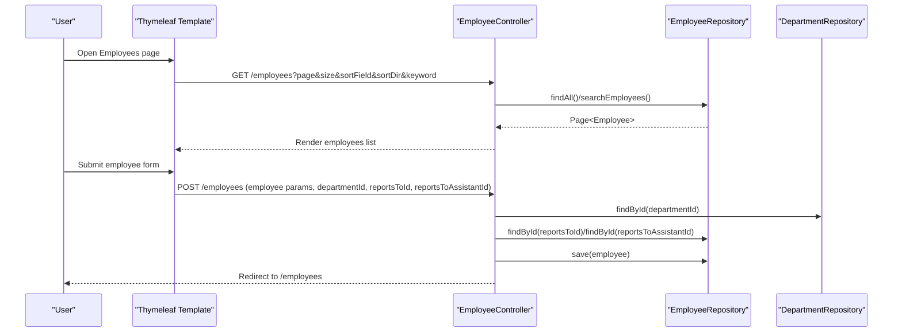
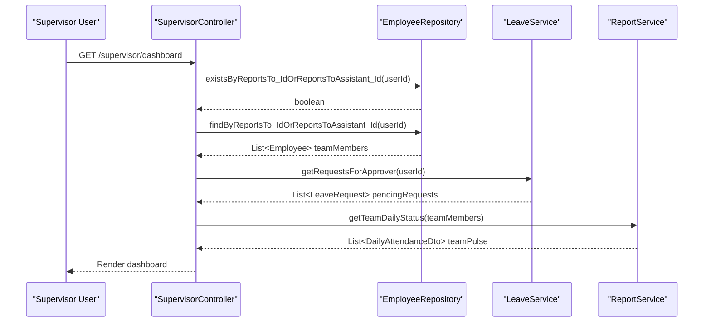
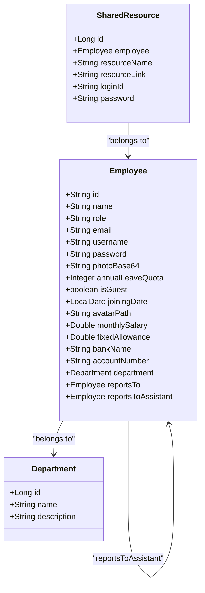
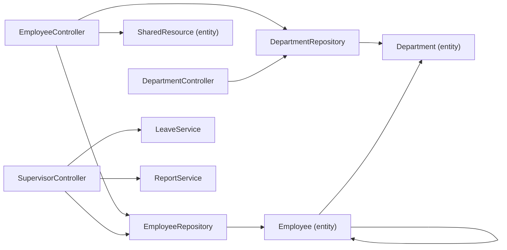

# Employee Management API

<cite>
**Referenced Files in This Document**
- [EmployeeController.java](file://src/main/java/root/cyb/mh/attendancesystem/controller/EmployeeController.java)
- [DepartmentController.java](file://src/main/java/root/cyb/mh/attendancesystem/controller/DepartmentController.java)
- [SupervisorController.java](file://src/main/java/root/cyb/mh/attendancesystem/controller/SupervisorController.java)
- [Employee.java](file://src/main/java/root/cyb/mh/attendancesystem/model/Employee.java)
- [Department.java](file://src/main/java/root/cyb/mh/attendancesystem/model/Department.java)
- [EmployeeRepository.java](file://src/main/java/root/cyb/mh/attendancesystem/repository/EmployeeRepository.java)
- [DepartmentRepository.java](file://src/main/java/root/cyb/mh/attendancesystem/repository/DepartmentRepository.java)
- [SharedResource.java](file://src/main/java/root/cyb/mh/attendancesystem/model/SharedResource.java)
- [employees.html](file://src/main/resources/templates/employees.html)
- [departments.html](file://src/main/resources/templates/departments.html)
- [LeaveService.java](file://src/main/java/root/cyb/mh/attendancesystem/service/LeaveService.java)
- [ReportService.java](file://src/main/java/root/cyb/mh/attendancesystem/service/ReportService.java)
- [DailyAttendanceDto.java](file://src/main/java/root/cyb/mh/attendancesystem/dto/DailyAttendanceDto.java)
- [GlobalExceptionHandler.java](file://src/main/java/root/cyb/mh/attendancesystem/exception/GlobalExceptionHandler.java)
</cite>

## Table of Contents
1. [Introduction](#introduction)
2. [Project Structure](#project-structure)
3. [Core Components](#core-components)
4. [Architecture Overview](#architecture-overview)
5. [Detailed Component Analysis](#detailed-component-analysis)
6. [Dependency Analysis](#dependency-analysis)
7. [Performance Considerations](#performance-considerations)
8. [Troubleshooting Guide](#troubleshooting-guide)
9. [Conclusion](#conclusion)
10. [Appendices](#appendices)

## Introduction
This document describes the Employee Management API surface implemented in the backend. It covers:
- Employee CRUD operations (create, read, update, delete)
- Employee search and filtering
- Department management (create, list, delete with constraints)
- Supervisor assignment and management
- Bulk operations (bulk department assignment)
- Relationship management (department hierarchy via foreign keys, supervisor relationships)
- Request/response schemas and validation rules
- Examples of bulk operations and data validation rules

The backend uses Spring MVC controllers with Thymeleaf templates for rendering, and JPA repositories for persistence. The API endpoints are primarily HTML forms and redirects, with supporting JSON APIs not exposed in the current codebase.

## Project Structure
The relevant components for employee management are organized by layers:
- Controllers: handle HTTP requests for employees, departments, and supervisors
- Models: entity definitions for Employee, Department, SharedResource
- Repositories: JPA repositories for persistence
- Services: business logic for reporting and leave workflows
- Templates: Thymeleaf pages for UI and bulk actions

**Diagram sources**
- [EmployeeController.java:16-213](file://src/main/java/root/cyb/mh/attendancesystem/controller/EmployeeController.java#L16-L213)
- [DepartmentController.java:14-69](file://src/main/java/root/cyb/mh/attendancesystem/controller/DepartmentController.java#L14-L69)
- [SupervisorController.java:21-215](file://src/main/java/root/cyb/mh/attendancesystem/controller/SupervisorController.java#L21-L215)
- [Employee.java:13-64](file://src/main/java/root/cyb/mh/attendancesystem/model/Employee.java#L13-L64)
- [Department.java:15-22](file://src/main/java/root/cyb/mh/attendancesystem/model/Department.java#L15-L22)
- [SharedResource.java:10-46](file://src/main/java/root/cyb/mh/attendancesystem/model/SharedResource.java#L10-L46)
- [EmployeeRepository.java:12-31](file://src/main/java/root/cyb/mh/attendancesystem/repository/EmployeeRepository.java#L12-L31)
- [DepartmentRepository.java:6-8](file://src/main/java/root/cyb/mh/attendancesystem/repository/DepartmentRepository.java#L6-L8)
- [employees.html:184-296](file://src/main/resources/templates/employees.html#L184-L296)
- [departments.html:83-114](file://src/main/resources/templates/departments.html#L83-L114)

**Section sources**
- [EmployeeController.java:16-213](file://src/main/java/root/cyb/mh/attendancesystem/controller/EmployeeController.java#L16-L213)
- [DepartmentController.java:14-69](file://src/main/java/root/cyb/mh/attendancesystem/controller/DepartmentController.java#L14-L69)
- [SupervisorController.java:21-215](file://src/main/java/root/cyb/mh/attendancesystem/controller/SupervisorController.java#L21-L215)
- [Employee.java:13-64](file://src/main/java/root/cyb/mh/attendancesystem/model/Employee.java#L13-L64)
- [Department.java:15-22](file://src/main/java/root/cyb/mh/attendancesystem/model/Department.java#L15-L22)
- [SharedResource.java:10-46](file://src/main/java/root/cyb/mh/attendancesystem/model/SharedResource.java#L10-L46)
- [EmployeeRepository.java:12-31](file://src/main/java/root/cyb/mh/attendancesystem/repository/EmployeeRepository.java#L12-L31)
- [DepartmentRepository.java:6-8](file://src/main/java/root/cyb/mh/attendancesystem/repository/DepartmentRepository.java#L6-L8)
- [employees.html:184-296](file://src/main/resources/templates/employees.html#L184-L296)
- [departments.html:83-114](file://src/main/resources/templates/departments.html#L83-L114)

## Core Components
- EmployeeController: Provides endpoints for listing, creating/updating, deleting employees, searching, and bulk department assignment. Also manages employee-specific shared resources.
- DepartmentController: Provides endpoints for listing, creating/updating, and deleting departments with constraints (preventing deletion if employees exist).
- SupervisorController: Provides supervisor dashboard and approval workflows for advance requests; also enforces supervisor access checks.
- Employee/Department/SharedResource models: Define the data structures and relationships.
- EmployeeRepository/DepartmentRepository: JPA repositories with search and relationship queries.
- Thymeleaf templates: Define the HTML forms and UI for employee and department management.

**Section sources**
- [EmployeeController.java:16-213](file://src/main/java/root/cyb/mh/attendancesystem/controller/EmployeeController.java#L16-L213)
- [DepartmentController.java:14-69](file://src/main/java/root/cyb/mh/attendancesystem/controller/DepartmentController.java#L14-L69)
- [SupervisorController.java:21-215](file://src/main/java/root/cyb/mh/attendancesystem/controller/SupervisorController.java#L21-L215)
- [Employee.java:13-64](file://src/main/java/root/cyb/mh/attendancesystem/model/Employee.java#L13-L64)
- [Department.java:15-22](file://src/main/java/root/cyb/mh/attendancesystem/model/Department.java#L15-L22)
- [SharedResource.java:10-46](file://src/main/java/root/cyb/mh/attendancesystem/model/SharedResource.java#L10-L46)
- [EmployeeRepository.java:12-31](file://src/main/java/root/cyb/mh/attendancesystem/repository/EmployeeRepository.java#L12-L31)
- [DepartmentRepository.java:6-8](file://src/main/java/root/cyb/mh/attendancesystem/repository/DepartmentRepository.java#L6-L8)
- [employees.html:184-296](file://src/main/resources/templates/employees.html#L184-L296)
- [departments.html:83-114](file://src/main/resources/templates/departments.html#L83-L114)

## Architecture Overview
The system follows a layered architecture:
- Presentation: Thymeleaf templates render forms and lists
- Controllers: Handle HTTP requests and coordinate repositories/services
- Services: Business logic for reporting and leave workflows
- Persistence: JPA repositories backed by the database

**Diagram sources**
- [EmployeeController.java:32-139](file://src/main/java/root/cyb/mh/attendancesystem/controller/EmployeeController.java#L32-L139)
- [EmployeeRepository.java:12-31](file://src/main/java/root/cyb/mh/attendancesystem/repository/EmployeeRepository.java#L12-L31)
- [DepartmentRepository.java:6-8](file://src/main/java/root/cyb/mh/attendancesystem/repository/DepartmentRepository.java#L6-L8)
- [employees.html:184-296](file://src/main/resources/templates/employees.html#L184-L296)

## Detailed Component Analysis

### Employee Management Endpoints
- GET /employees
  - Purpose: List employees with pagination, sorting, and keyword search
  - Query parameters:
    - page: integer (default 0)
    - size: integer (default 10)
    - sortField: string (default id)
    - sortDir: string (default asc)
    - keyword: string (optional)
  - Response: Thymeleaf-rendered page with employees list, pagination controls, and sort links
  - Validation rules:
    - sortField must be one of id, name, department, role, email
    - sortDir must be asc or desc
    - keyword triggers a full-text search across name, email, role, designation, id, and department name
  - Example request:
    - GET /employees?page=0&size=20&sortField=name&sortDir=asc&keyword=john
  - Example response:
    - HTML page displaying paginated employees and search results

- POST /employees
  - Purpose: Create or update an employee
  - Form fields:
    - id: string (required for updates)
    - name: string
    - role: string
    - email: string
    - guest: boolean
    - annualLeaveQuota: integer
    - joiningDate: date
    - monthlySalary: number
    - fixedAllowance: number
    - bankName: string
    - accountNumber: string
    - designation: string
    - username: string (password; hashed if provided)
    - departmentId: long (optional)
    - reportsToId: string (optional)
    - reportsToAssistantId: string (optional)
  - Behavior:
    - If id exists, update editable fields and optionally update password
    - If id does not exist, create new employee and hash username if provided
    - Set department if departmentId provided
    - Set supervisor and assistant supervisor if IDs provided
  - Validation rules:
    - id must be unique and match device ID
    - username is optional; if provided, it is hashed before saving
    - reportsToId and reportsToAssistantId must reference existing employees
    - departmentId must reference an existing department
  - Example request:
    - POST /employees with form fields including id, name, role, email, departmentId, reportsToId
  - Example response:
    - Redirect to /employees

- GET /employees/delete/{id}
  - Purpose: Delete an employee by ID
  - Path variable:
    - id: string (employee ID)
  - Behavior:
    - Deletes the employee and redirects to /employees
  - Validation rules:
    - id must reference an existing employee

- POST /employees/bulk/assign-department
  - Purpose: Bulk assign department to selected employees
  - Form fields:
    - employeeIds: array of strings (selected employee IDs)
    - departmentId: long (target department)
  - Behavior:
    - Fetches department and employees, sets department on each employee, saves all
  - Validation rules:
    - employeeIds must be non-empty
    - departmentId must reference an existing department
  - Example request:
    - POST /employees/bulk/assign-department with employeeIds=[emp1,emp2] and departmentId=1
  - Example response:
    - Redirect to /employees

- GET /employees/{empId}/resources
  - Purpose: Manage shared resources for an employee
  - Path variables:
    - empId: string (employee ID)
  - Behavior:
    - Renders a page listing shared resources for the employee
  - Validation rules:
    - empId must reference an existing employee

- POST /employees/{empId}/resources
  - Purpose: Save or update a shared resource for an employee
  - Path variables:
    - empId: string (employee ID)
  - Form fields:
    - id: long (optional, existing resource ID)
    - resourceName: string
    - resourceLink: string
    - loginId: string
    - password: string
  - Behavior:
    - If id provided, update existing resource; otherwise create new
  - Validation rules:
    - resourceName is required
    - employee must exist

- GET /employees/{empId}/resources/delete/{resourceId}
  - Purpose: Delete a shared resource
  - Path variables:
    - empId: string
    - resourceId: long
  - Behavior:
    - Deletes the resource and redirects to resources page

**Section sources**
- [EmployeeController.java:32-162](file://src/main/java/root/cyb/mh/attendancesystem/controller/EmployeeController.java#L32-L162)
- [EmployeeRepository.java:23-30](file://src/main/java/root/cyb/mh/attendancesystem/repository/EmployeeRepository.java#L23-L30)
- [employees.html:184-296](file://src/main/resources/templates/employees.html#L184-L296)
- [employees.html:300-326](file://src/main/resources/templates/employees.html#L300-L326)

### Department Management Endpoints
- GET /departments
  - Purpose: List departments with sorting
  - Query parameters:
    - sortField: string (default id)
    - sortDir: string (default asc)
  - Response: Thymeleaf-rendered page with departments list and sort links
  - Validation rules:
    - sortField must be one of id, name, description
    - sortDir must be asc or desc

- POST /departments
  - Purpose: Create or update a department
  - Form fields:
    - id: long (optional)
    - name: string
    - description: string
  - Behavior:
    - If id provided, load existing; otherwise create new
    - Save department and redirect to /departments

- GET /departments/delete/{id}
  - Purpose: Delete a department
  - Path variable:
    - id: long
  - Behavior:
    - Prevents deletion if employees exist in the department
    - Otherwise deletes and redirects to /departments with success/error message

**Section sources**
- [DepartmentController.java:22-67](file://src/main/java/root/cyb/mh/attendancesystem/controller/DepartmentController.java#L22-L67)
- [DepartmentRepository.java:6-8](file://src/main/java/root/cyb/mh/attendancesystem/repository/DepartmentRepository.java#L6-L8)
- [departments.html:83-114](file://src/main/resources/templates/departments.html#L83-L114)

### Supervisor Relationships and Access Control
- SupervisorController enforces supervisor access and provides:
  - Dashboard with team members, pending leave requests, and team pulse
  - Approve/reject advance salary requests for team members
  - Access control ensuring only supervisors or admins can access supervisor features
- EmployeeRepository supports supervisor queries:
  - existsByReportsTo_IdOrReportsToAssistant_Id
  - findByReportsTo_IdOrReportsToAssistant_Id

**Diagram sources**
- [SupervisorController.java:32-139](file://src/main/java/root/cyb/mh/attendancesystem/controller/SupervisorController.java#L32-L139)
- [EmployeeRepository.java:15-19](file://src/main/java/root/cyb/mh/attendancesystem/repository/EmployeeRepository.java#L15-L19)
- [LeaveService.java:74-78](file://src/main/java/root/cyb/mh/attendancesystem/service/LeaveService.java#L74-L78)
- [ReportService.java:102-106](file://src/main/java/root/cyb/mh/attendancesystem/service/ReportService.java#L102-L106)

**Section sources**
- [SupervisorController.java:32-139](file://src/main/java/root/cyb/mh/attendancesystem/controller/SupervisorController.java#L32-L139)
- [EmployeeRepository.java:15-19](file://src/main/java/root/cyb/mh/attendancesystem/repository/EmployeeRepository.java#L15-L19)
- [LeaveService.java:74-78](file://src/main/java/root/cyb/mh/attendancesystem/service/LeaveService.java#L74-L78)
- [ReportService.java:102-106](file://src/main/java/root/cyb/mh/attendancesystem/service/ReportService.java#L102-L106)

### Data Models and Relationships

**Diagram sources**
- [Employee.java:13-64](file://src/main/java/root/cyb/mh/attendancesystem/model/Employee.java#L13-L64)
- [Department.java:15-22](file://src/main/java/root/cyb/mh/attendancesystem/model/Department.java#L15-L22)
- [SharedResource.java:10-46](file://src/main/java/root/cyb/mh/attendancesystem/model/SharedResource.java#L10-L46)

**Section sources**
- [Employee.java:13-64](file://src/main/java/root/cyb/mh/attendancesystem/model/Employee.java#L13-L64)
- [Department.java:15-22](file://src/main/java/root/cyb/mh/attendancesystem/model/Department.java#L15-L22)
- [SharedResource.java:10-46](file://src/main/java/root/cyb/mh/attendancesystem/model/SharedResource.java#L10-L46)

### Request and Response Schemas
- Employee Profile (form fields for create/update):
  - Required: id, name
  - Optional: role, email, guest, annualLeaveQuota, joiningDate, monthlySalary, fixedAllowance, bankName, accountNumber, designation, username, departmentId, reportsToId, reportsToAssistantId
- Department Profile (form fields for create/update):
  - Required: name, description
  - Optional: id
- Shared Resource (form fields for create/update):
  - Required: resourceName
  - Optional: id, resourceLink, loginId, password
- Bulk Department Assignment (form fields):
  - Required: employeeIds (array), departmentId

Validation rules:
- id uniqueness enforced by repository
- username hashing performed when provided
- reportsToId and reportsToAssistantId must reference existing employees
- departmentId must reference existing department
- Deleting a department fails if employees exist in that department

**Section sources**
- [EmployeeController.java:66-139](file://src/main/java/root/cyb/mh/attendancesystem/controller/EmployeeController.java#L66-L139)
- [DepartmentController.java:40-53](file://src/main/java/root/cyb/mh/attendancesystem/controller/DepartmentController.java#L40-L53)
- [EmployeeRepository.java:15-30](file://src/main/java/root/cyb/mh/attendancesystem/repository/EmployeeRepository.java#L15-L30)
- [DepartmentRepository.java:6-8](file://src/main/java/root/cyb/mh/attendancesystem/repository/DepartmentRepository.java#L6-L8)
- [employees.html:184-296](file://src/main/resources/templates/employees.html#L184-L296)
- [departments.html:83-114](file://src/main/resources/templates/departments.html#L83-L114)

### Examples of Bulk Operations
- Bulk department assignment:
  - Select multiple employees on the employees page
  - Click "Bulk Actions" -> "Assign Department"
  - Choose target department and submit
  - Backend updates all selected employees in a single operation

**Section sources**
- [EmployeeController.java:147-162](file://src/main/java/root/cyb/mh/attendancesystem/controller/EmployeeController.java#L147-L162)
- [employees.html:398-435](file://src/main/resources/templates/employees.html#L398-L435)

## Dependency Analysis
- Controllers depend on repositories for persistence and services for business logic
- Employee entity has relationships to Department and to itself (supervisor/assistant)
- Department entity is independent; deletion guarded by EmployeeRepository
- SupervisorController depends on EmployeeRepository, LeaveService, and ReportService

**Diagram sources**
- [EmployeeController.java:16-213](file://src/main/java/root/cyb/mh/attendancesystem/controller/EmployeeController.java#L16-L213)
- [DepartmentController.java:14-69](file://src/main/java/root/cyb/mh/attendancesystem/controller/DepartmentController.java#L14-L69)
- [SupervisorController.java:21-215](file://src/main/java/root/cyb/mh/attendancesystem/controller/SupervisorController.java#L21-L215)
- [EmployeeRepository.java:12-31](file://src/main/java/root/cyb/mh/attendancesystem/repository/EmployeeRepository.java#L12-L31)
- [DepartmentRepository.java:6-8](file://src/main/java/root/cyb/mh/attendancesystem/repository/DepartmentRepository.java#L6-L8)
- [Employee.java:13-64](file://src/main/java/root/cyb/mh/attendancesystem/model/Employee.java#L13-L64)
- [Department.java:15-22](file://src/main/java/root/cyb/mh/attendancesystem/model/Department.java#L15-L22)

**Section sources**
- [EmployeeController.java:16-213](file://src/main/java/root/cyb/mh/attendancesystem/controller/EmployeeController.java#L16-L213)
- [DepartmentController.java:14-69](file://src/main/java/root/cyb/mh/attendancesystem/controller/DepartmentController.java#L14-L69)
- [SupervisorController.java:21-215](file://src/main/java/root/cyb/mh/attendancesystem/controller/SupervisorController.java#L21-L215)
- [EmployeeRepository.java:12-31](file://src/main/java/root/cyb/mh/attendancesystem/repository/EmployeeRepository.java#L12-L31)
- [DepartmentRepository.java:6-8](file://src/main/java/root/cyb/mh/attendancesystem/repository/DepartmentRepository.java#L6-L8)
- [Employee.java:13-64](file://src/main/java/root/cyb/mh/attendancesystem/model/Employee.java#L13-L64)
- [Department.java:15-22](file://src/main/java/root/cyb/mh/attendancesystem/model/Department.java#L15-L22)

## Performance Considerations
- Pagination is supported for employee listing to avoid loading large datasets
- Search uses a single query with LIKE conditions across multiple fields
- Bulk operations batch updates to reduce round trips
- Supervisor dashboard aggregates data from multiple services; consider caching or limiting scope for large teams

[No sources needed since this section provides general guidance]

## Troubleshooting Guide
Common issues and resolutions:
- Access denied for supervisor endpoints:
  - Ensure the current user is either a supervisor or admin
- Cannot delete department:
  - The department still has employees assigned; remove employees or reassign them first
- File upload size exceeded:
  - Global exception handler redirects with an error message; reduce file size or adjust limits

**Section sources**
- [SupervisorController.java:36-45](file://src/main/java/root/cyb/mh/attendancesystem/controller/SupervisorController.java#L36-L45)
- [DepartmentController.java:55-67](file://src/main/java/root/cyb/mh/attendancesystem/controller/DepartmentController.java#L55-L67)
- [GlobalExceptionHandler.java:12-25](file://src/main/java/root/cyb/mh/attendancesystem/exception/GlobalExceptionHandler.java#L12-L25)

## Conclusion
The Employee Management API provides comprehensive CRUD operations for employees, department management, and supervisor relationships. It supports search, bulk operations, and resource management per employee. The current implementation exposes HTML endpoints with Thymeleaf rendering; JSON APIs are not present in the codebase. The design leverages JPA repositories and service classes to enforce business rules and maintain data integrity.

[No sources needed since this section summarizes without analyzing specific files]

## Appendices

### Endpoint Reference Summary
- Employee
  - GET /employees
  - POST /employees
  - GET /employees/delete/{id}
  - POST /employees/bulk/assign-department
  - GET /employees/{empId}/resources
  - POST /employees/{empId}/resources
  - GET /employees/{empId}/resources/delete/{resourceId}
- Department
  - GET /departments
  - POST /departments
  - GET /departments/delete/{id}

**Section sources**
- [EmployeeController.java:32-162](file://src/main/java/root/cyb/mh/attendancesystem/controller/EmployeeController.java#L32-L162)
- [DepartmentController.java:22-67](file://src/main/java/root/cyb/mh/attendancesystem/controller/DepartmentController.java#L22-L67)
- [employees.html:184-296](file://src/main/resources/templates/employees.html#L184-L296)
- [departments.html:83-114](file://src/main/resources/templates/departments.html#L83-L114)