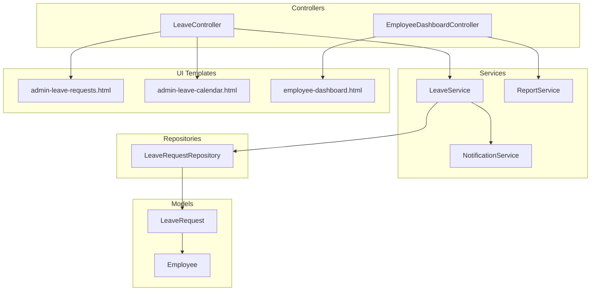
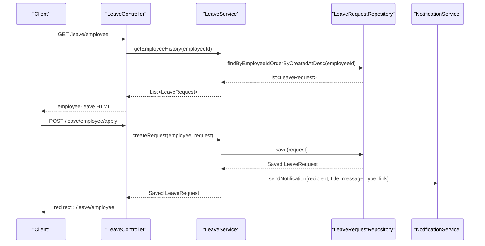
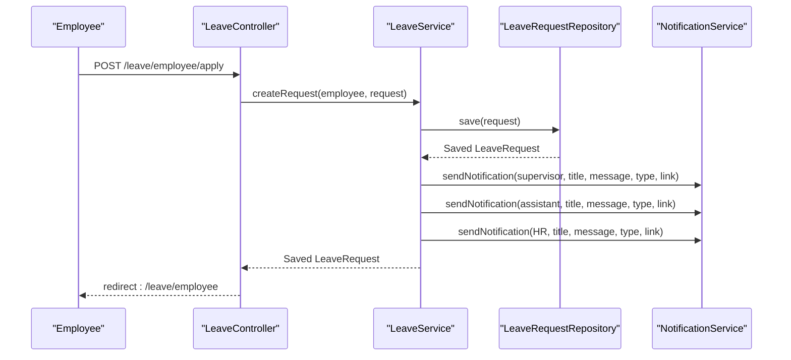
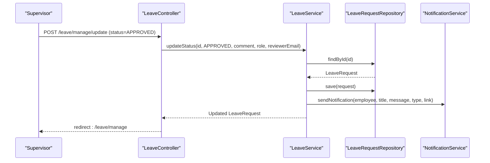
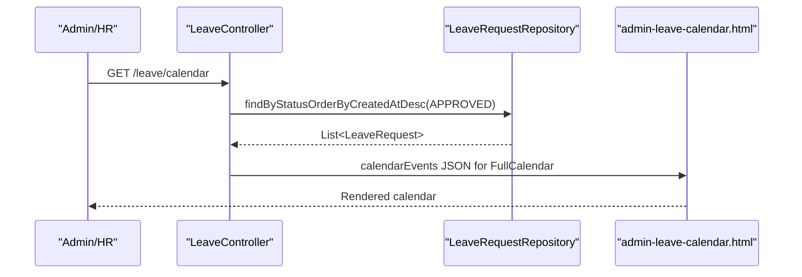
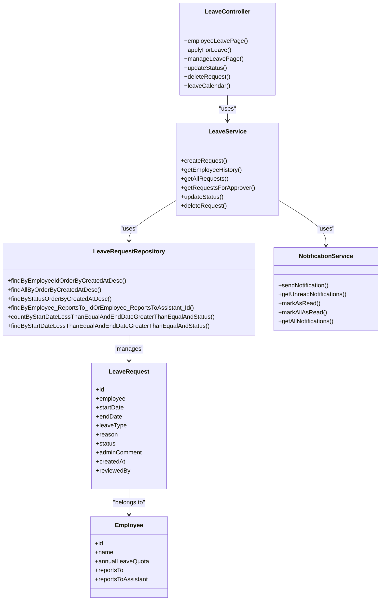

# Leave Management API

<cite>
**Referenced Files in This Document**
- [LeaveController.java](file://src/main/java/root/cyb/mh/attendancesystem/controller/LeaveController.java)
- [LeaveService.java](file://src/main/java/root/cyb/mh/attendancesystem/service/LeaveService.java)
- [LeaveRequest.java](file://src/main/java/root/cyb/mh/attendancesystem/model/LeaveRequest.java)
- [LeaveRequestRepository.java](file://src/main/java/root/cyb/mh/attendancesystem/repository/LeaveRequestRepository.java)
- [Employee.java](file://src/main/java/root/cyb/mh/attendancesystem/model/Employee.java)
- [NotificationService.java](file://src/main/java/root/cyb/mh/attendancesystem/service/NotificationService.java)
- [admin-leave-requests.html](file://src/main/resources/templates/admin-leave-requests.html)
- [admin-leave-calendar.html](file://src/main/resources/templates/admin-leave-calendar.html)
- [employee-dashboard.html](file://src/main/resources/templates/employee-dashboard.html)
- [ReportService.java](file://src/main/java/root/cyb/mh/attendancesystem/service/ReportService.java)
- [EmployeeDashboardController.java](file://src/main/java/root/cyb/mh/attendancesystem/controller/EmployeeDashboardController.java)
</cite>

## Table of Contents
1. [Introduction](#introduction)
2. [Project Structure](#project-structure)
3. [Core Components](#core-components)
4. [Architecture Overview](#architecture-overview)
5. [Detailed Component Analysis](#detailed-component-analysis)
6. [API Endpoints](#api-endpoints)
7. [Data Models](#data-models)
8. [Workflow Examples](#workflow-examples)
9. [Dependency Analysis](#dependency-analysis)
10. [Performance Considerations](#performance-considerations)
11. [Troubleshooting Guide](#troubleshooting-guide)
12. [Conclusion](#conclusion)

## Introduction
This document provides comprehensive API documentation for the leave request management system. It covers endpoints for submitting leave requests, managing approvals, viewing leave calendars, calculating leave balances, and understanding approval workflows. The system supports employee self-service, supervisor review, and HR administration with integrated notifications and calendar visualization.

## Project Structure
The leave management functionality spans controllers, services, models, repositories, and Thymeleaf templates for UI rendering. Controllers expose endpoints, services orchestrate business logic, models define data structures, repositories handle persistence, and templates render UI components.

**Diagram sources**
- [LeaveController.java:1-176](file://src/main/java/root/cyb/mh/attendancesystem/controller/LeaveController.java#L1-L176)
- [LeaveService.java:1-127](file://src/main/java/root/cyb/mh/attendancesystem/service/LeaveService.java#L1-L127)
- [LeaveRequest.java:1-54](file://src/main/java/root/cyb/mh/attendancesystem/model/LeaveRequest.java#L1-L54)
- [LeaveRequestRepository.java:1-34](file://src/main/java/root/cyb/mh/attendancesystem/repository/LeaveRequestRepository.java#L1-L34)
- [NotificationService.java:1-78](file://src/main/java/root/cyb/mh/attendancesystem/service/NotificationService.java#L1-L78)
- [admin-leave-requests.html:1-198](file://src/main/resources/templates/admin-leave-requests.html#L1-L198)
- [admin-leave-calendar.html:1-50](file://src/main/resources/templates/admin-leave-calendar.html#L1-L50)
- [employee-dashboard.html:846-899](file://src/main/resources/templates/employee-dashboard.html#L846-L899)
- [ReportService.java:724-1083](file://src/main/java/root/cyb/mh/attendancesystem/service/ReportService.java#L724-L1083)
- [EmployeeDashboardController.java:1-427](file://src/main/java/root/cyb/mh/attendancesystem/controller/EmployeeDashboardController.java#L1-L427)

**Section sources**
- [LeaveController.java:1-176](file://src/main/java/root/cyb/mh/attendancesystem/controller/LeaveController.java#L1-L176)
- [LeaveService.java:1-127](file://src/main/java/root/cyb/mh/attendancesystem/service/LeaveService.java#L1-L127)
- [LeaveRequest.java:1-54](file://src/main/java/root/cyb/mh/attendancesystem/model/LeaveRequest.java#L1-L54)
- [LeaveRequestRepository.java:1-34](file://src/main/java/root/cyb/mh/attendancesystem/repository/LeaveRequestRepository.java#L1-L34)
- [admin-leave-requests.html:1-198](file://src/main/resources/templates/admin-leave-requests.html#L1-L198)
- [admin-leave-calendar.html:1-50](file://src/main/resources/templates/admin-leave-calendar.html#L1-L50)
- [employee-dashboard.html:846-899](file://src/main/resources/templates/employee-dashboard.html#L846-L899)
- [ReportService.java:724-1083](file://src/main/java/root/cyb/mh/attendancesystem/service/ReportService.java#L724-L1083)
- [EmployeeDashboardController.java:1-427](file://src/main/java/root/cyb/mh/attendancesystem/controller/EmployeeDashboardController.java#L1-L427)

## Core Components
- LeaveController: Exposes endpoints for employee leave application, admin/team management, and calendar rendering.
- LeaveService: Handles request creation, status updates, notifications, and team-based retrieval.
- LeaveRequest: Domain model representing leave requests with status, dates, type, and audit fields.
- LeaveRequestRepository: JPA repository for leave request queries and counts.
- NotificationService: Manages notification persistence, WebSocket delivery, and web push notifications.
- UI Templates: Render admin leave management, calendar, and employee dashboards.

**Section sources**
- [LeaveController.java:18-176](file://src/main/java/root/cyb/mh/attendancesystem/controller/LeaveController.java#L18-L176)
- [LeaveService.java:12-127](file://src/main/java/root/cyb/mh/attendancesystem/service/LeaveService.java#L12-L127)
- [LeaveRequest.java:11-54](file://src/main/java/root/cyb/mh/attendancesystem/model/LeaveRequest.java#L11-L54)
- [LeaveRequestRepository.java:9-34](file://src/main/java/root/cyb/mh/attendancesystem/repository/LeaveRequestRepository.java#L9-L34)
- [NotificationService.java:10-78](file://src/main/java/root/cyb/mh/attendancesystem/service/NotificationService.java#L10-L78)

## Architecture Overview
The system follows a layered architecture:
- Presentation Layer: Controllers handle HTTP requests and delegate to services.
- Business Logic Layer: Services encapsulate workflows for leave requests and notifications.
- Persistence Layer: Repositories manage data access for leave requests and related entities.
- UI Layer: Thymeleaf templates render admin and employee views.

**Diagram sources**
- [LeaveController.java:33-55](file://src/main/java/root/cyb/mh/attendancesystem/controller/LeaveController.java#L33-L55)
- [LeaveService.java:24-46](file://src/main/java/root/cyb/mh/attendancesystem/service/LeaveService.java#L24-L46)
- [LeaveRequestRepository.java:12-13](file://src/main/java/root/cyb/mh/attendancesystem/repository/LeaveRequestRepository.java#L12-L13)
- [NotificationService.java:22-44](file://src/main/java/root/cyb/mh/attendancesystem/service/NotificationService.java#L22-L44)

## Detailed Component Analysis

### LeaveController
Responsibilities:
- Serve employee leave page and handle leave application submissions.
- Manage admin/HR leave requests and supervisor team requests.
- Update request status with role-based validations.
- Render leave calendar using FullCalendar with approved leave events.

Key endpoints:
- GET /leave/employee: Renders employee leave page with history and new request form.
- POST /leave/employee/apply: Submits a new leave request for the authenticated employee.
- GET /leave/manage: Renders admin/HR or supervisor team requests page.
- POST /leave/manage/update: Updates request status with comment and role checks.
- POST /leave/manage/delete: Deletes a request (admin only).
- GET /leave/calendar: Renders FullCalendar with approved leave events.

Security and roles:
- Admin/HR can view all requests and override statuses.
- Supervisors can only view and act on requests from their team.
- Role checks enforce access to update/delete endpoints.

**Section sources**
- [LeaveController.java:33-174](file://src/main/java/root/cyb/mh/attendancesystem/controller/LeaveController.java#L33-L174)

### LeaveService
Responsibilities:
- Create leave requests with default PENDING status and notify supervisors, assistants, and HR.
- Retrieve employee history, all requests, and team requests for approvers.
- Update request status with role-specific constraints and audit trail.
- Send notifications to employees upon status changes.

Approval workflow logic:
- HR can only modify PENDING requests.
- Admin can override any status.
- Comments and reviewer identity are recorded for audit.

**Section sources**
- [LeaveService.java:24-121](file://src/main/java/root/cyb/mh/attendancesystem/service/LeaveService.java#L24-L121)

### LeaveRequest Model
Fields:
- id: Unique identifier.
- employee: Many-to-one relationship to Employee.
- startDate, endDate: Leave date range.
- leaveType: Text field for leave category (e.g., Sick, Vacation, Casual).
- reason: Optional reason for leave.
- status: Enumerated status (PENDING, APPROVED, REJECTED).
- adminComment: Optional comment from HR/Admin.
- createdAt: Timestamp of creation.
- reviewedBy: Audit field storing who processed the request.

Status transitions:
- Creation sets status to PENDING.
- Update endpoint changes status to APPROVED or REJECTED.

**Section sources**
- [LeaveRequest.java:15-52](file://src/main/java/root/cyb/mh/attendancesystem/model/LeaveRequest.java#L15-L52)

### LeaveRequestRepository
Queries:
- Employee history: findByEmployeeIdOrderByCreatedAtDesc(employeeId)
- All requests: findAllByOrderByCreatedAtDesc()
- Pending requests: findByStatusOrderByCreatedAtDesc(PENDING)
- Team requests: findByEmployee_ReportsTo_IdOrEmployee_ReportsToAssistant_Id(approverId, approverId)
- Count and find approved leaves for a specific date range.

**Section sources**
- [LeaveRequestRepository.java:10-33](file://src/main/java/root/cyb/mh/attendancesystem/repository/LeaveRequestRepository.java#L10-L33)

### NotificationService
Capabilities:
- Persist notifications to database.
- Deliver notifications via WebSocket to user-specific destinations.
- Send web push notifications through a push notification service.
- Provide APIs to fetch unread notifications and mark as read.

Integration points:
- Used by LeaveService to notify supervisors, assistants, HR, and employees.

**Section sources**
- [NotificationService.java:22-77](file://src/main/java/root/cyb/mh/attendancesystem/service/NotificationService.java#L22-L77)

### UI Templates
- admin-leave-requests.html: Lists leave requests with actions (approve/reject), comments for rejection, and testing-mode delete option.
- admin-leave-calendar.html: Renders FullCalendar with approved leave events parsed from server-side JSON.
- employee-dashboard.html: Displays annual leave quota, used/paid/unpaid leave statistics.

**Section sources**
- [admin-leave-requests.html:17-198](file://src/main/resources/templates/admin-leave-requests.html#L17-L198)
- [admin-leave-calendar.html:25-46](file://src/main/resources/templates/admin-leave-calendar.html#L25-L46)
- [employee-dashboard.html:846-899](file://src/main/resources/templates/employee-dashboard.html#L846-L899)

## API Endpoints

### Employee Endpoints
- GET /leave/employee
  - Description: Load employee leave page with history and new request form.
  - Authentication: Employee.
  - Response: HTML template with leave history and form model attributes.

- POST /leave/employee/apply
  - Description: Submit a new leave request for the authenticated employee.
  - Authentication: Employee.
  - Form parameters:
    - startDate: Date (required)
    - endDate: Date (required)
    - leaveType: String (required)
    - reason: Text (optional)
  - Behavior: Creates request with PENDING status and sends notifications.

**Section sources**
- [LeaveController.java:33-55](file://src/main/java/root/cyb/mh/attendancesystem/controller/LeaveController.java#L33-L55)
- [LeaveService.java:24-46](file://src/main/java/root/cyb/mh/attendancesystem/service/LeaveService.java#L24-L46)

### Admin/HR and Supervisor Endpoints
- GET /leave/manage
  - Description: Admin/HR see all requests; supervisors see their team's requests.
  - Authentication: Admin/HR or Supervisor.
  - Response: HTML template with requests table and action buttons.

- POST /leave/manage/update
  - Description: Approve or reject a leave request.
  - Authentication: Admin/HR or Supervisor.
  - Form parameters:
    - id: Long (required)
    - status: String (APPROVED or REJECTED)
    - comment: Text (required for REJECTED)
  - Behavior: Validates role and status constraints, updates request, records reviewer, and notifies employee.

- POST /leave/manage/delete
  - Description: Delete a leave request (testing/admin).
  - Authentication: Admin.
  - Form parameters:
    - id: Long (required)

**Section sources**
- [LeaveController.java:59-131](file://src/main/java/root/cyb/mh/attendancesystem/controller/LeaveController.java#L59-L131)
- [LeaveService.java:84-121](file://src/main/java/root/cyb/mh/attendancesystem/service/LeaveService.java#L84-L121)

### Calendar Endpoint
- GET /leave/calendar
  - Description: Render FullCalendar with approved leave events.
  - Authentication: Admin/HR.
  - Response: HTML template with calendar and JSON events for FullCalendar.

**Section sources**
- [LeaveController.java:136-174](file://src/main/java/root/cyb/mh/attendancesystem/controller/LeaveController.java#L136-L174)
- [admin-leave-calendar.html:25-46](file://src/main/resources/templates/admin-leave-calendar.html#L25-L46)

## Data Models

### LeaveRequest Schema
- Fields:
  - id: Long
  - employeeId: String (via ManyToOne relationship)
  - startDate: Date
  - endDate: Date
  - leaveType: String
  - reason: Text
  - status: Enum (PENDING, APPROVED, REJECTED)
  - adminComment: Text
  - createdAt: DateTime
  - reviewedBy: String

**Section sources**
- [LeaveRequest.java:17-47](file://src/main/java/root/cyb/mh/attendancesystem/model/LeaveRequest.java#L17-L47)

### Employee Schema (Relevant Fields)
- Fields:
  - id: String
  - name: String
  - annualLeaveQuota: Integer (nullable)
  - reportsTo: Employee (supervisor)
  - reportsToAssistant: Employee (assistant supervisor)

**Section sources**
- [Employee.java:15-39](file://src/main/java/root/cyb/mh/attendancesystem/model/Employee.java#L15-L39)

### Notification Schema (Service Integration)
- Fields:
  - recipientUsername: String
  - title: String
  - message: String
  - type: String
  - linkAction: String
  - read: Boolean
  - createdAt: DateTime

**Section sources**
- [NotificationService.java:22-31](file://src/main/java/root/cyb/mh/attendancesystem/service/NotificationService.java#L22-L31)

## Workflow Examples

### Example 1: Employee Submits Leave Request

**Diagram sources**
- [LeaveController.java:46-55](file://src/main/java/root/cyb/mh/attendancesystem/controller/LeaveController.java#L46-L55)
- [LeaveService.java:24-46](file://src/main/java/root/cyb/mh/attendancesystem/service/LeaveService.java#L24-L46)
- [NotificationService.java:22-44](file://src/main/java/root/cyb/mh/attendancesystem/service/NotificationService.java#L22-L44)

### Example 2: Supervisor Approves Leave Request

**Diagram sources**
- [LeaveController.java:92-124](file://src/main/java/root/cyb/mh/attendancesystem/controller/LeaveController.java#L92-L124)
- [LeaveService.java:84-121](file://src/main/java/root/cyb/mh/attendancesystem/service/LeaveService.java#L84-L121)
- [NotificationService.java:106-117](file://src/main/java/root/cyb/mh/attendancesystem/service/NotificationService.java#L106-L117)

### Example 3: Leave Calendar Rendering

**Diagram sources**
- [LeaveController.java:136-174](file://src/main/java/root/cyb/mh/attendancesystem/controller/LeaveController.java#L136-L174)
- [LeaveRequestRepository.java:18-19](file://src/main/java/root/cyb/mh/attendancesystem/repository/LeaveRequestRepository.java#L18-L19)
- [admin-leave-calendar.html:25-46](file://src/main/resources/templates/admin-leave-calendar.html#L25-L46)

## Dependency Analysis

**Diagram sources**
- [LeaveController.java:18-176](file://src/main/java/root/cyb/mh/attendancesystem/controller/LeaveController.java#L18-L176)
- [LeaveService.java:12-127](file://src/main/java/root/cyb/mh/attendancesystem/service/LeaveService.java#L12-L127)
- [LeaveRequestRepository.java:9-34](file://src/main/java/root/cyb/mh/attendancesystem/repository/LeaveRequestRepository.java#L9-L34)
- [LeaveRequest.java:11-54](file://src/main/java/root/cyb/mh/attendancesystem/model/LeaveRequest.java#L11-L54)
- [Employee.java:9-63](file://src/main/java/root/cyb/mh/attendancesystem/model/Employee.java#L9-L63)
- [NotificationService.java:10-78](file://src/main/java/root/cyb/mh/attendancesystem/service/NotificationService.java#L10-L78)

**Section sources**
- [LeaveController.java:18-176](file://src/main/java/root/cyb/mh/attendancesystem/controller/LeaveController.java#L18-L176)
- [LeaveService.java:12-127](file://src/main/java/root/cyb/mh/attendancesystem/service/LeaveService.java#L12-L127)
- [LeaveRequestRepository.java:9-34](file://src/main/java/root/cyb/mh/attendancesystem/repository/LeaveRequestRepository.java#L9-L34)
- [LeaveRequest.java:11-54](file://src/main/java/root/cyb/mh/attendancesystem/model/LeaveRequest.java#L11-L54)
- [Employee.java:9-63](file://src/main/java/root/cyb/mh/attendancesystem/model/Employee.java#L9-L63)
- [NotificationService.java:10-78](file://src/main/java/root/cyb/mh/attendancesystem/service/NotificationService.java#L10-L78)

## Performance Considerations
- Repository queries use optimized JPQL methods for common filters (history, pending, team requests).
- Calendar rendering constructs JSON events server-side; consider pagination or caching for large datasets.
- Notifications are persisted and pushed asynchronously; ensure queue capacity and retry policies are configured.
- UI templates rely on Thymeleaf rendering; minimize heavy computations in templates and precompute data in controllers/services.

## Troubleshooting Guide
Common issues and resolutions:
- Access Denied for Supervisor Actions: Ensure the authenticated user is linked as a supervisor or assistant in the Employee model; otherwise, role checks will deny access.
- HR Cannot Modify Processed Requests: HR can only update PENDING requests; attempting to change APPROVED/REJECTED requests will throw an illegal state error.
- Notification Delivery Failures: NotificationService logs failures for web push; verify push notification service configuration and WebSocket connectivity.
- Calendar Events Not Loading: Confirm approved leave requests exist and that the calendar endpoint renders the correct JSON events.

**Section sources**
- [LeaveController.java:75-84](file://src/main/java/root/cyb/mh/attendancesystem/controller/LeaveController.java#L75-L84)
- [LeaveService.java:90-94](file://src/main/java/root/cyb/mh/attendancesystem/service/LeaveService.java#L90-L94)
- [NotificationService.java:38-43](file://src/main/java/root/cyb/mh/attendancesystem/service/NotificationService.java#L38-L43)

## Conclusion
The leave management system provides a robust foundation for leave request lifecycle management, including submission, approval workflows, notifications, and calendar visualization. The documented endpoints and data models enable integration with frontend applications and support scalable enhancements for leave balance calculations and reporting.