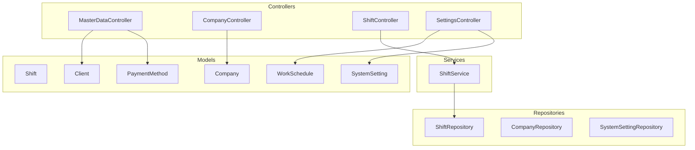
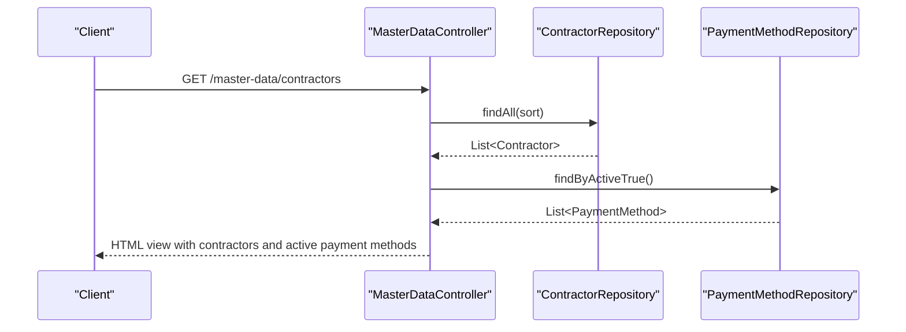
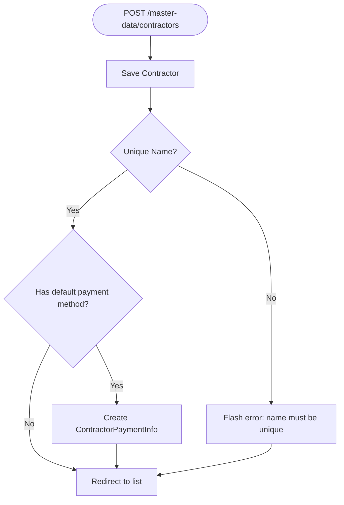
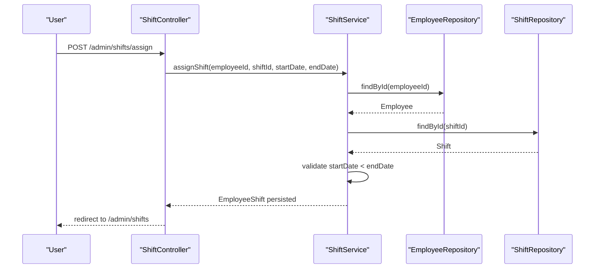
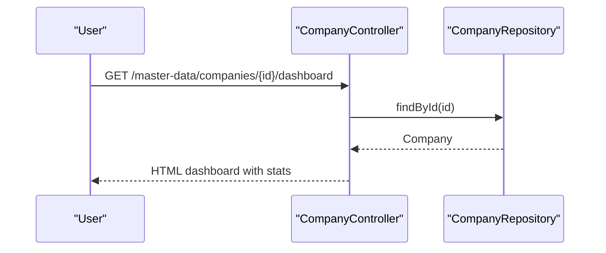
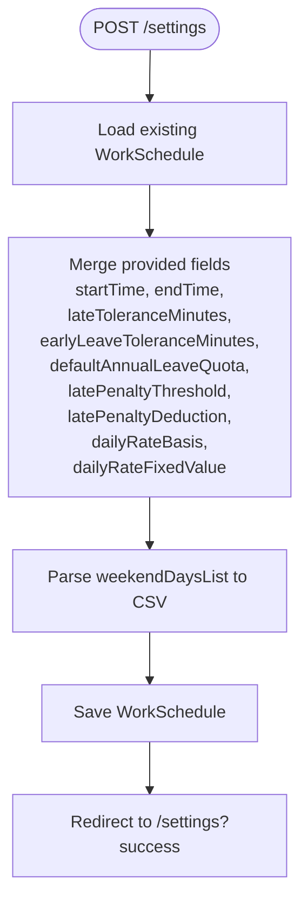
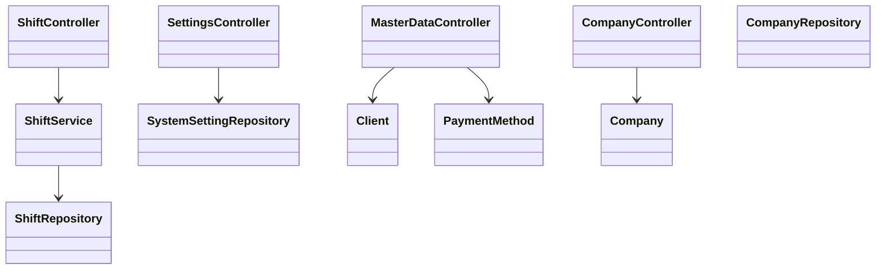

# Master Data API

<cite>
**Referenced Files in This Document**
- [MasterDataController.java](file://src/main/java/root/cyb/mh/attendancesystem/controller/MasterDataController.java)
- [CompanyController.java](file://src/main/java/root/cyb/mh/attendancesystem/controller/CompanyController.java)
- [ShiftController.java](file://src/main/java/root/cyb/mh/attendancesystem/controller/ShiftController.java)
- [SettingsController.java](file://src/main/java/root/cyb/mh/attendancesystem/controller/SettingsController.java)
- [ShiftService.java](file://src/main/java/root/cyb/mh/attendancesystem/service/ShiftService.java)
- [Shift.java](file://src/main/java/root/cyb/mh/attendancesystem/model/Shift.java)
- [WorkSchedule.java](file://src/main/java/root/cyb/mh/attendancesystem/model/WorkSchedule.java)
- [Company.java](file://src/main/java/root/cyb/mh/attendancesystem/model/Company.java)
- [Client.java](file://src/main/java/root/cyb/mh/attendancesystem/model/Client.java)
- [PaymentMethod.java](file://src/main/java/root/cyb/mh/attendancesystem/model/PaymentMethod.java)
- [SystemSetting.java](file://src/main/java/root/cyb/mh/attendancesystem/model/SystemSetting.java)
- [ShiftRepository.java](file://src/main/java/root/cyb/mh/attendancesystem/repository/ShiftRepository.java)
- [SystemSettingRepository.java](file://src/main/java/root/cyb/mh/attendancesystem/repository/SystemSettingRepository.java)
- [CompanyRepository.java](file://src/main/java/root/cyb/mh/attendancesystem/repository/CompanyRepository.java)
</cite>

## Table of Contents
1. [Introduction](#introduction)
2. [Project Structure](#project-structure)
3. [Core Components](#core-components)
4. [Architecture Overview](#architecture-overview)
5. [Detailed Component Analysis](#detailed-component-analysis)
6. [Dependency Analysis](#dependency-analysis)
7. [Performance Considerations](#performance-considerations)
8. [Troubleshooting Guide](#troubleshooting-guide)
9. [Conclusion](#conclusion)

## Introduction
This document describes the master data management APIs for shift configurations, company data, and system settings. It covers endpoints for managing lookup tables (clients, contractors, payment methods), shift schedules, company hierarchies, and operational settings. It also documents request/response formats, validation rules, and workflows to maintain data consistency and manage reference data effectively.

## Project Structure
The master data domain spans controllers, services, models, and repositories:
- Controllers expose HTTP endpoints under /master-data, /master-data/companies, /admin/shifts, and /settings.
- Services encapsulate business logic for shift assignment and validation.
- Models define entities for shifts, work schedules, companies, clients, payment methods, and system settings.
- Repositories provide JPA access to persistence.

**Diagram sources**
- [MasterDataController.java:1-800](file://src/main/java/root/cyb/mh/attendancesystem/controller/MasterDataController.java#L1-L800)
- [CompanyController.java:1-203](file://src/main/java/root/cyb/mh/attendancesystem/controller/CompanyController.java#L1-L203)
- [ShiftController.java:1-76](file://src/main/java/root/cyb/mh/attendancesystem/controller/ShiftController.java#L1-L76)
- [SettingsController.java:1-162](file://src/main/java/root/cyb/mh/attendancesystem/controller/SettingsController.java#L1-L162)
- [ShiftService.java:1-102](file://src/main/java/root/cyb/mh/attendancesystem/service/ShiftService.java#L1-L102)
- [Shift.java:1-30](file://src/main/java/root/cyb/mh/attendancesystem/model/Shift.java#L1-L30)
- [WorkSchedule.java:1-49](file://src/main/java/root/cyb/mh/attendancesystem/model/WorkSchedule.java#L1-L49)
- [Company.java:1-31](file://src/main/java/root/cyb/mh/attendancesystem/model/Company.java#L1-L31)
- [Client.java:1-25](file://src/main/java/root/cyb/mh/attendancesystem/model/Client.java#L1-L25)
- [PaymentMethod.java:1-22](file://src/main/java/root/cyb/mh/attendancesystem/model/PaymentMethod.java#L1-L22)
- [SystemSetting.java:1-27](file://src/main/java/root/cyb/mh/attendancesystem/model/SystemSetting.java#L1-L27)
- [ShiftRepository.java:1-9](file://src/main/java/root/cyb/mh/attendancesystem/repository/ShiftRepository.java#L1-L9)
- [CompanyRepository.java:1-10](file://src/main/java/root/cyb/mh/attendancesystem/repository/CompanyRepository.java#L1-L10)
- [SystemSettingRepository.java:1-10](file://src/main/java/root/cyb/mh/attendancesystem/repository/SystemSettingRepository.java#L1-L10)

**Section sources**
- [MasterDataController.java:1-800](file://src/main/java/root/cyb/mh/attendancesystem/controller/MasterDataController.java#L1-L800)
- [CompanyController.java:1-203](file://src/main/java/root/cyb/mh/attendancesystem/controller/CompanyController.java#L1-L203)
- [ShiftController.java:1-76](file://src/main/java/root/cyb/mh/attendancesystem/controller/ShiftController.java#L1-L76)
- [SettingsController.java:1-162](file://src/main/java/root/cyb/mh/attendancesystem/controller/SettingsController.java#L1-L162)

## Core Components
- Lookup tables
  - Clients: unique code, searchable by name/code/address/id.
  - Contractors: unique name, optional default payment method and account details.
  - Payment methods: unique method name, active flag.
- Shift configurations
  - Shifts: name, start/end times, tolerances.
  - Work schedule: global working hours, weekend days, annual leave quota, penalties, daily rate basis.
- Company data
  - Company entity with contact info and SMTP settings, active flag.
- System settings
  - Key-value settings with unique keys and descriptions.

Validation and uniqueness rules:
- Unique constraints enforced at persistence level for client code, contractor name, and payment method name.
- Shift assignment validates start date before end date.
- Toggle endpoints flip active flags for entities.

**Section sources**
- [Client.java:1-25](file://src/main/java/root/cyb/mh/attendancesystem/model/Client.java#L1-L25)
- [Contractor.java:1-49](file://src/main/java/root/cyb/mh/attendancesystem/model/Contractor.java#L1-L49)
- [PaymentMethod.java:1-22](file://src/main/java/root/cyb/mh/attendancesystem/model/PaymentMethod.java#L1-L22)
- [Shift.java:1-30](file://src/main/java/root/cyb/mh/attendancesystem/model/Shift.java#L1-L30)
- [WorkSchedule.java:1-49](file://src/main/java/root/cyb/mh/attendancesystem/model/WorkSchedule.java#L1-L49)
- [Company.java:1-31](file://src/main/java/root/cyb/mh/attendancesystem/model/Company.java#L1-L31)
- [SystemSetting.java:1-27](file://src/main/java/root/cyb/mh/attendancesystem/model/SystemSetting.java#L1-L27)

## Architecture Overview
The master data API follows a layered architecture:
- Controllers handle HTTP requests and delegate to services or repositories.
- Services encapsulate business rules (e.g., shift assignment validation).
- Models represent persisted entities with JPA annotations.
- Repositories provide CRUD and specialized queries.

**Diagram sources**
- [MasterDataController.java:39-67](file://src/main/java/root/cyb/mh/attendancesystem/controller/MasterDataController.java#L39-L67)
- [CompanyController.java:29-34](file://src/main/java/root/cyb/mh/attendancesystem/controller/CompanyController.java#L29-L34)

## Detailed Component Analysis

### Lookup Tables: Clients, Contractors, Payment Methods
Endpoints
- Clients
  - GET /master-data/clients
  - POST /master-data/clients
  - POST /master-data/clients/update
  - POST /master-data/clients/{id}/toggle
- Contractors
  - GET /master-data/contractors
  - POST /master-data/contractors
  - POST /master-data/contractors/update
  - POST /master-data/contractors/{id}/toggle
  - GET /master-data/contractors/{id}/dashboard
  - AJAX:
    - GET /master-data/api/contractors/{id}/payment-infos
    - POST /master-data/api/contractors/{id}/payment-infos
    - POST /master-data/api/contractors/{cid}/set-default/{infoId}
    - GET /master-data/api/contractors/{id}/default-payment-info
    - POST /master-data/api/payment-infos/{id}/delete
- Payment Methods
  - GET /master-data/payment-methods
  - POST /master-data/payment-methods
  - POST /master-data/payment-methods/update
  - POST /master-data/payment-methods/{id}/toggle
  - GET /master-data/payment-methods/{id}/dashboard

Request/response formats
- Clients
  - Create/Update body: Client fields (code, name, address).
  - Response: Redirect with flash messages.
- Contractors
  - Create/Update body: Contractor fields (name, description, email, zipCode, area, defaultPaymentMethodId, accountDetails).
  - Payment info endpoints:
    - POST /api/contractors/{id}/payment-infos: form params (paymentMethodId, accountDetails).
    - POST /api/contractors/{cid}/set-default/{infoId}: sets default payment method/account for contractor.
    - GET /api/contractors/{id}/default-payment-info: JSON {paymentMethodId, paymentMethodName, accountDetails}.
    - POST /api/payment-infos/{id}/delete: soft-deletes payment info (sets active=false).
- Payment Methods
  - Create/Update body: PaymentMethod fields (methodName, description).
  - Dashboard GET returns aggregated metrics for a payment method.

Validation rules
- Unique constraints:
  - Client.code unique.
  - Contractor.name unique.
  - PaymentMethod.methodName unique.
- Toggle endpoints flip active flags.
- Payment info ownership validated before setting default.

Error handling
- Flash messages indicate success/error for create/update/toggle actions.
- AJAX endpoints return HTTP 200 with message on success or HTTP 400 with error message.

**Diagram sources**
- [MasterDataController.java:69-88](file://src/main/java/root/cyb/mh/attendancesystem/controller/MasterDataController.java#L69-L88)

**Section sources**
- [MasterDataController.java:39-304](file://src/main/java/root/cyb/mh/attendancesystem/controller/MasterDataController.java#L39-L304)
- [MasterDataController.java:347-363](file://src/main/java/root/cyb/mh/attendancesystem/controller/MasterDataController.java#L347-L363)
- [MasterDataController.java:677-766](file://src/main/java/root/cyb/mh/attendancesystem/controller/MasterDataController.java#L677-L766)
- [Client.java:1-25](file://src/main/java/root/cyb/mh/attendancesystem/model/Client.java#L1-L25)
- [Contractor.java:1-49](file://src/main/java/root/cyb/mh/attendancesystem/model/Contractor.java#L1-L49)
- [PaymentMethod.java:1-22](file://src/main/java/root/cyb/mh/attendancesystem/model/PaymentMethod.java#L1-L22)

### Shift Configurations
Endpoints
- Shifts
  - GET /admin/shifts
  - POST /admin/shifts/create
  - GET /admin/shifts/delete/{id}
  - POST /admin/shifts/assign
  - POST /admin/shifts/assignments/update
  - GET /admin/shifts/assignments/delete/{id}

Request/response formats
- Create body: Shift fields (name, startTime, endTime, lateToleranceMinutes, earlyLeaveToleranceMinutes).
- Assign body: employeeId, shiftId, startDate (yyyy-MM-dd), endDate (yyyy-MM-dd).
- Responses: redirects to shift management page.

Validation rules
- Start date must be before end date for assignments.
- Shift name lookup supported via repository.

**Diagram sources**
- [ShiftController.java:50-57](file://src/main/java/root/cyb/mh/attendancesystem/controller/ShiftController.java#L50-L57)
- [ShiftService.java:40-58](file://src/main/java/root/cyb/mh/attendancesystem/service/ShiftService.java#L40-L58)

**Section sources**
- [ShiftController.java:24-76](file://src/main/java/root/cyb/mh/attendancesystem/controller/ShiftController.java#L24-L76)
- [ShiftService.java:40-79](file://src/main/java/root/cyb/mh/attendancesystem/service/ShiftService.java#L40-L79)
- [Shift.java:1-30](file://src/main/java/root/cyb/mh/attendancesystem/model/Shift.java#L1-L30)
- [ShiftRepository.java:1-9](file://src/main/java/root/cyb/mh/attendancesystem/repository/ShiftRepository.java#L1-L9)

### Company Data
Endpoints
- Companies
  - GET /master-data/companies
  - POST /master-data/companies
  - POST /master-data/companies/update
  - POST /master-data/companies/{id}/toggle
  - GET /master-data/companies/{id}/dashboard

Request/response formats
- Create/Update body: Company fields (name, phone, email, address, smtpHost, smtpPort, smtpUsername, smtpPassword).
- Dashboard GET returns company stats and SWOT-style metrics.

Validation rules
- Active flag toggled via POST endpoint.

**Diagram sources**
- [CompanyController.java:82-201](file://src/main/java/root/cyb/mh/attendancesystem/controller/CompanyController.java#L82-L201)

**Section sources**
- [CompanyController.java:29-80](file://src/main/java/root/cyb/mh/attendancesystem/controller/CompanyController.java#L29-L80)
- [CompanyController.java:82-201](file://src/main/java/root/cyb/mh/attendancesystem/controller/CompanyController.java#L82-L201)
- [Company.java:1-31](file://src/main/java/root/cyb/mh/attendancesystem/model/Company.java#L1-L31)
- [CompanyRepository.java:1-10](file://src/main/java/root/cyb/mh/attendancesystem/repository/CompanyRepository.java#L1-L10)

### System Settings
Endpoints
- Settings
  - GET /settings
  - POST /settings
  - POST /settings/holidays/add
  - GET /settings/holidays/delete?id={id}
  - POST /settings/generate-demo-data
  - POST /settings/demo/seed
  - POST /settings/demo/clear

Request/response formats
- GET /settings returns current WorkSchedule and sorted holidays.
- POST /settings updates WorkSchedule fields and weekendDays list.
- POST /settings/holidays/add accepts name and date.
- Demo endpoints seed/clear demo data.

Validation rules
- Weekend days stored as comma-separated integers.
- Demo data generation ensures employees exist before creating logs.

**Diagram sources**
- [SettingsController.java:41-71](file://src/main/java/root/cyb/mh/attendancesystem/controller/SettingsController.java#L41-L71)

**Section sources**
- [SettingsController.java:27-86](file://src/main/java/root/cyb/mh/attendancesystem/controller/SettingsController.java#L27-L86)
- [WorkSchedule.java:1-49](file://src/main/java/root/cyb/mh/attendancesystem/model/WorkSchedule.java#L1-L49)

### System Settings (Key-Value)
- Entity: SystemSetting with unique key, value, and description.
- Repository: JPA repository keyed by setting_key.

Use cases
- Centralized configuration storage for application-wide settings.

**Section sources**
- [SystemSetting.java:1-27](file://src/main/java/root/cyb/mh/attendancesystem/model/SystemSetting.java#L1-L27)
- [SystemSettingRepository.java:1-10](file://src/main/java/root/cyb/mh/attendancesystem/repository/SystemSettingRepository.java#L1-L10)

## Dependency Analysis
- Controllers depend on repositories/services for data access and business logic.
- Services depend on repositories for persistence and validation.
- Models define JPA relationships and constraints.
- Repositories provide typed access to entities.

**Diagram sources**
- [MasterDataController.java:1-800](file://src/main/java/root/cyb/mh/attendancesystem/controller/MasterDataController.java#L1-L800)
- [CompanyController.java:1-203](file://src/main/java/root/cyb/mh/attendancesystem/controller/CompanyController.java#L1-L203)
- [ShiftController.java:1-76](file://src/main/java/root/cyb/mh/attendancesystem/controller/ShiftController.java#L1-L76)
- [SettingsController.java:1-162](file://src/main/java/root/cyb/mh/attendancesystem/controller/SettingsController.java#L1-L162)
- [ShiftService.java:1-102](file://src/main/java/root/cyb/mh/attendancesystem/service/ShiftService.java#L1-L102)
- [ShiftRepository.java:1-9](file://src/main/java/root/cyb/mh/attendancesystem/repository/ShiftRepository.java#L1-L9)
- [CompanyRepository.java:1-10](file://src/main/java/root/cyb/mh/attendancesystem/repository/CompanyRepository.java#L1-L10)
- [SystemSettingRepository.java:1-10](file://src/main/java/root/cyb/mh/attendancesystem/repository/SystemSettingRepository.java#L1-L10)

**Section sources**
- [MasterDataController.java:1-800](file://src/main/java/root/cyb/mh/attendancesystem/controller/MasterDataController.java#L1-L800)
- [CompanyController.java:1-203](file://src/main/java/root/cyb/mh/attendancesystem/controller/CompanyController.java#L1-L203)
- [ShiftController.java:1-76](file://src/main/java/root/cyb/mh/attendancesystem/controller/ShiftController.java#L1-L76)
- [SettingsController.java:1-162](file://src/main/java/root/cyb/mh/attendancesystem/controller/SettingsController.java#L1-L162)

## Performance Considerations
- Prefer paginated queries for large lists (clients, contractors).
- Use repository-level aggregations for dashboard metrics to avoid loading full datasets.
- Indexes on unique fields (client.code, contractor.name, payment.methodName) improve lookup performance.
- Batch operations for demo data seeding reduce repeated writes.

## Troubleshooting Guide
Common issues and resolutions
- Unique constraint violations
  - Clients: ensure client code is unique before save.
  - Contractors: ensure contractor name is unique.
  - Payment methods: ensure method name is unique.
- Shift assignment errors
  - Ensure start date is before end date.
- Payment info ownership
  - Setting default payment info requires matching contractor association; otherwise returns bad request.
- Toggle operations
  - Verify entity exists before toggling active flag.

**Section sources**
- [MasterDataController.java:69-88](file://src/main/java/root/cyb/mh/attendancesystem/controller/MasterDataController.java#L69-L88)
- [MasterDataController.java:708-732](file://src/main/java/root/cyb/mh/attendancesystem/controller/MasterDataController.java#L708-L732)
- [ShiftService.java:46-49](file://src/main/java/root/cyb/mh/attendancesystem/service/ShiftService.java#L46-L49)

## Conclusion
The master data API provides comprehensive endpoints for managing clients, contractors, payment methods, shifts, company data, and system settings. It enforces uniqueness and referential integrity, supports dashboards with aggregated metrics, and offers robust validation for critical workflows like shift assignments and payment info defaults. Following the documented request/response formats and validation rules ensures data consistency and reliable operation.