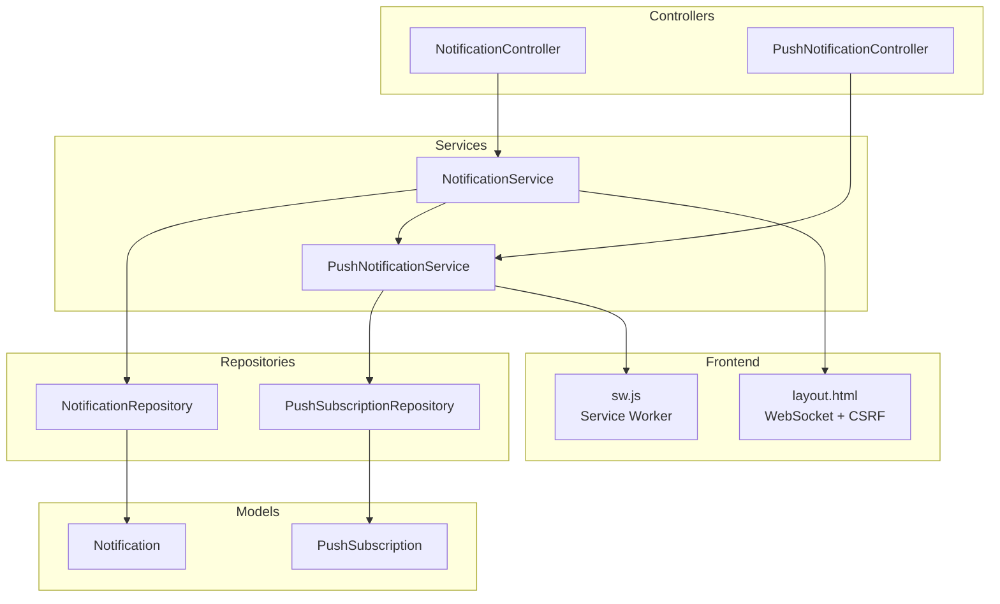
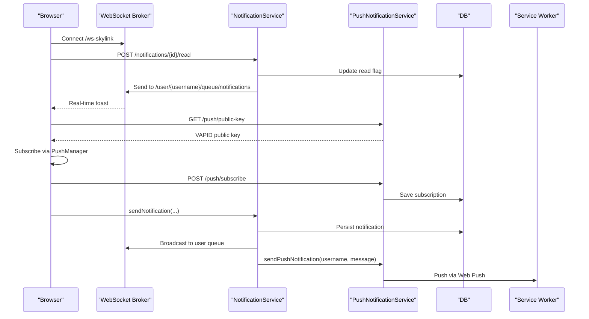
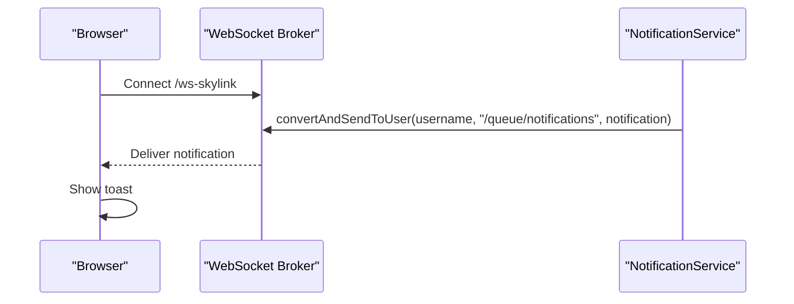
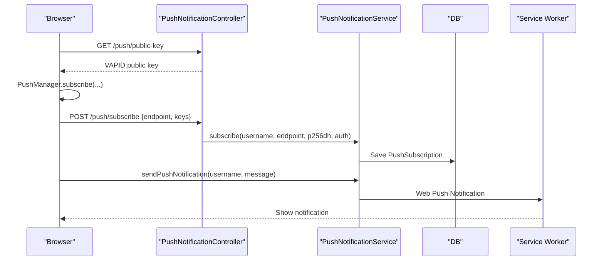
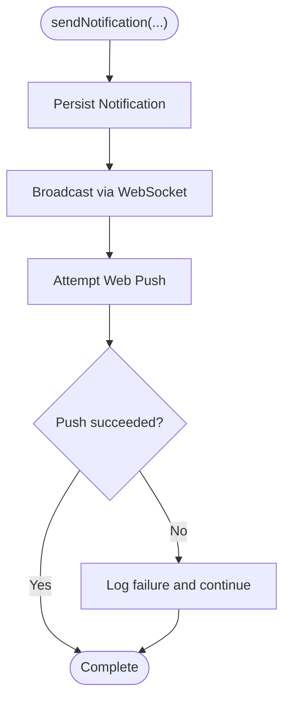
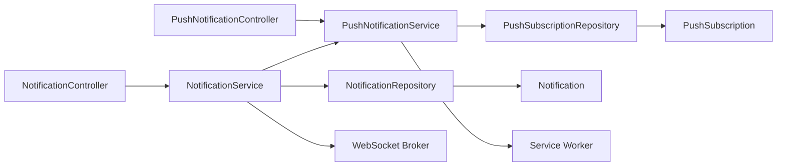
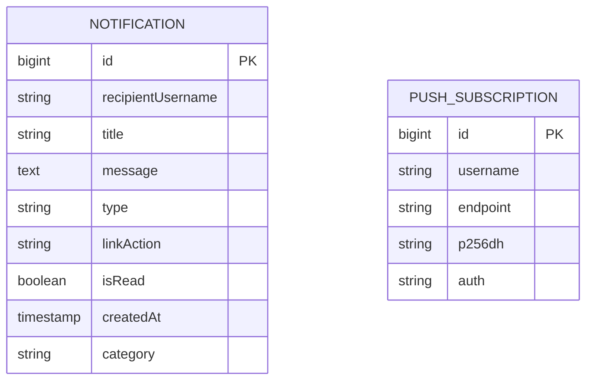

# Notification API

<cite>
**Referenced Files in This Document**
- [NotificationController.java](file://src/main/java/root/cyb/mh/attendancesystem/controller/NotificationController.java)
- [PushNotificationController.java](file://src/main/java/root/cyb/mh/attendancesystem/controller/PushNotificationController.java)
- [Notification.java](file://src/main/java/root/cyb/mh/attendancesystem/model/Notification.java)
- [PushSubscription.java](file://src/main/java/root/cyb/mh/attendancesystem/model/PushSubscription.java)
- [NotificationService.java](file://src/main/java/root/cyb/mh/attendancesystem/service/NotificationService.java)
- [PushNotificationService.java](file://src/main/java/root/cyb/mh/attendancesystem/service/PushNotificationService.java)
- [NotificationRepository.java](file://src/main/java/root/cyb/mh/attendancesystem/repository/NotificationRepository.java)
- [PushSubscriptionRepository.java](file://src/main/java/root/cyb/mh/attendancesystem/repository/PushSubscriptionRepository.java)
- [WebSocketConfig.java](file://src/main/java/root/cyb/mh/attendancesystem/config/WebSocketConfig.java)
- [layout.html](file://src/main/resources/templates/layout.html)
- [sw.js](file://src/main/resources/static/sw.js)
- [history.html](file://src/main/resources/templates/notifications/history.html)
- [application-dev.properties](file://src/main/resources/application-dev.properties)
- [application-prod.properties](file://src/main/resources/application-prod.properties)
</cite>

## Table of Contents
1. [Introduction](#introduction)
2. [Project Structure](#project-structure)
3. [Core Components](#core-components)
4. [Architecture Overview](#architecture-overview)
5. [Detailed Component Analysis](#detailed-component-analysis)
6. [Dependency Analysis](#dependency-analysis)
7. [Performance Considerations](#performance-considerations)
8. [Troubleshooting Guide](#troubleshooting-guide)
9. [Conclusion](#conclusion)
10. [Appendices](#appendices)

## Introduction
This document describes the Notification API, covering endpoints for retrieving unread notifications, marking notifications as read, viewing notification history, and managing push subscriptions. It also documents the real-time notification delivery pipeline using WebSocket and the push notification service using Web Push (VAPID). The API ensures reliable delivery by combining in-app WebSocket delivery with background push notifications via a service worker.

## Project Structure
The notification system spans controllers, services, repositories, models, and frontend integration:
- Controllers expose REST endpoints for notifications and push subscriptions.
- Services orchestrate persistence, real-time delivery, and push delivery.
- Repositories manage data access for notifications and push subscriptions.
- Models define the persisted entities.
- Frontend integrates WebSocket and Web Push via a service worker.

**Diagram sources**
- [NotificationController.java:12-48](file://src/main/java/root/cyb/mh/attendancesystem/controller/NotificationController.java#L12-L48)
- [PushNotificationController.java:8-31](file://src/main/java/root/cyb/mh/attendancesystem/controller/PushNotificationController.java#L8-L31)
- [NotificationService.java:10-44](file://src/main/java/root/cyb/mh/attendancesystem/service/NotificationService.java#L10-L44)
- [PushNotificationService.java:15-46](file://src/main/java/root/cyb/mh/attendancesystem/service/PushNotificationService.java#L15-L46)
- [NotificationRepository.java:8-18](file://src/main/java/root/cyb/mh/attendancesystem/repository/NotificationRepository.java#L8-L18)
- [PushSubscriptionRepository.java:7-11](file://src/main/java/root/cyb/mh/attendancesystem/repository/PushSubscriptionRepository.java#L7-L11)
- [layout.html:107-129](file://src/main/resources/templates/layout.html#L107-L129)
- [sw.js:1-40](file://src/main/resources/static/sw.js#L1-L40)

**Section sources**
- [NotificationController.java:11-48](file://src/main/java/root/cyb/mh/attendancesystem/controller/NotificationController.java#L11-L48)
- [PushNotificationController.java:7-31](file://src/main/java/root/cyb/mh/attendancesystem/controller/PushNotificationController.java#L7-L31)
- [NotificationService.java:10-44](file://src/main/java/root/cyb/mh/attendancesystem/service/NotificationService.java#L10-L44)
- [PushNotificationService.java:15-46](file://src/main/java/root/cyb/mh/attendancesystem/service/PushNotificationService.java#L15-L46)
- [NotificationRepository.java:8-18](file://src/main/java/root/cyb/mh/attendancesystem/repository/NotificationRepository.java#L8-L18)
- [PushSubscriptionRepository.java:7-11](file://src/main/java/root/cyb/mh/attendancesystem/repository/PushSubscriptionRepository.java#L7-L11)
- [layout.html:107-129](file://src/main/resources/templates/layout.html#L107-L129)
- [sw.js:1-40](file://src/main/resources/static/sw.js#L1-L40)

## Core Components
- Notification entity stores title, message, type, link, read status, creation timestamp, and category.
- PushSubscription entity stores endpoint and VAPID keys for Web Push.
- NotificationController exposes endpoints for unread notifications, marking as read, and viewing history.
- PushNotificationController exposes endpoints for retrieving the VAPID public key and subscribing to push.
- NotificationService persists notifications, pushes via WebSocket, and triggers Web Push.
- PushNotificationService initializes VAPID, manages subscriptions, and sends push notifications.

**Section sources**
- [Notification.java:14-42](file://src/main/java/root/cyb/mh/attendancesystem/model/Notification.java#L14-L42)
- [PushSubscription.java:13-33](file://src/main/java/root/cyb/mh/attendancesystem/model/PushSubscription.java#L13-L33)
- [NotificationController.java:18-47](file://src/main/java/root/cyb/mh/attendancesystem/controller/NotificationController.java#L18-L47)
- [PushNotificationController.java:17-31](file://src/main/java/root/cyb/mh/attendancesystem/controller/PushNotificationController.java#L17-L31)
- [NotificationService.java:22-44](file://src/main/java/root/cyb/mh/attendancesystem/service/NotificationService.java#L22-L44)
- [PushNotificationService.java:52-109](file://src/main/java/root/cyb/mh/attendancesystem/service/PushNotificationService.java#L52-L109)

## Architecture Overview
The notification pipeline combines in-app real-time delivery and background push delivery:
- Real-time delivery: WebSocket via STOMP over SockJS.
- Push delivery: Web Push using VAPID with a service worker.

**Diagram sources**
- [WebSocketConfig.java:13-24](file://src/main/java/root/cyb/mh/attendancesystem/config/WebSocketConfig.java#L13-L24)
- [NotificationService.java:33-43](file://src/main/java/root/cyb/mh/attendancesystem/service/NotificationService.java#L33-L43)
- [PushNotificationService.java:78-109](file://src/main/java/root/cyb/mh/attendancesystem/service/PushNotificationService.java#L78-L109)
- [layout.html:119-129](file://src/main/resources/templates/layout.html#L119-L129)
- [sw.js:1-40](file://src/main/resources/static/sw.js#L1-L40)

## Detailed Component Analysis

### Notification Endpoints
- GET /notifications/unread
  - Purpose: Retrieve unread notifications for the authenticated user.
  - Query parameters:
    - limit (optional): Number of notifications to return (default 5).
  - Authentication: Requires a logged-in user.
  - Response: Array of notifications.

- POST /notifications/{id}/read
  - Purpose: Mark a specific notification as read.
  - Path parameters:
    - id: Notification identifier.
  - Authentication: Requires a logged-in user.
  - Response: No content.

- POST /notifications/mark-all-read
  - Purpose: Mark all unread notifications for the authenticated user as read.
  - Authentication: Requires a logged-in user.
  - Response: No content.

- GET /notifications/history
  - Purpose: Render the notification history page for the authenticated user.
  - Authentication: Requires a logged-in user.
  - Response: HTML template with notifications list.

Request/Response formats:
- Request bodies:
  - None for GET /notifications/unread.
  - None for POST /notifications/{id}/read.
  - None for POST /notifications/mark-all-read.
- Response bodies:
  - GET /notifications/unread: Array of notification objects.
  - POST /notifications/{id}/read: No content.
  - POST /notifications/mark-all-read: No content.
  - GET /notifications/history: HTML page.

Notification object fields:
- id: Unique identifier.
- recipientUsername: Recipient username.
- title: Notification title.
- message: Notification message.
- type: Notification type (INFO, SUCCESS, WARNING, ERROR).
- linkAction: Optional navigation URL.
- isRead: Boolean indicating read status.
- createdAt: Timestamp of creation.
- category: Optional grouping category.

**Section sources**
- [NotificationController.java:18-47](file://src/main/java/root/cyb/mh/attendancesystem/controller/NotificationController.java#L18-L47)
- [Notification.java:16-42](file://src/main/java/root/cyb/mh/attendancesystem/model/Notification.java#L16-L42)
- [NotificationRepository.java:10-17](file://src/main/java/root/cyb/mh/attendancesystem/repository/NotificationRepository.java#L10-L17)

### Push Subscription Endpoints
- GET /push/public-key
  - Purpose: Retrieve the VAPID public key for Web Push.
  - Authentication: Not required.
  - Response: Plain text VAPID public key.

- POST /push/subscribe
  - Purpose: Register a push subscription for the authenticated user.
  - Authentication: Requires a logged-in user.
  - Request body:
    - endpoint: Push endpoint URL.
    - keys:
      - p256dh: ECDH key.
      - auth: Auth secret.
  - Response: No content.

Subscription object fields:
- id: Unique identifier.
- username: Owner of the subscription.
- endpoint: Push endpoint URL.
- p256dh: ECDH key.
- auth: Auth secret.

**Section sources**
- [PushNotificationController.java:17-31](file://src/main/java/root/cyb/mh/attendancesystem/controller/PushNotificationController.java#L17-L31)
- [PushSubscription.java:15-33](file://src/main/java/root/cyb/mh/attendancesystem/model/PushSubscription.java#L15-L33)
- [PushSubscriptionRepository.java:8-10](file://src/main/java/root/cyb/mh/attendancesystem/repository/PushSubscriptionRepository.java#L8-L10)

### Real-Time Delivery Flow
Real-time notifications are delivered via WebSocket:
- Client connects to /ws-skylink using SockJS and STOMP.
- Server broadcasts to /user/{username}/queue/notifications.
- Client displays toast notifications.

**Diagram sources**
- [WebSocketConfig.java:22-24](file://src/main/java/root/cyb/mh/attendancesystem/config/WebSocketConfig.java#L22-L24)
- [NotificationService.java:33-35](file://src/main/java/root/cyb/mh/attendancesystem/service/NotificationService.java#L33-L35)
- [layout.html:119-129](file://src/main/resources/templates/layout.html#L119-L129)

**Section sources**
- [WebSocketConfig.java:13-24](file://src/main/java/root/cyb/mh/attendancesystem/config/WebSocketConfig.java#L13-L24)
- [NotificationService.java:33-35](file://src/main/java/root/cyb/mh/attendancesystem/service/NotificationService.java#L33-L35)
- [layout.html:119-129](file://src/main/resources/templates/layout.html#L119-L129)

### Push Delivery Flow
Push notifications are sent via Web Push:
- Client requests VAPID public key.
- Client subscribes via PushManager and sends subscription to /push/subscribe.
- On notification events, server sends push via Web Push.
- Service worker displays notifications.

**Diagram sources**
- [PushNotificationController.java:17-31](file://src/main/java/root/cyb/mh/attendancesystem/controller/PushNotificationController.java#L17-L31)
- [PushNotificationService.java:52-76](file://src/main/java/root/cyb/mh/attendancesystem/service/PushNotificationService.java#L52-L76)
- [sw.js:1-40](file://src/main/resources/static/sw.js#L1-L40)

**Section sources**
- [PushNotificationController.java:17-31](file://src/main/java/root/cyb/mh/attendancesystem/controller/PushNotificationController.java#L17-L31)
- [PushNotificationService.java:52-109](file://src/main/java/root/cyb/mh/attendancesystem/service/PushNotificationService.java#L52-L109)
- [sw.js:1-40](file://src/main/resources/static/sw.js#L1-L40)

### Notification Creation Workflow
When a notification is created, the system:
- Persists the notification to the database.
- Publishes it to the user’s WebSocket queue.
- Attempts to send a push notification via Web Push.

**Diagram sources**
- [NotificationService.java:22-44](file://src/main/java/root/cyb/mh/attendancesystem/service/NotificationService.java#L22-L44)

**Section sources**
- [NotificationService.java:22-44](file://src/main/java/root/cyb/mh/attendancesystem/service/NotificationService.java#L22-L44)

## Dependency Analysis
- Controllers depend on services.
- Services depend on repositories and external libraries.
- Repositories depend on JPA.
- Frontend depends on WebSocket and service worker.

**Diagram sources**
- [NotificationController.java:15-16](file://src/main/java/root/cyb/mh/attendancesystem/controller/NotificationController.java#L15-L16)
- [PushNotificationController.java:11-14](file://src/main/java/root/cyb/mh/attendancesystem/controller/PushNotificationController.java#L11-L14)
- [NotificationService.java:13-20](file://src/main/java/root/cyb/mh/attendancesystem/service/NotificationService.java#L13-L20)
- [PushNotificationService.java:29-33](file://src/main/java/root/cyb/mh/attendancesystem/service/PushNotificationService.java#L29-L33)
- [NotificationRepository.java:8-9](file://src/main/java/root/cyb/mh/attendancesystem/repository/NotificationRepository.java#L8-L9)
- [PushSubscriptionRepository.java:7-8](file://src/main/java/root/cyb/mh/attendancesystem/repository/PushSubscriptionRepository.java#L7-L8)

**Section sources**
- [NotificationController.java:15-16](file://src/main/java/root/cyb/mh/attendancesystem/controller/NotificationController.java#L15-L16)
- [PushNotificationController.java:11-14](file://src/main/java/root/cyb/mh/attendancesystem/controller/PushNotificationController.java#L11-L14)
- [NotificationService.java:13-20](file://src/main/java/root/cyb/mh/attendancesystem/service/NotificationService.java#L13-L20)
- [PushNotificationService.java:29-33](file://src/main/java/root/cyb/mh/attendancesystem/service/PushNotificationService.java#L29-L33)
- [NotificationRepository.java:8-9](file://src/main/java/root/cyb/mh/attendancesystem/repository/NotificationRepository.java#L8-L9)
- [PushSubscriptionRepository.java:7-8](file://src/main/java/root/cyb/mh/attendancesystem/repository/PushSubscriptionRepository.java#L7-L8)

## Performance Considerations
- Real-time delivery via WebSocket minimizes latency for immediate user feedback.
- Push notifications are asynchronous and resilient to network conditions.
- Pagination support for unread notifications reduces payload size.
- Transactional updates ensure atomicity for read operations.
- Initialization of the push service is guarded to prevent startup failures.

[No sources needed since this section provides general guidance]

## Troubleshooting Guide
Common issues and resolutions:
- WebSocket connection fails:
  - Verify the broker configuration and endpoint registration.
  - Confirm client-side SockJS and STOMP initialization.
- Push subscription not saved:
  - Ensure the user is authenticated when calling /push/subscribe.
  - Check endpoint uniqueness and VAPID keys correctness.
- Push notifications not received:
  - Confirm VAPID keys are configured in application properties.
  - Validate service worker registration and push manager subscription.
  - Handle 410 GONE responses by removing stale subscriptions.
- Notifications not appearing in history:
  - Ensure the user is authenticated and the history endpoint is accessed.

**Section sources**
- [WebSocketConfig.java:22-24](file://src/main/java/root/cyb/mh/attendancesystem/config/WebSocketConfig.java#L22-L24)
- [layout.html:119-129](file://src/main/resources/templates/layout.html#L119-L129)
- [PushNotificationController.java:23-31](file://src/main/java/root/cyb/mh/attendancesystem/controller/PushNotificationController.java#L23-L31)
- [PushNotificationService.java:100-109](file://src/main/java/root/cyb/mh/attendancesystem/service/PushNotificationService.java#L100-L109)
- [application-dev.properties:30-32](file://src/main/resources/application-dev.properties#L30-L32)
- [application-prod.properties:30-32](file://src/main/resources/application-prod.properties#L30-L32)

## Conclusion
The Notification API provides a robust, multi-channel delivery mechanism combining real-time WebSocket updates and background push notifications. It offers endpoints for managing notification preferences and push subscriptions, with clear request/response formats and reliable delivery paths. The system is designed for scalability and resilience, leveraging VAPID for secure push delivery and transactional updates for consistency.

[No sources needed since this section summarizes without analyzing specific files]

## Appendices

### API Definitions

- GET /notifications/unread
  - Description: Retrieve unread notifications for the authenticated user.
  - Query parameters:
    - limit: Integer (optional, default 5).
  - Response: Array of notification objects.

- POST /notifications/{id}/read
  - Description: Mark a specific notification as read.
  - Path parameters:
    - id: Long.
  - Response: No content.

- POST /notifications/mark-all-read
  - Description: Mark all unread notifications for the authenticated user as read.
  - Response: No content.

- GET /notifications/history
  - Description: Render the notification history page for the authenticated user.
  - Response: HTML page.

- GET /push/public-key
  - Description: Retrieve the VAPID public key for Web Push.
  - Response: Plain text VAPID public key.

- POST /push/subscribe
  - Description: Register a push subscription for the authenticated user.
  - Request body:
    - endpoint: String.
    - keys: Object with p256dh and auth.
  - Response: No content.

**Section sources**
- [NotificationController.java:18-47](file://src/main/java/root/cyb/mh/attendancesystem/controller/NotificationController.java#L18-L47)
- [PushNotificationController.java:17-31](file://src/main/java/root/cyb/mh/attendancesystem/controller/PushNotificationController.java#L17-L31)

### Data Models

**Diagram sources**
- [Notification.java:16-42](file://src/main/java/root/cyb/mh/attendancesystem/model/Notification.java#L16-L42)
- [PushSubscription.java:15-33](file://src/main/java/root/cyb/mh/attendancesystem/model/PushSubscription.java#L15-L33)

### Configuration Notes
- VAPID keys are configured in application properties for development and production profiles.
- WebSocket endpoint is registered with SockJS for real-time communication.

**Section sources**
- [application-dev.properties:30-32](file://src/main/resources/application-dev.properties#L30-L32)
- [application-prod.properties:30-32](file://src/main/resources/application-prod.properties#L30-L32)
- [WebSocketConfig.java:22-24](file://src/main/java/root/cyb/mh/attendancesystem/config/WebSocketConfig.java#L22-L24)