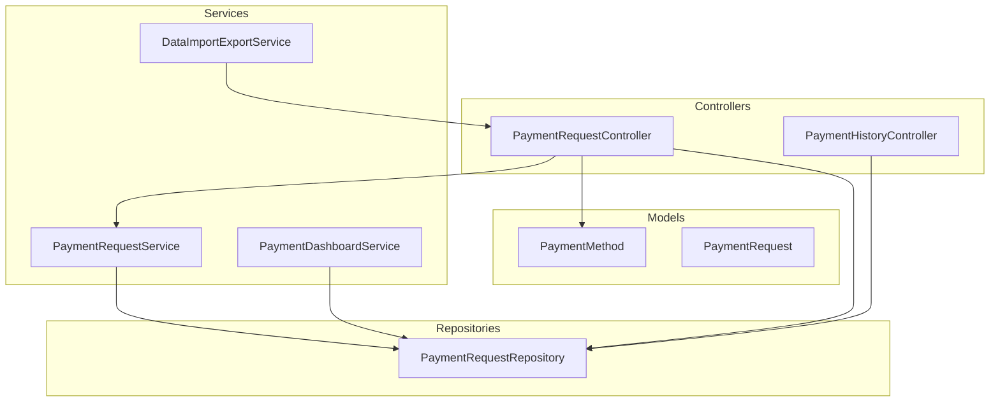
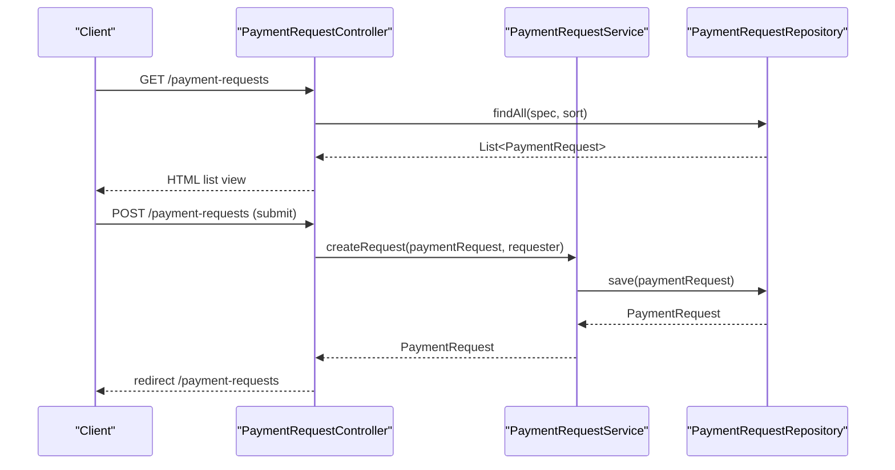
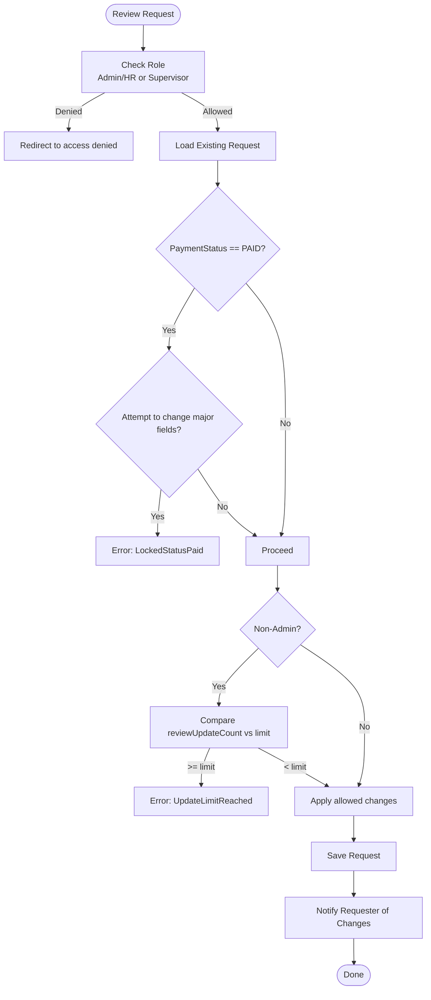
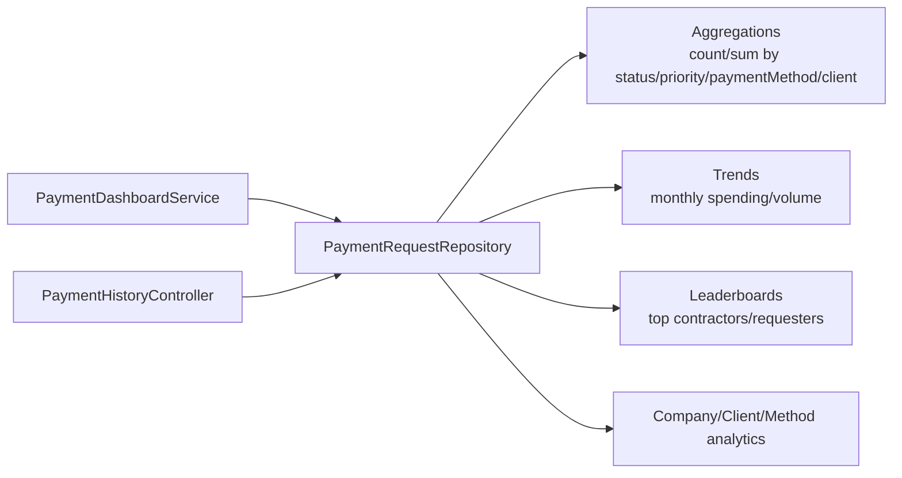
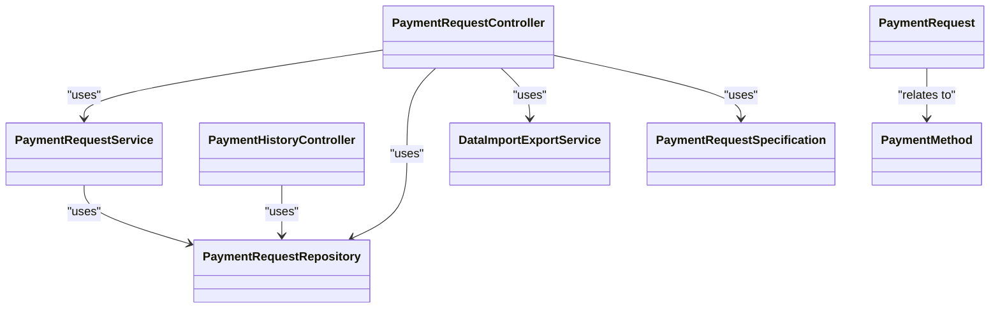

# Payment Operations API

<cite>
**Referenced Files in This Document**
- [PaymentRequestController.java](file://src/main/java/root/cyb/mh/attendancesystem/controller/PaymentRequestController.java)
- [PaymentRequestService.java](file://src/main/java/root/cyb/mh/attendancesystem/service/PaymentRequestService.java)
- [PaymentRequest.java](file://src/main/java/root/cyb/mh/attendancesystem/model/PaymentRequest.java)
- [PaymentMethod.java](file://src/main/java/root/cyb/mh/attendancesystem/model/PaymentMethod.java)
- [PaymentHistoryController.java](file://src/main/java/root/cyb/mh/attendancesystem/controller/PaymentHistoryController.java)
- [PaymentRequestRepository.java](file://src/main/java/root/cyb/mh/attendancesystem/repository/PaymentRequestRepository.java)
- [PaymentRequestSpecification.java](file://src/main/java/root/cyb/mh/attendancesystem/specification/PaymentRequestSpecification.java)
- [PaymentStatus.java](file://src/main/java/root/cyb/mh/attendancesystem/model/enums/PaymentStatus.java)
- [RequestStatus.java](file://src/main/java/root/cyb/mh/attendancesystem/model/enums/RequestStatus.java)
- [PaymentPriority.java](file://src/main/java/root/cyb/mh/attendancesystem/model/enums/PaymentPriority.java)
- [PPWStatus.java](file://src/main/java/root/cyb/mh/attendancesystem/model/enums/PPWStatus.java)
- [DataImportExportService.java](file://src/main/java/root/cyb/mh/attendancesystem/service/DataImportExportService.java)
- [PaymentDashboardService.java](file://src/main/java/root/cyb/mh/attendancesystem/service/PaymentDashboardService.java)
</cite>

## Table of Contents
1. [Introduction](#introduction)
2. [Project Structure](#project-structure)
3. [Core Components](#core-components)
4. [Architecture Overview](#architecture-overview)
5. [Detailed Component Analysis](#detailed-component-analysis)
6. [Dependency Analysis](#dependency-analysis)
7. [Performance Considerations](#performance-considerations)
8. [Troubleshooting Guide](#troubleshooting-guide)
9. [Conclusion](#conclusion)
10. [Appendices](#appendices)

## Introduction
This document describes the Payment Operations API for managing payment requests, approvals, payments, and financial reporting. It covers endpoints for creating and reviewing payment requests, exporting financial data, generating invoices, and retrieving historical and dashboard analytics. The API supports role-based access control (Admin, HR, Supervisor, Employee) and integrates with payment methods, contractors, clients, and companies.

## Project Structure
The payment operations are implemented as Spring MVC controllers backed by services and repositories. Controllers expose HTTP endpoints, services encapsulate business logic, and repositories provide data access with JPA Specifications for filtering and aggregations.

**Diagram sources**
- [PaymentRequestController.java:30-688](file://src/main/java/root/cyb/mh/attendancesystem/controller/PaymentRequestController.java#L30-L688)
- [PaymentHistoryController.java:24-265](file://src/main/java/root/cyb/mh/attendancesystem/controller/PaymentHistoryController.java#L24-L265)
- [PaymentRequestService.java:14-269](file://src/main/java/root/cyb/mh/attendancesystem/service/PaymentRequestService.java#L14-L269)
- [PaymentDashboardService.java:14-282](file://src/main/java/root/cyb/mh/attendancesystem/service/PaymentDashboardService.java#L14-L282)
- [DataImportExportService.java:17-200](file://src/main/java/root/cyb/mh/attendancesystem/service/DataImportExportService.java#L17-L200)
- [PaymentRequestRepository.java:10-742](file://src/main/java/root/cyb/mh/attendancesystem/repository/PaymentRequestRepository.java#L10-L742)
- [PaymentRequest.java:13-117](file://src/main/java/root/cyb/mh/attendancesystem/model/PaymentRequest.java#L13-L117)
- [PaymentMethod.java:6-22](file://src/main/java/root/cyb/mh/attendancesystem/model/PaymentMethod.java#L6-L22)

**Section sources**
- [PaymentRequestController.java:30-688](file://src/main/java/root/cyb/mh/attendancesystem/controller/PaymentRequestController.java#L30-L688)
- [PaymentRequestService.java:14-269](file://src/main/java/root/cyb/mh/attendancesystem/service/PaymentRequestService.java#L14-L269)
- [PaymentRequestRepository.java:10-742](file://src/main/java/root/cyb/mh/attendancesystem/repository/PaymentRequestRepository.java#L10-L742)

## Core Components
- PaymentRequestController: Exposes endpoints for listing, filtering, creating, reviewing, deleting, downloading invoices, sending emails, and viewing payment proofs.
- PaymentRequestService: Handles creation, retrieval, updates, notifications, and sorting of payment requests.
- PaymentRequest: Entity representing a payment request with requester, contractor/client associations, amounts, statuses, and review fields.
- PaymentMethod: Defines supported payment methods (e.g., CashApp, Zelle).
- PaymentHistoryController: Provides admin-only historical views and exports (daily, weekly, monthly) and summary calculations.
- PaymentRequestRepository: JPA repository with extensive custom queries for analytics and filtering.
- PaymentRequestSpecification: Builds dynamic JPA criteria for filtering payment requests.
- Enums: PaymentStatus, RequestStatus, PaymentPriority, PPWStatus define allowed states.
- DataImportExportService: Generates CSV/PDF exports and invoice PDFs.
- PaymentDashboardService: Computes dashboard metrics and trends.

**Section sources**
- [PaymentRequestController.java:65-688](file://src/main/java/root/cyb/mh/attendancesystem/controller/PaymentRequestController.java#L65-L688)
- [PaymentRequestService.java:29-216](file://src/main/java/root/cyb/mh/attendancesystem/service/PaymentRequestService.java#L29-L216)
- [PaymentRequest.java:13-117](file://src/main/java/root/cyb/mh/attendancesystem/model/PaymentRequest.java#L13-L117)
- [PaymentMethod.java:6-22](file://src/main/java/root/cyb/mh/attendancesystem/model/PaymentMethod.java#L6-L22)
- [PaymentHistoryController.java:24-265](file://src/main/java/root/cyb/mh/attendancesystem/controller/PaymentHistoryController.java#L24-L265)
- [PaymentRequestRepository.java:10-742](file://src/main/java/root/cyb/mh/attendancesystem/repository/PaymentRequestRepository.java#L10-L742)
- [PaymentRequestSpecification.java:14-93](file://src/main/java/root/cyb/mh/attendancesystem/specification/PaymentRequestSpecification.java#L14-L93)
- [PaymentStatus.java:3-8](file://src/main/java/root/cyb/mh/attendancesystem/model/enums/PaymentStatus.java#L3-L8)
- [RequestStatus.java:3-7](file://src/main/java/root/cyb/mh/attendancesystem/model/enums/RequestStatus.java#L3-L7)
- [PaymentPriority.java:3-7](file://src/main/java/root/cyb/mh/attendancesystem/model/enums/PaymentPriority.java#L3-L7)
- [PPWStatus.java:3-7](file://src/main/java/root/cyb/mh/attendancesystem/model/enums/PPWStatus.java#L3-L7)
- [DataImportExportService.java:17-200](file://src/main/java/root/cyb/mh/attendancesystem/service/DataImportExportService.java#L17-L200)
- [PaymentDashboardService.java:23-102](file://src/main/java/root/cyb/mh/attendancesystem/service/PaymentDashboardService.java#L23-L102)

## Architecture Overview
The system follows layered architecture:
- Presentation: Controllers handle HTTP requests and render views or streams.
- Application: Services orchestrate domain logic, enforce policies, and trigger notifications.
- Persistence: Repositories manage data access and complex SQL analytics.
- Models: Entities and enums represent business concepts and states.

**Diagram sources**
- [PaymentRequestController.java:65-281](file://src/main/java/root/cyb/mh/attendancesystem/controller/PaymentRequestController.java#L65-L281)
- [PaymentRequestService.java:29-90](file://src/main/java/root/cyb/mh/attendancesystem/service/PaymentRequestService.java#L29-L90)
- [PaymentRequestRepository.java:10-31](file://src/main/java/root/cyb/mh/attendancesystem/repository/PaymentRequestRepository.java#L10-L31)

## Detailed Component Analysis

### Payment Request Management Endpoints
- GET /payment-requests
  - Purpose: List payment requests with filters and sorting.
  - Filters: start/end dates, contractorId, clientId, paymentMethodId, workOrderNumber, requesterName, priority, status, paymentStatus, ppwUpdateStatus, view.
  - Sorting: sortField, sortDir.
  - Access: Requires authenticated user; view visibility depends on role and view parameter.
  - Response: HTML page with filtered list and dropdown master data.

- GET /payment-requests/new
  - Purpose: Render new request form with master data (contractors, clients, payment methods, priorities).
  - Response: HTML form.

- POST /payment-requests
  - Purpose: Submit a new payment request.
  - Input: Form-backed PaymentRequest.
  - Behavior: Determines requester as User or Employee and persists with default status PENDING.
  - Response: Redirect to list.

- GET /payment-requests/{id}
  - Purpose: View a payment request.
  - Access: Admin/HR or supervisor of requester; auto-updates check status.
  - Response: HTML view with editable fields and review controls.

- POST /payment-requests/{id}/review
  - Purpose: Approve/reject, update payment status, PPW status, remarks, check status, payment reference number.
  - Restrictions: Locked for PAID requests; update limits enforced for non-admin reviewers.
  - Proof Upload: Optional multipart file stored under uploads/proofs.
  - Notifications: Notifies requester on status changes.

- POST /payment-requests/{id}/delete
  - Purpose: Delete a REJECTED request.
  - Access: ADMIN only.

- GET /payment-requests/{id}/invoice
  - Purpose: Download invoice PDF for PAID requests.
  - Access: Admin/HR or requester.

- POST /payment-requests/{id}/send-email
  - Purpose: Send invoice to an email address and record metadata.

- POST /payment-requests/{id}/employee-note
  - Purpose: Add a note from requester (only PENDING requests).

- GET /payment-requests/{id}/proof
  - Purpose: Stream uploaded payment proof file.

- GET /payment-requests/export
  - Purpose: Export filtered list to CSV or PDF with optional column selection.

**Section sources**
- [PaymentRequestController.java:65-688](file://src/main/java/root/cyb/mh/attendancesystem/controller/PaymentRequestController.java#L65-L688)

### Payment History and Reporting Endpoints
- GET /admin/history/daily
  - Purpose: Daily history view with summary totals and filters.
- GET /admin/history/weekly
  - Purpose: Weekly history view with filters.
- GET /admin/history/monthly
  - Purpose: Monthly history view with filters.
- GET /admin/history/export
  - Purpose: Export history to CSV or PDF with date range and filters.

**Section sources**
- [PaymentHistoryController.java:24-265](file://src/main/java/root/cyb/mh/attendancesystem/controller/PaymentHistoryController.java#L24-L265)

### Data Models and Schemas

#### PaymentRequest
- Identity: id, requestDate, lastModified.
- Requester: requester (User), employeeRequester (Employee).
- Work Order: workOrderNumber, amount.
- Contractor/Client: contractor, client; deprecated fields retained for compatibility.
- Payment Method: paymentMethod (preferred), paymentMethodId (deprecated), paymentAccountDetails, paymentReferenceNumber.
- Company: company.
- Priority/Status: priority (PaymentPriority), status (RequestStatus), paymentStatus (PaymentStatus), ppwUpdateStatus (PPWStatus).
- Review Fields: checkStatus, approvalAuthority (User), approvalEmployee (Employee), remarks, reviewUpdateCount.
- Notes: employeeNote.
- Email Tracking: lastEmailSentAt, lastEmailSentTo.
- Proof: paymentProofPath.

**Section sources**
- [PaymentRequest.java:13-117](file://src/main/java/root/cyb/mh/attendancesystem/model/PaymentRequest.java#L13-L117)

#### PaymentMethod
- Identity: id, methodName (unique), description, active.

**Section sources**
- [PaymentMethod.java:6-22](file://src/main/java/root/cyb/mh/attendancesystem/model/PaymentMethod.java#L6-L22)

#### Enums
- PaymentStatus: PAID, UNPAID, ISSUE, CASH_APP_REQUESTED.
- RequestStatus: PENDING, APPROVED, REJECTED.
- PaymentPriority: REGULAR, URGENT, HOLD.
- PPWStatus: UPDATED, NOT_UPDATED, DISPUTE.

**Section sources**
- [PaymentStatus.java:3-8](file://src/main/java/root/cyb/mh/attendancesystem/model/enums/PaymentStatus.java#L3-L8)
- [RequestStatus.java:3-7](file://src/main/java/root/cyb/mh/attendancesystem/model/enums/RequestStatus.java#L3-L7)
- [PaymentPriority.java:3-7](file://src/main/java/root/cyb/mh/attendancesystem/model/enums/PaymentPriority.java#L3-L7)
- [PPWStatus.java:3-7](file://src/main/java/root/cyb/mh/attendancesystem/model/enums/PPWStatus.java#L3-L7)

### Approval Workflow and Restrictions
- Access Control:
  - Admin/HR can review any request.
  - Supervisors can review team members’ requests based on reporting hierarchy.
  - Employees can add notes only on their own PENDING requests.
- Restrictions:
  - PAID requests: Major fields locked for non-admin users.
  - Update limits: Controlled by system setting PAYMENT_REVIEW_UPDATE_LIMIT.
- Review Fields:
  - Status, PaymentStatus, PPWStatus, Remarks, CheckStatus, Payment Reference Number.
  - Optional proof upload stored on disk.

**Diagram sources**
- [PaymentRequestController.java:333-517](file://src/main/java/root/cyb/mh/attendancesystem/controller/PaymentRequestController.java#L333-L517)

**Section sources**
- [PaymentRequestController.java:333-517](file://src/main/java/root/cyb/mh/attendancesystem/controller/PaymentRequestController.java#L333-L517)

### Financial Reporting and Analytics
- Export Formats: CSV and PDF for payment requests and history.
- History Views: Daily, weekly, monthly with summary totals and filters.
- Dashboard Metrics: Counts, sums, averages, trends, distributions, recent activity, top contractors/requesters.
- Repository Analytics: Extensive SQL queries for financial summaries, trends, leaderboards, and SWOT-style insights.

**Diagram sources**
- [PaymentRequestRepository.java:32-193](file://src/main/java/root/cyb/mh/attendancesystem/repository/PaymentRequestRepository.java#L32-L193)
- [PaymentDashboardService.java:23-102](file://src/main/java/root/cyb/mh/attendancesystem/service/PaymentDashboardService.java#L23-L102)
- [PaymentHistoryController.java:39-102](file://src/main/java/root/cyb/mh/attendancesystem/controller/PaymentHistoryController.java#L39-L102)

**Section sources**
- [PaymentRequestRepository.java:32-742](file://src/main/java/root/cyb/mh/attendancesystem/repository/PaymentRequestRepository.java#L32-L742)
- [PaymentDashboardService.java:23-282](file://src/main/java/root/cyb/mh/attendancesystem/service/PaymentDashboardService.java#L23-L282)
- [PaymentHistoryController.java:39-265](file://src/main/java/root/cyb/mh/attendancesystem/controller/PaymentHistoryController.java#L39-L265)

### Data Export and Invoice Generation
- Payment Requests Export: CSV/PDF with optional columns; supports filters.
- History Export: CSV/PDF by date range (daily/weekly/monthly).
- Invoice PDF: Generated for PAID requests and downloadable by authorized users.

**Section sources**
- [PaymentRequestController.java:149-194](file://src/main/java/root/cyb/mh/attendancesystem/controller/PaymentRequestController.java#L149-L194)
- [PaymentHistoryController.java:39-102](file://src/main/java/root/cyb/mh/attendancesystem/controller/PaymentHistoryController.java#L39-L102)
- [DataImportExportService.java:17-200](file://src/main/java/root/cyb/mh/attendancesystem/service/DataImportExportService.java#L17-L200)

## Dependency Analysis
- Controllers depend on services and repositories for data access and business logic.
- Services depend on repositories and notification/email services.
- Repositories depend on JPA and custom SQL/analytics queries.
- Models and enums define the domain contract.

**Diagram sources**
- [PaymentRequestController.java:30-688](file://src/main/java/root/cyb/mh/attendancesystem/controller/PaymentRequestController.java#L30-L688)
- [PaymentRequestService.java:14-269](file://src/main/java/root/cyb/mh/attendancesystem/service/PaymentRequestService.java#L14-L269)
- [PaymentHistoryController.java:24-265](file://src/main/java/root/cyb/mh/attendancesystem/controller/PaymentHistoryController.java#L24-L265)
- [PaymentRequestRepository.java:10-742](file://src/main/java/root/cyb/mh/attendancesystem/repository/PaymentRequestRepository.java#L10-L742)
- [PaymentRequest.java:13-117](file://src/main/java/root/cyb/mh/attendancesystem/model/PaymentRequest.java#L13-L117)
- [PaymentMethod.java:6-22](file://src/main/java/root/cyb/mh/attendancesystem/model/PaymentMethod.java#L6-L22)
- [PaymentRequestSpecification.java:14-93](file://src/main/java/root/cyb/mh/attendancesystem/specification/PaymentRequestSpecification.java#L14-L93)
- [DataImportExportService.java:17-200](file://src/main/java/root/cyb/mh/attendancesystem/service/DataImportExportService.java#L17-L200)

**Section sources**
- [PaymentRequestController.java:30-688](file://src/main/java/root/cyb/mh/attendancesystem/controller/PaymentRequestController.java#L30-L688)
- [PaymentRequestService.java:14-269](file://src/main/java/root/cyb/mh/attendancesystem/service/PaymentRequestService.java#L14-L269)
- [PaymentHistoryController.java:24-265](file://src/main/java/root/cyb/mh/attendancesystem/controller/PaymentHistoryController.java#L24-L265)
- [PaymentRequestRepository.java:10-742](file://src/main/java/root/cyb/mh/attendancesystem/repository/PaymentRequestRepository.java#L10-L742)

## Performance Considerations
- Filtering and Sorting: Use appropriate filters and sort fields to reduce result sets.
- Pagination: Prefer server-side pagination for large datasets.
- Aggregations: Repository queries compute heavy analytics; cache results where feasible.
- File Uploads: Store uploaded proofs efficiently and consider retention policies.
- Notifications: Batch or async notifications can reduce latency.

## Troubleshooting Guide
- Access Denied:
  - Ensure user has required roles (ADMIN, HR) or is supervisor of requester.
- Locked Status Paid:
  - Cannot modify major fields for PAID requests; adjust system settings or revert to prior status.
- Update Limit Reached:
  - Non-admin reviewers are limited by PAYMENT_REVIEW_UPDATE_LIMIT; reset or escalate.
- Invoice Not Available:
  - Invoices are generated only for PAID requests; verify paymentStatus.
- Email Sending Errors:
  - Verify email configuration and recipient address validity.

**Section sources**
- [PaymentRequestController.java:381-517](file://src/main/java/root/cyb/mh/attendancesystem/controller/PaymentRequestController.java#L381-L517)
- [PaymentRequestController.java:542-582](file://src/main/java/root/cyb/mh/attendancesystem/controller/PaymentRequestController.java#L542-L582)

## Conclusion
The Payment Operations API provides a robust foundation for managing payment requests, approvals, payments, and financial reporting. It enforces role-based access, supports flexible filtering and export capabilities, and offers rich analytics through repository-driven queries. The documented endpoints and schemas enable developers to integrate and extend the system effectively.

## Appendices

### Endpoint Reference

- GET /payment-requests
  - Filters: startDate, endDate, contractorId, clientId, paymentMethodId, workOrderNumber, requesterName, priority, status, paymentStatus, ppwUpdateStatus, view
  - Sorting: sortField, sortDir
  - Response: HTML list view

- GET /payment-requests/new
  - Response: HTML form

- POST /payment-requests
  - Body: Form-backed PaymentRequest
  - Response: Redirect

- GET /payment-requests/{id}
  - Response: HTML view

- POST /payment-requests/{id}/review
  - Query params: status, paymentStatus, checkStatus, ppwUpdateStatus, paymentReferenceNumber, remarks, proofFile
  - Response: Redirect

- POST /payment-requests/{id}/delete
  - Response: Redirect

- GET /payment-requests/{id}/invoice
  - Response: PDF stream

- POST /payment-requests/{id}/send-email
  - Query param: email
  - Response: Redirect

- POST /payment-requests/{id}/employee-note
  - Query param: employeeNote
  - Response: Redirect

- GET /payment-requests/{id}/proof
  - Response: File stream

- GET /payment-requests/export
  - Query params: format (csv/pdf), columns, filters, sortField, sortDir
  - Response: CSV/PDF stream

- GET /admin/history/daily
  - Query params: date, filters
  - Response: HTML daily view

- GET /admin/history/weekly
  - Query params: startDate, filters
  - Response: HTML weekly view

- GET /admin/history/monthly
  - Query params: year, month, filters
  - Response: HTML monthly view

- GET /admin/history/export
  - Query params: format (csv/pdf), columns, date, startDate, year, month, filters
  - Response: CSV/PDF stream

**Section sources**
- [PaymentRequestController.java:65-688](file://src/main/java/root/cyb/mh/attendancesystem/controller/PaymentRequestController.java#L65-L688)
- [PaymentHistoryController.java:39-265](file://src/main/java/root/cyb/mh/attendancesystem/controller/PaymentHistoryController.java#L39-L265)