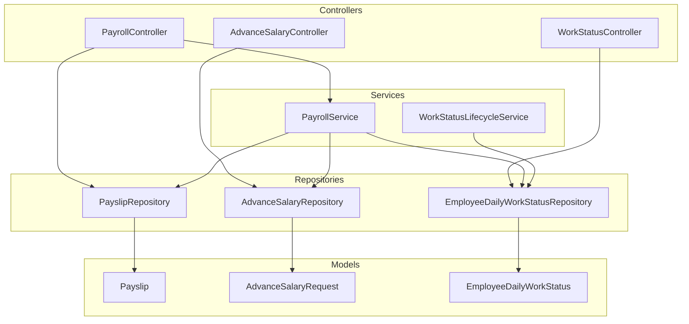
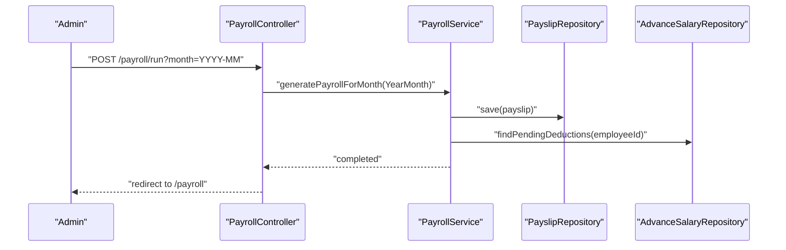
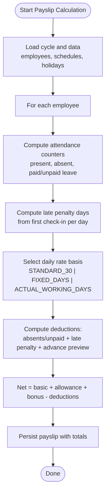
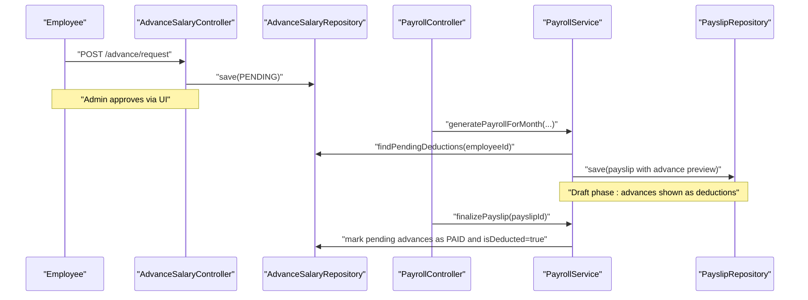
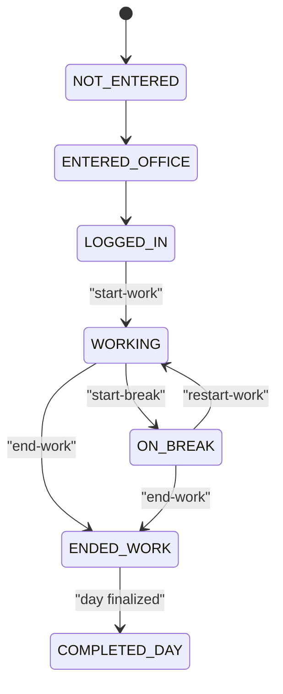
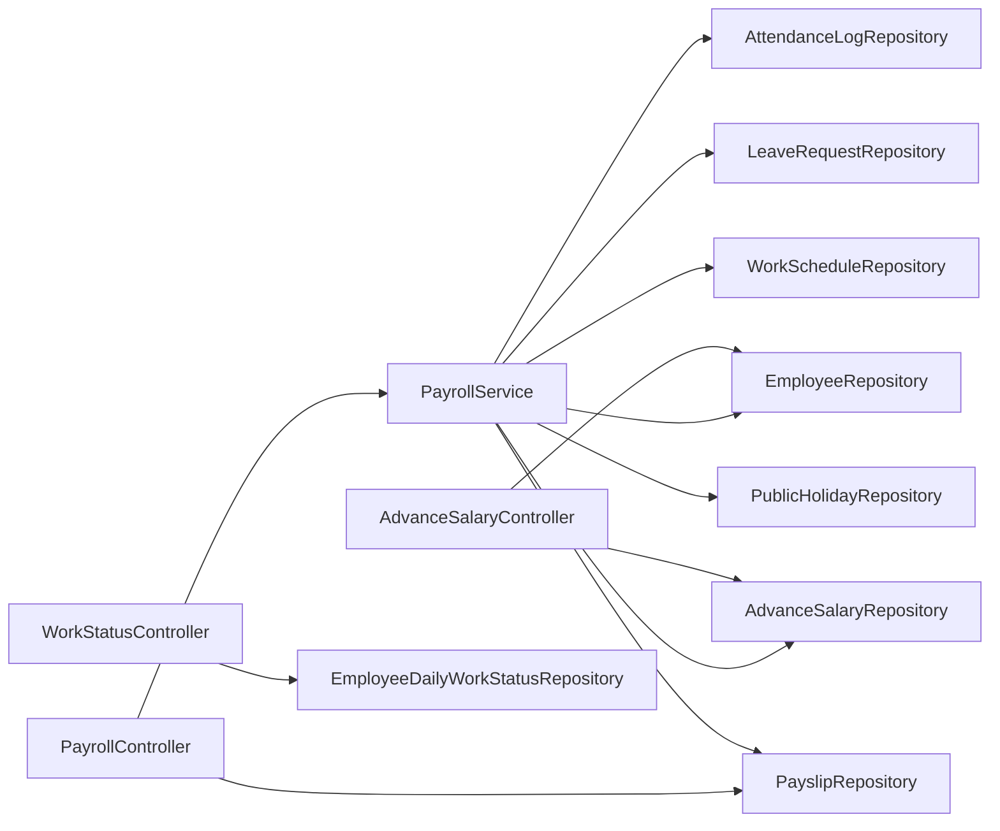
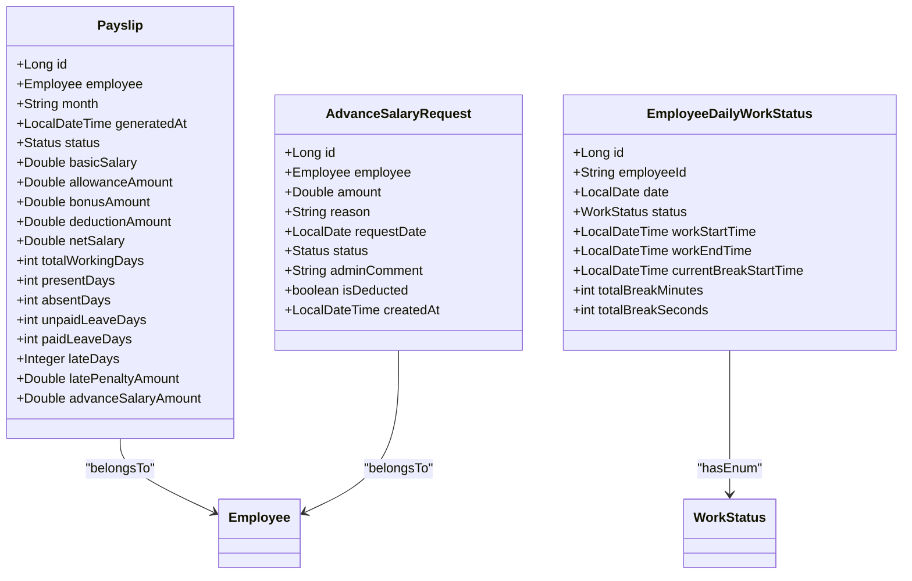

# Payroll API

<cite>
**Referenced Files in This Document**
- [PayrollController.java](file://src/main/java/root/cyb/mh/attendancesystem/controller/PayrollController.java)
- [PayrollService.java](file://src/main/java/root/cyb/mh/attendancesystem/service/PayrollService.java)
- [Payslip.java](file://src/main/java/root/cyb/mh/attendancesystem/model/Payslip.java)
- [PayrollMonthlySummaryDto.java](file://src/main/java/root/cyb/mh/attendancesystem/dto/PayrollMonthlySummaryDto.java)
- [PayslipRepository.java](file://src/main/java/root/cyb/mh/attendancesystem/repository/PayslipRepository.java)
- [AdvanceSalaryController.java](file://src/main/java/root/cyb/mh/attendancesystem/controller/AdvanceSalaryController.java)
- [AdvanceSalaryRepository.java](file://src/main/java/root/cyb/mh/attendancesystem/repository/AdvanceSalaryRepository.java)
- [AdvanceSalaryRequest.java](file://src/main/java/root/cyb/mh/attendancesystem/model/AdvanceSalaryRequest.java)
- [WorkStatusController.java](file://src/main/java/root/cyb/mh/attendancesystem/controller/WorkStatusController.java)
- [EmployeeDailyWorkStatus.java](file://src/main/java/root/cyb/mh/attendancesystem/model/EmployeeDailyWorkStatus.java)
- [WorkStatus.java](file://src/main/java/root/cyb/mh/attendancesystem/model/WorkStatus.java)
- [EmployeeDailyWorkStatusRepository.java](file://src/main/java/root/cyb/mh/attendancesystem/repository/EmployeeDailyWorkStatusRepository.java)
- [WorkStatusLifecycleService.java](file://src/main/java/root/cyb/mh/attendancesystem/service/WorkStatusLifecycleService.java)
- [application.properties](file://src/main/resources/application.properties)
</cite>

## Table of Contents
1. [Introduction](#introduction)
2. [Project Structure](#project-structure)
3. [Core Components](#core-components)
4. [Architecture Overview](#architecture-overview)
5. [Detailed Component Analysis](#detailed-component-analysis)
6. [Dependency Analysis](#dependency-analysis)
7. [Performance Considerations](#performance-considerations)
8. [Troubleshooting Guide](#troubleshooting-guide)
9. [Conclusion](#conclusion)
10. [Appendices](#appendices)

## Introduction
This document describes the payroll processing APIs and related workflows for salary calculations, payslip generation, advance salary processing, and work status management. It covers endpoint definitions, request/response formats, payroll cycles, deduction computations, and payment processing flows. The backend is a Spring Boot application with JPA repositories and service-layer orchestration.

## Project Structure
The payroll domain spans controllers, services, models, DTOs, and repositories:
- Controllers expose HTTP endpoints for payroll runs, payslip updates, exports, and employee views.
- Services encapsulate business logic for payslip calculation, status finalization, and advance salary deduction linkage.
- Models define persisted entities (Payslip, AdvanceSalaryRequest, EmployeeDailyWorkStatus).
- DTOs carry summary data for dashboards.
- Repositories provide data access for persistence.

**Diagram sources**
- [PayrollController.java:1-223](file://src/main/java/root/cyb/mh/attendancesystem/controller/PayrollController.java#L1-L223)
- [PayrollService.java:1-318](file://src/main/java/root/cyb/mh/attendancesystem/service/PayrollService.java#L1-L318)
- [PayslipRepository.java:1-15](file://src/main/java/root/cyb/mh/attendancesystem/repository/PayslipRepository.java#L1-L15)
- [AdvanceSalaryRepository.java:1-28](file://src/main/java/root/cyb/mh/attendancesystem/repository/AdvanceSalaryRepository.java#L1-L28)
- [AdvanceSalaryController.java:1-83](file://src/main/java/root/cyb/mh/attendancesystem/controller/AdvanceSalaryController.java#L1-L83)
- [WorkStatusController.java:1-112](file://src/main/java/root/cyb/mh/attendancesystem/controller/WorkStatusController.java#L1-L112)
- [EmployeeDailyWorkStatusRepository.java](file://src/main/java/root/cyb/mh/attendancesystem/repository/EmployeeDailyWorkStatusRepository.java)
- [Payslip.java:1-57](file://src/main/java/root/cyb/mh/attendancesystem/model/Payslip.java#L1-L57)
- [AdvanceSalaryRequest.java:1-49](file://src/main/java/root/cyb/mh/attendancesystem/model/AdvanceSalaryRequest.java#L1-L49)
- [EmployeeDailyWorkStatus.java:1-45](file://src/main/java/root/cyb/mh/attendancesystem/model/EmployeeDailyWorkStatus.java#L1-L45)
- [WorkStatusLifecycleService.java](file://src/main/java/root/cyb/mh/attendancesystem/service/WorkStatusLifecycleService.java)

**Section sources**
- [PayrollController.java:1-223](file://src/main/java/root/cyb/mh/attendancesystem/controller/PayrollController.java#L1-L223)
- [PayrollService.java:1-318](file://src/main/java/root/cyb/mh/attendancesystem/service/PayrollService.java#L1-L318)
- [PayslipRepository.java:1-15](file://src/main/java/root/cyb/mh/attendancesystem/repository/PayslipRepository.java#L1-L15)
- [AdvanceSalaryRepository.java:1-28](file://src/main/java/root/cyb/mh/attendancesystem/repository/AdvanceSalaryRepository.java#L1-L28)
- [AdvanceSalaryController.java:1-83](file://src/main/java/root/cyb/mh/attendancesystem/controller/AdvanceSalaryController.java#L1-L83)
- [WorkStatusController.java:1-112](file://src/main/java/root/cyb/mh/attendancesystem/controller/WorkStatusController.java#L1-L112)
- [Payslip.java:1-57](file://src/main/java/root/cyb/mh/attendancesystem/model/Payslip.java#L1-L57)
- [AdvanceSalaryRequest.java:1-49](file://src/main/java/root/cyb/mh/attendancesystem/model/AdvanceSalaryRequest.java#L1-L49)
- [EmployeeDailyWorkStatus.java:1-45](file://src/main/java/root/cyb/mh/attendancesystem/model/EmployeeDailyWorkStatus.java#L1-L45)
- [WorkStatusLifecycleService.java](file://src/main/java/root/cyb/mh/attendancesystem/service/WorkStatusLifecycleService.java)

## Core Components
- PayrollController: Exposes endpoints for payroll dashboard, details, status updates, bulk marking paid, generation triggers, bonus updates, deletion, employee payroll view, and bank advice export.
- PayrollService: Implements payslip calculation, including daily rate basis, attendance-based deductions, late penalties, bonuses, allowances, and advance salary deductions. Finalizes payslips and marks advance requests as deducted.
- Payslip: Entity storing monthly salary breakdown, attendance summary, and status.
- PayrollMonthlySummaryDto: DTO aggregating monthly payroll statistics for dashboards.
- AdvanceSalaryController and AdvanceSalaryRepository: Manage advance salary requests lifecycle and pending deductions.
- WorkStatusController and EmployeeDailyWorkStatus: Track daily work status transitions for employees.

**Section sources**
- [PayrollController.java:1-223](file://src/main/java/root/cyb/mh/attendancesystem/controller/PayrollController.java#L1-L223)
- [PayrollService.java:1-318](file://src/main/java/root/cyb/mh/attendancesystem/service/PayrollService.java#L1-L318)
- [Payslip.java:1-57](file://src/main/java/root/cyb/mh/attendancesystem/model/Payslip.java#L1-L57)
- [PayrollMonthlySummaryDto.java:1-22](file://src/main/java/root/cyb/mh/attendancesystem/dto/PayrollMonthlySummaryDto.java#L1-L22)
- [AdvanceSalaryController.java:1-83](file://src/main/java/root/cyb/mh/attendancesystem/controller/AdvanceSalaryController.java#L1-L83)
- [AdvanceSalaryRepository.java:1-28](file://src/main/java/root/cyb/mh/attendancesystem/repository/AdvanceSalaryRepository.java#L1-L28)
- [WorkStatusController.java:1-112](file://src/main/java/root/cyb/mh/attendancesystem/controller/WorkStatusController.java#L1-L112)
- [EmployeeDailyWorkStatus.java:1-45](file://src/main/java/root/cyb/mh/attendancesystem/model/EmployeeDailyWorkStatus.java#L1-L45)

## Architecture Overview
The payroll system follows a layered architecture:
- Presentation: Controllers handle HTTP requests and render views or return downloadable content.
- Business: Services encapsulate calculation and workflow logic.
- Persistence: Repositories manage entity persistence.

**Diagram sources**
- [PayrollController.java:108-113](file://src/main/java/root/cyb/mh/attendancesystem/controller/PayrollController.java#L108-L113)
- [PayrollService.java:39-92](file://src/main/java/root/cyb/mh/attendancesystem/service/PayrollService.java#L39-L92)
- [PayslipRepository.java:1-15](file://src/main/java/root/cyb/mh/attendancesystem/repository/PayslipRepository.java#L1-L15)
- [AdvanceSalaryRepository.java:20-22](file://src/main/java/root/cyb/mh/attendancesystem/repository/AdvanceSalaryRepository.java#L20-L22)

## Detailed Component Analysis

### Payroll Endpoints
- GET /payroll
  - Purpose: Load payroll dashboard with monthly summaries.
  - Response: HTML view with aggregated summaries per month.
  - Notes: Summaries derived from Payslip entities grouped by month.

- GET /payroll/details/{month}
  - Purpose: View payslips for a given month with optional department filtering.
  - Query params:
    - month: "YYYY-MM"
    - departmentIds: comma-separated list of department IDs (optional)
  - Response: HTML view listing payslips and departments.

- POST /payroll/status/update
  - Purpose: Update payslip status; marking "PAID" triggers finalization.
  - Form params:
    - payslipId: numeric ID
    - status: "DRAFT" or "PAID"
  - Behavior:
    - If status is "PAID": invokes finalizePayslip to mark payslip and linked advances as paid.
    - Otherwise: updates status directly.

- POST /payroll/status/bulk-paid
  - Purpose: Bulk mark all DRAFT payslips for a month as PAID.
  - Form params:
    - month: "YYYY-MM"

- POST /payroll/run
  - Purpose: Trigger payroll generation for a given month.
  - Form params:
    - month: "YYYY-MM"

- POST /payroll/bonus/update
  - Purpose: Update bonus for a DRAFT payslip and recalculate net pay.
  - Form params:
    - payslipId: numeric ID
    - amount: numeric bonus amount
  - Behavior: Re-calculates net = basic + allowance + bonus - deductions.

- GET /payroll/delete/{id}
  - Purpose: Delete a payslip by ID.
  - Response: Redirect to previous page or /payroll.

- GET /employee/payroll
  - Purpose: Employee view of personal payslips with financial insights (YTD earnings, total bonuses, best month, income trend).
  - Response: HTML view with charts and summary metrics.

- GET /payroll/export/bank-advice
  - Purpose: Export bank advice for a month as Excel.
  - Query params:
    - month: "YYYY-MM"
  - Response: application/vnd.openxmlformats-officedocument.spreadsheetml.sheet attachment.

**Section sources**
- [PayrollController.java:29-220](file://src/main/java/root/cyb/mh/attendancesystem/controller/PayrollController.java#L29-L220)

### Payroll Calculation Logic
Key steps implemented in PayrollService.calculatePayslip:
- Cycle boundaries: start/end of month derived from YearMonth.
- Eligibility: skip guests and future joiners after cycle end.
- Attendance snapshot: present days, absent days, paid/unpaid leave days.
- Late penalties: compute penalty days based on first check-in per day against schedule tolerance.
- Daily rate basis: supports STANDARD_30, FIXED_DAYS, ACTUAL_WORKING_DAYS.
- Deductions: absent days + unpaid leave days + late penalty days; advance salary deductions previewed but not finalized until payslip is PAID.
- Net salary: basic + allowance + bonus - total deductions.

**Diagram sources**
- [PayrollService.java:94-290](file://src/main/java/root/cyb/mh/attendancesystem/service/PayrollService.java#L94-L290)

**Section sources**
- [PayrollService.java:39-290](file://src/main/java/root/cyb/mh/attendancesystem/service/PayrollService.java#L39-L290)

### Payslip Entity and DTOs
- Payslip fields:
  - Identity: id, employee, month, generatedAt, status
  - Financials: basicSalary, allowanceAmount, bonusAmount, deductionAmount, netSalary
  - Attendance summary: totalWorkingDays, presentDays, absentDays, unpaidLeaveDays, paidLeaveDays
  - Details: lateDays, latePenaltyAmount, advanceSalaryAmount
  - Status enum: DRAFT, PAID

- PayrollMonthlySummaryDto fields:
  - month, totalEmployees, draftCount, paidCount, totalNetSalary

**Section sources**
- [Payslip.java:1-57](file://src/main/java/root/cyb/mh/attendancesystem/model/Payslip.java#L1-L57)
- [PayrollMonthlySummaryDto.java:1-22](file://src/main/java/root/cyb/mh/attendancesystem/dto/PayrollMonthlySummaryDto.java#L1-L22)

### Advance Salary Processing
- Employee request:
  - POST /advance/request
  - Form params: employeeId, amount, reason
  - Behavior: creates PENDING request

- Admin actions:
  - GET /admin/advance-requests: lists pending and history
  - POST /admin/advance/approve: sets APPROVED
  - POST /admin/advance/reject: sets REJECTED

- Payslip integration:
  - During payslip calculation, pending approved advances are aggregated as deductions (preview).
  - On finalizePayslip, pending advances for the employee are marked as PAID and isDeducted = true.

**Diagram sources**
- [AdvanceSalaryController.java:30-81](file://src/main/java/root/cyb/mh/attendancesystem/controller/AdvanceSalaryController.java#L30-L81)
- [AdvanceSalaryRepository.java:20-22](file://src/main/java/root/cyb/mh/attendancesystem/repository/AdvanceSalaryRepository.java#L20-L22)
- [PayrollController.java:80-105](file://src/main/java/root/cyb/mh/attendancesystem/controller/PayrollController.java#L80-L105)
- [PayrollService.java:292-316](file://src/main/java/root/cyb/mh/attendancesystem/service/PayrollService.java#L292-L316)

**Section sources**
- [AdvanceSalaryController.java:1-83](file://src/main/java/root/cyb/mh/attendancesystem/controller/AdvanceSalaryController.java#L1-L83)
- [AdvanceSalaryRepository.java:1-28](file://src/main/java/root/cyb/mh/attendancesystem/repository/AdvanceSalaryRepository.java#L1-L28)
- [PayrollService.java:259-316](file://src/main/java/root/cyb/mh/attendancesystem/service/PayrollService.java#L259-L316)

### Work Status Management
- Endpoint: POST /employee/work-status/start-work
  - Transitions from LOGGED_IN/ENTERED_OFFICE to WORKING and records workStartTime.

- Endpoint: POST /employee/work-status/start-break
  - Transitions from WORKING to ON_BREAK and records currentBreakStartTime.

- Endpoint: POST /employee/work-status/restart-work
  - From ON_BREAK back to WORKING; accumulates break duration.

- Endpoint: POST /employee/work-status/end-work
  - From WORKING/ON_BREAK to ENDED_WORK; optionally finalizes break time; records workEndTime.

**Diagram sources**
- [WorkStatus.java:1-14](file://src/main/java/root/cyb/mh/attendancesystem/model/WorkStatus.java#L1-L14)
- [WorkStatusController.java:25-110](file://src/main/java/root/cyb/mh/attendancesystem/controller/WorkStatusController.java#L25-L110)
- [EmployeeDailyWorkStatus.java:1-45](file://src/main/java/root/cyb/mh/attendancesystem/model/EmployeeDailyWorkStatus.java#L1-L45)

**Section sources**
- [WorkStatusController.java:1-112](file://src/main/java/root/cyb/mh/attendancesystem/controller/WorkStatusController.java#L1-L112)
- [WorkStatus.java:1-14](file://src/main/java/root/cyb/mh/attendancesystem/model/WorkStatus.java#L1-L14)
- [EmployeeDailyWorkStatus.java:1-45](file://src/main/java/root/cyb/mh/attendancesystem/model/EmployeeDailyWorkStatus.java#L1-L45)

## Dependency Analysis
- PayrollController depends on PayrollService and PayslipRepository for generation, updates, and exports.
- PayrollService depends on EmployeeRepository, AttendanceLogRepository, LeaveRequestRepository, WorkScheduleRepository, PublicHolidayRepository, PayslipRepository, and AdvanceSalaryRepository for data and persistence.
- AdvanceSalaryController depends on AdvanceSalaryRepository and EmployeeRepository.
- WorkStatusController depends on EmployeeDailyWorkStatusRepository.

**Diagram sources**
- [PayrollController.java:1-223](file://src/main/java/root/cyb/mh/attendancesystem/controller/PayrollController.java#L1-L223)
- [PayrollService.java:1-318](file://src/main/java/root/cyb/mh/attendancesystem/service/PayrollService.java#L1-L318)
- [AdvanceSalaryController.java:1-83](file://src/main/java/root/cyb/mh/attendancesystem/controller/AdvanceSalaryController.java#L1-L83)
- [WorkStatusController.java:1-112](file://src/main/java/root/cyb/mh/attendancesystem/controller/WorkStatusController.java#L1-L112)

**Section sources**
- [PayrollController.java:1-223](file://src/main/java/root/cyb/mh/attendancesystem/controller/PayrollController.java#L1-L223)
- [PayrollService.java:1-318](file://src/main/java/root/cyb/mh/attendancesystem/service/PayrollService.java#L1-L318)
- [AdvanceSalaryController.java:1-83](file://src/main/java/root/cyb/mh/attendancesystem/controller/AdvanceSalaryController.java#L1-L83)
- [WorkStatusController.java:1-112](file://src/main/java/root/cyb/mh/attendancesystem/controller/WorkStatusController.java#L1-L112)

## Performance Considerations
- Bulk data fetching: PayrollService fetches attendance logs and approved leaves for the entire period to minimize repeated queries per employee.
- Early exits: Skips guest employees and future joiners outside the cycle window.
- Rounded monetary values: Deductions and net salary are rounded to two decimals to avoid floating-point precision issues.
- Indexing recommendations: Ensure indexes on:
  - Payslip.employee_id and Payslip.month
  - AttendanceLog.timestamp
  - LeaveRequest.employee_id and status
  - AdvanceSalaryRequest.employee_id and status/isDeducted
  - EmployeeDailyWorkStatus.employeeId and date

[No sources needed since this section provides general guidance]

## Troubleshooting Guide
- Payslip not recalculated after status change:
  - Ensure the payslip is in DRAFT status before updating bonus or marking PAID.
  - Verify finalizePayslip is invoked when changing status to PAID.

- Advance salary not deducted:
  - Confirm the advance request is APPROVED and not yet marked as deducted.
  - After payslip finalization, pending advances should be set to PAID and isDeducted = true.

- Incorrect attendance counts:
  - Validate WorkSchedule weekend days and late tolerance settings.
  - Confirm LeaveRequest status is APPROVED and within the month.

- Export returns empty rows:
  - Bank advice export filters out zero net salary payslips; ensure payslips are PAID or adjust filtering logic.

**Section sources**
- [PayrollService.java:292-316](file://src/main/java/root/cyb/mh/attendancesystem/service/PayrollService.java#L292-L316)
- [AdvanceSalaryRepository.java:20-22](file://src/main/java/root/cyb/mh/attendancesystem/repository/AdvanceSalaryRepository.java#L20-L22)
- [PayrollController.java:115-133](file://src/main/java/root/cyb/mh/attendancesystem/controller/PayrollController.java#L115-L133)

## Conclusion
The payroll system integrates attendance, leave, and scheduling data to compute accurate monthly payslips with configurable daily rate bases, attendance-based deductions, and late penalties. Advance salary requests are tracked and integrated into the payslip calculation and finalization process. Work status endpoints support daily tracking for productivity insights. The architecture cleanly separates concerns across controllers, services, and repositories, enabling maintainable and extensible payroll workflows.

[No sources needed since this section summarizes without analyzing specific files]

## Appendices

### API Reference Summary

- Payroll
  - GET /payroll
    - Description: Load payroll dashboard with monthly summaries.
    - Response: HTML view.

  - GET /payroll/details/{month}?departmentIds=...
    - Description: View payslips for a month with optional department filter.
    - Response: HTML view.

  - POST /payroll/status/update
    - Description: Update payslip status; "PAID" triggers finalization.
    - Form params: payslipId, status.

  - POST /payroll/status/bulk-paid
    - Description: Bulk mark all DRAFT payslips for a month as PAID.
    - Form params: month.

  - POST /payroll/run
    - Description: Run payroll generation for a month.
    - Form params: month.

  - POST /payroll/bonus/update
    - Description: Update bonus for a DRAFT payslip and recalculate net.
    - Form params: payslipId, amount.

  - GET /payroll/delete/{id}
    - Description: Delete a payslip by ID.
    - Response: Redirect.

  - GET /employee/payroll
    - Description: Employee payslips and financial insights.
    - Response: HTML view.

  - GET /payroll/export/bank-advice?month=YYYY-MM
    - Description: Export bank advice Excel for a month.
    - Response: Excel attachment.

- Advance Salary
  - POST /advance/request
    - Description: Submit advance salary request.
    - Form params: employeeId, amount, reason.

  - GET /admin/advance-requests
    - Description: View pending and history.
    - Response: HTML view.

  - POST /admin/advance/approve?id&comment
    - Description: Approve request.

  - POST /admin/advance/reject?id&comment
    - Description: Reject request.

- Work Status
  - POST /employee/work-status/start-work
    - Description: Start work day.

  - POST /employee/work-status/start-break
    - Description: Start break.

  - POST /employee/work-status/restart-work
    - Description: Restart work after break.

  - POST /employee/work-status/end-work
    - Description: End work day.

**Section sources**
- [PayrollController.java:29-220](file://src/main/java/root/cyb/mh/attendancesystem/controller/PayrollController.java#L29-L220)
- [AdvanceSalaryController.java:28-81](file://src/main/java/root/cyb/mh/attendancesystem/controller/AdvanceSalaryController.java#L28-L81)
- [WorkStatusController.java:18-110](file://src/main/java/root/cyb/mh/attendancesystem/controller/WorkStatusController.java#L18-L110)

### Data Models

**Diagram sources**
- [Payslip.java:1-57](file://src/main/java/root/cyb/mh/attendancesystem/model/Payslip.java#L1-L57)
- [AdvanceSalaryRequest.java:1-49](file://src/main/java/root/cyb/mh/attendancesystem/model/AdvanceSalaryRequest.java#L1-L49)
- [EmployeeDailyWorkStatus.java:1-45](file://src/main/java/root/cyb/mh/attendancesystem/model/EmployeeDailyWorkStatus.java#L1-L45)
- [WorkStatus.java:1-14](file://src/main/java/root/cyb/mh/attendancesystem/model/WorkStatus.java#L1-L14)