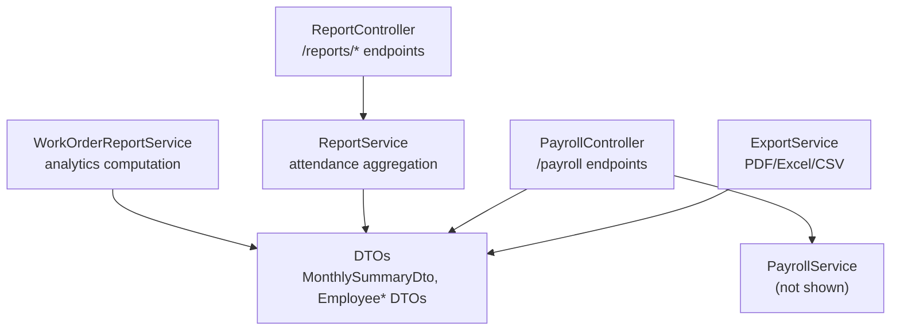
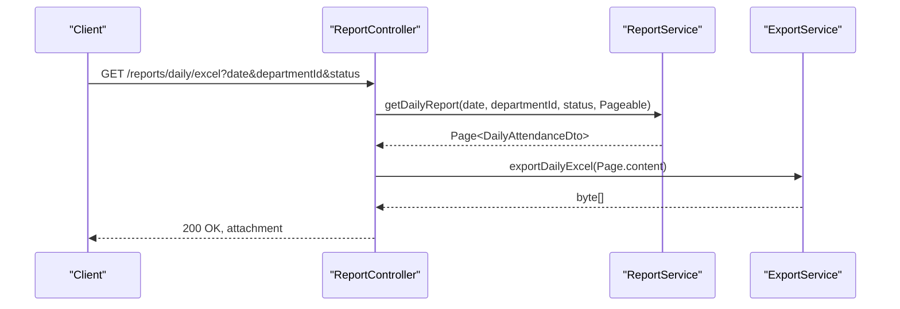
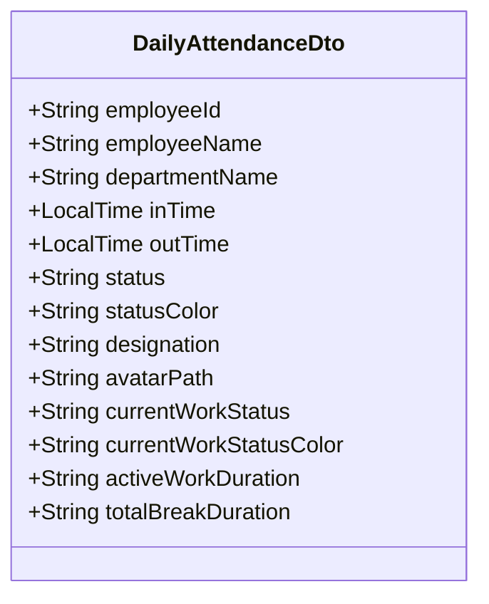
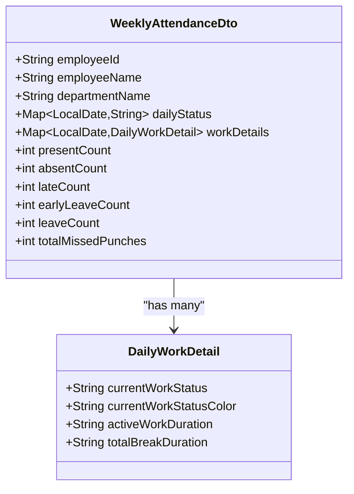
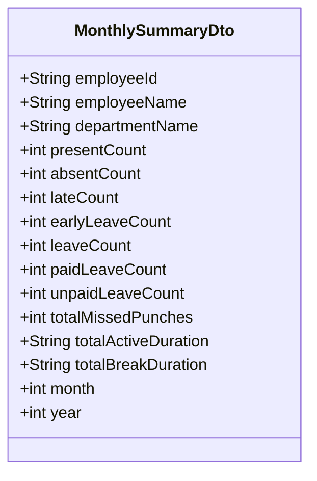
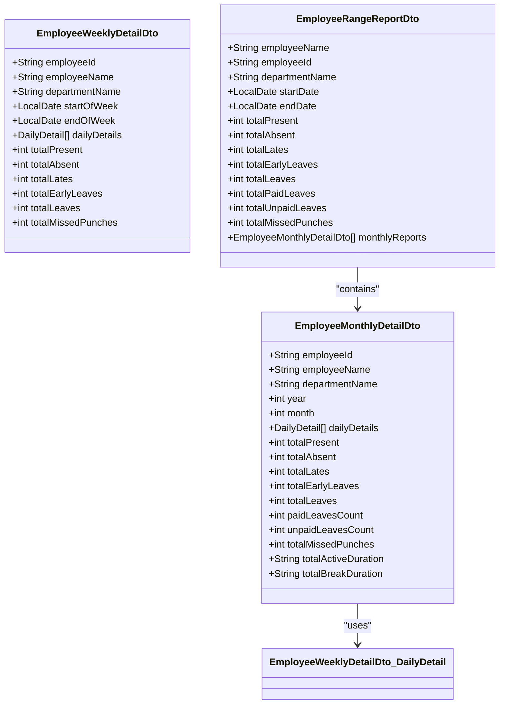
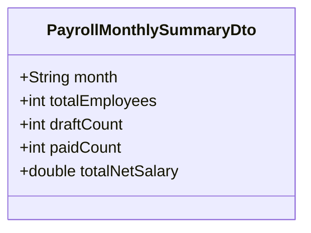
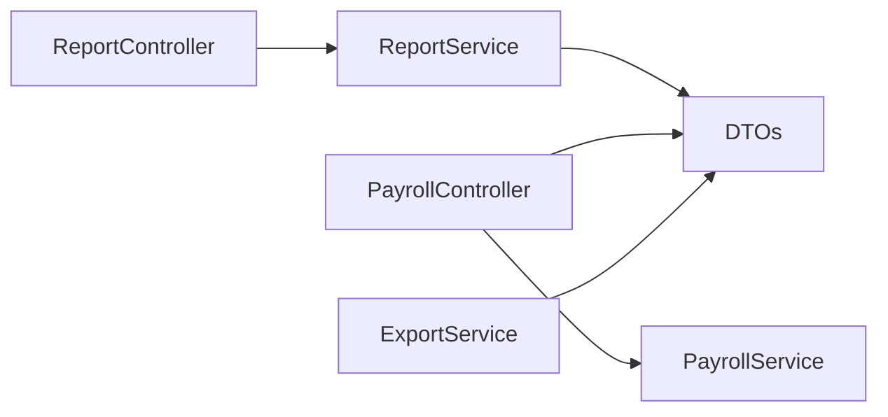

# Reporting API

<cite>
**Referenced Files in This Document**
- [ReportController.java](file://src/main/java/root/cyb/mh/attendancesystem/controller/ReportController.java)
- [ReportService.java](file://src/main/java/root/cyb/mh/attendancesystem/service/ReportService.java)
- [ExportService.java](file://src/main/java/root/cyb/mh/attendancesystem/service/ExportService.java)
- [PayrollController.java](file://src/main/java/root/cyb/mh/attendancesystem/controller/PayrollController.java)
- [WorkOrderReportService.java](file://src/main/java/root/cyb/mh/attendancesystem/service/WorkOrderReportService.java)
- [DailyAttendanceDto.java](file://src/main/java/root/cyb/mh/attendancesystem/dto/DailyAttendanceDto.java)
- [WeeklyAttendanceDto.java](file://src/main/java/root/cyb/mh/attendancesystem/dto/WeeklyAttendanceDto.java)
- [MonthlySummaryDto.java](file://src/main/java/root/cyb/mh/attendancesystem/dto/MonthlySummaryDto.java)
- [EmployeeWeeklyDetailDto.java](file://src/main/java/root/cyb/mh/attendancesystem/dto/EmployeeWeeklyDetailDto.java)
- [EmployeeMonthlyDetailDto.java](file://src/main/java/root/cyb/mh/attendancesystem/dto/EmployeeMonthlyDetailDto.java)
- [EmployeeRangeReportDto.java](file://src/main/java/root/cyb/mh/attendancesystem/dto/EmployeeRangeReportDto.java)
- [PayrollMonthlySummaryDto.java](file://src/main/java/root/cyb/mh/attendancesystem/dto/PayrollMonthlySummaryDto.java)
</cite>

## Table of Contents
1. [Introduction](#introduction)
2. [Project Structure](#project-structure)
3. [Core Components](#core-components)
4. [Architecture Overview](#architecture-overview)
5. [Detailed Component Analysis](#detailed-component-analysis)
6. [Dependency Analysis](#dependency-analysis)
7. [Performance Considerations](#performance-considerations)
8. [Troubleshooting Guide](#troubleshooting-guide)
9. [Conclusion](#conclusion)

## Introduction
This document describes the reporting and analytics endpoints for attendance, payroll, and work order analytics. It covers endpoint definitions, request/response schemas, filtering options, and supported export formats. The system provides paginated reports, sorting, and multiple export formats (PDF, Excel, CSV) for daily, weekly, and monthly attendance views, plus payroll summaries and work order analytics dashboards.

## Project Structure
The reporting functionality spans controllers, services, and DTOs:
- Controllers expose HTTP endpoints for report generation and exports
- Services compute aggregated data and apply filters
- DTOs define response schemas for each report type
- Export services transform DTO lists into downloadable formats

**Diagram sources**
- [ReportController.java:1-754](file://src/main/java/root/cyb/mh/attendancesystem/controller/ReportController.java#L1-L754)
- [ReportService.java:1-800](file://src/main/java/root/cyb/mh/attendancesystem/service/ReportService.java#L1-L800)
- [ExportService.java:1-579](file://src/main/java/root/cyb/mh/attendancesystem/service/ExportService.java#L1-L579)
- [PayrollController.java:1-223](file://src/main/java/root/cyb/mh/attendancesystem/controller/PayrollController.java#L1-L223)
- [WorkOrderReportService.java:1-841](file://src/main/java/root/cyb/mh/attendancesystem/service/WorkOrderReportService.java#L1-L841)

**Section sources**
- [ReportController.java:1-754](file://src/main/java/root/cyb/mh/attendancesystem/controller/ReportController.java#L1-L754)
- [ReportService.java:1-800](file://src/main/java/root/cyb/mh/attendancesystem/service/ReportService.java#L1-L800)
- [ExportService.java:1-579](file://src/main/java/root/cyb/mh/attendancesystem/service/ExportService.java#L1-L579)
- [PayrollController.java:1-223](file://src/main/java/root/cyb/mh/attendancesystem/controller/PayrollController.java#L1-L223)
- [WorkOrderReportService.java:1-841](file://src/main/java/root/cyb/mh/attendancesystem/service/WorkOrderReportService.java#L1-L841)

## Core Components
- ReportController: Exposes GET endpoints for daily, weekly, and monthly attendance reports and exports
- ReportService: Computes attendance aggregates, applies filters, and paginates results
- ExportService: Generates PDF, Excel, and CSV exports from DTO lists
- PayrollController: Provides payroll summaries and bank advice export
- WorkOrderReportService: Computes work order analytics and KPIs
- DTOs: Define structured response schemas for each report type

**Section sources**
- [ReportController.java:1-754](file://src/main/java/root/cyb/mh/attendancesystem/controller/ReportController.java#L1-L754)
- [ReportService.java:1-800](file://src/main/java/root/cyb/mh/attendancesystem/service/ReportService.java#L1-L800)
- [ExportService.java:1-579](file://src/main/java/root/cyb/mh/attendancesystem/service/ExportService.java#L1-L579)
- [PayrollController.java:1-223](file://src/main/java/root/cyb/mh/attendancesystem/controller/PayrollController.java#L1-L223)
- [WorkOrderReportService.java:1-841](file://src/main/java/root/cyb/mh/attendancesystem/service/WorkOrderReportService.java#L1-L841)

## Architecture Overview
The reporting pipeline follows a layered pattern:
- HTTP requests reach controllers
- Controllers delegate to services for data aggregation
- Services return DTO lists
- Export endpoints convert DTOs to downloadable formats

**Diagram sources**
- [ReportController.java:479-498](file://src/main/java/root/cyb/mh/attendancesystem/controller/ReportController.java#L479-L498)
- [ReportService.java:47-100](file://src/main/java/root/cyb/mh/attendancesystem/service/ReportService.java#L47-L100)
- [ExportService.java:27-91](file://src/main/java/root/cyb/mh/attendancesystem/service/ExportService.java#L27-L91)

## Detailed Component Analysis

### Attendance Reports

#### Daily Attendance Report
- Endpoint: GET /reports/daily
- Query parameters:
  - date: LocalDate (optional, defaults to today)
  - departmentId: List<Long> (optional)
  - status: String (optional, supports PRESENT, ABSENT, LEAVE, LATE)
  - page: int (default 0)
  - size: int (default 10)
  - sortField: String (name, department, inTime, outTime, status)
  - sortDir: String (asc/desc)
- Response: HTML page with paginated DailyAttendanceDto entries
- Export endpoints:
  - GET /reports/daily/pdf
  - GET /reports/daily/excel
  - GET /reports/daily/csv

DailyAttendanceDto fields:
- employeeId, employeeName, departmentName
- inTime, outTime
- status, statusColor
- designation, avatarPath
- currentWorkStatus, currentWorkStatusColor
- activeWorkDuration, totalBreakDuration

**Diagram sources**
- [DailyAttendanceDto.java:1-24](file://src/main/java/root/cyb/mh/attendancesystem/dto/DailyAttendanceDto.java#L1-L24)

**Section sources**
- [ReportController.java:23-94](file://src/main/java/root/cyb/mh/attendancesystem/controller/ReportController.java#L23-L94)
- [ReportService.java:47-100](file://src/main/java/root/cyb/mh/attendancesystem/service/ReportService.java#L47-L100)
- [DailyAttendanceDto.java:1-24](file://src/main/java/root/cyb/mh/attendancesystem/dto/DailyAttendanceDto.java#L1-L24)

#### Weekly Attendance Report
- Endpoint: GET /reports/weekly
- Query parameters:
  - date: LocalDate (optional, start-of-week derived)
  - departmentId: List<Long> (optional)
  - page: int (default 0)
  - size: int (default 10)
  - sortField: String (name, present, absent, late, early, leave)
  - sortDir: String (asc/desc)
- Response: HTML page with paginated WeeklyAttendanceDto entries
- Export endpoints:
  - GET /reports/weekly/pdf
  - GET /reports/weekly/excel
  - GET /reports/weekly/csv

WeeklyAttendanceDto fields:
- employeeId, employeeName, departmentName
- dailyStatus: Map<LocalDate, String>
- workDetails: Map<LocalDate, DailyWorkDetail>
- presentCount, absentCount, lateCount, earlyLeaveCount, leaveCount, totalMissedPunches

DailyWorkDetail fields:
- currentWorkStatus, currentWorkStatusColor
- activeWorkDuration, totalBreakDuration

**Diagram sources**
- [WeeklyAttendanceDto.java:1-35](file://src/main/java/root/cyb/mh/attendancesystem/dto/WeeklyAttendanceDto.java#L1-L35)

**Section sources**
- [ReportController.java:96-185](file://src/main/java/root/cyb/mh/attendancesystem/controller/ReportController.java#L96-L185)
- [ReportService.java:285-511](file://src/main/java/root/cyb/mh/attendancesystem/service/ReportService.java#L285-L511)
- [WeeklyAttendanceDto.java:1-35](file://src/main/java/root/cyb/mh/attendancesystem/dto/WeeklyAttendanceDto.java#L1-L35)

#### Monthly Attendance Report
- Endpoint: GET /reports/monthly
- Query parameters:
  - year: int (optional, defaults to current year)
  - month: List<int> (optional, defaults to current month)
  - departmentId: List<Long> (optional)
  - page: int (default 0)
  - size: int (default 10)
  - sortField: String (name, month, department, present, absent, late, early, leave)
  - sortDir: String (asc/desc)
- Response: HTML page with paginated MonthlySummaryDto entries
- Export endpoints:
  - GET /reports/monthly/pdf
  - GET /reports/monthly/excel
  - GET /reports/monthly/csv

MonthlySummaryDto fields:
- employeeId, employeeName, departmentName
- presentCount, absentCount, lateCount, earlyLeaveCount, leaveCount
- paidLeaveCount, unpaidLeaveCount
- totalMissedPunches
- totalActiveDuration, totalBreakDuration
- month, year

**Diagram sources**
- [MonthlySummaryDto.java:1-143](file://src/main/java/root/cyb/mh/attendancesystem/dto/MonthlySummaryDto.java#L1-L143)

**Section sources**
- [ReportController.java:200-283](file://src/main/java/root/cyb/mh/attendancesystem/controller/ReportController.java#L200-L283)
- [ReportService.java:673-800](file://src/main/java/root/cyb/mh/attendancesystem/service/ReportService.java#L673-L800)
- [MonthlySummaryDto.java:1-143](file://src/main/java/root/cyb/mh/attendancesystem/dto/MonthlySummaryDto.java#L1-L143)

#### Employee-Level Reports
- Weekly Employee Detail: GET /reports/weekly/{employeeId}
  - Query: date (optional)
  - Response: EmployeeWeeklyDetailDto
- Monthly Employee Detail: GET /reports/monthly/{employeeId}
  - Query: year, month, period (3M/6M/1Y)
  - Response: EmployeeMonthlyDetailDto or EmployeeRangeReportDto

EmployeeWeeklyDetailDto fields:
- employeeId, employeeName, departmentName
- startOfWeek, endOfWeek
- dailyDetails: List<DailyDetail>
- totalPresent, totalAbsent, totalLates, totalEarlyLeaves, totalLeaves, totalMissedPunches

EmployeeMonthlyDetailDto fields:
- year, month
- dailyDetails: List<DailyDetail>
- totals and durations similar to MonthlySummaryDto

EmployeeRangeReportDto fields:
- startDate, endDate
- monthlyReports: List<EmployeeMonthlyDetailDto>
- totals across the range

**Diagram sources**
- [EmployeeWeeklyDetailDto.java:1-211](file://src/main/java/root/cyb/mh/attendancesystem/dto/EmployeeWeeklyDetailDto.java#L1-L211)
- [EmployeeMonthlyDetailDto.java:1-159](file://src/main/java/root/cyb/mh/attendancesystem/dto/EmployeeMonthlyDetailDto.java#L1-L159)
- [EmployeeRangeReportDto.java:1-30](file://src/main/java/root/cyb/mh/attendancesystem/dto/EmployeeRangeReportDto.java#L1-L30)

**Section sources**
- [ReportController.java:187-323](file://src/main/java/root/cyb/mh/attendancesystem/controller/ReportController.java#L187-L323)
- [ReportService.java:513-647](file://src/main/java/root/cyb/mh/attendancesystem/service/ReportService.java#L513-L647)
- [EmployeeWeeklyDetailDto.java:1-211](file://src/main/java/root/cyb/mh/attendancesystem/dto/EmployeeWeeklyDetailDto.java#L1-L211)
- [EmployeeMonthlyDetailDto.java:1-159](file://src/main/java/root/cyb/mh/attendancesystem/dto/EmployeeMonthlyDetailDto.java#L1-L159)
- [EmployeeRangeReportDto.java:1-30](file://src/main/java/root/cyb/mh/attendancesystem/dto/EmployeeRangeReportDto.java#L1-L30)

#### Export Formats
Supported export endpoints:
- PDF: /reports/daily.pdf, /reports/weekly.pdf, /reports/monthly.pdf, /reports/monthly/{employeeId}.pdf
- Excel: /reports/daily.xlsx, /reports/weekly.xlsx, /reports/monthly.xlsx, plus employee variants
- CSV: /reports/daily.csv, /reports/weekly.csv, /reports/monthly.csv, plus employee variants

ExportService capabilities:
- Daily: Excel/CSV columns include employee identifiers, department, timestamps, status, activity status, durations
- Weekly: Includes daily status codes per day and summary counts
- Monthly: Includes period, leave breakdowns, and duration totals
- Employee detail: Single-employee weekly and monthly sheets, range report across months

**Section sources**
- [ReportController.java:325-752](file://src/main/java/root/cyb/mh/attendancesystem/controller/ReportController.java#L325-L752)
- [ExportService.java:25-579](file://src/main/java/root/cyb/mh/attendancesystem/service/ExportService.java#L25-L579)

### Payroll Analytics

#### Payroll Dashboard
- Endpoint: GET /payroll
- Response: HTML page with monthly summaries
- PayrollMonthlySummaryDto fields:
  - month
  - totalEmployees
  - draftCount
  - paidCount
  - totalNetSalary

#### Payroll Details
- Endpoint: GET /payroll/details/{month}
- Query: departmentIds: List<Long> (optional)
- Response: HTML page with payslips for the month, filtered by department

#### Bank Advice Export
- Endpoint: GET /payroll/export/bank-advice
- Query: month
- Response: Excel attachment with bank transfer details

**Diagram sources**
- [PayrollMonthlySummaryDto.java:1-22](file://src/main/java/root/cyb/mh/attendancesystem/dto/PayrollMonthlySummaryDto.java#L1-L22)

**Section sources**
- [PayrollController.java:28-223](file://src/main/java/root/cyb/mh/attendancesystem/controller/PayrollController.java#L28-L223)
- [PayrollMonthlySummaryDto.java:1-22](file://src/main/java/root/cyb/mh/attendancesystem/dto/PayrollMonthlySummaryDto.java#L1-L22)

### Work Order Analytics

#### Work Order Report
- Endpoint: GET /workorders/report (template-driven)
- Service: WorkOrderReportService computes:
  - Totals, averages, margins
  - Status distribution
  - Top contractors
  - Client and state breakdowns
  - Monthly performance and series performance
  - Administrative performance metrics

These analytics feed the Thymeleaf report page with comprehensive tables and charts.

**Section sources**
- [WorkOrderReportService.java:43-841](file://src/main/java/root/cyb/mh/attendancesystem/service/WorkOrderReportService.java#L43-L841)

## Dependency Analysis
Controllers depend on services and repositories to fetch and aggregate data. Services depend on repositories and domain models to compute attendance and payroll metrics. ExportService depends on Apache POI and Apache Commons CSV for serialization.

**Diagram sources**
- [ReportController.java:1-754](file://src/main/java/root/cyb/mh/attendancesystem/controller/ReportController.java#L1-L754)
- [ReportService.java:1-800](file://src/main/java/root/cyb/mh/attendancesystem/service/ReportService.java#L1-L800)
- [ExportService.java:1-579](file://src/main/java/root/cyb/mh/attendancesystem/service/ExportService.java#L1-L579)
- [PayrollController.java:1-223](file://src/main/java/root/cyb/mh/attendancesystem/controller/PayrollController.java#L1-L223)
- [WorkOrderReportService.java:1-841](file://src/main/java/root/cyb/mh/attendancesystem/service/WorkOrderReportService.java#L1-L841)

**Section sources**
- [ReportController.java:1-754](file://src/main/java/root/cyb/mh/attendancesystem/controller/ReportController.java#L1-L754)
- [ReportService.java:1-800](file://src/main/java/root/cyb/mh/attendancesystem/service/ReportService.java#L1-L800)
- [ExportService.java:1-579](file://src/main/java/root/cyb/mh/attendancesystem/service/ExportService.java#L1-L579)
- [PayrollController.java:1-223](file://src/main/java/root/cyb/mh/attendancesystem/controller/PayrollController.java#L1-L223)
- [WorkOrderReportService.java:1-841](file://src/main/java/root/cyb/mh/attendancesystem/service/WorkOrderReportService.java#L1-L841)

## Performance Considerations
- Pagination: All list endpoints support page and size parameters to limit payload sizes
- Filtering: Department and status filters reduce dataset size before aggregation
- Export limits: Export endpoints use a large page size internally to capture all records for export
- Sorting: Sorting is applied after pagination for daily/weekly/monthly pages
- Efficient queries: Services filter logs and statuses by date ranges and IDs

[No sources needed since this section provides general guidance]

## Troubleshooting Guide
- Empty or unexpected results:
  - Verify date ranges and department filters
  - Confirm that the requested period contains attendance logs
- Export failures:
  - Ensure the report endpoint returns a non-empty list before exporting
  - Check server-side logging for exceptions during export
- Sorting anomalies:
  - Ensure sortField matches supported values for each report type
- Payroll export discrepancies:
  - Confirm month format and non-zero net salary filter for bank advice

**Section sources**
- [ReportController.java:325-752](file://src/main/java/root/cyb/mh/attendancesystem/controller/ReportController.java#L325-L752)
- [ReportService.java:47-100](file://src/main/java/root/cyb/mh/attendancesystem/service/ReportService.java#L47-L100)
- [ExportService.java:25-579](file://src/main/java/root/cyb/mh/attendancesystem/service/ExportService.java#L25-L579)
- [PayrollController.java:197-223](file://src/main/java/root/cyb/mh/attendancesystem/controller/PayrollController.java#L197-L223)

## Conclusion
The reporting module provides comprehensive attendance, payroll, and work order analytics with flexible filtering, pagination, sorting, and multiple export formats. The architecture cleanly separates concerns between controllers, services, and DTOs, enabling maintainable and extensible reporting capabilities.