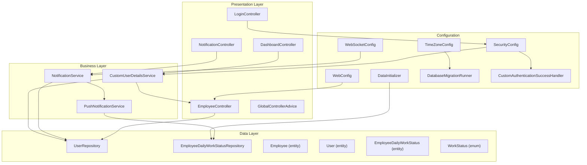
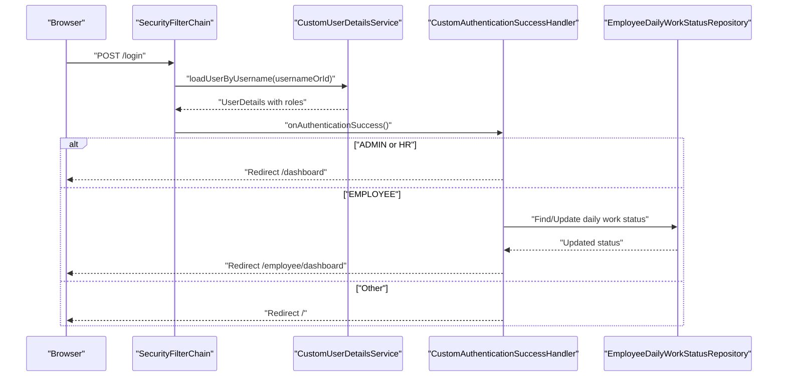
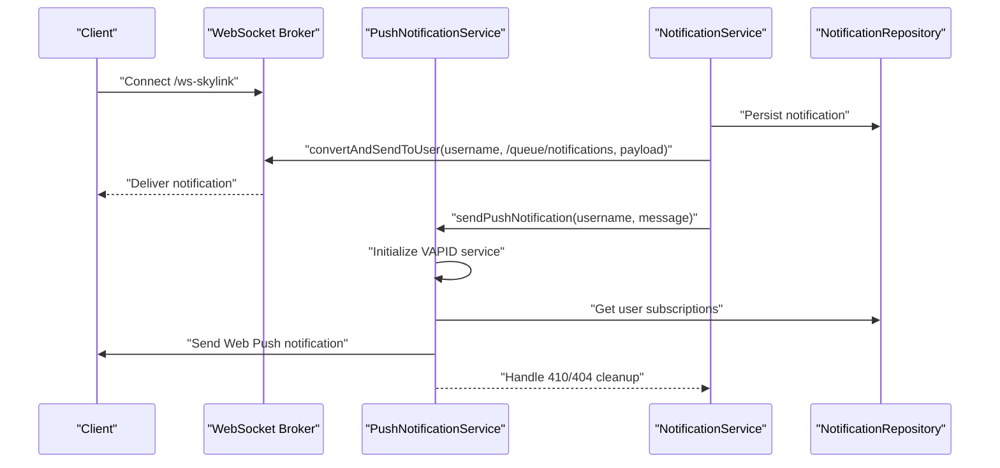
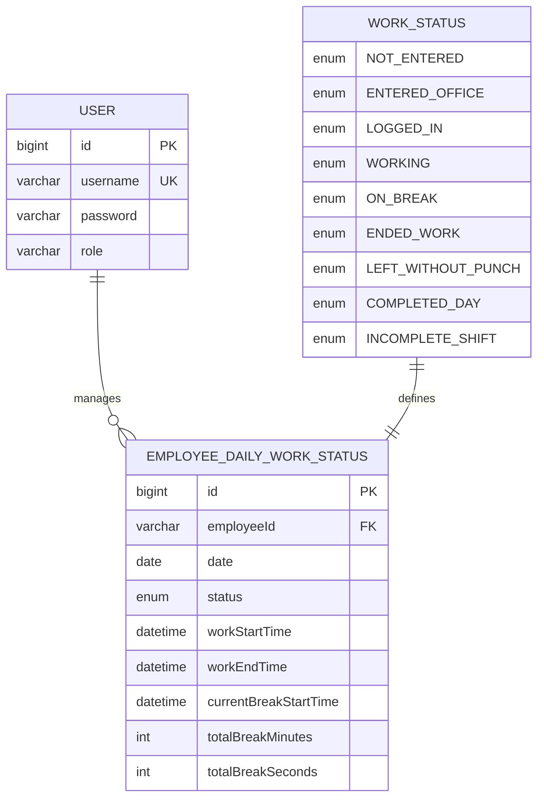
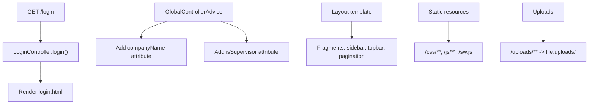
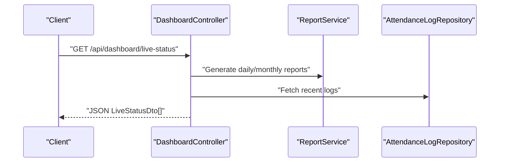

# Architecture and Design

<cite>
**Referenced Files in This Document**
- [AttendanceSystemApplication.java](file://src/main/java/root/cyb/mh/attendancesystem/AttendanceSystemApplication.java)
- [SecurityConfig.java](file://src/main/java/root/cyb/mh/attendancesystem/config/SecurityConfig.java)
- [CustomAuthenticationSuccessHandler.java](file://src/main/java/root/cyb/mh/attendancesystem/config/CustomAuthenticationSuccessHandler.java)
- [WebSocketConfig.java](file://src/main/java/root/cyb/mh/attendancesystem/config/WebSocketConfig.java)
- [WebConfig.java](file://src/main/java/root/cyb/mh/attendancesystem/config/WebConfig.java)
- [GlobalControllerAdvice.java](file://src/main/java/root/cyb/mh/attendancesystem/config/GlobalControllerAdvice.java)
- [DataInitializer.java](file://src/main/java/root/cyb/mh/attendancesystem/config/DataInitializer.java)
- [DatabaseMigrationRunner.java](file://src/main/java/root/cyb/mh/attendancesystem/config/DatabaseMigrationRunner.java)
- [TimeZoneConfig.java](file://src/main/java/root/cyb/mh/attendancesystem/config/TimeZoneConfig.java)
- [LoginController.java](file://src/main/java/root/cyb/mh/attendancesystem/controller/LoginController.java)
- [DashboardController.java](file://src/main/java/root/cyb/mh/attendancesystem/controller/DashboardController.java)
- [EmployeeController.java](file://src/main/java/root/cyb/mh/attendancesystem/controller/EmployeeController.java)
- [NotificationController.java](file://src/main/java/root/cyb/mh/attendancesystem/controller/NotificationController.java)
- [CustomUserDetailsService.java](file://src/main/java/root/cyb/mh/attendancesystem/service/CustomUserDetailsService.java)
- [NotificationService.java](file://src/main/java/root/cyb/mh/attendancesystem/service/NotificationService.java)
- [PushNotificationService.java](file://src/main/java/root/cyb/mh/attendancesystem/service/PushNotificationService.java)
- [UserRepository.java](file://src/main/java/root/cyb/mh/attendancesystem/repository/UserRepository.java)
- [EmployeeDailyWorkStatusRepository.java](file://src/main/java/root/cyb/mh/attendancesystem/repository/EmployeeDailyWorkStatusRepository.java)
- [User.java](file://src/main/java/root/cyb/mh/attendancesystem/model/User.java)
- [EmployeeDailyWorkStatus.java](file://src/main/java/root/cyb/mh/attendancesystem/model/EmployeeDailyWorkStatus.java)
- [WorkStatus.java](file://src/main/java/root/cyb/mh/attendancesystem/model/WorkStatus.java)
- [application.properties](file://src/main/resources/application.properties)
</cite>

## Update Summary
**Changes Made**
- Enhanced security architecture documentation with detailed role mappings and authorization patterns
- Expanded WebSocket real-time communication coverage including VAPID push notification integration
- Strengthened data access layer documentation with comprehensive repository patterns and database migration strategies
- Added detailed timezone management and global controller advice configurations
- Integrated advanced authentication flow with employee daily work status synchronization

## Table of Contents
1. [Introduction](#introduction)
2. [Project Structure](#project-structure)
3. [Core Components](#core-components)
4. [Architecture Overview](#architecture-overview)
5. [Detailed Component Analysis](#detailed-component-analysis)
6. [Enhanced Security Architecture](#enhanced-security-architecture)
7. [Real-Time Communication Systems](#real-time-communication-systems)
8. [Data Access Layer Enhancement](#data-access-layer-enhancement)
9. [Cross-Cutting Concerns](#cross-cutting-concerns)
10. [Performance Considerations](#performance-considerations)
11. [Troubleshooting Guide](#troubleshooting-guide)
12. [Conclusion](#conclusion)
13. [Appendices](#appendices)

## Introduction
This document describes the architecture and design of the Skylink Custom Backend system. It explains the layered architecture (presentation, business, data), Spring Boot MVC implementation, component interactions, and integration patterns. It also documents the enhanced security architecture with Spring Security, WebSocket real-time communication, Thymeleaf templating integration, and REST API design principles. Cross-cutting concerns such as authentication, authorization, notification systems, and timezone management are covered, along with technical decisions, architectural patterns, and scalability considerations.

## Project Structure
The backend follows a conventional Spring Boot MVC structure with clear separation of concerns and enhanced security configurations:
- Presentation layer: Controllers and Thymeleaf templates with global controller advice
- Business layer: Services implementing domain logic with transaction management
- Data layer: JPA repositories with comprehensive query patterns and database migration support
- Configuration: Enhanced security, WebSocket, WebMVC, timezone, and initialization configurations
- Models: JPA entities with work status enumeration and employee daily work status tracking



**Diagram sources**
- [LoginController.java:1-14](file://src/main/java/root/cyb/mh/attendancesystem/controller/LoginController.java#L1-L14)
- [DashboardController.java:1-331](file://src/main/java/root/cyb/mh/attendancesystem/controller/DashboardController.java#L1-L331)
- [EmployeeController.java:1-213](file://src/main/java/root/cyb/mh/attendancesystem/controller/EmployeeController.java#L1-L213)
- [NotificationController.java:1-49](file://src/main/java/root/cyb/mh/attendancesystem/controller/NotificationController.java#L1-L49)
- [GlobalControllerAdvice.java:1-38](file://src/main/java/root/cyb/mh/attendancesystem/config/GlobalControllerAdvice.java#L1-L38)
- [CustomUserDetailsService.java:1-54](file://src/main/java/root/cyb/mh/attendancesystem/service/CustomUserDetailsService.java#L1-L54)
- [NotificationService.java:1-78](file://src/main/java/root/cyb/mh/attendancesystem/service/NotificationService.java#L1-L78)
- [PushNotificationService.java:1-111](file://src/main/java/root/cyb/mh/attendancesystem/service/PushNotificationService.java#L1-L111)
- [UserRepository.java:1-12](file://src/main/java/root/cyb/mh/attendancesystem/repository/UserRepository.java#L1-L12)
- [EmployeeDailyWorkStatusRepository.java:1-21](file://src/main/java/root/cyb/mh/attendancesystem/repository/EmployeeDailyWorkStatusRepository.java#L1-L21)
- [User.java:1-24](file://src/main/java/root/cyb/mh/attendancesystem/model/User.java#L1-L24)
- [EmployeeDailyWorkStatus.java:1-45](file://src/main/java/root/cyb/mh/attendancesystem/model/EmployeeDailyWorkStatus.java#L1-L45)
- [WorkStatus.java:1-14](file://src/main/java/root/cyb/mh/attendancesystem/model/WorkStatus.java#L1-L14)
- [SecurityConfig.java:1-91](file://src/main/java/root/cyb/mh/attendancesystem/config/SecurityConfig.java#L1-L91)
- [WebSocketConfig.java:1-26](file://src/main/java/root/cyb/mh/attendancesystem/config/WebSocketConfig.java#L1-L26)
- [WebConfig.java:1-18](file://src/main/java/root/cyb/mh/attendancesystem/config/WebConfig.java#L1-L18)
- [TimeZoneConfig.java:1-27](file://src/main/java/root/cyb/mh/attendancesystem/config/TimeZoneConfig.java#L1-L27)
- [DataInitializer.java:1-122](file://src/main/java/root/cyb/mh/attendancesystem/config/DataInitializer.java#L1-L122)
- [DatabaseMigrationRunner.java:1-43](file://src/main/java/root/cyb/mh/attendancesystem/config/DatabaseMigrationRunner.java#L1-L43)
- [CustomAuthenticationSuccessHandler.java:1-66](file://src/main/java/root/cyb/mh/attendancesystem/config/CustomAuthenticationSuccessHandler.java#L1-L66)

**Section sources**
- [AttendanceSystemApplication.java:1-16](file://src/main/java/root/cyb/mh/attendancesystem/AttendanceSystemApplication.java#L1-L16)
- [application.properties:1-1](file://src/main/resources/application.properties#L1-L1)

## Core Components
- Application bootstrap: Declares Spring Boot application and enables scheduling.
- Enhanced security: Centralized security filter chain with comprehensive role-based authorization patterns, custom authentication success handler, and password encoding.
- Advanced authentication provider: Dual-mode user details service supporting administrative users and employees with automatic work status synchronization.
- Comprehensive real-time notifications: WebSocket broker with VAPID push notification integration, database persistence, and service worker support.
- Enhanced MVC controllers: Thymeleaf-backed controllers with global controller advice for shared model attributes and supervisor detection.
- Robust data access: JPA repositories with specialized query methods, database migration runner, and data initialization strategies.
- Timezone management: Global JVM timezone configuration with automatic propagation to all date/time operations.

**Section sources**
- [AttendanceSystemApplication.java:1-16](file://src/main/java/root/cyb/mh/attendancesystem/AttendanceSystemApplication.java#L1-L16)
- [SecurityConfig.java:1-91](file://src/main/java/root/cyb/mh/attendancesystem/config/SecurityConfig.java#L1-L91)
- [CustomUserDetailsService.java:1-54](file://src/main/java/root/cyb/mh/attendancesystem/service/CustomUserDetailsService.java#L1-L54)
- [NotificationService.java:1-78](file://src/main/java/root/cyb/mh/attendancesystem/service/NotificationService.java#L1-L78)
- [PushNotificationService.java:1-111](file://src/main/java/root/cyb/mh/attendancesystem/service/PushNotificationService.java#L1-L111)
- [DashboardController.java:1-331](file://src/main/java/root/cyb/mh/attendancesystem/controller/DashboardController.java#L1-L331)
- [EmployeeController.java:1-213](file://src/main/java/root/cyb/mh/attendancesystem/controller/EmployeeController.java#L1-L213)
- [NotificationController.java:1-49](file://src/main/java/root/cyb/mh/attendancesystem/controller/NotificationController.java#L1-L49)
- [GlobalControllerAdvice.java:1-38](file://src/main/java/root/cyb/mh/attendancesystem/config/GlobalControllerAdvice.java#L1-L38)
- [WebConfig.java:1-18](file://src/main/java/root/cyb/mh/attendancesystem/config/WebConfig.java#L1-L18)
- [TimeZoneConfig.java:1-27](file://src/main/java/root/cyb/mh/attendancesystem/config/TimeZoneConfig.java#L1-L27)
- [DataInitializer.java:1-122](file://src/main/java/root/cyb/mh/attendancesystem/config/DataInitializer.java#L1-L122)
- [DatabaseMigrationRunner.java:1-43](file://src/main/java/root/cyb/mh/attendancesystem/config/DatabaseMigrationRunner.java#L1-L43)

## Architecture Overview
The system employs an enhanced layered architecture with comprehensive security and real-time capabilities:
- Presentation: Spring MVC controllers with global advice rendering Thymeleaf views and exposing REST endpoints.
- Business: Services with transaction management encapsulating domain logic and coordinating repositories.
- Data: JPA repositories with specialized query patterns providing CRUD and complex query capabilities over entities.
- Integration: Enhanced WebSocket broker for real-time updates with VAPID push notifications; upload resource handler for static assets; database migration runner for schema evolution.
- Configuration: Comprehensive security filter chain, timezone management, data initialization, and custom authentication flows.

```mermaid
graph TB
Client["Browser"]
STOMP["STOMP over SockJS<br/>WebSocket Broker"]
VAPID["VAPID Push Notifications"]
SW["Service Worker<br/>(Web Push)"]
subgraph "Spring MVC"
CTRL["Controllers"]
GCA["GlobalControllerAdvice"]
TPL["Thymeleaf Templates"]
REST["REST Endpoints"]
end
subgraph "Services"
SVC["Business Services"]
TXN["Transaction Management"]
end
subgraph "Repositories"
REP["JPA Repositories"]
SPEC["Specification Patterns"]
END
subgraph "Persistence"
DB["Database"]
MIG["Migration Runner"]
INIT["Data Initializer"]
END
subgraph "Security & Config"
SEC["Security Filter Chain"]
TZ["Timezone Config"]
AUTH["Custom Auth Flow"]
END
Client --> CTRL
CTRL --> GCA
CTRL --> TPL
CTRL --> REST
REST --> SVC
CTRL --> SVC
SVC --> TXN
SVC --> REP
REP --> SPEC
REP --> DB
DB --> MIG
DB --> INIT
Client -.-> STOMP
Client -.-> VAPID
Client -.-> SW
SVC --> STOMP
SVC --> VAPID
SEC --> AUTH
AUTH --> SVC
TZ --> DB
```

**Diagram sources**
- [WebSocketConfig.java:1-26](file://src/main/java/root/cyb/mh/attendancesystem/config/WebSocketConfig.java#L1-L26)
- [NotificationService.java:1-78](file://src/main/java/root/cyb/mh/attendancesystem/service/NotificationService.java#L1-L78)
- [PushNotificationService.java:1-111](file://src/main/java/root/cyb/mh/attendancesystem/service/PushNotificationService.java#L1-L111)
- [DashboardController.java:227-270](file://src/main/java/root/cyb/mh/attendancesystem/controller/DashboardController.java#L227-L270)
- [WebConfig.java:1-18](file://src/main/java/root/cyb/mh/attendancesystem/config/WebConfig.java#L1-L18)
- [SecurityConfig.java:18-84](file://src/main/java/root/cyb/mh/attendancesystem/config/SecurityConfig.java#L18-L84)
- [TimeZoneConfig.java:17-25](file://src/main/java/root/cyb/mh/attendancesystem/config/TimeZoneConfig.java#L17-L25)
- [DataInitializer.java:18-122](file://src/main/java/root/cyb/mh/attendancesystem/config/DataInitializer.java#L18-L122)
- [DatabaseMigrationRunner.java:9-43](file://src/main/java/root/cyb/mh/attendancesystem/config/DatabaseMigrationRunner.java#L9-L43)

## Detailed Component Analysis

### Enhanced Security Architecture
The security architecture implements comprehensive role-based access control with sophisticated authorization patterns:
- Multi-tier authorization: Requests are authorized per endpoint patterns with granular role assignments (ADMIN, HR, EMPLOYEE).
- Form login integration: Uses custom success handler with automatic employee daily work status synchronization.
- Remember-me functionality: Configured with strong secret key and 7-day validity period.
- Logout management: Redirects to login with logout parameter for clean session termination.
- CSRF configuration: Disabled for existing form compatibility but designed to support CSRF tokens when forms are updated.
- Password encoding: BCryptPasswordEncoder ensures secure credential storage.



**Diagram sources**
- [SecurityConfig.java:18-84](file://src/main/java/root/cyb/mh/attendancesystem/config/SecurityConfig.java#L18-L84)
- [CustomUserDetailsService.java:24-52](file://src/main/java/root/cyb/mh/attendancesystem/service/CustomUserDetailsService.java#L24-L52)
- [CustomAuthenticationSuccessHandler.java:27-64](file://src/main/java/root/cyb/mh/attendancesystem/config/CustomAuthenticationSuccessHandler.java#L27-L64)
- [EmployeeDailyWorkStatusRepository.java:12-13](file://src/main/java/root/cyb/mh/attendancesystem/repository/EmployeeDailyWorkStatusRepository.java#L12-L13)

**Section sources**
- [SecurityConfig.java:1-91](file://src/main/java/root/cyb/mh/attendancesystem/config/SecurityConfig.java#L1-L91)
- [CustomUserDetailsService.java:1-54](file://src/main/java/root/cyb/mh/attendancesystem/service/CustomUserDetailsService.java#L1-L54)
- [CustomAuthenticationSuccessHandler.java:1-66](file://src/main/java/root/cyb/mh/attendancesystem/config/CustomAuthenticationSuccessHandler.java#L1-L66)

### Real-Time Communication Systems
The real-time communication system provides comprehensive notification delivery through multiple channels:
- WebSocket infrastructure: Simple broker for topics and queues with application destination prefix and user-specific destinations.
- STOMP endpoint: Exposed with SockJS fallback for reliable client connections.
- VAPID push notifications: Integration with Web Push protocol using VAPID keys for browser notifications.
- Multi-channel delivery: Notifications persisted to database, delivered via WebSocket, and attempted via service worker.
- Error handling: Robust error handling with subscription cleanup for invalid endpoints.



**Diagram sources**
- [WebSocketConfig.java:14-24](file://src/main/java/root/cyb/mh/attendancesystem/config/WebSocketConfig.java#L14-L24)
- [NotificationService.java:22-44](file://src/main/java/root/cyb/mh/attendancesystem/service/NotificationService.java#L22-L44)
- [PushNotificationService.java:35-111](file://src/main/java/root/cyb/mh/attendancesystem/service/PushNotificationService.java#L35-L111)

**Section sources**
- [WebSocketConfig.java:1-26](file://src/main/java/root/cyb/mh/attendancesystem/config/WebSocketConfig.java#L1-L26)
- [NotificationService.java:1-78](file://src/main/java/root/cyb/mh/attendancesystem/service/NotificationService.java#L1-L78)
- [PushNotificationService.java:1-111](file://src/main/java/root/cyb/mh/attendancesystem/service/PushNotificationService.java#L1-L111)

### Data Access Layer Enhancement
The data access layer implements comprehensive repository patterns with specialized query methods and robust data management:
- User repository: JPA repository with username and role-based query methods for authentication and authorization.
- Employee daily work status repository: Specialized repository with date-based and status-based query methods for work tracking.
- Database migration: Automated migration runner with debug capabilities and constraint validation.
- Data initialization: Comprehensive data initializer with testing mode and work status injection for development.
- Transaction management: Explicit transaction annotations for data consistency and atomic operations.



**Diagram sources**
- [User.java:1-24](file://src/main/java/root/cyb/mh/attendancesystem/model/User.java#L1-L24)
- [EmployeeDailyWorkStatus.java:1-45](file://src/main/java/root/cyb/mh/attendancesystem/model/EmployeeDailyWorkStatus.java#L1-L45)
- [WorkStatus.java:1-14](file://src/main/java/root/cyb/mh/attendancesystem/model/WorkStatus.java#L1-L14)
- [UserRepository.java:7-11](file://src/main/java/root/cyb/mh/attendancesystem/repository/UserRepository.java#L7-L11)
- [EmployeeDailyWorkStatusRepository.java:11-20](file://src/main/java/root/cyb/mh/attendancesystem/repository/EmployeeDailyWorkStatusRepository.java#L11-L20)

**Section sources**
- [User.java:1-24](file://src/main/java/root/cyb/mh/attendancesystem/model/User.java#L1-L24)
- [EmployeeDailyWorkStatus.java:1-45](file://src/main/java/root/cyb/mh/attendancesystem/model/EmployeeDailyWorkStatus.java#L1-L45)
- [WorkStatus.java:1-14](file://src/main/java/root/cyb/mh/attendancesystem/model/WorkStatus.java#L1-L14)
- [UserRepository.java:1-12](file://src/main/java/root/cyb/mh/attendancesystem/repository/UserRepository.java#L1-L12)
- [EmployeeDailyWorkStatusRepository.java:1-21](file://src/main/java/root/cyb/mh/attendancesystem/repository/EmployeeDailyWorkStatusRepository.java#L1-L21)
- [DataInitializer.java:18-122](file://src/main/java/root/cyb/mh/attendancesystem/config/DataInitializer.java#L18-L122)
- [DatabaseMigrationRunner.java:9-43](file://src/main/java/root/cyb/mh/attendancesystem/config/DatabaseMigrationRunner.java#L9-L43)

### Thymeleaf Templating Integration
- Login page: Controller exposes GET /login mapped to the login template.
- Global controller advice: Provides shared model attributes including company name and supervisor detection.
- Layout and fragments: Templates share common fragments (sidebar, topbar, pagination) with enhanced supervisor-aware functionality.
- Static resources: CSS, JS, and service worker served from static locations with upload directory exposure.
- Uploads: Local uploads directory exposed for file retrieval with proper resource handler configuration.



**Diagram sources**
- [LoginController.java:9-12](file://src/main/java/root/cyb/mh/attendancesystem/controller/LoginController.java#L9-L12)
- [GlobalControllerAdvice.java:18-36](file://src/main/java/root/cyb/mh/attendancesystem/config/GlobalControllerAdvice.java#L18-L36)
- [WebConfig.java:11-16](file://src/main/java/root/cyb/mh/attendancesystem/config/WebConfig.java#L11-L16)

**Section sources**
- [LoginController.java:1-14](file://src/main/java/root/cyb/mh/attendancesystem/controller/LoginController.java#L1-L14)
- [GlobalControllerAdvice.java:1-38](file://src/main/java/root/cyb/mh/attendancesystem/config/GlobalControllerAdvice.java#L1-L38)
- [WebConfig.java:1-18](file://src/main/java/root/cyb/mh/attendancesystem/config/WebConfig.java#L1-L18)

### REST API Design Principles
- REST endpoints are annotated with @RestController or @ResponseBody where applicable.
- Example: Live status endpoint returns a list of DTOs for real-time dashboards.
- Pagination and sorting are supported in controllers for list endpoints.
- Consistent use of ResponseEntity-returning methods is recommended for clarity.
- Enhanced error handling through global controller advice and exception management.



**Diagram sources**
- [DashboardController.java:227-270](file://src/main/java/root/cyb/mh/attendancesystem/controller/DashboardController.java#L227-L270)

**Section sources**
- [DashboardController.java:227-270](file://src/main/java/root/cyb/mh/attendancesystem/controller/DashboardController.java#L227-L270)

## Enhanced Security Architecture

### Role-Based Access Control Patterns
The security configuration implements granular authorization patterns:
- Static resources: CSS, JS, images, and webjars are publicly accessible
- Device communication: ADMS device endpoints are permitted for external device integration
- Administrative areas: Users and devices management restricted to ADMIN role
- HR functions: Settings, employee management, and shift management accessible to ADMIN and HR
- Employee area: Employee-specific endpoints restricted to EMPLOYEE role
- Master data: Comprehensive access control with ADMIN, HR, and EMPLOYEE roles
- Dashboard restrictions: Main dashboard accessible only to ADMIN and HR

**Section sources**
- [SecurityConfig.java:20-49](file://src/main/java/root/cyb/mh/attendancesystem/config/SecurityConfig.java#L20-L49)

### Authentication Success Flow
The custom authentication success handler implements sophisticated user redirection and work status synchronization:
- Role-based redirection: ADMIN/HR users redirected to dashboard, EMPLOYEE users to employee dashboard
- Automatic work status synchronization: Employee daily work status updated based on office entry and ADMS punch detection
- Status upgrade logic: Handles ENTERED_OFFICE to LOGGED_IN conversion and missed punch healing scenarios
- Date-based status checking: Utilizes current date for status validation and punch detection

**Section sources**
- [CustomAuthenticationSuccessHandler.java:27-64](file://src/main/java/root/cyb/mh/attendancesystem/config/CustomAuthenticationSuccessHandler.java#L27-L64)

### Password Encoding and Security
- BCryptPasswordEncoder: Ensures secure password hashing with salt generation
- Strong remember-me key: Uses "skylinkSuperSecretKey2026" with 7-day validity
- CSRF configuration: Disabled for existing form compatibility but designed for future CSRF token implementation
- Custom authentication provider: Supports dual-mode authentication for users and employees

**Section sources**
- [SecurityConfig.java:86-89](file://src/main/java/root/cyb/mh/attendancesystem/config/SecurityConfig.java#L86-L89)
- [SecurityConfig.java:54-60](file://src/main/java/root/cyb/mh/attendancesystem/config/SecurityConfig.java#L54-L60)

## Real-Time Communication Systems

### WebSocket Infrastructure
The WebSocket configuration provides comprehensive real-time communication capabilities:
- Message broker: Simple broker configured for topics (/topic) and queues (/queue)
- Application destinations: Prefix (/app) for application-specific endpoints
- User destinations: Prefix (/user) for user-specific messaging
- STOMP endpoint: /ws-skylink with SockJS fallback for broad browser compatibility
- Connection management: Automatic connection handling and message routing

**Section sources**
- [WebSocketConfig.java:14-24](file://src/main/java/root/cyb/mh/attendancesystem/config/WebSocketConfig.java#L14-L24)

### VAPID Push Notification Integration
The push notification service implements modern web push technology:
- VAPID key management: Configurable public/private keys and subject for push authentication
- Subscription management: Handles multiple device subscriptions per user with endpoint uniqueness
- Error handling: Robust error handling with automatic subscription cleanup for invalid endpoints (410/404)
- Payload formatting: Automatic JSON payload wrapping for simple text messages
- Transactional operations: Ensures data consistency during subscription and notification operations

**Section sources**
- [PushNotificationService.java:18-46](file://src/main/java/root/cyb/mh/attendancesystem/service/PushNotificationService.java#L18-L46)
- [PushNotificationService.java:78-111](file://src/main/java/root/cyb/mh/attendancesystem/service/PushNotificationService.java#L78-L111)

### Multi-Channel Notification Delivery
The notification system provides comprehensive delivery through multiple channels:
- Database persistence: Notifications stored with recipient, title, message, type, and read status
- WebSocket delivery: Real-time delivery to user-specific queues for immediate client updates
- Web push delivery: Service worker-based notifications with automatic retry and cleanup
- Error isolation: Failures in one channel don't affect delivery through other channels
- Transactional consistency: Atomic operations ensure data integrity across delivery channels

**Section sources**
- [NotificationService.java:22-44](file://src/main/java/root/cyb/mh/attendancesystem/service/NotificationService.java#L22-L44)
- [NotificationService.java:56-77](file://src/main/java/root/cyb/mh/attendancesystem/service/NotificationService.java#L56-L77)

## Data Access Layer Enhancement

### Repository Pattern Implementation
The data access layer implements comprehensive repository patterns:
- User repository: Standard JPA repository with username and role-based query methods
- Employee daily work status repository: Specialized repository with date and status-based query methods
- Query optimization: Custom query methods for efficient data retrieval and filtering
- Entity relationships: Proper JPA annotations for entity relationships and cascading operations
- Type safety: Enum-based status management with compile-time validation

**Section sources**
- [UserRepository.java:7-11](file://src/main/java/root/cyb/mh/attendancesystem/repository/UserRepository.java#L7-L11)
- [EmployeeDailyWorkStatusRepository.java:12-20](file://src/main/java/root/cyb/mh/attendancesystem/repository/EmployeeDailyWorkStatusRepository.java#L12-L20)

### Database Migration and Initialization
The system includes comprehensive database management capabilities:
- Schema migration: Automated migration runner with debug output and constraint validation
- Data initialization: Comprehensive data initializer with testing mode and work status injection
- Constraint management: Dynamic constraint creation and validation for work status enum values
- Testing support: Dummy data injection for all work status types during testing
- Production safety: Preserves existing work status data during production runs

**Section sources**
- [DatabaseMigrationRunner.java:14-41](file://src/main/java/root/cyb/mh/attendancesystem/config/DatabaseMigrationRunner.java#L14-L41)
- [DataInitializer.java:18-122](file://src/main/java/root/cyb/mh/attendancesystem/config/DataInitializer.java#L18-L122)

### Transaction Management
The system implements robust transaction management:
- Explicit transactions: @Transactional annotations ensure data consistency
- Batch operations: Efficient batch processing for bulk data operations
- Error handling: Transaction rollback on exceptions with proper cleanup
- Isolation levels: Appropriate isolation levels for concurrent access scenarios
- Performance optimization: Minimized transaction scope for optimal performance

**Section sources**
- [NotificationService.java:56-72](file://src/main/java/root/cyb/mh/attendancesystem/service/NotificationService.java#L56-L72)
- [PushNotificationService.java:52-76](file://src/main/java/root/cyb/mh/attendancesystem/service/PushNotificationService.java#L52-L76)

## Cross-Cutting Concerns

### Global Controller Advice
The global controller advice provides comprehensive cross-cutting functionality:
- Company branding: Adds company name to all model attributes for consistent branding
- Supervisor detection: Automatically detects supervisor status for menu and feature availability
- Authentication context: Provides authentication information to all controllers
- Security context: Integrates with Spring Security for role-based feature access
- Model attribute sharing: Centralized attribute management across all controllers

**Section sources**
- [GlobalControllerAdvice.java:12-37](file://src/main/java/root/cyb/mh/attendancesystem/config/GlobalControllerAdvice.java#L12-L37)

### Timezone Management
The system implements comprehensive timezone management:
- Global timezone configuration: JVM default timezone set to America/New_York (ET)
- Automatic propagation: Timezone affects all date/time operations, Hibernate operations, and scheduled tasks
- Consistent time handling: Eliminates timezone-related inconsistencies across the application
- Configuration flexibility: Environment variable configurable timezone setting
- Development and production consistency: Ensures consistent behavior across environments

**Section sources**
- [TimeZoneConfig.java:17-25](file://src/main/java/root/cyb/mh/attendancesystem/config/TimeZoneConfig.java#L17-L25)

### Static Resource Management
The static resource configuration provides comprehensive asset management:
- Upload directory exposure: Local uploads directory accessible via /uploads/**
- Asset serving: CSS, JavaScript, and service worker files served from static locations
- File system integration: Direct file system access for uploaded content
- Security considerations: Controlled access to upload directory with proper file type validation
- Performance optimization: Efficient static resource serving with proper caching headers

**Section sources**
- [WebConfig.java:11-16](file://src/main/java/root/cyb/mh/attendancesystem/config/WebConfig.java#L11-L16)

## Performance Considerations
- Dashboard computations: Aggregations over potentially large datasets; consider pagination and caching for frequently accessed metrics.
- Live status endpoint: Streams employee records and merges with report data; ensure efficient joins and indexing.
- WebSocket publishing: Keep payloads minimal; batch updates if necessary.
- Uploads: Expose only necessary directories; enforce file type and size limits at the controller level.
- Security: CSRF disabled for compatibility; evaluate enabling CSRF with proper form tokens for production hardening.
- Database queries: Optimize repository queries with appropriate indexes on frequently queried columns.
- Cache strategy: Implement caching for frequently accessed user data and work status information.
- Push notification scaling: Consider rate limiting for push notifications to prevent service overload.

## Troubleshooting Guide
- Authentication redirects: Verify role-based patterns and custom success handler logic for correct redirection.
- WebSocket connectivity: Confirm endpoint registration and user destination prefixes; check client-side subscription paths.
- Notification delivery: Inspect user-specific queue destinations and ensure recipients are properly identified.
- Static resources: Validate resource handlers and file system permissions for uploads directory.
- VAPID configuration: Verify VAPID public/private keys and subject configuration for push notifications.
- Database migrations: Check migration runner output for constraint validation and schema updates.
- Timezone issues: Verify JVM timezone configuration and ensure consistent time handling across components.
- Data initialization: Monitor data initializer output for proper setup of default users and test data.

**Section sources**
- [CustomAuthenticationSuccessHandler.java:27-64](file://src/main/java/root/cyb/mh/attendancesystem/config/CustomAuthenticationSuccessHandler.java#L27-L64)
- [WebSocketConfig.java:14-24](file://src/main/java/root/cyb/mh/attendancesystem/config/WebSocketConfig.java#L14-L24)
- [NotificationService.java:33-44](file://src/main/java/root/cyb/mh/attendancesystem/service/NotificationService.java#L33-L44)
- [WebConfig.java:11-16](file://src/main/java/root/cyb/mh/attendancesystem/config/WebConfig.java#L11-L16)
- [PushNotificationService.java:35-46](file://src/main/java/root/cyb/mh/attendancesystem/service/PushNotificationService.java#L35-L46)
- [DatabaseMigrationRunner.java:16-41](file://src/main/java/root/cyb/mh/attendancesystem/config/DatabaseMigrationRunner.java#L16-L41)
- [TimeZoneConfig.java:20-25](file://src/main/java/root/cyb/mh/attendancesystem/config/TimeZoneConfig.java#L20-L25)
- [DataInitializer.java:22-122](file://src/main/java/root/cyb/mh/attendancesystem/config/DataInitializer.java#L22-L122)

## Conclusion
The Skylink Custom Backend leverages an enhanced layered architecture with Spring MVC, JPA, and comprehensive Spring Security. It integrates Thymeleaf for server-rendered pages with global controller advice, WebSocket for real-time notifications with VAPID push integration, and robust data access patterns with database migration support. The enhanced security architecture provides granular role-based access control with automatic work status synchronization, while cross-cutting concerns are addressed through dedicated services, configuration classes, and global advice mechanisms. Scalability improvements include caching strategies, optimized database queries, and transaction management for data consistency.

## Appendices
- Profiles: Active profile is set to prod; ensure environment-specific properties are configured accordingly.
- Testing mode: App testing flag enables comprehensive test data injection and work status simulation.
- VAPID configuration: Requires proper VAPID public/private key pair and subject configuration for push notifications.
- Database constraints: Work status enum values are validated through database constraints for data integrity.

**Section sources**
- [application.properties:1-1](file://src/main/resources/application.properties#L1-L1)
- [DataInitializer.java:15-16](file://src/main/java/root/cyb/mh/attendancesystem/config/DataInitializer.java#L15-L16)
- [PushNotificationService.java:18-25](file://src/main/java/root/cyb/mh/attendancesystem/service/PushNotificationService.java#L18-L25)
- [DatabaseMigrationRunner.java:33-37](file://src/main/java/root/cyb/mh/attendancesystem/config/DatabaseMigrationRunner.java#L33-L37)