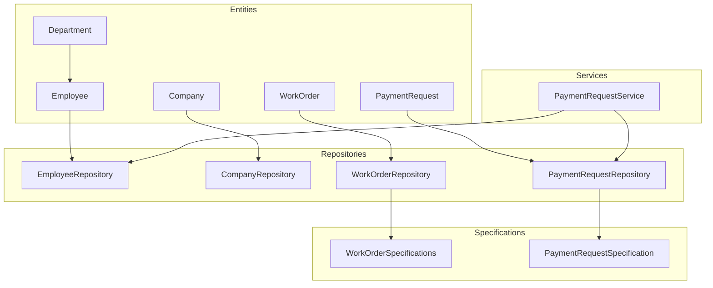
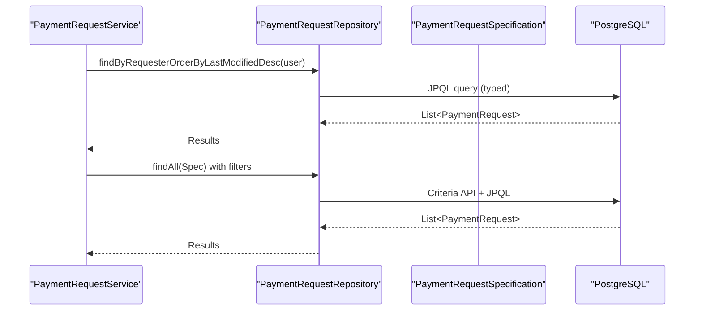
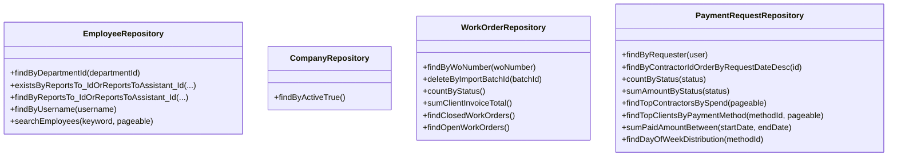
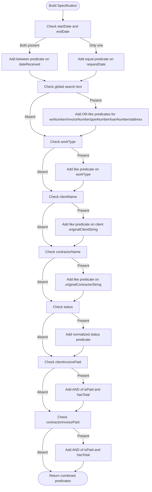
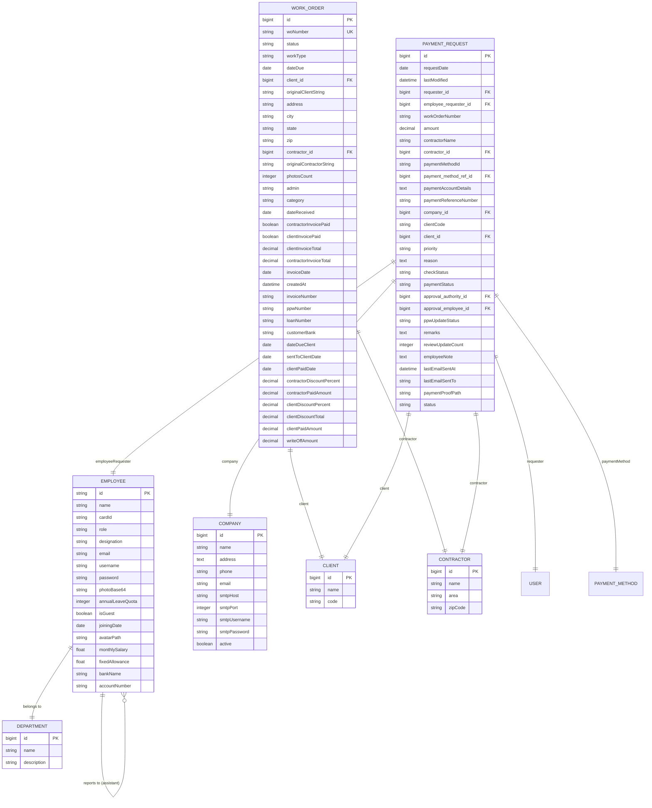
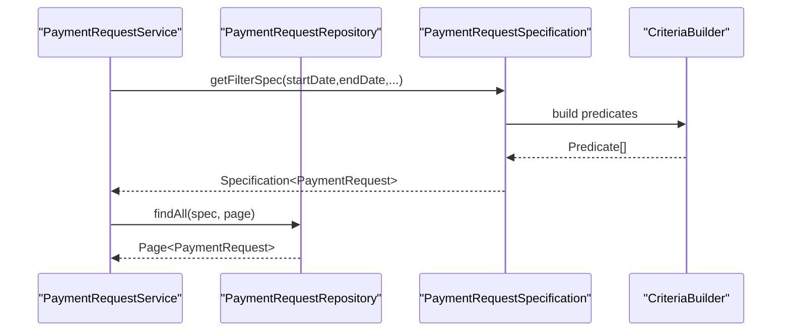
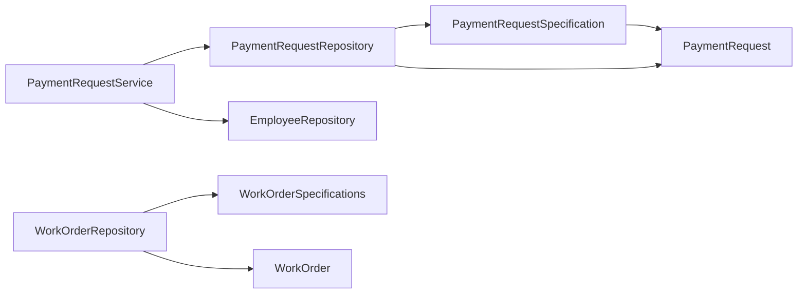

# Data Access Layer

<cite>
**Referenced Files in This Document**
- [EmployeeRepository.java](file://src/main/java/root/cyb/mh/attendancesystem/repository/EmployeeRepository.java)
- [CompanyRepository.java](file://src/main/java/root/cyb/mh/attendancesystem/repository/CompanyRepository.java)
- [WorkOrderRepository.java](file://src/main/java/root/cyb/mh/attendancesystem/repository/WorkOrderRepository.java)
- [PaymentRequestRepository.java](file://src/main/java/root/cyb/mh/attendancesystem/repository/PaymentRequestRepository.java)
- [Employee.java](file://src/main/java/root/cyb/mh/attendancesystem/model/Employee.java)
- [Company.java](file://src/main/java/root/cyb/mh/attendancesystem/model/Company.java)
- [Department.java](file://src/main/java/root/cyb/mh/attendancesystem/model/Department.java)
- [WorkOrder.java](file://src/main/java/root/cyb/mh/attendancesystem/model/WorkOrder.java)
- [PaymentRequest.java](file://src/main/java/root/cyb/mh/attendancesystem/model/PaymentRequest.java)
- [WorkOrderSpecifications.java](file://src/main/java/root/cyb/mh/attendancesystem/specification/WorkOrderSpecifications.java)
- [PaymentRequestSpecification.java](file://src/main/java/root/cyb/mh/attendancesystem/specification/PaymentRequestSpecification.java)
- [PaymentRequestService.java](file://src/main/java/root/cyb/mh/attendancesystem/service/PaymentRequestService.java)
- [application.properties](file://src/main/resources/application.properties)
</cite>

## Table of Contents
1. [Introduction](#introduction)
2. [Project Structure](#project-structure)
3. [Core Components](#core-components)
4. [Architecture Overview](#architecture-overview)
5. [Detailed Component Analysis](#detailed-component-analysis)
6. [Dependency Analysis](#dependency-analysis)
7. [Performance Considerations](#performance-considerations)
8. [Troubleshooting Guide](#troubleshooting-guide)
9. [Conclusion](#conclusion)

## Introduction
This document explains the data access layer built with Spring Data JPA. It covers the repository pattern, custom query specifications, entity relationship mappings, JPA annotations usage, database schema design, and performance optimization strategies. It also documents criteria API specifications for complex queries, batch operations, transaction management, caching strategies, integration with PostgreSQL, and entity lifecycle management.

## Project Structure
The data access layer follows a layered architecture:
- Entities define domain models and JPA mappings.
- Repositories expose typed CRUD and custom query methods using Spring Data JPA.
- Specifications encapsulate reusable, composable query predicates.
- Services orchestrate repositories and coordinate cross-entity operations.

**Diagram sources**
- [EmployeeRepository.java:11-31](file://src/main/java/root/cyb/mh/attendancesystem/repository/EmployeeRepository.java#L11-L31)
- [CompanyRepository.java:7-9](file://src/main/java/root/cyb/mh/attendancesystem/repository/CompanyRepository.java#L7-L9)
- [WorkOrderRepository.java:15-79](file://src/main/java/root/cyb/mh/attendancesystem/repository/WorkOrderRepository.java#L15-L79)
- [PaymentRequestRepository.java:10-741](file://src/main/java/root/cyb/mh/attendancesystem/repository/PaymentRequestRepository.java#L10-L741)
- [WorkOrderSpecifications.java:12-131](file://src/main/java/root/cyb/mh/attendancesystem/specification/WorkOrderSpecifications.java#L12-L131)
- [PaymentRequestSpecification.java:14-91](file://src/main/java/root/cyb/mh/attendancesystem/specification/PaymentRequestSpecification.java#L14-L91)
- [PaymentRequestService.java:14-268](file://src/main/java/root/cyb/mh/attendancesystem/service/PaymentRequestService.java#L14-L268)

**Section sources**
- [EmployeeRepository.java:11-31](file://src/main/java/root/cyb/mh/attendancesystem/repository/EmployeeRepository.java#L11-L31)
- [CompanyRepository.java:7-9](file://src/main/java/root/cyb/mh/attendancesystem/repository/CompanyRepository.java#L7-L9)
- [WorkOrderRepository.java:15-79](file://src/main/java/root/cyb/mh/attendancesystem/repository/WorkOrderRepository.java#L15-L79)
- [PaymentRequestRepository.java:10-741](file://src/main/java/root/cyb/mh/attendancesystem/repository/PaymentRequestRepository.java#L10-L741)
- [WorkOrderSpecifications.java:12-131](file://src/main/java/root/cyb/mh/attendancesystem/specification/WorkOrderSpecifications.java#L12-L131)
- [PaymentRequestSpecification.java:14-91](file://src/main/java/root/cyb/mh/attendancesystem/specification/PaymentRequestSpecification.java#L14-L91)
- [PaymentRequestService.java:14-268](file://src/main/java/root/cyb/mh/attendancesystem/service/PaymentRequestService.java#L14-L268)

## Core Components
- Repositories: Typed interfaces extending JpaRepository and JpaSpecificationExecutor enable CRUD, pagination, sorting, and dynamic queries via Specifications.
- Specifications: Encapsulate reusable predicates for complex filters and joins.
- Entities: Annotated with JPA annotations to define tables, columns, relationships, defaults, and lifecycle callbacks.
- Services: Coordinate repository usage, manage cross-entity operations, and trigger notifications.

Key responsibilities:
- EmployeeRepository: search, existence checks, hierarchical reporting queries.
- WorkOrderRepository: aggregates, counts, and status-based filtering; integrates with Specifications.
- PaymentRequestRepository: extensive custom JPQL/Native queries for analytics and dashboards; supports Specifications.
- Specifications: WorkOrderSpecifications and PaymentRequestSpecification provide composable filters.

**Section sources**
- [EmployeeRepository.java:11-31](file://src/main/java/root/cyb/mh/attendancesystem/repository/EmployeeRepository.java#L11-L31)
- [WorkOrderRepository.java:15-79](file://src/main/java/root/cyb/mh/attendancesystem/repository/WorkOrderRepository.java#L15-L79)
- [PaymentRequestRepository.java:10-741](file://src/main/java/root/cyb/mh/attendancesystem/repository/PaymentRequestRepository.java#L10-L741)
- [WorkOrderSpecifications.java:12-131](file://src/main/java/root/cyb/mh/attendancesystem/specification/WorkOrderSpecifications.java#L12-L131)
- [PaymentRequestSpecification.java:14-91](file://src/main/java/root/cyb/mh/attendancesystem/specification/PaymentRequestSpecification.java#L14-L91)

## Architecture Overview
The data access layer leverages Spring Data JPA to abstract persistence concerns. Repositories expose typed methods and Specifications for dynamic filtering. Services integrate repositories and orchestrate cross-entity workflows.

**Diagram sources**
- [PaymentRequestService.java:62-72](file://src/main/java/root/cyb/mh/attendancesystem/service/PaymentRequestService.java#L62-L72)
- [PaymentRequestRepository.java:11-31](file://src/main/java/root/cyb/mh/attendancesystem/repository/PaymentRequestRepository.java#L11-L31)
- [PaymentRequestSpecification.java:16-91](file://src/main/java/root/cyb/mh/attendancesystem/specification/PaymentRequestSpecification.java#L16-L91)

## Detailed Component Analysis

### Repository Pattern Implementation
- EmployeeRepository: Provides typed methods for department-based lookup, existence checks for supervisors, hierarchical subordinates retrieval, username lookup, and paginated search across multiple fields.
- CompanyRepository: Filters active companies.
- WorkOrderRepository: Extends JpaSpecificationExecutor to support dynamic filtering and includes numerous JPQL aggregation and status-based queries.
- PaymentRequestRepository: Extensive custom queries for analytics, dashboards, and multi-dimensional aggregations; integrates with PaymentRequestSpecification.

**Diagram sources**
- [EmployeeRepository.java:11-31](file://src/main/java/root/cyb/mh/attendancesystem/repository/EmployeeRepository.java#L11-L31)
- [CompanyRepository.java:7-9](file://src/main/java/root/cyb/mh/attendancesystem/repository/CompanyRepository.java#L7-L9)
- [WorkOrderRepository.java:15-79](file://src/main/java/root/cyb/mh/attendancesystem/repository/WorkOrderRepository.java#L15-L79)
- [PaymentRequestRepository.java:10-741](file://src/main/java/root/cyb/mh/attendancesystem/repository/PaymentRequestRepository.java#L10-L741)

**Section sources**
- [EmployeeRepository.java:11-31](file://src/main/java/root/cyb/mh/attendancesystem/repository/EmployeeRepository.java#L11-L31)
- [CompanyRepository.java:7-9](file://src/main/java/root/cyb/mh/attendancesystem/repository/CompanyRepository.java#L7-L9)
- [WorkOrderRepository.java:15-79](file://src/main/java/root/cyb/mh/attendancesystem/repository/WorkOrderRepository.java#L15-L79)
- [PaymentRequestRepository.java:10-741](file://src/main/java/root/cyb/mh/attendancesystem/repository/PaymentRequestRepository.java#L10-L741)

### Custom Query Specifications
- WorkOrderSpecifications: Builds predicates for date range, global text search across multiple fields, work type filter, client/contractor name filters, status normalization (open/closed/cancelled/all), and invoice-paid flags with totals.
- PaymentRequestSpecification: Composes predicates for date range, contractor/client/payment method filters, work order number, priority/status/payment status/ppw update status, and requester name matching via joins to User and Employee.

**Diagram sources**
- [WorkOrderSpecifications.java:22-130](file://src/main/java/root/cyb/mh/attendancesystem/specification/WorkOrderSpecifications.java#L22-L130)

**Section sources**
- [WorkOrderSpecifications.java:12-131](file://src/main/java/root/cyb/mh/attendancesystem/specification/WorkOrderSpecifications.java#L12-L131)
- [PaymentRequestSpecification.java:14-91](file://src/main/java/root/cyb/mh/attendancesystem/specification/PaymentRequestSpecification.java#L14-L91)

### Entity Relationship Mappings and JPA Annotations
- Entities define tables, primary keys, columns, and relationships:
  - Employee: @Entity, @Data, @NoArgsConstructor, @AllArgsConstructor; @Id on String id; @ManyToOne to Department, reportsTo, reportsToAssistant; @Column for large text and booleans.
  - Company: @Entity, @Table("companies"); @Id with @GeneratedValue; @Column for TEXT fields; boolean active.
  - Department: @Entity; @Id with @GeneratedValue; simple name/description.
  - WorkOrder: @Entity, @Table("work_orders"); @Id with @GeneratedValue; @ManyToOne to Client and Contractor; @Column for unique woNumber; @PrePersist for createdAt; various financial and invoice-related fields.
  - PaymentRequest: @Entity, @Table("payment_requests"); @Id with @GeneratedValue; @ManyToOne to User, Employee, Contractor, Client, PaymentMethod, Company; @Enumerated for enums; @PrePersist/@PreUpdate timestamps; @Column for TEXT and nullable fields.

**Diagram sources**
- [Employee.java:9-63](file://src/main/java/root/cyb/mh/attendancesystem/model/Employee.java#L9-L63)
- [Company.java:6-30](file://src/main/java/root/cyb/mh/attendancesystem/model/Company.java#L6-L30)
- [Department.java:11-21](file://src/main/java/root/cyb/mh/attendancesystem/model/Department.java#L11-L21)
- [WorkOrder.java:8-108](file://src/main/java/root/cyb/mh/attendancesystem/model/WorkOrder.java#L8-L108)
- [PaymentRequest.java:13-116](file://src/main/java/root/cyb/mh/attendancesystem/model/PaymentRequest.java#L13-L116)

**Section sources**
- [Employee.java:9-63](file://src/main/java/root/cyb/mh/attendancesystem/model/Employee.java#L9-L63)
- [Company.java:6-30](file://src/main/java/root/cyb/mh/attendancesystem/model/Company.java#L6-L30)
- [Department.java:11-21](file://src/main/java/root/cyb/mh/attendancesystem/model/Department.java#L11-L21)
- [WorkOrder.java:8-108](file://src/main/java/root/cyb/mh/attendancesystem/model/WorkOrder.java#L8-L108)
- [PaymentRequest.java:13-116](file://src/main/java/root/cyb/mh/attendancesystem/model/PaymentRequest.java#L13-L116)

### Database Schema Design
- WorkOrder and PaymentRequest tables include numerous financial and administrative fields, with createdAt timestamps and enums mapped as STRING.
- Index-friendly patterns:
  - Unique constraints on woNumber.
  - Foreign keys on client_id, contractor_id, requester_id, employee_requester_id, payment_method_ref_id, company_id, and client_id.
- Lifecycle fields:
  - WorkOrder: @PrePersist sets createdAt.
  - PaymentRequest: @PrePersist/@PreUpdate update lastModified.

**Section sources**
- [WorkOrder.java:13-90](file://src/main/java/root/cyb/mh/attendancesystem/model/WorkOrder.java#L13-L90)
- [PaymentRequest.java:25-31](file://src/main/java/root/cyb/mh/attendancesystem/model/PaymentRequest.java#L25-L31)

### Criteria API Specifications for Complex Queries
- WorkOrderSpecifications: Demonstrates dynamic predicates combining date ranges, text search, work type, client/contractor filters, status normalization, and invoice-paid conditions.
- PaymentRequestSpecification: Uses joins to User and Employee for requester matching and applies filters for dates, contractor, client, payment method, work order number, priorities, statuses, and PPW status.

**Diagram sources**
- [PaymentRequestSpecification.java:16-91](file://src/main/java/root/cyb/mh/attendancesystem/specification/PaymentRequestSpecification.java#L16-L91)
- [PaymentRequestRepository.java:11-12](file://src/main/java/root/cyb/mh/attendancesystem/repository/PaymentRequestRepository.java#L11-L12)

**Section sources**
- [WorkOrderSpecifications.java:12-131](file://src/main/java/root/cyb/mh/attendancesystem/specification/WorkOrderSpecifications.java#L12-L131)
- [PaymentRequestSpecification.java:14-91](file://src/main/java/root/cyb/mh/attendancesystem/specification/PaymentRequestSpecification.java#L14-L91)

### Batch Operations and Transaction Management
- Repository-level batch deletion:
  - WorkOrderRepository.deleteByImportBatchId and deleteByImportBatchIdIsNull support cleanup by import batch.
- Service-level transaction boundaries:
  - PaymentRequestService.saveRequest persists a PaymentRequest within a transaction managed by Spring Data JPA.
- Native queries for analytics:
  - PaymentRequestRepository uses native SQL for day-of-week distributions and client/portfolio analytics.

Recommendations:
- Use @Transactional on service methods orchestrating multiple repository calls.
- Prefer bulk operations via @Modifying queries for large-scale updates/deletes.
- Use paging/sorting to avoid loading massive datasets.

**Section sources**
- [WorkOrderRepository.java:19-21](file://src/main/java/root/cyb/mh/attendancesystem/repository/WorkOrderRepository.java#L19-L21)
- [PaymentRequestService.java:44-60](file://src/main/java/root/cyb/mh/attendancesystem/service/PaymentRequestService.java#L44-L60)
- [PaymentRequestRepository.java:417-419](file://src/main/java/root/cyb/mh/attendancesystem/repository/PaymentRequestRepository.java#L417-L419)

### Caching Strategies
- Application profile indicates production mode; enable Spring Cache or a distributed cache (e.g., Redis) for read-heavy analytics endpoints.
- Cacheable repositories/services:
  - PaymentRequestRepository’s aggregation methods can benefit from caching results per date range or company.
  - WorkOrderRepository’s status and margin aggregations can be cached with invalidation on data changes.

Implementation tips:
- Use @Cacheable on service methods wrapping repository calls.
- Invalidate caches on @Modifying updates.

[No sources needed since this section provides general guidance]

### Integration with PostgreSQL
- Native queries in PaymentRequestRepository target PostgreSQL-specific functions (e.g., extract, to_char).
- Ensure JDBC driver and connection pool settings align with production profile.

**Section sources**
- [PaymentRequestRepository.java:180-184](file://src/main/java/root/cyb/mh/attendancesystem/repository/PaymentRequestRepository.java#L180-L184)
- [PaymentRequestRepository.java:417-419](file://src/main/java/root/cyb/mh/attendancesystem/repository/PaymentRequestRepository.java#L417-L419)
- [application.properties:1-1](file://src/main/resources/application.properties#L1-L1)

### Entity Lifecycle Management and Data Consistency
- WorkOrder: @PrePersist sets createdAt for audit trail.
- PaymentRequest: @PrePersist/@PreUpdate maintain lastModified timestamps for change tracking.
- Enumerations stored as STRING to ensure readability and migration safety.
- Constraints:
  - Unique woNumber on WorkOrder.
  - Nullable/optional fields for optional relationships and optional totals.

**Section sources**
- [WorkOrder.java:87-90](file://src/main/java/root/cyb/mh/attendancesystem/model/WorkOrder.java#L87-L90)
- [PaymentRequest.java:27-31](file://src/main/java/root/cyb/mh/attendancesystem/model/PaymentRequest.java#L27-L31)

## Dependency Analysis
Repositories depend on JPA annotations and Spring Data JPA infrastructure. Specifications encapsulate query logic, while services coordinate repository usage and cross-entity operations.

**Diagram sources**
- [PaymentRequestSpecification.java:14-91](file://src/main/java/root/cyb/mh/attendancesystem/specification/PaymentRequestSpecification.java#L14-L91)
- [PaymentRequestRepository.java:10-741](file://src/main/java/root/cyb/mh/attendancesystem/repository/PaymentRequestRepository.java#L10-L741)
- [PaymentRequestService.java:14-268](file://src/main/java/root/cyb/mh/attendancesystem/service/PaymentRequestService.java#L14-L268)
- [WorkOrderSpecifications.java:12-131](file://src/main/java/root/cyb/mh/attendancesystem/specification/WorkOrderSpecifications.java#L12-L131)
- [WorkOrderRepository.java:15-79](file://src/main/java/root/cyb/mh/attendancesystem/repository/WorkOrderRepository.java#L15-L79)

**Section sources**
- [PaymentRequestSpecification.java:14-91](file://src/main/java/root/cyb/mh/attendancesystem/specification/PaymentRequestSpecification.java#L14-L91)
- [PaymentRequestRepository.java:10-741](file://src/main/java/root/cyb/mh/attendancesystem/repository/PaymentRequestRepository.java#L10-L741)
- [PaymentRequestService.java:14-268](file://src/main/java/root/cyb/mh/attendancesystem/service/PaymentRequestService.java#L14-L268)
- [WorkOrderSpecifications.java:12-131](file://src/main/java/root/cyb/mh/attendancesystem/specification/WorkOrderSpecifications.java#L12-L131)
- [WorkOrderRepository.java:15-79](file://src/main/java/root/cyb/mh/attendancesystem/repository/WorkOrderRepository.java#L15-L79)

## Performance Considerations
- Use Specifications with JpaSpecificationExecutor for dynamic filtering without hardcoding queries.
- Prefer projection queries or DTOs for analytics to reduce object graph overhead.
- Apply pagination and sorting to limit result sets.
- Use native queries judiciously for PostgreSQL-specific optimizations.
- Add database indexes on frequently filtered columns (e.g., requestDate, status, client_id, contractor_id).
- Enable second-level caching for read-heavy domain entities.

[No sources needed since this section provides general guidance]

## Troubleshooting Guide
- Pagination and sorting:
  - Ensure Pageable is passed to repository methods supporting pagination.
- Specifications:
  - Verify predicate composition order and null checks for optional fields.
- Native queries:
  - Confirm column aliases match repository projections and that PostgreSQL functions are supported.
- Transactions:
  - Wrap service methods with @Transactional to ensure atomicity across multiple repository calls.
- Enums:
  - STRING mapping ensures compatibility; verify enum values are normalized consistently.

**Section sources**
- [PaymentRequestRepository.java:11-12](file://src/main/java/root/cyb/mh/attendancesystem/repository/PaymentRequestRepository.java#L11-L12)
- [PaymentRequestRepository.java:417-419](file://src/main/java/root/cyb/mh/attendancesystem/repository/PaymentRequestRepository.java#L417-L419)
- [PaymentRequestService.java:44-60](file://src/main/java/root/cyb/mh/attendancesystem/service/PaymentRequestService.java#L44-L60)

## Conclusion
The data access layer leverages Spring Data JPA to provide a robust, maintainable, and extensible persistence layer. Repositories encapsulate CRUD and custom queries, Specifications modularize complex filtering, and services orchestrate cross-entity workflows. With proper indexing, caching, and transaction management, the layer scales to support analytics and reporting needs on PostgreSQL.