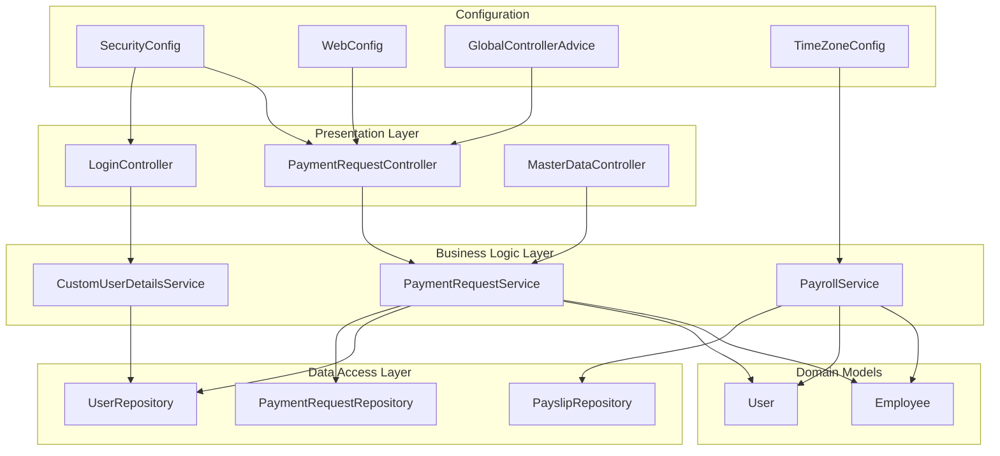
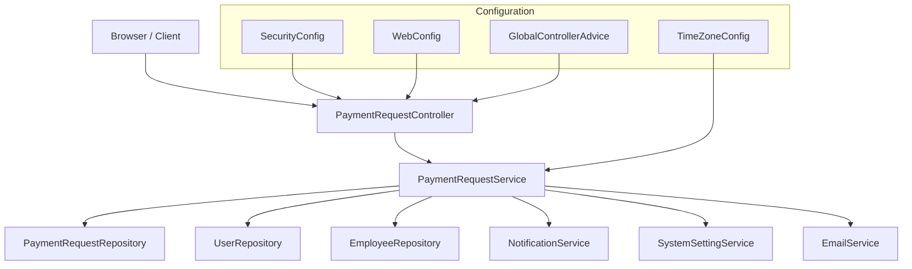
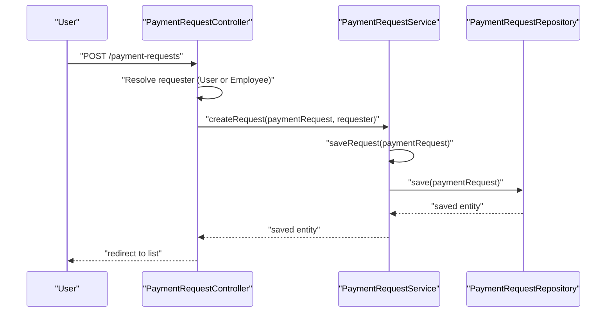
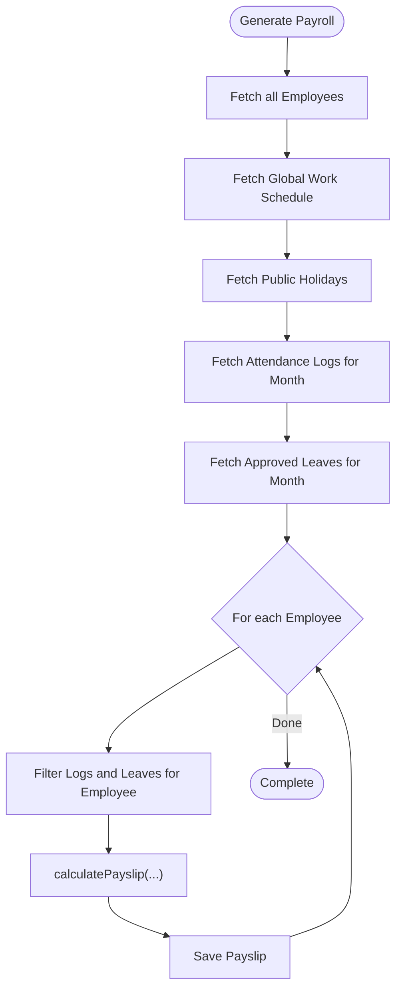
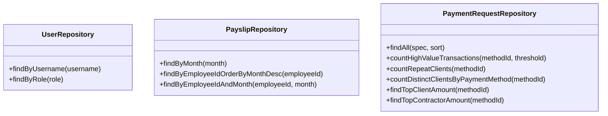
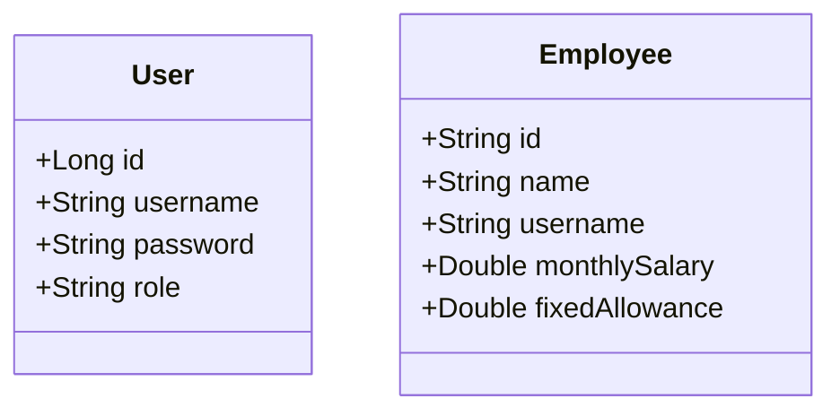
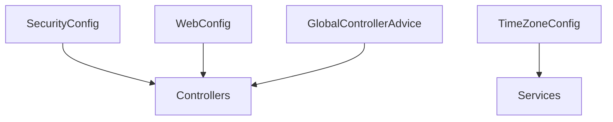
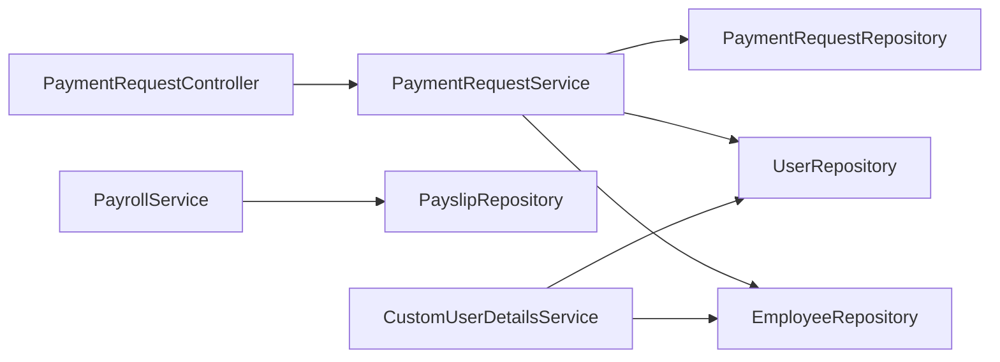

# Layered Architecture

<cite>
**Referenced Files in This Document**
- [AttendanceSystemApplication.java](file://src/main/java/root/cyb/mh/attendancesystem/AttendanceSystemApplication.java)
- [LoginController.java](file://src/main/java/root/cyb/mh/attendancesystem/controller/LoginController.java)
- [PaymentRequestController.java](file://src/main/java/root/cyb/mh/attendancesystem/controller/PaymentRequestController.java)
- [MasterDataController.java](file://src/main/java/root/cyb/mh/attendancesystem/controller/MasterDataController.java)
- [CustomUserDetailsService.java](file://src/main/java/root/cyb/mh/attendancesystem/service/CustomUserDetailsService.java)
- [PaymentRequestService.java](file://src/main/java/root/cyb/mh/attendancesystem/service/PaymentRequestService.java)
- [PayrollService.java](file://src/main/java/root/cyb/mh/attendancesystem/service/PayrollService.java)
- [UserRepository.java](file://src/main/java/root/cyb/mh/attendancesystem/repository/UserRepository.java)
- [PayslipRepository.java](file://src/main/java/root/cyb/mh/attendancesystem/repository/PayslipRepository.java)
- [PaymentRequestRepository.java](file://src/main/java/root/cyb/mh/attendancesystem/repository/PaymentRequestRepository.java)
- [User.java](file://src/main/java/root/cyb/mh/attendancesystem/model/User.java)
- [Employee.java](file://src/main/java/root/cyb/mh/attendancesystem/model/Employee.java)
- [SecurityConfig.java](file://src/main/java/root/cyb/mh/attendancesystem/config/SecurityConfig.java)
- [WebConfig.java](file://src/main/java/root/cyb/mh/attendancesystem/config/WebConfig.java)
- [GlobalControllerAdvice.java](file://src/main/java/root/cyb/mh/attendancesystem/config/GlobalControllerAdvice.java)
- [TimeZoneConfig.java](file://src/main/java/root/cyb/mh/attendancesystem/config/TimeZoneConfig.java)
- [PaymentRequestServiceTest.java](file://src/test/java/root/cyb/mh/attendancesystem/PaymentRequestServiceTest.java)
</cite>

## Table of Contents
1. [Introduction](#introduction)
2. [Project Structure](#project-structure)
3. [Core Components](#core-components)
4. [Architecture Overview](#architecture-overview)
5. [Detailed Component Analysis](#detailed-component-analysis)
6. [Dependency Analysis](#dependency-analysis)
7. [Performance Considerations](#performance-considerations)
8. [Troubleshooting Guide](#troubleshooting-guide)
9. [Conclusion](#conclusion)

## Introduction
This document explains the layered architecture pattern implemented in the backend project. The system follows a clear separation of concerns across three primary layers:
- Presentation layer (controllers): Handles HTTP requests, applies security and authorization, and orchestrates user interactions.
- Business logic layer (services): Encapsulates domain-specific workflows, coordinates repositories, and manages cross-entity business rules.
- Data access layer (repositories): Provides type-safe persistence operations and query abstractions over JPA.

The document also covers dependency injection via Spring annotations, transaction management characteristics, and how the architecture supports maintainability, testability, and scalability.

## Project Structure
The project is organized by functional packages aligned with the layered architecture:
- controller: Presentation layer classes handling HTTP endpoints and user-facing flows.
- service: Business logic layer implementing workflows and coordinating repositories.
- repository: Data access layer extending Spring Data JPA repositories.
- model: JPA entity definitions representing the domain.
- config: Spring configuration for security, web, scheduling, and timezone.
- dto: Transfer objects for cross-layer communication.
- exception: Global exception handling.
- specification: Criteria-based query builders for dynamic filtering.

**Diagram sources**
- [LoginController.java:1-14](file://src/main/java/root/cyb/mh/attendancesystem/controller/LoginController.java#L1-L14)
- [PaymentRequestController.java:1-688](file://src/main/java/root/cyb/mh/attendancesystem/controller/PaymentRequestController.java#L1-L688)
- [MasterDataController.java:130-318](file://src/main/java/root/cyb/mh/attendancesystem/controller/MasterDataController.java#L130-L318)
- [CustomUserDetailsService.java:1-54](file://src/main/java/root/cyb/mh/attendancesystem/service/CustomUserDetailsService.java#L1-L54)
- [PaymentRequestService.java:1-269](file://src/main/java/root/cyb/mh/attendancesystem/service/PaymentRequestService.java#L1-L269)
- [PayrollService.java:1-318](file://src/main/java/root/cyb/mh/attendancesystem/service/PayrollService.java#L1-L318)
- [UserRepository.java:1-12](file://src/main/java/root/cyb/mh/attendancesystem/repository/UserRepository.java#L1-L12)
- [PayslipRepository.java:1-15](file://src/main/java/root/cyb/mh/attendancesystem/repository/PayslipRepository.java#L1-L15)
- [PaymentRequestRepository.java:356-435](file://src/main/java/root/cyb/mh/attendancesystem/repository/PaymentRequestRepository.java#L356-L435)
- [User.java:1-24](file://src/main/java/root/cyb/mh/attendancesystem/model/User.java#L1-L24)
- [Employee.java:1-64](file://src/main/java/root/cyb/mh/attendancesystem/model/Employee.java#L1-L64)
- [SecurityConfig.java:1-91](file://src/main/java/root/cyb/mh/attendancesystem/config/SecurityConfig.java#L1-L91)
- [WebConfig.java:1-18](file://src/main/java/root/cyb/mh/attendancesystem/config/WebConfig.java#L1-L18)
- [GlobalControllerAdvice.java:1-37](file://src/main/java/root/cyb/mh/attendancesystem/config/GlobalControllerAdvice.java#L1-L37)
- [TimeZoneConfig.java:1-26](file://src/main/java/root/cyb/mh/attendancesystem/config/TimeZoneConfig.java#L1-L26)

**Section sources**
- [AttendanceSystemApplication.java:1-16](file://src/main/java/root/cyb/mh/attendancesystem/AttendanceSystemApplication.java#L1-L16)
- [SecurityConfig.java:1-91](file://src/main/java/root/cyb/mh/attendancesystem/config/SecurityConfig.java#L1-L91)
- [WebConfig.java:1-18](file://src/main/java/root/cyb/mh/attendancesystem/config/WebConfig.java#L1-L18)
- [GlobalControllerAdvice.java:1-37](file://src/main/java/root/cyb/mh/attendancesystem/config/GlobalControllerAdvice.java#L1-L37)
- [TimeZoneConfig.java:1-26](file://src/main/java/root/cyb/mh/attendancesystem/config/TimeZoneConfig.java#L1-L26)

## Core Components
This section outlines the responsibilities and interactions of the core components across layers.

- Presentation layer (controllers)
  - Controllers handle HTTP requests, apply authorization checks, and delegate to services for business operations.
  - Examples:
    - LoginController exposes a GET endpoint for the login page.
    - PaymentRequestController manages listing, filtering, creation, review, and export of payment requests, integrating with repositories and services.
    - MasterDataController handles master data CRUD operations with role-based access.

- Business logic layer (services)
  - Services encapsulate workflows and coordinate repositories and domain entities.
  - Examples:
    - CustomUserDetailsService loads user details for authentication, bridging User and Employee entities.
    - PaymentRequestService creates requests, notifies stakeholders, and sorts results.
    - PayrollService generates and finalizes payslips, aggregating attendance, leaves, schedules, and holidays.

- Data access layer (repositories)
  - Repositories provide type-safe persistence and query capabilities.
  - Examples:
    - UserRepository defines queries for users by username and role.
    - PayslipRepository offers lookups by month and employee.
    - PaymentRequestRepository includes analytics-oriented queries and dynamic filtering support.

**Section sources**
- [LoginController.java:1-14](file://src/main/java/root/cyb/mh/attendancesystem/controller/LoginController.java#L1-L14)
- [PaymentRequestController.java:1-688](file://src/main/java/root/cyb/mh/attendancesystem/controller/PaymentRequestController.java#L1-L688)
- [MasterDataController.java:130-318](file://src/main/java/root/cyb/mh/attendancesystem/controller/MasterDataController.java#L130-L318)
- [CustomUserDetailsService.java:1-54](file://src/main/java/root/cyb/mh/attendancesystem/service/CustomUserDetailsService.java#L1-L54)
- [PaymentRequestService.java:1-269](file://src/main/java/root/cyb/mh/attendancesystem/service/PaymentRequestService.java#L1-L269)
- [PayrollService.java:1-318](file://src/main/java/root/cyb/mh/attendancesystem/service/PayrollService.java#L1-L318)
- [UserRepository.java:1-12](file://src/main/java/root/cyb/mh/attendancesystem/repository/UserRepository.java#L1-L12)
- [PayslipRepository.java:1-15](file://src/main/java/root/cyb/mh/attendancesystem/repository/PayslipRepository.java#L1-L15)
- [PaymentRequestRepository.java:356-435](file://src/main/java/root/cyb/mh/attendancesystem/repository/PaymentRequestRepository.java#L356-L435)

## Architecture Overview
The layered architecture enforces clear boundaries:
- Presentation depends on services.
- Services depend on repositories and models.
- Repositories depend on JPA and database.

**Diagram sources**
- [PaymentRequestController.java:1-688](file://src/main/java/root/cyb/mh/attendancesystem/controller/PaymentRequestController.java#L1-L688)
- [PaymentRequestService.java:1-269](file://src/main/java/root/cyb/mh/attendancesystem/service/PaymentRequestService.java#L1-L269)
- [UserRepository.java:1-12](file://src/main/java/root/cyb/mh/attendancesystem/repository/UserRepository.java#L1-L12)
- [SecurityConfig.java:1-91](file://src/main/java/root/cyb/mh/attendancesystem/config/SecurityConfig.java#L1-L91)
- [WebConfig.java:1-18](file://src/main/java/root/cyb/mh/attendancesystem/config/WebConfig.java#L1-L18)
- [GlobalControllerAdvice.java:1-37](file://src/main/java/root/cyb/mh/attendancesystem/config/GlobalControllerAdvice.java#L1-L37)
- [TimeZoneConfig.java:1-26](file://src/main/java/root/cyb/mh/attendancesystem/config/TimeZoneConfig.java#L1-L26)

## Detailed Component Analysis

### Presentation Layer: Controllers
Controllers orchestrate user interactions and enforce authorization:
- PaymentRequestController
  - Lists and filters payment requests with dynamic criteria and sorting.
  - Creates requests by delegating to PaymentRequestService after resolving requester identity.
  - Reviews and updates requests with role-based restrictions and change tracking.
  - Exports lists to CSV/PDF and serves invoices and proof attachments.
- MasterDataController
  - Manages master data CRUD with PreAuthorize annotations restricting access to ADMIN/HR.
- LoginController
  - Returns the login page template.

**Diagram sources**
- [PaymentRequestController.java:260-281](file://src/main/java/root/cyb/mh/attendancesystem/controller/PaymentRequestController.java#L260-L281)
- [PaymentRequestService.java:29-60](file://src/main/java/root/cyb/mh/attendancesystem/service/PaymentRequestService.java#L29-L60)
- [PaymentRequestRepository.java:356-435](file://src/main/java/root/cyb/mh/attendancesystem/repository/PaymentRequestRepository.java#L356-L435)

**Section sources**
- [PaymentRequestController.java:65-147](file://src/main/java/root/cyb/mh/attendancesystem/controller/PaymentRequestController.java#L65-L147)
- [PaymentRequestController.java:246-281](file://src/main/java/root/cyb/mh/attendancesystem/controller/PaymentRequestController.java#L246-L281)
- [PaymentRequestController.java:333-517](file://src/main/java/root/cyb/mh/attendancesystem/controller/PaymentRequestController.java#L333-L517)
- [MasterDataController.java:138-318](file://src/main/java/root/cyb/mh/attendancesystem/controller/MasterDataController.java#L138-L318)
- [LoginController.java:1-14](file://src/main/java/root/cyb/mh/attendancesystem/controller/LoginController.java#L1-L14)

### Business Logic Layer: Services
Services encapsulate workflows and coordinate repositories:
- CustomUserDetailsService
  - Loads user details from User or Employee repositories, supporting dual login identities.
- PaymentRequestService
  - Creates requests, resolves requester identity, persists, and triggers notifications.
  - Retrieves requests by requester, team, and sorts them according to business rules.
- PayrollService
  - Generates payslips for employees by aggregating attendance, leaves, schedules, and holidays.
  - Finalizes payslips and marks related advance salary requests as paid.

**Diagram sources**
- [PayrollService.java:39-92](file://src/main/java/root/cyb/mh/attendancesystem/service/PayrollService.java#L39-L92)
- [PayslipRepository.java:1-15](file://src/main/java/root/cyb/mh/attendancesystem/repository/PayslipRepository.java#L1-L15)

**Section sources**
- [CustomUserDetailsService.java:24-52](file://src/main/java/root/cyb/mh/attendancesystem/service/CustomUserDetailsService.java#L24-L52)
- [PaymentRequestService.java:29-150](file://src/main/java/root/cyb/mh/attendancesystem/service/PaymentRequestService.java#L29-L150)
- [PayrollService.java:39-290](file://src/main/java/root/cyb/mh/attendancesystem/service/PayrollService.java#L39-L290)

### Data Access Layer: Repositories
Repositories provide typed persistence and queries:
- UserRepository
  - Finds users by username and role.
- PayslipRepository
  - Queries by month and employee, and finds by composite key.
- PaymentRequestRepository
  - Includes analytics queries and dynamic filtering support.

**Diagram sources**
- [UserRepository.java:1-12](file://src/main/java/root/cyb/mh/attendancesystem/repository/UserRepository.java#L1-L12)
- [PayslipRepository.java:1-15](file://src/main/java/root/cyb/mh/attendancesystem/repository/PayslipRepository.java#L1-L15)
- [PaymentRequestRepository.java:356-435](file://src/main/java/root/cyb/mh/attendancesystem/repository/PaymentRequestRepository.java#L356-L435)

**Section sources**
- [UserRepository.java:7-11](file://src/main/java/root/cyb/mh/attendancesystem/repository/UserRepository.java#L7-L11)
- [PayslipRepository.java:8-14](file://src/main/java/root/cyb/mh/attendancesystem/repository/PayslipRepository.java#L8-L14)
- [PaymentRequestRepository.java:356-435](file://src/main/java/root/cyb/mh/attendancesystem/repository/PaymentRequestRepository.java#L356-L435)

### Domain Models
Domain entities define the data structures used across layers:
- User: Application user with credentials and role.
- Employee: Employee entity used for login and organizational hierarchy.

**Diagram sources**
- [User.java:1-24](file://src/main/java/root/cyb/mh/attendancesystem/model/User.java#L1-L24)
- [Employee.java:1-64](file://src/main/java/root/cyb/mh/attendancesystem/model/Employee.java#L1-L64)

**Section sources**
- [User.java:9-23](file://src/main/java/root/cyb/mh/attendancesystem/model/User.java#L9-L23)
- [Employee.java:13-62](file://src/main/java/root/cyb/mh/attendancesystem/model/Employee.java#L13-L62)

### Configuration and Cross-Cutting Concerns
- SecurityConfig
  - Defines security filter chain, role-based access, and custom authentication success handler.
- WebConfig
  - Serves static resources and uploaded files from the filesystem.
- GlobalControllerAdvice
  - Adds global attributes to models (e.g., company name, supervisor flag).
- TimeZoneConfig
  - Sets JVM default timezone globally to ensure consistent temporal operations.

**Diagram sources**
- [SecurityConfig.java:1-91](file://src/main/java/root/cyb/mh/attendancesystem/config/SecurityConfig.java#L1-L91)
- [WebConfig.java:1-18](file://src/main/java/root/cyb/mh/attendancesystem/config/WebConfig.java#L1-L18)
- [GlobalControllerAdvice.java:1-37](file://src/main/java/root/cyb/mh/attendancesystem/config/GlobalControllerAdvice.java#L1-L37)
- [TimeZoneConfig.java:1-26](file://src/main/java/root/cyb/mh/attendancesystem/config/TimeZoneConfig.java#L1-L26)

**Section sources**
- [SecurityConfig.java:18-84](file://src/main/java/root/cyb/mh/attendancesystem/config/SecurityConfig.java#L18-L84)
- [WebConfig.java:10-16](file://src/main/java/root/cyb/mh/attendancesystem/config/WebConfig.java#L10-L16)
- [GlobalControllerAdvice.java:26-36](file://src/main/java/root/cyb/mh/attendancesystem/config/GlobalControllerAdvice.java#L26-L36)
- [TimeZoneConfig.java:20-25](file://src/main/java/root/cyb/mh/attendancesystem/config/TimeZoneConfig.java#L20-L25)

## Dependency Analysis
The system exhibits clean dependency directionality:
- Controllers depend on Services.
- Services depend on Repositories and Models.
- Repositories depend on JPA abstractions and the database.

**Diagram sources**
- [PaymentRequestController.java:34-63](file://src/main/java/root/cyb/mh/attendancesystem/controller/PaymentRequestController.java#L34-L63)
- [PaymentRequestService.java:17-27](file://src/main/java/root/cyb/mh/attendancesystem/service/PaymentRequestService.java#L17-L27)
- [PayrollService.java:18-37](file://src/main/java/root/cyb/mh/attendancesystem/service/PayrollService.java#L18-L37)
- [UserRepository.java:1-12](file://src/main/java/root/cyb/mh/attendancesystem/repository/UserRepository.java#L1-L12)
- [PayslipRepository.java:1-15](file://src/main/java/root/cyb/mh/attendancesystem/repository/PayslipRepository.java#L1-L15)

**Section sources**
- [PaymentRequestController.java:34-63](file://src/main/java/root/cyb/mh/attendancesystem/controller/PaymentRequestController.java#L34-L63)
- [PaymentRequestService.java:17-27](file://src/main/java/root/cyb/mh/attendancesystem/service/PaymentRequestService.java#L17-L27)
- [PayrollService.java:18-37](file://src/main/java/root/cyb/mh/attendancesystem/service/PayrollService.java#L18-L37)

## Performance Considerations
- Bulk data fetching in PayrollService reduces N+1 queries by preloading attendance logs and leaves for the month.
- Repository queries leverage JPA projections and analytics methods to minimize round trips.
- Sorting and filtering are applied server-side with pagination-friendly patterns.

[No sources needed since this section provides general guidance]

## Troubleshooting Guide
- Authorization failures
  - Verify role-based annotations on controllers and ensure SecurityConfig permits intended paths.
- Upload and static resource serving
  - Confirm WebConfig resource handlers and file system permissions for uploads.
- Timezone-related discrepancies
  - Ensure TimeZoneConfig is loaded and JVM timezone is set consistently across environments.
- Testing services
  - Use SpringBootTest with Mockito beans to isolate service tests from external dependencies.

**Section sources**
- [SecurityConfig.java:18-84](file://src/main/java/root/cyb/mh/attendancesystem/config/SecurityConfig.java#L18-L84)
- [WebConfig.java:10-16](file://src/main/java/root/cyb/mh/attendancesystem/config/WebConfig.java#L10-L16)
- [TimeZoneConfig.java:20-25](file://src/main/java/root/cyb/mh/attendancesystem/config/TimeZoneConfig.java#L20-L25)
- [PaymentRequestServiceTest.java:16-36](file://src/test/java/root/cyb/mh/attendancesystem/PaymentRequestServiceTest.java#L16-L36)

## Conclusion
The project demonstrates a well-structured layered architecture:
- Clear separation between presentation, business logic, and data access layers.
- Dependency injection via Spring annotations enables loose coupling and testability.
- Security and configuration layers provide cross-cutting concerns.
- Transaction management is implicit through Spring-managed services and repositories, suitable for typical CRUD and batch operations.

This design supports maintainability by isolating concerns, testability through service mocking, and scalability by allowing independent evolution of layers and modular addition of features.