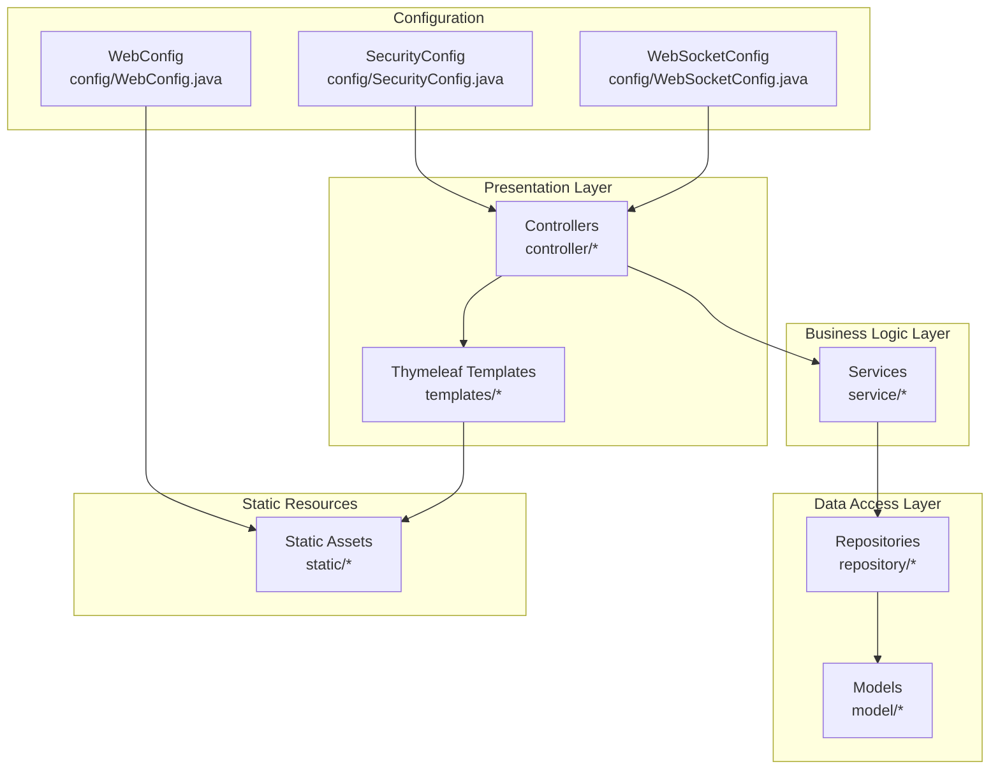
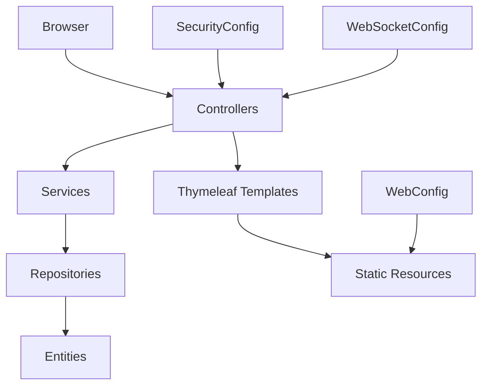
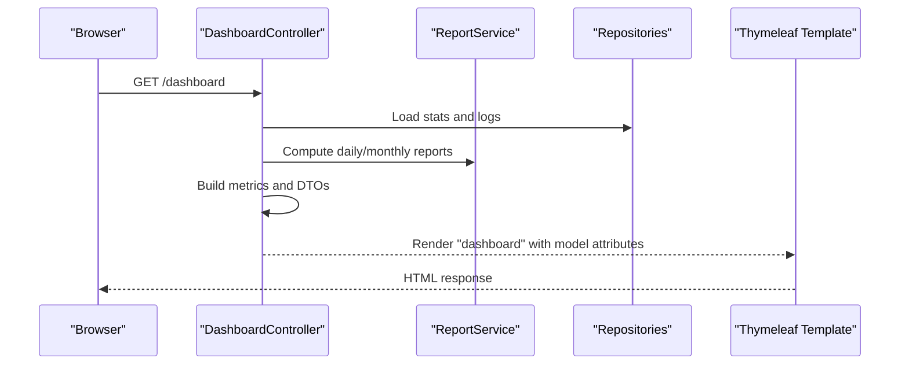
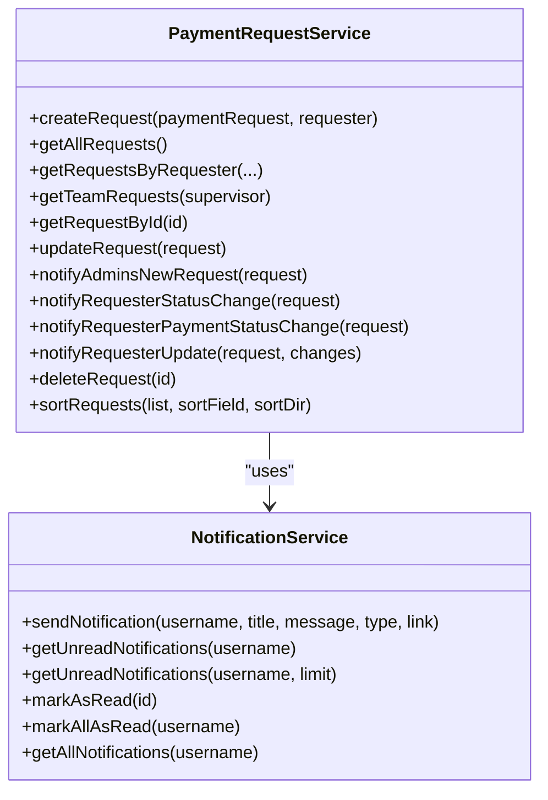
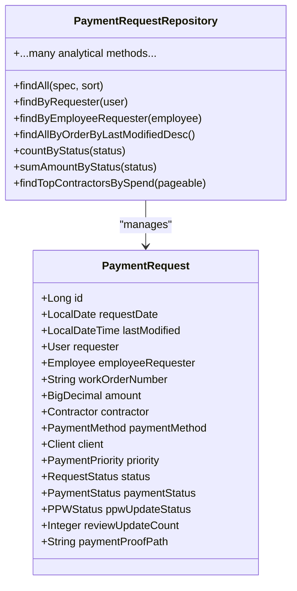
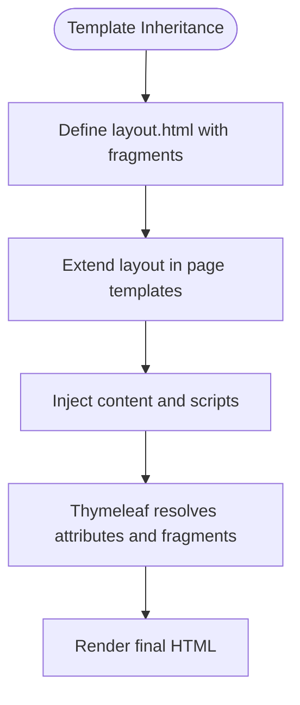
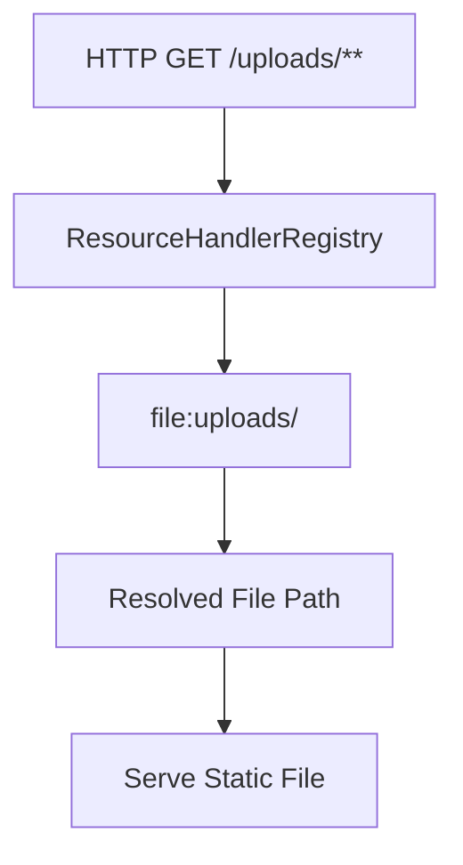
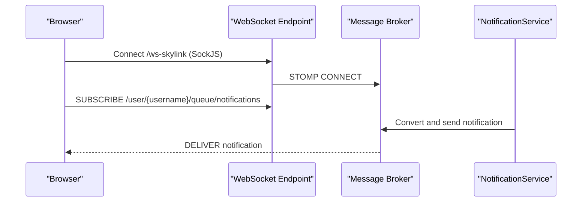
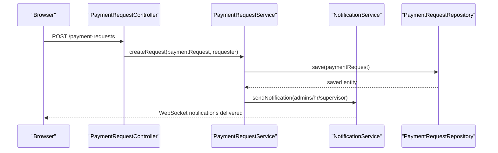
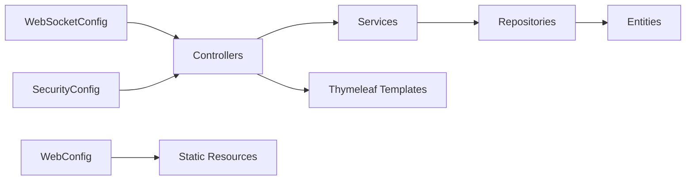

# MVC Pattern Implementation

<cite>
**Referenced Files in This Document**
- [AttendanceSystemApplication.java](file://src/main/java/root/cyb/mh/attendancesystem/AttendanceSystemApplication.java)
- [WebConfig.java](file://src/main/java/root/cyb/mh/attendancesystem/config/WebConfig.java)
- [WebSocketConfig.java](file://src/main/java/root/cyb/mh/attendancesystem/config/WebSocketConfig.java)
- [SecurityConfig.java](file://src/main/java/root/cyb/mh/attendancesystem/config/SecurityConfig.java)
- [LoginController.java](file://src/main/java/root/cyb/mh/attendancesystem/controller/LoginController.java)
- [DashboardController.java](file://src/main/java/root/cyb/mh/attendancesystem/controller/DashboardController.java)
- [PaymentRequestController.java](file://src/main/java/root/cyb/mh/attendancesystem/controller/PaymentRequestController.java)
- [PaymentRequestService.java](file://src/main/java/root/cyb/mh/attendancesystem/service/PaymentRequestService.java)
- [NotificationService.java](file://src/main/java/root/cyb/mh/attendancesystem/service/NotificationService.java)
- [PaymentRequestRepository.java](file://src/main/java/root/cyb/mh/attendancesystem/repository/PaymentRequestRepository.java)
- [PaymentRequest.java](file://src/main/java/root/cyb/mh/attendancesystem/model/PaymentRequest.java)
- [layout.html](file://src/main/resources/templates/layout.html)
- [dashboard.html](file://src/main/resources/templates/dashboard.html)
- [list.html](file://src/main/resources/templates/payment-request/list.html)
</cite>

## Table of Contents
1. [Introduction](#introduction)
2. [Project Structure](#project-structure)
3. [Core Components](#core-components)
4. [Architecture Overview](#architecture-overview)
5. [Detailed Component Analysis](#detailed-component-analysis)
6. [Dependency Analysis](#dependency-analysis)
7. [Performance Considerations](#performance-considerations)
8. [Troubleshooting Guide](#troubleshooting-guide)
9. [Conclusion](#conclusion)

## Introduction
This document explains how the Spring Boot application implements the Model-View-Controller (MVC) pattern for building a maintainable, server-rendered web application. It covers how controllers handle HTTP requests, how the service layer manages business logic, and how Thymeleaf templates render server-side HTML. It also documents the roles of WebConfig for static resource serving and WebSocketConfig for real-time communication, along with request-response flows, controller responsibilities, and view resolution mechanisms. The goal is to demonstrate how separation of concerns is achieved and how this pattern supports scalable web development.

## Project Structure
The application follows a conventional Spring MVC layout:
- Controllers under controller/
- Services under service/
- Repositories under repository/
- Models under model/
- Thymeleaf templates under resources/templates/
- Static resources under resources/static/

**Diagram sources**
- [WebConfig.java:1-18](file://src/main/java/root/cyb/mh/attendancesystem/config/WebConfig.java#L1-L18)
- [WebSocketConfig.java:1-26](file://src/main/java/root/cyb/mh/attendancesystem/config/WebSocketConfig.java#L1-L26)
- [SecurityConfig.java:1-91](file://src/main/java/root/cyb/mh/attendancesystem/config/SecurityConfig.java#L1-L91)

**Section sources**
- [AttendanceSystemApplication.java:1-16](file://src/main/java/root/cyb/mh/attendancesystem/AttendanceSystemApplication.java#L1-L16)

## Core Components
- Controllers: Handle HTTP requests, coordinate with services, and return logical view names or data.
- Services: Encapsulate business logic, orchestrate domain operations, and manage cross-entity workflows.
- Repositories: Data access layer using Spring Data JPA.
- Models: JPA entities representing persisted data.
- Thymeleaf Templates: Server-side HTML rendering with layout composition and fragment reuse.
- Configuration: WebConfig for static resource mapping, WebSocketConfig for real-time messaging, SecurityConfig for access control.

**Section sources**
- [LoginController.java:1-14](file://src/main/java/root/cyb/mh/attendancesystem/controller/LoginController.java#L1-L14)
- [DashboardController.java:1-331](file://src/main/java/root/cyb/mh/attendancesystem/controller/DashboardController.java#L1-L331)
- [PaymentRequestController.java:1-688](file://src/main/java/root/cyb/mh/attendancesystem/controller/PaymentRequestController.java#L1-L688)
- [PaymentRequestService.java:1-269](file://src/main/java/root/cyb/mh/attendancesystem/service/PaymentRequestService.java#L1-L269)
- [PaymentRequestRepository.java:1-742](file://src/main/java/root/cyb/mh/attendancesystem/repository/PaymentRequestRepository.java#L1-L742)
- [PaymentRequest.java:1-117](file://src/main/java/root/cyb/mh/attendancesystem/model/PaymentRequest.java#L1-L117)
- [layout.html:1-292](file://src/main/resources/templates/layout.html#L1-L292)
- [list.html:1-431](file://src/main/resources/templates/payment-request/list.html#L1-L431)

## Architecture Overview
The MVC architecture separates concerns:
- Presentation: Controllers expose endpoints and bind request data to models.
- Business: Services encapsulate workflows and coordinate repositories.
- Persistence: Repositories provide typed queries and aggregations.
- Rendering: Thymeleaf templates render HTML with layout fragments and dynamic attributes.
- Infrastructure: WebConfig serves static assets; WebSocketConfig enables real-time notifications; SecurityConfig enforces authorization.

**Diagram sources**
- [WebConfig.java:10-16](file://src/main/java/root/cyb/mh/attendancesystem/config/WebConfig.java#L10-L16)
- [WebSocketConfig.java:13-24](file://src/main/java/root/cyb/mh/attendancesystem/config/WebSocketConfig.java#L13-L24)
- [SecurityConfig.java:19-84](file://src/main/java/root/cyb/mh/attendancesystem/config/SecurityConfig.java#L19-L84)

## Detailed Component Analysis

### Controllers: HTTP Request Handling and View Resolution
Controllers annotate request mappings and delegate to services. They use Model to pass data to views and return logical view names resolved by the template engine.

- LoginController: Returns the login view for GET /login.
- DashboardController: Renders the dashboard and exposes an API endpoint for live status.
- PaymentRequestController: Manages listing, filtering, creation, review, export, and invoice generation.

**Diagram sources**
- [DashboardController.java:40-225](file://src/main/java/root/cyb/mh/attendancesystem/controller/DashboardController.java#L40-L225)
- [dashboard.html:1-800](file://src/main/resources/templates/dashboard.html#L1-L800)

Controller responsibilities include:
- Parameter binding and validation hints via annotations.
- Authorization checks using method-level security and role-based access.
- Data retrieval from repositories and aggregation via services.
- View selection and model population for Thymeleaf rendering.

**Section sources**
- [LoginController.java:9-12](file://src/main/java/root/cyb/mh/attendancesystem/controller/LoginController.java#L9-L12)
- [DashboardController.java:40-270](file://src/main/java/root/cyb/mh/attendancesystem/controller/DashboardController.java#L40-L270)
- [PaymentRequestController.java:65-147](file://src/main/java/root/cyb/mh/attendancesystem/controller/PaymentRequestController.java#L65-L147)
- [PaymentRequestController.java:246-281](file://src/main/java/root/cyb/mh/attendancesystem/controller/PaymentRequestController.java#L246-L281)
- [PaymentRequestController.java:283-331](file://src/main/java/root/cyb/mh/attendancesystem/controller/PaymentRequestController.java#L283-L331)

### Service Layer: Business Logic Orchestration
Services encapsulate business workflows, coordinate repositories, and trigger notifications. They centralize cross-entity logic and maintain transaction boundaries.

- PaymentRequestService: Creates requests, applies defaults, notifies stakeholders, sorts lists, and updates statuses.
- NotificationService: Persists notifications, pushes WebSocket messages, and manages read/unread states.

**Diagram sources**
- [PaymentRequestService.java:29-216](file://src/main/java/root/cyb/mh/attendancesystem/service/PaymentRequestService.java#L29-L216)
- [NotificationService.java:22-72](file://src/main/java/root/cyb/mh/attendancesystem/service/NotificationService.java#L22-L72)

**Section sources**
- [PaymentRequestService.java:29-269](file://src/main/java/root/cyb/mh/attendancesystem/service/PaymentRequestService.java#L29-L269)
- [NotificationService.java:22-72](file://src/main/java/root/cyb/mh/attendancesystem/service/NotificationService.java#L22-L72)

### Data Access: Repositories and Entities
Repositories extend Spring Data JPA interfaces to provide CRUD and custom query methods. Entities define persistence mappings and relationships.

- PaymentRequestRepository: Provides standard CRUD, sorting, filtering, and numerous analytical queries.
- PaymentRequest: JPA entity with fields for requester, employee requester, amounts, statuses, and audit timestamps.

**Diagram sources**
- [PaymentRequestRepository.java:10-12](file://src/main/java/root/cyb/mh/attendancesystem/repository/PaymentRequestRepository.java#L10-L12)
- [PaymentRequest.java:18-116](file://src/main/java/root/cyb/mh/attendancesystem/model/PaymentRequest.java#L18-L116)

**Section sources**
- [PaymentRequestRepository.java:10-742](file://src/main/java/root/cyb/mh/attendancesystem/repository/PaymentRequestRepository.java#L10-L742)
- [PaymentRequest.java:18-116](file://src/main/java/root/cyb/mh/attendancesystem/model/PaymentRequest.java#L18-L116)

### Views: Thymeleaf Templates and Layout Composition
Thymeleaf templates render server-side HTML. The layout template defines a reusable structure with fragments for sidebar, topbar, and content injection. Individual pages extend the layout and populate content blocks.

- layout.html: Defines the base layout, includes global styles/scripts, and sets up real-time notifications via WebSocket.
- dashboard.html: Uses layout and renders metrics, charts, and live status grid.
- payment-request/list.html: Extends layout to display a paginated, sortable, and filterable table of payment requests.

**Diagram sources**
- [layout.html:3-84](file://src/main/resources/templates/layout.html#L3-L84)
- [dashboard.html:8-100](file://src/main/resources/templates/dashboard.html#L8-L100)
- [list.html:8-25](file://src/main/resources/templates/payment-request/list.html#L8-L25)

**Section sources**
- [layout.html:1-292](file://src/main/resources/templates/layout.html#L1-L292)
- [dashboard.html:1-800](file://src/main/resources/templates/dashboard.html#L1-L800)
- [list.html:1-431](file://src/main/resources/templates/payment-request/list.html#L1-L431)

### Static Resource Serving: WebConfig
WebConfig registers a resource handler to serve uploaded files from a local directory, enabling direct access to files under /uploads/**.

**Diagram sources**
- [WebConfig.java:10-16](file://src/main/java/root/cyb/mh/attendancesystem/config/WebConfig.java#L10-L16)

**Section sources**
- [WebConfig.java:10-16](file://src/main/java/root/cyb/mh/attendancesystem/config/WebConfig.java#L10-L16)

### Real-Time Communication: WebSocketConfig
WebSocketConfig enables real-time notifications:
- Enables a simple broker for topics and queues.
- Sets application destination prefixes and user-specific destinations.
- Registers a STOMP endpoint with SockJS fallback.

**Diagram sources**
- [WebSocketConfig.java:13-24](file://src/main/java/root/cyb/mh/attendancesystem/config/WebSocketConfig.java#L13-L24)
- [NotificationService.java:33-35](file://src/main/java/root/cyb/mh/attendancesystem/service/NotificationService.java#L33-L35)

**Section sources**
- [WebSocketConfig.java:13-24](file://src/main/java/root/cyb/mh/attendancesystem/config/WebSocketConfig.java#L13-L24)
- [NotificationService.java:33-35](file://src/main/java/root/cyb/mh/attendancesystem/service/NotificationService.java#L33-L35)

### Request-Response Flow Examples
Example 1: GET /dashboard
- Controller: DashboardController.dashboard() loads data and returns "dashboard".
- View: dashboard.html extends layout.html and renders metrics and live status grid.

Example 2: GET /payment-requests
- Controller: PaymentRequestController.listRequests() builds filters/specifications, sorts, and returns "payment-request/list".
- View: list.html extends layout.html and renders a searchable/filterable table.

Example 3: POST /payment-requests
- Controller: PaymentRequestController.submitRequest() determines requester identity and delegates to PaymentRequestService.createRequest().
- Service: PaymentRequestService persists and triggers notifications.

**Diagram sources**
- [PaymentRequestController.java:260-281](file://src/main/java/root/cyb/mh/attendancesystem/controller/PaymentRequestController.java#L260-L281)
- [PaymentRequestService.java:29-60](file://src/main/java/root/cyb/mh/attendancesystem/service/PaymentRequestService.java#L29-L60)
- [NotificationService.java:33-35](file://src/main/java/root/cyb/mh/attendancesystem/service/NotificationService.java#L33-L35)
- [PaymentRequestRepository.java:30](file://src/main/java/root/cyb/mh/attendancesystem/repository/PaymentRequestRepository.java#L30)

**Section sources**
- [DashboardController.java:40-225](file://src/main/java/root/cyb/mh/attendancesystem/controller/DashboardController.java#L40-L225)
- [PaymentRequestController.java:65-147](file://src/main/java/root/cyb/mh/attendancesystem/controller/PaymentRequestController.java#L65-L147)
- [PaymentRequestController.java:260-281](file://src/main/java/root/cyb/mh/attendancesystem/controller/PaymentRequestController.java#L260-L281)
- [PaymentRequestService.java:29-60](file://src/main/java/root/cyb/mh/attendancesystem/service/PaymentRequestService.java#L29-L60)

## Dependency Analysis
The application exhibits clean layering:
- Controllers depend on Services.
- Services depend on Repositories and Entities.
- Templates depend on layout fragments and model attributes.
- WebConfig and WebSocketConfig integrate infrastructure concerns.
- SecurityConfig governs authorization for endpoints.

**Diagram sources**
- [WebConfig.java:10-16](file://src/main/java/root/cyb/mh/attendancesystem/config/WebConfig.java#L10-L16)
- [WebSocketConfig.java:13-24](file://src/main/java/root/cyb/mh/attendancesystem/config/WebSocketConfig.java#L13-L24)
- [SecurityConfig.java:19-84](file://src/main/java/root/cyb/mh/attendancesystem/config/SecurityConfig.java#L19-L84)

**Section sources**
- [PaymentRequestController.java:34-64](file://src/main/java/root/cyb/mh/attendancesystem/controller/PaymentRequestController.java#L34-L64)
- [PaymentRequestService.java:17-27](file://src/main/java/root/cyb/mh/attendancesystem/service/PaymentRequestService.java#L17-L27)
- [PaymentRequestRepository.java:10-12](file://src/main/java/root/cyb/mh/attendancesystem/repository/PaymentRequestRepository.java#L10-L12)

## Performance Considerations
- Prefer repository methods with projections or DTOs to reduce payload sizes for large datasets.
- Use pagination and sorting parameters to limit result sets in list endpoints.
- Minimize N+1 queries by leveraging joins and fetch strategies in specifications.
- Cache frequently accessed configuration values and master data where appropriate.
- Offload heavy computations to background tasks or batch jobs.

## Troubleshooting Guide
Common issues and resolutions:
- 403 Forbidden on POST: SecurityConfig disables CSRF by default; ensure forms include CSRF tokens or adjust security rules accordingly.
- Static file not served under /uploads/: Verify WebConfig resource handler mapping and file path existence.
- WebSocket notifications not received: Confirm WebSocket endpoint registration and client-side connection logic in layout.html.
- View not resolving: Ensure controller returns the correct logical view name matching a Thymeleaf template name.

**Section sources**
- [SecurityConfig.java:81-81](file://src/main/java/root/cyb/mh/attendancesystem/config/SecurityConfig.java#L81-L81)
- [WebConfig.java:14-16](file://src/main/java/root/cyb/mh/attendancesystem/config/WebConfig.java#L14-L16)
- [layout.html:119-129](file://src/main/resources/templates/layout.html#L119-L129)

## Conclusion
The application demonstrates a robust MVC implementation with clear separation of concerns. Controllers focus on request handling and view selection, services encapsulate business logic, and repositories provide strong typing and analytical capabilities. Thymeleaf templates deliver consistent layouts and dynamic content. Infrastructure configurations support static asset delivery and real-time notifications, while security controls enforce access policies. This structure promotes maintainability, testability, and scalability for enterprise-grade web applications.