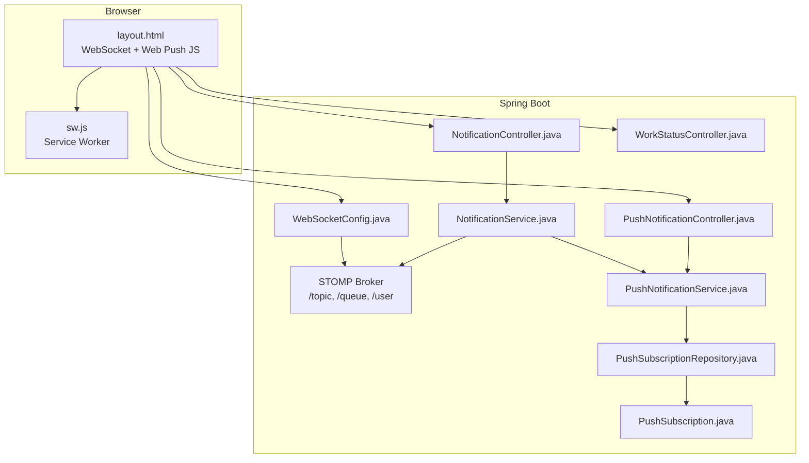
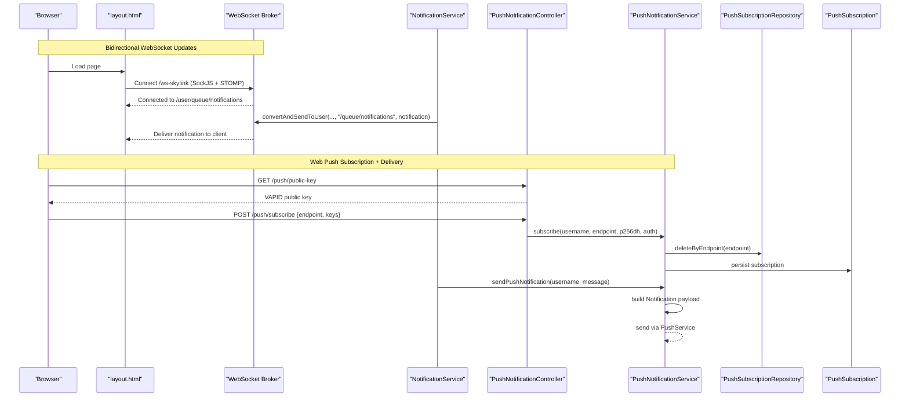
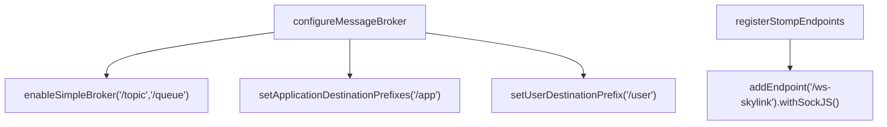
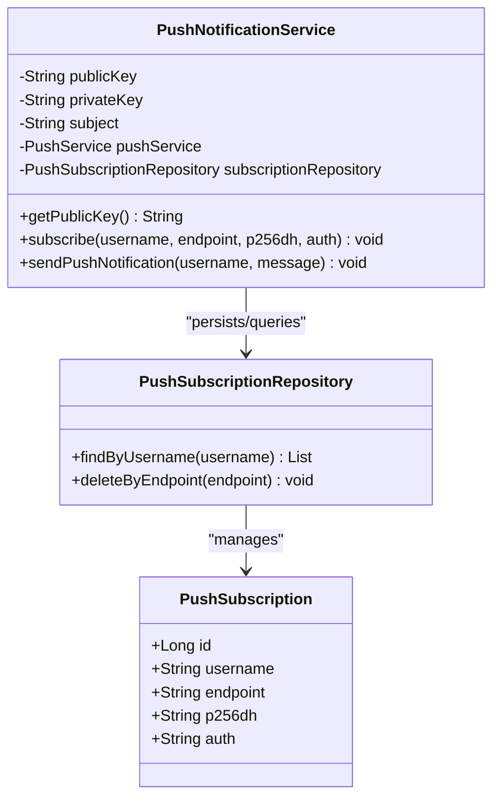
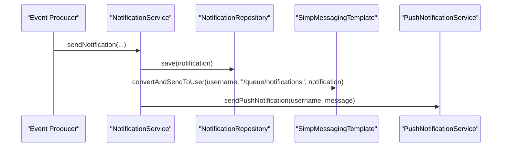
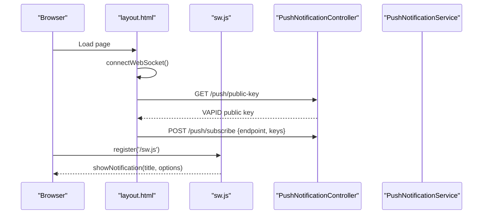
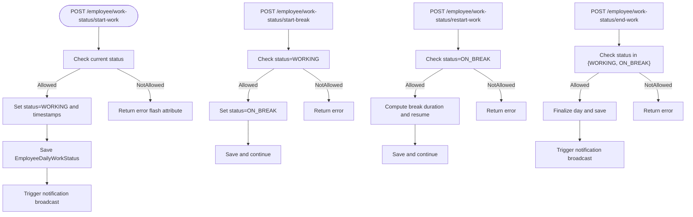
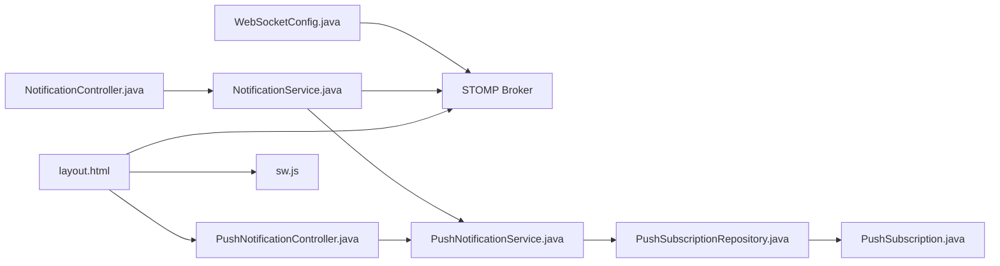

# Real-time Communication

<cite>
**Referenced Files in This Document**
- [WebSocketConfig.java](file://src/main/java/root/cyb/mh/attendancesystem/config/WebSocketConfig.java)
- [PushNotificationController.java](file://src/main/java/root/cyb/mh/attendancesystem/controller/PushNotificationController.java)
- [PushNotificationService.java](file://src/main/java/root/cyb/mh/attendancesystem/service/PushNotificationService.java)
- [PushSubscription.java](file://src/main/java/root/cyb/mh/attendancesystem/model/PushSubscription.java)
- [PushSubscriptionRepository.java](file://src/main/java/root/cyb/mh/attendancesystem/repository/PushSubscriptionRepository.java)
- [NotificationService.java](file://src/main/java/root/cyb/mh/attendancesystem/service/NotificationService.java)
- [NotificationController.java](file://src/main/java/root/cyb/mh/attendancesystem/controller/NotificationController.java)
- [WorkStatusController.java](file://src/main/java/root/cyb/mh/attendancesystem/controller/WorkStatusController.java)
- [WorkStatus.java](file://src/main/java/root/cyb/mh/attendancesystem/model/WorkStatus.java)
- [layout.html](file://src/main/resources/templates/layout.html)
- [sw.js](file://src/main/resources/static/sw.js)
- [application.properties](file://src/main/resources/application.properties)
- [application-dev.properties](file://src/main/resources/application-dev.properties)
- [application-prod.properties](file://src/main/resources/application-prod.properties)
</cite>

## Table of Contents
1. [Introduction](#introduction)
2. [Project Structure](#project-structure)
3. [Core Components](#core-components)
4. [Architecture Overview](#architecture-overview)
5. [Detailed Component Analysis](#detailed-component-analysis)
6. [Dependency Analysis](#dependency-analysis)
7. [Performance Considerations](#performance-considerations)
8. [Troubleshooting Guide](#troubleshooting-guide)
9. [Conclusion](#conclusion)

## Introduction
This document describes the real-time communication system architecture, focusing on bidirectional updates via WebSocket and live status delivery, alongside push notifications powered by the Web Push Protocol. It explains endpoint configuration, message routing, client-server protocols, and operational patterns for scalable, resilient real-time features. It also covers subscription lifecycle, notification broadcasting, and performance optimization strategies.

## Project Structure
The real-time stack spans Spring WebSocket (STOMP over SockJS), Spring Messaging, a Web Push subsystem, and browser-side JavaScript integrating both WebSocket and Service Worker-based push.

**Diagram sources**
- [WebSocketConfig.java:11-24](file://src/main/java/root/cyb/mh/attendancesystem/config/WebSocketConfig.java#L11-L24)
- [PushNotificationController.java:17-31](file://src/main/java/root/cyb/mh/attendancesystem/controller/PushNotificationController.java#L17-L31)
- [PushNotificationService.java:35-46](file://src/main/java/root/cyb/mh/attendancesystem/service/PushNotificationService.java#L35-L46)
- [PushSubscriptionRepository.java:7-11](file://src/main/java/root/cyb/mh/attendancesystem/repository/PushSubscriptionRepository.java#L7-L11)
- [PushSubscription.java:8-33](file://src/main/java/root/cyb/mh/attendancesystem/model/PushSubscription.java#L8-L33)
- [NotificationController.java:18-39](file://src/main/java/root/cyb/mh/attendancesystem/controller/NotificationController.java#L18-L39)
- [NotificationService.java:22-44](file://src/main/java/root/cyb/mh/attendancesystem/service/NotificationService.java#L22-L44)
- [WorkStatusController.java:25-110](file://src/main/java/root/cyb/mh/attendancesystem/controller/WorkStatusController.java#L25-L110)
- [layout.html:107-195](file://src/main/resources/templates/layout.html#L107-L195)
- [sw.js:1-41](file://src/main/resources/static/sw.js#L1-L41)

**Section sources**
- [WebSocketConfig.java:11-24](file://src/main/java/root/cyb/mh/attendancesystem/config/WebSocketConfig.java#L11-L24)
- [layout.html:107-195](file://src/main/resources/templates/layout.html#L107-L195)
- [application.properties:1-1](file://src/main/resources/application.properties#L1-L1)

## Core Components
- WebSocket configuration and STOMP broker enabling user-specific queues and application destinations.
- Push notification service implementing Web Push with VAPID, subscription persistence, and broadcast logic.
- Notification service orchestrating database writes, WebSocket broadcasts, and Web Push dispatch.
- Browser integration for WebSocket connections and Service Worker-based push subscriptions.

**Section sources**
- [WebSocketConfig.java:11-24](file://src/main/java/root/cyb/mh/attendancesystem/config/WebSocketConfig.java#L11-L24)
- [PushNotificationService.java:18-46](file://src/main/java/root/cyb/mh/attendancesystem/service/PushNotificationService.java#L18-L46)
- [NotificationService.java:22-44](file://src/main/java/root/cyb/mh/attendancesystem/service/NotificationService.java#L22-L44)
- [layout.html:107-195](file://src/main/resources/templates/layout.html#L107-L195)

## Architecture Overview
The system supports two real-time channels:
- WebSocket (STOMP over SockJS): server-to-client live updates for notifications.
- Web Push (Service Worker): background notifications even when the tab is closed.

**Diagram sources**
- [layout.html:119-129](file://src/main/resources/templates/layout.html#L119-L129)
- [WebSocketConfig.java:22-24](file://src/main/java/root/cyb/mh/attendancesystem/config/WebSocketConfig.java#L22-L24)
- [NotificationService.java:33-35](file://src/main/java/root/cyb/mh/attendancesystem/service/NotificationService.java#L33-L35)
- [PushNotificationController.java:17-31](file://src/main/java/root/cyb/mh/attendancesystem/controller/PushNotificationController.java#L17-L31)
- [PushNotificationService.java:52-76](file://src/main/java/root/cyb/mh/attendancesystem/service/PushNotificationService.java#L52-L76)
- [PushSubscriptionRepository.java:10-10](file://src/main/java/root/cyb/mh/attendancesystem/repository/PushSubscriptionRepository.java#L10-L10)
- [PushSubscription.java:15-30](file://src/main/java/root/cyb/mh/attendancesystem/model/PushSubscription.java#L15-L30)

## Detailed Component Analysis

### WebSocket Configuration and Message Broker
- Enables a simple broker for topics and queues, application destination prefixes, and user-specific destinations.
- Registers a STOMP endpoint exposed via SockJS for broad browser compatibility.

**Diagram sources**
- [WebSocketConfig.java:14-19](file://src/main/java/root/cyb/mh/attendancesystem/config/WebSocketConfig.java#L14-L19)
- [WebSocketConfig.java:21-24](file://src/main/java/root/cyb/mh/attendancesystem/config/WebSocketConfig.java#L21-L24)

**Section sources**
- [WebSocketConfig.java:11-24](file://src/main/java/root/cyb/mh/attendancesystem/config/WebSocketConfig.java#L11-L24)

### Push Notification Service (Web Push)
- Initializes a PushService with VAPID credentials loaded from application properties.
- Provides endpoints to retrieve the VAPID public key and to register browser subscriptions.
- Persists subscriptions keyed by endpoint (ensuring uniqueness) and sends push notifications to all user subscriptions.
- Handles 410/404 errors by removing stale subscriptions.

**Diagram sources**
- [PushNotificationService.java:18-46](file://src/main/java/root/cyb/mh/attendancesystem/service/PushNotificationService.java#L18-L46)
- [PushSubscriptionRepository.java:7-11](file://src/main/java/root/cyb/mh/attendancesystem/repository/PushSubscriptionRepository.java#L7-L11)
- [PushSubscription.java:15-30](file://src/main/java/root/cyb/mh/attendancesystem/model/PushSubscription.java#L15-L30)

**Section sources**
- [PushNotificationService.java:35-46](file://src/main/java/root/cyb/mh/attendancesystem/service/PushNotificationService.java#L35-L46)
- [PushNotificationController.java:17-31](file://src/main/java/root/cyb/mh/attendancesystem/controller/PushNotificationController.java#L17-L31)
- [PushSubscriptionRepository.java:7-11](file://src/main/java/root/cyb/mh/attendancesystem/repository/PushSubscriptionRepository.java#L7-L11)
- [PushSubscription.java:8-33](file://src/main/java/root/cyb/mh/attendancesystem/model/PushSubscription.java#L8-L33)

### Notification Broadcasting Pipeline
- On notification events, persists the record, publishes to the user’s WebSocket queue, and attempts to deliver a Web Push.
- WebSocket destination follows the pattern: /user/{username}/queue/notifications.

**Diagram sources**
- [NotificationService.java:22-44](file://src/main/java/root/cyb/mh/attendancesystem/service/NotificationService.java#L22-L44)

**Section sources**
- [NotificationService.java:22-44](file://src/main/java/root/cyb/mh/attendancesystem/service/NotificationService.java#L22-L44)

### Browser Integration: WebSocket and Push
- Loads SockJS and STOMP libraries, connects to /ws-skylink, subscribes to /user/queue/notifications, and renders toast notifications.
- Registers a Service Worker, requests push permission, retrieves the VAPID public key, subscribes via PushManager, and posts subscription metadata to /push/subscribe with CSRF protection.

**Diagram sources**
- [layout.html:107-195](file://src/main/resources/templates/layout.html#L107-L195)
- [layout.html:200-243](file://src/main/resources/templates/layout.html#L200-L243)
- [sw.js:1-41](file://src/main/resources/static/sw.js#L1-L41)
- [PushNotificationController.java:17-31](file://src/main/java/root/cyb/mh/attendancesystem/controller/PushNotificationController.java#L17-L31)

**Section sources**
- [layout.html:107-195](file://src/main/resources/templates/layout.html#L107-L195)
- [layout.html:200-243](file://src/main/resources/templates/layout.html#L200-L243)
- [sw.js:1-41](file://src/main/resources/static/sw.js#L1-L41)

### Live Status Updates (Work Status)
- Provides endpoints to advance an employee’s daily work status (start work, start break, restart work, end work).
- These endpoints can trigger downstream notifications or UI refresh signals; the front-end periodically fetches live status via a dedicated API endpoint.

**Diagram sources**
- [WorkStatusController.java:25-110](file://src/main/java/root/cyb/mh/attendancesystem/controller/WorkStatusController.java#L25-L110)
- [WorkStatus.java:3-13](file://src/main/java/root/cyb/mh/attendancesystem/model/WorkStatus.java#L3-L13)

**Section sources**
- [WorkStatusController.java:25-110](file://src/main/java/root/cyb/mh/attendancesystem/controller/WorkStatusController.java#L25-L110)
- [WorkStatus.java:3-13](file://src/main/java/root/cyb/mh/attendancesystem/model/WorkStatus.java#L3-L13)

## Dependency Analysis
- WebSocketConfig defines broker destinations and the STOMP endpoint.
- NotificationService depends on SimpMessagingTemplate for WebSocket broadcasts and on PushNotificationService for Web Push.
- PushNotificationService depends on PushSubscriptionRepository and persists PushSubscription entities.
- Front-end integrates both WebSocket and Web Push via layout.html and sw.js.

**Diagram sources**
- [WebSocketConfig.java:11-24](file://src/main/java/root/cyb/mh/attendancesystem/config/WebSocketConfig.java#L11-L24)
- [NotificationController.java:18-39](file://src/main/java/root/cyb/mh/attendancesystem/controller/NotificationController.java#L18-L39)
- [NotificationService.java:16-17](file://src/main/java/root/cyb/mh/attendancesystem/service/NotificationService.java#L16-L17)
- [PushNotificationController.java:17-31](file://src/main/java/root/cyb/mh/attendancesystem/controller/PushNotificationController.java#L17-L31)
- [PushNotificationService.java:29-33](file://src/main/java/root/cyb/mh/attendancesystem/service/PushNotificationService.java#L29-L33)
- [PushSubscriptionRepository.java:7-11](file://src/main/java/root/cyb/mh/attendancesystem/repository/PushSubscriptionRepository.java#L7-L11)
- [PushSubscription.java:8-33](file://src/main/java/root/cyb/mh/attendancesystem/model/PushSubscription.java#L8-L33)
- [layout.html:107-195](file://src/main/resources/templates/layout.html#L107-L195)
- [sw.js:1-41](file://src/main/resources/static/sw.js#L1-L41)

**Section sources**
- [WebSocketConfig.java:11-24](file://src/main/java/root/cyb/mh/attendancesystem/config/WebSocketConfig.java#L11-L24)
- [NotificationService.java:16-17](file://src/main/java/root/cyb/mh/attendancesystem/service/NotificationService.java#L16-L17)
- [PushNotificationService.java:29-33](file://src/main/java/root/cyb/mh/attendancesystem/service/PushNotificationService.java#L29-L33)
- [PushSubscriptionRepository.java:7-11](file://src/main/java/root/cyb/mh/attendancesystem/repository/PushSubscriptionRepository.java#L7-L11)

## Performance Considerations
- Connection pooling and concurrency
  - STOMP/SockJS connections are managed by Spring WebSocket infrastructure; ensure appropriate thread pool sizing and limits at the container level.
  - Use user-specific queues to minimize fan-out overhead and reduce unnecessary broadcasts.
- Message volume and batching
  - Batch frequent updates (e.g., live status) to reduce message frequency; coalesce updates server-side before publishing.
- Database writes
  - Persist notifications before broadcasting to ensure durability; consider asynchronous persistence if latency is critical.
- Web Push reliability
  - Implement retry with exponential backoff for transient failures; proactively prune expired subscriptions (410/404 handling).
- Front-end responsiveness
  - Debounce WebSocket toast rendering and avoid blocking UI during heavy updates.
- Scalability
  - Horizontal scaling requires shared session storage or a shared broker; consider clustering or external message brokers for multi-instance deployments.
  - Offload push delivery to a job queue if push volume increases significantly.

[No sources needed since this section provides general guidance]

## Troubleshooting Guide
- WebSocket connection fails
  - Verify the STOMP endpoint is reachable and SockJS is loaded. Confirm the client connects to /ws-skylink and subscribes to /user/queue/notifications.
  - Check for CORS and CSRF configurations if the client is on a different origin.
- No notifications received via WebSocket
  - Ensure the user is connected and subscribed to the correct user-specific queue.
  - Confirm NotificationService is sending to the intended destination.
- Web Push not delivered
  - Validate VAPID keys are configured in application properties and the public key endpoint returns the expected value.
  - Confirm the browser granted push permission and the subscription was persisted.
  - Inspect server logs for exceptions during push delivery; 410/404 responses automatically remove stale subscriptions.
- Service Worker not showing notifications
  - Verify the Service Worker is registered and the push event handler is present.
  - Check that the payload includes title/body/url fields; fallback defaults are applied if missing.

**Section sources**
- [WebSocketConfig.java:22-24](file://src/main/java/root/cyb/mh/attendancesystem/config/WebSocketConfig.java#L22-L24)
- [layout.html:119-129](file://src/main/resources/templates/layout.html#L119-L129)
- [PushNotificationService.java:100-107](file://src/main/java/root/cyb/mh/attendancesystem/service/PushNotificationService.java#L100-L107)
- [application-dev.properties:30-32](file://src/main/resources/application-dev.properties#L30-L32)
- [application-prod.properties:30-32](file://src/main/resources/application-prod.properties#L30-L32)
- [sw.js:1-41](file://src/main/resources/static/sw.js#L1-L41)

## Conclusion
The system combines WebSocket-based real-time updates and Web Push for comprehensive, resilient real-time communication. WebSocket ensures immediate, bidirectional updates for authenticated users, while Web Push enables background notifications across sessions. Proper configuration of endpoints, user-specific routing, subscription management, and robust error handling underpins a scalable and reliable real-time experience.