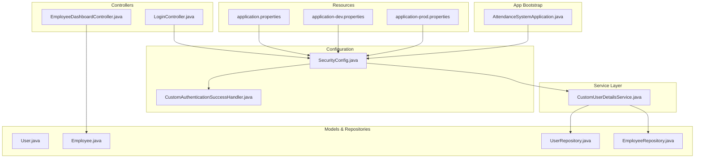
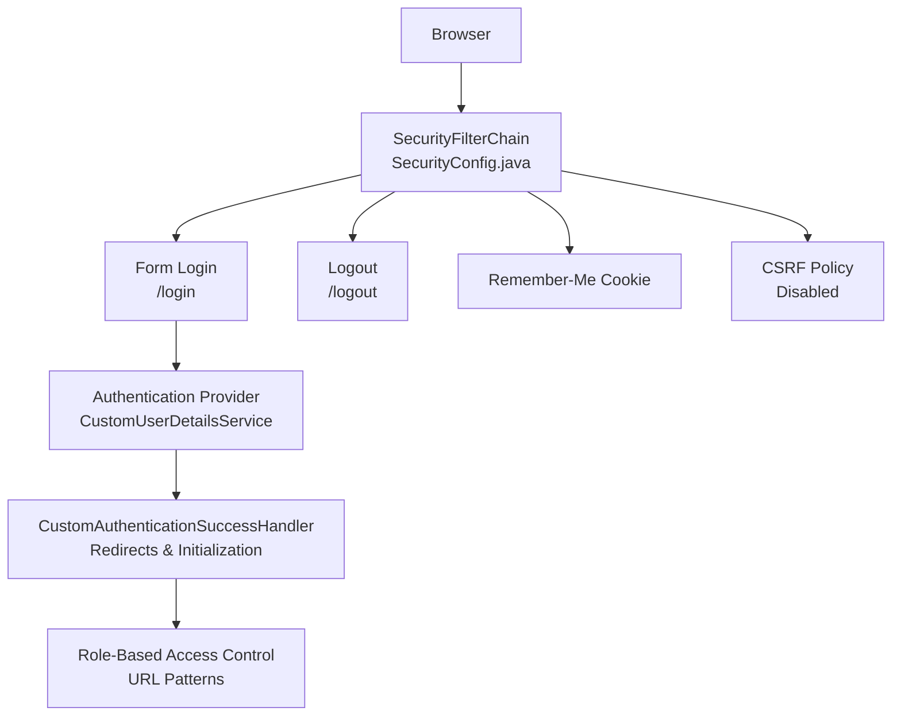
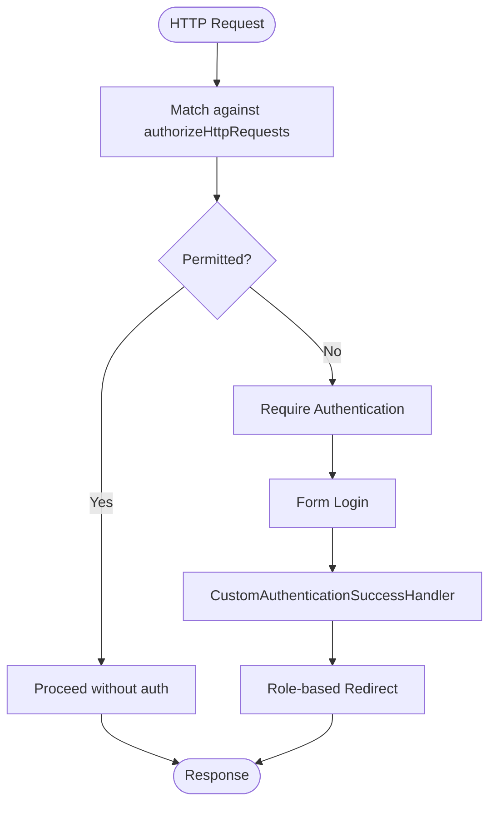
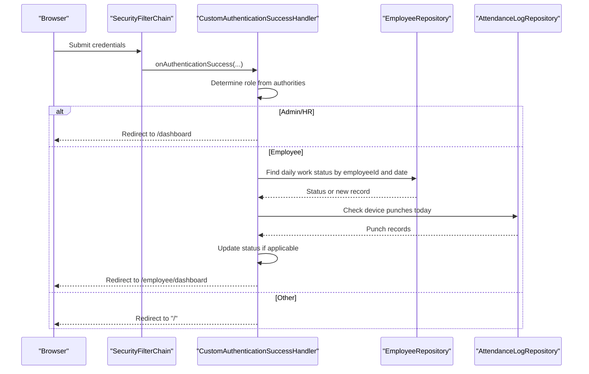
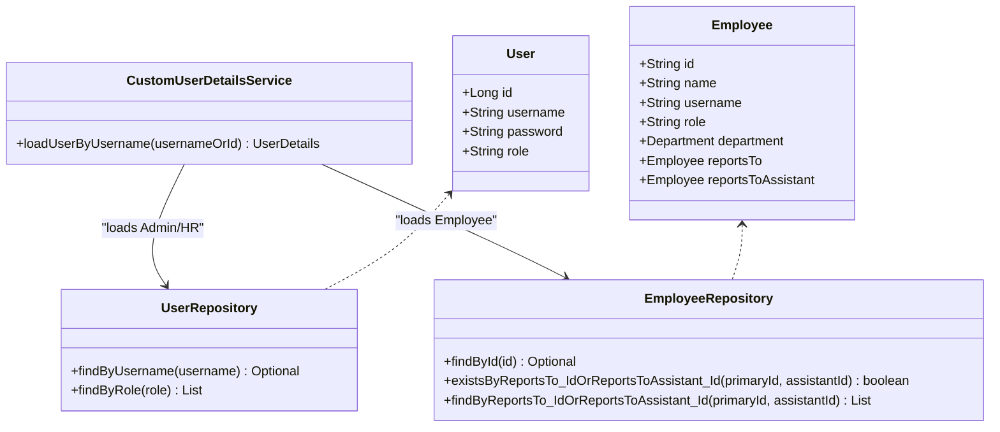
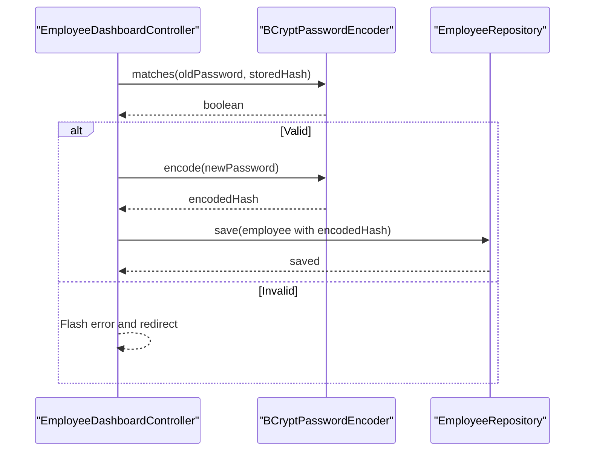
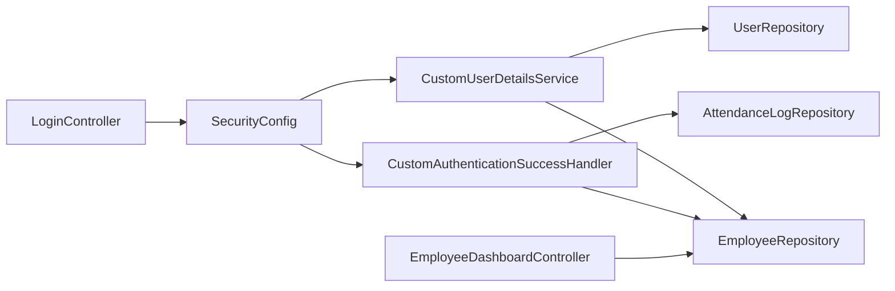

# Security Architecture

<cite>
**Referenced Files in This Document**
- [SecurityConfig.java](file://src/main/java/root/cyb/mh/attendancesystem/config/SecurityConfig.java)
- [CustomAuthenticationSuccessHandler.java](file://src/main/java/root/cyb/mh/attendancesystem/config/CustomAuthenticationSuccessHandler.java)
- [CustomUserDetailsService.java](file://src/main/java/root/cyb/mh/attendancesystem/service/CustomUserDetailsService.java)
- [LoginController.java](file://src/main/java/root/cyb/mh/attendancesystem/controller/LoginController.java)
- [User.java](file://src/main/java/root/cyb/mh/attendancesystem/model/User.java)
- [Employee.java](file://src/main/java/root/cyb/mh/attendancesystem/model/Employee.java)
- [UserRepository.java](file://src/main/java/root/cyb/mh/attendancesystem/repository/UserRepository.java)
- [EmployeeRepository.java](file://src/main/java/root/cyb/mh/attendancesystem/repository/EmployeeRepository.java)
- [application.properties](file://src/main/resources/application.properties)
- [application-dev.properties](file://src/main/resources/application-dev.properties)
- [application-prod.properties](file://src/main/resources/application-prod.properties)
- [AttendanceSystemApplication.java](file://src/main/java/root/cyb/mh/attendancesystem/AttendanceSystemApplication.java)
- [EmployeeDashboardController.java](file://src/main/java/root/cyb/mh/attendancesystem/controller/EmployeeDashboardController.java)
</cite>

## Table of Contents
1. [Introduction](#introduction)
2. [Project Structure](#project-structure)
3. [Core Components](#core-components)
4. [Architecture Overview](#architecture-overview)
5. [Detailed Component Analysis](#detailed-component-analysis)
6. [Dependency Analysis](#dependency-analysis)
7. [Performance Considerations](#performance-considerations)
8. [Troubleshooting Guide](#troubleshooting-guide)
9. [Conclusion](#conclusion)

## Introduction
This document presents the security architecture for the Skylink Attendance System backend. It covers Spring Security configuration, authentication and authorization mechanisms, multi-role support (Admin, HR, Supervisor, Employee, Company), custom authentication success handling, user details service, password hashing with BCrypt, session and remember-me management, CSRF policy, and integration points with external systems. It also outlines best practices and mitigation strategies for common vulnerabilities.

## Project Structure
Security-related components are organized under dedicated packages:
- Configuration: Spring Security setup, custom success handler, and password encoder
- Service: Custom user details service implementing multi-source authentication
- Model and Repository: Domain models and repositories backing authentication and authorization
- Controllers: Login endpoint and employee-specific endpoints for password change
- Resources: Application profiles and property files

**Diagram sources**
- [SecurityConfig.java:18-84](file://src/main/java/root/cyb/mh/attendancesystem/config/SecurityConfig.java#L18-L84)
- [CustomAuthenticationSuccessHandler.java:19-65](file://src/main/java/root/cyb/mh/attendancesystem/config/CustomAuthenticationSuccessHandler.java#L19-L65)
- [CustomUserDetailsService.java:16-53](file://src/main/java/root/cyb/mh/attendancesystem/service/CustomUserDetailsService.java#L16-L53)
- [LoginController.java:7-13](file://src/main/java/root/cyb/mh/attendancesystem/controller/LoginController.java#L7-L13)
- [EmployeeDashboardController.java:397-426](file://src/main/java/root/cyb/mh/attendancesystem/controller/EmployeeDashboardController.java#L397-L426)
- [User.java:9-23](file://src/main/java/root/cyb/mh/attendancesystem/model/User.java#L9-L23)
- [Employee.java:13-41](file://src/main/java/root/cyb/mh/attendancesystem/model/Employee.java#L13-L41)
- [UserRepository.java:7-11](file://src/main/java/root/cyb/mh/attendancesystem/repository/UserRepository.java#L7-L11)
- [EmployeeRepository.java:12-31](file://src/main/java/root/cyb/mh/attendancesystem/repository/EmployeeRepository.java#L12-L31)
- [application.properties:1-1](file://src/main/resources/application.properties#L1-L1)
- [application-dev.properties:1-33](file://src/main/resources/application-dev.properties#L1-L33)
- [application-prod.properties:1-33](file://src/main/resources/application-prod.properties#L1-L33)
- [AttendanceSystemApplication.java:7-15](file://src/main/java/root/cyb/mh/attendancesystem/AttendanceSystemApplication.java#L7-L15)

**Section sources**
- [SecurityConfig.java:1-91](file://src/main/java/root/cyb/mh/attendancesystem/config/SecurityConfig.java#L1-L91)
- [CustomUserDetailsService.java:1-54](file://src/main/java/root/cyb/mh/attendancesystem/service/CustomUserDetailsService.java#L1-L54)
- [CustomAuthenticationSuccessHandler.java:1-66](file://src/main/java/root/cyb/mh/attendancesystem/config/CustomAuthenticationSuccessHandler.java#L1-L66)
- [LoginController.java:1-14](file://src/main/java/root/cyb/mh/attendancesystem/controller/LoginController.java#L1-L14)
- [User.java:1-24](file://src/main/java/root/cyb/mh/attendancesystem/model/User.java#L1-L24)
- [Employee.java:1-64](file://src/main/java/root/cyb/mh/attendancesystem/model/Employee.java#L1-L64)
- [UserRepository.java:1-12](file://src/main/java/root/cyb/mh/attendancesystem/repository/UserRepository.java#L1-L12)
- [EmployeeRepository.java:1-32](file://src/main/java/root/cyb/mh/attendancesystem/repository/EmployeeRepository.java#L1-L32)
- [application.properties:1-1](file://src/main/resources/application.properties#L1-L1)
- [application-dev.properties:1-33](file://src/main/resources/application-dev.properties#L1-L33)
- [application-prod.properties:1-33](file://src/main/resources/application-prod.properties#L1-L33)
- [AttendanceSystemApplication.java:1-16](file://src/main/java/root/cyb/mh/attendancesystem/AttendanceSystemApplication.java#L1-L16)

## Core Components
- Security Filter Chain: Defines URL-level authorization rules, form login, remember-me, logout, and CSRF policy.
- Custom Authentication Success Handler: Redirects users post-login based on roles and performs employee-specific initialization.
- Custom User Details Service: Implements multi-source authentication supporting Admin/HR users and Employee logins.
- Password Encoding: BCrypt encoder configured globally for secure password hashing.
- Session and Profile Configuration: Session timeout and environment-specific properties.

Key implementation references:
- Security filter chain and CSRF policy: [SecurityConfig.java:19-84](file://src/main/java/root/cyb/mh/attendancesystem/config/SecurityConfig.java#L19-L84)
- Custom success handler logic: [CustomAuthenticationSuccessHandler.java:28-64](file://src/main/java/root/cyb/mh/attendancesystem/config/CustomAuthenticationSuccessHandler.java#L28-L64)
- Multi-source user loading: [CustomUserDetailsService.java:25-52](file://src/main/java/root/cyb/mh/attendancesystem/service/CustomUserDetailsService.java#L25-L52)
- BCrypt password encoder bean: [SecurityConfig.java:87-89](file://src/main/java/root/cyb/mh/attendancesystem/config/SecurityConfig.java#L87-L89)
- Login controller: [LoginController.java:9-12](file://src/main/java/root/cyb/mh/attendancesystem/controller/LoginController.java#L9-L12)
- Employee password change flow: [EmployeeDashboardController.java:407-421](file://src/main/java/root/cyb/mh/attendancesystem/controller/EmployeeDashboardController.java#L407-L421)
- Environment profiles: [application.properties:1-1](file://src/main/resources/application.properties#L1-L1), [application-dev.properties:17-17](file://src/main/resources/application-dev.properties#L17-L17), [application-prod.properties:17-17](file://src/main/resources/application-prod.properties#L17-L17)

**Section sources**
- [SecurityConfig.java:18-89](file://src/main/java/root/cyb/mh/attendancesystem/config/SecurityConfig.java#L18-L89)
- [CustomAuthenticationSuccessHandler.java:19-65](file://src/main/java/root/cyb/mh/attendancesystem/config/CustomAuthenticationSuccessHandler.java#L19-L65)
- [CustomUserDetailsService.java:16-53](file://src/main/java/root/cyb/mh/attendancesystem/service/CustomUserDetailsService.java#L16-L53)
- [LoginController.java:7-13](file://src/main/java/root/cyb/mh/attendancesystem/controller/LoginController.java#L7-L13)
- [EmployeeDashboardController.java:397-426](file://src/main/java/root/cyb/mh/attendancesystem/controller/EmployeeDashboardController.java#L397-L426)
- [application.properties:1-1](file://src/main/resources/application.properties#L1-L1)
- [application-dev.properties:17-17](file://src/main/resources/application-dev.properties#L17-L17)
- [application-prod.properties:17-17](file://src/main/resources/application-prod.properties#L17-L17)

## Architecture Overview
The security architecture centers on Spring Security’s declarative web security with a custom filter chain. Authentication is handled via form login, while authorization is enforced per URL pattern and role. The success handler tailors redirects and initializes employee work statuses. Passwords are hashed using BCrypt. CSRF is disabled for the current project context to avoid breaking existing forms, with guidance to enable it in production.

**Diagram sources**
- [SecurityConfig.java:19-84](file://src/main/java/root/cyb/mh/attendancesystem/config/SecurityConfig.java#L19-L84)
- [CustomAuthenticationSuccessHandler.java:28-64](file://src/main/java/root/cyb/mh/attendancesystem/config/CustomAuthenticationSuccessHandler.java#L28-L64)
- [CustomUserDetailsService.java:25-52](file://src/main/java/root/cyb/mh/attendancesystem/service/CustomUserDetailsService.java#L25-L52)

**Section sources**
- [SecurityConfig.java:19-84](file://src/main/java/root/cyb/mh/attendancesystem/config/SecurityConfig.java#L19-L84)
- [CustomAuthenticationSuccessHandler.java:19-65](file://src/main/java/root/cyb/mh/attendancesystem/config/CustomAuthenticationSuccessHandler.java#L19-L65)
- [CustomUserDetailsService.java:16-53](file://src/main/java/root/cyb/mh/attendancesystem/service/CustomUserDetailsService.java#L16-L53)

## Detailed Component Analysis

### Security Filter Chain Configuration
- URL Authorization:
  - Static assets and login/error endpoints are permitted without authentication.
  - Device communication endpoints are permitted for external device integration.
  - Role-based patterns define access to admin, HR, employee, and shared areas.
  - Unmatched requests require authentication.
- Form Login:
  - Login page mapped to a GET endpoint; success handled by a custom handler.
- Remember-Me:
  - Uses a secret key and a 7-day validity window.
- Logout:
  - Defined logout URL and success redirection.
- CSRF:
  - Explicitly disabled in the current configuration to prevent POST failures on legacy forms.

**Diagram sources**
- [SecurityConfig.java:21-49](file://src/main/java/root/cyb/mh/attendancesystem/config/SecurityConfig.java#L21-L49)
- [SecurityConfig.java:50-60](file://src/main/java/root/cyb/mh/attendancesystem/config/SecurityConfig.java#L50-L60)
- [CustomAuthenticationSuccessHandler.java:28-64](file://src/main/java/root/cyb/mh/attendancesystem/config/CustomAuthenticationSuccessHandler.java#L28-L64)

**Section sources**
- [SecurityConfig.java:19-84](file://src/main/java/root/cyb/mh/attendancesystem/config/SecurityConfig.java#L19-L84)

### Custom Authentication Success Handler
Behavior:
- Admin/HR: Redirect to dashboard.
- Employee: Initialize daily work status based on office entry or device punches; redirect to employee dashboard.
- Default: Redirect to home.

Implementation highlights:
- Reads authorities to determine role.
- Uses employee and attendance repositories to update status.
- Performs role-aware redirection.

**Diagram sources**
- [CustomAuthenticationSuccessHandler.java:28-64](file://src/main/java/root/cyb/mh/attendancesystem/config/CustomAuthenticationSuccessHandler.java#L28-L64)
- [EmployeeRepository.java:12-31](file://src/main/java/root/cyb/mh/attendancesystem/repository/EmployeeRepository.java#L12-L31)
- [UserRepository.java:7-11](file://src/main/java/root/cyb/mh/attendancesystem/repository/UserRepository.java#L7-L11)

**Section sources**
- [CustomAuthenticationSuccessHandler.java:19-65](file://src/main/java/root/cyb/mh/attendancesystem/config/CustomAuthenticationSuccessHandler.java#L19-L65)

### Custom User Details Service
Multi-source authentication:
- Admin/HR Users:
  - Loaded by username from the user table.
  - Role is mapped to a granted authority.
- Employees:
  - Loaded by ID from the employee table.
  - Password is stored as a BCrypt-hashed value in the username field.
  - Principal name is the employee ID; role is EMPLOYEE.

**Diagram sources**
- [CustomUserDetailsService.java:16-53](file://src/main/java/root/cyb/mh/attendancesystem/service/CustomUserDetailsService.java#L16-L53)
- [UserRepository.java:7-11](file://src/main/java/root/cyb/mh/attendancesystem/repository/UserRepository.java#L7-L11)
- [EmployeeRepository.java:12-31](file://src/main/java/root/cyb/mh/attendancesystem/repository/EmployeeRepository.java#L12-L31)
- [User.java:9-23](file://src/main/java/root/cyb/mh/attendancesystem/model/User.java#L9-L23)
- [Employee.java:13-41](file://src/main/java/root/cyb/mh/attendancesystem/model/Employee.java#L13-L41)

**Section sources**
- [CustomUserDetailsService.java:16-53](file://src/main/java/root/cyb/mh/attendancesystem/service/CustomUserDetailsService.java#L16-L53)
- [User.java:9-23](file://src/main/java/root/cyb/mh/attendancesystem/model/User.java#L9-L23)
- [Employee.java:13-41](file://src/main/java/root/cyb/mh/attendancesystem/model/Employee.java#L13-L41)
- [UserRepository.java:7-11](file://src/main/java/root/cyb/mh/attendancesystem/repository/UserRepository.java#L7-L11)
- [EmployeeRepository.java:12-31](file://src/main/java/root/cyb/mh/attendancesystem/repository/EmployeeRepository.java#L12-L31)

### Password Encryption with BCrypt
- A BCrypt encoder bean is defined for password hashing.
- Employee password change flow demonstrates encoding and verification:
  - Verification compares the provided old password against the stored hash.
  - New password is encoded before persistence.

**Diagram sources**
- [SecurityConfig.java:87-89](file://src/main/java/root/cyb/mh/attendancesystem/config/SecurityConfig.java#L87-L89)
- [EmployeeDashboardController.java:407-421](file://src/main/java/root/cyb/mh/attendancesystem/controller/EmployeeDashboardController.java#L407-L421)

**Section sources**
- [SecurityConfig.java:87-89](file://src/main/java/root/cyb/mh/attendancesystem/config/SecurityConfig.java#L87-L89)
- [EmployeeDashboardController.java:407-421](file://src/main/java/root/cyb/mh/attendancesystem/controller/EmployeeDashboardController.java#L407-L421)

### Session Management and Profiles
- Session timeout is configured via server servlet session timeout in environment properties.
- Profiles differentiate development and production settings.

References:
- Session timeout property: [application-dev.properties:17-17](file://src/main/resources/application-dev.properties#L17-L17), [application-prod.properties:17-17](file://src/main/resources/application-prod.properties#L17-L17)
- Active profile selection: [application.properties:1-1](file://src/main/resources/application.properties#L1-L1)

**Section sources**
- [application-dev.properties:17-17](file://src/main/resources/application-dev.properties#L17-L17)
- [application-prod.properties:17-17](file://src/main/resources/application-prod.properties#L17-L17)
- [application.properties:1-1](file://src/main/resources/application.properties#L1-L1)

### CSRF Protection
- CSRF is currently disabled in the security filter chain.
- Guidance is included to consider enabling CSRF in production to mitigate cross-site request forgery risks.

Reference:
- CSRF disablement: [SecurityConfig.java:61-81](file://src/main/java/root/cyb/mh/attendancesystem/config/SecurityConfig.java#L61-L81)

**Section sources**
- [SecurityConfig.java:61-81](file://src/main/java/root/cyb/mh/attendancesystem/config/SecurityConfig.java#L61-L81)

### CORS Configuration
- No explicit CORS configuration is present in the provided security configuration.
- If needed, CORS should be configured centrally to allow trusted origins and methods for frontend-backend integration.

Note: This is a general recommendation based on typical Spring Security setups when integrating with browsers.

[No sources needed since this section does not analyze specific files]

### Integration with External Authentication Systems
- Device Communication:
  - Device endpoints are permitted to allow external device integration.
- Employee Credentials:
  - Employee login uses ID as principal and a hashed value in the username field as the password.

References:
- Device permit pattern: [SecurityConfig.java:25-25](file://src/main/java/root/cyb/mh/attendancesystem/config/SecurityConfig.java#L25-L25)
- Employee principal and password mapping: [CustomUserDetailsService.java:45-48](file://src/main/java/root/cyb/mh/attendancesystem/service/CustomUserDetailsService.java#L45-L48)

**Section sources**
- [SecurityConfig.java:25-25](file://src/main/java/root/cyb/mh/attendancesystem/config/SecurityConfig.java#L25-L25)
- [CustomUserDetailsService.java:45-48](file://src/main/java/root/cyb/mh/attendancesystem/service/CustomUserDetailsService.java#L45-L48)

## Dependency Analysis
The security layer depends on:
- Spring Security for filter chain, form login, remember-me, and logout.
- Custom success handler for role-aware post-authentication actions.
- Custom user details service for multi-source authentication.
- Repositories for user and employee lookups and employee status updates.

**Diagram sources**
- [SecurityConfig.java:15-16](file://src/main/java/root/cyb/mh/attendancesystem/config/SecurityConfig.java#L15-L16)
- [CustomAuthenticationSuccessHandler.java:21-25](file://src/main/java/root/cyb/mh/attendancesystem/config/CustomAuthenticationSuccessHandler.java#L21-L25)
- [CustomUserDetailsService.java:18-22](file://src/main/java/root/cyb/mh/attendancesystem/service/CustomUserDetailsService.java#L18-L22)
- [LoginController.java:9-12](file://src/main/java/root/cyb/mh/attendancesystem/controller/LoginController.java#L9-L12)
- [EmployeeDashboardController.java:397-426](file://src/main/java/root/cyb/mh/attendancesystem/controller/EmployeeDashboardController.java#L397-L426)

**Section sources**
- [SecurityConfig.java:15-16](file://src/main/java/root/cyb/mh/attendancesystem/config/SecurityConfig.java#L15-L16)
- [CustomAuthenticationSuccessHandler.java:21-25](file://src/main/java/root/cyb/mh/attendancesystem/config/CustomAuthenticationSuccessHandler.java#L21-L25)
- [CustomUserDetailsService.java:18-22](file://src/main/java/root/cyb/mh/attendancesystem/service/CustomUserDetailsService.java#L18-L22)
- [LoginController.java:9-12](file://src/main/java/root/cyb/mh/attendancesystem/controller/LoginController.java#L9-L12)
- [EmployeeDashboardController.java:397-426](file://src/main/java/root/cyb/mh/attendancesystem/controller/EmployeeDashboardController.java#L397-L426)

## Performance Considerations
- Minimize database queries in the success handler by batching or caching frequently accessed data.
- Ensure repository queries for employee status and attendance logs are indexed appropriately.
- Keep CSRF disabled only temporarily; enable it with proper token handling to avoid unnecessary overhead.

[No sources needed since this section provides general guidance]

## Troubleshooting Guide
Common issues and resolutions:
- 403 Forbidden on POST:
  - Symptom: POST requests fail after form submission.
  - Cause: CSRF disabled; ensure forms include CSRF tokens or enable CSRF.
  - Reference: [SecurityConfig.java:61-81](file://src/main/java/root/cyb/mh/attendancesystem/config/SecurityConfig.java#L61-L81)
- Incorrect Login Credentials:
  - Symptom: Authentication fails for Admin/HR or Employee.
  - Cause: Incorrect username/password mapping or missing employee login configuration.
  - References: [CustomUserDetailsService.java:25-52](file://src/main/java/root/cyb/mh/attendancesystem/service/CustomUserDetailsService.java#L25-L52), [User.java:15-22](file://src/main/java/root/cyb/mh/attendancesystem/model/User.java#L15-L22), [Employee.java:35-41](file://src/main/java/root/cyb/mh/attendancesystem/model/Employee.java#L35-L41)
- Employee Redirect Loop or Missing Dashboard:
  - Symptom: Employee redirected but dashboard not accessible.
  - Cause: Missing role mapping or unauthorized URL pattern.
  - References: [SecurityConfig.java:42-42](file://src/main/java/root/cyb/mh/attendancesystem/config/SecurityConfig.java#L42-L42), [CustomAuthenticationSuccessHandler.java:34-60](file://src/main/java/root/cyb/mh/attendancesystem/config/CustomAuthenticationSuccessHandler.java#L34-L60)
- Password Change Failure:
  - Symptom: Old password mismatch or new password not saved.
  - Cause: Hash verification failure or encoding not applied.
  - Reference: [EmployeeDashboardController.java:407-421](file://src/main/java/root/cyb/mh/attendancesystem/controller/EmployeeDashboardController.java#L407-L421)

**Section sources**
- [SecurityConfig.java:61-81](file://src/main/java/root/cyb/mh/attendancesystem/config/SecurityConfig.java#L61-L81)
- [CustomUserDetailsService.java:25-52](file://src/main/java/root/cyb/mh/attendancesystem/service/CustomUserDetailsService.java#L25-L52)
- [User.java:15-22](file://src/main/java/root/cyb/mh/attendancesystem/model/User.java#L15-L22)
- [Employee.java:35-41](file://src/main/java/root/cyb/mh/attendancesystem/model/Employee.java#L35-L41)
- [CustomAuthenticationSuccessHandler.java:34-60](file://src/main/java/root/cyb/mh/attendancesystem/config/CustomAuthenticationSuccessHandler.java#L34-L60)
- [EmployeeDashboardController.java:407-421](file://src/main/java/root/cyb/mh/attendancesystem/controller/EmployeeDashboardController.java#L407-L421)

## Conclusion
The Skylink Attendance System employs a pragmatic yet robust Spring Security configuration tailored to its operational needs. It supports multi-role authentication, custom success handling, and BCrypt-based password hashing. While CSRF is currently disabled to maintain compatibility with existing forms, enabling it in production is strongly recommended. Session timeouts are profile-driven, and the architecture cleanly separates concerns across configuration, services, and repositories. Adopting the best practices outlined here will further strengthen the system against common security threats.