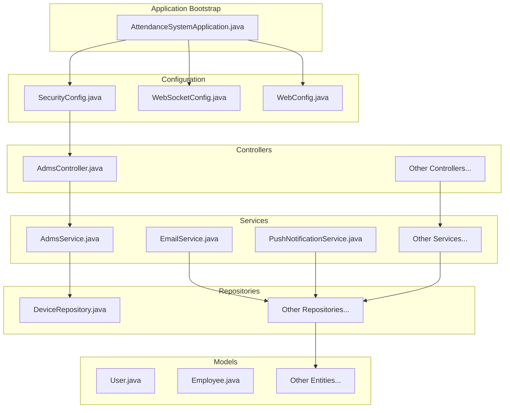
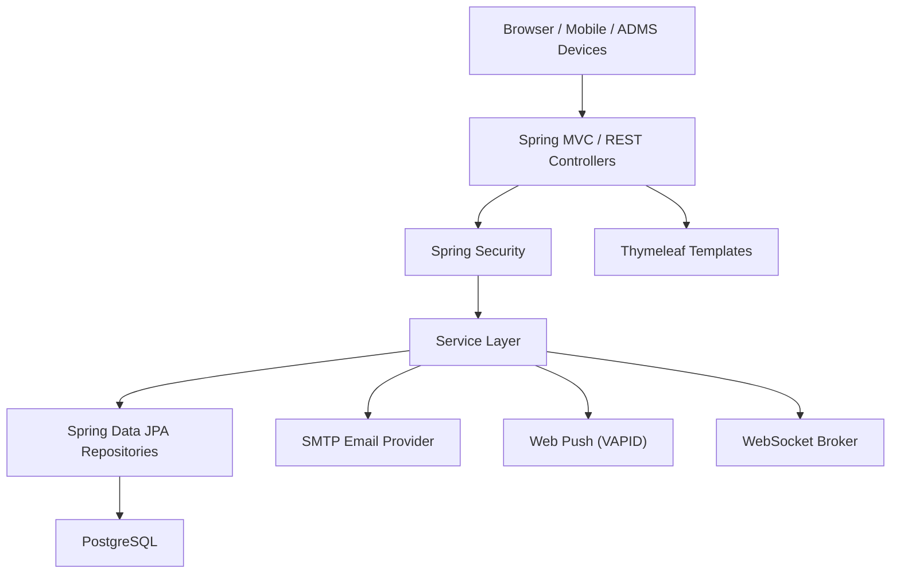
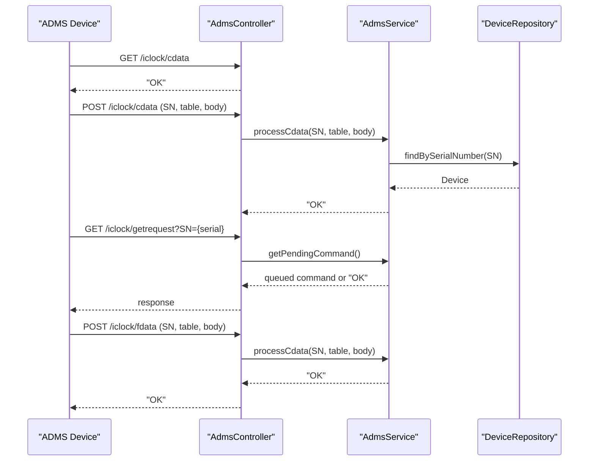
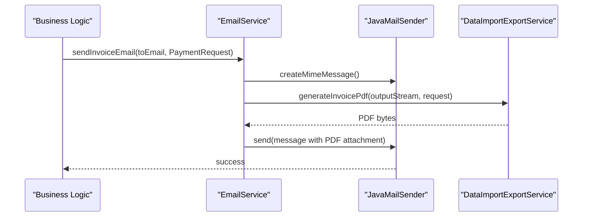
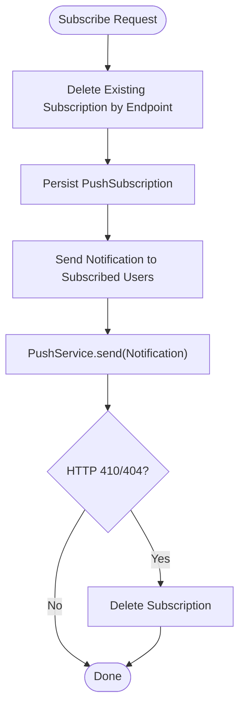
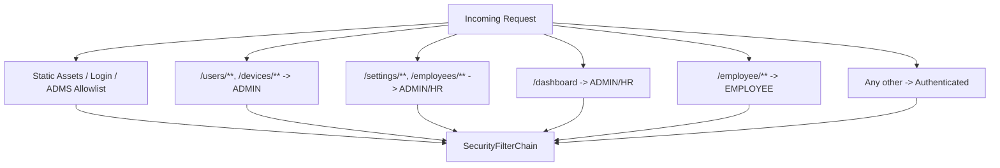
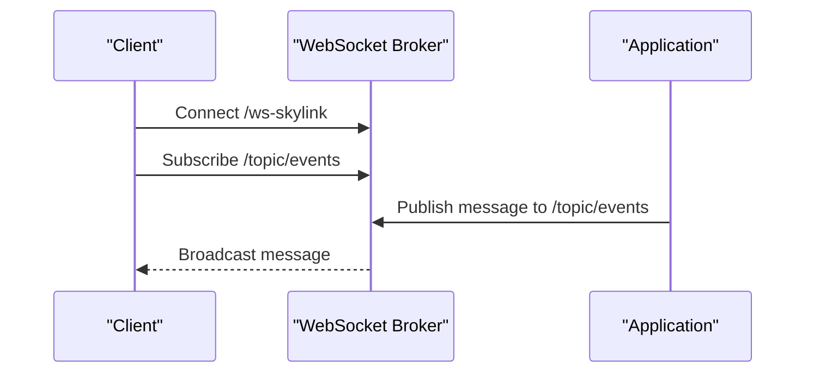
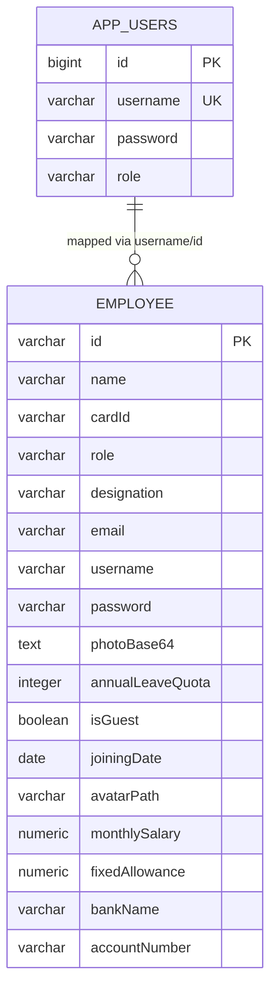
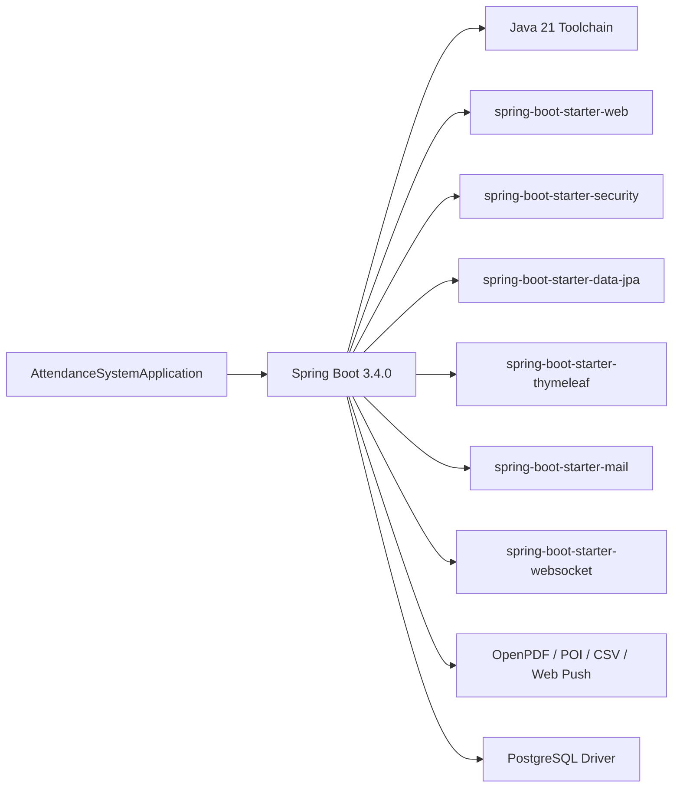

# System Overview

<cite>
**Referenced Files in This Document**
- [AttendanceSystemApplication.java](file://src/main/java/root/cyb/mh/attendancesystem/AttendanceSystemApplication.java)
- [build.gradle](file://build.gradle)
- [settings.gradle](file://settings.gradle)
- [README.md](file://README.md)
- [application.properties](file://src/main/resources/application.properties)
- [SecurityConfig.java](file://src/main/java/root/cyb/mh/attendancesystem/config/SecurityConfig.java)
- [WebSocketConfig.java](file://src/main/java/root/cyb/mh/attendancesystem/config/WebSocketConfig.java)
- [WebConfig.java](file://src/main/java/root/cyb/mh/attendancesystem/config/WebConfig.java)
- [AdmsController.java](file://src/main/java/root/cyb/mh/attendancesystem/controller/AdmsController.java)
- [AdmsService.java](file://src/main/java/root/cyb/mh/attendancesystem/service/AdmsService.java)
- [EmailService.java](file://src/main/java/root/cyb/mh/attendancesystem/service/EmailService.java)
- [PushNotificationService.java](file://src/main/java/root/cyb/mh/attendancesystem/service/PushNotificationService.java)
- [DeviceRepository.java](file://src/main/java/root/cyb/mh/attendancesystem/repository/DeviceRepository.java)
- [User.java](file://src/main/java/root/cyb/mh/attendancesystem/model/User.java)
- [Employee.java](file://src/main/java/root/cyb/mh/attendancesystem/model/Employee.java)
</cite>

## Table of Contents
1. [Introduction](#introduction)
2. [Project Structure](#project-structure)
3. [Core Components](#core-components)
4. [Architecture Overview](#architecture-overview)
5. [Detailed Component Analysis](#detailed-component-analysis)
6. [Dependency Analysis](#dependency-analysis)
7. [Performance Considerations](#performance-considerations)
8. [Troubleshooting Guide](#troubleshooting-guide)
9. [Conclusion](#conclusion)

## Introduction
This document provides a comprehensive system overview of the Skylink Custom Backend, a Spring Boot 3.4.0 application built with Java 21. It explains the monolithic architecture, technology stack, high-level design principles, component relationships, system boundaries, deployment topology, and integration points with external systems such as ADMS devices and email providers. It also outlines architectural decisions, scalability considerations, and operational guidance.

## Project Structure
The backend follows a layered, monolithic Spring Boot structure organized by concerns:
- Entry point and application bootstrap
- Configuration (security, web, WebSocket, time zone)
- Controllers (REST and MVC)
- Services (business logic)
- Repositories (data access via Spring Data JPA)
- Models (JPA entities)
- DTOs (data transfer objects)
- Resources (templates, static assets, configuration)

**Diagram sources**
- [AttendanceSystemApplication.java:1-16](file://src/main/java/root/cyb/mh/attendancesystem/AttendanceSystemApplication.java#L1-L16)
- [SecurityConfig.java:1-91](file://src/main/java/root/cyb/mh/attendancesystem/config/SecurityConfig.java#L1-L91)
- [WebSocketConfig.java:1-26](file://src/main/java/root/cyb/mh/attendancesystem/config/WebSocketConfig.java#L1-L26)
- [WebConfig.java:1-18](file://src/main/java/root/cyb/mh/attendancesystem/config/WebConfig.java#L1-L18)
- [AdmsController.java:1-65](file://src/main/java/root/cyb/mh/attendancesystem/controller/AdmsController.java#L1-L65)
- [AdmsService.java:1-263](file://src/main/java/root/cyb/mh/attendancesystem/service/AdmsService.java#L1-L263)
- [EmailService.java:1-120](file://src/main/java/root/cyb/mh/attendancesystem/service/EmailService.java#L1-L120)
- [PushNotificationService.java:1-111](file://src/main/java/root/cyb/mh/attendancesystem/service/PushNotificationService.java#L1-L111)
- [DeviceRepository.java:1-11](file://src/main/java/root/cyb/mh/attendancesystem/repository/DeviceRepository.java#L1-L11)
- [User.java:1-24](file://src/main/java/root/cyb/mh/attendancesystem/model/User.java#L1-L24)
- [Employee.java:1-64](file://src/main/java/root/cyb/mh/attendancesystem/model/Employee.java#L1-L64)

**Section sources**
- [README.md:81-88](file://README.md#L81-L88)
- [build.gradle:1-60](file://build.gradle#L1-L60)
- [settings.gradle:1-2](file://settings.gradle#L1-L2)

## Core Components
- Application entry point and scheduling enablement
- Security configuration with role-based access control and custom authentication success handling
- WebSocket configuration for real-time event delivery
- Web MVC configuration for serving static uploads
- Controllers for REST endpoints and device integration
- Services for device data ingestion, email dispatch, and push notifications
- Repositories for persistence and device lookup
- Models for users, employees, and related domain entities

Key implementation patterns:
- Monolithic architecture with clear separation of concerns across layers
- Spring Data JPA for ORM and repositories
- Thymeleaf for server-rendered templates
- Spring Security 6 for authentication and authorization
- Spring Mail for SMTP-based email sending
- Web Push (VAPID) for browser notifications
- PostgreSQL as primary RDBMS with H2 for development/testing

**Section sources**
- [AttendanceSystemApplication.java:1-16](file://src/main/java/root/cyb/mh/attendancesystem/AttendanceSystemApplication.java#L1-L16)
- [SecurityConfig.java:1-91](file://src/main/java/root/cyb/mh/attendancesystem/config/SecurityConfig.java#L1-L91)
- [WebSocketConfig.java:1-26](file://src/main/java/root/cyb/mh/attendancesystem/config/WebSocketConfig.java#L1-L26)
- [WebConfig.java:1-18](file://src/main/java/root/cyb/mh/attendancesystem/config/WebConfig.java#L1-L18)
- [build.gradle:34-55](file://build.gradle#L34-L55)

## Architecture Overview
The system is a monolithic Spring Boot application with:
- A single deployable artifact containing all layers
- REST controllers for internal and external APIs
- Device integration endpoints for ADMS devices
- Real-time communication via WebSocket
- Email and push notification channels
- Centralized security and CORS/CSRF policies
- JPA/Hibernate for persistence and PostgreSQL as the primary database

**Diagram sources**
- [SecurityConfig.java:18-84](file://src/main/java/root/cyb/mh/attendancesystem/config/SecurityConfig.java#L18-L84)
- [WebSocketConfig.java:14-24](file://src/main/java/root/cyb/mh/attendancesystem/config/WebSocketConfig.java#L14-L24)
- [EmailService.java:19-37](file://src/main/java/root/cyb/mh/attendancesystem/service/EmailService.java#L19-L37)
- [PushNotificationService.java:35-46](file://src/main/java/root/cyb/mh/attendancesystem/service/PushNotificationService.java#L35-L46)
- [build.gradle:35-44](file://build.gradle#L35-L44)

## Detailed Component Analysis

### Device Integration (ADMS) Component
The ADMS integration exposes endpoints for device handshakes, data pushes, command queries, and command result acknowledgments. The service parses device-specific formats, persists attendance logs, and updates daily work statuses.

**Diagram sources**
- [AdmsController.java:15-63](file://src/main/java/root/cyb/mh/attendancesystem/controller/AdmsController.java#L15-L63)
- [AdmsService.java:42-89](file://src/main/java/root/cyb/mh/attendancesystem/service/AdmsService.java#L42-L89)
- [DeviceRepository.java:9](file://src/main/java/root/cyb/mh/attendancesystem/repository/DeviceRepository.java#L9)

**Section sources**
- [AdmsController.java:1-65](file://src/main/java/root/cyb/mh/attendancesystem/controller/AdmsController.java#L1-L65)
- [AdmsService.java:1-263](file://src/main/java/root/cyb/mh/attendancesystem/service/AdmsService.java#L1-L263)
- [DeviceRepository.java:1-11](file://src/main/java/root/cyb/mh/attendancesystem/repository/DeviceRepository.java#L1-L11)

### Email Delivery Component
The email service supports company-specific SMTP configurations and generates PDF attachments for invoices. It integrates with the data export service to produce PDFs and attaches payment proofs when available.

**Diagram sources**
- [EmailService.java:25-103](file://src/main/java/root/cyb/mh/attendancesystem/service/EmailService.java#L25-L103)

**Section sources**
- [EmailService.java:1-120](file://src/main/java/root/cyb/mh/attendancesystem/service/EmailService.java#L1-L120)

### Push Notification Component
The push notification service initializes a Web Push client with VAPID keys, manages subscriptions, and sends notifications to subscribed endpoints. It handles endpoint deactivations (e.g., 410/404) by removing stale subscriptions.

**Diagram sources**
- [PushNotificationService.java:52-109](file://src/main/java/root/cyb/mh/attendancesystem/service/PushNotificationService.java#L52-L109)

**Section sources**
- [PushNotificationService.java:1-111](file://src/main/java/root/cyb/mh/attendancesystem/service/PushNotificationService.java#L1-L111)

### Security and Access Control
Security is configured centrally with role-based authorization, custom authentication success handling, remember-me, and CSRF disabled for simplicity. Endpoints are mapped to roles such as ADMIN, HR, EMPLOYEE, and COMPANY.

**Diagram sources**
- [SecurityConfig.java:18-84](file://src/main/java/root/cyb/mh/attendancesystem/config/SecurityConfig.java#L18-L84)

**Section sources**
- [SecurityConfig.java:1-91](file://src/main/java/root/cyb/mh/attendancesystem/config/SecurityConfig.java#L1-L91)

### Real-Time Events via WebSocket
WebSocket endpoints are exposed for real-time updates. The broker supports topics, queues, and user-specific destinations.

**Diagram sources**
- [WebSocketConfig.java:14-24](file://src/main/java/root/cyb/mh/attendancesystem/config/WebSocketConfig.java#L14-L24)

**Section sources**
- [WebSocketConfig.java:1-26](file://src/main/java/root/cyb/mh/attendancesystem/config/WebSocketConfig.java#L1-L26)

### Data Model Overview
Core entities include users, employees, and related domain objects. Users represent application identities with roles; employees map to device identifiers and payroll attributes.

**Diagram sources**
- [User.java:8-23](file://src/main/java/root/cyb/mh/attendancesystem/model/User.java#L8-L23)
- [Employee.java:15-62](file://src/main/java/root/cyb/mh/attendancesystem/model/Employee.java#L15-L62)

**Section sources**
- [User.java:1-24](file://src/main/java/root/cyb/mh/attendancesystem/model/User.java#L1-L24)
- [Employee.java:1-64](file://src/main/java/root/cyb/mh/attendancesystem/model/Employee.java#L1-L64)

## Dependency Analysis
The application leverages Spring Boot 3.4.0 with Java 21 toolchain and PostgreSQL. Dependencies include Spring Web, Security, Data JPA, Thymeleaf, Mail, WebSocket, OpenPDF, Apache POI, Commons CSV, and Web Push libraries.

**Diagram sources**
- [build.gradle:3-19](file://build.gradle#L3-L19)
- [build.gradle:34-55](file://build.gradle#L34-L55)

**Section sources**
- [build.gradle:1-60](file://build.gradle#L1-L60)
- [settings.gradle:1-2](file://settings.gradle#L1-L2)

## Performance Considerations
- Database tuning: Use connection pooling, optimize indexes on frequently queried columns (e.g., timestamps, employee IDs), and leverage batch writes for device data ingestion.
- Caching: Introduce regional caching for master data and reduce repeated device lookups.
- Asynchronous processing: Offload heavy tasks (PDF generation, email sending) to async executors or message queues.
- Pagination and projections: Apply pagination and DTO projections for large datasets in reporting endpoints.
- WebSocket scaling: Use a clustered broker or external message bus for horizontal scaling.
- Static assets: Serve static uploads via CDN or reverse proxy for reduced load.

## Troubleshooting Guide
Common areas to inspect:
- Authentication and authorization: Verify role mappings and custom success handlers.
- Device integration: Confirm endpoint exposure, device registration, and data parsing logic.
- Email delivery: Validate SMTP host/port/credentials and PDF generation pipeline.
- Push notifications: Ensure VAPID keys are configured and subscriptions are cleaned up on 410/404 responses.
- Uploads: Confirm resource handler paths and file permissions for uploaded content.

**Section sources**
- [SecurityConfig.java:18-84](file://src/main/java/root/cyb/mh/attendancesystem/config/SecurityConfig.java#L18-L84)
- [AdmsService.java:42-89](file://src/main/java/root/cyb/mh/attendancesystem/service/AdmsService.java#L42-L89)
- [EmailService.java:25-103](file://src/main/java/root/cyb/mh/attendancesystem/service/EmailService.java#L25-L103)
- [PushNotificationService.java:78-109](file://src/main/java/root/cyb/mh/attendancesystem/service/PushNotificationService.java#L78-L109)
- [WebConfig.java:11-16](file://src/main/java/root/cyb/mh/attendancesystem/config/WebConfig.java#L11-L16)

## Conclusion
The Skylink Custom Backend is a cohesive, monolithic Spring Boot application tailored for HR and attendance management. It integrates seamlessly with ADMS devices, supports real-time communication via WebSocket, and provides robust email and push notification capabilities. The architecture prioritizes simplicity and maintainability while offering clear extension points for future enhancements such as asynchronous processing, caching, and horizontal scaling.