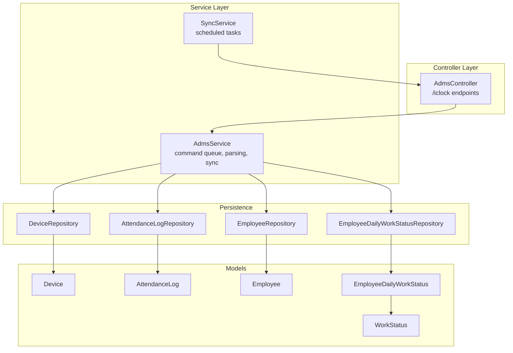
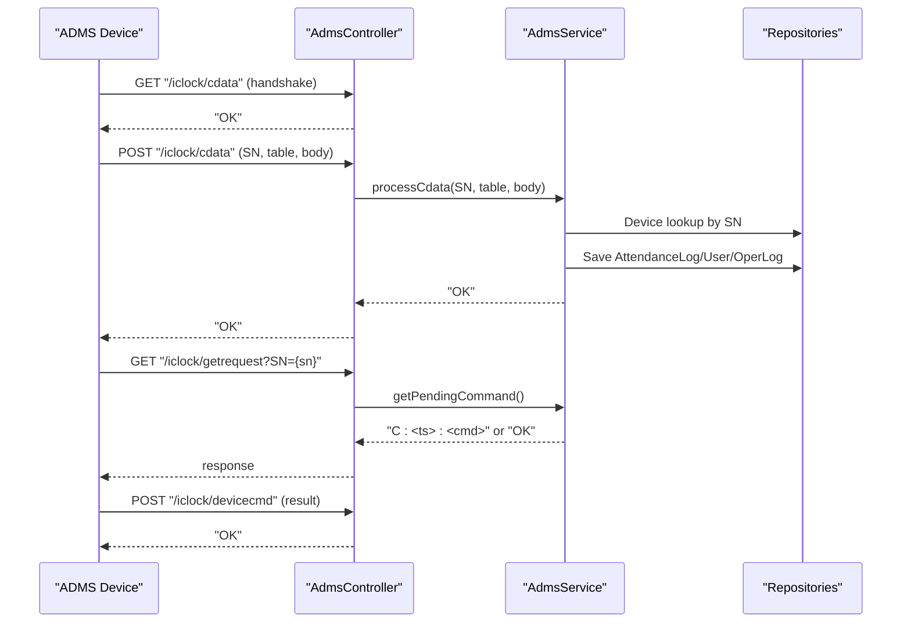
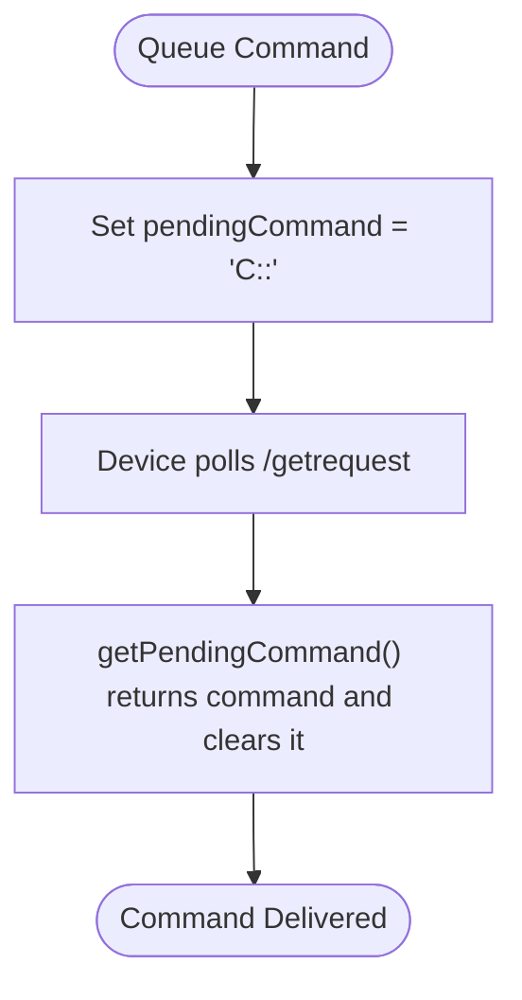
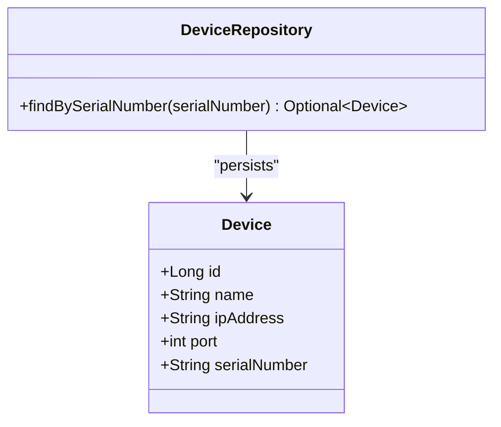
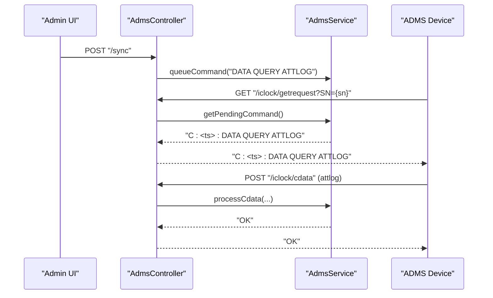
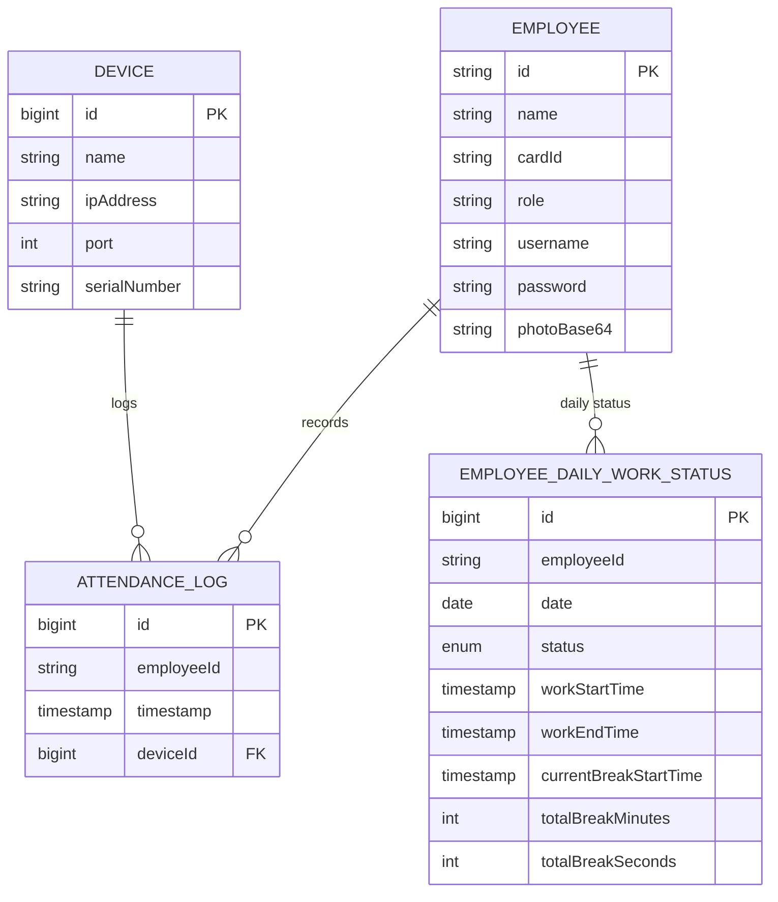
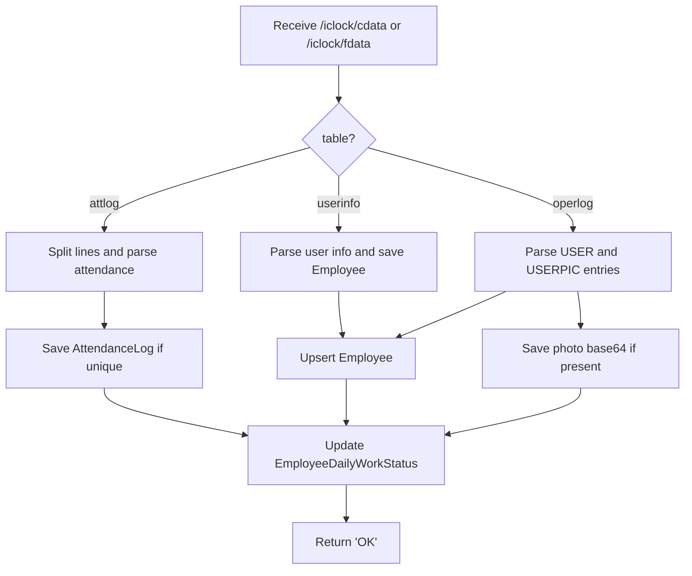
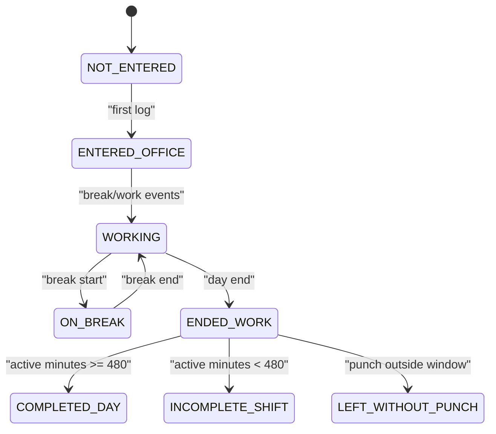
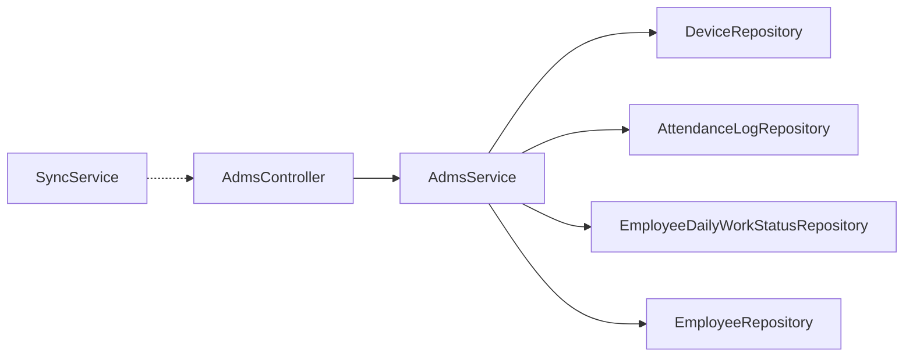

# ADMS Device Integration

<cite>
**Referenced Files in This Document**
- [AdmsController.java](file://src/main/java/root/cyb/mh/attendancesystem/controller/AdmsController.java)
- [AdmsService.java](file://src/main/java/root/cyb/mh/attendancesystem/service/AdmsService.java)
- [SyncService.java](file://src/main/java/root/cyb/mh/attendancesystem/service/SyncService.java)
- [Device.java](file://src/main/java/root/cyb/mh/attendancesystem/model/Device.java)
- [DeviceRepository.java](file://src/main/java/root/cyb/mh/attendancesystem/repository/DeviceRepository.java)
- [AttendanceLog.java](file://src/main/java/root/cyb/mh/attendancesystem/model/AttendanceLog.java)
- [AttendanceLogRepository.java](file://src/main/java/root/cyb/mh/attendancesystem/repository/AttendanceLogRepository.java)
- [Employee.java](file://src/main/java/root/cyb/mh/attendancesystem/model/Employee.java)
- [EmployeeRepository.java](file://src/main/java/root/cyb/mh/attendancesystem/repository/EmployeeRepository.java)
- [EmployeeDailyWorkStatus.java](file://src/main/java/root/cyb/mh/attendancesystem/model/EmployeeDailyWorkStatus.java)
- [EmployeeDailyWorkStatusRepository.java](file://src/main/java/root/cyb/mh/attendancesystem/repository/EmployeeDailyWorkStatusRepository.java)
- [WorkStatus.java](file://src/main/java/root/cyb/mh/attendancesystem/model/WorkStatus.java)
- [application.properties](file://src/main/resources/application.properties)
</cite>

## Table of Contents
1. [Introduction](#introduction)
2. [Project Structure](#project-structure)
3. [Core Components](#core-components)
4. [Architecture Overview](#architecture-overview)
5. [Detailed Component Analysis](#detailed-component-analysis)
6. [Dependency Analysis](#dependency-analysis)
7. [Performance Considerations](#performance-considerations)
8. [Troubleshooting Guide](#troubleshooting-guide)
9. [Conclusion](#conclusion)
10. [Appendices](#appendices)

## Introduction
This document describes the ADMS device integration system that enables two-way communication with physical attendance devices. It covers the communication protocol endpoints, command queuing mechanism, device status monitoring, and data synchronization processes. It also documents the Device entity model, ADMS command structure (DATA QUERY ATTLOG, DATA QUERY USERINFO), and batch processing workflows. Practical examples illustrate device configuration, command execution, error handling, and troubleshooting common connectivity issues. The integration architecture emphasizes a push-based pattern where devices push data to the backend, while the backend can queue commands for the devices to pull.

## Project Structure
The ADMS integration spans controllers, services, models, repositories, and configuration. The primary HTTP endpoints are under /iclock, and the system relies on Spring Data JPA for persistence and scheduling for periodic tasks.

**Diagram sources**
- [AdmsController.java:1-65](file://src/main/java/root/cyb/mh/attendancesystem/controller/AdmsController.java#L1-L65)
- [AdmsService.java:1-263](file://src/main/java/root/cyb/mh/attendancesystem/service/AdmsService.java#L1-L263)
- [SyncService.java:1-21](file://src/main/java/root/cyb/mh/attendancesystem/service/SyncService.java#L1-L21)
- [DeviceRepository.java:1-11](file://src/main/java/root/cyb/mh/attendancesystem/repository/DeviceRepository.java#L1-L11)
- [AttendanceLogRepository.java:1-22](file://src/main/java/root/cyb/mh/attendancesystem/repository/AttendanceLogRepository.java#L1-L22)
- [EmployeeDailyWorkStatusRepository.java:1-21](file://src/main/java/root/cyb/mh/attendancesystem/repository/EmployeeDailyWorkStatusRepository.java#L1-L21)
- [EmployeeRepository.java:1-32](file://src/main/java/root/cyb/mh/attendancesystem/repository/EmployeeRepository.java#L1-L32)
- [Device.java:1-26](file://src/main/java/root/cyb/mh/attendancesystem/model/Device.java#L1-L26)
- [AttendanceLog.java:1-27](file://src/main/java/root/cyb/mh/attendancesystem/model/AttendanceLog.java#L1-L27)
- [Employee.java:1-64](file://src/main/java/root/cyb/mh/attendancesystem/model/Employee.java#L1-L64)
- [EmployeeDailyWorkStatus.java:1-45](file://src/main/java/root/cyb/mh/attendancesystem/model/EmployeeDailyWorkStatus.java#L1-L45)
- [WorkStatus.java:1-14](file://src/main/java/root/cyb/mh/attendancesystem/model/WorkStatus.java#L1-L14)

**Section sources**
- [AdmsController.java:1-65](file://src/main/java/root/cyb/mh/attendancesystem/controller/AdmsController.java#L1-L65)
- [AdmsService.java:1-263](file://src/main/java/root/cyb/mh/attendancesystem/service/AdmsService.java#L1-L263)
- [SyncService.java:1-21](file://src/main/java/root/cyb/mh/attendancesystem/service/SyncService.java#L1-L21)
- [Device.java:1-26](file://src/main/java/root/cyb/mh/attendancesystem/model/Device.java#L1-L26)
- [DeviceRepository.java:1-11](file://src/main/java/root/cyb/mh/attendancesystem/repository/DeviceRepository.java#L1-L11)
- [AttendanceLog.java:1-27](file://src/main/java/root/cyb/mh/attendancesystem/model/AttendanceLog.java#L1-L27)
- [AttendanceLogRepository.java:1-22](file://src/main/java/root/cyb/mh/attendancesystem/repository/AttendanceLogRepository.java#L1-L22)
- [Employee.java:1-64](file://src/main/java/root/cyb/mh/attendancesystem/model/Employee.java#L1-L64)
- [EmployeeRepository.java:1-32](file://src/main/java/root/cyb/mh/attendancesystem/repository/EmployeeRepository.java#L1-L32)
- [EmployeeDailyWorkStatus.java:1-45](file://src/main/java/root/cyb/mh/attendancesystem/model/EmployeeDailyWorkStatus.java#L1-L45)
- [EmployeeDailyWorkStatusRepository.java:1-21](file://src/main/java/root/cyb/mh/attendancesystem/repository/EmployeeDailyWorkStatusRepository.java#L1-L21)
- [WorkStatus.java:1-14](file://src/main/java/root/cyb/mh/attendancesystem/model/WorkStatus.java#L1-L14)
- [application.properties:1-1](file://src/main/resources/application.properties#L1-L1)

## Core Components
- AdmsController: Exposes /iclock endpoints for device handshakes, data push, command requests, registry checks, and command result acknowledgments.
- AdmsService: Implements command queuing, parsing of attlog, userinfo, and operlog tables, deduplication via existence checks, and daily work status updates.
- SyncService: Provides scheduled tasks; current implementation notes that push-based data ingestion is preferred.
- Device model and repository: Persist device metadata (name, IP, port, serial number) and support lookup by serial number.
- AttendanceLog model and repository: Persist individual attendance records with uniqueness constraints per employee, timestamp, and device.
- Employee model and repository: Store employee identity, roles, and associated metadata; used during user provisioning from device data.
- EmployeeDailyWorkStatus model and repository: Track daily work state transitions and aggregate metrics for day completion logic.
- WorkStatus enum: Defines the state machine for daily work status.

**Section sources**
- [AdmsController.java:1-65](file://src/main/java/root/cyb/mh/attendancesystem/controller/AdmsController.java#L1-L65)
- [AdmsService.java:1-263](file://src/main/java/root/cyb/mh/attendancesystem/service/AdmsService.java#L1-L263)
- [SyncService.java:1-21](file://src/main/java/root/cyb/mh/attendancesystem/service/SyncService.java#L1-L21)
- [Device.java:1-26](file://src/main/java/root/cyb/mh/attendancesystem/model/Device.java#L1-L26)
- [DeviceRepository.java:1-11](file://src/main/java/root/cyb/mh/attendancesystem/repository/DeviceRepository.java#L1-L11)
- [AttendanceLog.java:1-27](file://src/main/java/root/cyb/mh/attendancesystem/model/AttendanceLog.java#L1-L27)
- [AttendanceLogRepository.java:1-22](file://src/main/java/root/cyb/mh/attendancesystem/repository/AttendanceLogRepository.java#L1-L22)
- [Employee.java:1-64](file://src/main/java/root/cyb/mh/attendancesystem/model/Employee.java#L1-L64)
- [EmployeeRepository.java:1-32](file://src/main/java/root/cyb/mh/attendancesystem/repository/EmployeeRepository.java#L1-L32)
- [EmployeeDailyWorkStatus.java:1-45](file://src/main/java/root/cyb/mh/attendancesystem/model/EmployeeDailyWorkStatus.java#L1-L45)
- [EmployeeDailyWorkStatusRepository.java:1-21](file://src/main/java/root/cyb/mh/attendancesystem/repository/EmployeeDailyWorkStatusRepository.java#L1-L21)
- [WorkStatus.java:1-14](file://src/main/java/root/cyb/mh/attendancesystem/model/WorkStatus.java#L1-L14)

## Architecture Overview
The integration follows a push-based architecture:
- Devices push data to /iclock/cdata and /iclock/fdata.
- The backend parses and persists data, updating attendance logs and daily work statuses.
- Devices poll /iclock/getrequest to receive queued commands.
- Registry and handshake endpoints support device registration and health checks.

**Diagram sources**
- [AdmsController.java:1-65](file://src/main/java/root/cyb/mh/attendancesystem/controller/AdmsController.java#L1-L65)
- [AdmsService.java:1-263](file://src/main/java/root/cyb/mh/attendancesystem/service/AdmsService.java#L1-L263)
- [DeviceRepository.java:1-11](file://src/main/java/root/cyb/mh/attendancesystem/repository/DeviceRepository.java#L1-L11)
- [AttendanceLogRepository.java:1-22](file://src/main/java/root/cyb/mh/attendancesystem/repository/AttendanceLogRepository.java#L1-L22)
- [EmployeeDailyWorkStatusRepository.java:1-21](file://src/main/java/root/cyb/mh/attendancesystem/repository/EmployeeDailyWorkStatusRepository.java#L1-L21)
- [EmployeeRepository.java:1-32](file://src/main/java/root/cyb/mh/attendancesystem/repository/EmployeeRepository.java#L1-L32)

## Detailed Component Analysis

### Communication Protocols and Endpoints
- /iclock/cdata (GET): Handshake endpoint returning "OK".
- /iclock/cdata (POST): Accepts SN, table, and body; delegates to AdmsService for processing.
- /iclock/getrequest (GET): Device polls for pending commands; AdmsService returns queued command or "OK".
- /iclock/registry (GET): Registry check endpoint returning a registry code.
- /iclock/fdata (POST): Acknowledges device data pushes; optionally forwards to AdmsService for processing.
- /iclock/devicecmd (POST): Receives command result acknowledgments.

These endpoints implement a minimalistic ADMS-compatible protocol tailored to the backend’s needs.

**Section sources**
- [AdmsController.java:15-63](file://src/main/java/root/cyb/mh/attendancesystem/controller/AdmsController.java#L15-L63)

### Command Queuing Mechanism
- queueCommand(cmd): Stores a command prefixed with a timestamp marker to ensure uniqueness and ordering cues.
- getPendingCommand(): Returns the queued command and clears it for single-use delivery.

**Diagram sources**
- [AdmsService.java:31-40](file://src/main/java/root/cyb/mh/attendancesystem/service/AdmsService.java#L31-L40)

**Section sources**
- [AdmsService.java:29-40](file://src/main/java/root/cyb/mh/attendancesystem/service/AdmsService.java#L29-L40)

### Device Status Monitoring
- DeviceRepository supports lookup by serial number to map incoming data to a device record.
- Unknown devices produce a log message; optional auto-registration can be implemented if needed.

**Diagram sources**
- [Device.java:1-26](file://src/main/java/root/cyb/mh/attendancesystem/model/Device.java#L1-L26)
- [DeviceRepository.java:1-11](file://src/main/java/root/cyb/mh/attendancesystem/repository/DeviceRepository.java#L1-L11)

**Section sources**
- [Device.java:1-26](file://src/main/java/root/cyb/mh/attendancesystem/model/Device.java#L1-L26)
- [DeviceRepository.java:1-11](file://src/main/java/root/cyb/mh/attendancesystem/repository/DeviceRepository.java#L1-L11)
- [AdmsService.java:44-51](file://src/main/java/root/cyb/mh/attendancesystem/service/AdmsService.java#L44-L51)

### Data Synchronization Processes
- Scheduled sync: Provided via SyncService; current implementation indicates push-based ingestion is primary.
- Manual sync trigger: Exposed via a controller action that queues a DATA QUERY ATTLOG command.

**Diagram sources**
- [AdmsController.java:58-74](file://src/main/java/root/cyb/mh/attendancesystem/controller/AdmsController.java#L58-L74)
- [AdmsService.java:31-40](file://src/main/java/root/cyb/mh/attendancesystem/service/AdmsService.java#L31-L40)
- [AdmsService.java:42-89](file://src/main/java/root/cyb/mh/attendancesystem/service/AdmsService.java#L42-L89)

**Section sources**
- [SyncService.java:10-19](file://src/main/java/root/cyb/mh/attendancesystem/service/SyncService.java#L10-L19)
- [AdmsController.java:58-74](file://src/main/java/root/cyb/mh/attendancesystem/controller/AdmsController.java#L58-L74)
- [AdmsService.java:31-40](file://src/main/java/root/cyb/mh/attendancesystem/service/AdmsService.java#L31-L40)
- [AdmsService.java:42-89](file://src/main/java/root/cyb/mh/attendancesystem/service/AdmsService.java#L42-L89)

### Device Entity Model
- Device: Identifies a physical device with name, IP address, port, and serial number.
- AttendanceLog: Captures employee attendance events with timestamp and device linkage.
- Employee: Stores employee identity and attributes used during user provisioning from device data.
- EmployeeDailyWorkStatus: Tracks daily work state transitions and aggregates metrics for day completion logic.

**Diagram sources**
- [Device.java:1-26](file://src/main/java/root/cyb/mh/attendancesystem/model/Device.java#L1-L26)
- [AttendanceLog.java:1-27](file://src/main/java/root/cyb/mh/attendancesystem/model/AttendanceLog.java#L1-L27)
- [Employee.java:1-64](file://src/main/java/root/cyb/mh/attendancesystem/model/Employee.java#L1-L64)
- [EmployeeDailyWorkStatus.java:1-45](file://src/main/java/root/cyb/mh/attendancesystem/model/EmployeeDailyWorkStatus.java#L1-L45)

**Section sources**
- [Device.java:1-26](file://src/main/java/root/cyb/mh/attendancesystem/model/Device.java#L1-L26)
- [AttendanceLog.java:1-27](file://src/main/java/root/cyb/mh/attendancesystem/model/AttendanceLog.java#L1-L27)
- [Employee.java:1-64](file://src/main/java/root/cyb/mh/attendancesystem/model/Employee.java#L1-L64)
- [EmployeeDailyWorkStatus.java:1-45](file://src/main/java/root/cyb/mh/attendancesystem/model/EmployeeDailyWorkStatus.java#L1-L45)

### ADMS Command Structure and Batch Processing
- Supported commands:
  - DATA QUERY ATTLOG: Queued via the UI to trigger device-side log export.
  - DATA QUERY USERINFO: Used to provision user records from device data.
- Batch processing:
  - Attlog and userinfo tables are processed line-by-line from pushed data.
  - Operlog may include user and user picture entries; the service handles both.

**Diagram sources**
- [AdmsService.java:42-89](file://src/main/java/root/cyb/mh/attendancesystem/service/AdmsService.java#L42-L89)
- [AdmsService.java:94-155](file://src/main/java/root/cyb/mh/attendancesystem/service/AdmsService.java#L94-L155)
- [AdmsService.java:157-182](file://src/main/java/root/cyb/mh/attendancesystem/service/AdmsService.java#L157-L182)
- [AdmsService.java:184-261](file://src/main/java/root/cyb/mh/attendancesystem/service/AdmsService.java#L184-L261)

**Section sources**
- [AdmsService.java:42-89](file://src/main/java/root/cyb/mh/attendancesystem/service/AdmsService.java#L42-L89)
- [AdmsService.java:94-155](file://src/main/java/root/cyb/mh/attendancesystem/service/AdmsService.java#L94-L155)
- [AdmsService.java:157-182](file://src/main/java/root/cyb/mh/attendancesystem/service/AdmsService.java#L157-L182)
- [AdmsService.java:184-261](file://src/main/java/root/cyb/mh/attendancesystem/service/AdmsService.java#L184-L261)

### Work Status Updates and Day Completion Logic
- On first log entry, daily status transitions from NOT_ENTERED to ENTERED_OFFICE.
- On subsequent log entries when status is ENDED_WORK, the system validates whether the punch falls within a time window and computes day completion based on total active minutes.

**Diagram sources**
- [WorkStatus.java:1-14](file://src/main/java/root/cyb/mh/attendancesystem/model/WorkStatus.java#L1-L14)
- [AdmsService.java:231-256](file://src/main/java/root/cyb/mh/attendancesystem/service/AdmsService.java#L231-L256)

**Section sources**
- [WorkStatus.java:1-14](file://src/main/java/root/cyb/mh/attendancesystem/model/WorkStatus.java#L1-L14)
- [AdmsService.java:231-256](file://src/main/java/root/cyb/mh/attendancesystem/service/AdmsService.java#L231-L256)

### Practical Examples

- Device configuration
  - Add a device via the UI (/devices) with name, IP address, port, and serial number.
  - The backend persists the device and uses the serial number to correlate incoming data.

- Command execution
  - Trigger a manual sync to queue DATA QUERY ATTLOG.
  - The device pulls the command via /iclock/getrequest and responds with attlog data via /iclock/cdata.

- Error handling
  - Unknown device serial numbers are logged; optional auto-registration can be implemented.
  - Parsing exceptions are caught and logged; otherwise, endpoints return "OK".

- Troubleshooting common connectivity issues
  - Verify /iclock/cdata GET returns "OK".
  - Confirm /iclock/getrequest returns either "OK" or a queued command.
  - Ensure /iclock/cdata and /iclock/fdata are reachable and return "OK".
  - Check that the device serial number matches the configured Device.serialNumber.

**Section sources**
- [AdmsController.java:16-63](file://src/main/java/root/cyb/mh/attendancesystem/controller/AdmsController.java#L16-L63)
- [AdmsService.java:44-51](file://src/main/java/root/cyb/mh/attendancesystem/service/AdmsService.java#L44-L51)
- [AdmsService.java:152-154](file://src/main/java/root/cyb/mh/attendancesystem/service/AdmsService.java#L152-L154)
- [AdmsService.java:258-260](file://src/main/java/root/cyb/mh/attendancesystem/service/AdmsService.java#L258-L260)

## Dependency Analysis
The system exhibits low coupling and high cohesion:
- AdmsController depends on AdmsService.
- AdmsService depends on repositories for persistence and domain models.
- SyncService is decoupled from device-specific logic and focuses on scheduling.

**Diagram sources**
- [AdmsController.java:1-65](file://src/main/java/root/cyb/mh/attendancesystem/controller/AdmsController.java#L1-L65)
- [AdmsService.java:1-263](file://src/main/java/root/cyb/mh/attendancesystem/service/AdmsService.java#L1-L263)
- [SyncService.java:1-21](file://src/main/java/root/cyb/mh/attendancesystem/service/SyncService.java#L1-L21)

**Section sources**
- [AdmsController.java:1-65](file://src/main/java/root/cyb/mh/attendancesystem/controller/AdmsController.java#L1-L65)
- [AdmsService.java:1-263](file://src/main/java/root/cyb/mh/attendancesystem/service/AdmsService.java#L1-L263)
- [SyncService.java:1-21](file://src/main/java/root/cyb/mh/attendancesystem/service/SyncService.java#L1-L21)

## Performance Considerations
- Line-by-line processing of attlog and userinfo ensures memory efficiency for large batches.
- Existence checks prevent duplicate AttendanceLog entries, reducing storage overhead.
- Daily work status updates occur even for existing logs to reconcile state, minimizing cascading errors.
- Scheduled sync is minimal and push-based, avoiding unnecessary polling.

[No sources needed since this section provides general guidance]

## Troubleshooting Guide
- Device does not appear in logs
  - Confirm Device.serialNumber matches the device’s reported serial number.
  - Check DeviceRepository.findBySerialNumber returns a match.

- Duplicate attendance records
  - Verify AttendanceLogRepository.existsByEmployeeIdAndTimestampAndDeviceId prevents duplicates.

- Work status not updating
  - Ensure timestamps align with the device’s timezone and that daily status transitions are executed after log creation.

- Command not delivered
  - Confirm AdmsService.queueCommand was invoked and /iclock/getrequest returns the queued command.

- Endpoint connectivity
  - Validate /iclock/cdata GET returns "OK".
  - Confirm /iclock/cdata POST and /iclock/fdata POST return "OK".

**Section sources**
- [DeviceRepository.java:1-11](file://src/main/java/root/cyb/mh/attendancesystem/repository/DeviceRepository.java#L1-L11)
- [AttendanceLogRepository.java:1-22](file://src/main/java/root/cyb/mh/attendancesystem/repository/AttendanceLogRepository.java#L1-L22)
- [AdmsService.java:219-227](file://src/main/java/root/cyb/mh/attendancesystem/service/AdmsService.java#L219-L227)
- [AdmsService.java:231-256](file://src/main/java/root/cyb/mh/attendancesystem/service/AdmsService.java#L231-L256)
- [AdmsController.java:16-63](file://src/main/java/root/cyb/mh/attendancesystem/controller/AdmsController.java#L16-L63)

## Conclusion
The ADMS integration leverages a straightforward push-based protocol with reliable command queuing and robust data processing. The design cleanly separates concerns between controllers, services, and repositories, enabling maintainability and extensibility. By adhering to the documented endpoints and workflows, administrators can configure devices, trigger batch operations, and monitor status effectively.

[No sources needed since this section summarizes without analyzing specific files]

## Appendices

### Network Communication Patterns
- Handshake: GET /iclock/cdata
- Data push: POST /iclock/cdata and POST /iclock/fdata
- Command retrieval: GET /iclock/getrequest
- Registry: GET /iclock/registry
- Command result: POST /iclock/devicecmd

**Section sources**
- [AdmsController.java:16-63](file://src/main/java/root/cyb/mh/attendancesystem/controller/AdmsController.java#L16-L63)

### Environment Profile
- Active profile: prod

**Section sources**
- [application.properties:1-1](file://src/main/resources/application.properties#L1-L1)