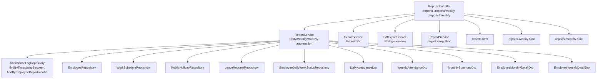
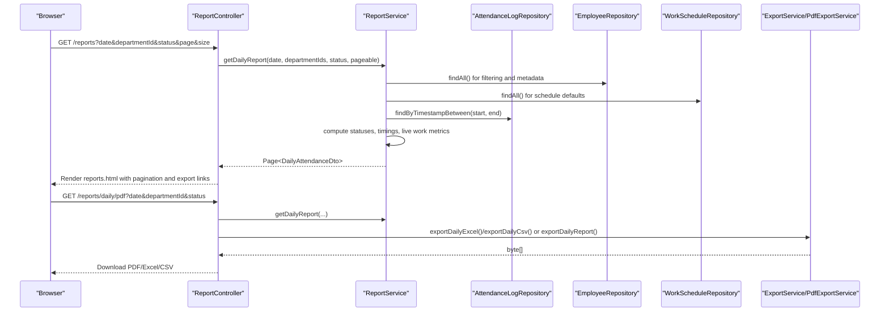
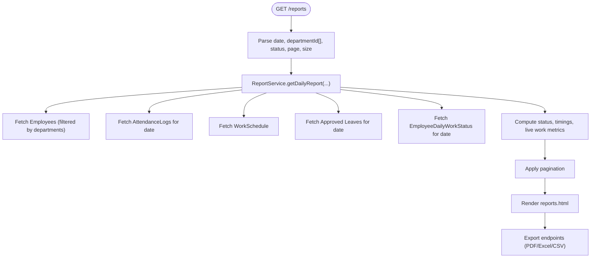
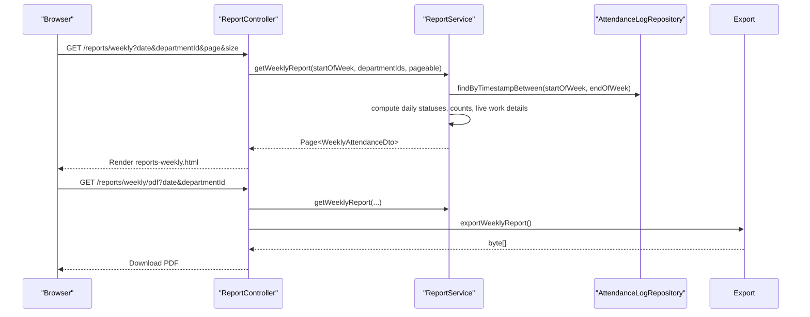
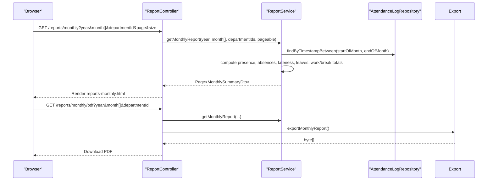
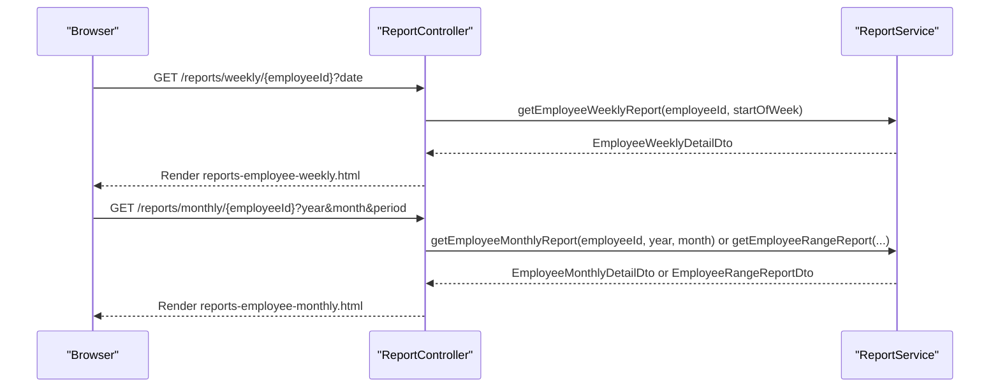
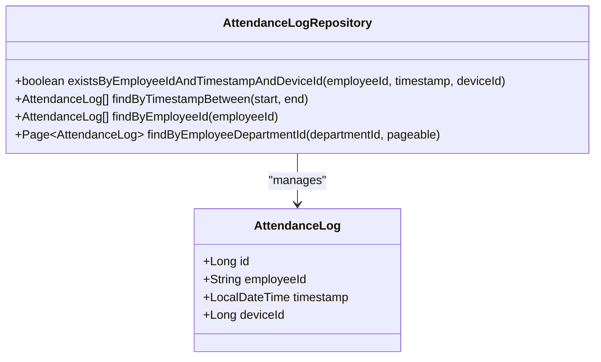
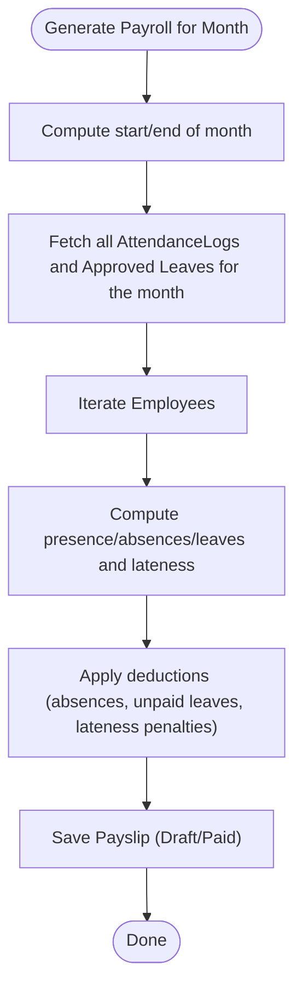
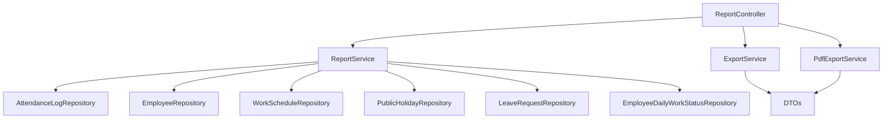

# Attendance Historical Data Management

<cite>
**Referenced Files in This Document**
- [ReportController.java](file://src/main/java/root/cyb/mh/attendancesystem/controller/ReportController.java)
- [ReportService.java](file://src/main/java/root/cyb/mh/attendancesystem/service/ReportService.java)
- [ExportService.java](file://src/main/java/root/cyb/mh/attendancesystem/service/ExportService.java)
- [PdfExportService.java](file://src/main/java/root/cyb/mh/attendancesystem/service/PdfExportService.java)
- [PayrollService.java](file://src/main/java/root/cyb/mh/attendancesystem/service/PayrollService.java)
- [AttendanceLogRepository.java](file://src/main/java/root/cyb/mh/attendancesystem/repository/AttendanceLogRepository.java)
- [AttendanceLog.java](file://src/main/java/root/cyb/mh/attendancesystem/model/AttendanceLog.java)
- [DailyAttendanceDto.java](file://src/main/java/root/cyb/mh/attendancesystem/dto/DailyAttendanceDto.java)
- [WeeklyAttendanceDto.java](file://src/main/java/root/cyb/mh/attendancesystem/dto/WeeklyAttendanceDto.java)
- [MonthlySummaryDto.java](file://src/main/java/root/cyb/mh/attendancesystem/dto/MonthlySummaryDto.java)
- [EmployeeMonthlyDetailDto.java](file://src/main/java/root/cyb/mh/attendancesystem/dto/EmployeeMonthlyDetailDto.java)
- [EmployeeWeeklyDetailDto.java](file://src/main/java/root/cyb/mh/attendancesystem/dto/EmployeeWeeklyDetailDto.java)
- [reports.html](file://src/main/resources/templates/reports.html)
- [reports-weekly.html](file://src/main/resources/templates/reports-weekly.html)
- [reports-monthly.html](file://src/main/resources/templates/reports-monthly.html)
</cite>

## Table of Contents
1. [Introduction](#introduction)
2. [Project Structure](#project-structure)
3. [Core Components](#core-components)
4. [Architecture Overview](#architecture-overview)
5. [Detailed Component Analysis](#detailed-component-analysis)
6. [Dependency Analysis](#dependency-analysis)
7. [Performance Considerations](#performance-considerations)
8. [Troubleshooting Guide](#troubleshooting-guide)
9. [Conclusion](#conclusion)

## Introduction
This document explains the attendance historical data management and reporting system. It covers how attendance logs are archived, aggregated, and transformed into daily, weekly, and monthly reports. It also documents filtering by date ranges and departments, pagination strategies, export capabilities (PDF, Excel, CSV), and integration with payroll calculations. Practical examples demonstrate generating reports, applying filters, and linking attendance analytics to payroll.

## Project Structure
The attendance reporting system is organized around Spring MVC controllers, service-layer aggregation, JPA repositories, and DTOs for presentation. Templates render paginated HTML views and support export links.

**Diagram sources**
- [ReportController.java:1-754](file://src/main/java/root/cyb/mh/attendancesystem/controller/ReportController.java#L1-L754)
- [ReportService.java:1-1185](file://src/main/java/root/cyb/mh/attendancesystem/service/ReportService.java#L1-L1185)
- [AttendanceLogRepository.java:1-22](file://src/main/java/root/cyb/mh/attendancesystem/repository/AttendanceLogRepository.java#L1-L22)
- [ExportService.java:1-579](file://src/main/java/root/cyb/mh/attendancesystem/service/ExportService.java#L1-L579)
- [PdfExportService.java:1-485](file://src/main/java/root/cyb/mh/attendancesystem/service/PdfExportService.java#L1-L485)
- [PayrollService.java:1-318](file://src/main/java/root/cyb/mh/attendancesystem/service/PayrollService.java#L1-L318)
- [DailyAttendanceDto.java:1-24](file://src/main/java/root/cyb/mh/attendancesystem/dto/DailyAttendanceDto.java#L1-L24)
- [WeeklyAttendanceDto.java:1-35](file://src/main/java/root/cyb/mh/attendancesystem/dto/WeeklyAttendanceDto.java#L1-L35)
- [MonthlySummaryDto.java:1-143](file://src/main/java/root/cyb/mh/attendancesystem/dto/MonthlySummaryDto.java#L1-L143)
- [EmployeeMonthlyDetailDto.java:1-159](file://src/main/java/root/cyb/mh/attendancesystem/dto/EmployeeMonthlyDetailDto.java#L1-L159)
- [EmployeeWeeklyDetailDto.java:1-211](file://src/main/java/root/cyb/mh/attendancesystem/dto/EmployeeWeeklyDetailDto.java#L1-L211)
- [reports.html:1-227](file://src/main/resources/templates/reports.html#L1-L227)
- [reports-weekly.html:1-262](file://src/main/resources/templates/reports-weekly.html#L1-L262)
- [reports-monthly.html:1-298](file://src/main/resources/templates/reports-monthly.html#L1-L298)

**Section sources**
- [ReportController.java:1-754](file://src/main/java/root/cyb/mh/attendancesystem/controller/ReportController.java#L1-L754)
- [ReportService.java:1-1185](file://src/main/java/root/cyb/mh/attendancesystem/service/ReportService.java#L1-L1185)
- [AttendanceLogRepository.java:1-22](file://src/main/java/root/cyb/mh/attendancesystem/repository/AttendanceLogRepository.java#L1-L22)
- [ExportService.java:1-579](file://src/main/java/root/cyb/mh/attendancesystem/service/ExportService.java#L1-L579)
- [PdfExportService.java:1-485](file://src/main/java/root/cyb/mh/attendancesystem/service/PdfExportService.java#L1-L485)
- [PayrollService.java:1-318](file://src/main/java/root/cyb/mh/attendancesystem/service/PayrollService.java#L1-L318)
- [DailyAttendanceDto.java:1-24](file://src/main/java/root/cyb/mh/attendancesystem/dto/DailyAttendanceDto.java#L1-L24)
- [WeeklyAttendanceDto.java:1-35](file://src/main/java/root/cyb/mh/attendancesystem/dto/WeeklyAttendanceDto.java#L1-L35)
- [MonthlySummaryDto.java:1-143](file://src/main/java/root/cyb/mh/attendancesystem/dto/MonthlySummaryDto.java#L1-L143)
- [EmployeeMonthlyDetailDto.java:1-159](file://src/main/java/root/cyb/mh/attendancesystem/dto/EmployeeMonthlyDetailDto.java#L1-L159)
- [EmployeeWeeklyDetailDto.java:1-211](file://src/main/java/root/cyb/mh/attendancesystem/dto/EmployeeWeeklyDetailDto.java#L1-L211)
- [reports.html:1-227](file://src/main/resources/templates/reports.html#L1-L227)
- [reports-weekly.html:1-262](file://src/main/resources/templates/reports-weekly.html#L1-L262)
- [reports-monthly.html:1-298](file://src/main/resources/templates/reports-monthly.html#L1-L298)

## Core Components
- Controllers orchestrate request handling, pagination, filtering, and export endpoints.
- Services perform heavy lifting: fetching and aggregating attendance logs, leaves, schedules, and live work statuses; building DTOs for reports.
- Repositories provide typed queries for attendance logs and filtered department-based lists.
- DTOs represent report data structures for daily, weekly, monthly, and employee-specific views.
- Export services produce Excel, CSV, and PDF outputs.
- Templates render paginated HTML views and expose export actions.

Key responsibilities:
- Daily report: per-employee status, in/out times, live work status, and break durations.
- Weekly report: daily status grid, counts, and live work metrics per day.
- Monthly report: aggregated counts, leave breakdowns, and accumulated work/break durations.
- Employee detail reports: per-month and per-range summaries with daily details.
- Payroll integration: attendance-driven calculations for absentees, leaves, and lateness penalties.

**Section sources**
- [ReportController.java:1-754](file://src/main/java/root/cyb/mh/attendancesystem/controller/ReportController.java#L1-L754)
- [ReportService.java:1-1185](file://src/main/java/root/cyb/mh/attendancesystem/service/ReportService.java#L1-L1185)
- [ExportService.java:1-579](file://src/main/java/root/cyb/mh/attendancesystem/service/ExportService.java#L1-L579)
- [PdfExportService.java:1-485](file://src/main/java/root/cyb/mh/attendancesystem/service/PdfExportService.java#L1-L485)
- [PayrollService.java:1-318](file://src/main/java/root/cyb/mh/attendancesystem/service/PayrollService.java#L1-L318)

## Architecture Overview
The system follows a layered architecture:
- Presentation: Thymeleaf templates and controller endpoints.
- Application: ReportService orchestrates data retrieval and computation.
- Persistence: JPA repositories query AttendanceLog and related entities.
- Export: Dedicated services transform DTOs into Excel/CSV/PDF.

**Diagram sources**
- [ReportController.java:1-754](file://src/main/java/root/cyb/mh/attendancesystem/controller/ReportController.java#L1-L754)
- [ReportService.java:1-1185](file://src/main/java/root/cyb/mh/attendancesystem/service/ReportService.java#L1-L1185)
- [ExportService.java:1-579](file://src/main/java/root/cyb/mh/attendancesystem/service/ExportService.java#L1-L579)
- [PdfExportService.java:1-485](file://src/main/java/root/cyb/mh/attendancesystem/service/PdfExportService.java#L1-L485)
- [AttendanceLogRepository.java:1-22](file://src/main/java/root/cyb/mh/attendancesystem/repository/AttendanceLogRepository.java#L1-L22)

## Detailed Component Analysis

### Daily Attendance Report
- Purpose: Show per-employee status for a given date, including in/out times, live work status, and break durations.
- Filtering: Supports department selection and status filter.
- Sorting: Sort by name, department, in-time, out-time, or status.
- Pagination: Pageable applied to the computed report list.
- Export: PDF, Excel, CSV endpoints.

**Diagram sources**
- [ReportController.java:23-94](file://src/main/java/root/cyb/mh/attendancesystem/controller/ReportController.java#L23-L94)
- [ReportService.java:47-100](file://src/main/java/root/cyb/mh/attendancesystem/service/ReportService.java#L47-L100)
- [reports.html:1-227](file://src/main/resources/templates/reports.html#L1-L227)

**Section sources**
- [ReportController.java:23-94](file://src/main/java/root/cyb/mh/attendancesystem/controller/ReportController.java#L23-L94)
- [ReportService.java:47-100](file://src/main/java/root/cyb/mh/attendancesystem/service/ReportService.java#L47-L100)
- [reports.html:1-227](file://src/main/resources/templates/reports.html#L1-L227)

### Weekly Attendance Report
- Purpose: Provide a weekly grid view per employee with daily status and summary counts.
- Features: Multi-department filter, sorting by summary metrics, and live work details per day.
- Export: PDF, Excel, CSV endpoints.

**Diagram sources**
- [ReportController.java:96-185](file://src/main/java/root/cyb/mh/attendancesystem/controller/ReportController.java#L96-L185)
- [ReportService.java:285-511](file://src/main/java/root/cyb/mh/attendancesystem/service/ReportService.java#L285-L511)
- [reports-weekly.html:1-262](file://src/main/resources/templates/reports-weekly.html#L1-L262)

**Section sources**
- [ReportController.java:96-185](file://src/main/java/root/cyb/mh/attendancesystem/controller/ReportController.java#L96-L185)
- [ReportService.java:285-511](file://src/main/java/root/cyb/mh/attendancesystem/service/ReportService.java#L285-L511)
- [reports-weekly.html:1-262](file://src/main/resources/templates/reports-weekly.html#L1-L262)

### Monthly Attendance Report
- Purpose: Aggregate attendance across selected months and departments, including leave quotas and accumulated work/break durations.
- Features: Multi-month selection, department filter, sorting, and export.

**Diagram sources**
- [ReportController.java:200-283](file://src/main/java/root/cyb/mh/attendancesystem/controller/ReportController.java#L200-L283)
- [ReportService.java:673-806](file://src/main/java/root/cyb/mh/attendancesystem/service/ReportService.java#L673-L806)
- [reports-monthly.html:1-298](file://src/main/resources/templates/reports-monthly.html#L1-L298)

**Section sources**
- [ReportController.java:200-283](file://src/main/java/root/cyb/mh/attendancesystem/controller/ReportController.java#L200-L283)
- [ReportService.java:673-806](file://src/main/java/root/cyb/mh/attendancesystem/service/ReportService.java#L673-L806)
- [reports-monthly.html:1-298](file://src/main/resources/templates/reports-monthly.html#L1-L298)

### Employee Detail Reports
- Employee Weekly Detail: Per-day details with lateness/early leave minutes and live work metrics.
- Employee Monthly Detail: Daily details for a selected month/year with aggregated totals.
- Employee Range Report: Aggregated totals across a date range with monthly breakdowns.

**Diagram sources**
- [ReportController.java:187-323](file://src/main/java/root/cyb/mh/attendancesystem/controller/ReportController.java#L187-L323)
- [ReportService.java:513-647](file://src/main/java/root/cyb/mh/attendancesystem/service/ReportService.java#L513-L647)

**Section sources**
- [ReportController.java:187-323](file://src/main/java/root/cyb/mh/attendancesystem/controller/ReportController.java#L187-L323)
- [ReportService.java:513-647](file://src/main/java/root/cyb/mh/attendancesystem/service/ReportService.java#L513-L647)

### Attendance Log Archiving and Query Patterns
- Storage: AttendanceLog persists employeeId, timestamp, and deviceId.
- Queries:
  - Range-based: findByTimestampBetween for daily/weekly/monthly windows.
  - Department-based: findByEmployeeDepartmentId with Pageable for filtered lists.
  - Existence check: existsByEmployeeIdAndTimestampAndDeviceId for deduplication.

**Diagram sources**
- [AttendanceLog.java:1-27](file://src/main/java/root/cyb/mh/attendancesystem/model/AttendanceLog.java#L1-L27)
- [AttendanceLogRepository.java:1-22](file://src/main/java/root/cyb/mh/attendancesystem/repository/AttendanceLogRepository.java#L1-L22)

**Section sources**
- [AttendanceLog.java:1-27](file://src/main/java/root/cyb/mh/attendancesystem/model/AttendanceLog.java#L1-L27)
- [AttendanceLogRepository.java:1-22](file://src/main/java/root/cyb/mh/attendancesystem/repository/AttendanceLogRepository.java#L1-L22)

### Data Aggregation Functions
- Daily aggregation: Filters employees by department, computes status per date, integrates live work status and break durations.
- Weekly aggregation: Builds a 7-day grid, counts presence/absence/lateness/early leaves, and enriches with live work metrics.
- Monthly aggregation: Computes presence/absence/late/early/leave totals, paid/unpaid leave balances, and accumulates active work and break durations.

**Section sources**
- [ReportService.java:108-283](file://src/main/java/root/cyb/mh/attendancesystem/service/ReportService.java#L108-L283)
- [ReportService.java:285-511](file://src/main/java/root/cyb/mh/attendancesystem/service/ReportService.java#L285-L511)
- [ReportService.java:673-806](file://src/main/java/root/cyb/mh/attendancesystem/service/ReportService.java#L673-L806)

### Pagination Strategies
- Pageable is constructed from page and size parameters.
- For daily/weekly/monthly reports, pagination is applied after computing the full dataset to support sorting and filtering.
- Templates render pagination controls and maintain sort/filter parameters.

**Section sources**
- [ReportController.java:36-94](file://src/main/java/root/cyb/mh/attendancesystem/controller/ReportController.java#L36-L94)
- [ReportController.java:120-185](file://src/main/java/root/cyb/mh/attendancesystem/controller/ReportController.java#L120-L185)
- [ReportController.java:217-283](file://src/main/java/root/cyb/mh/attendancesystem/controller/ReportController.java#L217-L283)
- [reports.html](file://src/main/resources/templates/reports.html#L219)
- [reports-weekly.html](file://src/main/resources/templates/reports-weekly.html#L253)
- [reports-monthly.html](file://src/main/resources/templates/reports-monthly.html#L228)

### Data Export Capabilities
- Formats: PDF, Excel (.xlsx), CSV.
- Endpoints: /reports/daily/pdf, /reports/weekly/pdf, /reports/monthly/pdf and corresponding Excel/CSV endpoints.
- Implementation: ExportService for Excel/CSV; PdfExportService for PDFs.

**Section sources**
- [ReportController.java:328-518](file://src/main/java/root/cyb/mh/attendancesystem/controller/ReportController.java#L328-L518)
- [ReportController.java:563-752](file://src/main/java/root/cyb/mh/attendancesystem/controller/ReportController.java#L563-L752)
- [ExportService.java:1-579](file://src/main/java/root/cyb/mh/attendancesystem/service/ExportService.java#L1-L579)
- [PdfExportService.java:1-485](file://src/main/java/root/cyb/mh/attendancesystem/service/PdfExportService.java#L1-L485)

### Integrating Attendance Data with Payroll Calculations
- PayrollService generates payslips for a month using attendance logs, approved leaves, and work schedule.
- Attendance-derived metrics: total working days, present days, absent days, paid/unpaid leave days, lateness penalties.
- PayrollService ensures idempotency by checking existing payslips and skipping paid ones.

**Diagram sources**
- [PayrollService.java:39-92](file://src/main/java/root/cyb/mh/attendancesystem/service/PayrollService.java#L39-L92)
- [PayrollService.java:94-290](file://src/main/java/root/cyb/mh/attendancesystem/service/PayrollService.java#L94-L290)

**Section sources**
- [PayrollService.java:39-92](file://src/main/java/root/cyb/mh/attendancesystem/service/PayrollService.java#L39-L92)
- [PayrollService.java:94-290](file://src/main/java/root/cyb/mh/attendancesystem/service/PayrollService.java#L94-L290)

### Practical Examples

- Generate a daily report for a specific date and department(s):
  - Endpoint: GET /reports?date={YYYY-MM-DD}&departmentId={id}&page={n}&size={s}
  - Optional status filter: add status={PRESENT|ABSENT|LEAVE|LATE}
  - Export: /reports/daily/pdf?... or /reports/daily/excel?... or /reports/daily/csv?...

- Filter historical data by date ranges and employee categories:
  - Weekly: /reports/weekly?date={YYYY-MM-DD}&departmentId={id}&page={n}&size={s}
  - Monthly: /reports/monthly?year={YYYY}&month={1..12}&departmentId={id}&page={n}&size={s}
  - Employee detail: /reports/weekly/{employeeId}?date={YYYY-MM-DD}
  - Employee monthly/range: /reports/monthly/{employeeId}?year={YYYY}&month={M}&period={3M|6M|1Y}

- Integrate attendance with payroll:
  - Generate payslips for a month: PayrollService.generatePayrollForMonth(YearMonth)
  - Create individual payslip: PayrollService.createPayslipForEmployee(employee, YearMonth)

**Section sources**
- [ReportController.java:23-94](file://src/main/java/root/cyb/mh/attendancesystem/controller/ReportController.java#L23-L94)
- [ReportController.java:96-185](file://src/main/java/root/cyb/mh/attendancesystem/controller/ReportController.java#L96-L185)
- [ReportController.java:200-283](file://src/main/java/root/cyb/mh/attendancesystem/controller/ReportController.java#L200-L283)
- [ReportController.java:187-323](file://src/main/java/root/cyb/mh/attendancesystem/controller/ReportController.java#L187-L323)
- [PayrollService.java:39-92](file://src/main/java/root/cyb/mh/attendancesystem/service/PayrollService.java#L39-L92)

## Dependency Analysis
The system exhibits clear separation of concerns:
- Controllers depend on services and repositories.
- Services depend on repositories and DTOs.
- Export services depend on DTOs and Apache POI/iText libraries.
- Templates depend on controllers for rendering and export links.

**Diagram sources**
- [ReportController.java:1-754](file://src/main/java/root/cyb/mh/attendancesystem/controller/ReportController.java#L1-L754)
- [ReportService.java:1-1185](file://src/main/java/root/cyb/mh/attendancesystem/service/ReportService.java#L1-L1185)
- [ExportService.java:1-579](file://src/main/java/root/cyb/mh/attendancesystem/service/ExportService.java#L1-L579)
- [PdfExportService.java:1-485](file://src/main/java/root/cyb/mh/attendancesystem/service/PdfExportService.java#L1-L485)

**Section sources**
- [ReportController.java:1-754](file://src/main/java/root/cyb/mh/attendancesystem/controller/ReportController.java#L1-L754)
- [ReportService.java:1-1185](file://src/main/java/root/cyb/mh/attendancesystem/service/ReportService.java#L1-L1185)
- [ExportService.java:1-579](file://src/main/java/root/cyb/mh/attendancesystem/service/ExportService.java#L1-L579)
- [PdfExportService.java:1-485](file://src/main/java/root/cyb/mh/attendancesystem/service/PdfExportService.java#L1-L485)

## Performance Considerations
- Bulk fetch optimization: Services fetch logs and leaves for the entire period once and filter in-memory to reduce database round-trips.
- Pagination: Applied after computation to support sorting and filtering; avoid large page sizes for heavy reports.
- In-memory sorting: Daily/Weekly/Monthly endpoints sort DTO pages client-side after pagination.
- Efficient queries: findByTimestampBetween and findByEmployeeDepartmentId minimize joins and leverage indexed timestamp and department fields.
- Export limits: Endpoints use PageRequest.of(0, N) for exports to cap memory usage; consider configurable limits for very large datasets.

[No sources needed since this section provides general guidance]

## Troubleshooting Guide
- Empty reports:
  - Verify date range and department filters.
  - Confirm AttendanceLog entries exist for the selected period.
- Incorrect counts:
  - Check WorkSchedule weekend days and tolerance thresholds.
  - Validate Approved Leave overlaps for the period.
- Export failures:
  - Ensure sufficient memory for large exports.
  - Confirm DTO completeness before export.
- Payroll discrepancies:
  - Review lateness penalty thresholds and leave types (paid/unpaid).
  - Check payslip status to avoid re-generation of paid items.

**Section sources**
- [ReportService.java:108-283](file://src/main/java/root/cyb/mh/attendancesystem/service/ReportService.java#L108-L283)
- [ReportService.java:285-511](file://src/main/java/root/cyb/mh/attendancesystem/service/ReportService.java#L285-L511)
- [ReportService.java:673-806](file://src/main/java/root/cyb/mh/attendancesystem/service/ReportService.java#L673-L806)
- [PayrollService.java:94-290](file://src/main/java/root/cyb/mh/attendancesystem/service/PayrollService.java#L94-L290)

## Conclusion
The attendance historical data management system provides robust daily, weekly, and monthly reporting with flexible filtering, pagination, and export capabilities. Its service layer efficiently aggregates attendance logs, leaves, schedules, and live work statuses to produce accurate analytics. Integration with payroll enables attendance-driven financial calculations, while templates offer intuitive dashboards and export options for operational and compliance needs.