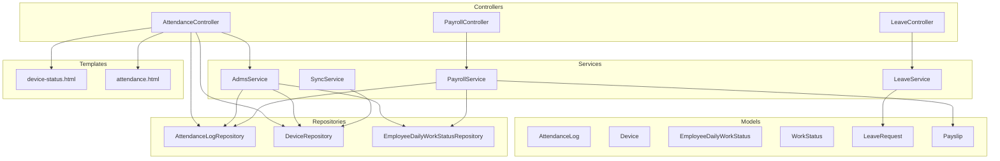
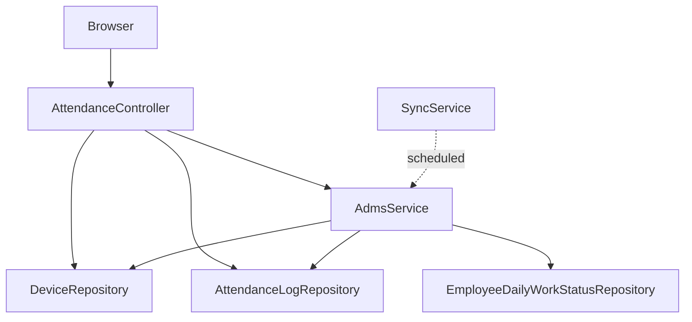
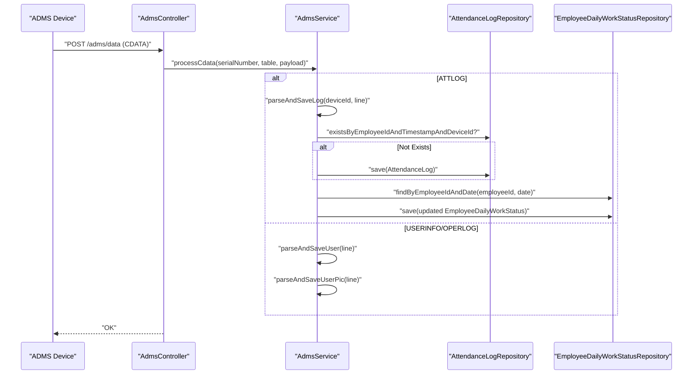
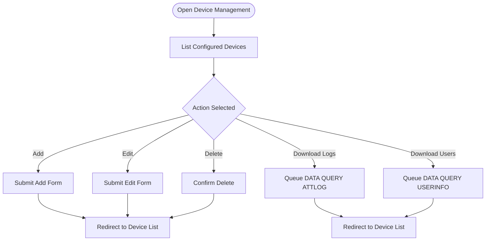
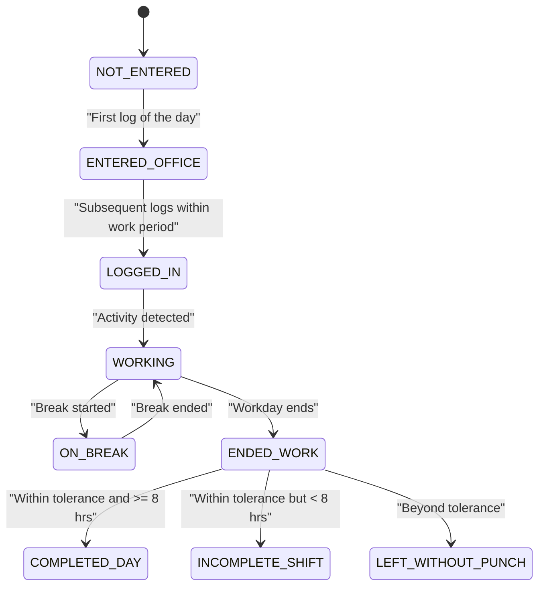
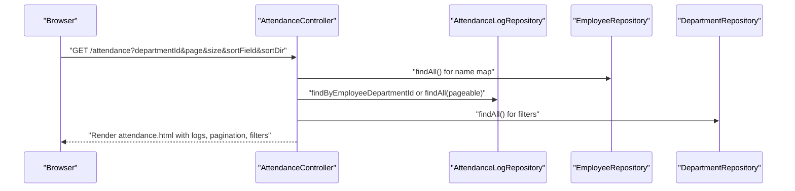
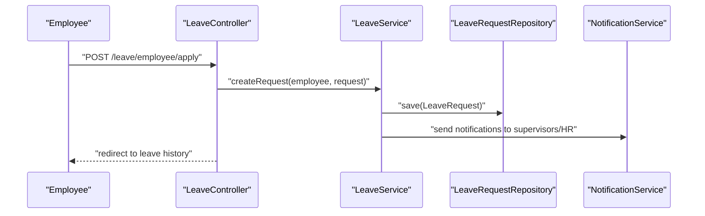
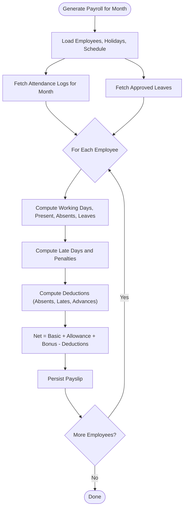
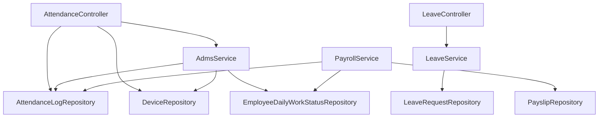

# Attendance System

<cite>
**Referenced Files in This Document**
- [AttendanceController.java](file://src/main/java/root/cyb/mh/attendancesystem/controller/AttendanceController.java)
- [AdmsService.java](file://src/main/java/root/cyb/mh/attendancesystem/service/AdmsService.java)
- [SyncService.java](file://src/main/java/root/cyb/mh/attendancesystem/service/SyncService.java)
- [AttendanceLog.java](file://src/main/java/root/cyb/mh/attendancesystem/model/AttendanceLog.java)
- [Device.java](file://src/main/java/root/cyb/mh/attendancesystem/model/Device.java)
- [EmployeeDailyWorkStatus.java](file://src/main/java/root/cyb/mh/attendancesystem/model/EmployeeDailyWorkStatus.java)
- [WorkStatus.java](file://src/main/java/root/cyb/mh/attendancesystem/model/WorkStatus.java)
- [AttendanceLogRepository.java](file://src/main/java/root/cyb/mh/attendancesystem/repository/AttendanceLogRepository.java)
- [DeviceRepository.java](file://src/main/java/root/cyb/mh/attendancesystem/repository/DeviceRepository.java)
- [EmployeeDailyWorkStatusRepository.java](file://src/main/java/root/cyb/mh/attendancesystem/repository/EmployeeDailyWorkStatusRepository.java)
- [device-status.html](file://src/main/resources/templates/device-status.html)
- [attendance.html](file://src/main/resources/templates/attendance.html)
- [LeaveController.java](file://src/main/java/root/cyb/mh/attendancesystem/controller/LeaveController.java)
- [LeaveService.java](file://src/main/java/root/cyb/mh/attendancesystem/service/LeaveService.java)
- [LeaveRequest.java](file://src/main/java/root/cyb/mh/attendancesystem/model/LeaveRequest.java)
- [PayrollController.java](file://src/main/java/root/cyb/mh/attendancesystem/controller/PayrollController.java)
- [PayrollService.java](file://src/main/java/root/cyb/mh/attendancesystem/service/PayrollService.java)
- [Payslip.java](file://src/main/java/root/cyb/mh/attendancesystem/model/Payslip.java)
</cite>

## Table of Contents
1. [Introduction](#introduction)
2. [Project Structure](#project-structure)
3. [Core Components](#core-components)
4. [Architecture Overview](#architecture-overview)
5. [Detailed Component Analysis](#detailed-component-analysis)
6. [Dependency Analysis](#dependency-analysis)
7. [Performance Considerations](#performance-considerations)
8. [Troubleshooting Guide](#troubleshooting-guide)
9. [Conclusion](#conclusion)
10. [Appendices](#appendices)

## Introduction
This document describes the Skylink Custom Backend’s attendance system with a focus on real-time attendance tracking, ADMS device integration, multi-device status monitoring, and attendance history management. It also covers attendance logging mechanisms, device communication protocols, status synchronization, historical data retrieval, and integration points with leave management and payroll systems. Practical workflows, configuration steps, troubleshooting tips, and integration guidance are included to help administrators and developers operate the system effectively.

## Project Structure
The attendance system spans controllers, services, repositories, models, and Thymeleaf templates. Controllers expose HTTP endpoints for device management, attendance viewing, leave administration, and payroll operations. Services encapsulate business logic for ADMS data ingestion, daily work status updates, leave notifications, and payroll calculations. Repositories provide persistence access for attendance logs, devices, daily statuses, and related entities. Templates render device lists, attendance logs, and administrative dashboards.

**Diagram sources**
- [AttendanceController.java:1-132](file://src/main/java/root/cyb/mh/attendancesystem/controller/AttendanceController.java#L1-132)
- [AdmsService.java:1-263](file://src/main/java/root/cyb/mh/attendancesystem/service/AdmsService.java#L1-263)
- [SyncService.java:1-21](file://src/main/java/root/cyb/mh/attendancesystem/service/SyncService.java#L1-21)
- [AttendanceLogRepository.java:1-22](file://src/main/java/root/cyb/mh/attendancesystem/repository/AttendanceLogRepository.java#L1-22)
- [DeviceRepository.java:1-11](file://src/main/java/root/cyb/mh/attendancesystem/repository/DeviceRepository.java#L1-11)
- [EmployeeDailyWorkStatusRepository.java:1-21](file://src/main/java/root/cyb/mh/attendancesystem/repository/EmployeeDailyWorkStatusRepository.java#L1-21)
- [AttendanceLog.java:1-27](file://src/main/java/root/cyb/mh/attendancesystem/model/AttendanceLog.java#L1-27)
- [Device.java:1-26](file://src/main/java/root/cyb/mh/attendancesystem/model/Device.java#L1-26)
- [EmployeeDailyWorkStatus.java:1-45](file://src/main/java/root/cyb/mh/attendancesystem/model/EmployeeDailyWorkStatus.java#L1-45)
- [WorkStatus.java:1-14](file://src/main/java/root/cyb/mh/attendancesystem/model/WorkStatus.java#L1-14)
- [LeaveController.java:1-176](file://src/main/java/root/cyb/mh/attendancesystem/controller/LeaveController.java#L1-176)
- [LeaveService.java:1-127](file://src/main/java/root/cyb/mh/attendancesystem/service/LeaveService.java#L1-127)
- [LeaveRequest.java:1-54](file://src/main/java/root/cyb/mh/attendancesystem/model/LeaveRequest.java#L1-54)
- [PayrollController.java:1-223](file://src/main/java/root/cyb/mh/attendancesystem/controller/PayrollController.java#L1-223)
- [PayrollService.java:1-318](file://src/main/java/root/cyb/mh/attendancesystem/service/PayrollService.java#L1-318)
- [Payslip.java:1-57](file://src/main/java/root/cyb/mh/attendancesystem/model/Payslip.java#L1-57)
- [device-status.html:1-159](file://src/main/resources/templates/device-status.html#L1-159)
- [attendance.html:1-101](file://src/main/resources/templates/attendance.html#L1-101)

**Section sources**
- [AttendanceController.java:1-132](file://src/main/java/root/cyb/mh/attendancesystem/controller/AttendanceController.java#L1-132)
- [device-status.html:1-159](file://src/main/resources/templates/device-status.html#L1-159)
- [attendance.html:1-101](file://src/main/resources/templates/attendance.html#L1-101)

## Core Components
- AttendanceController: Manages device CRUD, manual sync trigger, and attendance log listing with filtering and pagination.
- AdmsService: Handles queued commands, parses incoming ADMS data (ATTLOG, USERINFO, OPERLOG), persists logs, and updates daily work status.
- SyncService: Provides scheduled synchronization hooks (currently a placeholder for push-based protocol).
- AttendanceLog: JPA entity representing a single attendance event with employee ID, timestamp, and device ID.
- Device: JPA entity storing device connection details (name, IP, port, serial number).
- EmployeeDailyWorkStatus: Tracks daily work state transitions and accumulates break durations.
- AttendanceLogRepository, DeviceRepository, EmployeeDailyWorkStatusRepository: Data access interfaces for persistence.
- Templates: device-status.html and attendance.html render device management and attendance listing UIs.

**Section sources**
- [AttendanceController.java:1-132](file://src/main/java/root/cyb/mh/attendancesystem/controller/AttendanceController.java#L1-132)
- [AdmsService.java:1-263](file://src/main/java/root/cyb/mh/attendancesystem/service/AdmsService.java#L1-263)
- [SyncService.java:1-21](file://src/main/java/root/cyb/mh/attendancesystem/service/SyncService.java#L1-21)
- [AttendanceLog.java:1-27](file://src/main/java/root/cyb/mh/attendancesystem/model/AttendanceLog.java#L1-27)
- [Device.java:1-26](file://src/main/java/root/cyb/mh/attendancesystem/model/Device.java#L1-26)
- [EmployeeDailyWorkStatus.java:1-45](file://src/main/java/root/cyb/mh/attendancesystem/model/EmployeeDailyWorkStatus.java#L1-45)
- [AttendanceLogRepository.java:1-22](file://src/main/java/root/cyb/mh/attendancesystem/repository/AttendanceLogRepository.java#L1-22)
- [DeviceRepository.java:1-11](file://src/main/java/root/cyb/mh/attendancesystem/repository/DeviceRepository.java#L1-11)
- [EmployeeDailyWorkStatusRepository.java:1-21](file://src/main/java/root/cyb/mh/attendancesystem/repository/EmployeeDailyWorkStatusRepository.java#L1-21)
- [device-status.html:1-159](file://src/main/resources/templates/device-status.html#L1-159)
- [attendance.html:1-101](file://src/main/resources/templates/attendance.html#L1-101)

## Architecture Overview
The system follows a layered architecture:
- Presentation: Thymeleaf templates for device and attendance views.
- Controllers: Expose endpoints for device management, manual sync, and attendance browsing.
- Services: Encapsulate ADMS ingestion, daily status updates, leave notifications, and payroll computation.
- Persistence: JPA repositories manage AttendanceLog, Device, EmployeeDailyWorkStatus, and related entities.

**Diagram sources**
- [AttendanceController.java:1-132](file://src/main/java/root/cyb/mh/attendancesystem/controller/AttendanceController.java#L1-132)
- [AdmsService.java:1-263](file://src/main/java/root/cyb/mh/attendancesystem/service/AdmsService.java#L1-263)
- [SyncService.java:1-21](file://src/main/java/root/cyb/mh/attendancesystem/service/SyncService.java#L1-21)
- [AttendanceLogRepository.java:1-22](file://src/main/java/root/cyb/mh/attendancesystem/repository/AttendanceLogRepository.java#L1-22)
- [DeviceRepository.java:1-11](file://src/main/java/root/cyb/mh/attendancesystem/repository/DeviceRepository.java#L1-11)
- [EmployeeDailyWorkStatusRepository.java:1-21](file://src/main/java/root/cyb/mh/attendancesystem/repository/EmployeeDailyWorkStatusRepository.java#L1-21)

## Detailed Component Analysis

### ADMS Device Integration and Data Ingestion
ADMSService implements a push-based ingestion model:
- Command Queue: Clients enqueue commands prefixed with a unique token; the server retrieves the next command via a polling endpoint.
- Data Parsing: Supports ATTLOG, USERINFO, and OPERLOG tables. It normalizes raw tab-separated or key-value formats, extracts employee identifiers, timestamps, and user metadata.
- Deduplication: Prevents duplicate AttendanceLog entries using employee ID, timestamp, and device ID.
- Status Updates: After ingesting a log, it updates EmployeeDailyWorkStatus, transitioning states and computing completion flags based on work start/end and tolerance windows.

**Diagram sources**
- [AdmsService.java:42-89](file://src/main/java/root/cyb/mh/attendancesystem/service/AdmsService.java#L42-89)
- [AdmsService.java:184-261](file://src/main/java/root/cyb/mh/attendancesystem/service/AdmsService.java#L184-261)
- [AttendanceLogRepository.java:11-11](file://src/main/java/root/cyb/mh/attendancesystem/repository/AttendanceLogRepository.java#L11-11)
- [EmployeeDailyWorkStatusRepository.java:13-13](file://src/main/java/root/cyb/mh/attendancesystem/repository/EmployeeDailyWorkStatusRepository.java#L13-13)

**Section sources**
- [AdmsService.java:1-263](file://src/main/java/root/cyb/mh/attendancesystem/service/AdmsService.java#L1-263)
- [AttendanceLogRepository.java:1-22](file://src/main/java/root/cyb/mh/attendancesystem/repository/AttendanceLogRepository.java#L1-22)
- [EmployeeDailyWorkStatusRepository.java:1-21](file://src/main/java/root/cyb/mh/attendancesystem/repository/EmployeeDailyWorkStatusRepository.java#L1-21)

### Multi-Device Status Monitoring
The device management UI supports:
- Listing devices with online/offline badges derived from presence of persisted records.
- Adding, editing, and deleting devices with IP address, port, and optional serial number.
- Triggering downloads of logs and user data to synchronize with the backend.

**Diagram sources**
- [device-status.html:14-153](file://src/main/resources/templates/device-status.html#L14-153)
- [AttendanceController.java:33-80](file://src/main/java/root/cyb/mh/attendancesystem/controller/AttendanceController.java#L33-80)

**Section sources**
- [device-status.html:1-159](file://src/main/resources/templates/device-status.html#L1-159)
- [AttendanceController.java:1-132](file://src/main/java/root/cyb/mh/attendancesystem/controller/AttendanceController.java#L1-132)

### Real-Time Attendance Tracking and Status Synchronization
Real-time tracking occurs when devices push data to the backend:
- Command Polling: Devices poll for queued commands; upon receiving a command, they execute it and push CDATA back to the server.
- Log Ingestion: Each attendance record is deduplicated and used to update daily work status, including transitions from “NOT_ENTERED” to “ENTERED_OFFICE” and subsequent “COMPLETED_DAY” or “INCOMPLETE_SHIFT” based on thresholds and tolerance windows.

**Diagram sources**
- [WorkStatus.java:1-14](file://src/main/java/root/cyb/mh/attendancesystem/model/WorkStatus.java#L1-14)
- [AdmsService.java:232-256](file://src/main/java/root/cyb/mh/attendancesystem/service/AdmsService.java#L232-256)

**Section sources**
- [AdmsService.java:1-263](file://src/main/java/root/cyb/mh/attendancesystem/service/AdmsService.java#L1-263)
- [WorkStatus.java:1-14](file://src/main/java/root/cyb/mh/attendancesystem/model/WorkStatus.java#L1-14)

### Attendance History Management
The attendance listing page provides:
- Filtering by department.
- Sorting by multiple fields including a virtual “employeeName” using a preloaded employee map.
- Pagination support via Pageable queries.

**Diagram sources**
- [AttendanceController.java:88-130](file://src/main/java/root/cyb/mh/attendancesystem/controller/AttendanceController.java#L88-130)
- [AttendanceLogRepository.java:17-20](file://src/main/java/root/cyb/mh/attendancesystem/repository/AttendanceLogRepository.java#L17-20)
- [attendance.html:14-95](file://src/main/resources/templates/attendance.html#L14-95)

**Section sources**
- [AttendanceController.java:1-132](file://src/main/java/root/cyb/mh/attendancesystem/controller/AttendanceController.java#L1-132)
- [AttendanceLogRepository.java:1-22](file://src/main/java/root/cyb/mh/attendancesystem/repository/AttendanceLogRepository.java#L1-22)
- [attendance.html:1-101](file://src/main/resources/templates/attendance.html#L1-101)

### Leave Management Integration
Leave requests integrate with attendance and payroll:
- Submission and Notifications: Employees submit requests; supervisors and HR are notified. Requests are stored with status and audit trail.
- Calendar View: Approved leaves are rendered on a calendar with color-coded types.
- Payroll Impact: Payroll calculation considers approved leaves to compute absent/unpaid/paid leave days and adjust deductions accordingly.

**Diagram sources**
- [LeaveController.java:46-55](file://src/main/java/root/cyb/mh/attendancesystem/controller/LeaveController.java#L46-55)
- [LeaveService.java:24-46](file://src/main/java/root/cyb/mh/attendancesystem/service/LeaveService.java#L24-46)

**Section sources**
- [LeaveController.java:1-176](file://src/main/java/root/cyb/mh/attendancesystem/controller/LeaveController.java#L1-176)
- [LeaveService.java:1-127](file://src/main/java/root/cyb/mh/attendancesystem/service/LeaveService.java#L1-127)
- [LeaveRequest.java:1-54](file://src/main/java/root/cyb/mh/attendancesystem/model/LeaveRequest.java#L1-54)

### Payroll Integration
PayrollService computes monthly payslips using:
- Attendance logs for presence.
- Approved leave records for paid/unpaid leaves.
- Work schedule and public holidays for working day calculations.
- Late penalties computed from first check-ins per day against schedule tolerances.
- Advance salary deductions aggregated per employee.

**Diagram sources**
- [PayrollService.java:39-92](file://src/main/java/root/cyb/mh/attendancesystem/service/PayrollService.java#L39-92)
- [PayrollService.java:94-290](file://src/main/java/root/cyb/mh/attendancesystem/service/PayrollService.java#L94-290)
- [PayrollController.java:108-113](file://src/main/java/root/cyb/mh/attendancesystem/controller/PayrollController.java#L108-113)

**Section sources**
- [PayrollService.java:1-318](file://src/main/java/root/cyb/mh/attendancesystem/service/PayrollService.java#L1-318)
- [PayrollController.java:1-223](file://src/main/java/root/cyb/mh/attendancesystem/controller/PayrollController.java#L1-223)
- [Payslip.java:1-57](file://src/main/java/root/cyb/mh/attendancesystem/model/Payslip.java#L1-57)

## Dependency Analysis
The system exhibits clear separation of concerns:
- Controllers depend on services and repositories.
- Services encapsulate business logic and coordinate persistence.
- Repositories define data access contracts.
- Models represent domain entities with minimal behavior.

**Diagram sources**
- [AttendanceController.java:1-132](file://src/main/java/root/cyb/mh/attendancesystem/controller/AttendanceController.java#L1-132)
- [AdmsService.java:1-263](file://src/main/java/root/cyb/mh/attendancesystem/service/AdmsService.java#L1-263)
- [AttendanceLogRepository.java:1-22](file://src/main/java/root/cyb/mh/attendancesystem/repository/AttendanceLogRepository.java#L1-22)
- [DeviceRepository.java:1-11](file://src/main/java/root/cyb/mh/attendancesystem/repository/DeviceRepository.java#L1-11)
- [EmployeeDailyWorkStatusRepository.java:1-21](file://src/main/java/root/cyb/mh/attendancesystem/repository/EmployeeDailyWorkStatusRepository.java#L1-21)
- [PayrollService.java:1-318](file://src/main/java/root/cyb/mh/attendancesystem/service/PayrollService.java#L1-318)
- [LeaveController.java:1-176](file://src/main/java/root/cyb/mh/attendancesystem/controller/LeaveController.java#L1-176)
- [LeaveService.java:1-127](file://src/main/java/root/cyb/mh/attendancesystem/service/LeaveService.java#L1-127)

**Section sources**
- [AttendanceController.java:1-132](file://src/main/java/root/cyb/mh/attendancesystem/controller/AttendanceController.java#L1-132)
- [AdmsService.java:1-263](file://src/main/java/root/cyb/mh/attendancesystem/service/AdmsService.java#L1-263)
- [PayrollService.java:1-318](file://src/main/java/root/cyb/mh/attendancesystem/service/PayrollService.java#L1-318)
- [LeaveController.java:1-176](file://src/main/java/root/cyb/mh/attendancesystem/controller/LeaveController.java#L1-176)
- [LeaveService.java:1-127](file://src/main/java/root/cyb/mh/attendancesystem/service/LeaveService.java#L1-127)

## Performance Considerations
- Deduplication: AttendanceLogRepository enforces uniqueness by employee ID, timestamp, and device ID to avoid redundant writes.
- Batch Queries: PayrollService fetches all logs and approved leaves once per run to minimize repeated database calls.
- Indexing Recommendations: Consider adding composite indexes on AttendanceLog(employeeId, timestamp) and EmployeeDailyWorkStatus(employeeId, date) to optimize frequent lookups.
- Pagination: Attendance listing uses Pageable to prevent loading large datasets into memory.
- Scheduling: SyncService is annotated for periodic execution; ensure the scheduler is enabled and aligned with device push cadence.

[No sources needed since this section provides general guidance]

## Troubleshooting Guide
Common issues and resolutions:
- Duplicate Attendance Logs
  - Symptom: Repeated entries for the same employee at the same timestamp.
  - Cause: Missing deduplication or device re-push.
  - Resolution: Verify existence check and ensure unique constraints are enforced; review device push logic.
  - Section sources
    - [AdmsService.java:213-227](file://src/main/java/root/cyb/mh/attendancesystem/service/AdmsService.java#L213-227)
    - [AttendanceLogRepository.java:11-11](file://src/main/java/root/cyb/mh/attendancesystem/repository/AttendanceLogRepository.java#L11-11)

- Unknown Device Serial Number
  - Symptom: Device SN not found during CDATA processing.
  - Cause: Device not registered or mismatched SN.
  - Resolution: Register device with matching serial number; ensure SN is set on both device and backend.
  - Section sources
    - [AdmsService.java:43-51](file://src/main/java/root/cyb/mh/attendancesystem/service/AdmsService.java#L43-51)
    - [DeviceRepository.java:9-9](file://src/main/java/root/cyb/mh/attendancesystem/repository/DeviceRepository.java#L9-9)

- Manual Sync Button Appears Inactive
  - Symptom: “Sync All Devices Now” button does nothing.
  - Cause: Scheduled sync is a placeholder; manual sync triggers are handled via push.
  - Resolution: Use device push endpoints to trigger data transfer; verify command queue mechanism.
  - Section sources
    - [SyncService.java:10-15](file://src/main/java/root/cyb/mh/attendancesystem/service/SyncService.java#L10-15)
    - [AttendanceController.java:58-62](file://src/main/java/root/cyb/mh/attendancesystem/controller/AttendanceController.java#L58-62)

- Attendance Logs Not Appearing
  - Symptom: Empty attendance list despite device activity.
  - Cause: Device not registered, wrong SN, or logs not pushed.
  - Resolution: Confirm device registration and SN; trigger user and log downloads; verify CDATA parsing.
  - Section sources
    - [AttendanceController.java:67-80](file://src/main/java/root/cyb/mh/attendancesystem/controller/AttendanceController.java#L67-80)
    - [AdmsService.java:42-89](file://src/main/java/root/cyb/mh/attendancesystem/service/AdmsService.java#L42-89)

- Daily Work Status Not Updating
  - Symptom: Status remains “NOT_ENTERED” or incorrect transitions.
  - Cause: Missing first log of the day or tolerance window exceeded.
  - Resolution: Ensure first log per day is recorded; adjust work schedule tolerances if needed.
  - Section sources
    - [AdmsService.java:232-256](file://src/main/java/root/cyb/mh/attendancesystem/service/AdmsService.java#L232-256)
    - [EmployeeDailyWorkStatusRepository.java:13-13](file://src/main/java/root/cyb/mh/attendancesystem/repository/EmployeeDailyWorkStatusRepository.java#L13-13)

- Payroll Not Reflecting Leaves
  - Symptom: Absences instead of paid/unpaid leaves.
  - Cause: Leave not approved or outside working days.
  - Resolution: Approve leaves; ensure dates fall within working days; verify leave types.
  - Section sources
    - [PayrollService.java:160-194](file://src/main/java/root/cyb/mh/attendancesystem/service/PayrollService.java#L160-194)

## Conclusion
The Skylink Custom Backend implements a robust, push-based attendance system with strong integration points to leave management and payroll. Its modular design enables scalable device connectivity, accurate daily status tracking, and comprehensive historical reporting. By following the configuration steps, troubleshooting guidelines, and integration patterns outlined above, administrators can maintain reliable attendance operations and derive accurate payroll outcomes.

[No sources needed since this section summarizes without analyzing specific files]

## Appendices

### Practical Workflows

- Device Configuration Workflow
  - Steps: Register device with name, IP, port, and serial number; verify online status; trigger user and log downloads; confirm data appears in attendance logs.
  - Section sources
    - [device-status.html:126-153](file://src/main/resources/templates/device-status.html#L126-153)
    - [AttendanceController.java:33-80](file://src/main/java/root/cyb/mh/attendancesystem/controller/AttendanceController.java#L33-80)

- Attendance History Workflow
  - Steps: Navigate to attendance page; optionally filter by department; sort by desired column; browse paginated results.
  - Section sources
    - [attendance.html:12-95](file://src/main/resources/templates/attendance.html#L12-95)
    - [AttendanceController.java:88-130](file://src/main/java/root/cyb/mh/attendancesystem/controller/AttendanceController.java#L88-130)

- Leave Request Workflow
  - Steps: Employee submits request; supervisors receive notifications; HR approves/rejects; calendar displays approved leaves.
  - Section sources
    - [LeaveController.java:46-90](file://src/main/java/root/cyb/mh/attendancesystem/controller/LeaveController.java#L46-90)
    - [LeaveService.java:24-64](file://src/main/java/root/cyb/mh/attendancesystem/service/LeaveService.java#L24-64)

- Payroll Generation Workflow
  - Steps: Select month; run payroll; review monthly summary; approve payslips; export bank advice.
  - Section sources
    - [PayrollController.java:108-113](file://src/main/java/root/cyb/mh/attendancesystem/controller/PayrollController.java#L108-113)
    - [PayrollController.java:29-77](file://src/main/java/root/cyb/mh/attendancesystem/controller/PayrollController.java#L29-77)
    - [PayrollController.java:200-220](file://src/main/java/root/cyb/mh/attendancesystem/controller/PayrollController.java#L200-220)