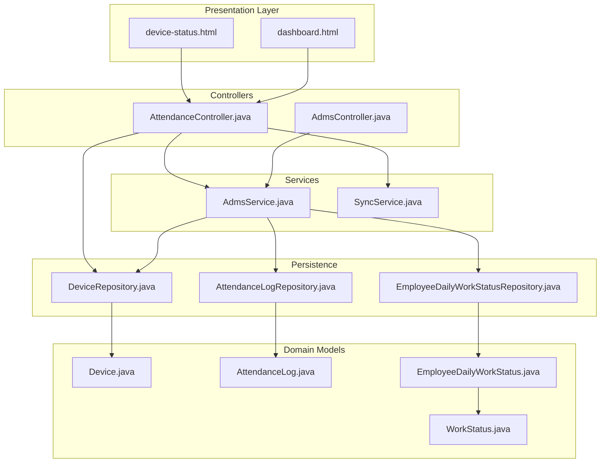
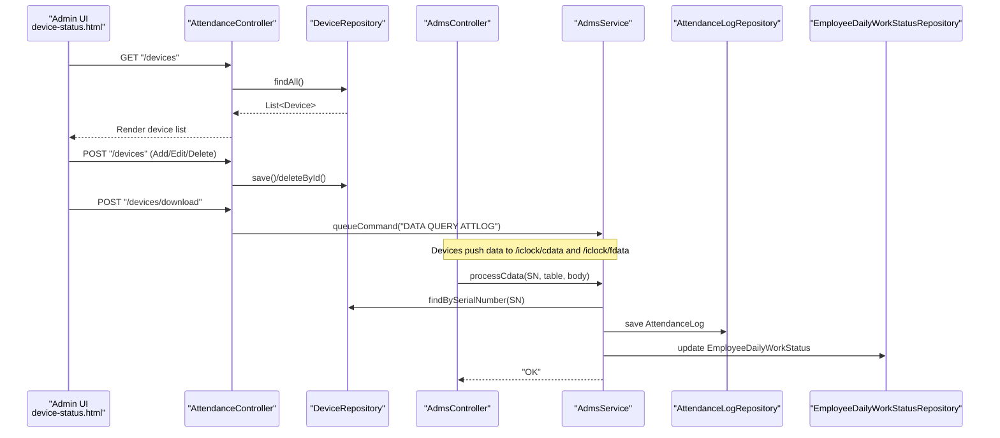
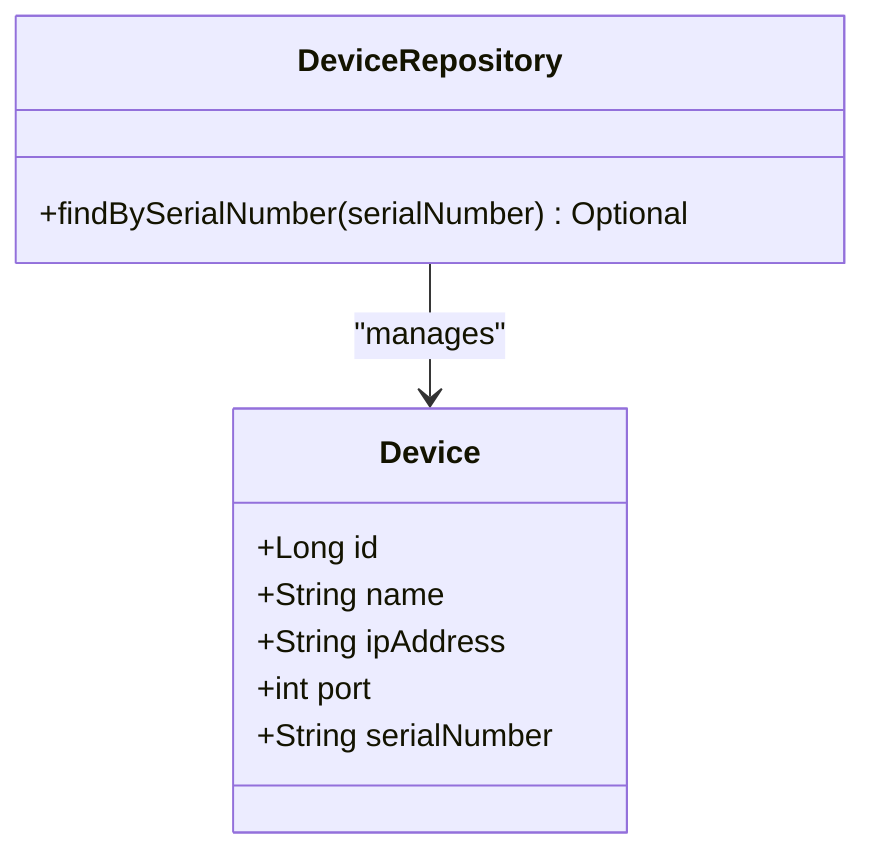
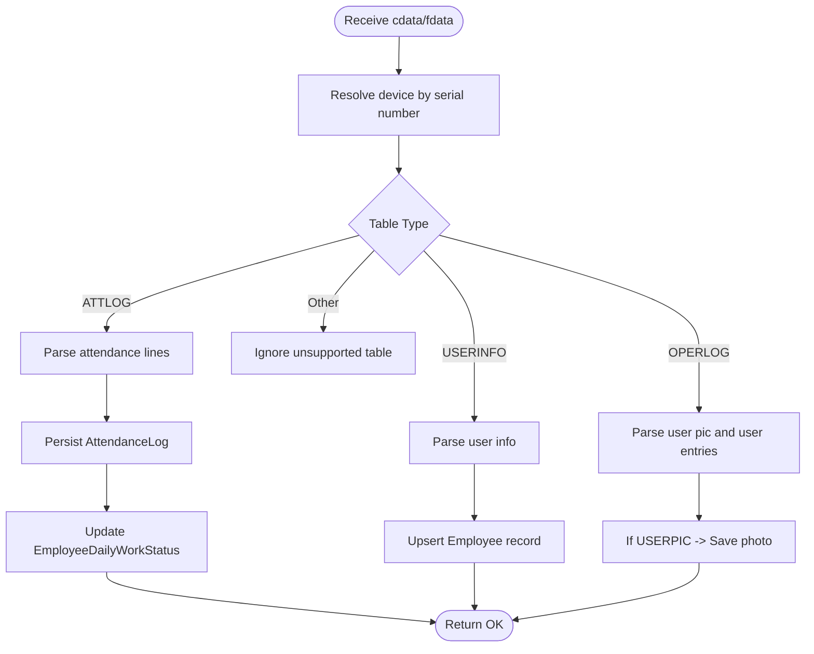
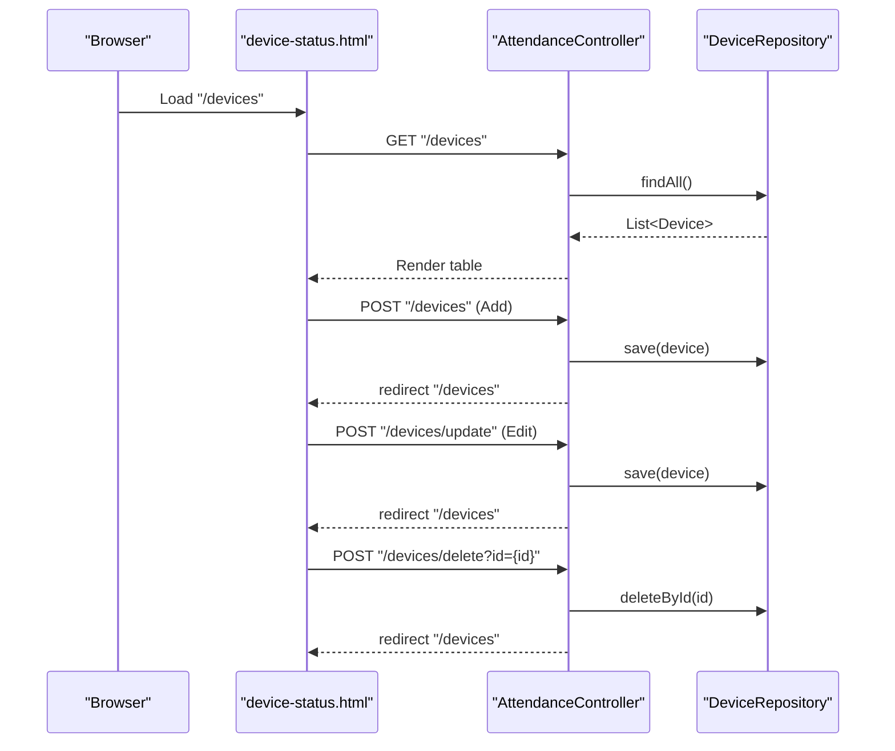
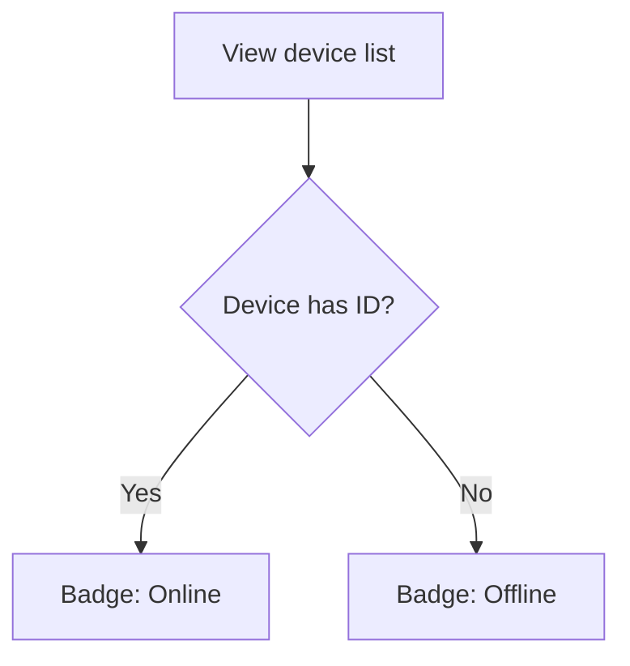
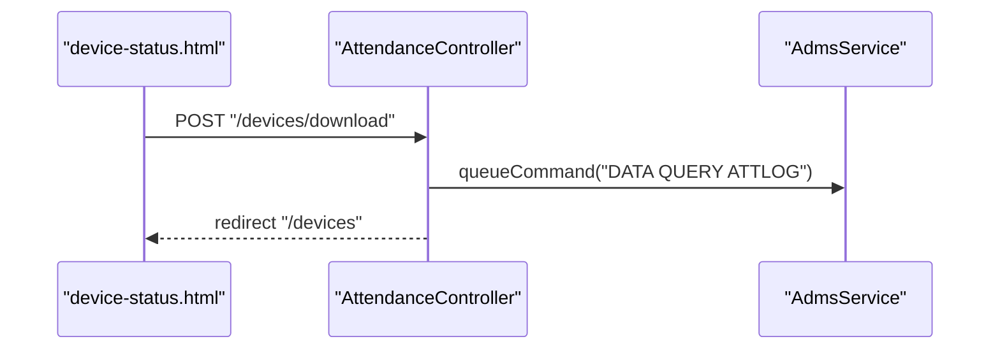
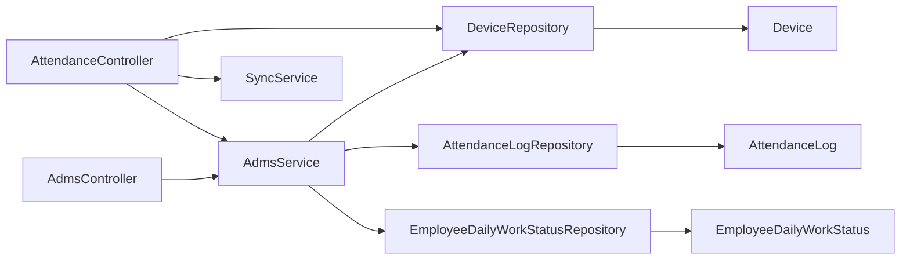

# Device Management

<cite>
**Referenced Files in This Document**
- [Device.java](file://src/main/java/root/cyb/mh/attendancesystem/model/Device.java)
- [DeviceRepository.java](file://src/main/java/root/cyb/mh/attendancesystem/repository/DeviceRepository.java)
- [AttendanceLog.java](file://src/main/java/root/cyb/mh/attendancesystem/model/AttendanceLog.java)
- [EmployeeDailyWorkStatus.java](file://src/main/java/root/cyb/mh/attendancesystem/model/EmployeeDailyWorkStatus.java)
- [WorkStatus.java](file://src/main/java/root/cyb/mh/attendancesystem/model/WorkStatus.java)
- [EmployeeDailyWorkStatusRepository.java](file://src/main/java/root/cyb/mh/attendancesystem/repository/EmployeeDailyWorkStatusRepository.java)
- [AdmsController.java](file://src/main/java/root/cyb/mh/attendancesystem/controller/AdmsController.java)
- [AttendanceController.java](file://src/main/java/root/cyb/mh/attendancesystem/controller/AttendanceController.java)
- [AdmsService.java](file://src/main/java/root/cyb/mh/attendancesystem/service/AdmsService.java)
- [SyncService.java](file://src/main/java/root/cyb/mh/attendancesystem/service/SyncService.java)
- [device-status.html](file://src/main/resources/templates/device-status.html)
- [dashboard.html](file://src/main/resources/templates/dashboard.html)
</cite>

## Table of Contents
1. [Introduction](#introduction)
2. [Project Structure](#project-structure)
3. [Core Components](#core-components)
4. [Architecture Overview](#architecture-overview)
5. [Detailed Component Analysis](#detailed-component-analysis)
6. [Dependency Analysis](#dependency-analysis)
7. [Performance Considerations](#performance-considerations)
8. [Troubleshooting Guide](#troubleshooting-guide)
9. [Conclusion](#conclusion)
10. [Appendices](#appendices)

## Introduction
This document explains the device management functionality for the attendance system. It covers device registration, configuration, status monitoring, administrative operations, and integration with the attendance data pipeline. It also documents the Device entity, CRUD operations, device status tracking, synchronization processes, error handling for disconnected devices, and best practices for maintenance and troubleshooting.

## Project Structure
The device management feature spans model, repository, controller, service, and UI template layers. Devices are represented by a simple entity with network connection attributes and optional serial number. Controllers expose endpoints to manage devices and trigger synchronization. Services implement the ADMS protocol handlers and attendance data ingestion. Templates render device lists and actions.

**Diagram sources**
- [device-status.html](file://src/main/resources/templates/device-status.html)
- [dashboard.html](file://src/main/resources/templates/dashboard.html)
- [AttendanceController.java](file://src/main/java/root/cyb/mh/attendancesystem/controller/AttendanceController.java)
- [AdmsController.java](file://src/main/java/root/cyb/mh/attendancesystem/controller/AdmsController.java)
- [AdmsService.java](file://src/main/java/root/cyb/mh/attendancesystem/service/AdmsService.java)
- [SyncService.java](file://src/main/java/root/cyb/mh/attendancesystem/service/SyncService.java)
- [DeviceRepository.java](file://src/main/java/root/cyb/mh/attendancesystem/repository/DeviceRepository.java)
- [Device.java](file://src/main/java/root/cyb/mh/attendancesystem/model/Device.java)
- [AttendanceLog.java](file://src/main/java/root/cyb/mh/attendancesystem/model/AttendanceLog.java)
- [EmployeeDailyWorkStatus.java](file://src/main/java/root/cyb/mh/attendancesystem/model/EmployeeDailyWorkStatus.java)
- [EmployeeDailyWorkStatusRepository.java](file://src/main/java/root/cyb/mh/attendancesystem/repository/EmployeeDailyWorkStatusRepository.java)
- [WorkStatus.java](file://src/main/java/root/cyb/mh/attendancesystem/model/WorkStatus.java)

**Section sources**
- [Device.java:1-26](file://src/main/java/root/cyb/mh/attendancesystem/model/Device.java#L1-L26)
- [DeviceRepository.java:1-11](file://src/main/java/root/cyb/mh/attendancesystem/repository/DeviceRepository.java#L1-L11)
- [AttendanceLog.java:1-27](file://src/main/java/root/cyb/mh/attendancesystem/model/AttendanceLog.java#L1-L27)
- [EmployeeDailyWorkStatus.java:1-45](file://src/main/java/root/cyb/mh/attendancesystem/model/EmployeeDailyWorkStatus.java#L1-L45)
- [WorkStatus.java:1-14](file://src/main/java/root/cyb/mh/attendancesystem/model/WorkStatus.java#L1-L14)
- [AdmsController.java:1-64](file://src/main/java/root/cyb/mh/attendancesystem/controller/AdmsController.java#L1-L64)
- [AttendanceController.java:1-75](file://src/main/java/root/cyb/mh/attendancesystem/controller/AttendanceController.java#L1-L75)
- [AdmsService.java:1-263](file://src/main/java/root/cyb/mh/attendancesystem/service/AdmsService.java#L1-L263)
- [SyncService.java:1-20](file://src/main/java/root/cyb/mh/attendancesystem/service/SyncService.java#L1-L20)
- [device-status.html:1-159](file://src/main/resources/templates/device-status.html#L1-L159)
- [dashboard.html:408-426](file://src/main/resources/templates/dashboard.html#L408-L426)

## Core Components
- Device entity: Stores device identity and connection details (name, IP address, port, serial number).
- DeviceRepository: JPA repository with a convenience lookup by serial number.
- AttendanceLog: Captures individual attendance events with employee ID, timestamp, and device ID.
- EmployeeDailyWorkStatus: Tracks daily work status per employee and supports status transitions based on attendance logs.
- AdmsController: Exposes endpoints for device handshakes, data push, command requests, and command result handling.
- AttendanceController: Manages device CRUD operations via UI and triggers synchronization actions.
- AdmsService: Processes incoming device data (attendance logs, user info, operator logs), persists logs, and updates daily work statuses.
- SyncService: Provides scheduled synchronization hooks; current implementation emphasizes device-push protocol.

**Section sources**
- [Device.java:15-25](file://src/main/java/root/cyb/mh/attendancesystem/model/Device.java#L15-L25)
- [DeviceRepository.java:8-10](file://src/main/java/root/cyb/mh/attendancesystem/repository/DeviceRepository.java#L8-L10)
- [AttendanceLog.java:17-26](file://src/main/java/root/cyb/mh/attendancesystem/model/AttendanceLog.java#L17-L26)
- [EmployeeDailyWorkStatus.java:12-44](file://src/main/java/root/cyb/mh/attendancesystem/model/EmployeeDailyWorkStatus.java#L12-L44)
- [AdmsController.java:9-64](file://src/main/java/root/cyb/mh/attendancesystem/controller/AdmsController.java#L9-L64)
- [AttendanceController.java:21-75](file://src/main/java/root/cyb/mh/attendancesystem/controller/AttendanceController.java#L21-L75)
- [AdmsService.java:17-263](file://src/main/java/root/cyb/mh/attendancesystem/service/AdmsService.java#L17-L263)
- [SyncService.java:7-20](file://src/main/java/root/cyb/mh/attendancesystem/service/SyncService.java#L7-L20)

## Architecture Overview
The system follows a device-push architecture. Devices initiate communication by pushing data to the backend. The backend parses and ingests the data, updates attendance logs, and recalculates daily work statuses. Administrative actions (add, edit, delete devices) are exposed via a web UI and controller endpoints. Synchronization can be triggered manually or via scheduled tasks.

**Diagram sources**
- [device-status.html:33-74](file://src/main/resources/templates/device-status.html#L33-L74)
- [AttendanceController.java:33-74](file://src/main/java/root/cyb/mh/attendancesystem/controller/AttendanceController.java#L33-L74)
- [AdmsController.java:15-55](file://src/main/java/root/cyb/mh/attendancesystem/controller/AdmsController.java#L15-L55)
- [AdmsService.java:42-89](file://src/main/java/root/cyb/mh/attendancesystem/service/AdmsService.java#L42-L89)
- [DeviceRepository.java:9](file://src/main/java/root/cyb/mh/attendancesystem/repository/DeviceRepository.java#L9)
- [AttendanceLog.java:17-26](file://src/main/java/root/cyb/mh/attendancesystem/model/AttendanceLog.java#L17-L26)
- [EmployeeDailyWorkStatus.java:12-44](file://src/main/java/root/cyb/mh/attendancesystem/model/EmployeeDailyWorkStatus.java#L12-L44)

## Detailed Component Analysis

### Device Entity and Repository
- Device stores identification and connectivity metadata. Serial number is optional and used to correlate with incoming device data.
- DeviceRepository provides a lookup by serial number to resolve device IDs during data ingestion.

**Diagram sources**
- [Device.java:15-25](file://src/main/java/root/cyb/mh/attendancesystem/model/Device.java#L15-L25)
- [DeviceRepository.java:8-10](file://src/main/java/root/cyb/mh/attendancesystem/repository/DeviceRepository.java#L8-L10)

**Section sources**
- [Device.java:15-25](file://src/main/java/root/cyb/mh/attendancesystem/model/Device.java#L15-L25)
- [DeviceRepository.java:8-10](file://src/main/java/root/cyb/mh/attendancesystem/repository/DeviceRepository.java#L8-L10)

### Attendance Data Ingestion and Status Updates
- AdmsService receives device data via AdmsController endpoints, resolves device IDs by serial number, parses tables (attendance logs, user info, operator logs), persists logs, and updates daily work statuses accordingly.

**Diagram sources**
- [AdmsController.java:15-55](file://src/main/java/root/cyb/mh/attendancesystem/controller/AdmsController.java#L15-L55)
- [AdmsService.java:42-261](file://src/main/java/root/cyb/mh/attendancesystem/service/AdmsService.java#L42-L261)
- [DeviceRepository.java:9](file://src/main/java/root/cyb/mh/attendancesystem/repository/DeviceRepository.java#L9)
- [AttendanceLog.java:17-26](file://src/main/java/root/cyb/mh/attendancesystem/model/AttendanceLog.java#L17-L26)
- [EmployeeDailyWorkStatus.java:12-44](file://src/main/java/root/cyb/mh/attendancesystem/model/EmployeeDailyWorkStatus.java#L12-L44)

**Section sources**
- [AdmsController.java:15-55](file://src/main/java/root/cyb/mh/attendancesystem/controller/AdmsController.java#L15-L55)
- [AdmsService.java:42-261](file://src/main/java/root/cyb/mh/attendancesystem/service/AdmsService.java#L42-L261)

### Administrative Operations and UI
- AttendanceController exposes GET and POST endpoints to list devices, add, update, and delete devices, and to trigger synchronization actions.
- The UI template renders device rows, allows editing via modal forms, and provides actions to download logs/users and delete devices.

**Diagram sources**
- [device-status.html:33-151](file://src/main/resources/templates/device-status.html#L33-L151)
- [AttendanceController.java:33-56](file://src/main/java/root/cyb/mh/attendancesystem/controller/AttendanceController.java#L33-L56)
- [DeviceRepository.java:8-10](file://src/main/java/root/cyb/mh/attendancesystem/repository/DeviceRepository.java#L8-L10)

**Section sources**
- [AttendanceController.java:33-56](file://src/main/java/root/cyb/mh/attendancesystem/controller/AttendanceController.java#L33-L56)
- [device-status.html:33-151](file://src/main/resources/templates/device-status.html#L33-L151)

### Device Status Monitoring
- The UI displays a “Status” badge for each device row. The template logic indicates online/offline status based on whether the device ID is present, reflecting the presence of a persisted device record.
- Manual synchronization can be initiated from the UI or dashboard to trigger data downloads from devices.

**Diagram sources**
- [device-status.html:41-44](file://src/main/resources/templates/device-status.html#L41-L44)

**Section sources**
- [device-status.html:41-44](file://src/main/resources/templates/device-status.html#L41-L44)
- [dashboard.html:415-422](file://src/main/resources/templates/dashboard.html#L415-L422)

### Synchronization and Commands
- SyncService defines a scheduled task and a per-device sync method. The current design emphasizes device-push ingestion; scheduled sync is not actively fetching data.
- AttendanceController exposes a manual sync endpoint and triggers a command to download logs from devices via AdmsService.

**Diagram sources**
- [device-status.html:98-102](file://src/main/resources/templates/device-status.html#L98-L102)
- [AttendanceController.java:67-74](file://src/main/java/root/cyb/mh/attendancesystem/controller/AttendanceController.java#L67-L74)
- [AdmsService.java:31-40](file://src/main/java/root/cyb/mh/attendancesystem/service/AdmsService.java#L31-L40)

**Section sources**
- [SyncService.java:10-19](file://src/main/java/root/cyb/mh/attendancesystem/service/SyncService.java#L10-L19)
- [AttendanceController.java:58-74](file://src/main/java/root/cyb/mh/attendancesystem/controller/AttendanceController.java#L58-L74)
- [AdmsService.java:31-40](file://src/main/java/root/cyb/mh/attendancesystem/service/AdmsService.java#L31-L40)

## Dependency Analysis
- Controllers depend on repositories and services to fulfill requests.
- AdmsService depends on DeviceRepository, AttendanceLogRepository, and EmployeeDailyWorkStatusRepository.
- UI templates depend on controller endpoints and model attributes.

**Diagram sources**
- [AttendanceController.java:24-28](file://src/main/java/root/cyb/mh/attendancesystem/controller/AttendanceController.java#L24-L28)
- [AdmsController.java:12-13](file://src/main/java/root/cyb/mh/attendancesystem/controller/AdmsController.java#L12-L13)
- [AdmsService.java:20-27](file://src/main/java/root/cyb/mh/attendancesystem/service/AdmsService.java#L20-L27)
- [DeviceRepository.java:8-10](file://src/main/java/root/cyb/mh/attendancesystem/repository/DeviceRepository.java#L8-L10)
- [AttendanceLog.java:17-26](file://src/main/java/root/cyb/mh/attendancesystem/model/AttendanceLog.java#L17-L26)
- [EmployeeDailyWorkStatus.java:12-44](file://src/main/java/root/cyb/mh/attendancesystem/model/EmployeeDailyWorkStatus.java#L12-L44)

**Section sources**
- [AttendanceController.java:24-28](file://src/main/java/root/cyb/mh/attendancesystem/controller/AttendanceController.java#L24-L28)
- [AdmsController.java:12-13](file://src/main/java/root/cyb/mh/attendancesystem/controller/AdmsController.java#L12-L13)
- [AdmsService.java:20-27](file://src/main/java/root/cyb/mh/attendancesystem/service/AdmsService.java#L20-L27)

## Performance Considerations
- Data ingestion: AdmsService parses multi-line device payloads and iterates over entries. For high-frequency devices, consider batching persistence and avoiding redundant checks.
- Duplicate prevention: AttendanceLog existence checks prevent duplicates; ensure database indexes exist on employeeId, timestamp, and deviceId for optimal performance.
- Daily status updates: Recalculation occurs per log entry; batch updates or periodic reconciliation could reduce overhead.
- Network I/O: Device-push protocol reduces server polling; maintain low-latency network paths to device endpoints.

## Troubleshooting Guide
- Unknown device serial number: AdmsService logs unknown SNs when resolving device IDs. Ensure the device’s serial number matches the configured Device record.
- Duplicate attendance logs: Existence checks prevent duplicate AttendanceLog entries; verify timestamps and device IDs are correctly parsed.
- Daily work status anomalies: Status transitions rely on log timing and prior status. Review EmployeeDailyWorkStatus updates around shift boundaries and break durations.
- UI status badges: The template shows online/offline based on device ID presence. Confirm that devices are saved with accurate serial numbers so resolution succeeds.
- Manual sync not retrieving data: Ensure the command queue is populated and that devices are pushing data to the correct endpoints (/iclock/cdata, /iclock/fdata).

**Section sources**
- [AdmsService.java:44-51](file://src/main/java/root/cyb/mh/attendancesystem/service/AdmsService.java#L44-L51)
- [AdmsService.java:219-227](file://src/main/java/root/cyb/mh/attendancesystem/service/AdmsService.java#L219-L227)
- [device-status.html:41-44](file://src/main/resources/templates/device-status.html#L41-L44)

## Conclusion
The device management subsystem integrates cleanly with the attendance pipeline. Devices are registered and configured via the UI and controller endpoints, while data ingestion is handled through a robust device-push protocol. Daily work status tracking is updated automatically upon log ingestion. Administrators can monitor device status and trigger synchronization actions as needed.

## Appendices

### Practical Examples

- Add a new device
  - Navigate to the device list page and use the “Add New Device” form to submit device details (name, IP address, port, optional serial number).
  - The controller saves the device and redirects back to the list.

  **Section sources**
  - [device-status.html:126-153](file://src/main/resources/templates/device-status.html#L126-L153)
  - [AttendanceController.java:40-44](file://src/main/java/root/cyb/mh/attendancesystem/controller/AttendanceController.java#L40-L44)

- Update device configuration
  - Open the edit modal for a device and modify its attributes. Submit to persist changes.

  **Section sources**
  - [device-status.html:51-96](file://src/main/resources/templates/device-status.html#L51-L96)
  - [AttendanceController.java:46-50](file://src/main/java/root/cyb/mh/attendancesystem/controller/AttendanceController.java#L46-L50)

- Remove an obsolete device
  - Use the delete action on the device row. Confirm the deletion when prompted.

  **Section sources**
  - [device-status.html:108-114](file://src/main/resources/templates/device-status.html#L108-L114)
  - [AttendanceController.java:52-56](file://src/main/java/root/cyb/mh/attendancesystem/controller/AttendanceController.java#L52-L56)

- Monitor device health
  - The device list shows a “Status” badge indicating online/offline. Online is inferred from successful device persistence.

  **Section sources**
  - [device-status.html:41-44](file://src/main/resources/templates/device-status.html#L41-L44)

- Trigger device synchronization
  - From the device list or dashboard, click the “Sync Devices” action to queue a command for downloading logs from devices.

  **Section sources**
  - [device-status.html:98-102](file://src/main/resources/templates/device-status.html#L98-L102)
  - [dashboard.html:415-422](file://src/main/resources/templates/dashboard.html#L415-L422)
  - [AttendanceController.java:67-74](file://src/main/java/root/cyb/mh/attendancesystem/controller/AttendanceController.java#L67-L74)
  - [AdmsService.java:31-40](file://src/main/java/root/cyb/mh/attendancesystem/service/AdmsService.java#L31-L40)

### Best Practices
- Maintain accurate serial numbers for devices to enable reliable device resolution during data ingestion.
- Keep device network connectivity stable and ensure firewall rules allow inbound connections to the ADMS endpoints.
- Periodically review device lists and remove inactive or decommissioned devices.
- Monitor daily work status updates and investigate anomalies promptly to maintain accurate reporting.