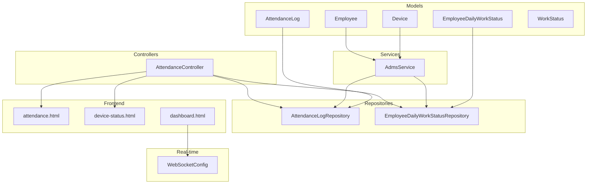
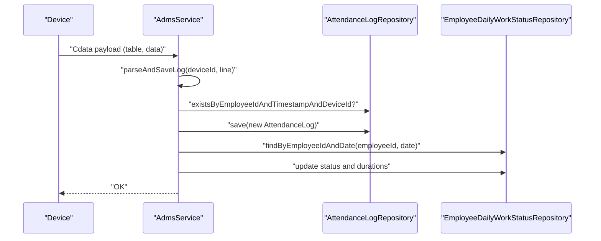
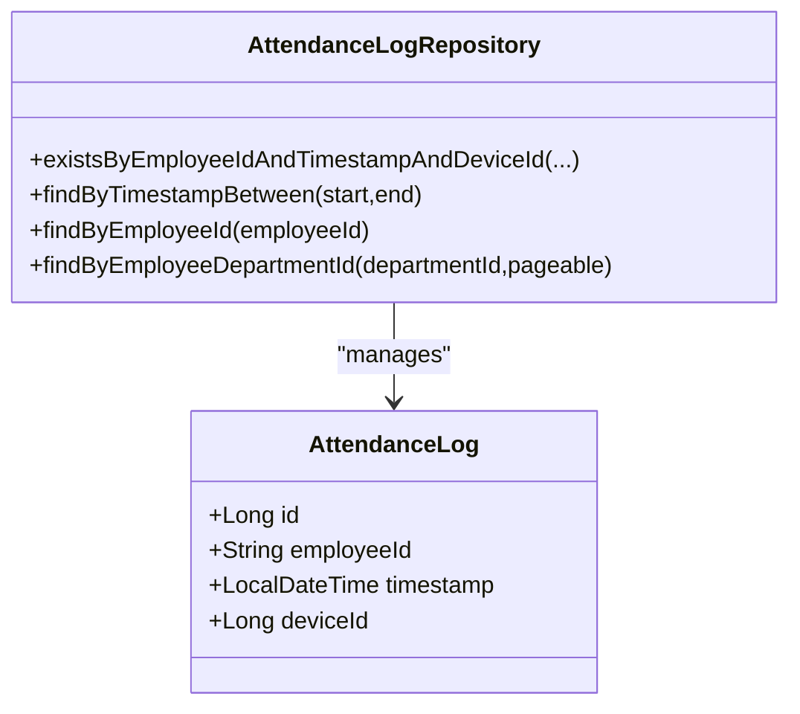
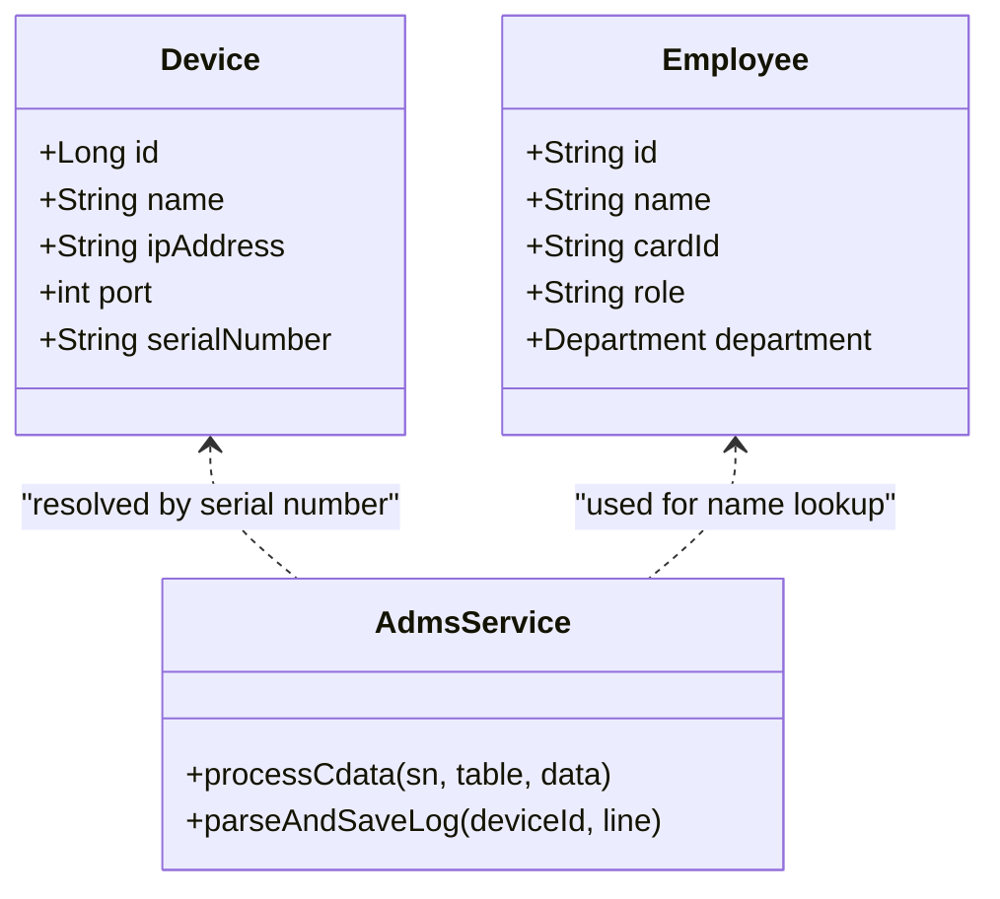
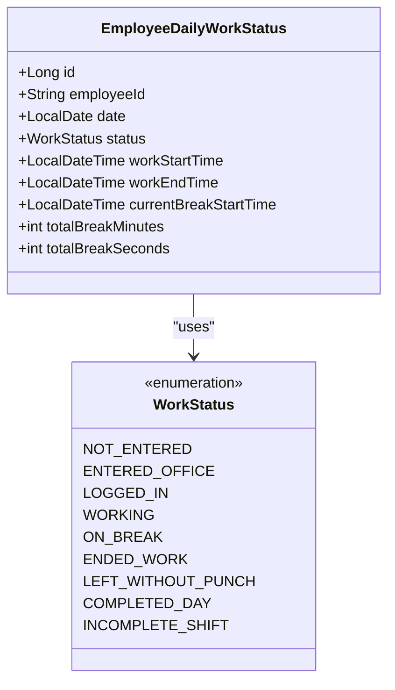
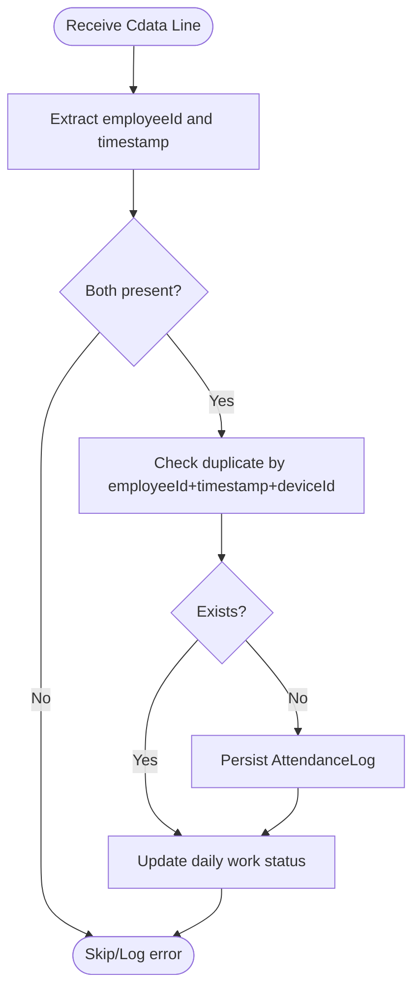
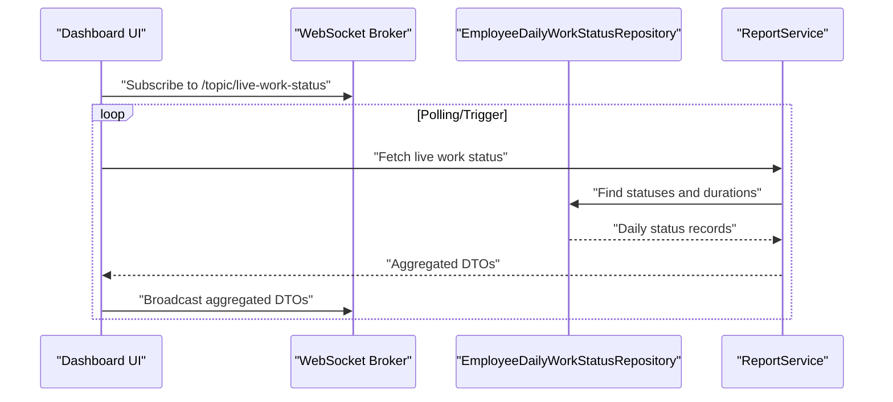
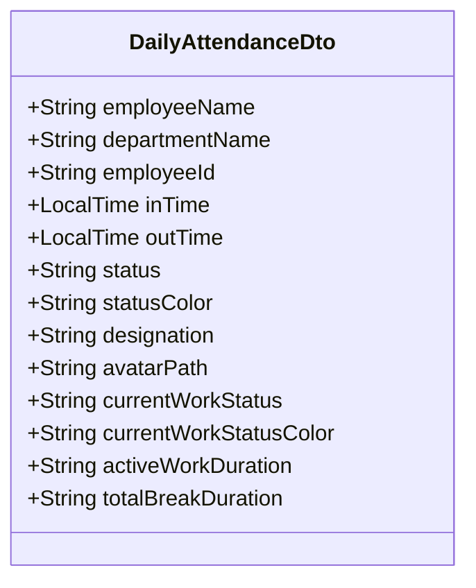
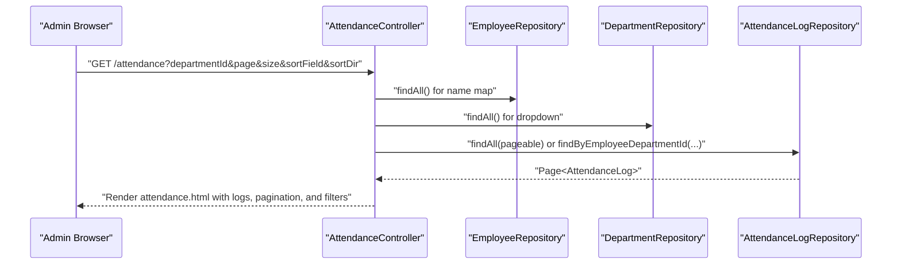
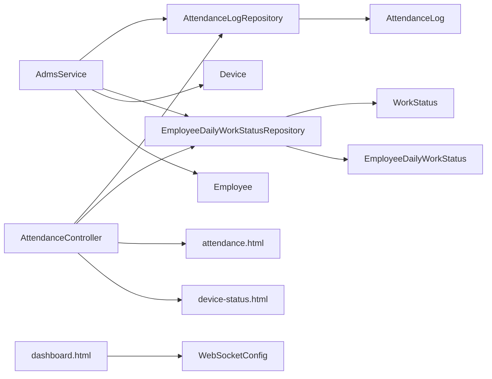

# Real-time Attendance Tracking

<cite>
**Referenced Files in This Document**
- [AttendanceLog.java](file://src/main/java/root/cyb/mh/attendancesystem/model/AttendanceLog.java)
- [Device.java](file://src/main/java/root/cyb/mh/attendancesystem/model/Device.java)
- [Employee.java](file://src/main/java/root/cyb/mh/attendancesystem/model/Employee.java)
- [EmployeeDailyWorkStatus.java](file://src/main/java/root/cyb/mh/attendancesystem/model/EmployeeDailyWorkStatus.java)
- [WorkStatus.java](file://src/main/java/root/cyb/mh/attendancesystem/model/WorkStatus.java)
- [AttendanceLogRepository.java](file://src/main/java/root/cyb/mh/attendancesystem/repository/AttendanceLogRepository.java)
- [EmployeeDailyWorkStatusRepository.java](file://src/main/java/root/cyb/mh/attendancesystem/repository/EmployeeDailyWorkStatusRepository.java)
- [AttendanceController.java](file://src/main/java/root/cyb/mh/attendancesystem/controller/AttendanceController.java)
- [AdmsService.java](file://src/main/java/root/cyb/mh/attendancesystem/service/AdmsService.java)
- [WebSocketConfig.java](file://src/main/java/root/cyb/mh/attendancesystem/config/WebSocketConfig.java)
- [DailyAttendanceDto.java](file://src/main/java/root/cyb/mh/attendancesystem/dto/DailyAttendanceDto.java)
- [attendance.html](file://src/main/resources/templates/attendance.html)
- [device-status.html](file://src/main/resources/templates/device-status.html)
- [dashboard.html](file://src/main/resources/templates/dashboard.html)
</cite>

## Table of Contents
1. [Introduction](#introduction)
2. [Project Structure](#project-structure)
3. [Core Components](#core-components)
4. [Architecture Overview](#architecture-overview)
5. [Detailed Component Analysis](#detailed-component-analysis)
6. [Dependency Analysis](#dependency-analysis)
7. [Performance Considerations](#performance-considerations)
8. [Troubleshooting Guide](#troubleshooting-guide)
9. [Conclusion](#conclusion)
10. [Appendices](#appendices)

## Introduction
This document explains the real-time attendance tracking functionality implemented in the backend. It covers how attendance logs are captured from devices, persisted to the database, and surfaced to administrators and dashboards. It also documents timestamp management, employee status updates, and the integration points for live monitoring via WebSocket. Practical examples demonstrate retrieving attendance data, filtering by date ranges, checking employee status, and integrating with WebSocket real-time updates. Finally, it outlines performance considerations and caching strategies for high-volume attendance data.

## Project Structure
The attendance tracking system spans models, repositories, services, controllers, DTOs, and Thymeleaf templates. The key areas are:
- Data models for attendance logs, devices, employees, and daily work status
- Repositories for persistence and queries
- Service layer for ingestion and status transitions
- Controllers for administrative views and device synchronization
- DTOs for frontend consumption
- WebSocket configuration for live updates
- Templates for attendance and device management pages

**Diagram sources**
- [AttendanceLog.java:1-27](file://src/main/java/root/cyb/mh/attendancesystem/model/AttendanceLog.java#L1-L27)
- [Device.java:1-26](file://src/main/java/root/cyb/mh/attendancesystem/model/Device.java#L1-L26)
- [Employee.java:1-64](file://src/main/java/root/cyb/mh/attendancesystem/model/Employee.java#L1-L64)
- [EmployeeDailyWorkStatus.java:1-45](file://src/main/java/root/cyb/mh/attendancesystem/model/EmployeeDailyWorkStatus.java#L1-L45)
- [WorkStatus.java:1-14](file://src/main/java/root/cyb/mh/attendancesystem/model/WorkStatus.java#L1-L14)
- [AttendanceLogRepository.java:1-22](file://src/main/java/root/cyb/mh/attendancesystem/repository/AttendanceLogRepository.java#L1-L22)
- [EmployeeDailyWorkStatusRepository.java:1-21](file://src/main/java/root/cyb/mh/attendancesystem/repository/EmployeeDailyWorkStatusRepository.java#L1-L21)
- [AdmsService.java:1-263](file://src/main/java/root/cyb/mh/attendancesystem/service/AdmsService.java#L1-L263)
- [AttendanceController.java:1-132](file://src/main/java/root/cyb/mh/attendancesystem/controller/AttendanceController.java#L1-L132)
- [attendance.html:1-101](file://src/main/resources/templates/attendance.html#L1-L101)
- [device-status.html:1-159](file://src/main/resources/templates/device-status.html#L1-L159)
- [dashboard.html:181-1197](file://src/main/resources/templates/dashboard.html#L181-L1197)
- [WebSocketConfig.java:1-26](file://src/main/java/root/cyb/mh/attendancesystem/config/WebSocketConfig.java#L1-L26)

**Section sources**
- [AttendanceLog.java:1-27](file://src/main/java/root/cyb/mh/attendancesystem/model/AttendanceLog.java#L1-L27)
- [AttendanceLogRepository.java:1-22](file://src/main/java/root/cyb/mh/attendancesystem/repository/AttendanceLogRepository.java#L1-L22)
- [AdmsService.java:1-263](file://src/main/java/root/cyb/mh/attendancesystem/service/AdmsService.java#L1-L263)
- [AttendanceController.java:1-132](file://src/main/java/root/cyb/mh/attendancesystem/controller/AttendanceController.java#L1-L132)
- [attendance.html:1-101](file://src/main/resources/templates/attendance.html#L1-L101)
- [device-status.html:1-159](file://src/main/resources/templates/device-status.html#L1-L159)
- [dashboard.html:181-1197](file://src/main/resources/templates/dashboard.html#L181-L1197)
- [WebSocketConfig.java:1-26](file://src/main/java/root/cyb/mh/attendancesystem/config/WebSocketConfig.java#L1-L26)

## Core Components
- AttendanceLog: Stores individual check-in/out events with employee identifier, timestamp, and device identifier.
- Device: Represents physical attendance devices with IP address, port, and serial number.
- Employee: Employee metadata used for name lookup and department association.
- EmployeeDailyWorkStatus: Tracks daily work state transitions and durations per employee.
- WorkStatus: Enumerates possible daily statuses (e.g., NOT_ENTERED, ENTERED_OFFICE, WORKING, ON_BREAK, ENDED_WORK, COMPLETED_DAY, INCOMPLETE_SHIFT).
- AttendanceLogRepository: Provides CRUD and specialized queries for attendance logs, including date-range filtering and department-based pagination.
- EmployeeDailyWorkStatusRepository: Manages daily status records with date-based filters and status-based queries.
- AdmsService: Parses device-provided data, persists attendance logs, and updates daily work status accordingly.
- AttendanceController: Serves administrative pages for device management and attendance viewing with pagination and department filtering.
- DailyAttendanceDto: DTO tailored for daily attendance summaries and live work status integration fields for the frontend.
- WebSocketConfig: Enables STOMP over SockJS for real-time updates.

**Section sources**
- [AttendanceLog.java:1-27](file://src/main/java/root/cyb/mh/attendancesystem/model/AttendanceLog.java#L1-L27)
- [Device.java:1-26](file://src/main/java/root/cyb/mh/attendancesystem/model/Device.java#L1-L26)
- [Employee.java:1-64](file://src/main/java/root/cyb/mh/attendancesystem/model/Employee.java#L1-L64)
- [EmployeeDailyWorkStatus.java:1-45](file://src/main/java/root/cyb/mh/attendancesystem/model/EmployeeDailyWorkStatus.java#L1-L45)
- [WorkStatus.java:1-14](file://src/main/java/root/cyb/mh/attendancesystem/model/WorkStatus.java#L1-L14)
- [AttendanceLogRepository.java:1-22](file://src/main/java/root/cyb/mh/attendancesystem/repository/AttendanceLogRepository.java#L1-L22)
- [EmployeeDailyWorkStatusRepository.java:1-21](file://src/main/java/root/cyb/mh/attendancesystem/repository/EmployeeDailyWorkStatusRepository.java#L1-L21)
- [AdmsService.java:1-263](file://src/main/java/root/cyb/mh/attendancesystem/service/AdmsService.java#L1-L263)
- [AttendanceController.java:1-132](file://src/main/java/root/cyb/mh/attendancesystem/controller/AttendanceController.java#L1-L132)
- [DailyAttendanceDto.java:1-24](file://src/main/java/root/cyb/mh/attendancesystem/dto/DailyAttendanceDto.java#L1-L24)
- [WebSocketConfig.java:1-26](file://src/main/java/root/cyb/mh/attendancesystem/config/WebSocketConfig.java#L1-L26)

## Architecture Overview
The system ingests attendance data from devices, persists logs, and updates daily work status. Administrative views render paginated logs and device lists. Live monitoring integrates with WebSocket for real-time status updates on dashboards.

**Diagram sources**
- [AdmsService.java:184-261](file://src/main/java/root/cyb/mh/attendancesystem/service/AdmsService.java#L184-L261)
- [AttendanceLogRepository.java:11-11](file://src/main/java/root/cyb/mh/attendancesystem/repository/AttendanceLogRepository.java#L11-L11)
- [EmployeeDailyWorkStatusRepository.java:13-13](file://src/main/java/root/cyb/mh/attendancesystem/repository/EmployeeDailyWorkStatusRepository.java#L13-L13)

## Detailed Component Analysis

### AttendanceLog Entity and Repository
- AttendanceLog captures employeeId, timestamp, and deviceId. It is persisted via AttendanceLogRepository.
- Repository supports:
  - Existence checks to prevent duplicates
  - Date-range queries for logs
  - Employee-specific queries
  - Department-based paginated queries using a JPQL join with Employee and Department

**Diagram sources**
- [AttendanceLog.java:19-26](file://src/main/java/root/cyb/mh/attendancesystem/model/AttendanceLog.java#L19-L26)
- [AttendanceLogRepository.java:10-21](file://src/main/java/root/cyb/mh/attendancesystem/repository/AttendanceLogRepository.java#L10-L21)

**Section sources**
- [AttendanceLog.java:1-27](file://src/main/java/root/cyb/mh/attendancesystem/model/AttendanceLog.java#L1-L27)
- [AttendanceLogRepository.java:1-22](file://src/main/java/root/cyb/mh/attendancesystem/repository/AttendanceLogRepository.java#L1-L22)

### Device and Employee Integration
- Device stores device identification and connection details.
- Employee holds employee metadata used for name resolution in views.
- AdmsService parses incoming device data, resolves device IDs, and persists logs.

**Diagram sources**
- [Device.java:17-25](file://src/main/java/root/cyb/mh/attendancesystem/model/Device.java#L17-L25)
- [Employee.java:15-31](file://src/main/java/root/cyb/mh/attendancesystem/model/Employee.java#L15-L31)
- [AdmsService.java:42-89](file://src/main/java/root/cyb/mh/attendancesystem/service/AdmsService.java#L42-L89)

**Section sources**
- [Device.java:1-26](file://src/main/java/root/cyb/mh/attendancesystem/model/Device.java#L1-L26)
- [Employee.java:1-64](file://src/main/java/root/cyb/mh/attendancesystem/model/Employee.java#L1-L64)
- [AdmsService.java:184-261](file://src/main/java/root/cyb/mh/attendancesystem/service/AdmsService.java#L184-L261)

### EmployeeDailyWorkStatus and Status Transitions
- EmployeeDailyWorkStatus tracks daily status and durations.
- AdmsService updates status based on log timestamps and daily constraints.

**Diagram sources**
- [EmployeeDailyWorkStatus.java:12-44](file://src/main/java/root/cyb/mh/attendancesystem/model/EmployeeDailyWorkStatus.java#L12-L44)
- [WorkStatus.java:3-13](file://src/main/java/root/cyb/mh/attendancesystem/model/WorkStatus.java#L3-L13)

**Section sources**
- [EmployeeDailyWorkStatus.java:1-45](file://src/main/java/root/cyb/mh/attendancesystem/model/EmployeeDailyWorkStatus.java#L1-L45)
- [WorkStatus.java:1-14](file://src/main/java/root/cyb/mh/attendancesystem/model/WorkStatus.java#L1-L14)
- [AdmsService.java:232-256](file://src/main/java/root/cyb/mh/attendancesystem/service/AdmsService.java#L232-L256)

### Attendance Logging Mechanism and Timestamp Management
- AdmsService.parseAndSaveLog extracts employeeId and timestamp from device data, normalizes to LocalDateTime, and prevents duplicates using existence checks.
- Duplicate prevention ensures idempotent ingestion even under retries or re-syncs.
- Timestamps are parsed directly from device-provided strings, preserving device timezone characteristics.

**Diagram sources**
- [AdmsService.java:213-256](file://src/main/java/root/cyb/mh/attendancesystem/service/AdmsService.java#L213-L256)
- [AttendanceLogRepository.java:11-11](file://src/main/java/root/cyb/mh/attendancesystem/repository/AttendanceLogRepository.java#L11-L11)

**Section sources**
- [AdmsService.java:184-261](file://src/main/java/root/cyb/mh/attendancesystem/service/AdmsService.java#L184-L261)
- [AttendanceLogRepository.java:11-11](file://src/main/java/root/cyb/mh/attendancesystem/repository/AttendanceLogRepository.java#L11-L11)

### Employee Status Updates and Live Monitoring
- AdmsService updates EmployeeDailyWorkStatus based on log timing and daily limits.
- Frontend dashboard integrates live status updates via WebSocket, enabling real-time monitoring of employee work states.

**Diagram sources**
- [WebSocketConfig.java:14-24](file://src/main/java/root/cyb/mh/attendancesystem/config/WebSocketConfig.java#L14-L24)
- [EmployeeDailyWorkStatusRepository.java:13-20](file://src/main/java/root/cyb/mh/attendancesystem/repository/EmployeeDailyWorkStatusRepository.java#L13-L20)
- [dashboard.html:181-1197](file://src/main/resources/templates/dashboard.html#L181-L1197)

**Section sources**
- [AdmsService.java:232-256](file://src/main/java/root/cyb/mh/attendancesystem/service/AdmsService.java#L232-L256)
- [WebSocketConfig.java:1-26](file://src/main/java/root/cyb/mh/attendancesystem/config/WebSocketConfig.java#L1-L26)
- [dashboard.html:181-1197](file://src/main/resources/templates/dashboard.html#L181-L1197)

### DTO Transformations for Frontend Consumption
- DailyAttendanceDto aggregates employee and daily work status fields for display, including formatted durations and live work status indicators.
- The dashboard template consumes live status data and renders a grid with filtering and refresh controls.

**Diagram sources**
- [DailyAttendanceDto.java:7-23](file://src/main/java/root/cyb/mh/attendancesystem/dto/DailyAttendanceDto.java#L7-L23)

**Section sources**
- [DailyAttendanceDto.java:1-24](file://src/main/java/root/cyb/mh/attendancesystem/dto/DailyAttendanceDto.java#L1-L24)
- [dashboard.html:181-1197](file://src/main/resources/templates/dashboard.html#L181-L1197)

### Administrative Views and Data Retrieval
- AttendanceController serves the attendance log page with pagination, sorting, and department filtering.
- Templates provide forms to manage devices and trigger downloads of logs/users.

**Diagram sources**
- [AttendanceController.java:88-130](file://src/main/java/root/cyb/mh/attendancesystem/controller/AttendanceController.java#L88-L130)
- [attendance.html:14-95](file://src/main/resources/templates/attendance.html#L14-L95)

**Section sources**
- [AttendanceController.java:1-132](file://src/main/java/root/cyb/mh/attendancesystem/controller/AttendanceController.java#L1-L132)
- [attendance.html:1-101](file://src/main/resources/templates/attendance.html#L1-L101)
- [device-status.html:1-159](file://src/main/resources/templates/device-status.html#L1-L159)

## Dependency Analysis
The following diagram highlights key dependencies among components involved in attendance tracking.

**Diagram sources**
- [AttendanceController.java:24-28](file://src/main/java/root/cyb/mh/attendancesystem/controller/AttendanceController.java#L24-L28)
- [AdmsService.java:20-27](file://src/main/java/root/cyb/mh/attendancesystem/service/AdmsService.java#L20-L27)
- [AttendanceLogRepository.java:10-21](file://src/main/java/root/cyb/mh/attendancesystem/repository/AttendanceLogRepository.java#L10-L21)
- [EmployeeDailyWorkStatusRepository.java:12-20](file://src/main/java/root/cyb/mh/attendancesystem/repository/EmployeeDailyWorkStatusRepository.java#L12-L20)
- [Device.java:17-25](file://src/main/java/root/cyb/mh/attendancesystem/model/Device.java#L17-L25)
- [Employee.java:15-31](file://src/main/java/root/cyb/mh/attendancesystem/model/Employee.java#L15-L31)
- [EmployeeDailyWorkStatus.java:21-22](file://src/main/java/root/cyb/mh/attendancesystem/model/EmployeeDailyWorkStatus.java#L21-L22)
- [AttendanceLog.java:19-26](file://src/main/java/root/cyb/mh/attendancesystem/model/AttendanceLog.java#L19-L26)
- [attendance.html:1-101](file://src/main/resources/templates/attendance.html#L1-L101)
- [device-status.html:1-159](file://src/main/resources/templates/device-status.html#L1-L159)
- [dashboard.html:181-1197](file://src/main/resources/templates/dashboard.html#L181-L1197)
- [WebSocketConfig.java:14-24](file://src/main/java/root/cyb/mh/attendancesystem/config/WebSocketConfig.java#L14-L24)

**Section sources**
- [AttendanceController.java:1-132](file://src/main/java/root/cyb/mh/attendancesystem/controller/AttendanceController.java#L1-L132)
- [AdmsService.java:1-263](file://src/main/java/root/cyb/mh/attendancesystem/service/AdmsService.java#L1-L263)
- [AttendanceLogRepository.java:1-22](file://src/main/java/root/cyb/mh/attendancesystem/repository/AttendanceLogRepository.java#L1-L22)
- [EmployeeDailyWorkStatusRepository.java:1-21](file://src/main/java/root/cyb/mh/attendancesystem/repository/EmployeeDailyWorkStatusRepository.java#L1-L21)

## Performance Considerations
- Indexing and Queries
  - Add database indexes on AttendanceLog.employeeId, AttendanceLog.timestamp, and AttendanceLog.deviceId to optimize existence checks and range scans.
  - Consider composite indexes for frequent filter combinations (e.g., employeeId + timestamp).
- Pagination and Sorting
  - Use Pageable with appropriate page sizes to avoid large result sets.
  - For sorting by employeeName, precompute a name-to-id map server-side to minimize joins during rendering.
- Idempotency
  - The existence check prevents duplicate logs, reducing write overhead and index bloat.
- Batch Processing
  - When importing large datasets, batch device data processing to reduce memory pressure and transaction duration.
- Caching Strategies
  - Cache frequently accessed daily status records keyed by employeeId and date to reduce repeated repository calls.
  - Cache device metadata and employee name maps for short TTLs to balance freshness and performance.
  - Cache recent attendance summaries for dashboard rendering to minimize repeated computations.
- Real-time Updates
  - Use WebSocket topics efficiently; broadcast only changed records to reduce bandwidth.
  - Debounce frequent polling in dashboards to avoid flooding the broker.

[No sources needed since this section provides general guidance]

## Troubleshooting Guide
- Duplicate Logs
  - Symptom: Repeated entries for the same employee at the same timestamp.
  - Resolution: Verify existence checks are functioning; ensure device timestamps are unique per event.
- Missing Employee Names in Views
  - Symptom: Unknown employee names in the attendance table.
  - Resolution: Confirm employee records exist and the name map is populated in the controller.
- Incorrect Status Updates
  - Symptom: Daily status does not reflect expected transitions.
  - Resolution: Review AdmsService status update logic and ensure logs arrive within allowed windows.
- Device Connectivity Issues
  - Symptom: Devices appear offline or commands fail to queue.
  - Resolution: Validate device IP/port/serial number and ensure the command queue mechanism is active.
- WebSocket Live Updates Not Appearing
  - Symptom: Dashboard live grid remains empty or stale.
  - Resolution: Confirm WebSocket endpoints are registered and clients subscribe to the correct topic.

**Section sources**
- [AdmsService.java:218-227](file://src/main/java/root/cyb/mh/attendancesystem/service/AdmsService.java#L218-L227)
- [AttendanceController.java:96-108](file://src/main/java/root/cyb/mh/attendancesystem/controller/AttendanceController.java#L96-L108)
- [WebSocketConfig.java:22-24](file://src/main/java/root/cyb/mh/attendancesystem/config/WebSocketConfig.java#L22-L24)

## Conclusion
The attendance tracking system integrates device data ingestion, robust persistence, and daily status management. Administrative views provide efficient browsing and filtering, while WebSocket enables live monitoring on dashboards. By applying indexing, pagination, idempotency checks, and targeted caching, the system scales to handle high-volume attendance data reliably.

[No sources needed since this section summarizes without analyzing specific files]

## Appendices

### Practical Examples

- Retrieve Attendance Data by Date Range
  - Use the repository method to fetch logs within a specific timestamp window.
  - Example path: [AttendanceLogRepository.findByTimestampBetween:13-13](file://src/main/java/root/cyb/mh/attendancesystem/repository/AttendanceLogRepository.java#L13-L13)

- Filter Logs by Employee
  - Use the repository method to retrieve logs for a specific employeeId.
  - Example path: [AttendanceLogRepository.findByEmployeeId:15-15](file://src/main/java/root/cyb/mh/attendancesystem/repository/AttendanceLogRepository.java#L15-L15)

- Check Employee Daily Status
  - Use the repository method to find the daily status record for a given employee and date.
  - Example path: [EmployeeDailyWorkStatusRepository.findByEmployeeIdAndDate:13-13](file://src/main/java/root/cyb/mh/attendancesystem/repository/EmployeeDailyWorkStatusRepository.java#L13-L13)

- Integration with WebSocket Real-time Updates
  - Subscribe to the WebSocket endpoint and destination for live work status broadcasts.
  - Example paths:
    - [WebSocketConfig.registerStompEndpoints:22-24](file://src/main/java/root/cyb/mh/attendancesystem/config/WebSocketConfig.java#L22-L24)
    - [WebSocketConfig.configureMessageBroker:14-19](file://src/main/java/root/cyb/mh/attendancesystem/config/WebSocketConfig.java#L14-L19)
    - [dashboard.html live grid integration:181-1197](file://src/main/resources/templates/dashboard.html#L181-L1197)

- Administrative Pages
  - View attendance logs with pagination and department filtering.
  - Manage devices and trigger downloads of logs/users.
  - Example paths:
    - [attendance.html:1-101](file://src/main/resources/templates/attendance.html#L1-L101)
    - [device-status.html:1-159](file://src/main/resources/templates/device-status.html#L1-L159)
    - [AttendanceController attendance mapping:88-130](file://src/main/java/root/cyb/mh/attendancesystem/controller/AttendanceController.java#L88-L130)

**Section sources**
- [AttendanceLogRepository.java:13-15](file://src/main/java/root/cyb/mh/attendancesystem/repository/AttendanceLogRepository.java#L13-L15)
- [EmployeeDailyWorkStatusRepository.java:13-13](file://src/main/java/root/cyb/mh/attendancesystem/repository/EmployeeDailyWorkStatusRepository.java#L13-L13)
- [WebSocketConfig.java:14-24](file://src/main/java/root/cyb/mh/attendancesystem/config/WebSocketConfig.java#L14-L24)
- [dashboard.html:181-1197](file://src/main/resources/templates/dashboard.html#L181-L1197)
- [attendance.html:1-101](file://src/main/resources/templates/attendance.html#L1-L101)
- [device-status.html:1-159](file://src/main/resources/templates/device-status.html#L1-L159)
- [AttendanceController.java:88-130](file://src/main/java/root/cyb/mh/attendancesystem/controller/AttendanceController.java#L88-L130)