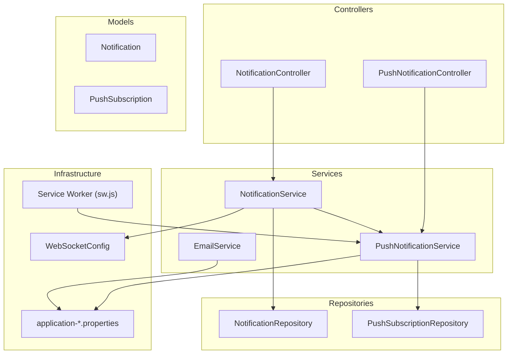
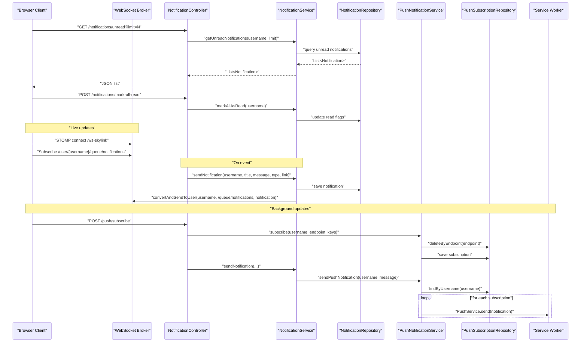
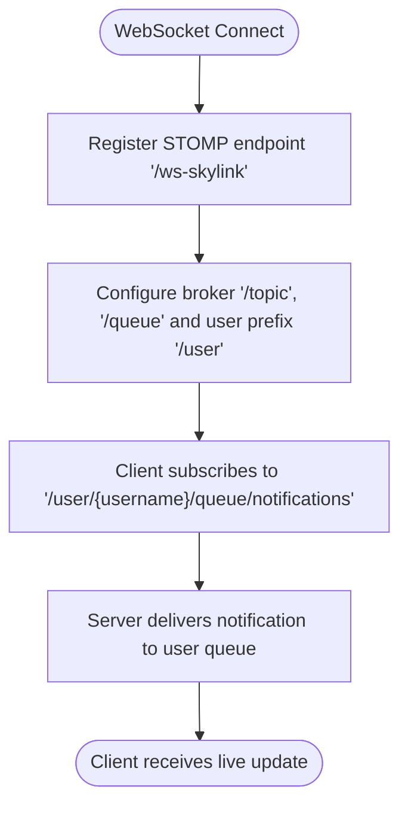
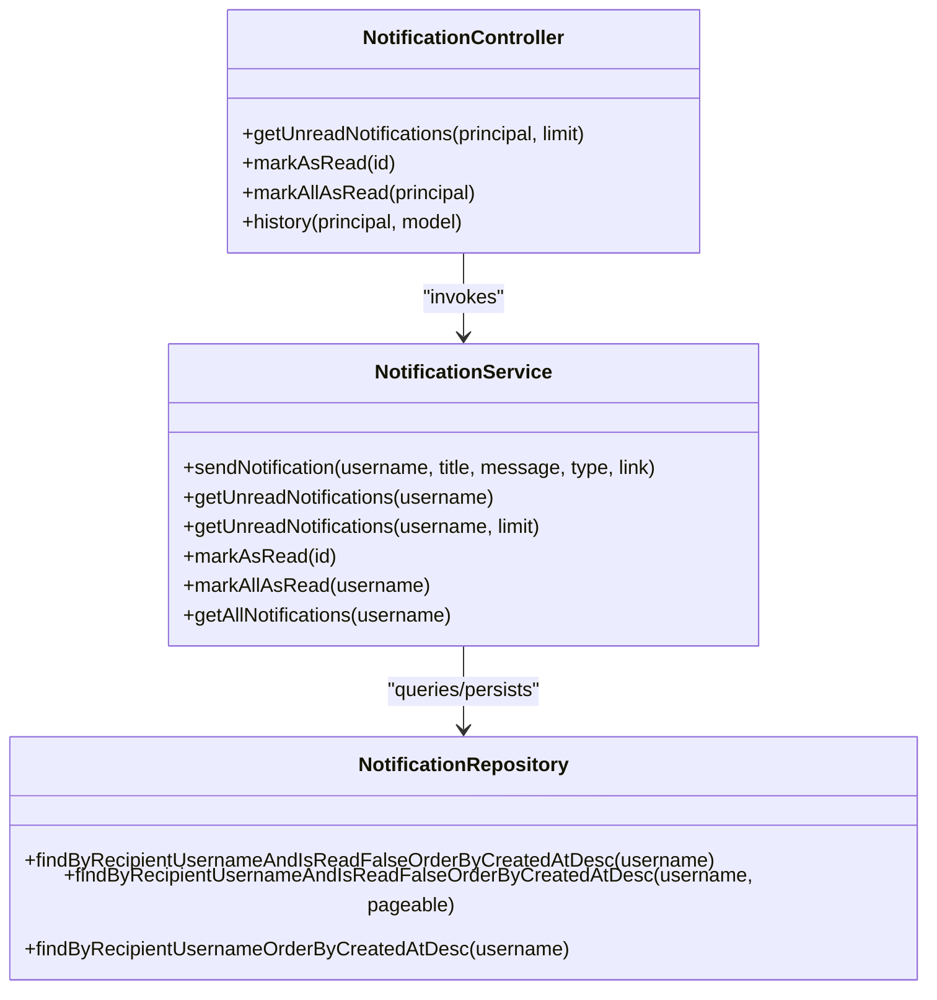
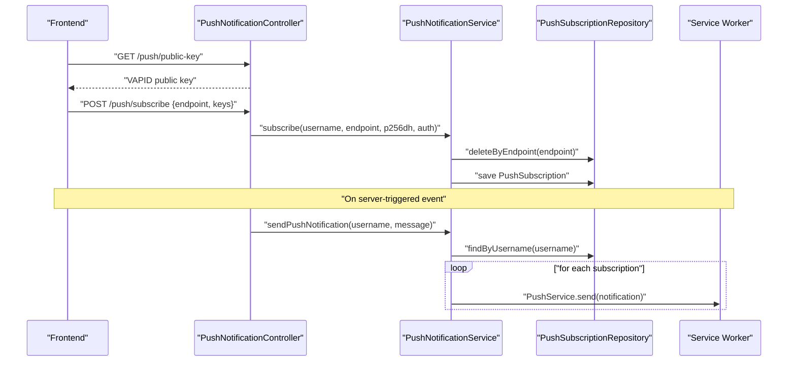
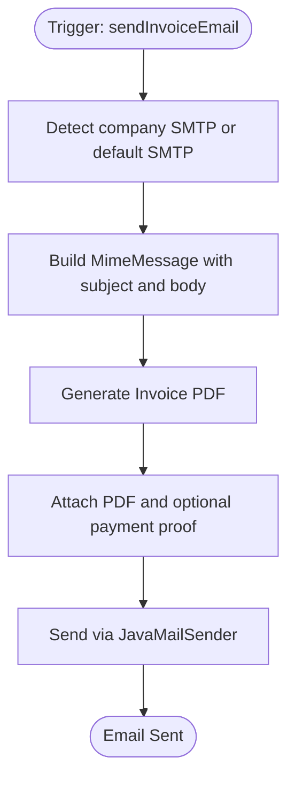
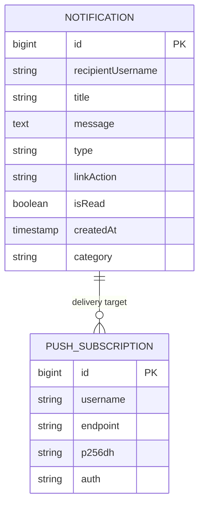
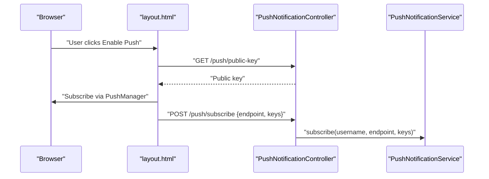
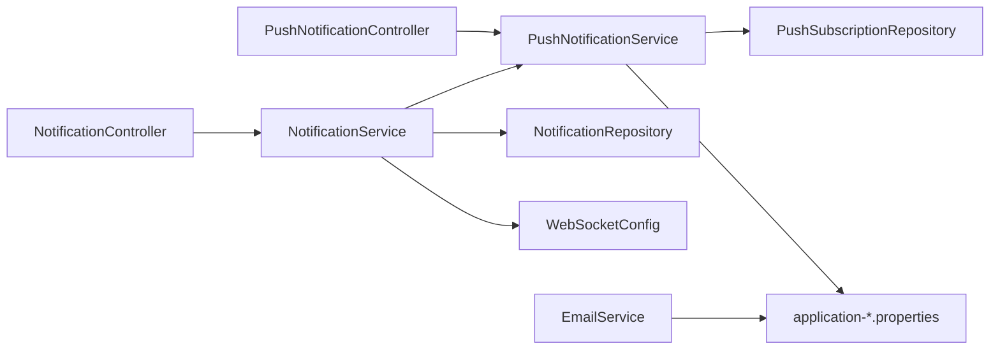

# Communication System

<cite>
**Referenced Files in This Document**
- [WebSocketConfig.java](file://src/main/java/root/cyb/mh/attendancesystem/config/WebSocketConfig.java)
- [NotificationController.java](file://src/main/java/root/cyb/mh/attendancesystem/controller/NotificationController.java)
- [PushNotificationController.java](file://src/main/java/root/cyb/mh/attendancesystem/controller/PushNotificationController.java)
- [NotificationService.java](file://src/main/java/root/cyb/mh/attendancesystem/service/NotificationService.java)
- [PushNotificationService.java](file://src/main/java/root/cyb/mh/attendancesystem/service/PushNotificationService.java)
- [EmailService.java](file://src/main/java/root/cyb/mh/attendancesystem/service/EmailService.java)
- [Notification.java](file://src/main/java/root/cyb/mh/attendancesystem/model/Notification.java)
- [PushSubscription.java](file://src/main/java/root/cyb/mh/attendancesystem/model/PushSubscription.java)
- [NotificationRepository.java](file://src/main/java/root/cyb/mh/attendancesystem/repository/NotificationRepository.java)
- [PushSubscriptionRepository.java](file://src/main/java/root/cyb/mh/attendancesystem/repository/PushSubscriptionRepository.java)
- [sw.js](file://src/main/resources/static/sw.js)
- [layout.html](file://src/main/resources/templates/layout.html)
- [application-prod.properties](file://src/main/resources/application-prod.properties)
- [application-dev.properties](file://src/main/resources/application-dev.properties)
</cite>

## Table of Contents
1. [Introduction](#introduction)
2. [Project Structure](#project-structure)
3. [Core Components](#core-components)
4. [Architecture Overview](#architecture-overview)
5. [Detailed Component Analysis](#detailed-component-analysis)
6. [Dependency Analysis](#dependency-analysis)
7. [Performance Considerations](#performance-considerations)
8. [Troubleshooting Guide](#troubleshooting-guide)
9. [Conclusion](#conclusion)
10. [Appendices](#appendices)

## Introduction
This document describes the communication system of the Skylink Custom Backend, focusing on real-time notification delivery via WebSocket, push notifications using the Web Push Protocol, email integration, and centralized notification management. It explains how notifications are stored, routed to users, delivered through multiple channels, and managed through dedicated APIs and repositories. Practical workflows and integration points with frontend components are included to help developers implement and troubleshoot the system effectively.

## Project Structure
The communication system spans controllers, services, models, repositories, WebSocket configuration, a service worker, and configuration properties. The following diagram shows the primary components and their relationships.

**Diagram sources**
- [WebSocketConfig.java:1-26](file://src/main/java/root/cyb/mh/attendancesystem/config/WebSocketConfig.java#L1-L26)
- [NotificationController.java:1-49](file://src/main/java/root/cyb/mh/attendancesystem/controller/NotificationController.java#L1-L49)
- [PushNotificationController.java:1-78](file://src/main/java/root/cyb/mh/attendancesystem/controller/PushNotificationController.java#L1-L78)
- [NotificationService.java:1-78](file://src/main/java/root/cyb/mh/attendancesystem/service/NotificationService.java#L1-L78)
- [PushNotificationService.java:1-111](file://src/main/java/root/cyb/mh/attendancesystem/service/PushNotificationService.java#L1-L111)
- [EmailService.java:1-120](file://src/main/java/root/cyb/mh/attendancesystem/service/EmailService.java#L1-L120)
- [Notification.java:1-43](file://src/main/java/root/cyb/mh/attendancesystem/model/Notification.java#L1-L43)
- [PushSubscription.java:1-34](file://src/main/java/root/cyb/mh/attendancesystem/model/PushSubscription.java#L1-L34)
- [NotificationRepository.java:1-19](file://src/main/java/root/cyb/mh/attendancesystem/repository/NotificationRepository.java#L1-L19)
- [PushSubscriptionRepository.java:1-12](file://src/main/java/root/cyb/mh/attendancesystem/repository/PushSubscriptionRepository.java#L1-L12)
- [sw.js:1-41](file://src/main/resources/static/sw.js#L1-L41)
- [application-prod.properties:1-33](file://src/main/resources/application-prod.properties#L1-L33)
- [application-dev.properties:1-33](file://src/main/resources/application-dev.properties#L1-L33)

**Section sources**
- [WebSocketConfig.java:1-26](file://src/main/java/root/cyb/mh/attendancesystem/config/WebSocketConfig.java#L1-L26)
- [NotificationController.java:1-49](file://src/main/java/root/cyb/mh/attendancesystem/controller/NotificationController.java#L1-L49)
- [PushNotificationController.java:1-78](file://src/main/java/root/cyb/mh/attendancesystem/controller/PushNotificationController.java#L1-L78)
- [NotificationService.java:1-78](file://src/main/java/root/cyb/mh/attendancesystem/service/NotificationService.java#L1-L78)
- [PushNotificationService.java:1-111](file://src/main/java/root/cyb/mh/attendancesystem/service/PushNotificationService.java#L1-L111)
- [EmailService.java:1-120](file://src/main/java/root/cyb/mh/attendancesystem/service/EmailService.java#L1-L120)
- [Notification.java:1-43](file://src/main/java/root/cyb/mh/attendancesystem/model/Notification.java#L1-L43)
- [PushSubscription.java:1-34](file://src/main/java/root/cyb/mh/attendancesystem/model/PushSubscription.java#L1-L34)
- [NotificationRepository.java:1-19](file://src/main/java/root/cyb/mh/attendancesystem/repository/NotificationRepository.java#L1-L19)
- [PushSubscriptionRepository.java:1-12](file://src/main/java/root/cyb/mh/attendancesystem/repository/PushSubscriptionRepository.java#L1-L12)
- [sw.js:1-41](file://src/main/resources/static/sw.js#L1-L41)
- [application-prod.properties:1-33](file://src/main/resources/application-prod.properties#L1-L33)
- [application-dev.properties:1-33](file://src/main/resources/application-dev.properties#L1-L33)

## Core Components
- Real-time notifications via WebSocket:
  - WebSocket broker configured with user-specific destinations and STOMP endpoints.
  - Notifications are sent to a per-user queue for live updates.
- Push notifications via Web Push:
  - VAPID keys configured for secure push delivery.
  - Service worker handles push events and click actions.
  - Subscription persistence per user and endpoint.
- Email integration:
  - SMTP configuration supports both default and company-specific mailers.
  - PDF invoice generation and optional payment proof attachments.
- Notification management:
  - Centralized service orchestrates storage, WebSocket delivery, and push delivery.
  - REST endpoints expose unread counts, marking as read, and notification history.

**Section sources**
- [WebSocketConfig.java:1-26](file://src/main/java/root/cyb/mh/attendancesystem/config/WebSocketConfig.java#L1-L26)
- [NotificationService.java:22-44](file://src/main/java/root/cyb/mh/attendancesystem/service/NotificationService.java#L22-L44)
- [PushNotificationService.java:35-46](file://src/main/java/root/cyb/mh/attendancesystem/service/PushNotificationService.java#L35-L46)
- [EmailService.java:25-103](file://src/main/java/root/cyb/mh/attendancesystem/service/EmailService.java#L25-L103)
- [NotificationController.java:18-47](file://src/main/java/root/cyb/mh/attendancesystem/controller/NotificationController.java#L18-L47)

## Architecture Overview
The communication system integrates three delivery channels: WebSocket for live updates, Web Push for background notifications, and email for asynchronous, persistent alerts. The central NotificationService coordinates delivery to all channels while persisting notifications in the database.

**Diagram sources**
- [NotificationController.java:18-47](file://src/main/java/root/cyb/mh/attendancesystem/controller/NotificationController.java#L18-L47)
- [NotificationService.java:22-44](file://src/main/java/root/cyb/mh/attendancesystem/service/NotificationService.java#L22-L44)
- [NotificationRepository.java:10-18](file://src/main/java/root/cyb/mh/attendancesystem/repository/NotificationRepository.java#L10-L18)
- [WebSocketConfig.java:14-24](file://src/main/java/root/cyb/mh/attendancesystem/config/WebSocketConfig.java#L14-L24)
- [PushNotificationController.java:22-31](file://src/main/java/root/cyb/mh/attendancesystem/controller/PushNotificationController.java#L22-L31)
- [PushNotificationService.java:52-76](file://src/main/java/root/cyb/mh/attendancesystem/service/PushNotificationService.java#L52-L76)
- [PushSubscriptionRepository.java:8-11](file://src/main/java/root/cyb/mh/attendancesystem/repository/PushSubscriptionRepository.java#L8-L11)
- [sw.js:1-41](file://src/main/resources/static/sw.js#L1-L41)

## Detailed Component Analysis

### WebSocket Implementation and Live Updates
- Broker configuration enables a simple broker for topics and queues, with application destination prefixes and a user destination prefix for per-user routing.
- The STOMP endpoint is exposed with SockJS support for broad browser compatibility.
- The NotificationService sends notifications to a user-specific queue, enabling clients to subscribe and receive live updates.

**Diagram sources**
- [WebSocketConfig.java:14-24](file://src/main/java/root/cyb/mh/attendancesystem/config/WebSocketConfig.java#L14-L24)
- [NotificationService.java:33-35](file://src/main/java/root/cyb/mh/attendancesystem/service/NotificationService.java#L33-L35)

**Section sources**
- [WebSocketConfig.java:1-26](file://src/main/java/root/cyb/mh/attendancesystem/config/WebSocketConfig.java#L1-L26)
- [NotificationService.java:33-35](file://src/main/java/root/cyb/mh/attendancesystem/service/NotificationService.java#L33-L35)

### Notification Management and Routing
- NotificationService persists notifications and routes them to WebSocket and Web Push channels.
- NotificationController exposes endpoints for retrieving unread notifications, marking individual or all notifications as read, and viewing notification history.
- NotificationRepository provides queries for unread notifications (with optional limits) and full history.

**Diagram sources**
- [NotificationService.java:22-76](file://src/main/java/root/cyb/mh/attendancesystem/service/NotificationService.java#L22-L76)
- [NotificationController.java:18-47](file://src/main/java/root/cyb/mh/attendancesystem/controller/NotificationController.java#L18-L47)
- [NotificationRepository.java:10-18](file://src/main/java/root/cyb/mh/attendancesystem/repository/NotificationRepository.java#L10-L18)

**Section sources**
- [NotificationService.java:22-76](file://src/main/java/root/cyb/mh/attendancesystem/service/NotificationService.java#L22-L76)
- [NotificationController.java:18-47](file://src/main/java/root/cyb/mh/attendancesystem/controller/NotificationController.java#L18-L47)
- [NotificationRepository.java:10-18](file://src/main/java/root/cyb/mh/attendancesystem/repository/NotificationRepository.java#L10-L18)

### Push Notification Service Using Web Push Protocol
- VAPID keys are loaded from application properties and used to initialize the PushService.
- The PushNotificationController exposes endpoints to retrieve the public key and to subscribe push endpoints for authenticated users.
- Subscriptions are stored in PushSubscriptionRepository with endpoint uniqueness handled by deleting existing entries for the same endpoint.
- The service worker handles push events and click actions, opening the intended URL.

**Diagram sources**
- [PushNotificationController.java:17-31](file://src/main/java/root/cyb/mh/attendancesystem/controller/PushNotificationController.java#L17-L31)
- [PushNotificationService.java:35-46](file://src/main/java/root/cyb/mh/attendancesystem/service/PushNotificationService.java#L35-L46)
- [PushNotificationService.java:52-76](file://src/main/java/root/cyb/mh/attendancesystem/service/PushNotificationService.java#L52-L76)
- [PushSubscriptionRepository.java:8-11](file://src/main/java/root/cyb/mh/attendancesystem/repository/PushSubscriptionRepository.java#L8-L11)
- [sw.js:1-41](file://src/main/resources/static/sw.js#L1-L41)

**Section sources**
- [PushNotificationController.java:17-31](file://src/main/java/root/cyb/mh/attendancesystem/controller/PushNotificationController.java#L17-L31)
- [PushNotificationService.java:35-46](file://src/main/java/root/cyb/mh/attendancesystem/service/PushNotificationService.java#L35-L46)
- [PushNotificationService.java:52-76](file://src/main/java/root/cyb/mh/attendancesystem/service/PushNotificationService.java#L52-L76)
- [PushSubscriptionRepository.java:8-11](file://src/main/java/root/cyb/mh/attendancesystem/repository/PushSubscriptionRepository.java#L8-L11)
- [sw.js:1-41](file://src/main/resources/static/sw.js#L1-L41)

### Email Integration
- EmailService supports default SMTP configuration and overrides per company when available.
- It generates invoice PDFs and attaches them along with optional payment proofs.
- Logging is used to track email lifecycle and failures.

**Diagram sources**
- [EmailService.java:25-103](file://src/main/java/root/cyb/mh/attendancesystem/service/EmailService.java#L25-L103)
- [application-prod.properties:19-32](file://src/main/resources/application-prod.properties#L19-L32)
- [application-dev.properties:19-32](file://src/main/resources/application-dev.properties#L19-L32)

**Section sources**
- [EmailService.java:25-103](file://src/main/java/root/cyb/mh/attendancesystem/service/EmailService.java#L25-L103)
- [application-prod.properties:19-32](file://src/main/resources/application-prod.properties#L19-L32)
- [application-dev.properties:19-32](file://src/main/resources/application-dev.properties#L19-L32)

### Data Models and Persistence
- Notification entity stores metadata for title, message, type, link action, read status, creation timestamp, and optional category.
- PushSubscription entity stores user association, endpoint, and cryptographic keys for Web Push.
- Repositories provide JPA-based queries for notification retrieval and subscription management.

**Diagram sources**
- [Notification.java:16-42](file://src/main/java/root/cyb/mh/attendancesystem/model/Notification.java#L16-L42)
- [PushSubscription.java:15-33](file://src/main/java/root/cyb/mh/attendancesystem/model/PushSubscription.java#L15-L33)
- [NotificationRepository.java:10-18](file://src/main/java/root/cyb/mh/attendancesystem/repository/NotificationRepository.java#L10-L18)
- [PushSubscriptionRepository.java:8-11](file://src/main/java/root/cyb/mh/attendancesystem/repository/PushSubscriptionRepository.java#L8-L11)

**Section sources**
- [Notification.java:16-42](file://src/main/java/root/cyb/mh/attendancesystem/model/Notification.java#L16-L42)
- [PushSubscription.java:15-33](file://src/main/java/root/cyb/mh/attendancesystem/model/PushSubscription.java#L15-L33)
- [NotificationRepository.java:10-18](file://src/main/java/root/cyb/mh/attendancesystem/repository/NotificationRepository.java#L10-L18)
- [PushSubscriptionRepository.java:8-11](file://src/main/java/root/cyb/mh/attendancesystem/repository/PushSubscriptionRepository.java#L8-L11)

### Frontend Integration for Push Subscriptions
- The layout template demonstrates requesting notification permission, fetching the VAPID public key, subscribing via PushManager, and sending subscription data to the backend with CSRF protection.

**Diagram sources**
- [layout.html:212-243](file://src/main/resources/templates/layout.html#L212-L243)
- [PushNotificationController.java:17-31](file://src/main/java/root/cyb/mh/attendancesystem/controller/PushNotificationController.java#L17-L31)
- [PushNotificationService.java:52-76](file://src/main/java/root/cyb/mh/attendancesystem/service/PushNotificationService.java#L52-L76)

**Section sources**
- [layout.html:212-243](file://src/main/resources/templates/layout.html#L212-L243)
- [PushNotificationController.java:17-31](file://src/main/java/root/cyb/mh/attendancesystem/controller/PushNotificationController.java#L17-L31)
- [PushNotificationService.java:52-76](file://src/main/java/root/cyb/mh/attendancesystem/service/PushNotificationService.java#L52-L76)

## Dependency Analysis
The communication system exhibits clear separation of concerns:
- Controllers depend on services for business logic.
- Services depend on repositories for persistence and on infrastructure for transport (WebSocket/Sockets and Web Push).
- Models encapsulate persistence and are referenced by repositories.
- Configuration properties supply VAPID keys and SMTP settings.

**Diagram sources**
- [NotificationController.java:1-49](file://src/main/java/root/cyb/mh/attendancesystem/controller/NotificationController.java#L1-L49)
- [PushNotificationController.java:1-78](file://src/main/java/root/cyb/mh/attendancesystem/controller/PushNotificationController.java#L1-L78)
- [NotificationService.java:1-78](file://src/main/java/root/cyb/mh/attendancesystem/service/NotificationService.java#L1-L78)
- [PushNotificationService.java:1-111](file://src/main/java/root/cyb/mh/attendancesystem/service/PushNotificationService.java#L1-L111)
- [WebSocketConfig.java:1-26](file://src/main/java/root/cyb/mh/attendancesystem/config/WebSocketConfig.java#L1-L26)
- [NotificationRepository.java:1-19](file://src/main/java/root/cyb/mh/attendancesystem/repository/NotificationRepository.java#L1-L19)
- [PushSubscriptionRepository.java:1-12](file://src/main/java/root/cyb/mh/attendancesystem/repository/PushSubscriptionRepository.java#L1-L12)
- [application-prod.properties:1-33](file://src/main/resources/application-prod.properties#L1-L33)
- [application-dev.properties:1-33](file://src/main/resources/application-dev.properties#L1-L33)
- [EmailService.java:1-120](file://src/main/java/root/cyb/mh/attendancesystem/service/EmailService.java#L1-L120)

**Section sources**
- [NotificationController.java:1-49](file://src/main/java/root/cyb/mh/attendancesystem/controller/NotificationController.java#L1-L49)
- [PushNotificationController.java:1-78](file://src/main/java/root/cyb/mh/attendancesystem/controller/PushNotificationController.java#L1-L78)
- [NotificationService.java:1-78](file://src/main/java/root/cyb/mh/attendancesystem/service/NotificationService.java#L1-L78)
- [PushNotificationService.java:1-111](file://src/main/java/root/cyb/mh/attendancesystem/service/PushNotificationService.java#L1-L111)
- [WebSocketConfig.java:1-26](file://src/main/java/root/cyb/mh/attendancesystem/config/WebSocketConfig.java#L1-L26)
- [NotificationRepository.java:1-19](file://src/main/java/root/cyb/mh/attendancesystem/repository/NotificationRepository.java#L1-L19)
- [PushSubscriptionRepository.java:1-12](file://src/main/java/root/cyb/mh/attendancesystem/repository/PushSubscriptionRepository.java#L1-L12)
- [application-prod.properties:1-33](file://src/main/resources/application-prod.properties#L1-L33)
- [application-dev.properties:1-33](file://src/main/resources/application-dev.properties#L1-L33)
- [EmailService.java:1-120](file://src/main/java/root/cyb/mh/attendancesystem/service/EmailService.java#L1-L120)

## Performance Considerations
- WebSocket delivery is efficient for real-time updates; ensure clients subscribe only to necessary user queues.
- Web Push delivery is asynchronous and resilient; batch or rate-limit push notifications to avoid overwhelming external push services.
- Email sending involves PDF generation and file attachments; consider queuing and background processing for high-volume scenarios.
- Database queries for unread notifications should leverage appropriate indexes on recipientUsername and read flags.

## Troubleshooting Guide
- WebSocket connection issues:
  - Verify the STOMP endpoint and SockJS configuration.
  - Confirm user destination prefix and client subscription paths.
- Push notification failures:
  - Check VAPID keys in configuration and ensure initialization succeeds.
  - Inspect endpoint uniqueness and cleanup logic for 410/404 responses.
  - Validate service worker registration and push event handling.
- Email delivery problems:
  - Confirm SMTP host, port, credentials, and TLS settings.
  - Review logs for attachment availability and PDF generation errors.
- Notification state inconsistencies:
  - Use the provided endpoints to mark notifications as read and to retrieve histories for diagnosis.

**Section sources**
- [WebSocketConfig.java:14-24](file://src/main/java/root/cyb/mh/attendancesystem/config/WebSocketConfig.java#L14-L24)
- [PushNotificationService.java:35-46](file://src/main/java/root/cyb/mh/attendancesystem/service/PushNotificationService.java#L35-L46)
- [PushNotificationService.java:100-109](file://src/main/java/root/cyb/mh/attendancesystem/service/PushNotificationService.java#L100-L109)
- [EmailService.java:96-102](file://src/main/java/root/cyb/mh/attendancesystem/service/EmailService.java#L96-L102)
- [NotificationController.java:18-47](file://src/main/java/root/cyb/mh/attendancesystem/controller/NotificationController.java#L18-L47)

## Conclusion
The Skylink Custom Backend implements a robust, multi-channel communication system. Notifications are persisted, delivered via WebSocket for live updates, and via Web Push for background engagement, while email integration ensures asynchronous, persistent alerts. The system’s design separates concerns across controllers, services, repositories, and configuration, enabling maintainability and scalability.

## Appendices
- Configuration keys and locations:
  - VAPID public/private keys and subject are defined in application properties.
  - SMTP settings for default and company-specific mailers are configured in application properties.
- Frontend integration:
  - The layout template demonstrates permission handling, public key retrieval, subscription, and CSRF token usage.

**Section sources**
- [application-prod.properties:30-32](file://src/main/resources/application-prod.properties#L30-L32)
- [application-dev.properties:30-32](file://src/main/resources/application-dev.properties#L30-L32)
- [EmailService.java:105-118](file://src/main/java/root/cyb/mh/attendancesystem/service/EmailService.java#L105-L118)
- [layout.html:212-243](file://src/main/resources/templates/layout.html#L212-L243)