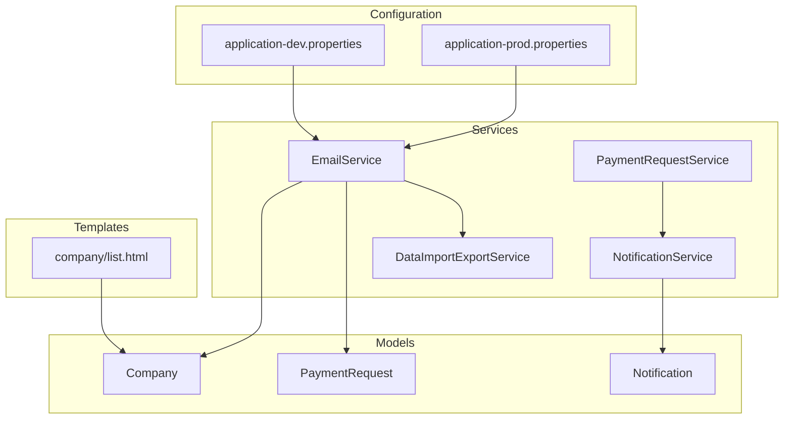
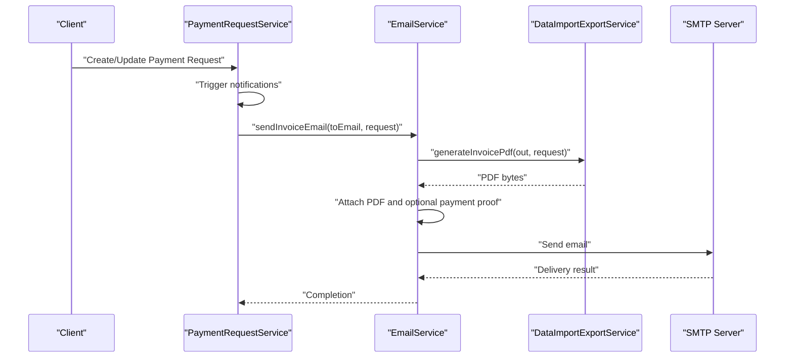
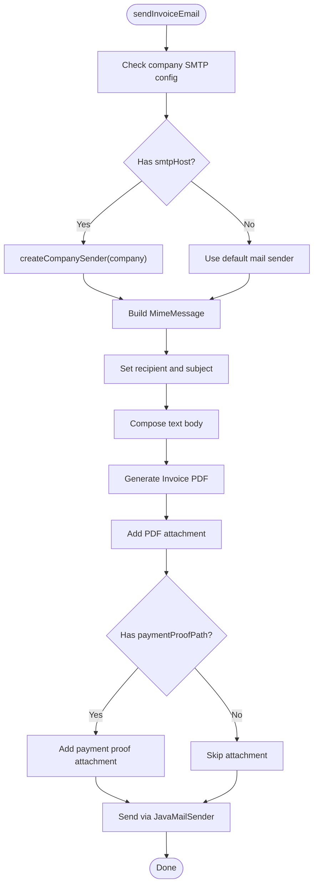
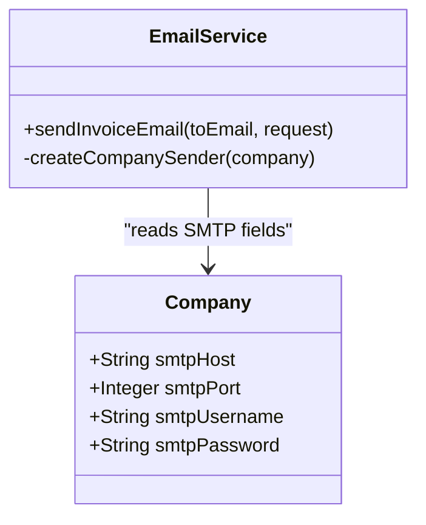
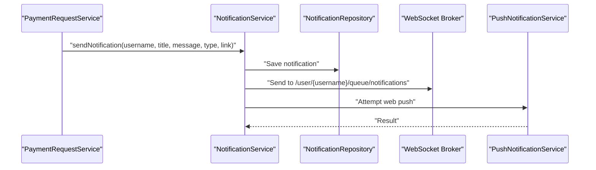
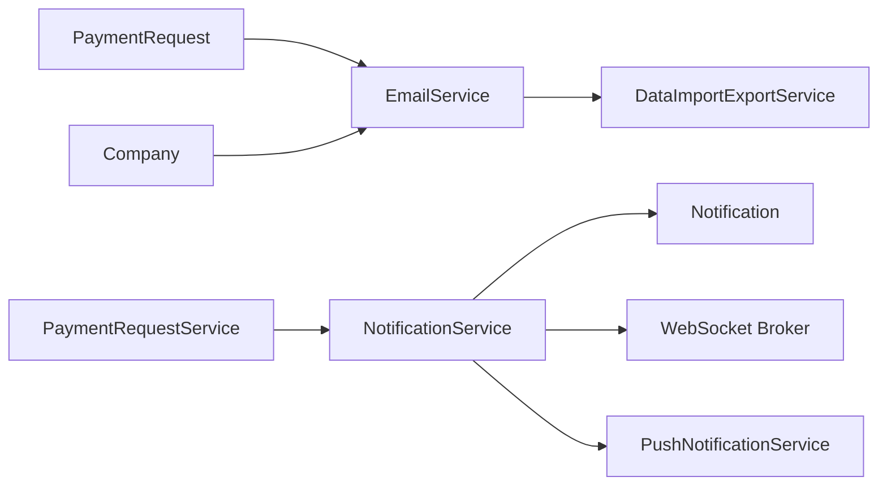

# Email Integration

<cite>
**Referenced Files in This Document**
- [EmailService.java](file://src/main/java/root/cyb/mh/attendancesystem/service/EmailService.java)
- [DataImportExportService.java](file://src/main/java/root/cyb/mh/attendancesystem/service/DataImportExportService.java)
- [PaymentRequest.java](file://src/main/java/root/cyb/mh/attendancesystem/model/PaymentRequest.java)
- [Company.java](file://src/main/java/root/cyb/mh/attendancesystem/model/Company.java)
- [application-dev.properties](file://src/main/resources/application-dev.properties)
- [application-prod.properties](file://src/main/resources/application-prod.properties)
- [NotificationService.java](file://src/main/java/root/cyb/mh/attendancesystem/service/NotificationService.java)
- [Notification.java](file://src/main/java/root/cyb/mh/attendancesystem/model/Notification.java)
- [PaymentRequestService.java](file://src/main/java/root/cyb/mh/attendancesystem/service/PaymentRequestService.java)
- [NotificationController.java](file://src/main/java/root/cyb/mh/attendancesystem/controller/NotificationController.java)
- [company/list.html](file://src/main/resources/templates/company/list.html)
</cite>

## Table of Contents
1. [Introduction](#introduction)
2. [Project Structure](#project-structure)
3. [Core Components](#core-components)
4. [Architecture Overview](#architecture-overview)
5. [Detailed Component Analysis](#detailed-component-analysis)
6. [Dependency Analysis](#dependency-analysis)
7. [Performance Considerations](#performance-considerations)
8. [Troubleshooting Guide](#troubleshooting-guide)
9. [Conclusion](#conclusion)

## Introduction
This document explains the email integration service implementation, focusing on SMTP configuration, email template management, notification dispatching, and email queue handling. It also covers email content formatting, attachment handling, bulk email processing, and delivery status tracking. Practical examples illustrate email notification workflows for payroll notifications, leave approvals, and system alerts, along with error handling for failed deliveries and integration points within the system.

## Project Structure
The email integration spans several layers:
- Service layer: Email sending and invoice generation
- Model layer: Entities for payment requests and company SMTP configuration
- Configuration: Application properties for SMTP settings
- Notification subsystem: Local notifications via database, WebSocket, and web push
- Templates: HTML templates for administrative configuration of SMTP settings

**Diagram sources**
- [EmailService.java:1-120](file://src/main/java/root/cyb/mh/attendancesystem/service/EmailService.java#L1-L120)
- [DataImportExportService.java:407-674](file://src/main/java/root/cyb/mh/attendancesystem/service/DataImportExportService.java#L407-L674)
- [PaymentRequest.java:107-116](file://src/main/java/root/cyb/mh/attendancesystem/model/PaymentRequest.java#L107-L116)
- [Company.java:23-27](file://src/main/java/root/cyb/mh/attendancesystem/model/Company.java#L23-L27)
- [application-dev.properties:19-25](file://src/main/resources/application-dev.properties#L19-L25)
- [application-prod.properties:19-25](file://src/main/resources/application-prod.properties#L19-L25)
- [NotificationService.java:22-44](file://src/main/java/root/cyb/mh/attendancesystem/service/NotificationService.java#L22-L44)
- [Notification.java:14-42](file://src/main/java/root/cyb/mh/attendancesystem/model/Notification.java#L14-L42)
- [company/list.html:166-272](file://src/main/resources/templates/company/list.html#L166-L272)

**Section sources**
- [EmailService.java:1-120](file://src/main/java/root/cyb/mh/attendancesystem/service/EmailService.java#L1-L120)
- [application-dev.properties:19-25](file://src/main/resources/application-dev.properties#L19-L25)
- [application-prod.properties:19-25](file://src/main/resources/application-prod.properties#L19-L25)
- [company/list.html:166-272](file://src/main/resources/templates/company/list.html#L166-L272)

## Core Components
- EmailService: Sends emails with attachments, supports per-company SMTP overrides, and integrates invoice PDF generation.
- DataImportExportService: Generates invoice PDFs for email attachments.
- PaymentRequest: Carries metadata for invoices and optional payment proof attachments.
- Company: Stores SMTP credentials for per-company email routing.
- NotificationService: Manages local notifications via database, WebSocket, and web push.
- Notification: Data model for stored notifications.
- PaymentRequestService: Orchestrates payment request lifecycle and triggers notifications.
- NotificationController: Exposes endpoints for retrieving and marking notifications.

**Section sources**
- [EmailService.java:25-103](file://src/main/java/root/cyb/mh/attendancesystem/service/EmailService.java#L25-L103)
- [DataImportExportService.java:407-674](file://src/main/java/root/cyb/mh/attendancesystem/service/DataImportExportService.java#L407-L674)
- [PaymentRequest.java:107-116](file://src/main/java/root/cyb/mh/attendancesystem/model/PaymentRequest.java#L107-L116)
- [Company.java:23-27](file://src/main/java/root/cyb/mh/attendancesystem/model/Company.java#L23-L27)
- [NotificationService.java:22-44](file://src/main/java/root/cyb/mh/attendancesystem/service/NotificationService.java#L22-L44)
- [Notification.java:14-42](file://src/main/java/root/cyb/mh/attendancesystem/model/Notification.java#L14-L42)
- [PaymentRequestService.java:92-125](file://src/main/java/root/cyb/mh/attendancesystem/service/PaymentRequestService.java#L92-L125)
- [NotificationController.java:18-47](file://src/main/java/root/cyb/mh/attendancesystem/controller/NotificationController.java#L18-L47)

## Architecture Overview
The email integration architecture combines SMTP configuration, invoice generation, and notification dispatching. It supports:
- Default system SMTP configuration via application properties
- Per-company SMTP override when available
- PDF invoice generation and attachment
- Optional payment proof attachment
- Local notification delivery alongside email

**Diagram sources**
- [PaymentRequestService.java:92-125](file://src/main/java/root/cyb/mh/attendancesystem/service/PaymentRequestService.java#L92-L125)
- [EmailService.java:25-103](file://src/main/java/root/cyb/mh/attendancesystem/service/EmailService.java#L25-L103)
- [DataImportExportService.java:407-674](file://src/main/java/root/cyb/mh/attendancesystem/service/DataImportExportService.java#L407-L674)

## Detailed Component Analysis

### EmailService
Responsibilities:
- Select SMTP sender: default system SMTP or per-company override
- Compose email subject and body
- Generate invoice PDF and attach it
- Optionally attach payment proof
- Send email and log outcomes

Key behaviors:
- SMTP selection: Uses company SMTP if configured; otherwise falls back to default
- Content formatting: Uses a formatted text body with placeholders for contractor and company details
- Attachment handling: Adds invoice PDF and optional payment proof
- Error handling: Logs failures and rethrows exceptions

**Diagram sources**
- [EmailService.java:25-103](file://src/main/java/root/cyb/mh/attendancesystem/service/EmailService.java#L25-L103)
- [DataImportExportService.java:407-674](file://src/main/java/root/cyb/mh/attendancesystem/service/DataImportExportService.java#L407-L674)

**Section sources**
- [EmailService.java:25-103](file://src/main/java/root/cyb/mh/attendancesystem/service/EmailService.java#L25-L103)
- [DataImportExportService.java:407-674](file://src/main/java/root/cyb/mh/attendancesystem/service/DataImportExportService.java#L407-L674)

### SMTP Configuration
- Default SMTP settings are loaded from application properties for development and production profiles
- Per-company SMTP override is supported via the Company entity fields for host, port, username, and password
- The EmailService dynamically creates a JavaMailSender when a company’s SMTP is set

**Diagram sources**
- [Company.java:23-27](file://src/main/java/root/cyb/mh/attendancesystem/model/Company.java#L23-L27)
- [EmailService.java:105-118](file://src/main/java/root/cyb/mh/attendancesystem/service/EmailService.java#L105-L118)
- [application-dev.properties:19-25](file://src/main/resources/application-dev.properties#L19-L25)
- [application-prod.properties:19-25](file://src/main/resources/application-prod.properties#L19-L25)

**Section sources**
- [Company.java:23-27](file://src/main/java/root/cyb/mh/attendancesystem/model/Company.java#L23-L27)
- [EmailService.java:105-118](file://src/main/java/root/cyb/mh/attendancesystem/service/EmailService.java#L105-L118)
- [application-dev.properties:19-25](file://src/main/resources/application-dev.properties#L19-L25)
- [application-prod.properties:19-25](file://src/main/resources/application-prod.properties#L19-L25)

### Email Template Management
- Email body is constructed programmatically as a formatted text string
- Invoice PDF is generated separately and attached as a PDF
- There are no dedicated email templates in the codebase; content is built at runtime

Practical implications:
- Template customization requires modifying the body composition logic
- PDF templates are managed within the invoice generation service

**Section sources**
- [EmailService.java:49-67](file://src/main/java/root/cyb/mh/attendancesystem/service/EmailService.java#L49-L67)
- [DataImportExportService.java:407-674](file://src/main/java/root/cyb/mh/attendancesystem/service/DataImportExportService.java#L407-L674)

### Notification Dispatching
- PaymentRequestService triggers notifications upon new requests, status changes, and payment updates
- NotificationService persists notifications to the database, pushes via WebSocket, and attempts web push notifications
- NotificationController exposes endpoints to fetch unread notifications, mark as read, and view notification history

**Diagram sources**
- [PaymentRequestService.java:92-125](file://src/main/java/root/cyb/mh/attendancesystem/service/PaymentRequestService.java#L92-L125)
- [NotificationService.java:22-44](file://src/main/java/root/cyb/mh/attendancesystem/service/NotificationService.java#L22-L44)
- [NotificationController.java:18-47](file://src/main/java/root/cyb/mh/attendancesystem/controller/NotificationController.java#L18-L47)

**Section sources**
- [PaymentRequestService.java:92-125](file://src/main/java/root/cyb/mh/attendancesystem/service/PaymentRequestService.java#L92-L125)
- [NotificationService.java:22-44](file://src/main/java/root/cyb/mh/attendancesystem/service/NotificationService.java#L22-L44)
- [NotificationController.java:18-47](file://src/main/java/root/cyb/mh/attendancesystem/controller/NotificationController.java#L18-L47)

### Email Queue Handling
- The current implementation sends emails synchronously via JavaMailSender
- There is no explicit email queue mechanism (e.g., message broker or scheduled job) in the codebase
- For high-volume scenarios, introduce asynchronous processing (e.g., Spring TaskScheduler or a queue-backed solution)

**Section sources**
- [EmailService.java:96-102](file://src/main/java/root/cyb/mh/attendancesystem/service/EmailService.java#L96-L102)

### Email Content Formatting and Attachments
- Body formatting: Text-based with placeholders for contractor and company details
- Attachments:
  - Required: Invoice PDF generated from invoice data
  - Optional: Payment proof file if present and readable
- Delivery status: Logged upon completion or failure

**Section sources**
- [EmailService.java:49-94](file://src/main/java/root/cyb/mh/attendancesystem/service/EmailService.java#L49-L94)
- [DataImportExportService.java:407-674](file://src/main/java/root/cyb/mh/attendancesystem/service/DataImportExportService.java#L407-L674)

### Bulk Email Processing
- The current implementation handles single invoices per send operation
- Bulk processing would require iterating over recipients and requests, potentially with batching and retry logic

**Section sources**
- [EmailService.java:25-103](file://src/main/java/root/cyb/mh/attendancesystem/service/EmailService.java#L25-L103)

### Delivery Status Tracking
- Logging is used to track success and failure during email sending
- No persistent delivery receipts or bounce handling are implemented in the codebase

**Section sources**
- [EmailService.java:96-102](file://src/main/java/root/cyb/mh/attendancesystem/service/EmailService.java#L96-L102)

### Practical Examples

#### Payroll Notifications (Invoice Email)
- Trigger: PaymentRequest creation/update
- Actions:
  - Generate invoice PDF
  - Attach PDF and optional payment proof
  - Send email using default or company SMTP
- Outcomes: Email delivered to the recipient; logs indicate success/failure

**Section sources**
- [PaymentRequestService.java:92-125](file://src/main/java/root/cyb/mh/attendancesystem/service/PaymentRequestService.java#L92-L125)
- [EmailService.java:25-103](file://src/main/java/root/cyb/mh/attendancesystem/service/EmailService.java#L25-L103)
- [DataImportExportService.java:407-674](file://src/main/java/root/cyb/mh/attendancesystem/service/DataImportExportService.java#L407-L674)

#### Leave Approvals and System Alerts
- Trigger: PaymentRequest status or payment status changes
- Actions:
  - NotificationService persists and broadcasts notifications via WebSocket and web push
  - NotificationController provides endpoints to manage notification state
- Outcomes: Users receive in-app notifications; email is not used for these events in the current code

**Section sources**
- [PaymentRequestService.java:127-204](file://src/main/java/root/cyb/mh/attendancesystem/service/PaymentRequestService.java#L127-L204)
- [NotificationService.java:22-44](file://src/main/java/root/cyb/mh/attendancesystem/service/NotificationService.java#L22-L44)
- [NotificationController.java:18-47](file://src/main/java/root/cyb/mh/attendancesystem/controller/NotificationController.java#L18-L47)

#### Template Customization
- Email body is composed programmatically; modify the body construction to introduce templating
- Invoice PDF generation is self-contained; adjust the PDF builder for branding or content changes

**Section sources**
- [EmailService.java:49-67](file://src/main/java/root/cyb/mh/attendancesystem/service/EmailService.java#L49-L67)
- [DataImportExportService.java:407-674](file://src/main/java/root/cyb/mh/attendancesystem/service/DataImportExportService.java#L407-L674)

#### Error Handling for Failed Deliveries
- Exceptions during email sending are logged and rethrown
- Payment proof attachment errors are caught and logged without failing the email

**Section sources**
- [EmailService.java:96-102](file://src/main/java/root/cyb/mh/attendancesystem/service/EmailService.java#L96-L102)
- [EmailService.java:91-94](file://src/main/java/root/cyb/mh/attendancesystem/service/EmailService.java#L91-L94)

#### Integration with Company SMTP Settings
- Administrators can configure SMTP settings per company via the UI template
- EmailService reads these settings to route emails accordingly

**Section sources**
- [company/list.html:166-272](file://src/main/resources/templates/company/list.html#L166-L272)
- [EmailService.java:32-37](file://src/main/java/root/cyb/mh/attendancesystem/service/EmailService.java#L32-L37)
- [Company.java:23-27](file://src/main/java/root/cyb/mh/attendancesystem/model/Company.java#L23-L27)

## Dependency Analysis

**Diagram sources**
- [PaymentRequest.java:107-116](file://src/main/java/root/cyb/mh/attendancesystem/model/PaymentRequest.java#L107-L116)
- [Company.java:23-27](file://src/main/java/root/cyb/mh/attendancesystem/model/Company.java#L23-L27)
- [EmailService.java:25-103](file://src/main/java/root/cyb/mh/attendancesystem/service/EmailService.java#L25-L103)
- [DataImportExportService.java:407-674](file://src/main/java/root/cyb/mh/attendancesystem/service/DataImportExportService.java#L407-L674)
- [PaymentRequestService.java:92-125](file://src/main/java/root/cyb/mh/attendancesystem/service/PaymentRequestService.java#L92-L125)
- [NotificationService.java:22-44](file://src/main/java/root/cyb/mh/attendancesystem/service/NotificationService.java#L22-L44)
- [Notification.java:14-42](file://src/main/java/root/cyb/mh/attendancesystem/model/Notification.java#L14-L42)

**Section sources**
- [PaymentRequest.java:107-116](file://src/main/java/root/cyb/mh/attendancesystem/model/PaymentRequest.java#L107-L116)
- [Company.java:23-27](file://src/main/java/root/cyb/mh/attendancesystem/model/Company.java#L23-L27)
- [EmailService.java:25-103](file://src/main/java/root/cyb/mh/attendancesystem/service/EmailService.java#L25-L103)
- [DataImportExportService.java:407-674](file://src/main/java/root/cyb/mh/attendancesystem/service/DataImportExportService.java#L407-L674)
- [PaymentRequestService.java:92-125](file://src/main/java/root/cyb/mh/attendancesystem/service/PaymentRequestService.java#L92-L125)
- [NotificationService.java:22-44](file://src/main/java/root/cyb/mh/attendancesystem/service/NotificationService.java#L22-L44)
- [Notification.java:14-42](file://src/main/java/root/cyb/mh/attendancesystem/model/Notification.java#L14-L42)

## Performance Considerations
- Synchronous sending: Current implementation blocks until send completes; consider asynchronous processing for throughput
- Attachment size: Large PDFs or payment proofs increase latency; optimize PDF generation and compression
- SMTP reliability: Use connection pooling and retries for transient failures
- Database writes: Notification persistence and WebSocket broadcasts add overhead; batch where appropriate

## Troubleshooting Guide
Common issues and resolutions:
- SMTP authentication failures: Verify credentials in application properties or company SMTP settings
- Missing payment proof: Ensure the file exists and is readable; errors are logged but do not block email sending
- Email not delivered: Check logs for exceptions; confirm SMTP server accessibility and TLS settings
- Notification delivery: Confirm WebSocket connections and web push registration; errors are logged but do not fail DB saves

**Section sources**
- [EmailService.java:91-102](file://src/main/java/root/cyb/mh/attendancesystem/service/EmailService.java#L91-L102)
- [NotificationService.java:38-43](file://src/main/java/root/cyb/mh/attendancesystem/service/NotificationService.java#L38-L43)

## Conclusion
The email integration provides a robust foundation for invoice delivery with per-company SMTP support and PDF attachments. While the notification subsystem focuses on in-app and real-time delivery, email remains reserved for invoice-related communications. Extending the system with asynchronous email processing, template engines, and delivery tracking would further improve scalability and observability.