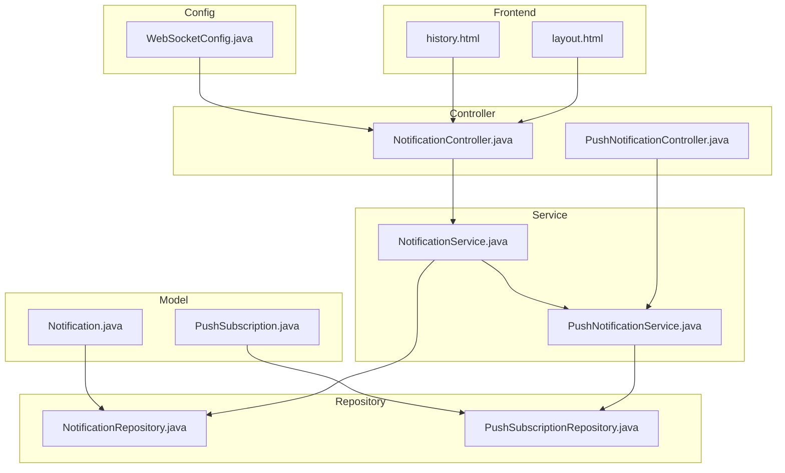
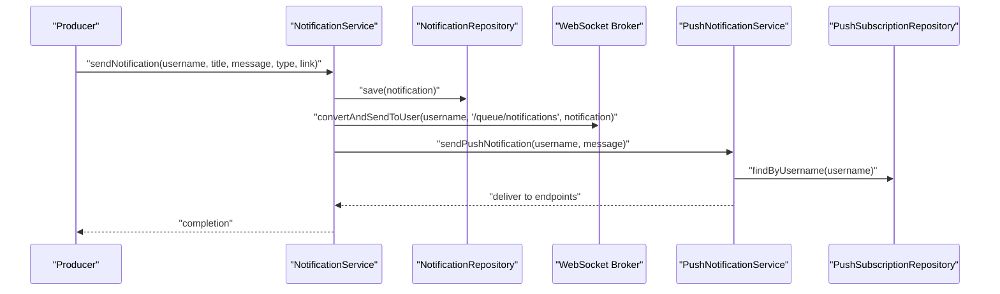
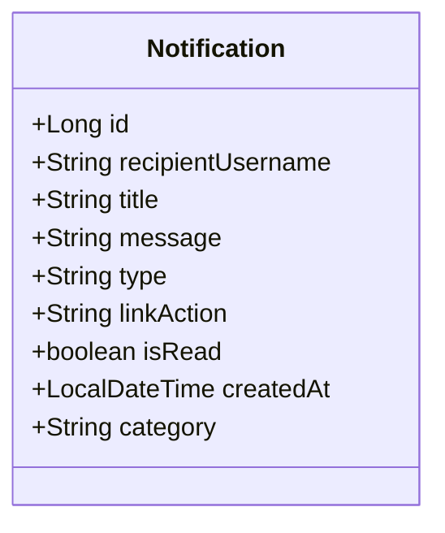
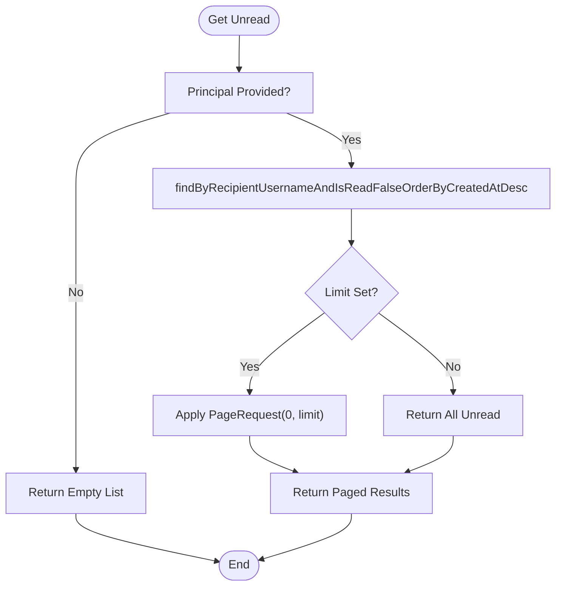
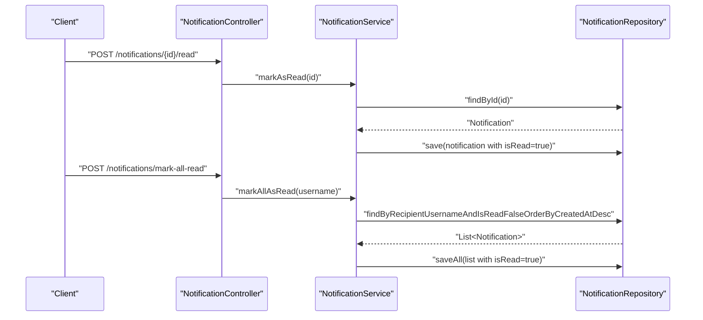
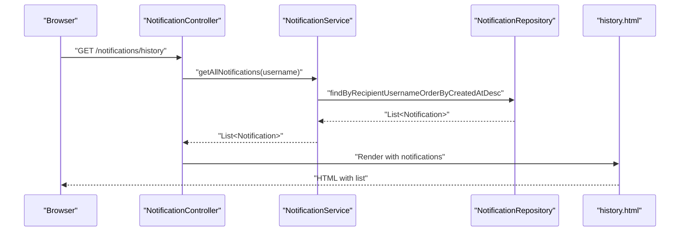
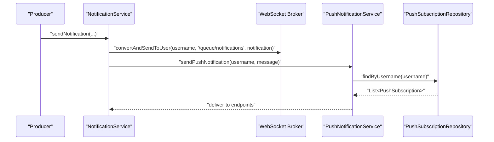
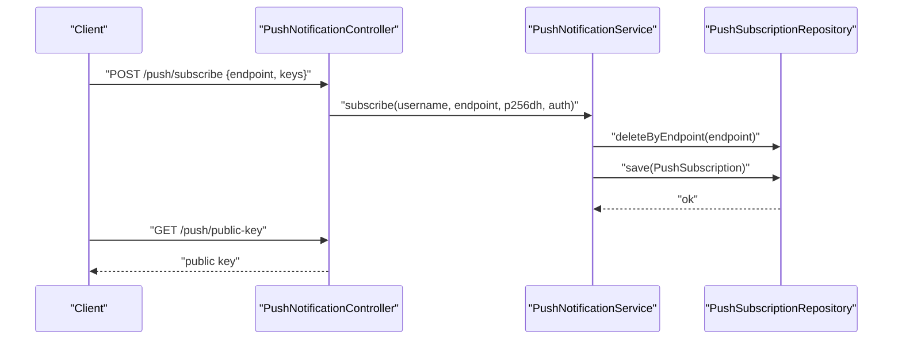
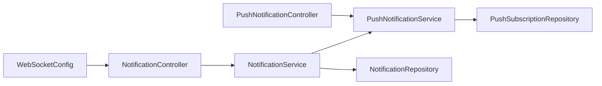

# Notification Management

<cite>
**Referenced Files in This Document**
- [Notification.java](file://src/main/java/root/cyb/mh/attendancesystem/model/Notification.java)
- [NotificationRepository.java](file://src/main/java/root/cyb/mh/attendancesystem/repository/NotificationRepository.java)
- [NotificationService.java](file://src/main/java/root/cyb/mh/attendancesystem/service/NotificationService.java)
- [NotificationController.java](file://src/main/java/root/cyb/mh/attendancesystem/controller/NotificationController.java)
- [PushSubscription.java](file://src/main/java/root/cyb/mh/attendancesystem/model/PushSubscription.java)
- [PushSubscriptionRepository.java](file://src/main/java/root/cyb/mh/attendancesystem/repository/PushSubscriptionRepository.java)
- [PushNotificationService.java](file://src/main/java/root/cyb/mh/attendancesystem/service/PushNotificationService.java)
- [PushNotificationController.java](file://src/main/java/root/cyb/mh/attendancesystem/controller/PushNotificationController.java)
- [WebSocketConfig.java](file://src/main/java/root/cyb/mh/attendancesystem/config/WebSocketConfig.java)
- [history.html](file://src/main/resources/templates/notifications/history.html)
- [layout.html](file://src/main/resources/templates/layout.html)
- [application.properties](file://src/main/resources/application.properties)
</cite>

## Table of Contents
1. [Introduction](#introduction)
2. [Project Structure](#project-structure)
3. [Core Components](#core-components)
4. [Architecture Overview](#architecture-overview)
5. [Detailed Component Analysis](#detailed-component-analysis)
6. [Dependency Analysis](#dependency-analysis)
7. [Performance Considerations](#performance-considerations)
8. [Troubleshooting Guide](#troubleshooting-guide)
9. [Conclusion](#conclusion)
10. [Appendices](#appendices)

## Introduction
This document provides comprehensive documentation for the notification management subsystem. It covers the notification lifecycle from creation to delivery, storage and retrieval patterns, user-specific filtering, pagination strategies, and bulk operations. It also documents notification types, priority handling, read/unread status management, notification history tracking, routing to WebSocket and Web Push channels, and practical examples for user preference handling, notification aggregation, and multi-channel delivery.

## Project Structure
The notification management system spans model, repository, service, controller, and configuration layers, plus frontend templates for rendering notification history. The backend integrates Spring WebSocket for real-time delivery and Web Push via VAPID for background notifications.

**Diagram sources**
- [Notification.java:1-43](file://src/main/java/root/cyb/mh/attendancesystem/model/Notification.java#L1-L43)
- [PushSubscription.java:1-34](file://src/main/java/root/cyb/mh/attendancesystem/model/PushSubscription.java#L1-L34)
- [NotificationRepository.java:1-19](file://src/main/java/root/cyb/mh/attendancesystem/repository/NotificationRepository.java#L1-L19)
- [PushSubscriptionRepository.java:1-12](file://src/main/java/root/cyb/mh/attendancesystem/repository/PushSubscriptionRepository.java#L1-L12)
- [NotificationService.java:1-78](file://src/main/java/root/cyb/mh/attendancesystem/service/NotificationService.java#L1-L78)
- [PushNotificationService.java:1-111](file://src/main/java/root/cyb/mh/attendancesystem/service/PushNotificationService.java#L1-L111)
- [NotificationController.java:1-49](file://src/main/java/root/cyb/mh/attendancesystem/controller/NotificationController.java#L1-L49)
- [PushNotificationController.java:1-78](file://src/main/java/root/cyb/mh/attendancesystem/controller/PushNotificationController.java#L1-L78)
- [WebSocketConfig.java:1-26](file://src/main/java/root/cyb/mh/attendancesystem/config/WebSocketConfig.java#L1-L26)
- [history.html](file://src/main/resources/templates/notifications/history.html)
- [layout.html](file://src/main/resources/templates/layout.html)

**Section sources**
- [Notification.java:1-43](file://src/main/java/root/cyb/mh/attendancesystem/model/Notification.java#L1-L43)
- [NotificationRepository.java:1-19](file://src/main/java/root/cyb/mh/attendancesystem/repository/NotificationRepository.java#L1-L19)
- [NotificationService.java:1-78](file://src/main/java/root/cyb/mh/attendancesystem/service/NotificationService.java#L1-L78)
- [NotificationController.java:1-49](file://src/main/java/root/cyb/mh/attendancesystem/controller/NotificationController.java#L1-L49)
- [PushSubscription.java:1-34](file://src/main/java/root/cyb/mh/attendancesystem/model/PushSubscription.java#L1-L34)
- [PushSubscriptionRepository.java:1-12](file://src/main/java/root/cyb/mh/attendancesystem/repository/PushSubscriptionRepository.java#L1-L12)
- [PushNotificationService.java:1-111](file://src/main/java/root/cyb/mh/attendancesystem/service/PushNotificationService.java#L1-L111)
- [PushNotificationController.java:1-78](file://src/main/java/root/cyb/mh/attendancesystem/controller/PushNotificationController.java#L1-L78)
- [WebSocketConfig.java:1-26](file://src/main/java/root/cyb/mh/attendancesystem/config/WebSocketConfig.java#L1-L26)
- [history.html](file://src/main/resources/templates/notifications/history.html)
- [layout.html](file://src/main/resources/templates/layout.html)
- [application.properties:1](file://src/main/resources/application.properties#L1)

## Core Components
- Notification entity: Stores recipient, title, message, type, link, read status, creation timestamp, and optional category for grouping.
- Notification repository: Provides queries for unread notifications (optionally paginated), and full history ordered by creation time.
- Notification service: Orchestrates saving, WebSocket broadcasting, and Web Push delivery; exposes read/unread toggles and bulk mark-as-read.
- Notification controller: Exposes REST endpoints for unread retrieval, single mark-as-read, bulk mark-all-read, and notification history page.
- PushSubscription entity: Represents a user’s Web Push subscription with endpoint and cryptographic keys.
- PushSubscription repository: Supports lookup by username and endpoint cleanup.
- PushNotification service: Initializes VAPID keys, manages subscriptions, and sends Web Push notifications.
- PushNotification controller: Exposes endpoints to retrieve public key and manage subscriptions.
- WebSocket configuration: Enables STOMP over SockJS with user-specific destinations.
- Frontend templates: Render notification history and integrate client-side actions like mark-all-read.

**Section sources**
- [Notification.java:14-42](file://src/main/java/root/cyb/mh/attendancesystem/model/Notification.java#L14-L42)
- [NotificationRepository.java:9-18](file://src/main/java/root/cyb/mh/attendancesystem/repository/NotificationRepository.java#L9-L18)
- [NotificationService.java:22-76](file://src/main/java/root/cyb/mh/attendancesystem/service/NotificationService.java#L22-L76)
- [NotificationController.java:18-47](file://src/main/java/root/cyb/mh/attendancesystem/controller/NotificationController.java#L18-L47)
- [PushSubscription.java:13-33](file://src/main/java/root/cyb/mh/attendancesystem/model/PushSubscription.java#L13-L33)
- [PushSubscriptionRepository.java:7-11](file://src/main/java/root/cyb/mh/attendancesystem/repository/PushSubscriptionRepository.java#L7-L11)
- [PushNotificationService.java:35-109](file://src/main/java/root/cyb/mh/attendancesystem/service/PushNotificationService.java#L35-L109)
- [PushNotificationController.java:17-31](file://src/main/java/root/cyb/mh/attendancesystem/controller/PushNotificationController.java#L17-L31)
- [WebSocketConfig.java:14-24](file://src/main/java/root/cyb/mh/attendancesystem/config/WebSocketConfig.java#L14-L24)
- [history.html](file://src/main/resources/templates/notifications/history.html)
- [layout.html](file://src/main/resources/templates/layout.html)

## Architecture Overview
The notification system supports two primary delivery channels:
- Real-time delivery via Spring WebSocket (STOMP over SockJS) to user-specific queues.
- Background delivery via Web Push (VAPID) to subscribed endpoints.

**Diagram sources**
- [NotificationService.java:22-44](file://src/main/java/root/cyb/mh/attendancesystem/service/NotificationService.java#L22-L44)
- [WebSocketConfig.java:14-18](file://src/main/java/root/cyb/mh/attendancesystem/config/WebSocketConfig.java#L14-L18)
- [PushNotificationService.java:79-109](file://src/main/java/root/cyb/mh/attendancesystem/service/PushNotificationService.java#L79-L109)
- [PushSubscriptionRepository.java:8](file://src/main/java/root/cyb/mh/attendancesystem/repository/PushSubscriptionRepository.java#L8)

## Detailed Component Analysis

### Notification Entity and Storage
- Fields include recipient identifier, title, message, type, link, read flag, creation timestamp, and category.
- Category enables grouping for badges or distinct views.
- Storage uses JPA with an auto-generated ID and a notifications table.

**Diagram sources**
- [Notification.java:14-42](file://src/main/java/root/cyb/mh/attendancesystem/model/Notification.java#L14-L42)

**Section sources**
- [Notification.java:14-42](file://src/main/java/root/cyb/mh/attendancesystem/model/Notification.java#L14-L42)

### Notification Retrieval and Pagination
- Unread notifications are retrieved by recipient and filtered by read=false, sorted by creation time descending.
- Pagination is supported via Pageable for limiting unread results.
- Full history is retrieved by recipient and sorted by creation time descending.

**Diagram sources**
- [NotificationRepository.java:10-14](file://src/main/java/root/cyb/mh/attendancesystem/repository/NotificationRepository.java#L10-L14)
- [NotificationController.java:20-25](file://src/main/java/root/cyb/mh/attendancesystem/controller/NotificationController.java#L20-L25)

**Section sources**
- [NotificationRepository.java:10-17](file://src/main/java/root/cyb/mh/attendancesystem/repository/NotificationRepository.java#L10-L17)
- [NotificationController.java:18-25](file://src/main/java/root/cyb/mh/attendancesystem/controller/NotificationController.java#L18-L25)

### Read/Unread Status Management
- Single notification mark-as-read updates the record to read=true.
- Bulk mark-all-as-read loads all unread items for a user, sets read=true, and persists them in batch.

**Diagram sources**
- [NotificationController.java:27-39](file://src/main/java/root/cyb/mh/attendancesystem/controller/NotificationController.java#L27-L39)
- [NotificationService.java:56-72](file://src/main/java/root/cyb/mh/attendancesystem/service/NotificationService.java#L56-L72)
- [NotificationRepository.java:10-10](file://src/main/java/root/cyb/mh/attendancesystem/repository/NotificationRepository.java#L10)

**Section sources**
- [NotificationService.java:56-72](file://src/main/java/root/cyb/mh/attendancesystem/service/NotificationService.java#L56-L72)
- [NotificationController.java:27-39](file://src/main/java/root/cyb/mh/attendancesystem/controller/NotificationController.java#L27-L39)

### Notification History Tracking
- The history page renders all notifications for a user, sorted by newest first, with visual indicators for unread items and links for navigation.

**Diagram sources**
- [NotificationController.java:41-47](file://src/main/java/root/cyb/mh/attendancesystem/controller/NotificationController.java#L41-L47)
- [NotificationService.java:74-76](file://src/main/java/root/cyb/mh/attendancesystem/service/NotificationService.java#L74-L76)
- [NotificationRepository.java:16-17](file://src/main/java/root/cyb/mh/attendancesystem/repository/NotificationRepository.java#L16-L17)
- [history.html](file://src/main/resources/templates/notifications/history.html)

**Section sources**
- [NotificationController.java:41-47](file://src/main/java/root/cyb/mh/attendancesystem/controller/NotificationController.java#L41-L47)
- [history.html](file://src/main/resources/templates/notifications/history.html)

### Multi-Channel Delivery: WebSocket and Web Push
- Real-time delivery: Notifications are broadcast to the user-specific queue via Spring WebSocket.
- Background delivery: Notifications are sent to all of a user’s Web Push subscriptions using VAPID.

**Diagram sources**
- [NotificationService.java:33-43](file://src/main/java/root/cyb/mh/attendancesystem/service/NotificationService.java#L33-L43)
- [WebSocketConfig.java:14-18](file://src/main/java/root/cyb/mh/attendancesystem/config/WebSocketConfig.java#L14-L18)
- [PushNotificationService.java:79-109](file://src/main/java/root/cyb/mh/attendancesystem/service/PushNotificationService.java#L79-L109)
- [PushSubscriptionRepository.java:8](file://src/main/java/root/cyb/mh/attendancesystem/repository/PushSubscriptionRepository.java#L8)

**Section sources**
- [NotificationService.java:22-44](file://src/main/java/root/cyb/mh/attendancesystem/service/NotificationService.java#L22-L44)
- [WebSocketConfig.java:14-18](file://src/main/java/root/cyb/mh/attendancesystem/config/WebSocketConfig.java#L14-L18)
- [PushNotificationService.java:79-109](file://src/main/java/root/cyb/mh/attendancesystem/service/PushNotificationService.java#L79-L109)

### User Preference Handling and Subscription Management
- Users subscribe to Web Push using endpoint and keys; the system stores subscriptions keyed by username and endpoint.
- On send failure with specific HTTP errors, stale subscriptions are cleaned up.

**Diagram sources**
- [PushNotificationController.java:22-31](file://src/main/java/root/cyb/mh/attendancesystem/controller/PushNotificationController.java#L22-L31)
- [PushNotificationService.java:52-76](file://src/main/java/root/cyb/mh/attendancesystem/service/PushNotificationService.java#L52-L76)
- [PushSubscriptionRepository.java:8-10](file://src/main/java/root/cyb/mh/attendancesystem/repository/PushSubscriptionRepository.java#L8-L10)

**Section sources**
- [PushNotificationController.java:17-31](file://src/main/java/root/cyb/mh/attendancesystem/controller/PushNotificationController.java#L17-L31)
- [PushNotificationService.java:52-76](file://src/main/java/root/cyb/mh/attendancesystem/service/PushNotificationService.java#L52-L76)
- [PushSubscriptionRepository.java:8-10](file://src/main/java/root/cyb/mh/attendancesystem/repository/PushSubscriptionRepository.java#L8-L10)

### Notification Types and Priority Handling
- Notification type is stored as a string field supporting categories like INFO, SUCCESS, WARNING, ERROR.
- Category supports grouping for badges or distinct views.
- Priority handling is not explicitly modeled; however, category and type can be used by consumers to prioritize display.

**Section sources**
- [Notification.java:32-41](file://src/main/java/root/cyb/mh/attendancesystem/model/Notification.java#L32-L41)

### Notification Creation Workflows
- Creation is initiated by a producer invoking the notification service with recipient, title, message, type, and optional link.
- Persistence, WebSocket broadcast, and Web Push delivery occur in sequence; failures in Web Push do not block DB or WebSocket delivery.

**Section sources**
- [NotificationService.java:22-44](file://src/main/java/root/cyb/mh/attendancesystem/service/NotificationService.java#L22-L44)

### User-Specific Filtering and Pagination Strategies
- Filtering is performed by recipient username.
- Pagination is applied to unread retrieval via Pageable to limit results.
- History retrieval returns all notifications sorted by creation time descending.

**Section sources**
- [NotificationRepository.java:10-17](file://src/main/java/root/cyb/mh/attendancesystem/repository/NotificationRepository.java#L10-L17)
- [NotificationController.java:20-25](file://src/main/java/root/cyb/mh/attendancesystem/controller/NotificationController.java#L20-L25)

### Bulk Operations
- Bulk mark-all-as-read loads all unread notifications for a user and persists them in a single operation.

**Section sources**
- [NotificationService.java:64-72](file://src/main/java/root/cyb/mh/attendancesystem/service/NotificationService.java#L64-L72)

### Practical Examples
- Notification routing: Real-time delivery to the user-specific queue and background delivery to all subscriptions.
- User preference handling: Subscribers maintain multiple endpoints; the system cleans up stale ones on send failure.
- Notification aggregation: Category and type fields enable grouping and distinct views in the frontend.
- Integration with WebSocket and push notification services: STOMP over SockJS for live updates and VAPID for background notifications.

**Section sources**
- [NotificationService.java:33-43](file://src/main/java/root/cyb/mh/attendancesystem/service/NotificationService.java#L33-L43)
- [PushNotificationService.java:79-109](file://src/main/java/root/cyb/mh/attendancesystem/service/PushNotificationService.java#L79-L109)
- [history.html](file://src/main/resources/templates/notifications/history.html)
- [layout.html](file://src/main/resources/templates/layout.html)

## Dependency Analysis
The system exhibits low coupling and clear separation of concerns:
- Controllers depend on services.
- Services depend on repositories and external push libraries.
- Repositories encapsulate persistence logic.
- WebSocket configuration enables user-specific routing.

**Diagram sources**
- [NotificationController.java:15-16](file://src/main/java/root/cyb/mh/attendancesystem/controller/NotificationController.java#L15-L16)
- [NotificationService.java:13-20](file://src/main/java/root/cyb/mh/attendancesystem/service/NotificationService.java#L13-L20)
- [PushNotificationController.java:13-14](file://src/main/java/root/cyb/mh/attendancesystem/controller/PushNotificationController.java#L13-L14)
- [PushNotificationService.java:29-33](file://src/main/java/root/cyb/mh/attendancesystem/service/PushNotificationService.java#L29-L33)
- [WebSocketConfig.java:14-18](file://src/main/java/root/cyb/mh/attendancesystem/config/WebSocketConfig.java#L14-L18)

**Section sources**
- [NotificationController.java:15-16](file://src/main/java/root/cyb/mh/attendancesystem/controller/NotificationController.java#L15-L16)
- [NotificationService.java:13-20](file://src/main/java/root/cyb/mh/attendancesystem/service/NotificationService.java#L13-L20)
- [PushNotificationController.java:13-14](file://src/main/java/root/cyb/mh/attendancesystem/controller/PushNotificationController.java#L13-L14)
- [PushNotificationService.java:29-33](file://src/main/java/root/cyb/mh/attendancesystem/service/PushNotificationService.java#L29-L33)
- [WebSocketConfig.java:14-18](file://src/main/java/root/cyb/mh/attendancesystem/config/WebSocketConfig.java#L14-L18)

## Performance Considerations
- Indexing: Ensure database indexes exist on recipientUsername and isRead for efficient unread queries.
- Pagination: Use Pageable for unread lists to avoid large result sets.
- Batch writes: Use saveAll for bulk mark-all-as-read to minimize round-trips.
- Web Push reliability: The push service handles stale endpoints; consider retry policies and dead-letter handling for production.
- WebSocket scalability: Leverage Spring’s broker configuration for horizontal scaling.

[No sources needed since this section provides general guidance]

## Troubleshooting Guide
- WebSocket delivery fails: Verify WebSocket broker configuration and endpoint registration.
- Web Push delivery fails: Check VAPID keys and subscription validity; the service removes invalid endpoints on specific HTTP errors.
- No unread notifications returned: Confirm principal is authenticated and recipientUsername matches the logged-in user.
- History page empty: Ensure notifications exist for the user and the template renders correctly.

**Section sources**
- [WebSocketConfig.java:14-24](file://src/main/java/root/cyb/mh/attendancesystem/config/WebSocketConfig.java#L14-L24)
- [PushNotificationService.java:100-109](file://src/main/java/root/cyb/mh/attendancesystem/service/PushNotificationService.java#L100-L109)
- [NotificationController.java:20-24](file://src/main/java/root/cyb/mh/attendancesystem/controller/NotificationController.java#L20-L24)
- [history.html](file://src/main/resources/templates/notifications/history.html)

## Conclusion
The notification management subsystem provides a robust foundation for real-time and background delivery, with clear storage, retrieval, and status management patterns. It supports user-specific filtering, pagination, and bulk operations, and integrates seamlessly with WebSocket and Web Push technologies. Extending the system can include explicit priority fields, richer aggregation rules, and advanced scheduling for delayed notifications.

[No sources needed since this section summarizes without analyzing specific files]

## Appendices
- Environment profile: The application activates the production profile.

**Section sources**
- [application.properties:1](file://src/main/resources/application.properties#L1)