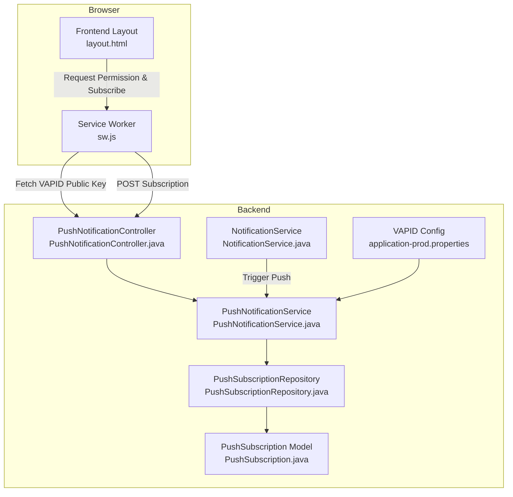
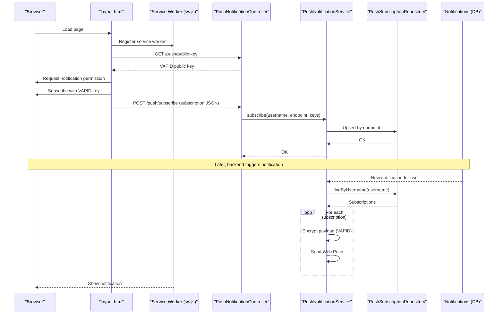
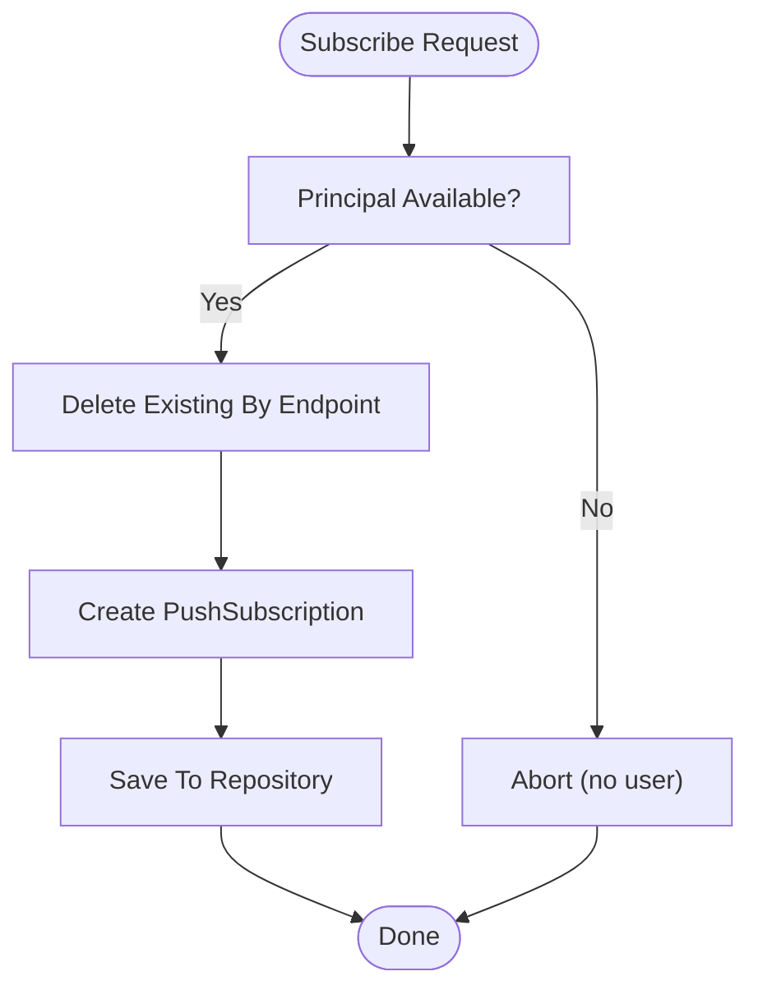
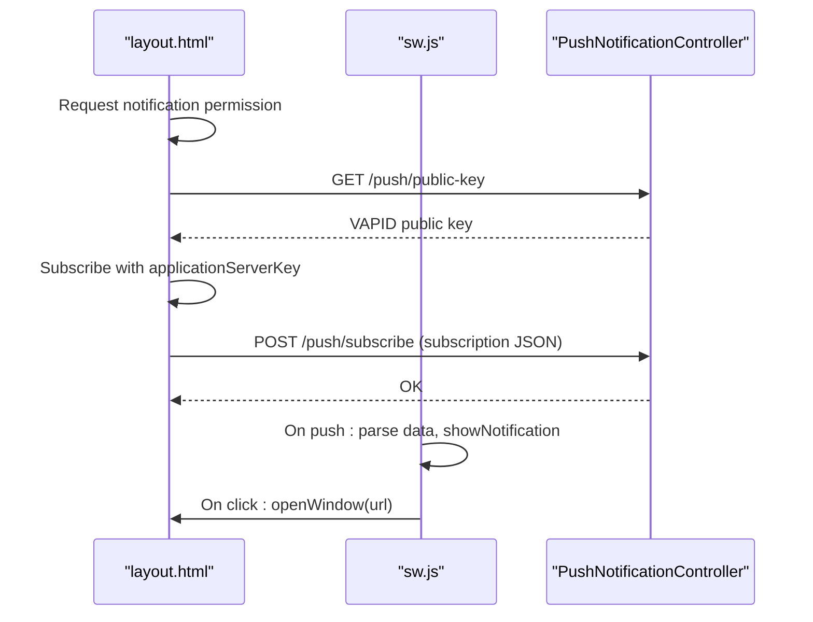
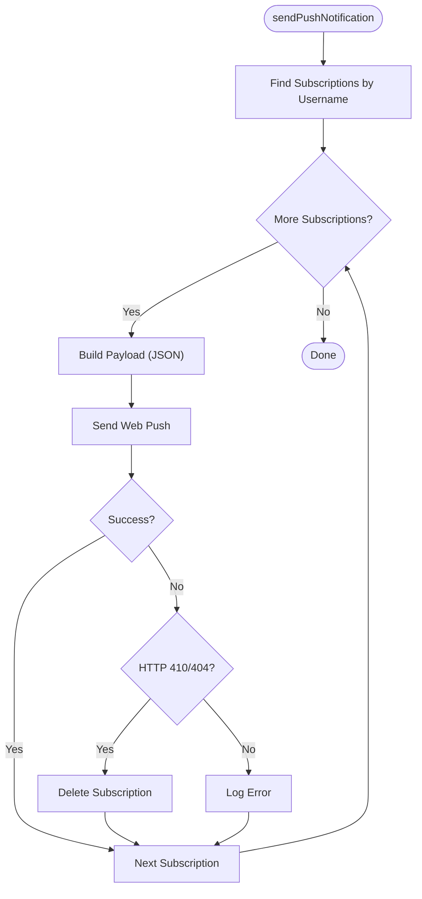
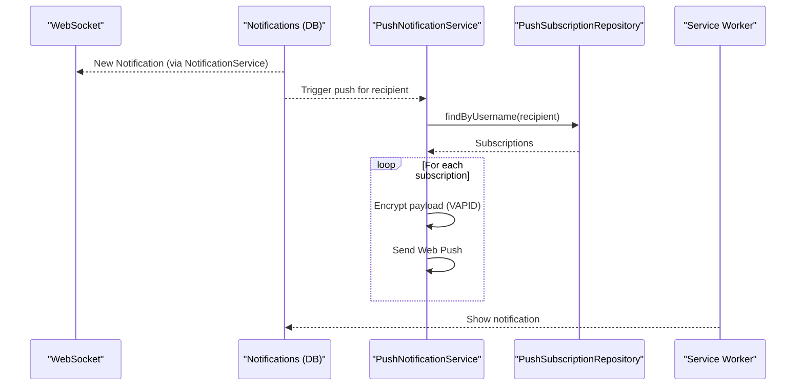
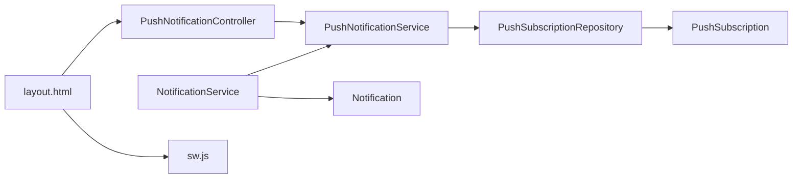

# Push Notification Service

<cite>
**Referenced Files in This Document**
- [PushNotificationController.java](file://src/main/java/root/cyb/mh/attendancesystem/controller/PushNotificationController.java)
- [PushNotificationService.java](file://src/main/java/root/cyb/mh/attendancesystem/service/PushNotificationService.java)
- [PushSubscription.java](file://src/main/java/root/cyb/mh/attendancesystem/model/PushSubscription.java)
- [PushSubscriptionRepository.java](file://src/main/java/root/cyb/mh/attendancesystem/repository/PushSubscriptionRepository.java)
- [sw.js](file://src/main/resources/static/sw.js)
- [application-prod.properties](file://src/main/resources/application-prod.properties)
- [layout.html](file://src/main/resources/templates/layout.html)
- [NotificationService.java](file://src/main/java/root/cyb/mh/attendancesystem/service/NotificationService.java)
- [Notification.java](file://src/main/java/root/cyb/mh/attendancesystem/model/Notification.java)
- [NotificationController.java](file://src/main/java/root/cyb/mh/attendancesystem/controller/NotificationController.java)
- [WorkOrder.java](file://src/main/java/root/cyb/mh/attendancesystem/model/WorkOrder.java)
- [WorkOrderRepository.java](file://src/main/java/root/cyb/mh/attendancesystem/repository/WorkOrderRepository.java)
</cite>

## Table of Contents
1. [Introduction](#introduction)
2. [Project Structure](#project-structure)
3. [Core Components](#core-components)
4. [Architecture Overview](#architecture-overview)
5. [Detailed Component Analysis](#detailed-component-analysis)
6. [Dependency Analysis](#dependency-analysis)
7. [Performance Considerations](#performance-considerations)
8. [Troubleshooting Guide](#troubleshooting-guide)
9. [Conclusion](#conclusion)
10. [Appendices](#appendices)

## Introduction
This document describes the push notification service built on the Web Push Protocol with VAPID (Voluntary Application-Server Identification). It covers VAPID configuration, push subscription management, browser registration handling, and notification delivery mechanisms. It also documents subscription creation, endpoint management, payload encryption, cross-browser compatibility, and integration with attendance status updates and work order changes.

## Project Structure
The push notification implementation spans backend Spring Boot controllers and services, a browser-side service worker, and frontend integration in the application layout template. The backend persists subscriptions and sends encrypted push messages using the Web Push protocol with VAPID.

**Diagram sources**
- [layout.html:212-247](file://src/main/resources/templates/layout.html#L212-L247)
- [sw.js:1-41](file://src/main/resources/static/sw.js#L1-L41)
- [PushNotificationController.java:17-31](file://src/main/java/root/cyb/mh/attendancesystem/controller/PushNotificationController.java#L17-L31)
- [PushNotificationService.java:35-46](file://src/main/java/root/cyb/mh/attendancesystem/service/PushNotificationService.java#L35-L46)
- [NotificationService.java:22-44](file://src/main/java/root/cyb/mh/attendancesystem/service/NotificationService.java#L22-L44)
- [PushSubscriptionRepository.java:7-11](file://src/main/java/root/cyb/mh/attendancesystem/repository/PushSubscriptionRepository.java#L7-L11)
- [PushSubscription.java:8-33](file://src/main/java/root/cyb/mh/attendancesystem/model/PushSubscription.java#L8-L33)
- [application-prod.properties:30-32](file://src/main/resources/application-prod.properties#L30-L32)

**Section sources**
- [PushNotificationController.java:1-78](file://src/main/java/root/cyb/mh/attendancesystem/controller/PushNotificationController.java#L1-L78)
- [PushNotificationService.java:1-111](file://src/main/java/root/cyb/mh/attendancesystem/service/PushNotificationService.java#L1-L111)
- [PushSubscription.java:1-34](file://src/main/java/root/cyb/mh/attendancesystem/model/PushSubscription.java#L1-L34)
- [PushSubscriptionRepository.java:1-12](file://src/main/java/root/cyb/mh/attendancesystem/repository/PushSubscriptionRepository.java#L1-L12)
- [sw.js:1-41](file://src/main/resources/static/sw.js#L1-L41)
- [application-prod.properties:1-33](file://src/main/resources/application-prod.properties#L1-L33)
- [layout.html:212-247](file://src/main/resources/templates/layout.html#L212-L247)
- [NotificationService.java:1-78](file://src/main/java/root/cyb/mh/attendancesystem/service/NotificationService.java#L1-L78)

## Core Components
- PushNotificationController: Exposes endpoints to retrieve the VAPID public key and to register push subscriptions.
- PushNotificationService: Initializes VAPID-enabled push transport, manages subscriptions, and sends encrypted push notifications.
- PushSubscription and PushSubscriptionRepository: Persist subscription records keyed by endpoint.
- Service Worker (sw.js): Handles incoming push events and notification clicks.
- Frontend Integration (layout.html): Requests notification permission, retrieves the VAPID public key, subscribes the browser, and posts subscription metadata to the backend.
- NotificationService: Orchestrates database persistence, WebSocket broadcast, and Web Push delivery.

**Section sources**
- [PushNotificationController.java:17-31](file://src/main/java/root/cyb/mh/attendancesystem/controller/PushNotificationController.java#L17-L31)
- [PushNotificationService.java:35-46](file://src/main/java/root/cyb/mh/attendancesystem/service/PushNotificationService.java#L35-L46)
- [PushSubscription.java:19-30](file://src/main/java/root/cyb/mh/attendancesystem/model/PushSubscription.java#L19-L30)
- [PushSubscriptionRepository.java:8-10](file://src/main/java/root/cyb/mh/attendancesystem/repository/PushSubscriptionRepository.java#L8-L10)
- [sw.js:1-41](file://src/main/resources/static/sw.js#L1-L41)
- [layout.html:212-247](file://src/main/resources/templates/layout.html#L212-L247)
- [NotificationService.java:22-44](file://src/main/java/root/cyb/mh/attendancesystem/service/NotificationService.java#L22-L44)

## Architecture Overview
The system integrates three delivery channels:
- Database: Notifications stored in the notifications table.
- WebSocket: Real-time delivery via Spring WebSocket to the logged-in user.
- Web Push: Encrypted push via the Web Push protocol with VAPID.

**Diagram sources**
- [layout.html:212-247](file://src/main/resources/templates/layout.html#L212-L247)
- [sw.js:1-41](file://src/main/resources/static/sw.js#L1-L41)
- [PushNotificationController.java:17-31](file://src/main/java/root/cyb/mh/attendancesystem/controller/PushNotificationController.java#L17-L31)
- [PushNotificationService.java:52-76](file://src/main/java/root/cyb/mh/attendancesystem/service/PushNotificationService.java#L52-L76)
- [PushSubscriptionRepository.java:8-10](file://src/main/java/root/cyb/mh/attendancesystem/repository/PushSubscriptionRepository.java#L8-L10)
- [NotificationService.java:22-44](file://src/main/java/root/cyb/mh/attendancesystem/service/NotificationService.java#L22-L44)

## Detailed Component Analysis

### VAPID Configuration
- The backend initializes a VAPID-enabled push transport using the public key, private key, and subject configured in the production profile.
- The public key is exposed via a dedicated endpoint for browser-side subscription.

Implementation highlights:
- VAPID keys and subject loaded from configuration.
- Initialization guarded to avoid startup failure if crypto provider initialization fails.
- Public key endpoint for client-side subscription.

**Section sources**
- [PushNotificationService.java:18-25](file://src/main/java/root/cyb/mh/attendancesystem/service/PushNotificationService.java#L18-L25)
- [PushNotificationService.java:35-46](file://src/main/java/root/cyb/mh/attendancesystem/service/PushNotificationService.java#L35-L46)
- [PushNotificationController.java:17-20](file://src/main/java/root/cyb/mh/attendancesystem/controller/PushNotificationController.java#L17-L20)
- [application-prod.properties:30-32](file://src/main/resources/application-prod.properties#L30-L32)

### Push Subscription Management
- Subscription creation:
  - The frontend requests permission, obtains the VAPID public key, and subscribes the browser with the VAPID key.
  - The subscription metadata (endpoint, keys) is posted to the backend.
  - The backend deletes any existing subscription for the same endpoint to handle re-subscription or auth changes, then persists the new subscription.
- Endpoint uniqueness:
  - Endpoint is treated as unique; existing entries are removed before saving.

**Diagram sources**
- [PushNotificationController.java:22-31](file://src/main/java/root/cyb/mh/attendancesystem/controller/PushNotificationController.java#L22-L31)
- [PushNotificationService.java:52-76](file://src/main/java/root/cyb/mh/attendancesystem/service/PushNotificationService.java#L52-L76)
- [PushSubscriptionRepository.java](file://src/main/java/root/cyb/mh/attendancesystem/repository/PushSubscriptionRepository.java#L10)

**Section sources**
- [PushNotificationController.java:22-31](file://src/main/java/root/cyb/mh/attendancesystem/controller/PushNotificationController.java#L22-L31)
- [PushNotificationService.java:52-76](file://src/main/java/root/cyb/mh/attendancesystem/service/PushNotificationService.java#L52-L76)
- [PushSubscriptionRepository.java:8-10](file://src/main/java/root/cyb/mh/attendancesystem/repository/PushSubscriptionRepository.java#L8-L10)

### Browser Registration Handling
- The frontend requests notification permission and subscribes the browser using the VAPID public key.
- The subscription JSON (endpoint and keys) is sent to the backend with CSRF protection.
- The service worker handles push events and notification clicks, displaying notifications and opening navigation URLs.

**Diagram sources**
- [layout.html:212-247](file://src/main/resources/templates/layout.html#L212-L247)
- [sw.js:1-41](file://src/main/resources/static/sw.js#L1-L41)
- [PushNotificationController.java:17-31](file://src/main/java/root/cyb/mh/attendancesystem/controller/PushNotificationController.java#L17-L31)

**Section sources**
- [layout.html:212-247](file://src/main/resources/templates/layout.html#L212-L247)
- [sw.js:1-41](file://src/main/resources/static/sw.js#L1-L41)

### Notification Delivery Mechanisms
- The backend stores notifications in the database, broadcasts them via WebSocket to the user, and attempts to deliver them via Web Push.
- Web Push payload:
  - The service wraps simple text messages into a JSON object with title, body, and url.
  - For JSON payloads, the service uses the payload as-is.
- Error handling:
  - If a delivery error indicates the subscription is gone (e.g., HTTP 410/404), the subscription is removed from storage.

**Diagram sources**
- [PushNotificationService.java:78-109](file://src/main/java/root/cyb/mh/attendancesystem/service/PushNotificationService.java#L78-L109)

**Section sources**
- [NotificationService.java:22-44](file://src/main/java/root/cyb/mh/attendancesystem/service/NotificationService.java#L22-L44)
- [PushNotificationService.java:84-91](file://src/main/java/root/cyb/mh/attendancesystem/service/PushNotificationService.java#L84-L91)
- [PushNotificationService.java:100-107](file://src/main/java/root/cyb/mh/attendancesystem/service/PushNotificationService.java#L100-L107)

### Cross-Browser Compatibility
- The service worker uses standard web APIs for push and notification handling.
- The subscription flow uses the Push API with the applicationServerKey set to the VAPID public key converted to the expected binary format.
- The backend expects subscription data in the standard shape (endpoint and keys).

**Section sources**
- [sw.js:1-41](file://src/main/resources/static/sw.js#L1-L41)
- [layout.html:212-247](file://src/main/resources/templates/layout.html#L212-L247)

### Integration with Attendance Status Updates and Work Order Changes
- The notification pipeline is used broadly across the application to inform users of system events.
- Attendance and work order updates trigger notifications, which are persisted, pushed via WebSocket, and delivered via Web Push.

**Diagram sources**
- [NotificationService.java:22-44](file://src/main/java/root/cyb/mh/attendancesystem/service/NotificationService.java#L22-L44)
- [PushNotificationService.java:78-109](file://src/main/java/root/cyb/mh/attendancesystem/service/PushNotificationService.java#L78-L109)
- [PushSubscriptionRepository.java:8-10](file://src/main/java/root/cyb/mh/attendancesystem/repository/PushSubscriptionRepository.java#L8-L10)
- [sw.js:1-41](file://src/main/resources/static/sw.js#L1-L41)

**Section sources**
- [NotificationService.java:22-44](file://src/main/java/root/cyb/mh/attendancesystem/service/NotificationService.java#L22-L44)
- [Notification.java:14-42](file://src/main/java/root/cyb/mh/attendancesystem/model/Notification.java#L14-L42)
- [NotificationController.java:18-47](file://src/main/java/root/cyb/mh/attendancesystem/controller/NotificationController.java#L18-L47)
- [WorkOrder.java:11-57](file://src/main/java/root/cyb/mh/attendancesystem/model/WorkOrder.java#L11-L57)
- [WorkOrderRepository.java:15-35](file://src/main/java/root/cyb/mh/attendancesystem/repository/WorkOrderRepository.java#L15-L35)

## Dependency Analysis
- PushNotificationController depends on PushNotificationService for VAPID public key retrieval and subscription handling.
- PushNotificationService depends on PushSubscriptionRepository for persistence and uses VAPID configuration.
- NotificationService orchestrates database storage, WebSocket broadcasting, and Web Push delivery.
- The service worker is decoupled from backend logic and relies on standard browser APIs.

**Diagram sources**
- [PushNotificationController.java:11-15](file://src/main/java/root/cyb/mh/attendancesystem/controller/PushNotificationController.java#L11-L15)
- [PushNotificationService.java](file://src/main/java/root/cyb/mh/attendancesystem/service/PushNotificationService.java#L29)
- [PushSubscriptionRepository.java:7-11](file://src/main/java/root/cyb/mh/attendancesystem/repository/PushSubscriptionRepository.java#L7-L11)
- [PushSubscription.java:8-33](file://src/main/java/root/cyb/mh/attendancesystem/model/PushSubscription.java#L8-L33)
- [NotificationService.java:14-21](file://src/main/java/root/cyb/mh/attendancesystem/service/NotificationService.java#L14-L21)
- [Notification.java:9-42](file://src/main/java/root/cyb/mh/attendancesystem/model/Notification.java#L9-L42)
- [layout.html:212-247](file://src/main/resources/templates/layout.html#L212-L247)
- [sw.js:1-41](file://src/main/resources/static/sw.js#L1-L41)

**Section sources**
- [PushNotificationController.java:11-15](file://src/main/java/root/cyb/mh/attendancesystem/controller/PushNotificationController.java#L11-L15)
- [PushNotificationService.java](file://src/main/java/root/cyb/mh/attendancesystem/service/PushNotificationService.java#L29)
- [PushSubscriptionRepository.java:7-11](file://src/main/java/root/cyb/mh/attendancesystem/repository/PushSubscriptionRepository.java#L7-L11)
- [NotificationService.java:14-21](file://src/main/java/root/cyb/mh/attendancesystem/service/NotificationService.java#L14-L21)

## Performance Considerations
- Subscription lookup: The service fetches all subscriptions for a user before sending; consider batching or limiting concurrent sends if scaling.
- Payload construction: Wrapping simple text into JSON adds minimal overhead; keep payloads concise.
- Error handling: Immediate deletion of invalid subscriptions reduces future retry failures.
- Crypto initialization: VAPID initialization occurs once at startup; ensure provider availability to avoid runtime exceptions.

## Troubleshooting Guide
Common issues and remedies:
- VAPID initialization failure:
  - Symptom: Startup logs indicate push service initialization failure.
  - Action: Verify cryptographic provider availability and VAPID keys in configuration.
- Subscription not saved:
  - Symptom: No subscription found after POST.
  - Action: Confirm endpoint uniqueness and that delete-by-endpoint logic runs before save.
- Push delivery errors:
  - Symptom: Exceptions mentioning HTTP 410 or 404.
  - Action: Subscription is removed automatically; re-subscription is required.
- Service worker not receiving notifications:
  - Symptom: No push notifications shown.
  - Action: Ensure service worker is registered and event handlers are present; verify push event parsing and notification options.

**Section sources**
- [PushNotificationService.java:41-45](file://src/main/java/root/cyb/mh/attendancesystem/service/PushNotificationService.java#L41-L45)
- [PushNotificationService.java:100-107](file://src/main/java/root/cyb/mh/attendancesystem/service/PushNotificationService.java#L100-L107)
- [sw.js:1-41](file://src/main/resources/static/sw.js#L1-L41)

## Conclusion
The push notification service integrates seamlessly with the application’s notification pipeline. It leverages VAPID for secure Web Push delivery, supports multi-device subscriptions via endpoint uniqueness, and provides robust error handling. The combination of database persistence, WebSocket broadcasting, and Web Push ensures reliable user engagement across attendance and work order workflows.

## Appendices

### API Definitions
- GET /push/public-key
  - Description: Returns the VAPID public key for browser subscription.
  - Authentication: Requires user session.
- POST /push/subscribe
  - Description: Registers a push subscription for the current user.
  - Request body: SubscriptionRequest with endpoint and keys.
  - Authentication: Requires user session.

**Section sources**
- [PushNotificationController.java:17-31](file://src/main/java/root/cyb/mh/attendancesystem/controller/PushNotificationController.java#L17-L31)

### Notification Payload Formats
- Simple text messages are wrapped into a JSON object containing title, body, and url.
- JSON payloads are used as-is.

**Section sources**
- [PushNotificationService.java:84-91](file://src/main/java/root/cyb/mh/attendancesystem/service/PushNotificationService.java#L84-L91)

### Database Schema Notes
- push_subscriptions table stores endpoint, p256dh, and auth keys per user.
- notifications table stores user-facing notifications with type and linkAction.

**Section sources**
- [PushSubscription.java:8-33](file://src/main/java/root/cyb/mh/attendancesystem/model/PushSubscription.java#L8-L33)
- [Notification.java:9-42](file://src/main/java/root/cyb/mh/attendancesystem/model/Notification.java#L9-L42)