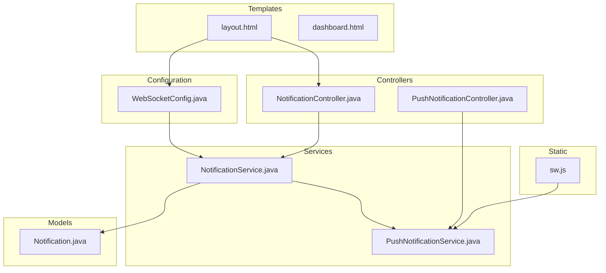
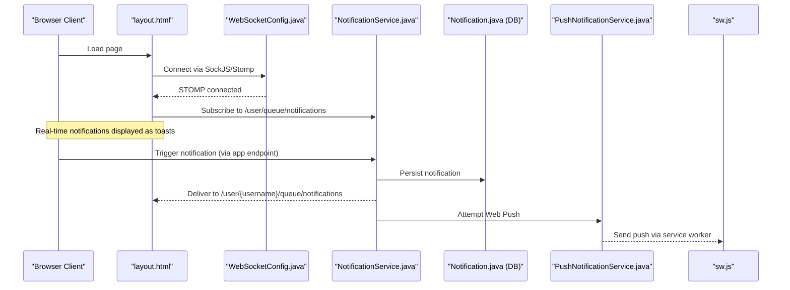
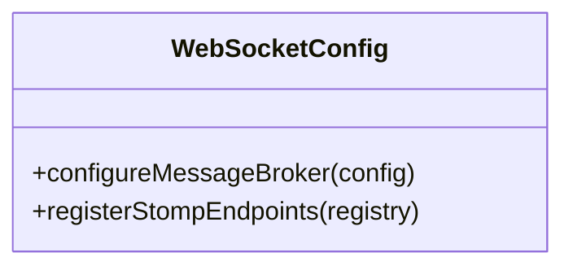
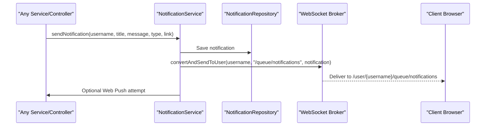
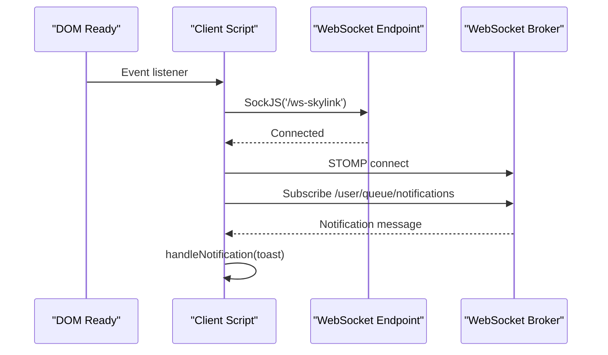
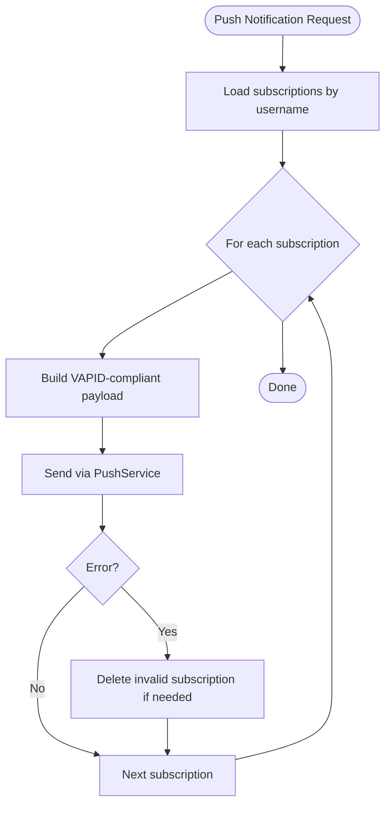
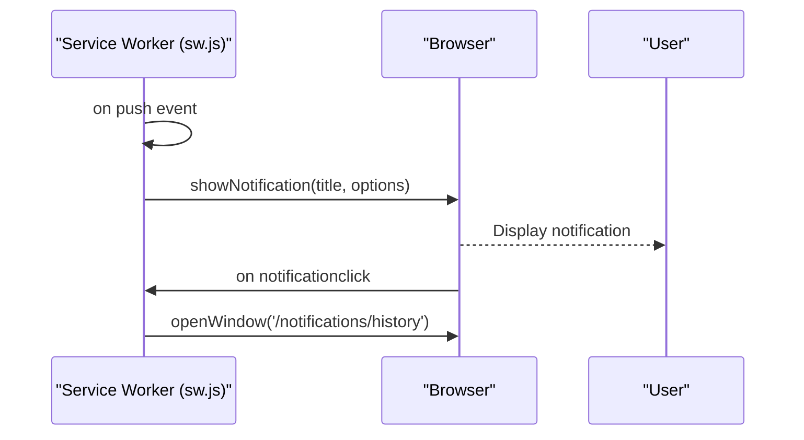
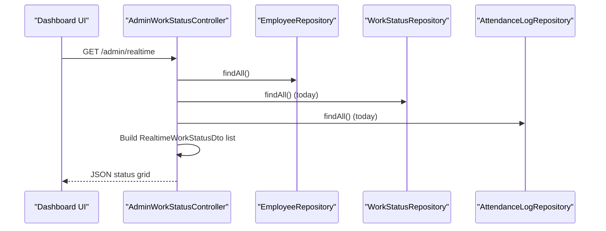
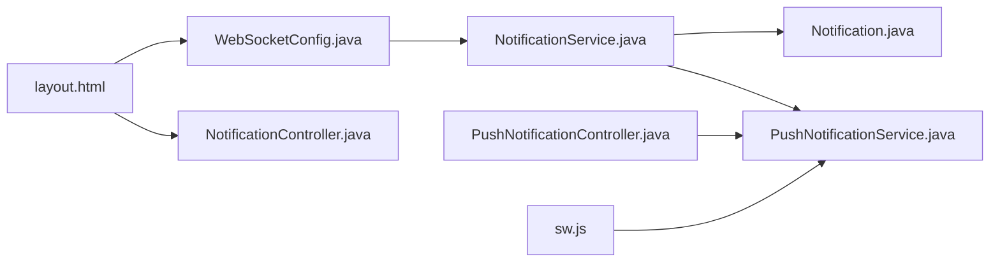

# WebSocket Real-time Communication

<cite>
**Referenced Files in This Document**
- [WebSocketConfig.java](file://src/main/java/root/cyb/mh/attendancesystem/config/WebSocketConfig.java)
- [NotificationService.java](file://src/main/java/root/cyb/mh/attendancesystem/service/NotificationService.java)
- [NotificationController.java](file://src/main/java/root/cyb/mh/attendancesystem/controller/NotificationController.java)
- [PushNotificationService.java](file://src/main/java/root/cyb/mh/attendancesystem/service/PushNotificationService.java)
- [PushNotificationController.java](file://src/main/java/root/cyb/mh/attendancesystem/controller/PushNotificationController.java)
- [layout.html](file://src/main/resources/templates/layout.html)
- [sw.js](file://src/main/resources/static/sw.js)
- [AdminWorkStatusController.java](file://src/main/java/root/cyb/mh/attendancesystem/controller/AdminWorkStatusController.java)
- [dashboard.html](file://src/main/resources/templates/dashboard.html)
- [Notification.java](file://src/main/java/root/cyb/mh/attendancesystem/model/Notification.java)
</cite>

## Table of Contents
1. [Introduction](#introduction)
2. [Project Structure](#project-structure)
3. [Core Components](#core-components)
4. [Architecture Overview](#architecture-overview)
5. [Detailed Component Analysis](#detailed-component-analysis)
6. [Dependency Analysis](#dependency-analysis)
7. [Performance Considerations](#performance-considerations)
8. [Troubleshooting Guide](#troubleshooting-guide)
9. [Conclusion](#conclusion)

## Introduction
This document explains the WebSocket real-time communication implementation in the Skylink attendance and work order management system. It covers WebSocket configuration, STOMP endpoint setup, bidirectional communication patterns, user-specific messaging, and integration with the notification system. Practical examples include WebSocket endpoints, message formats, client-side integration patterns, and real-time status updates for attendance monitoring and work order tracking.

## Project Structure
The WebSocket implementation spans configuration, services, controllers, and client-side templates:
- Configuration: WebSocket endpoint and broker destinations
- Services: Notification delivery via WebSocket and Web Push
- Controllers: Notification retrieval and push subscription management
- Templates: Client-side WebSocket connection and toast notifications
- Service Worker: Background push notifications

**Diagram sources**
- [WebSocketConfig.java:1-26](file://src/main/java/root/cyb/mh/attendancesystem/config/WebSocketConfig.java#L1-L26)
- [NotificationService.java:1-77](file://src/main/java/root/cyb/mh/attendancesystem/service/NotificationService.java#L1-L77)
- [PushNotificationService.java:1-111](file://src/main/java/root/cyb/mh/attendancesystem/service/PushNotificationService.java#L1-L111)
- [NotificationController.java:1-49](file://src/main/java/root/cyb/mh/attendancesystem/controller/NotificationController.java#L1-L49)
- [PushNotificationController.java:1-78](file://src/main/java/root/cyb/mh/attendancesystem/controller/PushNotificationController.java#L1-L78)
- [layout.html:102-292](file://src/main/resources/templates/layout.html#L102-L292)
- [sw.js:1-40](file://src/main/resources/static/sw.js#L1-L40)
- [Notification.java:1-43](file://src/main/java/root/cyb/mh/attendancesystem/model/Notification.java#L1-L43)

**Section sources**
- [WebSocketConfig.java:1-26](file://src/main/java/root/cyb/mh/attendancesystem/config/WebSocketConfig.java#L1-L26)
- [layout.html:102-292](file://src/main/resources/templates/layout.html#L102-L292)

## Core Components
- WebSocket configuration enables a STOMP endpoint with SockJS fallback and sets up a simple broker for topics and queues. User-specific destinations are prefixed for private queues.
- Notification service persists notifications to the database and broadcasts them to the connected user via WebSocket. It also triggers Web Push notifications through a service worker.
- Client-side template initializes SockJS and STOMP, connects to the WebSocket endpoint, subscribes to the user's private queue, and displays toast notifications.

Key WebSocket destinations:
- Application destination prefix: /app
- Broker destinations: /topic and /queue
- User destination prefix: /user
- Private queue pattern: /user/{username}/queue/notifications

**Section sources**
- [WebSocketConfig.java:13-24](file://src/main/java/root/cyb/mh/attendancesystem/config/WebSocketConfig.java#L13-L24)
- [NotificationService.java:22-44](file://src/main/java/root/cyb/mh/attendancesystem/service/NotificationService.java#L22-L44)
- [layout.html:119-134](file://src/main/resources/templates/layout.html#L119-L134)

## Architecture Overview
The system supports real-time notifications through two channels:
- WebSocket: Direct, low-latency messages delivered to the currently connected user
- Web Push: Background notifications via a service worker when the user is offline

**Diagram sources**
- [layout.html:119-134](file://src/main/resources/templates/layout.html#L119-L134)
- [WebSocketConfig.java:13-24](file://src/main/java/root/cyb/mh/attendancesystem/config/WebSocketConfig.java#L13-L24)
- [NotificationService.java:22-44](file://src/main/java/root/cyb/mh/attendancesystem/service/NotificationService.java#L22-L44)
- [PushNotificationService.java:78-110](file://src/main/java/root/cyb/mh/attendancesystem/service/PushNotificationService.java#L78-L110)
- [sw.js:1-40](file://src/main/resources/static/sw.js#L1-L40)

## Detailed Component Analysis

### WebSocket Configuration
- Enables a simple broker for /topic and /queue destinations
- Sets application destination prefix to /app
- Enables user-specific destinations with /user prefix
- Registers STOMP endpoint /ws-skylink with SockJS support

**Diagram sources**
- [WebSocketConfig.java:11-24](file://src/main/java/root/cyb/mh/attendancesystem/config/WebSocketConfig.java#L11-L24)

**Section sources**
- [WebSocketConfig.java:13-24](file://src/main/java/root/cyb/mh/attendancesystem/config/WebSocketConfig.java#L13-L24)

### Notification Delivery Pipeline
- Persistence: Notification entity stored with recipient, title, message, type, and link
- WebSocket broadcast: Uses SimpMessagingTemplate to send to /user/{username}/queue/notifications
- Web Push: Attempts to deliver via service worker using VAPID keys

**Diagram sources**
- [NotificationService.java:22-44](file://src/main/java/root/cyb/mh/attendancesystem/service/NotificationService.java#L22-L44)
- [Notification.java:14-42](file://src/main/java/root/cyb/mh/attendancesystem/model/Notification.java#L14-L42)

**Section sources**
- [NotificationService.java:22-44](file://src/main/java/root/cyb/mh/attendancesystem/service/NotificationService.java#L22-L44)
- [Notification.java:14-42](file://src/main/java/root/cyb/mh/attendancesystem/model/Notification.java#L14-L42)

### Client-Side WebSocket Integration
- Loads SockJS and Stomp libraries
- Establishes connection to /ws-skylink
- Subscribes to /user/queue/notifications
- Displays toast notifications upon receipt

**Diagram sources**
- [layout.html:119-134](file://src/main/resources/templates/layout.html#L119-L134)

**Section sources**
- [layout.html:108-134](file://src/main/resources/templates/layout.html#L108-L134)

### Push Notification Service
- Provides VAPID public key for browser subscription
- Stores push subscriptions per user and endpoint
- Sends push notifications via Web Push protocol
- Handles cleanup for expired subscriptions

**Diagram sources**
- [PushNotificationService.java:78-110](file://src/main/java/root/cyb/mh/attendancesystem/service/PushNotificationService.java#L78-L110)

**Section sources**
- [PushNotificationController.java:17-31](file://src/main/java/root/cyb/mh/attendancesystem/controller/PushNotificationController.java#L17-L31)
- [PushNotificationService.java:18-50](file://src/main/java/root/cyb/mh/attendancesystem/service/PushNotificationService.java#L18-L50)
- [PushNotificationService.java:52-76](file://src/main/java/root/cyb/mh/attendancesystem/service/PushNotificationService.java#L52-L76)
- [PushNotificationService.java:78-110](file://src/main/java/root/cyb/mh/attendancesystem/service/PushNotificationService.java#L78-L110)

### Service Worker for Background Notifications
- Receives push events and shows native browser notifications
- Opens notification history page on click

**Diagram sources**
- [sw.js:1-40](file://src/main/resources/static/sw.js#L1-L40)

**Section sources**
- [sw.js:1-40](file://src/main/resources/static/sw.js#L1-L40)

### Real-time Status Updates for Attendance Monitoring
- Admin endpoint aggregates current work status and attendance logs for the day
- Returns structured DTOs suitable for live dashboards
- Client dashboard template includes live grid and filtering controls

**Diagram sources**
- [AdminWorkStatusController.java:35-66](file://src/main/java/root/cyb/mh/attendancesystem/controller/AdminWorkStatusController.java#L35-L66)

**Section sources**
- [AdminWorkStatusController.java:35-66](file://src/main/java/root/cyb/mh/attendancesystem/controller/AdminWorkStatusController.java#L35-L66)
- [dashboard.html:180-196](file://src/main/resources/templates/dashboard.html#L180-L196)

## Dependency Analysis
- WebSocketConfig defines broker destinations and STOMP endpoint
- NotificationService depends on SimpMessagingTemplate and NotificationRepository
- PushNotificationService depends on VAPID configuration and PushSubscriptionRepository
- Client-side layout.html depends on WebSocketConfig for endpoint and destination routing
- Service worker sw.js depends on browser push infrastructure

**Diagram sources**
- [WebSocketConfig.java:13-24](file://src/main/java/root/cyb/mh/attendancesystem/config/WebSocketConfig.java#L13-L24)
- [NotificationService.java:17-20](file://src/main/java/root/cyb/mh/attendancesystem/service/NotificationService.java#L17-L20)
- [PushNotificationService.java:29-33](file://src/main/java/root/cyb/mh/attendancesystem/service/PushNotificationService.java#L29-L33)
- [layout.html:119-134](file://src/main/resources/templates/layout.html#L119-L134)
- [PushNotificationController.java:13-15](file://src/main/java/root/cyb/mh/attendancesystem/controller/PushNotificationController.java#L13-L15)
- [sw.js:1-40](file://src/main/resources/static/sw.js#L1-L40)

**Section sources**
- [WebSocketConfig.java:13-24](file://src/main/java/root/cyb/mh/attendancesystem/config/WebSocketConfig.java#L13-L24)
- [NotificationService.java:17-20](file://src/main/java/root/cyb/mh/attendancesystem/service/NotificationService.java#L17-L20)
- [PushNotificationService.java:29-33](file://src/main/java/root/cyb/mh/attendancesystem/service/PushNotificationService.java#L29-L33)
- [layout.html:119-134](file://src/main/resources/templates/layout.html#L119-L134)
- [PushNotificationController.java:13-15](file://src/main/java/root/cyb/mh/attendancesystem/controller/PushNotificationController.java#L13-L15)
- [sw.js:1-40](file://src/main/resources/static/sw.js#L1-L40)

## Performance Considerations
- Message Broker Scalability: The simple broker is suitable for development and small deployments. For production, consider external brokers (e.g., RabbitMQ, Apache Kafka) to scale horizontally.
- Broadcast Efficiency: Limit the number of subscribers per user and avoid unnecessary message duplication.
- Client Subscription Management: Ensure stale subscriptions are cleaned up to prevent delivery failures.
- Latency: WebSocket connections reduce latency compared to polling. Combine with efficient DTO structures for real-time grids.

## Troubleshooting Guide
Common issues and resolutions:
- Connection Failures
  - Verify STOMP endpoint /ws-skylink is reachable and SockJS is loaded
  - Confirm WebSocketConfig registers the endpoint and enables SockJS
- Subscription Issues
  - Ensure CSRF tokens are included when subscribing via POST /push/subscribe
  - Validate VAPID keys are configured for push notifications
- Delivery Failures
  - Check for 410 Gone responses indicating expired subscriptions; clean them up
  - Confirm user-specific queue destinations match the logged-in username
- Client Notifications
  - Ensure service worker is registered and push permissions are granted
  - Verify notification history page opens correctly on click

**Section sources**
- [layout.html:119-134](file://src/main/resources/templates/layout.html#L119-L134)
- [PushNotificationController.java:22-31](file://src/main/java/root/cyb/mh/attendancesystem/controller/PushNotificationController.java#L22-L31)
- [PushNotificationService.java:100-109](file://src/main/java/root/cyb/mh/attendancesystem/service/PushNotificationService.java#L100-L109)
- [sw.js:28-40](file://src/main/resources/static/sw.js#L28-L40)

## Conclusion
The WebSocket implementation provides reliable, low-latency real-time notifications integrated with both WebSocket and Web Push channels. The configuration establishes a clear routing model for user-specific messaging, while the service layer ensures robust persistence and delivery. Client-side integration is straightforward, enabling immediate toast notifications and background push alerts. For attendance monitoring and work order tracking, the system supports live status aggregation and dashboard updates suitable for administrative oversight.