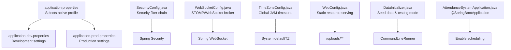
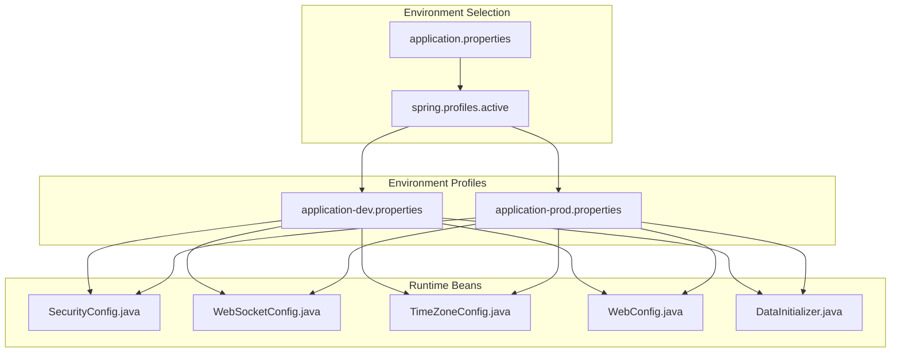
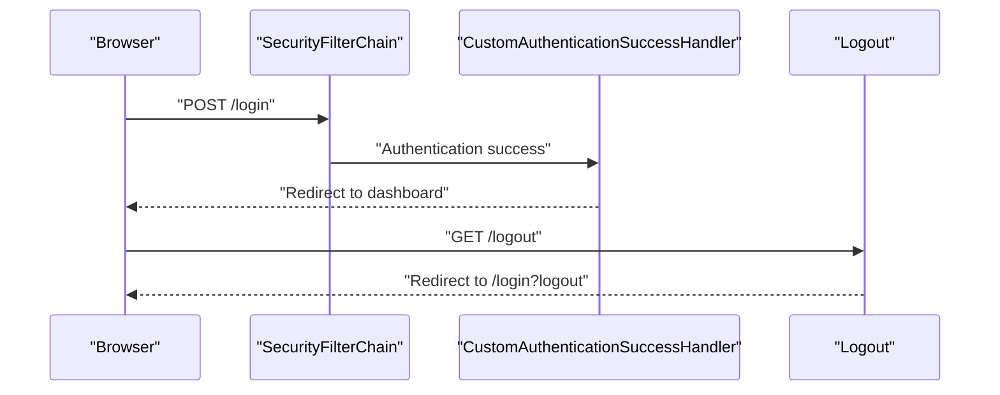
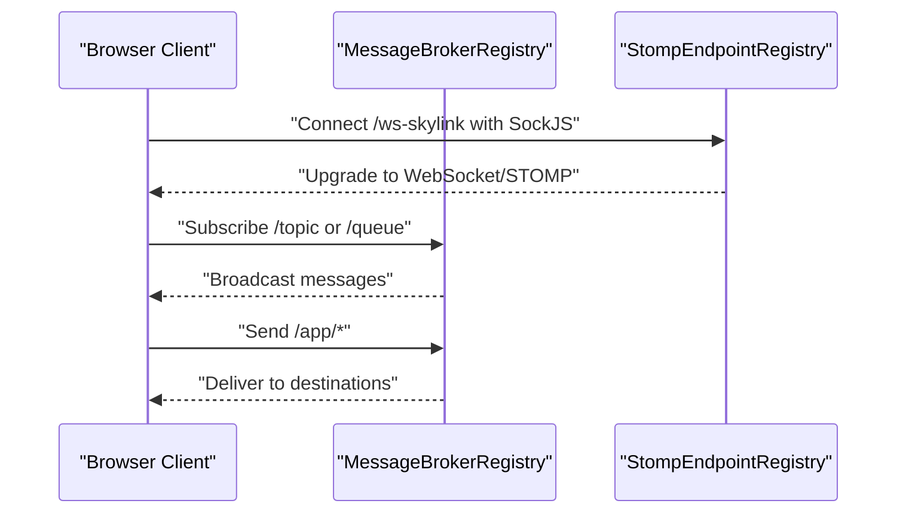
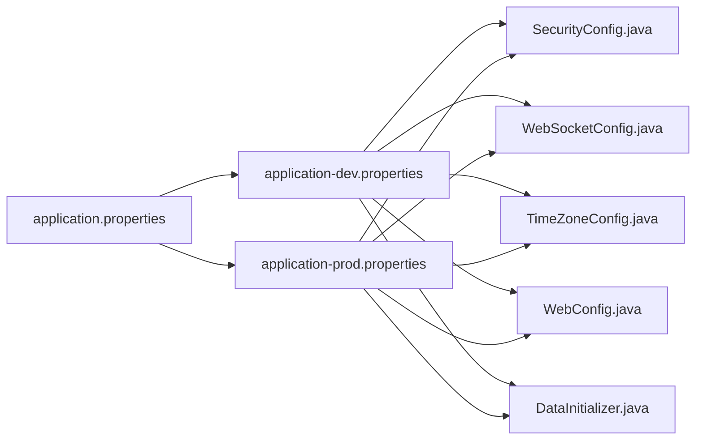

# Configuration Management

<cite>
**Referenced Files in This Document**
- [application.properties](file://src/main/resources/application.properties)
- [application-dev.properties](file://src/main/resources/application-dev.properties)
- [application-prod.properties](file://src/main/resources/application-prod.properties)
- [SecurityConfig.java](file://src/main/java/root/cyb/mh/attendancesystem/config/SecurityConfig.java)
- [WebSocketConfig.java](file://src/main/java/root/cyb/mh/attendancesystem/config/WebSocketConfig.java)
- [TimeZoneConfig.java](file://src/main/java/root/cyb/mh/attendancesystem/config/TimeZoneConfig.java)
- [WebConfig.java](file://src/main/java/root/cyb/mh/attendancesystem/config/WebConfig.java)
- [DataInitializer.java](file://src/main/java/root/cyb/mh/attendancesystem/config/DataInitializer.java)
- [AttendanceSystemApplication.java](file://src/main/java/root/cyb/mh/attendancesystem/AttendanceSystemApplication.java)
- [build.gradle](file://build.gradle)
- [README.md](file://README.md)
- [attendance-service.xml](file://attendance-service.xml)
</cite>

## Table of Contents
1. [Introduction](#introduction)
2. [Project Structure](#project-structure)
3. [Core Components](#core-components)
4. [Architecture Overview](#architecture-overview)
5. [Detailed Component Analysis](#detailed-component-analysis)
6. [Dependency Analysis](#dependency-analysis)
7. [Performance Considerations](#performance-considerations)
8. [Troubleshooting Guide](#troubleshooting-guide)
9. [Conclusion](#conclusion)
10. [Appendices](#appendices)

## Introduction
This document explains how to configure the Skylink Custom Backend for different environments, covering environment profiles, application properties, security settings, database configuration, external service integrations (SMTP, Web Push), WebSocket setup, timezone handling, and Thymeleaf template engine configuration. It also provides practical examples for development versus production, environment setup, and troubleshooting configuration issues.

## Project Structure
Configuration is primarily managed via Spring Boot property files and Java-based configuration classes:
- Environment profiles: application.properties selects the active profile; environment-specific files define runtime settings.
- Java configuration: Security, WebSocket, timezone, and MVC resource handling are configured programmatically.
- Template engine: Thymeleaf is enabled via the build configuration and used for server-side rendering of HTML templates.

**Diagram sources**
- [application.properties:1-1](file://src/main/resources/application.properties#L1-L1)
- [application-dev.properties:1-33](file://src/main/resources/application-dev.properties#L1-L33)
- [application-prod.properties:1-33](file://src/main/resources/application-prod.properties#L1-L33)
- [SecurityConfig.java:1-91](file://src/main/java/root/cyb/mh/attendancesystem/config/SecurityConfig.java#L1-L91)
- [WebSocketConfig.java:1-26](file://src/main/java/root/cyb/mh/attendancesystem/config/WebSocketConfig.java#L1-L26)
- [TimeZoneConfig.java:1-27](file://src/main/java/root/cyb/mh/attendancesystem/config/TimeZoneConfig.java#L1-L27)
- [WebConfig.java:1-18](file://src/main/java/root/cyb/mh/attendancesystem/config/WebConfig.java#L1-L18)
- [DataInitializer.java:1-122](file://src/main/java/root/cyb/mh/attendancesystem/config/DataInitializer.java#L1-L122)
- [AttendanceSystemApplication.java:1-16](file://src/main/java/root/cyb/mh/attendancesystem/AttendanceSystemApplication.java#L1-L16)

**Section sources**
- [application.properties:1-1](file://src/main/resources/application.properties#L1-L1)
- [application-dev.properties:1-33](file://src/main/resources/application-dev.properties#L1-L33)
- [application-prod.properties:1-33](file://src/main/resources/application-prod.properties#L1-L33)
- [build.gradle:34-55](file://build.gradle#L34-L55)
- [README.md:1-88](file://README.md#L1-L88)

## Core Components
- Environment profiles and selection
  - Active profile is controlled by application.properties.
  - application-dev.properties and application-prod.properties define environment-specific settings.
- Database configuration
  - Datasource URL, username, password, and Hibernate dialect are defined per environment.
  - DDL auto is set to update for both environments.
- Security configuration
  - Form login, custom success handler, remember-me, logout, and CSRF disabled in the current implementation.
  - Password encoding uses BCrypt.
- External service integrations
  - SMTP mail settings for Gmail are configured per environment.
  - Web Push VAPID keys and subject are configured per environment.
- WebSocket configuration
  - STOMP endpoint with SockJS support and message broker destinations.
- Timezone handling
  - Global JVM default timezone is set from app.timezone.
- Template engine configuration
  - Thymeleaf is included via build dependencies and used for server-side rendering.
- Static resource serving
  - Local uploads directory served under /uploads/**.

**Section sources**
- [application.properties:1-1](file://src/main/resources/application.properties#L1-L1)
- [application-dev.properties:1-33](file://src/main/resources/application-dev.properties#L1-L33)
- [application-prod.properties:1-33](file://src/main/resources/application-prod.properties#L1-L33)
- [SecurityConfig.java:18-84](file://src/main/java/root/cyb/mh/attendancesystem/config/SecurityConfig.java#L18-L84)
- [WebSocketConfig.java:13-24](file://src/main/java/root/cyb/mh/attendancesystem/config/WebSocketConfig.java#L13-L24)
- [TimeZoneConfig.java:17-25](file://src/main/java/root/cyb/mh/attendancesystem/config/TimeZoneConfig.java#L17-L25)
- [WebConfig.java:10-16](file://src/main/java/root/cyb/mh/attendancesystem/config/WebConfig.java#L10-L16)
- [build.gradle:34-55](file://build.gradle#L34-L55)

## Architecture Overview
The configuration architecture ties environment properties to runtime behavior through Spring Boot’s configuration mechanisms and Java-based beans.

**Diagram sources**
- [application.properties:1-1](file://src/main/resources/application.properties#L1-L1)
- [application-dev.properties:1-33](file://src/main/resources/application-dev.properties#L1-L33)
- [application-prod.properties:1-33](file://src/main/resources/application-prod.properties#L1-L33)
- [SecurityConfig.java:1-91](file://src/main/java/root/cyb/mh/attendancesystem/config/SecurityConfig.java#L1-L91)
- [WebSocketConfig.java:1-26](file://src/main/java/root/cyb/mh/attendancesystem/config/WebSocketConfig.java#L1-L26)
- [TimeZoneConfig.java:1-27](file://src/main/java/root/cyb/mh/attendancesystem/config/TimeZoneConfig.java#L1-L27)
- [WebConfig.java:1-18](file://src/main/java/root/cyb/mh/attendancesystem/config/WebConfig.java#L1-L18)
- [DataInitializer.java:1-122](file://src/main/java/root/cyb/mh/attendancesystem/config/DataInitializer.java#L1-L122)

## Detailed Component Analysis

### Environment Profiles and Properties
- Profile selection
  - application.properties activates either dev or prod.
- Development profile (application-dev.properties)
  - Datasource points to a local development database.
  - Server port is set for local runs.
  - Testing flag enables seed data and test records.
  - SMTP and Web Push keys configured for development.
- Production profile (application-prod.properties)
  - Datasource points to the production database.
  - Server port adjusted for production.
  - Testing flag disabled to avoid test data injection.
  - SMTP and Web Push keys configured for production.

Practical example: To switch to development, ensure spring.profiles.active=dev in application.properties and populate application-dev.properties accordingly.

**Section sources**
- [application.properties:1-1](file://src/main/resources/application.properties#L1-L1)
- [application-dev.properties:1-33](file://src/main/resources/application-dev.properties#L1-L33)
- [application-prod.properties:1-33](file://src/main/resources/application-prod.properties#L1-L33)

### Database Configuration
- Datasource URL, username, and password are defined per environment.
- Hibernate dialect is set to PostgreSQL.
- DDL auto is set to update for both environments.

Operational note: Ensure the target PostgreSQL instance is reachable and credentials match the environment.

**Section sources**
- [application-dev.properties:1-6](file://src/main/resources/application-dev.properties#L1-L6)
- [application-prod.properties:1-6](file://src/main/resources/application-prod.properties#L1-L6)

### Security Settings
- SecurityFilterChain permits static assets and login/error endpoints.
- Role-based access controls restrict administrative areas.
- Form login with a custom success handler and remember-me token.
- CSRF is disabled in the current implementation to avoid breaking existing forms.

Recommendation: Re-enable CSRF and ensure all forms include CSRF tokens for production hardening.

**Diagram sources**
- [SecurityConfig.java:18-84](file://src/main/java/root/cyb/mh/attendancesystem/config/SecurityConfig.java#L18-L84)

**Section sources**
- [SecurityConfig.java:18-84](file://src/main/java/root/cyb/mh/attendancesystem/config/SecurityConfig.java#L18-L84)

### External Service Integrations
- SMTP
  - Host, port, username, password, and TLS settings are configured per environment.
- Web Push (VAPID)
  - Public/private keys and subject are configured per environment.

Practical example: Update application-dev.properties or application-prod.properties with your SMTP credentials and VAPID keys before enabling push notifications.

**Section sources**
- [application-dev.properties:19-32](file://src/main/resources/application-dev.properties#L19-L32)
- [application-prod.properties:19-32](file://src/main/resources/application-prod.properties#L19-L32)

### WebSocket Setup
- Message broker destinations include topic and queue prefixes.
- Application destination prefix is /app.
- User-specific destinations use /user.
- STOMP endpoint registered with SockJS at /ws-skylink.

**Diagram sources**
- [WebSocketConfig.java:13-24](file://src/main/java/root/cyb/mh/attendancesystem/config/WebSocketConfig.java#L13-L24)

**Section sources**
- [WebSocketConfig.java:11-25](file://src/main/java/root/cyb/mh/attendancesystem/config/WebSocketConfig.java#L11-L25)

### Timezone Handling
- The JVM default timezone is set globally at startup based on app.timezone.
- The configuration reads from the active environment profile.

Practical example: Set app.timezone to the desired timezone ID (e.g., Etc/GMT+5) in the active application-*.properties file.

**Section sources**
- [TimeZoneConfig.java:17-25](file://src/main/java/root/cyb/mh/attendancesystem/config/TimeZoneConfig.java#L17-L25)
- [application-dev.properties:8-10](file://src/main/resources/application-dev.properties#L8-L10)
- [application-prod.properties:8-10](file://src/main/resources/application-prod.properties#L8-L10)

### Template Engine Configuration (Thymeleaf)
- Thymeleaf is included via build dependencies and used for server-side rendering of HTML templates.
- Spring Security dialect extras are included for template-level security expressions.

Operational note: Templates are located under src/main/resources/templates and rendered by controllers.

**Section sources**
- [build.gradle:36-40](file://build.gradle#L36-L40)
- [README.md:11-11](file://README.md#L11-L11)

### Static Resource Serving
- Local uploads directory is served under /uploads/**.
- Path mapping uses a file: protocol pointing to the working directory.

Practical example: Place uploaded files in the uploads directory at the project root; they will be accessible via /uploads/.

**Section sources**
- [WebConfig.java:10-16](file://src/main/java/root/cyb/mh/attendancesystem/config/WebConfig.java#L10-L16)

### Data Initialization and Testing Mode
- CommandLineRunner seeds initial devices and users when the database is empty.
- Testing mode flag (from app.testing) controls whether dummy work status records are injected during initialization.

Practical example: Enable app.testing=true in development to generate test data; keep it false in production.

**Section sources**
- [DataInitializer.java:15-118](file://src/main/java/root/cyb/mh/attendancesystem/config/DataInitializer.java#L15-L118)
- [application-dev.properties:12-13](file://src/main/resources/application-dev.properties#L12-L13)
- [application-prod.properties:12-13](file://src/main/resources/application-prod.properties#L12-L13)

### Application Entry Point and Scheduling
- AttendanceSystemApplication is the Spring Boot entry point and enables scheduling.

**Section sources**
- [AttendanceSystemApplication.java:7-9](file://src/main/java/root/cyb/mh/attendancesystem/AttendanceSystemApplication.java#L7-L9)

## Dependency Analysis
Configuration dependencies across components:

**Diagram sources**
- [application.properties:1-1](file://src/main/resources/application.properties#L1-L1)
- [application-dev.properties:1-33](file://src/main/resources/application-dev.properties#L1-L33)
- [application-prod.properties:1-33](file://src/main/resources/application-prod.properties#L1-L33)
- [SecurityConfig.java:1-91](file://src/main/java/root/cyb/mh/attendancesystem/config/SecurityConfig.java#L1-L91)
- [WebSocketConfig.java:1-26](file://src/main/java/root/cyb/mh/attendancesystem/config/WebSocketConfig.java#L1-L26)
- [TimeZoneConfig.java:1-27](file://src/main/java/root/cyb/mh/attendancesystem/config/TimeZoneConfig.java#L1-L27)
- [WebConfig.java:1-18](file://src/main/java/root/cyb/mh/attendancesystem/config/WebConfig.java#L1-L18)
- [DataInitializer.java:1-122](file://src/main/java/root/cyb/mh/attendancesystem/config/DataInitializer.java#L1-L122)

**Section sources**
- [build.gradle:34-55](file://build.gradle#L34-L55)

## Performance Considerations
- Keep CSRF disabled only temporarily; re-enable it in production for robust protection.
- Tune session timeout via server.servlet.session.timeout appropriately for your environment.
- Monitor database connection pool sizing and query performance; adjust datasource settings as needed.
- Ensure timezone alignment across JVM, database, and application logic to avoid off-by-one errors in reporting.

[No sources needed since this section provides general guidance]

## Troubleshooting Guide
Common configuration issues and resolutions:
- Profile not applied
  - Verify spring.profiles.active in application.properties matches the intended environment file name.
- Database connectivity failures
  - Confirm datasource URL, username, and password in the active application-*.properties file.
  - Ensure the PostgreSQL server is reachable and accepting connections.
- SMTP sending failures
  - Validate host, port, username, password, and TLS settings in the active application-*.properties file.
- Web Push notification issues
  - Ensure VAPID public/private keys and subject are present and valid in the active application-*.properties file.
- Timezone discrepancies
  - Set app.timezone to the correct zone ID in the active application-*.properties file; the JVM default will be updated at startup.
- Static resource 404
  - Confirm uploads directory exists at the project root and is readable; verify /uploads/** mapping in WebConfig.java.
- Testing data injection unexpected
  - Check app.testing value in the active application-*.properties file; set to false in production to avoid injecting test records.

**Section sources**
- [application.properties:1-1](file://src/main/resources/application.properties#L1-L1)
- [application-dev.properties:1-33](file://src/main/resources/application-dev.properties#L1-L33)
- [application-prod.properties:1-33](file://src/main/resources/application-prod.properties#L1-L33)
- [WebConfig.java:10-16](file://src/main/java/root/cyb/mh/attendancesystem/config/WebConfig.java#L10-L16)
- [DataInitializer.java:15-118](file://src/main/java/root/cyb/mh/attendancesystem/config/DataInitializer.java#L15-L118)
- [TimeZoneConfig.java:17-25](file://src/main/java/root/cyb/mh/attendancesystem/config/TimeZoneConfig.java#L17-L25)

## Conclusion
Skylink Custom Backend uses Spring Boot’s profile-driven configuration to separate development and production concerns. Security, database, external services, WebSocket, timezone, and template engine behaviors are controlled through properties and Java configuration. Follow the environment setup steps and troubleshooting tips to maintain reliable deployments across development and production.

[No sources needed since this section summarizes without analyzing specific files]

## Appendices

### Environment Setup Examples
- Development
  - Set spring.profiles.active=dev in application.properties.
  - Populate application-dev.properties with local database, SMTP, and Web Push settings.
- Production
  - Set spring.profiles.active=prod in application.properties.
  - Populate application-prod.properties with production database, SMTP, and Web Push settings.

**Section sources**
- [application.properties:1-1](file://src/main/resources/application.properties#L1-L1)
- [application-dev.properties:1-33](file://src/main/resources/application-dev.properties#L1-L33)
- [application-prod.properties:1-33](file://src/main/resources/application-prod.properties#L1-L33)

### Windows Service Configuration
- attendance-service.xml defines a Windows service wrapper for the Spring Boot application.
- Adjust executable arguments to point to the built JAR path.

**Section sources**
- [attendance-service.xml:1-11](file://attendance-service.xml#L1-L11)