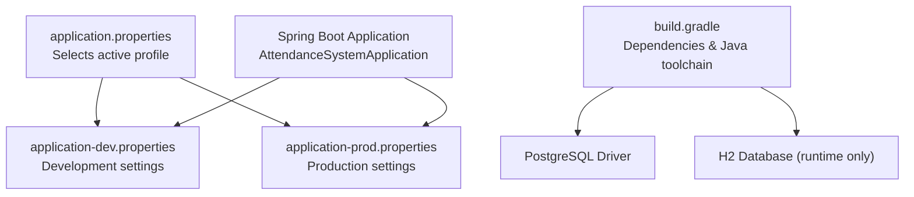
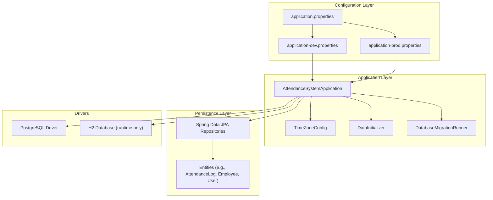
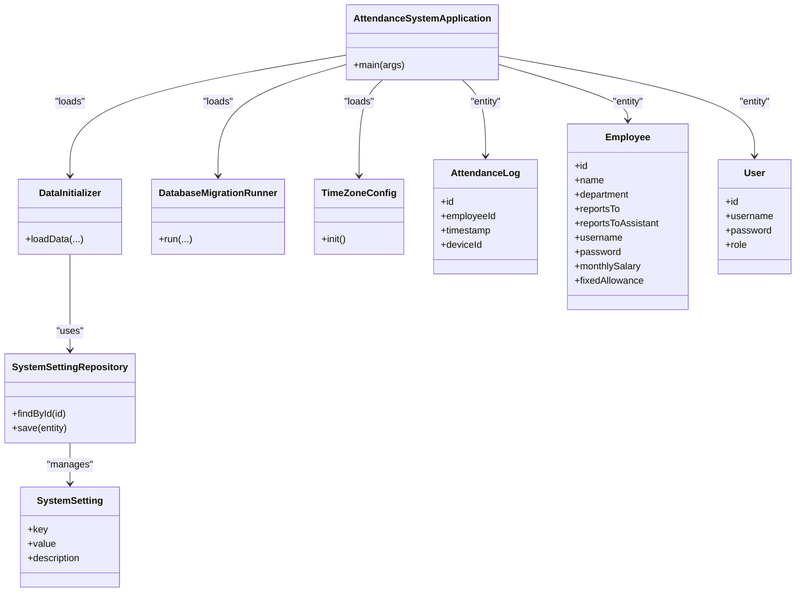
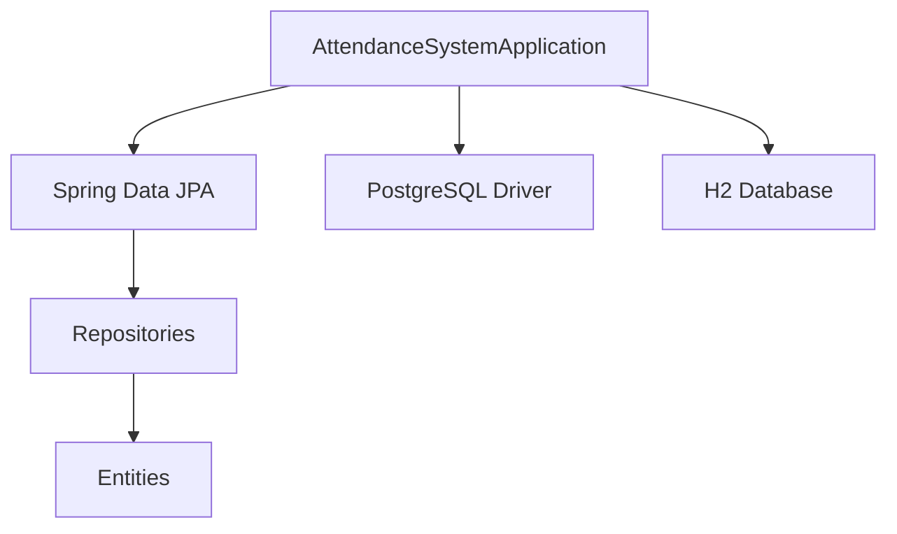

# Database Configuration

<cite>
**Referenced Files in This Document**
- [application.properties](file://src/main/resources/application.properties)
- [application-dev.properties](file://src/main/resources/application-dev.properties)
- [application-prod.properties](file://src/main/resources/application-prod.properties)
- [build.gradle](file://build.gradle)
- [AttendanceSystemApplication.java](file://src/main/java/root/cyb/mh/attendancesystem/AttendanceSystemApplication.java)
- [DataInitializer.java](file://src/main/java/root/cyb/mh/attendancesystem/config/DataInitializer.java)
- [DatabaseMigrationRunner.java](file://src/main/java/root/cyb/mh/attendancesystem/config/DatabaseMigrationRunner.java)
- [TimeZoneConfig.java](file://src/main/java/root/cyb/mh/attendancesystem/config/TimeZoneConfig.java)
- [AttendanceLog.java](file://src/main/java/root/cyb/mh/attendancesystem/model/AttendanceLog.java)
- [Employee.java](file://src/main/java/root/cyb/mh/attendancesystem/model/Employee.java)
- [User.java](file://src/main/java/root/cyb/mh/attendancesystem/model/User.java)
- [SystemSetting.java](file://src/main/java/root/cyb/mh/attendancesystem/model/SystemSetting.java)
- [SystemSettingRepository.java](file://src/main/java/root/cyb/mh/attendancesystem/repository/SystemSettingRepository.java)
</cite>

## Table of Contents
1. [Introduction](#introduction)
2. [Project Structure](#project-structure)
3. [Core Components](#core-components)
4. [Architecture Overview](#architecture-overview)
5. [Detailed Component Analysis](#detailed-component-analysis)
6. [Dependency Analysis](#dependency-analysis)
7. [Performance Considerations](#performance-considerations)
8. [Troubleshooting Guide](#troubleshooting-guide)
9. [Conclusion](#conclusion)
10. [Appendices](#appendices)

## Introduction
This document provides comprehensive database configuration guidance for the Skylink Custom Backend. It covers database connection properties, JPA/Hibernate settings, datasource configuration, connection pooling parameters, development versus production differences, schema generation options, migration configuration, and integration with Spring Data JPA. Practical examples for database URL formatting, credential management, and connection tuning are included, along with database-specific configurations for PostgreSQL and H2, transaction management, and performance optimization settings. The document also explains entity scanning, database initialization scripts, and timezone considerations.

## Project Structure
The backend uses Spring Boot’s externalized configuration via property files and Gradle dependencies to manage database connectivity and JPA/Hibernate behavior. The primary configuration files are:
- Active profile selection: [application.properties](file://src/main/resources/application.properties)
- Development profile settings: [application-dev.properties](file://src/main/resources/application-dev.properties)
- Production profile settings: [application-prod.properties](file://src/main/resources/application-prod.properties)
- Build and dependencies: [build.gradle](file://build.gradle)

**Diagram sources**
- [application.properties:1-1](file://src/main/resources/application.properties#L1-L1)
- [application-dev.properties:1-33](file://src/main/resources/application-dev.properties#L1-L33)
- [application-prod.properties:1-33](file://src/main/resources/application-prod.properties#L1-L33)
- [build.gradle:1-60](file://build.gradle#L1-L60)
- [AttendanceSystemApplication.java:1-16](file://src/main/java/root/cyb/mh/attendancesystem/AttendanceSystemApplication.java#L1-L16)

**Section sources**
- [application.properties:1-1](file://src/main/resources/application.properties#L1-L1)
- [application-dev.properties:1-33](file://src/main/resources/application-dev.properties#L1-L33)
- [application-prod.properties:1-33](file://src/main/resources/application-prod.properties#L1-L33)
- [build.gradle:1-60](file://build.gradle#L1-L60)
- [AttendanceSystemApplication.java:1-16](file://src/main/java/root/cyb/mh/attendancesystem/AttendanceSystemApplication.java#L1-L16)

## Core Components
- Active profile selection: The application activates the production profile by default.
- Datasource configuration: PostgreSQL URLs, usernames, and passwords are defined per profile.
- JPA/Hibernate settings: DDL auto mode and PostgreSQL dialect are configured.
- Database initialization: A CommandLineRunner performs schema fixes and debug queries.
- Entity scanning: Spring Boot scans for JPA repositories and entities under the main application package.
- Timezone configuration: A global JVM timezone is set for consistent temporal behavior.

Key configuration locations:
- Profile activation: [application.properties:1-1](file://src/main/resources/application.properties#L1-L1)
- Dev profile datasource and JPA: [application-dev.properties:1-6](file://src/main/resources/application-dev.properties#L1-L6)
- Prod profile datasource and JPA: [application-prod.properties:1-6](file://src/main/resources/application-prod.properties#L1-L6)
- Dependencies and drivers: [build.gradle:46-47](file://build.gradle#L46-L47)
- Initialization and migrations: [DataInitializer.java:24-31](file://src/main/java/root/cyb/mh/attendancesystem/config/DataInitializer.java#L24-L31), [DatabaseMigrationRunner.java:14-41](file://src/main/java/root/cyb/mh/attendancesystem/config/DatabaseMigrationRunner.java#L14-L41)
- Application bootstrap: [AttendanceSystemApplication.java:7-8](file://src/main/java/root/cyb/mh/attendancesystem/AttendanceSystemApplication.java#L7-L8)
- Timezone setup: [TimeZoneConfig.java:17-25](file://src/main/java/root/cyb/mh/attendancesystem/config/TimeZoneConfig.java#L17-L25)

**Section sources**
- [application.properties:1-1](file://src/main/resources/application.properties#L1-L1)
- [application-dev.properties:1-6](file://src/main/resources/application-dev.properties#L1-L6)
- [application-prod.properties:1-6](file://src/main/resources/application-prod.properties#L1-L6)
- [build.gradle:46-47](file://build.gradle#L46-L47)
- [DataInitializer.java:24-31](file://src/main/java/root/cyb/mh/attendancesystem/config/DataInitializer.java#L24-L31)
- [DatabaseMigrationRunner.java:14-41](file://src/main/java/root/cyb/mh/attendancesystem/config/DatabaseMigrationRunner.java#L14-L41)
- [AttendanceSystemApplication.java:7-8](file://src/main/java/root/cyb/mh/attendancesystem/AttendanceSystemApplication.java#L7-L8)
- [TimeZoneConfig.java:17-25](file://src/main/java/root/cyb/mh/attendancesystem/config/TimeZoneConfig.java#L17-L25)

## Architecture Overview
The database configuration architecture integrates Spring Boot profiles, JPA/Hibernate, and Spring Data repositories. The application selects a profile at startup, loads the appropriate datasource and JPA properties, and initializes the database with schema adjustments and seed data.

**Diagram sources**
- [application.properties:1-1](file://src/main/resources/application.properties#L1-L1)
- [application-dev.properties:1-6](file://src/main/resources/application-dev.properties#L1-L6)
- [application-prod.properties:1-6](file://src/main/resources/application-prod.properties#L1-L6)
- [AttendanceSystemApplication.java:7-8](file://src/main/java/root/cyb/mh/attendancesystem/AttendanceSystemApplication.java#L7-L8)
- [TimeZoneConfig.java:17-25](file://src/main/java/root/cyb/mh/attendancesystem/config/TimeZoneConfig.java#L17-L25)
- [DataInitializer.java:24-31](file://src/main/java/root/cyb/mh/attendancesystem/config/DataInitializer.java#L24-L31)
- [DatabaseMigrationRunner.java:14-41](file://src/main/java/root/cyb/mh/attendancesystem/config/DatabaseMigrationRunner.java#L14-L41)
- [build.gradle:46-47](file://build.gradle#L46-L47)

## Detailed Component Analysis

### Datasource and Connection Properties
- Development profile:
  - Database URL: [application-dev.properties:1-1](file://src/main/resources/application-dev.properties#L1-L1)
  - Username: [application-dev.properties:3-3](file://src/main/resources/application-dev.properties#L3-L3)
  - Password: [application-dev.properties:4-4](file://src/main/resources/application-dev.properties#L4-L4)
- Production profile:
  - Database URL: [application-prod.properties:1-1](file://src/main/resources/application-prod.properties#L1-L1)
  - Username: [application-prod.properties:3-3](file://src/main/resources/application-prod.properties#L3-L3)
  - Password: [application-prod.properties:4-4](file://src/main/resources/application-prod.properties#L4-L4)
- Active profile selection: [application.properties:1-1](file://src/main/resources/application.properties#L1-L1)

Notes:
- The application currently uses PostgreSQL in both environments. No dedicated H2 datasource is configured in the properties.
- For local development with H2, configure an H2 datasource profile or override properties accordingly.

**Section sources**
- [application-dev.properties:1-4](file://src/main/resources/application-dev.properties#L1-L4)
- [application-prod.properties:1-4](file://src/main/resources/application-prod.properties#L1-L4)
- [application.properties:1-1](file://src/main/resources/application.properties#L1-L1)

### JPA and Hibernate Settings
- DDL auto mode: Both dev and prod profiles set the same DDL behavior.
  - Dev: [application-dev.properties:5-5](file://src/main/resources/application-dev.properties#L5-L5)
  - Prod: [application-prod.properties:5-5](file://src/main/resources/application-prod.properties#L5-L5)
- Hibernate dialect: PostgreSQL dialect is configured for both profiles.
  - Dev: [application-dev.properties:6-6](file://src/main/resources/application-dev.properties#L6-L6)
  - Prod: [application-prod.properties:6-6](file://src/main/resources/application-prod.properties#L6-L6)

Recommendations:
- For development, consider using "create-drop" or "validate" during early iterations to prevent accidental schema mutations.
- For production, "update" is acceptable but ensure backups and controlled migrations.

**Section sources**
- [application-dev.properties:5-6](file://src/main/resources/application-dev.properties#L5-L6)
- [application-prod.properties:5-6](file://src/main/resources/application-prod.properties#L5-L6)

### Schema Generation and Migration Configuration
- Initial schema fix: The application attempts to adjust a column constraint during startup.
  - See: [DataInitializer.java:24-31](file://src/main/java/root/cyb/mh/attendancesystem/config/DataInitializer.java#L24-L31)
- Additional migration checks: A CommandLineRunner re-applies a constraint and runs debug queries.
  - See: [DatabaseMigrationRunner.java:33-41](file://src/main/java/root/cyb/mh/attendancesystem/config/DatabaseMigrationRunner.java#L33-L41)
- Native SQL usage: The PaymentRequestRepository uses native SQL for analytics.
  - Example path: [PaymentRequestRepository.java:480-480](file://src/main/java/root/cyb/mh/attendancesystem/repository/PaymentRequestRepository.java#L480-L480)

Best practices:
- Prefer Liquibase or Flyway for repeatable, versioned migrations in production.
- Keep native SQL isolated and documented; avoid mixing with ORM-managed entities.

**Section sources**
- [DataInitializer.java:24-31](file://src/main/java/root/cyb/mh/attendancesystem/config/DataInitializer.java#L24-L31)
- [DatabaseMigrationRunner.java:33-41](file://src/main/java/root/cyb/mh/attendancesystem/config/DatabaseMigrationRunner.java#L33-L41)

### Connection Pooling Parameters
- Current configuration: No explicit pool settings are defined in the properties.
- Available drivers:
  - PostgreSQL driver: [build.gradle:47-47](file://build.gradle#L47-L47)
  - H2 runtime-only: [build.gradle:46-46](file://build.gradle#L46-L46)

Recommendations:
- Add HikariCP pool settings under spring.datasource.hikari.* for production-grade tuning.
- Example keys to consider: minimumIdle, maximumPoolSize, idleTimeout, leakDetectionThreshold, connectionTimeout.

**Section sources**
- [build.gradle:46-47](file://build.gradle#L46-L47)

### Development vs Production Database Settings
- Active profile:
  - Dev: [application-dev.properties:2-2](file://src/main/resources/application-dev.properties#L2-L2)
  - Prod: [application-prod.properties:2-2](file://src/main/resources/application-prod.properties#L2-L2)
- Datasource credentials differ between environments.
- Application timezone defaults are shared across environments.
  - See: [application-dev.properties:9-10](file://src/main/resources/application-dev.properties#L9-L10)
  - See: [application-prod.properties:9-10](file://src/main/resources/application-prod.properties#L9-L10)
  - Global JVM timezone: [TimeZoneConfig.java:17-25](file://src/main/java/root/cyb/mh/attendancesystem/config/TimeZoneConfig.java#L17-L25)

**Section sources**
- [application-dev.properties:2-10](file://src/main/resources/application-dev.properties#L2-L10)
- [application-prod.properties:2-10](file://src/main/resources/application-prod.properties#L2-L10)
- [TimeZoneConfig.java:17-25](file://src/main/java/root/cyb/mh/attendancesystem/config/TimeZoneConfig.java#L17-L25)

### Database URL Formatting Examples
- PostgreSQL (standard):
  - Development: [application-dev.properties:1-1](file://src/main/resources/application-dev.properties#L1-L1)
  - Production: [application-prod.properties:1-1](file://src/main/resources/application-prod.properties#L1-L1)
- H2 (in-memory or file-based):
  - Example pattern: jdbc:h2:mem:testdb or jdbc:h2:file:./dev-data/mydb

Note: H2 is present as a runtime dependency; define a separate profile or override properties for H2 usage.

**Section sources**
- [application-dev.properties:1-1](file://src/main/resources/application-dev.properties#L1-L1)
- [application-prod.properties:1-1](file://src/main/resources/application-prod.properties#L1-L1)
- [build.gradle:46-46](file://build.gradle#L46-L46)

### Credential Management
- Store secrets externally (e.g., environment variables or a secret manager) and map them to:
  - spring.datasource.username
  - spring.datasource.password
- Reference: [application-dev.properties:3-4](file://src/main/resources/application-dev.properties#L3-L4), [application-prod.properties:3-4](file://src/main/resources/application-prod.properties#L3-L4)

**Section sources**
- [application-dev.properties:3-4](file://src/main/resources/application-dev.properties#L3-L4)
- [application-prod.properties:3-4](file://src/main/resources/application-prod.properties#L3-L4)

### Connection Tuning
- Recommended HikariCP properties (add under spring.datasource.hikari.*):
  - minimumIdle
  - maximumPoolSize
  - idleTimeout
  - connectionTimeout
  - leakDetectionThreshold
- These should be tuned based on workload, latency targets, and database capacity.

[No sources needed since this section provides general guidance]

### Transaction Management
- Default Spring Boot behavior applies. For explicit transaction boundaries, annotate service methods with @Transactional.
- The application does not declare a custom PlatformTransactionManager bean; rely on the default.

[No sources needed since this section provides general guidance]

### Performance Optimization Settings
- Enable query logging selectively for diagnostics (e.g., log slow queries).
- Use connection pooling and keep-alive settings.
- Monitor and tune database indexes for frequently queried columns (e.g., timestamps, employee identifiers).

[No sources needed since this section provides general guidance]

### Integration with Spring Data JPA
- Entity scanning:
  - The main application class enables component scanning; JPA repositories and entities under the same package are picked up automatically.
  - Reference: [AttendanceSystemApplication.java:7-8](file://src/main/java/root/cyb/mh/attendancesystem/AttendanceSystemApplication.java#L7-L8)
- Repository interfaces:
  - Example: [SystemSettingRepository.java:8-8](file://src/main/java/root/cyb/mh/attendancesystem/repository/SystemSettingRepository.java#L8-L8)
- Entities:
  - Example entities: [AttendanceLog.java:13-26](file://src/main/java/root/cyb/mh/attendancesystem/model/AttendanceLog.java#L13-L26), [Employee.java:9-30](file://src/main/java/root/cyb/mh/attendancesystem/model/Employee.java#L9-L30), [User.java:6-23](file://src/main/java/root/cyb/mh/attendancesystem/model/User.java#L6-L23), [SystemSetting.java:11-26](file://src/main/java/root/cyb/mh/attendancesystem/model/SystemSetting.java#L11-L26)

**Diagram sources**
- [AttendanceSystemApplication.java:7-8](file://src/main/java/root/cyb/mh/attendancesystem/AttendanceSystemApplication.java#L7-L8)
- [DataInitializer.java:18-22](file://src/main/java/root/cyb/mh/attendancesystem/config/DataInitializer.java#L18-L22)
- [DatabaseMigrationRunner.java:9-12](file://src/main/java/root/cyb/mh/attendancesystem/config/DatabaseMigrationRunner.java#L9-L12)
- [TimeZoneConfig.java:15-25](file://src/main/java/root/cyb/mh/attendancesystem/config/TimeZoneConfig.java#L15-L25)
- [SystemSettingRepository.java:8-8](file://src/main/java/root/cyb/mh/attendancesystem/repository/SystemSettingRepository.java#L8-L8)
- [SystemSetting.java:11-26](file://src/main/java/root/cyb/mh/attendancesystem/model/SystemSetting.java#L11-L26)
- [AttendanceLog.java:13-26](file://src/main/java/root/cyb/mh/attendancesystem/model/AttendanceLog.java#L13-L26)
- [Employee.java:9-30](file://src/main/java/root/cyb/mh/attendancesystem/model/Employee.java#L9-L30)
- [User.java:6-23](file://src/main/java/root/cyb/mh/attendancesystem/model/User.java#L6-L23)

### Database Initialization Scripts
- The application executes SQL statements at startup to initialize or repair schema:
  - Constraint adjustments and seed data creation occur in [DataInitializer.java:24-52](file://src/main/java/root/cyb/mh/attendancesystem/config/DataInitializer.java#L24-L52).
  - Debug queries and constraint re-application occur in [DatabaseMigrationRunner.java:14-41](file://src/main/java/root/cyb/mh/attendancesystem/config/DatabaseMigrationRunner.java#L14-L41).
- For production, replace ad-hoc SQL with a formal migration tool.

**Section sources**
- [DataInitializer.java:24-52](file://src/main/java/root/cyb/mh/attendancesystem/config/DataInitializer.java#L24-L52)
- [DatabaseMigrationRunner.java:14-41](file://src/main/java/root/cyb/mh/attendancesystem/config/DatabaseMigrationRunner.java#L14-L41)

### Timezone Configuration
- The application sets the JVM default timezone globally, ensuring consistent temporal behavior across the system.
  - Reference: [TimeZoneConfig.java:17-25](file://src/main/java/root/cyb/mh/attendancesystem/config/TimeZoneConfig.java#L17-L25)
- Timezone values are loaded from configuration:
  - Dev: [application-dev.properties:9-10](file://src/main/resources/application-dev.properties#L9-L10)
  - Prod: [application-prod.properties:9-10](file://src/main/resources/application-prod.properties#L9-L10)

**Section sources**
- [TimeZoneConfig.java:17-25](file://src/main/java/root/cyb/mh/attendancesystem/config/TimeZoneConfig.java#L17-L25)
- [application-dev.properties:9-10](file://src/main/resources/application-dev.properties#L9-L10)
- [application-prod.properties:9-10](file://src/main/resources/application-prod.properties#L9-L10)

## Dependency Analysis
The application depends on:
- PostgreSQL driver for production and development connectivity.
- H2 database for optional local testing and in-memory usage.
- Spring Data JPA for persistence abstraction.

**Diagram sources**
- [build.gradle:46-47](file://build.gradle#L46-L47)
- [AttendanceSystemApplication.java:7-8](file://src/main/java/root/cyb/mh/attendancesystem/AttendanceSystemApplication.java#L7-L8)

**Section sources**
- [build.gradle:46-47](file://build.gradle#L46-L47)
- [AttendanceSystemApplication.java:7-8](file://src/main/java/root/cyb/mh/attendancesystem/AttendanceSystemApplication.java#L7-L8)

## Performance Considerations
- Use connection pooling (HikariCP) with tuned parameters for throughput and latency.
- Monitor slow queries and add appropriate indexes on hot columns (e.g., timestamps, foreign keys).
- Prefer batch operations for bulk inserts/updates.
- Keep DDL auto in development; switch to controlled migrations in production.

[No sources needed since this section provides general guidance]

## Troubleshooting Guide
Common issues and resolutions:
- Connection failures:
  - Verify datasource URL, username, and password in the active profile.
  - Confirm the database server is reachable and accepting connections.
  - References: [application-dev.properties:1-4](file://src/main/resources/application-dev.properties#L1-L4), [application-prod.properties:1-4](file://src/main/resources/application-prod.properties#L1-L4)
- Schema errors:
  - Review initialization logs from [DataInitializer.java:24-31](file://src/main/java/root/cyb/mh/attendancesystem/config/DataInitializer.java#L24-L31) and [DatabaseMigrationRunner.java:33-41](file://src/main/java/root/cyb/mh/attendancesystem/config/DatabaseMigrationRunner.java#L33-L41).
- Timezone inconsistencies:
  - Ensure the timezone property is set correctly in the active profile and that [TimeZoneConfig.java:17-25](file://src/main/java/root/cyb/mh/attendancesystem/config/TimeZoneConfig.java#L17-L25) is applied.

**Section sources**
- [application-dev.properties:1-4](file://src/main/resources/application-dev.properties#L1-L4)
- [application-prod.properties:1-4](file://src/main/resources/application-prod.properties#L1-L4)
- [DataInitializer.java:24-31](file://src/main/java/root/cyb/mh/attendancesystem/config/DataInitializer.java#L24-L31)
- [DatabaseMigrationRunner.java:33-41](file://src/main/java/root/cyb/mh/attendancesystem/config/DatabaseMigrationRunner.java#L33-L41)
- [TimeZoneConfig.java:17-25](file://src/main/java/root/cyb/mh/attendancesystem/config/TimeZoneConfig.java#L17-L25)

## Conclusion
The Skylink Custom Backend is configured to use PostgreSQL with Spring Data JPA and Hibernate. Development and production share similar JPA settings but differ in datasource credentials and ports. The application includes startup-time schema adjustments and debug checks. For production, add explicit connection pooling, adopt formal migrations, and externalize secrets. The timezone is centrally managed for consistent temporal behavior.

[No sources needed since this section summarizes without analyzing specific files]

## Appendices

### Appendix A: Example Property Keys and Values
- Datasource
  - spring.datasource.url
  - spring.datasource.username
  - spring.datasource.password
- JPA/Hibernate
  - spring.jpa.hibernate.ddl-auto
  - spring.jpa.properties.hibernate.dialect
- Connection Pooling (recommended)
  - spring.datasource.hikari.minimumIdle
  - spring.datasource.hikari.maximumPoolSize
  - spring.datasource.hikari.idleTimeout
  - spring.datasource.hikari.connectionTimeout
  - spring.datasource.hikari.leakDetectionThreshold

[No sources needed since this section provides general guidance]