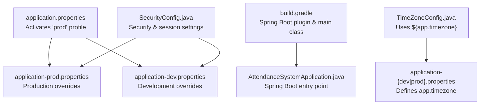
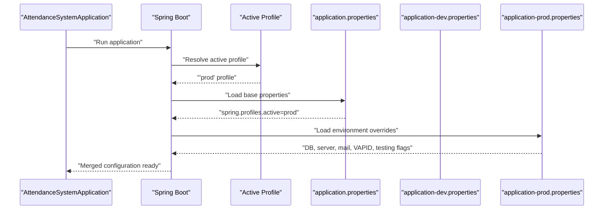
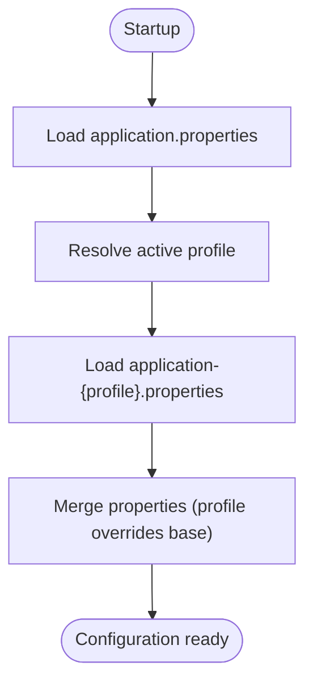
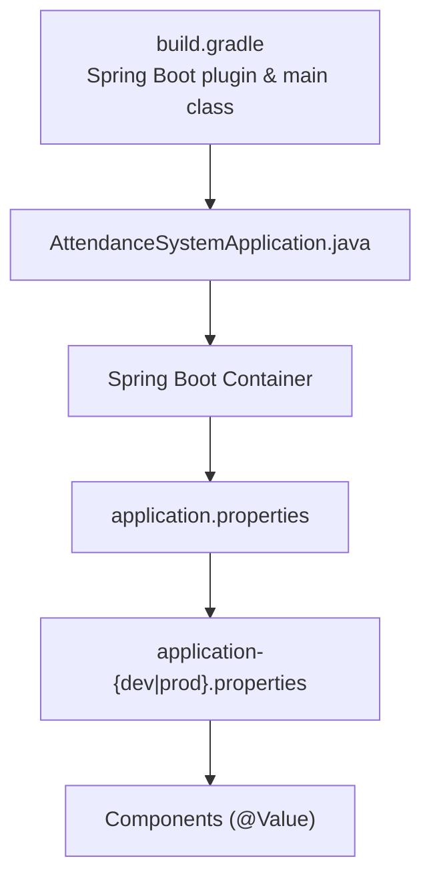

# Environment Configuration

<cite>
**Referenced Files in This Document**
- [application.properties](file://src/main/resources/application.properties)
- [application-dev.properties](file://src/main/resources/application-dev.properties)
- [application-prod.properties](file://src/main/resources/application-prod.properties)
- [build.gradle](file://build.gradle)
- [settings.gradle](file://settings.gradle)
- [AttendanceSystemApplication.java](file://src/main/java/root/cyb/mh/attendancesystem/AttendanceSystemApplication.java)
- [TimeZoneConfig.java](file://src/main/java/root/cyb/mh/attendancesystem/config/TimeZoneConfig.java)
- [SecurityConfig.java](file://src/main/java/root/cyb/mh/attendancesystem/config/SecurityConfig.java)
</cite>

## Table of Contents
1. [Introduction](#introduction)
2. [Project Structure](#project-structure)
3. [Core Components](#core-components)
4. [Architecture Overview](#architecture-overview)
5. [Detailed Component Analysis](#detailed-component-analysis)
6. [Dependency Analysis](#dependency-analysis)
7. [Performance Considerations](#performance-considerations)
8. [Troubleshooting Guide](#troubleshooting-guide)
9. [Conclusion](#conclusion)

## Introduction
This document explains how environment configuration is organized and managed in the Skylink Custom Backend. It focuses on the primary configuration files, environment-specific property files, and the configuration management patterns used by the application. You will learn how to switch between development and production environments, how property precedence works, and how to validate and troubleshoot environment-specific settings.

## Project Structure
The configuration is primarily handled via Spring Boot’s externalized configuration mechanism. The repository contains:
- A base configuration file that activates a profile.
- Environment-specific property files for development and production.
- Application code that reads configuration values and applies them at runtime.

**Diagram sources**
- [application.properties:1-1](file://src/main/resources/application.properties#L1-L1)
- [application-dev.properties:1-33](file://src/main/resources/application-dev.properties#L1-L33)
- [application-prod.properties:1-33](file://src/main/resources/application-prod.properties#L1-L33)
- [build.gradle:17-19](file://build.gradle#L17-L19)
- [AttendanceSystemApplication.java:7-15](file://src/main/java/root/cyb/mh/attendancesystem/AttendanceSystemApplication.java#L7-L15)
- [TimeZoneConfig.java:17-25](file://src/main/java/root/cyb/mh/attendancesystem/config/TimeZoneConfig.java#L17-L25)
- [SecurityConfig.java:1-91](file://src/main/java/root/cyb/mh/attendancesystem/config/SecurityConfig.java#L1-L91)

**Section sources**
- [application.properties:1-1](file://src/main/resources/application.properties#L1-L1)
- [application-dev.properties:1-33](file://src/main/resources/application-dev.properties#L1-L33)
- [application-prod.properties:1-33](file://src/main/resources/application-prod.properties#L1-L33)
- [build.gradle:17-19](file://build.gradle#L17-L19)
- [AttendanceSystemApplication.java:7-15](file://src/main/java/root/cyb/mh/attendancesystem/AttendanceSystemApplication.java#L7-L15)

## Core Components
- Base configuration activation: The base configuration file activates the production profile by default.
- Environment-specific overrides: Development and production property files override base settings for their respective environments.
- Runtime consumption: Application components read configuration values using Spring’s @Value and rely on Spring Boot’s configuration lifecycle.

Key configuration areas covered:
- Database connection settings
- Server configuration (port, session timeout)
- Application-wide settings (timezone, testing flag)
- Mail configuration
- File upload limits
- VAPID keys for push notifications

**Section sources**
- [application.properties:1-1](file://src/main/resources/application.properties#L1-L1)
- [application-dev.properties:1-33](file://src/main/resources/application-dev.properties#L1-L33)
- [application-prod.properties:1-33](file://src/main/resources/application-prod.properties#L1-L33)

## Architecture Overview
The configuration architecture follows Spring Boot’s layered precedence model. At startup, the active profile determines which environment-specific file is merged into the base configuration.

**Diagram sources**
- [application.properties:1-1](file://src/main/resources/application.properties#L1-L1)
- [application-dev.properties:1-33](file://src/main/resources/application-dev.properties#L1-L33)
- [application-prod.properties:1-33](file://src/main/resources/application-prod.properties#L1-L33)
- [AttendanceSystemApplication.java:11-13](file://src/main/java/root/cyb/mh/attendancesystem/AttendanceSystemApplication.java#L11-L13)

## Detailed Component Analysis

### Base Configuration Activation
- The base configuration file defines the active profile. Changing this value switches the environment at startup.
- Typical values are dev or prod; the current setup defaults to prod.

Practical example:
- To switch to development, change the active profile in the base configuration file to dev.

**Section sources**
- [application.properties:1-1](file://src/main/resources/application.properties#L1-L1)

### Development Environment Properties
- Database: Local PostgreSQL connection with development credentials and schema update strategy.
- Server: Non-default port for development.
- Application: Testing flag enabled for development.
- Timezone: Office timezone configured globally.
- Mail: SMTP settings for development.
- File upload: Size limits appropriate for development.
- VAPID: Keys for push notification support.

Common overrides in development:
- Database URL and credentials
- Server port
- Testing flag
- Session timeout
- Mail credentials

**Section sources**
- [application-dev.properties:1-33](file://src/main/resources/application-dev.properties#L1-L33)

### Production Environment Properties
- Database: Production PostgreSQL connection with production credentials and schema update strategy.
- Server: Non-default port for production.
- Application: Testing flag disabled for production.
- Timezone: Office timezone configured globally.
- Mail: SMTP settings for production.
- File upload: Size limits appropriate for production.
- VAPID: Keys for push notification support.

Common overrides in production:
- Database URL and credentials
- Server port
- Testing flag
- Session timeout
- Mail credentials

**Section sources**
- [application-prod.properties:1-33](file://src/main/resources/application-prod.properties#L1-L33)

### Property Precedence and Merging
Spring Boot resolves configuration in layers. The effective property value is determined by the highest precedence layer containing that property. The typical order (highest to lowest) is:
- Command-line arguments
- OS environment variables
- User home directory
- Profile-specific application-{profile}.properties
- Base application.properties
- Default values

In this project:
- Base configuration activates a profile.
- Profile-specific file overrides base properties.
- Runtime components consume properties via @Value.

**Diagram sources**
- [application.properties:1-1](file://src/main/resources/application.properties#L1-L1)
- [application-dev.properties:1-33](file://src/main/resources/application-dev.properties#L1-L33)
- [application-prod.properties:1-33](file://src/main/resources/application-prod.properties#L1-L33)

**Section sources**
- [application.properties:1-1](file://src/main/resources/application.properties#L1-L1)
- [application-dev.properties:1-33](file://src/main/resources/application-dev.properties#L1-L33)
- [application-prod.properties:1-33](file://src/main/resources/application-prod.properties#L1-L33)

### Timezone Configuration
- The application sets the JVM default timezone at startup based on a configuration property.
- This ensures consistent date/time behavior across the application.

Consumers:
- Components relying on local time and scheduled tasks.

**Section sources**
- [TimeZoneConfig.java:17-25](file://src/main/java/root/cyb/mh/attendancesystem/config/TimeZoneConfig.java#L17-L25)
- [application-dev.properties:9-10](file://src/main/resources/application-dev.properties#L9-L10)
- [application-prod.properties:9-10](file://src/main/resources/application-prod.properties#L9-L10)

### Security and Session Configuration
- Session timeout is configured per environment.
- Security filter chain is defined in configuration; it does not directly define configuration properties but relies on the active profile’s settings.

**Section sources**
- [SecurityConfig.java:1-91](file://src/main/java/root/cyb/mh/attendancesystem/config/SecurityConfig.java#L1-L91)
- [application-dev.properties:17-17](file://src/main/resources/application-dev.properties#L17-L17)
- [application-prod.properties:17-17](file://src/main/resources/application-prod.properties#L17-L17)

### Database Connection Settings
- Both development and production property files define datasource URL, username, and password.
- Hibernate dialect and DDL auto-update strategy are present in both environment files.

Validation checklist:
- Verify connectivity to the target database.
- Confirm credentials and network access.
- Ensure the database exists and is reachable.

**Section sources**
- [application-dev.properties:1-6](file://src/main/resources/application-dev.properties#L1-L6)
- [application-prod.properties:1-6](file://src/main/resources/application-prod.properties#L1-L6)

### Server Configuration
- Port is configured per environment.
- Session timeout is configured per environment.

Validation checklist:
- Ensure the chosen port is free and allowed by firewalls.
- Confirm session timeout aligns with operational needs.

**Section sources**
- [application-dev.properties:2-2](file://src/main/resources/application-dev.properties#L2-L2)
- [application-prod.properties:2-2](file://src/main/resources/application-prod.properties#L2-L2)
- [application-dev.properties:17-17](file://src/main/resources/application-dev.properties#L17-L17)
- [application-prod.properties:17-17](file://src/main/resources/application-prod.properties#L17-L17)

### Logging Levels
- Logging levels are not explicitly defined in the provided configuration files.
- If needed, add logging configuration in the environment-specific files or via command-line arguments.

[No sources needed since this section provides general guidance]

### Environment-Specific Overrides
- Development and production files override base settings for database, server, testing flag, mail, file upload limits, and VAPID keys.
- Switching environments is achieved by changing the active profile in the base configuration file.

Practical examples:
- Switch to development: Change the active profile to dev.
- Switch to production: Change the active profile to prod.

**Section sources**
- [application.properties:1-1](file://src/main/resources/application.properties#L1-L1)
- [application-dev.properties:1-33](file://src/main/resources/application-dev.properties#L1-L33)
- [application-prod.properties:1-33](file://src/main/resources/application-prod.properties#L1-L33)

### Property Naming Conventions
- Use dot-separated hierarchical names for readability and grouping (e.g., app.timezone, spring.mail.*).
- Keep environment-specific prefixes consistent across files.

[No sources needed since this section provides general guidance]

## Dependency Analysis
The configuration depends on Spring Boot’s configuration resolution and the active profile. The main application class serves as the entry point, while configuration classes consume properties at runtime.

**Diagram sources**
- [build.gradle:17-19](file://build.gradle#L17-L19)
- [AttendanceSystemApplication.java:7-15](file://src/main/java/root/cyb/mh/attendancesystem/AttendanceSystemApplication.java#L7-L15)
- [application.properties:1-1](file://src/main/resources/application.properties#L1-L1)
- [application-dev.properties:1-33](file://src/main/resources/application-dev.properties#L1-L33)
- [application-prod.properties:1-33](file://src/main/resources/application-prod.properties#L1-L33)

**Section sources**
- [build.gradle:17-19](file://build.gradle#L17-L19)
- [AttendanceSystemApplication.java:7-15](file://src/main/java/root/cyb/mh/attendancesystem/AttendanceSystemApplication.java#L7-L15)
- [application.properties:1-1](file://src/main/resources/application.properties#L1-L1)
- [application-dev.properties:1-33](file://src/main/resources/application-dev.properties#L1-L33)
- [application-prod.properties:1-33](file://src/main/resources/application-prod.properties#L1-L33)

## Performance Considerations
- Keep environment-specific properties minimal and only include necessary overrides.
- Avoid excessive logging in production unless required for diagnostics.
- Tune server ports and session timeouts to match deployment capacity.

[No sources needed since this section provides general guidance]

## Troubleshooting Guide
Common issues and resolutions:
- Active profile not applied:
  - Verify the base configuration file sets the intended profile.
  - Confirm the profile-specific file exists and is named correctly.
- Database connectivity errors:
  - Validate datasource URL, username, and password in the active environment file.
  - Ensure the database is reachable from the deployment host.
- Port conflicts:
  - Change the server port in the active environment file.
  - Confirm the port is not blocked by firewall or already in use.
- Timezone inconsistencies:
  - Confirm the timezone property in the active environment file.
  - Restart the application after changing timezone settings.
- Mail configuration failures:
  - Verify SMTP host, port, username, and password in the active environment file.
  - Ensure TLS settings match the provider requirements.
- File upload failures:
  - Adjust max file and request sizes in the active environment file as needed.
- VAPID key issues:
  - Confirm VAPID public and private keys and subject in the active environment file.

**Section sources**
- [application.properties:1-1](file://src/main/resources/application.properties#L1-L1)
- [application-dev.properties:1-33](file://src/main/resources/application-dev.properties#L1-L33)
- [application-prod.properties:1-33](file://src/main/resources/application-prod.properties#L1-L33)
- [TimeZoneConfig.java:17-25](file://src/main/java/root/cyb/mh/attendancesystem/config/TimeZoneConfig.java#L17-L25)

## Conclusion
The Skylink Custom Backend uses Spring Boot’s profile-driven configuration to cleanly separate development and production concerns. By activating a profile in the base configuration file and overriding properties in environment-specific files, teams can manage diverse deployment targets efficiently. Following the property precedence rules and validating environment-specific settings ensures reliable operation across environments.