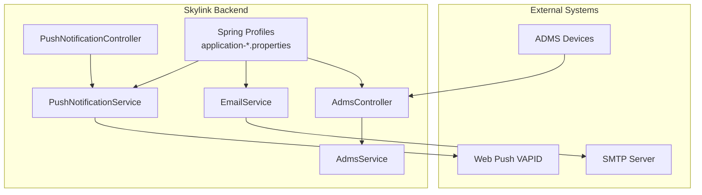
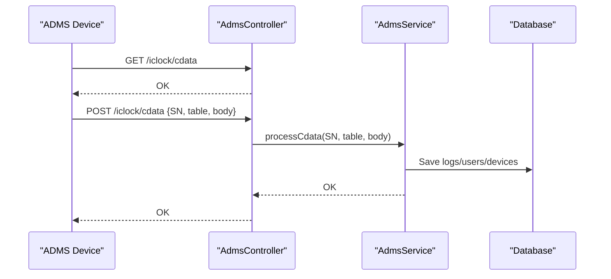
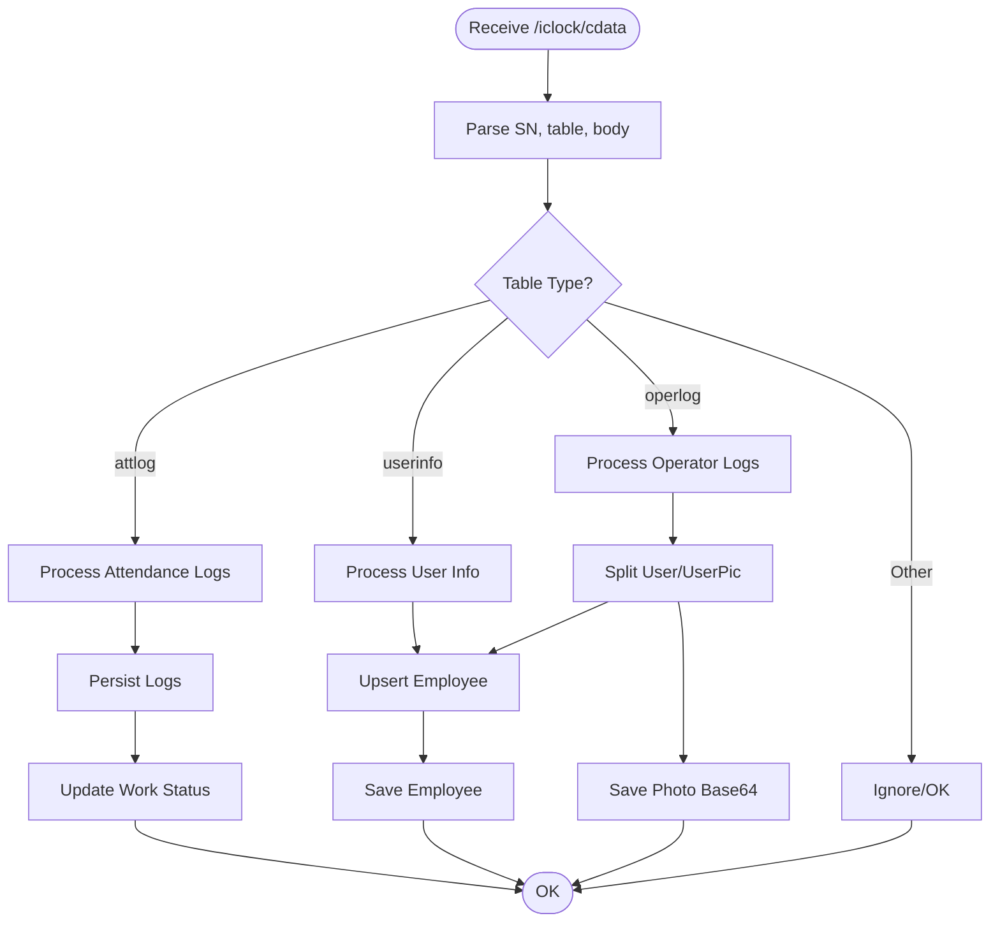
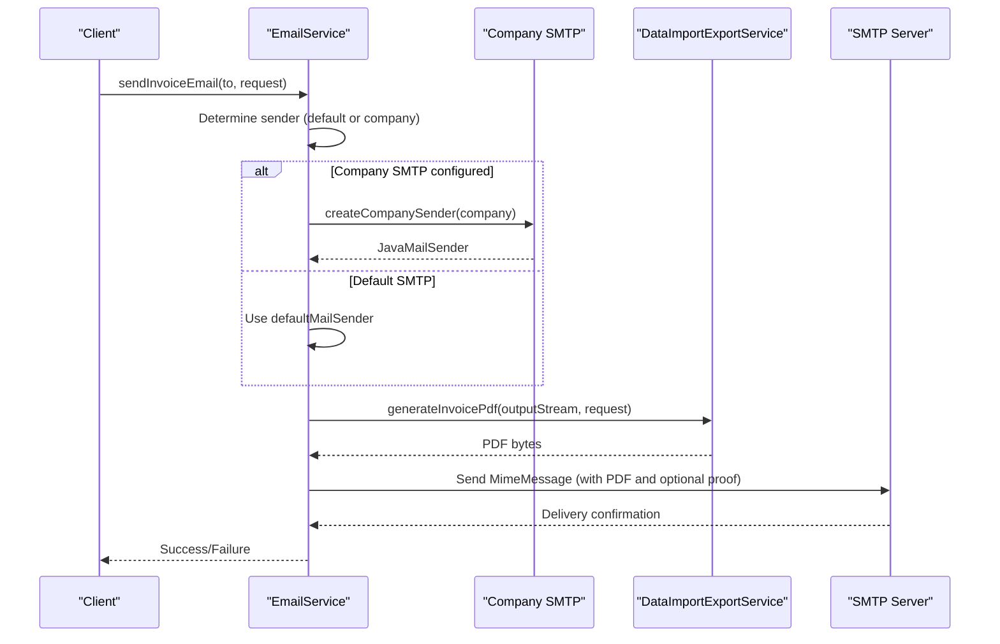
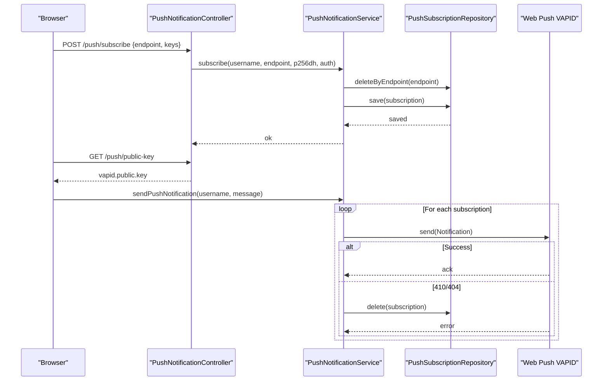
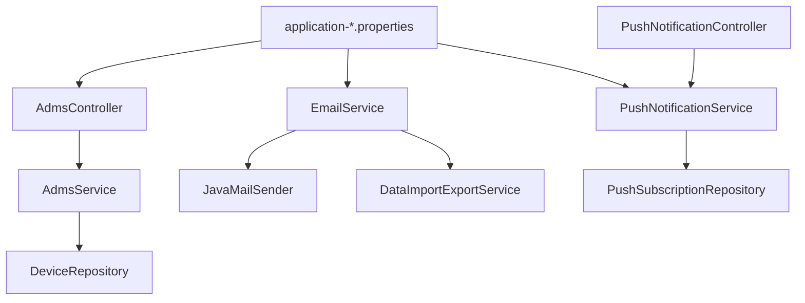

# External Integrations Configuration

<cite>
**Referenced Files in This Document**
- [application.properties](file://src/main/resources/application.properties)
- [application-dev.properties](file://src/main/resources/application-dev.properties)
- [application-prod.properties](file://src/main/resources/application-prod.properties)
- [AdmsController.java](file://src/main/java/root/cyb/mh/attendancesystem/controller/AdmsController.java)
- [AdmsService.java](file://src/main/java/root/cyb/mh/attendancesystem/service/AdmsService.java)
- [Device.java](file://src/main/java/root/cyb/mh/attendancesystem/model/Device.java)
- [DeviceRepository.java](file://src/main/java/root/cyb/mh/attendancesystem/repository/DeviceRepository.java)
- [EmailService.java](file://src/main/java/root/cyb/mh/attendancesystem/service/EmailService.java)
- [Company.java](file://src/main/java/root/cyb/mh/attendancesystem/model/Company.java)
- [PushNotificationController.java](file://src/main/java/root/cyb/mh/attendancesystem/controller/PushNotificationController.java)
- [PushNotificationService.java](file://src/main/java/root/cyb/mh/attendancesystem/service/PushNotificationService.java)
- [PushSubscription.java](file://src/main/java/root/cyb/mh/attendancesystem/model/PushSubscription.java)
- [DataImportExportService.java](file://src/main/java/root/cyb/mh/attendancesystem/service/DataImportExportService.java)
</cite>

## Table of Contents
1. [Introduction](#introduction)
2. [Project Structure](#project-structure)
3. [Core Components](#core-components)
4. [Architecture Overview](#architecture-overview)
5. [Detailed Component Analysis](#detailed-component-analysis)
6. [Dependency Analysis](#dependency-analysis)
7. [Performance Considerations](#performance-considerations)
8. [Troubleshooting Guide](#troubleshooting-guide)
9. [Conclusion](#conclusion)

## Introduction
This document provides comprehensive external integrations configuration guidance for the Skylink Custom Backend. It covers:
- ADMS device communication settings for attendance device integration
- Email service configuration for invoice notifications
- Push notification service setup using Web Push Protocol (VAPID)
- Third-party API integrations and configuration patterns
- Authentication credentials, API endpoints, timeouts, error handling, availability monitoring, fallback mechanisms, and security considerations

## Project Structure
The backend exposes REST endpoints for external systems and manages integrations through dedicated services and models. Key integration areas:
- ADMS device integration via HTTP endpoints
- Email delivery via Spring JavaMail with SMTP
- Web Push notifications via VAPID keys
- Configuration managed through Spring profiles and properties

**Diagram sources**
- [AdmsController.java:1-65](file://src/main/java/root/cyb/mh/attendancesystem/controller/AdmsController.java#L1-L65)
- [AdmsService.java:1-263](file://src/main/java/root/cyb/mh/attendancesystem/service/AdmsService.java#L1-L263)
- [EmailService.java:1-120](file://src/main/java/root/cyb/mh/attendancesystem/service/EmailService.java#L1-L120)
- [PushNotificationController.java:1-78](file://src/main/java/root/cyb/mh/attendancesystem/controller/PushNotificationController.java#L1-L78)
- [PushNotificationService.java:1-111](file://src/main/java/root/cyb/mh/attendancesystem/service/PushNotificationService.java#L1-L111)
- [application-dev.properties:1-33](file://src/main/resources/application-dev.properties#L1-L33)
- [application-prod.properties:1-33](file://src/main/resources/application-prod.properties#L1-L33)

**Section sources**
- [AdmsController.java:1-65](file://src/main/java/root/cyb/mh/attendancesystem/controller/AdmsController.java#L1-L65)
- [EmailService.java:1-120](file://src/main/java/root/cyb/mh/attendancesystem/service/EmailService.java#L1-L120)
- [PushNotificationController.java:1-78](file://src/main/java/root/cyb/mh/attendancesystem/controller/PushNotificationController.java#L1-L78)
- [application-dev.properties:1-33](file://src/main/resources/application-dev.properties#L1-L33)
- [application-prod.properties:1-33](file://src/main/resources/application-prod.properties#L1-L33)

## Core Components
- ADMS device integration: Exposed via REST endpoints for handshake, data push, command retrieval, registry checks, and command result reporting.
- Email service: Sends invoice emails with optional company-specific SMTP overrides and PDF attachments.
- Push notification service: Manages VAPID-based Web Push subscriptions and notifications.

**Section sources**
- [AdmsController.java:1-65](file://src/main/java/root/cyb/mh/attendancesystem/controller/AdmsController.java#L1-L65)
- [AdmsService.java:1-263](file://src/main/java/root/cyb/mh/attendancesystem/service/AdmsService.java#L1-L263)
- [EmailService.java:1-120](file://src/main/java/root/cyb/mh/attendancesystem/service/EmailService.java#L1-L120)
- [PushNotificationController.java:1-78](file://src/main/java/root/cyb/mh/attendancesystem/controller/PushNotificationController.java#L1-L78)
- [PushNotificationService.java:1-111](file://src/main/java/root/cyb/mh/attendancesystem/service/PushNotificationService.java#L1-L111)

## Architecture Overview
The system integrates with external services through:
- HTTP endpoints for ADMS device data ingestion
- SMTP for outbound email delivery
- Web Push protocol with VAPID for browser notifications

**Diagram sources**
- [AdmsController.java:16-29](file://src/main/java/root/cyb/mh/attendancesystem/controller/AdmsController.java#L16-L29)
- [AdmsService.java:42-89](file://src/main/java/root/cyb/mh/attendancesystem/service/AdmsService.java#L42-L89)

**Section sources**
- [AdmsController.java:1-65](file://src/main/java/root/cyb/mh/attendancesystem/controller/AdmsController.java#L1-L65)
- [AdmsService.java:1-263](file://src/main/java/root/cyb/mh/attendancesystem/service/AdmsService.java#L1-L263)

## Detailed Component Analysis

### ADMS Device Communication Settings
ADMS endpoints enable two-way communication with fingerprint/attendance devices:
- Handshake: GET /iclock/cdata returns OK
- Data push: POST /iclock/cdata accepts SN, table, and body
- Command retrieval: GET /iclock/getrequest returns queued commands
- Registry check: GET /iclock/registry returns a registry code
- Feedback: POST /iclock/fdata acknowledges receipt and optionally processes data
- Command result: POST /iclock/devicecmd acknowledges command execution

Implementation highlights:
- Command queuing and retrieval via an internal pending command buffer
- Parsing of attendance logs, user info, and operator logs with support for multiple formats
- Device lookup by serial number and optional auto-registration behavior
- Work status updates based on attendance timestamps

**Diagram sources**
- [AdmsController.java:22-55](file://src/main/java/root/cyb/mh/attendancesystem/controller/AdmsController.java#L22-L55)
- [AdmsService.java:42-89](file://src/main/java/root/cyb/mh/attendancesystem/service/AdmsService.java#L42-L89)
- [AdmsService.java:184-261](file://src/main/java/root/cyb/mh/attendancesystem/service/AdmsService.java#L184-L261)

Configuration and endpoints summary:
- Base path: /iclock
- Endpoints:
  - GET /cdata (handshake)
  - POST /cdata (data push)
  - GET /getrequest (command retrieval)
  - GET /registry (registry code)
  - POST /fdata (feedback)
  - POST /devicecmd (command result)
- Device model fields: id, name, ipAddress, port, serialNumber
- Device lookup: findBySerialNumber in DeviceRepository

Practical configuration examples:
- Device registration: Ensure serialNumber is recorded in the Device entity so SN-based parsing resolves to a device ID
- Command queue: Use queueCommand and getPendingCommand to manage device commands
- Timezone handling: Device timestamps are parsed with a fixed pattern; ensure device clock alignment with server timezone

**Section sources**
- [AdmsController.java:1-65](file://src/main/java/root/cyb/mh/attendancesystem/controller/AdmsController.java#L1-L65)
- [AdmsService.java:1-263](file://src/main/java/root/cyb/mh/attendancesystem/service/AdmsService.java#L1-L263)
- [Device.java:1-26](file://src/main/java/root/cyb/mh/attendancesystem/model/Device.java#L1-L26)
- [DeviceRepository.java:1-11](file://src/main/java/root/cyb/mh/attendancesystem/repository/DeviceRepository.java#L1-L11)

### Email Service Configuration
The email service supports:
- Default system SMTP configuration
- Per-company SMTP override when company-specific fields are present
- PDF invoice generation and attachment
- Optional payment proof attachment

Key configuration locations:
- Default SMTP settings in application-*.properties
- Company SMTP fields in the Company entity
- PDF generation via DataImportExportService

**Diagram sources**
- [EmailService.java:25-103](file://src/main/java/root/cyb/mh/attendancesystem/service/EmailService.java#L25-L103)
- [Company.java:23-27](file://src/main/java/root/cyb/mh/attendancesystem/model/Company.java#L23-L27)
- [DataImportExportService.java:407-674](file://src/main/java/root/cyb/mh/attendancesystem/service/DataImportExportService.java#L407-L674)

Configuration summary:
- Default SMTP properties (host, port, username, password, TLS):
  - spring.mail.host
  - spring.mail.port
  - spring.mail.username
  - spring.mail.password
  - spring.mail.properties.mail.smtp.auth
  - spring.mail.properties.mail.smtp.starttls.enable
- Company SMTP fields:
  - smtpHost
  - smtpPort
  - smtpUsername
  - smtpPassword
- PDF generation:
  - Uses DataImportExportService.generateInvoicePdf to produce invoice PDF
- Attachment handling:
  - Attaches generated invoice PDF
  - Optionally attaches payment proof file if path exists and is readable

Timeouts and error handling:
- SMTP timeouts are governed by Spring Boot defaults; configure via mail properties if needed
- Exceptions during sending are logged and rethrown to caller
- Payment proof attachment errors are caught and logged

**Section sources**
- [EmailService.java:1-120](file://src/main/java/root/cyb/mh/attendancesystem/service/EmailService.java#L1-L120)
- [Company.java:1-31](file://src/main/java/root/cyb/mh/attendancesystem/model/Company.java#L1-L31)
- [DataImportExportService.java:407-674](file://src/main/java/root/cyb/mh/attendancesystem/service/DataImportExportService.java#L407-L674)
- [application-dev.properties:19-25](file://src/main/resources/application-dev.properties#L19-L25)
- [application-prod.properties:19-25](file://src/main/resources/application-prod.properties#L19-L25)

### Push Notification Service Setup (Web Push Protocol - VAPID)
The push notification service enables browser-based notifications using VAPID:
- VAPID keys and subject are loaded from configuration
- Subscriptions are stored per user and endpoint
- Notifications are sent to subscribed endpoints with JSON payload
- Automatic cleanup for invalid subscriptions (410/404 responses)

**Diagram sources**
- [PushNotificationController.java:22-31](file://src/main/java/root/cyb/mh/attendancesystem/controller/PushNotificationController.java#L22-L31)
- [PushNotificationService.java:52-109](file://src/main/java/root/cyb/mh/attendancesystem/service/PushNotificationService.java#L52-L109)
- [PushSubscription.java:1-34](file://src/main/java/root/cyb/mh/attendancesystem/model/PushSubscription.java#L1-L34)

Configuration summary:
- VAPID keys and subject:
  - vapid.public.key
  - vapid.private.key
  - vapid.subject
- Subscription storage:
  - PushSubscription entity stores username, endpoint, p256dh, and auth
- Notification payload:
  - Accepts either raw text or JSON; wraps text into a standardized JSON structure

Security considerations:
- Keep VAPID private key secure and rotate periodically
- Validate subscription ownership and endpoint uniqueness
- Ensure HTTPS for push endpoints and origin policies

**Section sources**
- [PushNotificationController.java:1-78](file://src/main/java/root/cyb/mh/attendancesystem/controller/PushNotificationController.java#L1-L78)
- [PushNotificationService.java:1-111](file://src/main/java/root/cyb/mh/attendancesystem/service/PushNotificationService.java#L1-L111)
- [PushSubscription.java:1-34](file://src/main/java/root/cyb/mh/attendancesystem/model/PushSubscription.java#L1-L34)
- [application-dev.properties:30-32](file://src/main/resources/application-dev.properties#L30-L32)
- [application-prod.properties:30-32](file://src/main/resources/application-prod.properties#L30-L32)

### Third-Party API Integrations and Configuration Patterns
- ADMS device integration: REST endpoints for device data ingestion and command exchange
- Email integration: SMTP-based with optional per-company overrides
- Push integration: Web Push with VAPID for browser notifications

Configuration patterns:
- Centralized property loading via Spring profiles (dev/prod)
- Service-level selection of configuration (company vs default)
- Robust error handling with logging and controlled propagation

**Section sources**
- [AdmsController.java:1-65](file://src/main/java/root/cyb/mh/attendancesystem/controller/AdmsController.java#L1-L65)
- [EmailService.java:1-120](file://src/main/java/root/cyb/mh/attendancesystem/service/EmailService.java#L1-L120)
- [PushNotificationService.java:1-111](file://src/main/java/root/cyb/mh/attendancesystem/service/PushNotificationService.java#L1-L111)
- [application.properties:1-1](file://src/main/resources/application.properties#L1-L1)

## Dependency Analysis
External integration dependencies and relationships:
- ADMS endpoints depend on AdmsService for parsing and persistence
- EmailService depends on JavaMailSender and DataImportExportService for PDF generation
- PushNotificationService depends on VAPID keys and PushSubscriptionRepository
- Configuration is profile-driven via application-*.properties

**Diagram sources**
- [AdmsController.java:1-65](file://src/main/java/root/cyb/mh/attendancesystem/controller/AdmsController.java#L1-L65)
- [AdmsService.java:1-263](file://src/main/java/root/cyb/mh/attendancesystem/service/AdmsService.java#L1-L263)
- [EmailService.java:1-120](file://src/main/java/root/cyb/mh/attendancesystem/service/EmailService.java#L1-L120)
- [PushNotificationController.java:1-78](file://src/main/java/root/cyb/mh/attendancesystem/controller/PushNotificationController.java#L1-L78)
- [PushNotificationService.java:1-111](file://src/main/java/root/cyb/mh/attendancesystem/service/PushNotificationService.java#L1-L111)
- [application-dev.properties:1-33](file://src/main/resources/application-dev.properties#L1-L33)
- [application-prod.properties:1-33](file://src/main/resources/application-prod.properties#L1-L33)

**Section sources**
- [AdmsService.java:1-263](file://src/main/java/root/cyb/mh/attendancesystem/service/AdmsService.java#L1-L263)
- [EmailService.java:1-120](file://src/main/java/root/cyb/mh/attendancesystem/service/EmailService.java#L1-L120)
- [PushNotificationService.java:1-111](file://src/main/java/root/cyb/mh/attendancesystem/service/PushNotificationService.java#L1-L111)

## Performance Considerations
- ADMS data processing:
  - Batch attendance logs are processed line-by-line; consider optimizing large payloads
  - Work status updates occur per log; ensure database indexing on employeeId, timestamp, and deviceId
- Email delivery:
  - PDF generation is synchronous; consider asynchronous processing for high volume
  - SMTP connection pooling is handled by Spring; tune mail properties for throughput
- Push notifications:
  - VAPID requests are executed per subscription; batch or rate-limit if scaling
  - Subscription cleanup on 410/404 prevents stale endpoints

[No sources needed since this section provides general guidance]

## Troubleshooting Guide
Common issues and resolutions:
- ADMS device connectivity:
  - Verify base URL and endpoints (/iclock/*)
  - Confirm device serialNumber is registered in Device entity
  - Check server timezone alignment for timestamps
- Email delivery failures:
  - Validate SMTP host/port/credentials in application-*.properties
  - Ensure company SMTP fields are set when overriding
  - Review logs for attachment errors (payment proof path)
- Push notification delivery:
  - Confirm VAPID keys are set and valid
  - Check subscription endpoint uniqueness and validity (cleanup on 410/404)
  - Ensure HTTPS endpoints and proper origin policies

Availability monitoring and fallbacks:
- Implement health checks for SMTP and VAPID endpoints
- Use circuit breakers for external services
- Fallback to default configuration when company SMTP is unavailable

Security considerations:
- Store credentials in encrypted properties or environment variables
- Restrict access to VAPID keys and SMTP credentials
- Enforce HTTPS and CORS policies for external endpoints

**Section sources**
- [AdmsController.java:1-65](file://src/main/java/root/cyb/mh/attendancesystem/controller/AdmsController.java#L1-L65)
- [EmailService.java:1-120](file://src/main/java/root/cyb/mh/attendancesystem/service/EmailService.java#L1-L120)
- [PushNotificationService.java:1-111](file://src/main/java/root/cyb/mh/attendancesystem/service/PushNotificationService.java#L1-L111)

## Conclusion
The Skylink Custom Backend provides robust integration points for ADMS devices, email notifications, and browser push notifications. Configuration is centralized via Spring profiles, enabling flexible deployment across environments. By following the configuration patterns and security recommendations outlined above, teams can reliably integrate with external systems while maintaining resilience and observability.