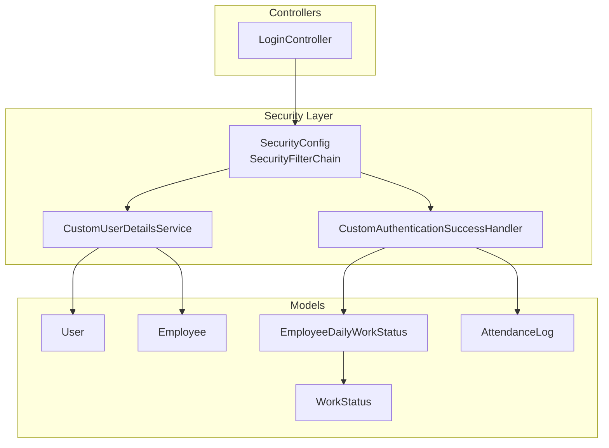
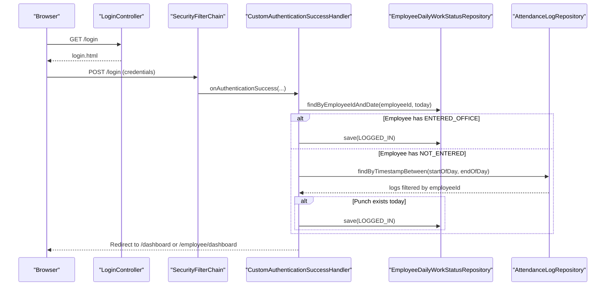
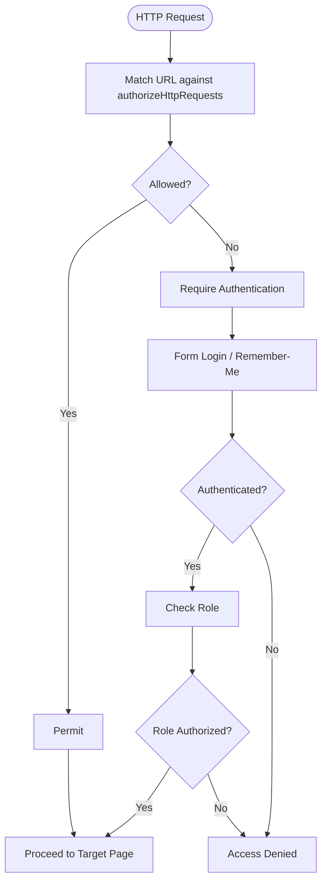
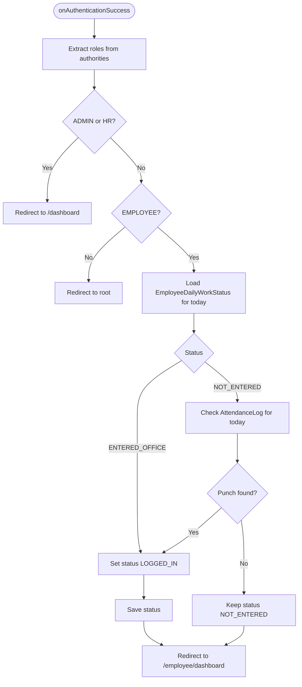
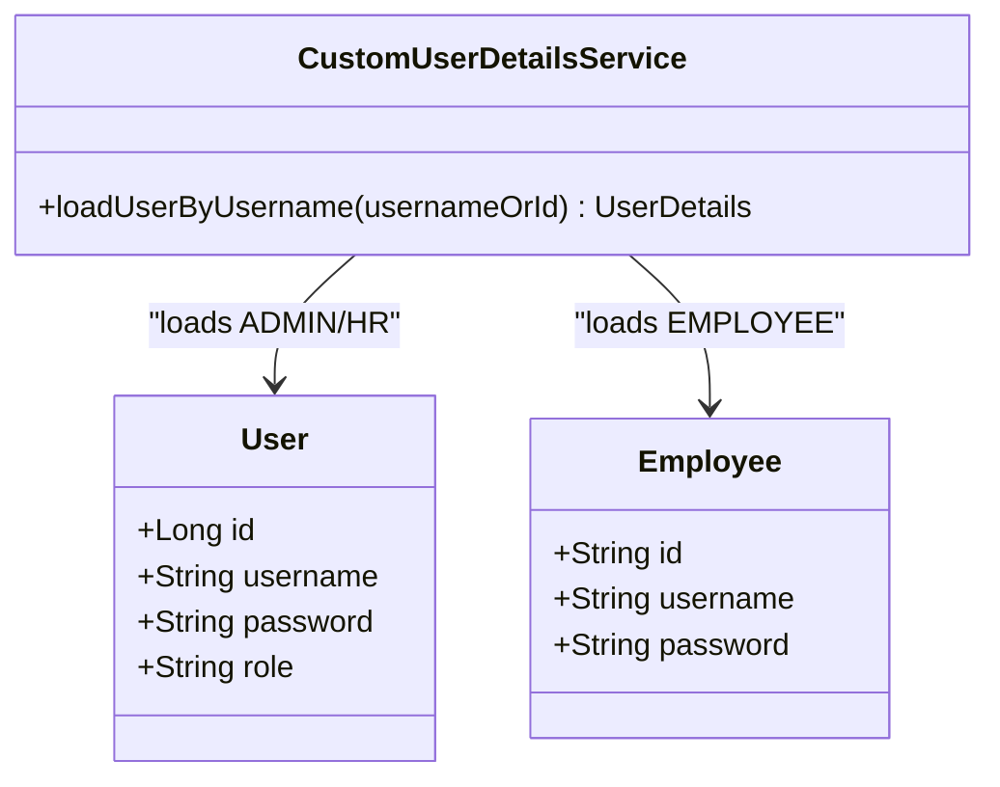
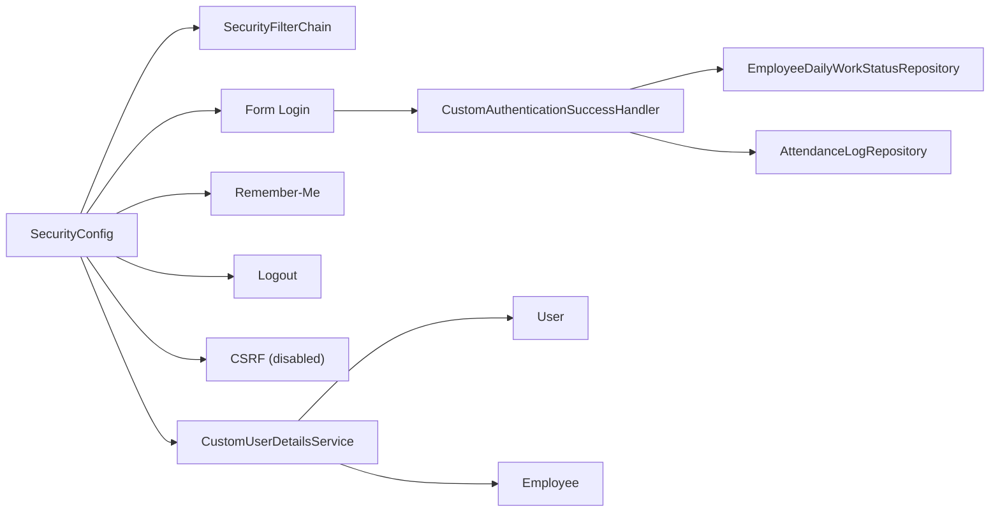

# Security Configuration

<cite>
**Referenced Files in This Document**
- [SecurityConfig.java](file://src/main/java/root/cyb/mh/attendancesystem/config/SecurityConfig.java)
- [CustomAuthenticationSuccessHandler.java](file://src/main/java/root/cyb/mh/attendancesystem/config/CustomAuthenticationSuccessHandler.java)
- [CustomUserDetailsService.java](file://src/main/java/root/cyb/mh/attendancesystem/service/CustomUserDetailsService.java)
- [LoginController.java](file://src/main/java/root/cyb/mh/attendancesystem/controller/LoginController.java)
- [User.java](file://src/main/java/root/cyb/mh/attendancesystem/model/User.java)
- [Employee.java](file://src/main/java/root/cyb/mh/attendancesystem/model/Employee.java)
- [WorkStatus.java](file://src/main/java/root/cyb/mh/attendancesystem/model/WorkStatus.java)
- [EmployeeDailyWorkStatus.java](file://src/main/java/root/cyb/mh/attendancesystem/model/EmployeeDailyWorkStatus.java)
- [AttendanceLog.java](file://src/main/java/root/cyb/mh/attendancesystem/model/AttendanceLog.java)
- [application.properties](file://src/main/resources/application.properties)
</cite>

## Table of Contents
1. [Introduction](#introduction)
2. [Project Structure](#project-structure)
3. [Core Components](#core-components)
4. [Architecture Overview](#architecture-overview)
5. [Detailed Component Analysis](#detailed-component-analysis)
6. [Dependency Analysis](#dependency-analysis)
7. [Performance Considerations](#performance-considerations)
8. [Troubleshooting Guide](#troubleshooting-guide)
9. [Conclusion](#conclusion)
10. [Appendices](#appendices)

## Introduction
This document explains the Skylink Custom Backend’s security configuration, focusing on the SecurityConfig class, role-based access control (RBAC), authentication mechanisms, and authorization rules. It also documents the custom authentication success handler, form-based login configuration, remember-me functionality, logout procedures, URL pattern matching, role hierarchies, and filter chain configuration. Guidance on CSRF configuration decisions, security best practices, and troubleshooting authentication issues is included, along with integration notes for Spring Security components and custom implementations.

## Project Structure
Security-related components are organized under the config and service packages, with supporting models and controllers. The primary security configuration is defined in the SecurityConfig class, which sets up the Spring Security filter chain, URL authorization rules, form login, remember-me, logout, and CSRF policy. Custom authentication behavior is implemented via a dedicated success handler and a custom UserDetailsService that supports both administrative users and employees.

**Diagram sources**
- [SecurityConfig.java:18-84](file://src/main/java/root/cyb/mh/attendancesystem/config/SecurityConfig.java#L18-L84)
- [CustomAuthenticationSuccessHandler.java:18-65](file://src/main/java/root/cyb/mh/attendancesystem/config/CustomAuthenticationSuccessHandler.java#L18-L65)
- [CustomUserDetailsService.java:15-53](file://src/main/java/root/cyb/mh/attendancesystem/service/CustomUserDetailsService.java#L15-L53)
- [LoginController.java:6-13](file://src/main/java/root/cyb/mh/attendancesystem/controller/LoginController.java#L6-L13)
- [User.java:8-23](file://src/main/java/root/cyb/mh/attendancesystem/model/User.java#L8-L23)
- [Employee.java:13-39](file://src/main/java/root/cyb/mh/attendancesystem/model/Employee.java#L13-L39)
- [WorkStatus.java:3-13](file://src/main/java/root/cyb/mh/attendancesystem/model/WorkStatus.java#L3-L13)
- [EmployeeDailyWorkStatus.java:9-44](file://src/main/java/root/cyb/mh/attendancesystem/model/EmployeeDailyWorkStatus.java#L9-L44)
- [AttendanceLog.java:13-26](file://src/main/java/root/cyb/mh/attendancesystem/model/AttendanceLog.java#L13-L26)

**Section sources**
- [SecurityConfig.java:18-84](file://src/main/java/root/cyb/mh/attendancesystem/config/SecurityConfig.java#L18-L84)
- [application.properties:1](file://src/main/resources/application.properties#L1)

## Core Components
- SecurityFilterChain: Defines URL authorization rules, form login, remember-me, logout, and CSRF policy.
- CustomAuthenticationSuccessHandler: Redirects users after successful authentication based on roles and updates employee work status.
- CustomUserDetailsService: Loads user principals for both administrative users and employees, mapping roles accordingly.
- LoginController: Exposes the login page endpoint.
- Models: User and Employee define credentials and roles; WorkStatus, EmployeeDailyWorkStatus, and AttendanceLog support employee-specific post-login logic.

**Section sources**
- [SecurityConfig.java:18-84](file://src/main/java/root/cyb/mh/attendancesystem/config/SecurityConfig.java#L18-L84)
- [CustomAuthenticationSuccessHandler.java:18-65](file://src/main/java/root/cyb/mh/attendancesystem/config/CustomAuthenticationSuccessHandler.java#L18-L65)
- [CustomUserDetailsService.java:15-53](file://src/main/java/root/cyb/mh/attendancesystem/service/CustomUserDetailsService.java#L15-L53)
- [LoginController.java:6-13](file://src/main/java/root/cyb/mh/attendancesystem/controller/LoginController.java#L6-L13)
- [User.java:8-23](file://src/main/java/root/cyb/mh/attendancesystem/model/User.java#L8-L23)
- [Employee.java:13-39](file://src/main/java/root/cyb/mh/attendancesystem/model/Employee.java#L13-L39)
- [WorkStatus.java:3-13](file://src/main/java/root/cyb/mh/attendancesystem/model/WorkStatus.java#L3-L13)
- [EmployeeDailyWorkStatus.java:9-44](file://src/main/java/root/cyb/mh/attendancesystem/model/EmployeeDailyWorkStatus.java#L9-L44)
- [AttendanceLog.java:13-26](file://src/main/java/root/cyb/mh/attendancesystem/model/AttendanceLog.java#L13-L26)

## Architecture Overview
The security architecture centers on a single SecurityFilterChain bean that configures:
- Authorization: URL pattern matching with role-based allowances.
- Authentication: Form-based login with a custom success handler.
- Session persistence: Remember-me with a secret key and validity period.
- Logout: Redirect to the login page with a logout parameter.
- CSRF: Disabled for the current project context to avoid breaking existing forms.

**Diagram sources**
- [SecurityConfig.java:18-61](file://src/main/java/root/cyb/mh/attendancesystem/config/SecurityConfig.java#L18-L61)
- [CustomAuthenticationSuccessHandler.java:27-64](file://src/main/java/root/cyb/mh/attendancesystem/config/CustomAuthenticationSuccessHandler.java#L27-L64)
- [LoginController.java:9-12](file://src/main/java/root/cyb/mh/attendancesystem/controller/LoginController.java#L9-L12)

## Detailed Component Analysis

### SecurityConfig: Filter Chain and Authorization
- URL Pattern Matching and Roles:
  - Static assets and public endpoints: permitted to all.
  - ADMS device communication endpoints: permitted to all.
  - Administrative areas: restricted to ADMIN.
  - HR-accessible areas: restricted to ADMIN or HR.
  - Mixed HR/EMPLOYEE areas: restricted to ADMIN, HR, or EMPLOYEE.
  - Employee-only areas: restricted to EMPLOYEE.
  - Dashboards: ADMIN or HR only.
  - Leave management: ADMIN, HR, or EMPLOYEE.
  - Other requests: require authentication.
- Form Login:
  - Login page: /login.
  - Success handler: custom handler for role-aware redirects.
  - Permit all for login form submission.
- Remember-Me:
  - Secret key and 7-day validity.
- Logout:
  - Endpoint: /logout.
  - Success URL: /login?logout.
  - Permit all.
- CSRF:
  - Explicitly disabled in the filter chain.

**Diagram sources**
- [SecurityConfig.java:18-49](file://src/main/java/root/cyb/mh/attendancesystem/config/SecurityConfig.java#L18-L49)

**Section sources**
- [SecurityConfig.java:18-84](file://src/main/java/root/cyb/mh/attendancesystem/config/SecurityConfig.java#L18-L84)

### CustomAuthenticationSuccessHandler: Role-Aware Redirects and Employee Work Status Updates
- Redirects:
  - ADMIN/HR: /dashboard.
  - EMPLOYEE: /employee/dashboard.
  - Others: root path.
- Employee Post-Login Logic:
  - Load or create daily work status for the current day.
  - If status is ENTERED_OFFICE, set to LOGGED_IN.
  - If status is NOT_ENTERED, check for attendance punches today; if present, set to LOGGED_IN.
  - Uses EmployeeDailyWorkStatusRepository and AttendanceLogRepository.

**Diagram sources**
- [CustomAuthenticationSuccessHandler.java:27-64](file://src/main/java/root/cyb/mh/attendancesystem/config/CustomAuthenticationSuccessHandler.java#L27-L64)
- [EmployeeDailyWorkStatus.java:21-22](file://src/main/java/root/cyb/mh/attendancesystem/model/EmployeeDailyWorkStatus.java#L21-L22)
- [AttendanceLog.java:23-24](file://src/main/java/root/cyb/mh/attendancesystem/model/AttendanceLog.java#L23-L24)

**Section sources**
- [CustomAuthenticationSuccessHandler.java:18-65](file://src/main/java/root/cyb/mh/attendancesystem/config/CustomAuthenticationSuccessHandler.java#L18-L65)
- [EmployeeDailyWorkStatus.java:9-44](file://src/main/java/root/cyb/mh/attendancesystem/model/EmployeeDailyWorkStatus.java#L9-L44)
- [AttendanceLog.java:13-26](file://src/main/java/root/cyb/mh/attendancesystem/model/AttendanceLog.java#L13-L26)

### CustomUserDetailsService: Multi-Type User Loading and Role Mapping
- Loads administrative users from the User entity with roles ADMIN or HR.
- Loads employees by ID, using the employee’s username field as the password (hashed) and assigning ROLE_EMPLOYEE.
- Throws UsernameNotFoundException if neither is found.

**Diagram sources**
- [CustomUserDetailsService.java:15-53](file://src/main/java/root/cyb/mh/attendancesystem/service/CustomUserDetailsService.java#L15-L53)
- [User.java:8-23](file://src/main/java/root/cyb/mh/attendancesystem/model/User.java#L8-L23)
- [Employee.java:13-39](file://src/main/java/root/cyb/mh/attendancesystem/model/Employee.java#L13-L39)

**Section sources**
- [CustomUserDetailsService.java:15-53](file://src/main/java/root/cyb/mh/attendancesystem/service/CustomUserDetailsService.java#L15-L53)
- [User.java:8-23](file://src/main/java/root/cyb/mh/attendancesystem/model/User.java#L8-L23)
- [Employee.java:13-39](file://src/main/java/root/cyb/mh/attendancesystem/model/Employee.java#L13-L39)

### LoginController: Form-Based Login Endpoint
- Exposes GET /login to render the login page template.

**Section sources**
- [LoginController.java:6-13](file://src/main/java/root/cyb/mh/attendancesystem/controller/LoginController.java#L6-L13)

### RBAC Patterns and Role Hierarchies
- Roles:
  - ADMIN: Full administrative control.
  - HR: Human resources access.
  - EMPLOYEE: Employee self-service and dashboards.
- Role Hierarchies:
  - No explicit hierarchy is configured; authorization checks are performed using hasRole or hasAnyRole predicates.
  - ADMIN implicitly encompasses HR-accessible areas; HR does not encompass ADMIN-only areas.

**Section sources**
- [SecurityConfig.java:27-47](file://src/main/java/root/cyb/mh/attendancesystem/config/SecurityConfig.java#L27-L47)
- [CustomUserDetailsService.java:30-33](file://src/main/java/root/cyb/mh/attendancesystem/service/CustomUserDetailsService.java#L30-L33)

### CSRF Configuration Decisions
- Current state: CSRF is disabled in the SecurityFilterChain.
- Rationale: To avoid breaking existing HTML forms that do not include CSRF tokens, minimizing risk during transitions.
- Recommendation: Enable CSRF by default and ensure all forms include CSRF tokens. If legacy forms must persist, consider adding CSRF tokens selectively or migrating to Thymeleaf forms that inject tokens automatically.

**Section sources**
- [SecurityConfig.java:61-81](file://src/main/java/root/cyb/mh/attendancesystem/config/SecurityConfig.java#L61-L81)

### Password Encoding
- BCryptPasswordEncoder is provided as a bean for secure password hashing.

**Section sources**
- [SecurityConfig.java:86-89](file://src/main/java/root/cyb/mh/attendancesystem/config/SecurityConfig.java#L86-L89)

## Dependency Analysis
Security components depend on Spring Security’s HttpSecurity and filter chain, plus repositories for employee-specific logic. The success handler depends on EmployeeDailyWorkStatusRepository and AttendanceLogRepository.

**Diagram sources**
- [SecurityConfig.java:18-84](file://src/main/java/root/cyb/mh/attendancesystem/config/SecurityConfig.java#L18-L84)
- [CustomAuthenticationSuccessHandler.java:21-25](file://src/main/java/root/cyb/mh/attendancesystem/config/CustomAuthenticationSuccessHandler.java#L21-L25)
- [CustomUserDetailsService.java:18-22](file://src/main/java/root/cyb/mh/attendancesystem/service/CustomUserDetailsService.java#L18-L22)

**Section sources**
- [SecurityConfig.java:18-84](file://src/main/java/root/cyb/mh/attendancesystem/config/SecurityConfig.java#L18-L84)
- [CustomAuthenticationSuccessHandler.java:18-65](file://src/main/java/root/cyb/mh/attendancesystem/config/CustomAuthenticationSuccessHandler.java#L18-L65)
- [CustomUserDetailsService.java:15-53](file://src/main/java/root/cyb/mh/attendancesystem/service/CustomUserDetailsService.java#L15-L53)

## Performance Considerations
- Remember-me token generation and validation add minimal overhead; ensure the secret key is strong and managed securely.
- The custom success handler performs two repository queries per employee login; consider caching or optimizing queries if traffic increases.
- CSRF disabled reduces overhead but increases vulnerability to cross-site request forgery; enable CSRF and optimize form rendering to mitigate risks.

[No sources needed since this section provides general guidance]

## Troubleshooting Guide
- 403 Forbidden on POST:
  - Cause: CSRF disabled while forms lack tokens.
  - Resolution: Enable CSRF and ensure forms include CSRF tokens, or continue with CSRF disabled for legacy forms.
- Redirect loops or wrong dashboard:
  - Cause: Unexpected roles or missing role mapping.
  - Resolution: Verify User.role and Employee assignments; confirm authority prefixes and success handler logic.
- Employee status not updating:
  - Cause: Missing daily status record or no attendance punch today.
  - Resolution: Confirm EmployeeDailyWorkStatus creation and AttendanceLog entries for the current day.
- Remember-me not persisting:
  - Cause: Cookie domain/path mismatch or browser privacy settings.
  - Resolution: Verify cookie settings and test with a clean session.

**Section sources**
- [SecurityConfig.java:61-81](file://src/main/java/root/cyb/mh/attendancesystem/config/SecurityConfig.java#L61-L81)
- [CustomAuthenticationSuccessHandler.java:27-64](file://src/main/java/root/cyb/mh/attendancesystem/config/CustomAuthenticationSuccessHandler.java#L27-L64)
- [EmployeeDailyWorkStatus.java:21-22](file://src/main/java/root/cyb/mh/attendancesystem/model/EmployeeDailyWorkStatus.java#L21-L22)
- [AttendanceLog.java:23-24](file://src/main/java/root/cyb/mh/attendancesystem/model/AttendanceLog.java#L23-L24)

## Conclusion
The Skylink Custom Backend employs a centralized SecurityFilterChain with clear URL authorization rules, form-based login using a custom success handler, remember-me, and logout. Authentication integrates with a custom UserDetailsService supporting administrative and employee identities. CSRF is currently disabled to preserve compatibility with existing forms, with a recommendation to enable CSRF and update forms. The success handler enriches the employee experience by aligning work status with login events. These configurations provide a solid foundation for secure access control tailored to the application’s RBAC needs.

[No sources needed since this section summarizes without analyzing specific files]

## Appendices

### URL Pattern Matching Reference
- Public/static: /css/**, /js/**, /images/**, /webjars/**
- Login/error: /login, /error
- Device communication: /iclock/**
- Admin-only: /users/**, /devices/**, /departments/add, /departments/delete/**
- HR-accessible: /settings/**, /employees/add, /employees/edit/**, /employees/delete/**, /admin/shifts/**, /master-data/**, /admin/work-orders/**, /dashboard
- Mixed HR/EMPLOYEE: /master-data/contractors/**, /master-data/api/**
- Employee-only: /employee/**
- Leave management: /leave/manage/**

**Section sources**
- [SecurityConfig.java:21-49](file://src/main/java/root/cyb/mh/attendancesystem/config/SecurityConfig.java#L21-L49)

### Role-to-Endpoint Matrix
- ADMIN: Users, devices, departments, master-data, admin work-orders, dashboard, leave manage (admin scope).
- HR: Settings, employees CRUD, admin shifts, master-data, admin work-orders, dashboard, leave manage (hr scope).
- EMPLOYEE: Employee dashboard and related endpoints; limited access to master-data and leave manage.

**Section sources**
- [SecurityConfig.java:27-47](file://src/main/java/root/cyb/mh/attendancesystem/config/SecurityConfig.java#L27-L47)
- [CustomUserDetailsService.java:30-33](file://src/main/java/root/cyb/mh/attendancesystem/service/CustomUserDetailsService.java#L30-L33)