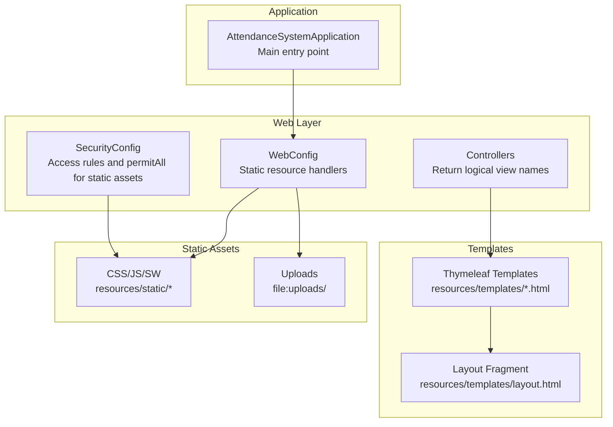
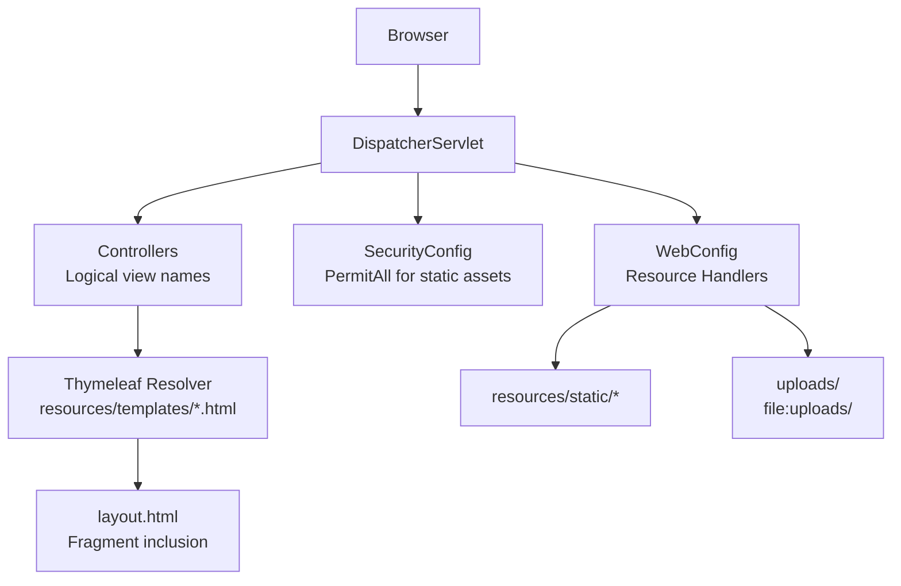
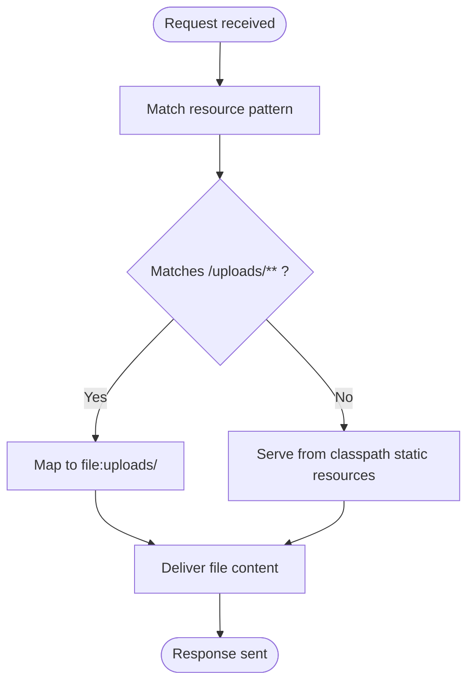
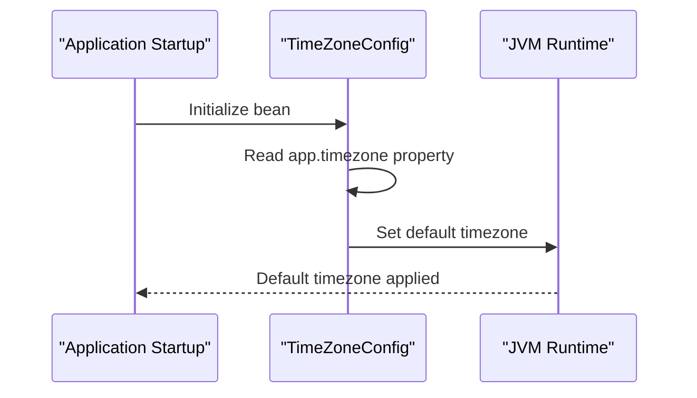
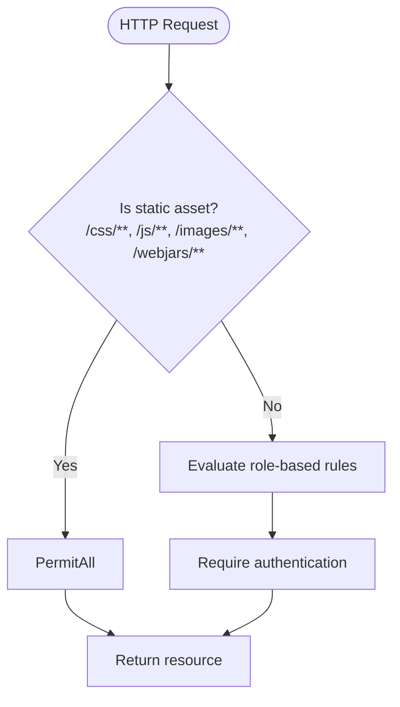
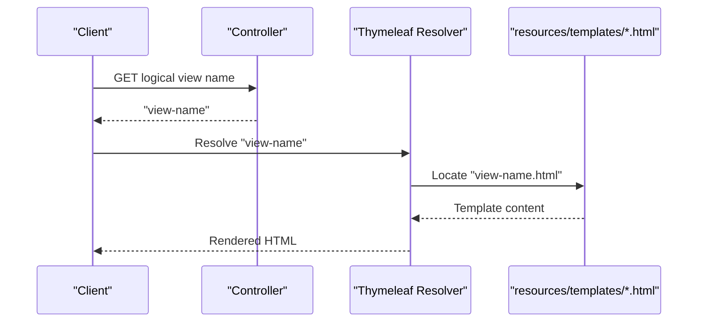
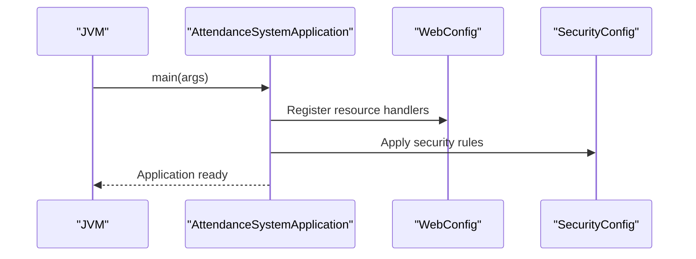
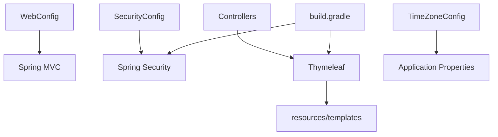

# Web MVC Configuration

<cite>
**Referenced Files in This Document**
- [WebConfig.java](file://src/main/java/root/cyb/mh/attendancesystem/config/WebConfig.java)
- [TimeZoneConfig.java](file://src/main/java/root/cyb/mh/attendancesystem/config/TimeZoneConfig.java)
- [SecurityConfig.java](file://src/main/java/root/cyb/mh/attendancesystem/config/SecurityConfig.java)
- [CustomAuthenticationSuccessHandler.java](file://src/main/java/root/cyb/mh/attendancesystem/config/CustomAuthenticationSuccessHandler.java)
- [AttendanceSystemApplication.java](file://src/main/java/root/cyb/mh/attendancesystem/AttendanceSystemApplication.java)
- [application.properties](file://src/main/resources/application.properties)
- [application-dev.properties](file://src/main/resources/application-dev.properties)
- [application-prod.properties](file://src/main/resources/application-prod.properties)
- [build.gradle](file://build.gradle)
- [LoginController.java](file://src/main/java/root/cyb/mh/attendancesystem/controller/LoginController.java)
- [DashboardController.java](file://src/main/java/root/cyb/mh/attendancesystem/controller/DashboardController.java)
- [layout.html](file://src/main/resources/templates/layout.html)
</cite>

## Table of Contents
1. [Introduction](#introduction)
2. [Project Structure](#project-structure)
3. [Core Components](#core-components)
4. [Architecture Overview](#architecture-overview)
5. [Detailed Component Analysis](#detailed-component-analysis)
6. [Dependency Analysis](#dependency-analysis)
7. [Performance Considerations](#performance-considerations)
8. [Troubleshooting Guide](#troubleshooting-guide)
9. [Conclusion](#conclusion)

## Introduction
This document explains the Web MVC configuration for the Skylink Custom Backend, focusing on static resource serving, view resolution, and Thymeleaf template configuration. It also documents the TimeZoneConfig implementation for date/time handling, timezone management, and locale-related behavior. The guide includes examples of static asset management, template resolver configuration, and internationalization settings, along with web application initialization, resource mapping, and performance optimization considerations. Finally, it outlines the integration between web configuration and the overall application architecture, including template engine setup and static content delivery.

## Project Structure
The Skylink application is a Spring Boot project with a layered structure:
- Application entry point initializes the Spring context and enables scheduling.
- Web MVC configuration is centralized in a dedicated configuration class for static resources.
- Security configuration defines access rules and permits static assets.
- Thymeleaf is configured via Spring Boot starter dependencies and templates are served from the classpath under resources/templates.
- Static assets are organized under resources/static and uploaded content is served from a local directory mapped by the Web MVC configuration.

**Diagram sources**
- [AttendanceSystemApplication.java:1-16](file://src/main/java/root/cyb/mh/attendancesystem/AttendanceSystemApplication.java#L1-L16)
- [WebConfig.java:1-18](file://src/main/java/root/cyb/mh/attendancesystem/config/WebConfig.java#L1-L18)
- [SecurityConfig.java:1-91](file://src/main/java/root/cyb/mh/attendancesystem/config/SecurityConfig.java#L1-L91)
- [layout.html:1-292](file://src/main/resources/templates/layout.html#L1-L292)

**Section sources**
- [AttendanceSystemApplication.java:1-16](file://src/main/java/root/cyb/mh/attendancesystem/AttendanceSystemApplication.java#L1-L16)
- [WebConfig.java:1-18](file://src/main/java/root/cyb/mh/attendancesystem/config/WebConfig.java#L1-L18)
- [SecurityConfig.java:1-91](file://src/main/java/root/cyb/mh/attendancesystem/config/SecurityConfig.java#L1-L91)
- [layout.html:1-292](file://src/main/resources/templates/layout.html#L1-L292)

## Core Components
- WebConfig: Registers a resource handler to serve uploaded files from a local directory and ensures static assets are served from the classpath.
- TimeZoneConfig: Sets the JVM default timezone at startup, influencing date/time behavior across the application.
- SecurityConfig: Defines permitAll for static assets and enforces role-based access control for dynamic pages.
- Controllers: Return logical view names that resolve to Thymeleaf templates under resources/templates.
- Thymeleaf: Enabled via Spring Boot starter; templates are resolved from the classpath and support fragments and layouts.

**Section sources**
- [WebConfig.java:1-18](file://src/main/java/root/cyb/mh/attendancesystem/config/WebConfig.java#L1-L18)
- [TimeZoneConfig.java:1-27](file://src/main/java/root/cyb/mh/attendancesystem/config/TimeZoneConfig.java#L1-L27)
- [SecurityConfig.java:1-91](file://src/main/java/root/cyb/mh/attendancesystem/config/SecurityConfig.java#L1-L91)
- [build.gradle:34-54](file://build.gradle#L34-L54)

## Architecture Overview
The web layer integrates with Spring MVC and Thymeleaf as follows:
- Static assets are served from resources/static and uploaded files from a local directory.
- Controllers return logical view names; Thymeleaf resolves them to physical HTML files under resources/templates.
- Security rules permit access to static assets while enforcing role-based access for dynamic routes.
- Timezone configuration centralizes date/time behavior across the application.

**Diagram sources**
- [WebConfig.java:10-16](file://src/main/java/root/cyb/mh/attendancesystem/config/WebConfig.java#L10-L16)
- [SecurityConfig.java:20-30](file://src/main/java/root/cyb/mh/attendancesystem/config/SecurityConfig.java#L20-L30)
- [layout.html:3-87](file://src/main/resources/templates/layout.html#L3-L87)
- [build.gradle:36](file://build.gradle#L36)

## Detailed Component Analysis

### WebConfig: Static Resource Serving
- Purpose: Registers a resource handler to serve uploaded files from a local directory and ensures static assets are served from the classpath.
- Behavior:
  - Adds a resource handler pattern for uploaded content and maps it to a file system location.
  - Static assets under resources/static are served by Spring MVC’s default static resource chain.
- Integration:
  - Works alongside SecurityConfig to permit access to static assets.
  - Ensures uploaded content is accessible via a predictable URL path.

**Diagram sources**
- [WebConfig.java:10-16](file://src/main/java/root/cyb/mh/attendancesystem/config/WebConfig.java#L10-L16)

**Section sources**
- [WebConfig.java:1-18](file://src/main/java/root/cyb/mh/attendancesystem/config/WebConfig.java#L1-L18)
- [SecurityConfig.java:20-30](file://src/main/java/root/cyb/mh/attendancesystem/config/SecurityConfig.java#L20-L30)

### TimeZoneConfig: Date/Time Handling and Locale Configuration
- Purpose: Centralizes timezone management by setting the JVM default timezone at application startup.
- Behavior:
  - Reads the timezone from application configuration with a default value.
  - Applies the timezone globally, affecting date/time APIs and scheduled tasks.
- Impact:
  - Influences LocalDateTime/LocalDate usage, Hibernate JDBC operations, and scheduled tasks.
  - Supports consistent time behavior across the application lifecycle.

**Diagram sources**
- [TimeZoneConfig.java:17-25](file://src/main/java/root/cyb/mh/attendancesystem/config/TimeZoneConfig.java#L17-L25)

**Section sources**
- [TimeZoneConfig.java:1-27](file://src/main/java/root/cyb/mh/attendancesystem/config/TimeZoneConfig.java#L1-L27)
- [application-dev.properties:9-10](file://src/main/resources/application-dev.properties#L9-L10)
- [application-prod.properties:9-10](file://src/main/resources/application-prod.properties#L9-L10)

### SecurityConfig: Access Control for Static and Dynamic Resources
- Purpose: Defines permitAll for static assets and enforces role-based access control for dynamic routes.
- Behavior:
  - Permits access to CSS, JS, images, and WebJars.
  - Restricts administrative and HR areas to specific roles.
  - Configures form login, remember-me, logout, and CSRF policy.
- Integration:
  - Complements WebConfig by ensuring static assets are accessible without authentication.

**Diagram sources**
- [SecurityConfig.java:20-61](file://src/main/java/root/cyb/mh/attendancesystem/config/SecurityConfig.java#L20-L61)

**Section sources**
- [SecurityConfig.java:1-91](file://src/main/java/root/cyb/mh/attendancesystem/config/SecurityConfig.java#L1-L91)

### Thymeleaf Template Configuration and View Resolution
- Configuration:
  - Thymeleaf is included via the Spring Boot starter dependency.
  - Templates are resolved from resources/templates; logical view names map to HTML files.
- Layout and Fragments:
  - The main layout template includes fragments and supports page-specific scripts injection.
  - Controllers return logical view names that Thymeleaf resolves to templates under resources/templates.
- Examples:
  - A controller returning a logical view name resolves to a template under resources/templates.
  - The layout template references static assets from the classpath.

**Diagram sources**
- [build.gradle:36](file://build.gradle#L36)
- [LoginController.java:9-12](file://src/main/java/root/cyb/mh/attendancesystem/controller/LoginController.java#L9-L12)
- [layout.html:3-87](file://src/main/resources/templates/layout.html#L3-L87)

**Section sources**
- [build.gradle:34-54](file://build.gradle#L34-L54)
- [LoginController.java:1-14](file://src/main/java/root/cyb/mh/attendancesystem/controller/LoginController.java#L1-L14)
- [DashboardController.java:40-225](file://src/main/java/root/cyb/mh/attendancesystem/controller/DashboardController.java#L40-L225)
- [layout.html:1-292](file://src/main/resources/templates/layout.html#L1-L292)

### Web Application Initialization
- The main application class enables scheduling and launches the Spring Boot context.
- Combined with WebConfig and SecurityConfig, the application initializes the web layer with static resource serving and security policies.

**Diagram sources**
- [AttendanceSystemApplication.java:11-13](file://src/main/java/root/cyb/mh/attendancesystem/AttendanceSystemApplication.java#L11-L13)
- [WebConfig.java:10-16](file://src/main/java/root/cyb/mh/attendancesystem/config/WebConfig.java#L10-L16)
- [SecurityConfig.java:18-84](file://src/main/java/root/cyb/mh/attendancesystem/config/SecurityConfig.java#L18-L84)

**Section sources**
- [AttendanceSystemApplication.java:1-16](file://src/main/java/root/cyb/mh/attendancesystem/AttendanceSystemApplication.java#L1-L16)

## Dependency Analysis
- WebConfig depends on Spring MVC’s WebMvcConfigurer to register resource handlers.
- SecurityConfig depends on Spring Security to enforce access rules and permit static assets.
- Controllers depend on Thymeleaf for view resolution; templates are resolved from resources/templates.
- Thymeleaf is included via the Spring Boot starter dependency.
- TimeZoneConfig depends on application configuration for timezone selection.

**Diagram sources**
- [WebConfig.java:3-5](file://src/main/java/root/cyb/mh/attendancesystem/config/WebConfig.java#L3-L5)
- [SecurityConfig.java:3-9](file://src/main/java/root/cyb/mh/attendancesystem/config/SecurityConfig.java#L3-L9)
- [build.gradle:36](file://build.gradle#L36)
- [TimeZoneConfig.java:17-18](file://src/main/java/root/cyb/mh/attendancesystem/config/TimeZoneConfig.java#L17-L18)

**Section sources**
- [build.gradle:34-54](file://build.gradle#L34-L54)
- [WebConfig.java:1-18](file://src/main/java/root/cyb/mh/attendancesystem/config/WebConfig.java#L1-L18)
- [SecurityConfig.java:1-91](file://src/main/java/root/cyb/mh/attendancesystem/config/SecurityConfig.java#L1-L91)
- [TimeZoneConfig.java:1-27](file://src/main/java/root/cyb/mh/attendancesystem/config/TimeZoneConfig.java#L1-L27)

## Performance Considerations
- Static resource serving:
  - Ensure static assets are cached appropriately by browsers and reverse proxies.
  - Place frequently accessed assets under resources/static for efficient classpath resolution.
- Uploaded content:
  - Serve uploaded files from a dedicated directory mapped by WebConfig to avoid unnecessary classpath scanning.
  - Consider enabling compression and caching headers for uploaded assets.
- Thymeleaf rendering:
  - Keep templates modular with fragments to reduce duplication and improve maintainability.
  - Avoid heavy computations in templates; precompute data in controllers or services.
- Timezone impact:
  - Centralized timezone configuration reduces inconsistencies and improves predictability for date/time operations.

[No sources needed since this section provides general guidance]

## Troubleshooting Guide
- Static assets not loading:
  - Verify SecurityConfig permits access to static paths (/css/**, /js/**, /images/**, /webjars/**).
  - Confirm WebConfig registers resource handlers for uploaded content.
- View resolution errors:
  - Ensure controllers return logical view names that match template filenames under resources/templates.
  - Check Thymeleaf starter is present in build configuration.
- Timezone discrepancies:
  - Confirm the app.timezone property is set in the active profile.
  - Validate that the JVM default timezone is applied during application startup.
- Authentication redirects:
  - Review CustomAuthenticationSuccessHandler for role-based redirection logic.

**Section sources**
- [SecurityConfig.java:20-61](file://src/main/java/root/cyb/mh/attendancesystem/config/SecurityConfig.java#L20-L61)
- [WebConfig.java:10-16](file://src/main/java/root/cyb/mh/attendancesystem/config/WebConfig.java#L10-L16)
- [LoginController.java:9-12](file://src/main/java/root/cyb/mh/attendancesystem/controller/LoginController.java#L9-L12)
- [TimeZoneConfig.java:17-25](file://src/main/java/root/cyb/mh/attendancesystem/config/TimeZoneConfig.java#L17-L25)
- [CustomAuthenticationSuccessHandler.java:27-64](file://src/main/java/root/cyb/mh/attendancesystem/config/CustomAuthenticationSuccessHandler.java#L27-L64)

## Conclusion
The Skylink Custom Backend’s Web MVC configuration centers around a concise static resource handler, robust security rules for static and dynamic content, and a Thymeleaf-driven view resolution strategy. The centralized timezone configuration ensures consistent date/time behavior across the application. Together, these components deliver a maintainable and performant web layer that integrates seamlessly with the broader application architecture.