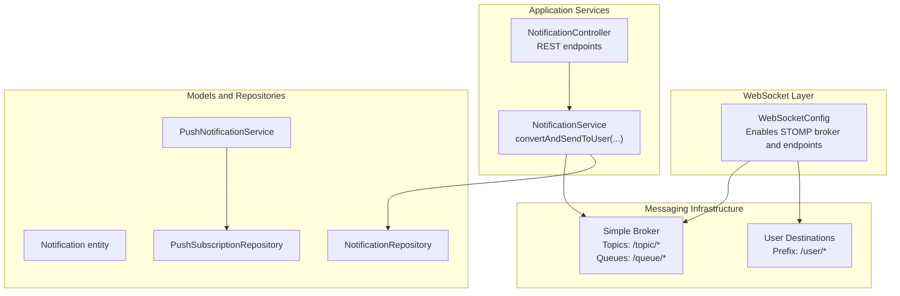
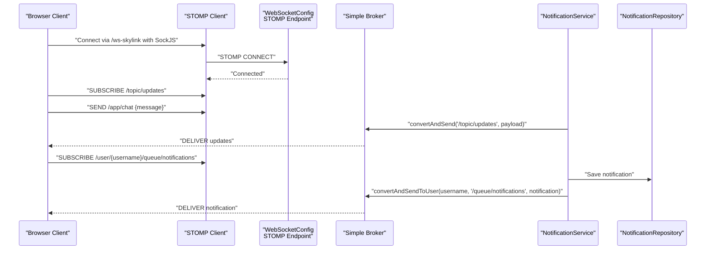
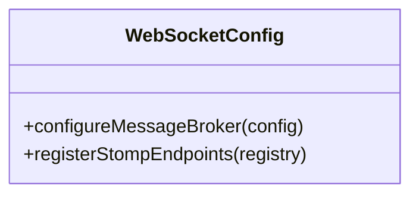
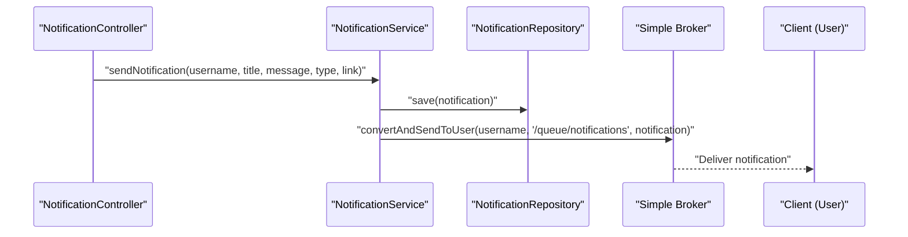
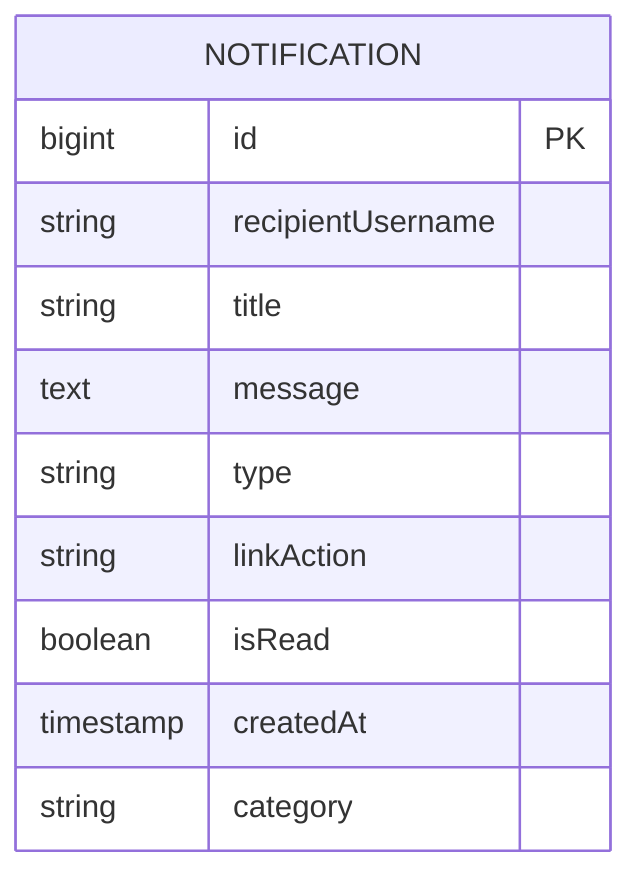
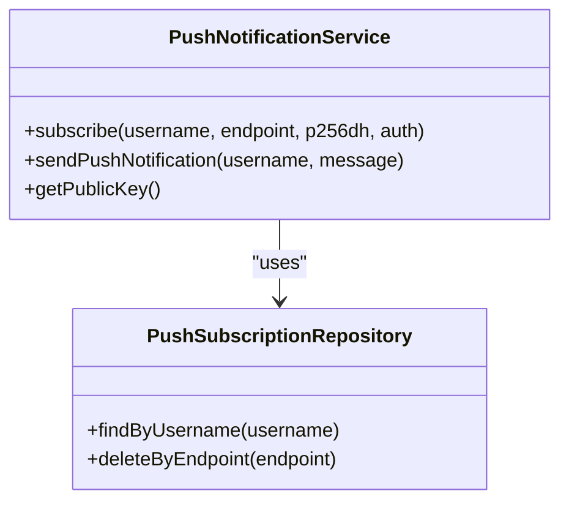
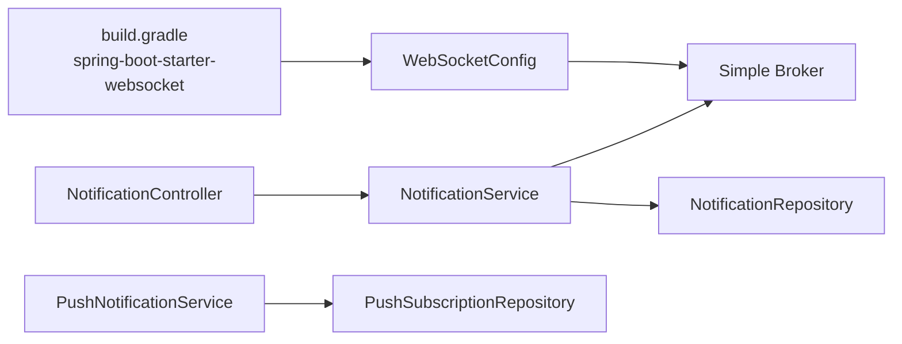

# WebSocket Configuration

<cite>
**Referenced Files in This Document**
- [WebSocketConfig.java](file://src/main/java/root/cyb/mh/attendancesystem/config/WebSocketConfig.java)
- [SecurityConfig.java](file://src/main/java/root/cyb/mh/attendancesystem/config/SecurityConfig.java)
- [NotificationService.java](file://src/main/java/root/cyb/mh/attendancesystem/service/NotificationService.java)
- [NotificationController.java](file://src/main/java/root/cyb/mh/attendancesystem/controller/NotificationController.java)
- [Notification.java](file://src/main/java/root/cyb/mh/attendancesystem/model/Notification.java)
- [NotificationRepository.java](file://src/main/java/root/cyb/mh/attendancesystem/repository/NotificationRepository.java)
- [PushNotificationService.java](file://src/main/java/root/cyb/mh/attendancesystem/service/PushNotificationService.java)
- [PushSubscriptionRepository.java](file://src/main/java/root/cyb/mh/attendancesystem/repository/PushSubscriptionRepository.java)
- [application.properties](file://src/main/resources/application.properties)
- [build.gradle](file://build.gradle)
</cite>

## Table of Contents
1. [Introduction](#introduction)
2. [Project Structure](#project-structure)
3. [Core Components](#core-components)
4. [Architecture Overview](#architecture-overview)
5. [Detailed Component Analysis](#detailed-component-analysis)
6. [Dependency Analysis](#dependency-analysis)
7. [Performance Considerations](#performance-considerations)
8. [Troubleshooting Guide](#troubleshooting-guide)
9. [Conclusion](#conclusion)
10. [Appendices](#appendices)

## Introduction
This document explains the WebSocket configuration and real-time communication setup in the Skylink Custom Backend. It focuses on the WebSocketConfig class, STOMP endpoint registration, message broker configuration, and how Spring’s messaging infrastructure integrates with notification services. It also covers message handling patterns, topic subscriptions, user-specific messaging, broadcast mechanisms, security considerations, and troubleshooting steps for real-time communication.

## Project Structure
The WebSocket subsystem is centered around a dedicated configuration class and supporting services/controllers/models/repositories. The configuration enables a simple broker for topics and queues, registers a STOMP endpoint with SockJS fallback, and sets user destination prefixes for private messaging. Notification services leverage Spring’s SimpMessagingTemplate to deliver user-specific messages via WebSocket.



**Diagram sources**
- [WebSocketConfig.java:11-24](file://src/main/java/root/cyb/mh/attendancesystem/config/WebSocketConfig.java#L11-L24)
- [NotificationService.java:17-35](file://src/main/java/root/cyb/mh/attendancesystem/service/NotificationService.java#L17-L35)
- [NotificationController.java:16-39](file://src/main/java/root/cyb/mh/attendancesystem/controller/NotificationController.java#L16-L39)
- [Notification.java:14-42](file://src/main/java/root/cyb/mh/attendancesystem/model/Notification.java#L14-L42)
- [NotificationRepository.java:9-18](file://src/main/java/root/cyb/mh/attendancesystem/repository/NotificationRepository.java#L9-L18)
- [PushNotificationService.java:16-110](file://src/main/java/root/cyb/mh/attendancesystem/service/PushNotificationService.java#L16-L110)
- [PushSubscriptionRepository.java:7-11](file://src/main/java/root/cyb/mh/attendancesystem/repository/PushSubscriptionRepository.java#L7-L11)

**Section sources**
- [WebSocketConfig.java:11-24](file://src/main/java/root/cyb/mh/attendancesystem/config/WebSocketConfig.java#L11-L24)
- [build.gradle:44](file://build.gradle#L44)

## Core Components
- WebSocketConfig: Implements WebSocketMessageBrokerConfigurer to enable a simple broker, set application destination prefixes, and register a STOMP endpoint with SockJS.
- NotificationService: Uses SimpMessagingTemplate to send user-specific notifications to clients via WebSocket.
- NotificationController: Exposes REST endpoints for retrieving unread notifications and marking them as read.
- Notification entity and repository: Persist notifications and support queries for unread and historical notifications.
- PushNotificationService and PushSubscriptionRepository: Manage Web Push subscriptions and delivery alongside WebSocket notifications.

**Section sources**
- [WebSocketConfig.java:11-24](file://src/main/java/root/cyb/mh/attendancesystem/config/WebSocketConfig.java#L11-L24)
- [NotificationService.java:17-44](file://src/main/java/root/cyb/mh/attendancesystem/service/NotificationService.java#L17-L44)
- [NotificationController.java:16-39](file://src/main/java/root/cyb/mh/attendancesystem/controller/NotificationController.java#L16-L39)
- [Notification.java:14-42](file://src/main/java/root/cyb/mh/attendancesystem/model/Notification.java#L14-L42)
- [NotificationRepository.java:9-18](file://src/main/java/root/cyb/mh/attendancesystem/repository/NotificationRepository.java#L9-L18)
- [PushNotificationService.java:16-110](file://src/main/java/root/cyb/mh/attendancesystem/service/PushNotificationService.java#L16-L110)
- [PushSubscriptionRepository.java:7-11](file://src/main/java/root/cyb/mh/attendancesystem/repository/PushSubscriptionRepository.java#L7-L11)

## Architecture Overview
The WebSocket stack integrates with Spring’s STOMP/SockJS to provide real-time messaging. The configuration enables:
- Application destinations under /app for client-to-server requests.
- Topics under /topic for broadcast-style messaging.
- Queues under /queue for point-to-point messaging.
- User destinations under /user for private, user-specific messaging.



**Diagram sources**
- [WebSocketConfig.java:14-24](file://src/main/java/root/cyb/mh/attendancesystem/config/WebSocketConfig.java#L14-L24)
- [NotificationService.java:22-44](file://src/main/java/root/cyb/mh/attendancesystem/service/NotificationService.java#L22-L44)
- [NotificationRepository.java:9-18](file://src/main/java/root/cyb/mh/attendancesystem/repository/NotificationRepository.java#L9-L18)

## Detailed Component Analysis

### WebSocketConfig
- Message Broker Configuration:
  - Enables a simple broker for destinations under “/topic” and “/queue”.
  - Sets application destination prefix “/app” for client-to-server requests.
  - Enables user destination prefix “/user” for private messaging.
- STOMP Endpoint Registration:
  - Registers “/ws-skylink” with SockJS to support fallback transports for older browsers.



**Diagram sources**
- [WebSocketConfig.java:11-24](file://src/main/java/root/cyb/mh/attendancesystem/config/WebSocketConfig.java#L11-L24)

**Section sources**
- [WebSocketConfig.java:14-24](file://src/main/java/root/cyb/mh/attendancesystem/config/WebSocketConfig.java#L14-L24)

### NotificationService
- Responsibilities:
  - Persists notifications to the database.
  - Sends user-specific notifications via WebSocket to “/user/{username}/queue/notifications”.
  - Integrates with Web Push via PushNotificationService.
- Messaging Pattern:
  - Uses convertAndSendToUser for user-specific delivery.
  - Supports saving and marking notifications as read.



**Diagram sources**
- [NotificationService.java:22-44](file://src/main/java/root/cyb/mh/attendancesystem/service/NotificationService.java#L22-L44)
- [NotificationRepository.java:9-18](file://src/main/java/root/cyb/mh/attendancesystem/repository/NotificationRepository.java#L9-L18)

**Section sources**
- [NotificationService.java:17-44](file://src/main/java/root/cyb/mh/attendancesystem/service/NotificationService.java#L17-L44)

### NotificationController
- REST endpoints:
  - GET /notifications/unread?limit={n}: Returns unread notifications for the authenticated user.
  - POST /notifications/{id}/read: Marks a notification as read.
  - POST /notifications/mark-all-read: Marks all notifications as read for the authenticated user.
  - GET /notifications/history: Renders notification history page.

```mermaid
flowchart TD
Start(["HTTP Request"]) --> CheckAuth["Check Principal/Auth"]
CheckAuth --> Endpoint{"Endpoint"}
Endpoint --> |GET /unread| GetUnread["Load Unread Notifications"]
Endpoint --> |POST /{id}/read| MarkOne["Mark One As Read"]
Endpoint --> |POST /mark-all-read| MarkAll["Mark All As Read"]
Endpoint --> |GET /history| History["Render History Page"]
GetUnread --> End(["Response"])
MarkOne --> End
MarkAll --> End
History --> End
```

**Diagram sources**
- [NotificationController.java:18-47](file://src/main/java/root/cyb/mh/attendancesystem/controller/NotificationController.java#L18-L47)

**Section sources**
- [NotificationController.java:16-47](file://src/main/java/root/cyb/mh/attendancesystem/controller/NotificationController.java#L16-L47)

### Notification Entity and Repository
- Notification entity stores recipient username, title, message, type, link action, read status, creation timestamp, and optional category.
- Repository supports queries for unread notifications (with and without paging), and full history retrieval.



**Diagram sources**
- [Notification.java:14-42](file://src/main/java/root/cyb/mh/attendancesystem/model/Notification.java#L14-L42)

**Section sources**
- [Notification.java:14-42](file://src/main/java/root/cyb/mh/attendancesystem/model/Notification.java#L14-L42)
- [NotificationRepository.java:9-18](file://src/main/java/root/cyb/mh/attendancesystem/repository/NotificationRepository.java#L9-L18)

### PushNotificationService and PushSubscriptionRepository
- PushNotificationService initializes a Web Push service with VAPID credentials and sends push notifications to subscribed endpoints.
- PushSubscriptionRepository persists and retrieves push subscriptions keyed by endpoint uniqueness.



**Diagram sources**
- [PushNotificationService.java:16-110](file://src/main/java/root/cyb/mh/attendancesystem/service/PushNotificationService.java#L16-L110)
- [PushSubscriptionRepository.java:7-11](file://src/main/java/root/cyb/mh/attendancesystem/repository/PushSubscriptionRepository.java#L7-L11)

**Section sources**
- [PushNotificationService.java:16-110](file://src/main/java/root/cyb/mh/attendancesystem/service/PushNotificationService.java#L16-L110)
- [PushSubscriptionRepository.java:7-11](file://src/main/java/root/cyb/mh/attendancesystem/repository/PushSubscriptionRepository.java#L7-L11)

## Dependency Analysis
- WebSocket starter dependency is declared in the Gradle build script.
- WebSocketConfig relies on Spring’s WebSocket and messaging abstractions.
- NotificationService depends on SimpMessagingTemplate for user-specific messaging.
- NotificationController depends on NotificationService for business operations.
- NotificationService depends on NotificationRepository for persistence.
- PushNotificationService depends on PushSubscriptionRepository and external Web Push libraries.



**Diagram sources**
- [build.gradle:44](file://build.gradle#L44)
- [WebSocketConfig.java:11-24](file://src/main/java/root/cyb/mh/attendancesystem/config/WebSocketConfig.java#L11-L24)
- [NotificationService.java:17-44](file://src/main/java/root/cyb/mh/attendancesystem/service/NotificationService.java#L17-L44)
- [NotificationController.java:16-39](file://src/main/java/root/cyb/mh/attendancesystem/controller/NotificationController.java#L16-L39)
- [PushNotificationService.java:16-110](file://src/main/java/root/cyb/mh/attendancesystem/service/PushNotificationService.java#L16-L110)

**Section sources**
- [build.gradle:44](file://build.gradle#L44)
- [WebSocketConfig.java:11-24](file://src/main/java/root/cyb/mh/attendancesystem/config/WebSocketConfig.java#L11-L24)
- [NotificationService.java:17-44](file://src/main/java/root/cyb/mh/attendancesystem/service/NotificationService.java#L17-L44)
- [NotificationController.java:16-39](file://src/main/java/root/cyb/mh/attendancesystem/controller/NotificationController.java#L16-L39)
- [PushNotificationService.java:16-110](file://src/main/java/root/cyb/mh/attendancesystem/service/PushNotificationService.java#L16-L110)

## Performance Considerations
- Use queues for point-to-point reliability and topics for scalable broadcasts.
- Keep user-specific queues minimal and scoped to essential channels to reduce broker overhead.
- Batch reads for unread notifications to minimize database round-trips.
- Consider rate-limiting or throttling for high-frequency notifications to avoid broker saturation.
- Offload long-running tasks (e.g., Web Push delivery) to avoid blocking WebSocket handlers.

## Troubleshooting Guide
Common issues and resolutions:
- Connection failures:
  - Verify the STOMP endpoint “/ws-skylink” is reachable and SockJS is enabled.
  - Confirm the browser supports WebSocket or falls back to SockJS.
- Authentication and authorization:
  - Ensure the user is authenticated before subscribing to user destinations.
  - Review SecurityConfig to confirm permitted paths and CSRF settings.
- User-specific messaging not received:
  - Confirm the client subscribes to “/user/{username}/queue/notifications”.
  - Ensure NotificationService uses convertAndSendToUser with the correct username and queue path.
- Broadcast messages not delivered:
  - Verify the client subscribes to “/topic/...” and the server sends to “/topic/...”.
- Database persistence issues:
  - Check NotificationRepository queries and transaction boundaries.
- Web Push vs WebSocket:
  - Web Push delivery errors (e.g., 410 Gone) should remove stale subscriptions; monitor logs for cleanup actions.

**Section sources**
- [WebSocketConfig.java:22-24](file://src/main/java/root/cyb/mh/attendancesystem/config/WebSocketConfig.java#L22-L24)
- [SecurityConfig.java:19-84](file://src/main/java/root/cyb/mh/attendancesystem/config/SecurityConfig.java#L19-L84)
- [NotificationService.java:34-35](file://src/main/java/root/cyb/mh/attendancesystem/service/NotificationService.java#L34-L35)
- [NotificationRepository.java:9-18](file://src/main/java/root/cyb/mh/attendancesystem/repository/NotificationRepository.java#L9-L18)
- [PushNotificationService.java:100-108](file://src/main/java/root/cyb/mh/attendancesystem/service/PushNotificationService.java#L100-L108)

## Conclusion
The Skylink Custom Backend implements a clean and straightforward WebSocket configuration using Spring’s STOMP/SockJS stack. The WebSocketConfig class enables a simple broker, user destinations, and a single STOMP endpoint. NotificationService leverages user destinations to deliver real-time notifications, while NotificationController exposes REST endpoints for client-side consumption. Together with Web Push capabilities, this design provides robust real-time and offline-friendly notification delivery.

## Appendices

### Practical Examples Index
- WebSocket endpoint configuration:
  - STOMP endpoint registration and SockJS enablement.
  - References: [WebSocketConfig.java:22-24](file://src/main/java/root/cyb/mh/attendancesystem/config/WebSocketConfig.java#L22-L24)
- Message conversion and user-specific delivery:
  - Using convertAndSendToUser for “/user/{username}/queue/notifications”.
  - References: [NotificationService.java:34-35](file://src/main/java/root/cyb/mh/attendancesystem/service/NotificationService.java#L34-L35)
- Integration with Spring messaging infrastructure:
  - Message broker destinations: “/topic”, “/queue”, “/user”.
  - References: [WebSocketConfig.java:14-19](file://src/main/java/root/cyb/mh/attendancesystem/config/WebSocketConfig.java#L14-L19)
- Topic subscriptions and broadcast:
  - Subscribe to “/topic/...” and publish to “/topic/...”.
  - References: [WebSocketConfig.java:15](file://src/main/java/root/cyb/mh/attendancesystem/config/WebSocketConfig.java#L15)
- Notification persistence and retrieval:
  - Unread and history queries via NotificationRepository.
  - References: [NotificationRepository.java:9-18](file://src/main/java/root/cyb/mh/attendancesystem/repository/NotificationRepository.java#L9-L18)
- Profile activation:
  - Active profile selection in application properties.
  - References: [application.properties:1](file://src/main/resources/application.properties#L1)