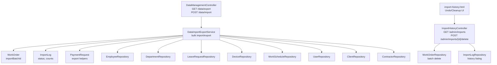
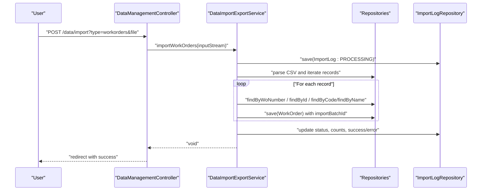
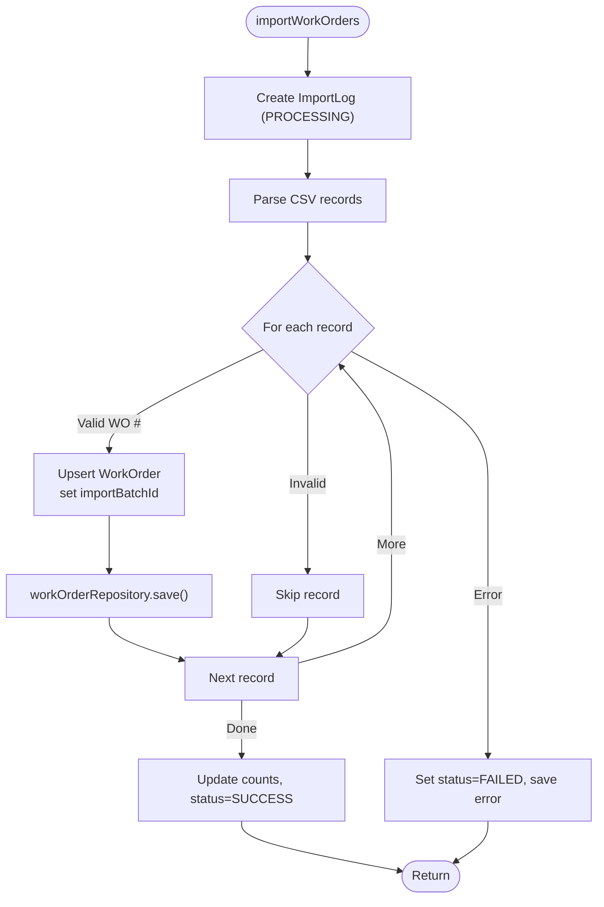
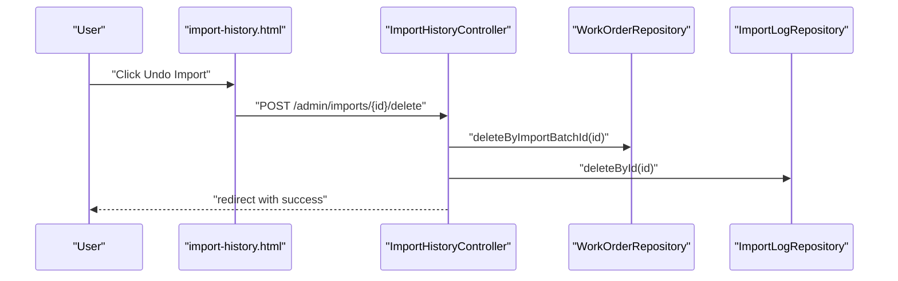
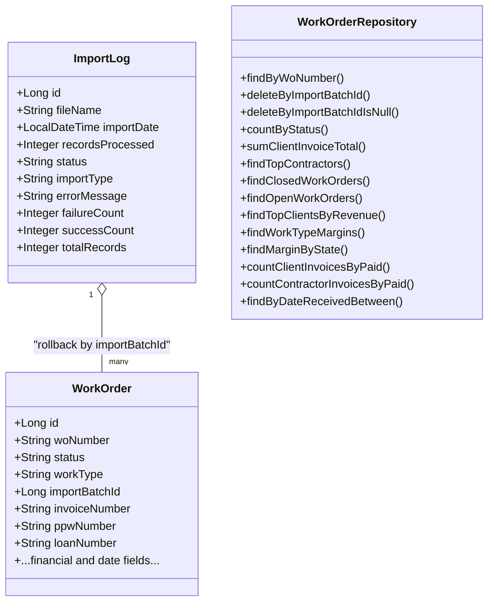
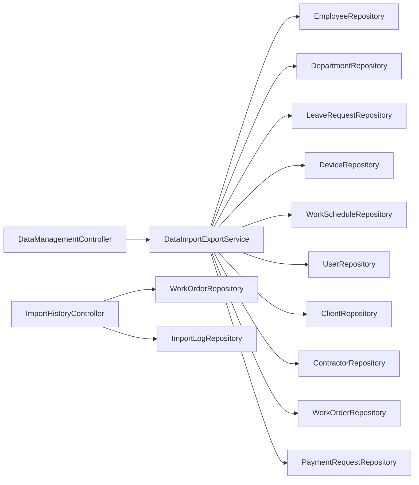

# Bulk Operations

<cite>
**Referenced Files in This Document**
- [DataImportExportService.java](file://src/main/java/root/cyb/mh/attendancesystem/service/DataImportExportService.java)
- [DataManagementController.java](file://src/main/java/root/cyb/mh/attendancesystem/controller/DataManagementController.java)
- [ImportHistoryController.java](file://src/main/java/root/cyb/mh/attendancesystem/controller/ImportHistoryController.java)
- [ImportLog.java](file://src/main/java/root/cyb/mh/attendancesystem/model/ImportLog.java)
- [ImportLogRepository.java](file://src/main/java/root/cyb/mh/attendancesystem/repository/ImportLogRepository.java)
- [WorkOrderRepository.java](file://src/main/java/root/cyb/mh/attendancesystem/repository/WorkOrderRepository.java)
- [WorkOrder.java](file://src/main/java/root/cyb/mh/attendancesystem/model/WorkOrder.java)
- [PaymentRequest.java](file://src/main/java/root/cyb/mh/attendancesystem/model/PaymentRequest.java)
- [PaymentRequestService.java](file://src/main/java/root/cyb/mh/attendancesystem/service/PaymentRequestService.java)
- [import-history.html](file://src/main/resources/templates/admin/import-history.html)
</cite>

## Table of Contents
1. [Introduction](#introduction)
2. [Project Structure](#project-structure)
3. [Core Components](#core-components)
4. [Architecture Overview](#architecture-overview)
5. [Detailed Component Analysis](#detailed-component-analysis)
6. [Dependency Analysis](#dependency-analysis)
7. [Performance Considerations](#performance-considerations)
8. [Troubleshooting Guide](#troubleshooting-guide)
9. [Conclusion](#conclusion)
10. [Appendices](#appendices)

## Introduction
This document explains the bulk data operations in Skylink Custom Backend, focusing on bulk import/export capabilities, batch processing workflows, and data manipulation operations. It documents the DataImportExportService implementation for handling large-scale data operations, transaction management for bulk updates, and error handling strategies for partial failures. Practical examples include bulk employee imports, department updates, leave request processing, device management, and work order bulk ingestion with rollback support. It also covers performance optimization techniques, memory management considerations, progress tracking, rollback mechanisms, validation rules, data consistency checks, and integration with the main application data flow.

## Project Structure
The bulk operations feature spans the controller layer, service layer, domain models, repositories, and UI templates:
- Controllers expose endpoints for exporting and importing data.
- DataImportExportService orchestrates parsing, validation, persistence, logging, and reporting.
- Domain models represent entities like WorkOrder, ImportLog, and PaymentRequest.
- Repositories provide CRUD and specialized queries for batch operations and cleanup.
- Templates render import history and enable undo actions.

**Diagram sources**
- [DataManagementController.java:20-82](file://src/main/java/root/cyb/mh/attendancesystem/controller/DataManagementController.java#L20-L82)
- [DataImportExportService.java:40-925](file://src/main/java/root/cyb/mh/attendancesystem/service/DataImportExportService.java#L40-L925)
- [ImportHistoryController.java:26-51](file://src/main/java/root/cyb/mh/attendancesystem/controller/ImportHistoryController.java#L26-L51)
- [ImportLog.java:1-113](file://src/main/java/root/cyb/mh/attendancesystem/model/ImportLog.java#L1-L113)
- [WorkOrder.java:1-109](file://src/main/java/root/cyb/mh/attendancesystem/model/WorkOrder.java#L1-L109)
- [PaymentRequest.java:1-117](file://src/main/java/root/cyb/mh/attendancesystem/model/PaymentRequest.java#L1-L117)
- [import-history.html:52-132](file://src/main/resources/templates/admin/import-history.html#L52-L132)

**Section sources**
- [DataManagementController.java:1-84](file://src/main/java/root/cyb/mh/attendancesystem/controller/DataManagementController.java#L1-L84)
- [DataImportExportService.java:1-925](file://src/main/java/root/cyb/mh/attendancesystem/service/DataImportExportService.java#L1-L925)
- [ImportHistoryController.java:1-53](file://src/main/java/root/cyb/mh/attendancesystem/controller/ImportHistoryController.java#L1-L53)
- [ImportLog.java:1-113](file://src/main/java/root/cyb/mh/attendancesystem/model/ImportLog.java#L1-L113)
- [WorkOrder.java:1-109](file://src/main/java/root/cyb/mh/attendancesystem/model/WorkOrder.java#L1-L109)
- [PaymentRequest.java:1-117](file://src/main/java/root/cyb/mh/attendancesystem/model/PaymentRequest.java#L1-L117)
- [import-history.html:1-152](file://src/main/resources/templates/admin/import-history.html#L1-L152)

## Core Components
- DataImportExportService: Central service for CSV export/import of Employees, Departments, LeaveRequests, Devices, Settings, Users, and WorkOrders. It also supports PaymentRequest CSV/PDF exports and invoice generation. It maintains import logs and coordinates transactional batch processing.
- DataManagementController: Exposes endpoints to trigger exports and imports for supported types.
- ImportHistoryController: Manages import history visibility and provides undo/cleanup actions.
- ImportLog and ImportLogRepository: Track import batches, statuses, counts, and errors.
- WorkOrderRepository: Provides batch deletion by import batch ID and cleanup of legacy data.
- WorkOrder: Tracks importBatchId to enable rollback.
- PaymentRequest and PaymentRequestService: Support bulk export of payment requests and related notifications.

Key responsibilities:
- Parsing CSV streams and mapping to domain entities.
- Upsert semantics per entity type.
- Transactional boundary around work order imports.
- Import logging and status propagation.
- Rollback via batch ID deletion.
- Export of payment requests to CSV/PDF.

**Section sources**
- [DataImportExportService.java:16-36](file://src/main/java/root/cyb/mh/attendancesystem/service/DataImportExportService.java#L16-L36)
- [DataManagementController.java:13-82](file://src/main/java/root/cyb/mh/attendancesystem/controller/DataManagementController.java#L13-L82)
- [ImportHistoryController.java:16-51](file://src/main/java/root/cyb/mh/attendancesystem/controller/ImportHistoryController.java#L16-L51)
- [ImportLog.java:6-32](file://src/main/java/root/cyb/mh/attendancesystem/model/ImportLog.java#L6-L32)
- [WorkOrderRepository.java:16-21](file://src/main/java/root/cyb/mh/attendancesystem/repository/WorkOrderRepository.java#L16-L21)
- [WorkOrder.java:39-47](file://src/main/java/root/cyb/mh/attendancesystem/model/WorkOrder.java#L39-L47)
- [PaymentRequest.java:14-117](file://src/main/java/root/cyb/mh/attendancesystem/model/PaymentRequest.java#L14-L117)

## Architecture Overview
The bulk import/export pipeline follows a layered architecture:
- Presentation: Controllers accept multipart/form-data for imports and stream CSV/PDF for exports.
- Service: DataImportExportService parses CSV, validates fields, resolves relationships, persists entities, and updates import logs.
- Persistence: Repositories handle CRUD and specialized queries for batch operations.
- UI: Import history page lists imports and enables undo/cleanup.

**Diagram sources**
- [DataManagementController.java:49-82](file://src/main/java/root/cyb/mh/attendancesystem/controller/DataManagementController.java#L49-L82)
- [DataImportExportService.java:750-884](file://src/main/java/root/cyb/mh/attendancesystem/service/DataImportExportService.java#L750-L884)
- [ImportLogRepository.java:7-9](file://src/main/java/root/cyb/mh/attendancesystem/repository/ImportLogRepository.java#L7-L9)
- [WorkOrderRepository.java:16-21](file://src/main/java/root/cyb/mh/attendancesystem/repository/WorkOrderRepository.java#L16-L21)

## Detailed Component Analysis

### DataImportExportService
Responsibilities:
- Export APIs for Employees, Departments, LeaveRequests, Devices, Settings, Users, and PaymentRequests (CSV and PDF).
- Import APIs for Employees, Departments, LeaveRequests, Devices, Settings, Users, and WorkOrders.
- Transactional import for WorkOrders with ImportLog tracking.
- Robust parsing helpers for dates, currency, and percentages.
- PaymentRequest export metadata mapping and PDF rendering.

Notable behaviors:
- CSV parsing with Apache Commons CSV and header-based mapping.
- Upserts per entity type using ID presence or unique keys.
- Work order status inference based on sent/paid dates.
- Relationship resolution for Clients and Contractors during work order import.
- ImportLog creation, updates, and error propagation.

**Diagram sources**
- [DataImportExportService.java:750-884](file://src/main/java/root/cyb/mh/attendancesystem/service/DataImportExportService.java#L750-L884)

**Section sources**
- [DataImportExportService.java:40-925](file://src/main/java/root/cyb/mh/attendancesystem/service/DataImportExportService.java#L40-L925)

### DataManagementController
Responsibilities:
- Exposes GET /data/export?type={employees,departments,leaves,devices,settings,users} to download CSV.
- Exposes POST /data/import?type={employees,departments,leaves,devices,settings,users,workorders} to upload CSV and process bulk operations.

Behavior:
- Validates non-empty file uploads.
- Delegates to DataImportExportService based on type.
- Redirects with success/error parameters.

**Section sources**
- [DataManagementController.java:20-82](file://src/main/java/root/cyb/mh/attendancesystem/controller/DataManagementController.java#L20-L82)

### ImportHistoryController and UI
Responsibilities:
- Lists import logs ordered by date.
- Supports undo import by deleting all WorkOrders linked to a batch ID.
- Supports cleanup of legacy data (no import batch ID).
- UI template renders logs, status badges, and action buttons.

**Diagram sources**
- [ImportHistoryController.java:34-44](file://src/main/java/root/cyb/mh/attendancesystem/controller/ImportHistoryController.java#L34-L44)
- [WorkOrderRepository.java:19-21](file://src/main/java/root/cyb/mh/attendancesystem/repository/WorkOrderRepository.java#L19-L21)
- [ImportLogRepository.java:7-9](file://src/main/java/root/cyb/mh/attendancesystem/repository/ImportLogRepository.java#L7-L9)
- [import-history.html:85-132](file://src/main/resources/templates/admin/import-history.html#L85-L132)

**Section sources**
- [ImportHistoryController.java:26-51](file://src/main/java/root/cyb/mh/attendancesystem/controller/ImportHistoryController.java#L26-L51)
- [import-history.html:52-132](file://src/main/resources/templates/admin/import-history.html#L52-L132)

### Data Models and Repositories
- ImportLog: Tracks import batches with status, counts, and error messages.
- WorkOrder: Stores importBatchId to enable rollback and includes financial and temporal fields.
- WorkOrderRepository: Provides batch deletion and cleanup queries.
- PaymentRequest: Used by DataImportExportService for export helpers and PDF generation.

**Diagram sources**
- [ImportLog.java:6-32](file://src/main/java/root/cyb/mh/attendancesystem/model/ImportLog.java#L6-L32)
- [WorkOrder.java:11-47](file://src/main/java/root/cyb/mh/attendancesystem/model/WorkOrder.java#L11-L47)
- [WorkOrderRepository.java:16-79](file://src/main/java/root/cyb/mh/attendancesystem/repository/WorkOrderRepository.java#L16-L79)

**Section sources**
- [ImportLog.java:1-113](file://src/main/java/root/cyb/mh/attendancesystem/model/ImportLog.java#L1-L113)
- [WorkOrder.java:1-109](file://src/main/java/root/cyb/mh/attendancesystem/model/WorkOrder.java#L1-L109)
- [WorkOrderRepository.java:1-80](file://src/main/java/root/cyb/mh/attendancesystem/repository/WorkOrderRepository.java#L1-L80)

### Payment Request Bulk Export and Notifications
- DataImportExportService provides export helpers for PaymentRequest to CSV/PDF.
- PaymentRequestService manages notifications and sorting for payment requests.

**Section sources**
- [DataImportExportService.java:234-318](file://src/main/java/root/cyb/mh/attendancesystem/service/DataImportExportService.java#L234-L318)
- [PaymentRequest.java:14-117](file://src/main/java/root/cyb/mh/attendancesystem/model/PaymentRequest.java#L14-L117)
- [PaymentRequestService.java:14-269](file://src/main/java/root/cyb/mh/attendancesystem/service/PaymentRequestService.java#L14-L269)

## Dependency Analysis
- Controllers depend on DataImportExportService for orchestration.
- DataImportExportService depends on repositories for persistence and relationship resolution.
- ImportHistoryController depends on WorkOrderRepository and ImportLogRepository for rollback and cleanup.
- UI template depends on ImportHistoryController for rendering logs and actions.

**Diagram sources**
- [DataManagementController.java:13-18](file://src/main/java/root/cyb/mh/attendancesystem/controller/DataManagementController.java#L13-L18)
- [DataImportExportService.java:19-36](file://src/main/java/root/cyb/mh/attendancesystem/service/DataImportExportService.java#L19-L36)
- [ImportHistoryController.java:20-24](file://src/main/java/root/cyb/mh/attendancesystem/controller/ImportHistoryController.java#L20-L24)

**Section sources**
- [DataManagementController.java:1-84](file://src/main/java/root/cyb/mh/attendancesystem/controller/DataManagementController.java#L1-L84)
- [DataImportExportService.java:1-925](file://src/main/java/root/cyb/mh/attendancesystem/service/DataImportExportService.java#L1-L925)
- [ImportHistoryController.java:1-53](file://src/main/java/root/cyb/mh/attendancesystem/controller/ImportHistoryController.java#L1-L53)

## Performance Considerations
- Streaming CSV parsing: Apache Commons CSV processes records iteratively, reducing peak memory usage compared to loading entire files.
- Batch writes: Entities are saved individually per record; for very large imports, consider batching saves and flush intervals at the persistence provider level.
- Minimal projections: Export methods iterate findAll() for small entities; for large datasets, paginate or stream results to reduce memory footprint.
- Date/currency parsing: Dedicated parsers normalize formats and guard against invalid inputs to avoid retries and exceptions mid-batch.
- Transaction scope: Work order imports are wrapped in a single transactional method to ensure atomicity; keep batch sizes reasonable to avoid long-running transactions.
- UI responsiveness: Import history page lists recent entries; consider server-side pagination for extensive histories.

[No sources needed since this section provides general guidance]

## Troubleshooting Guide
Common issues and resolutions:
- Empty file upload: Controller redirects with an error; ensure a valid CSV is selected.
- Unknown import type: Controller redirects with an error; verify the type parameter matches supported values.
- Import failures: DataImportExportService sets ImportLog status to FAILED and captures error messages; inspect logs for details.
- Partial success: ImportLog tracks successCount and failureCount; investigate failing rows and correct data inconsistencies.
- Rollback after failed import: Use ImportHistoryController undo action to delete all WorkOrders linked to the batch ID.
- Cleanup legacy data: Use the cleanup endpoint to remove WorkOrders not linked to any import batch.

Operational tips:
- Validate CSV headers and data types before import.
- For work orders, ensure unique identifiers (WO #) and required fields are present.
- Monitor ImportLog entries for progress and errors.

**Section sources**
- [DataManagementController.java:50-82](file://src/main/java/root/cyb/mh/attendancesystem/controller/DataManagementController.java#L50-L82)
- [DataImportExportService.java:877-884](file://src/main/java/root/cyb/mh/attendancesystem/service/DataImportExportService.java#L877-L884)
- [ImportHistoryController.java:34-51](file://src/main/java/root/cyb/mh/attendancesystem/controller/ImportHistoryController.java#L34-L51)
- [ImportLog.java:20-27](file://src/main/java/root/cyb/mh/attendancesystem/model/ImportLog.java#L20-L27)

## Conclusion
The Skylink Custom Backend implements robust bulk data operations centered on DataImportExportService. It supports CSV exports/imports for multiple entities, with special emphasis on work order ingestion and rollback via ImportLog and batch IDs. The controllers and UI integrate seamlessly to provide visibility and control over bulk operations, including undo and cleanup. With streaming parsing, transactional boundaries, and structured logging, the system balances performance, reliability, and operability for large-scale data workflows.

[No sources needed since this section summarizes without analyzing specific files]

## Appendices

### Practical Examples

- Bulk Employee Imports
  - Endpoint: POST /data/import?type=employees
  - Behavior: Parses CSV with headers, upserts Employee entities, optionally linking Department by ID.
  - Validation: Non-empty ID and optional CardID; missing departments are ignored gracefully.

- Department Updates
  - Endpoint: POST /data/import?type=departments
  - Behavior: Creates or updates Department by ID if provided; otherwise inserts new.

- Leave Request Processing
  - Endpoint: POST /data/import?type=leaves
  - Behavior: Upserts LeaveRequest by ID if present; maps Employee by ID; parses StartDate/EndDate; defaults Status if absent.

- Device Management Operations
  - Endpoint: POST /data/import?type=devices
  - Behavior: Upserts Device by ID if present; parses IP, Port, Serial; saves.

- Work Order Bulk Ingestion
  - Endpoint: POST /data/import?type=workorders
  - Behavior: Transactionally imports work orders; infers status from sent/paid dates; creates Clients/Contractors if missing; assigns importBatchId for rollback.

- Payment Request Bulk Export
  - Endpoint: GET /data/export?type=payment-requests
  - Behavior: Streams CSV/PDF with configurable columns; uses PaymentRequest export helpers.

**Section sources**
- [DataManagementController.java:49-82](file://src/main/java/root/cyb/mh/attendancesystem/controller/DataManagementController.java#L49-L82)
- [DataImportExportService.java:96-209](file://src/main/java/root/cyb/mh/attendancesystem/service/DataImportExportService.java#L96-L209)
- [DataImportExportService.java:750-884](file://src/main/java/root/cyb/mh/attendancesystem/service/DataImportExportService.java#L750-L884)
- [DataImportExportService.java:234-318](file://src/main/java/root/cyb/mh/attendancesystem/service/DataImportExportService.java#L234-L318)

### Validation Rules and Consistency Checks
- Required fields: WO # for work orders; EmployeeID for leave requests; Username for users.
- Data types: Dates parsed with flexible formats; currency and percentage cleaned and normalized.
- Referential integrity: Clients and Contractors are created if missing during work order import.
- Status inference: Work order status derived from sent/paid date presence.
- Atomicity: Work order imports are transactional; failures roll back the entire batch.

**Section sources**
- [DataImportExportService.java:767-898](file://src/main/java/root/cyb/mh/attendancesystem/service/DataImportExportService.java#L767-L898)
- [WorkOrder.java:17-85](file://src/main/java/root/cyb/mh/attendancesystem/model/WorkOrder.java#L17-L85)

### Rollback Mechanisms
- ImportLog tracks batch metadata and status.
- WorkOrderRepository exposes deleteByImportBatchId for undo.
- ImportHistoryController performs the undo and cleanup operations.

**Section sources**
- [ImportLog.java:6-32](file://src/main/java/root/cyb/mh/attendancesystem/model/ImportLog.java#L6-L32)
- [WorkOrderRepository.java:19-21](file://src/main/java/root/cyb/mh/attendancesystem/repository/WorkOrderRepository.java#L19-L21)
- [ImportHistoryController.java:34-51](file://src/main/java/root/cyb/mh/attendancesystem/controller/ImportHistoryController.java#L34-L51)