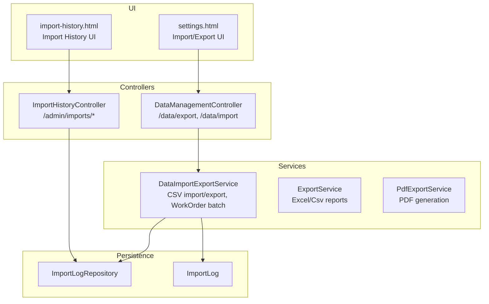
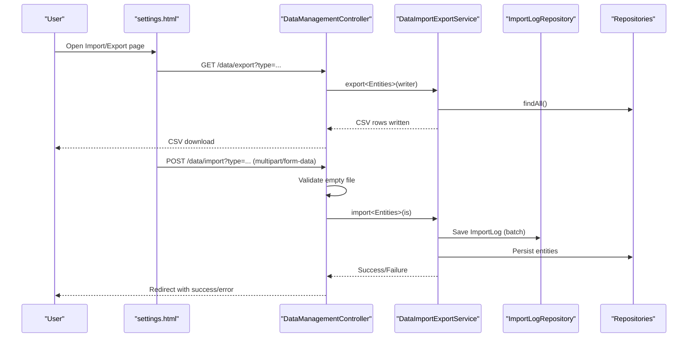
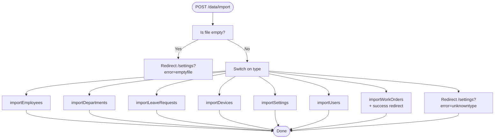
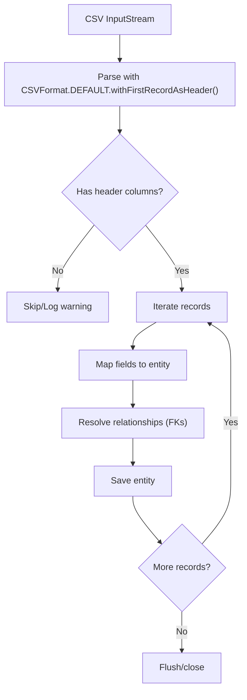
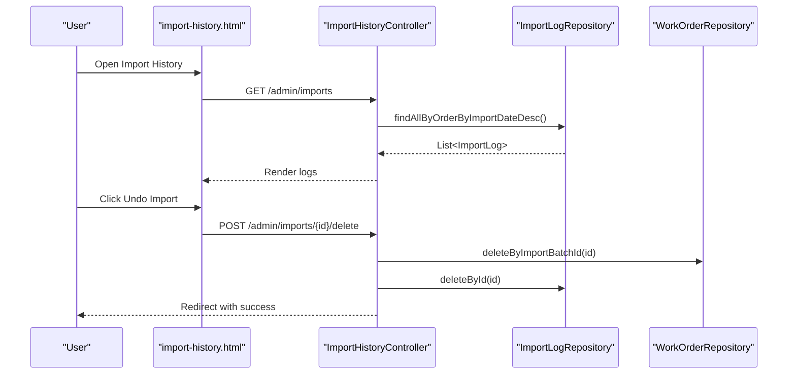
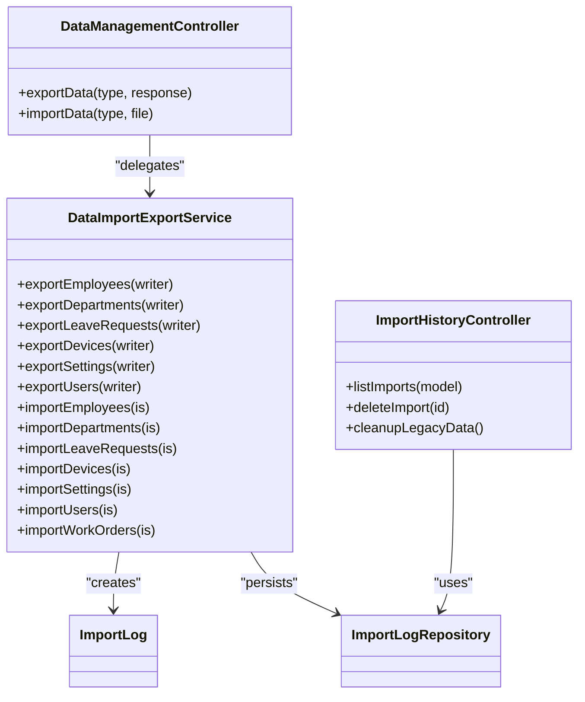

# Data Import & Export

<cite>
**Referenced Files in This Document**
- [DataManagementController.java](file://src/main/java/root/cyb/mh/attendancesystem/controller/DataManagementController.java)
- [DataImportExportService.java](file://src/main/java/root/cyb/mh/attendancesystem/service/DataImportExportService.java)
- [ExportService.java](file://src/main/java/root/cyb/mh/attendancesystem/service/ExportService.java)
- [PdfExportService.java](file://src/main/java/root/cyb/mh/attendancesystem/service/PdfExportService.java)
- [ImportHistoryController.java](file://src/main/java/root/cyb/mh/attendancesystem/controller/ImportHistoryController.java)
- [ImportLog.java](file://src/main/java/root/cyb/mh/attendancesystem/model/ImportLog.java)
- [ImportLogRepository.java](file://src/main/java/root/cyb/mh/attendancesystem/repository/ImportLogRepository.java)
- [settings.html](file://src/main/resources/templates/settings.html)
- [import-history.html](file://src/main/resources/templates/admin/import-history.html)
- [invoice_report.csv](file://invoice_report.csv)
- [application.properties](file://src/main/resources/application.properties)
- [GlobalExceptionHandler.java](file://src/main/java/root/cyb/mh/attendancesystem/exception/GlobalExceptionHandler.java)
</cite>

## Table of Contents
1. [Introduction](#introduction)
2. [Project Structure](#project-structure)
3. [Core Components](#core-components)
4. [Architecture Overview](#architecture-overview)
5. [Detailed Component Analysis](#detailed-component-analysis)
6. [Dependency Analysis](#dependency-analysis)
7. [Performance Considerations](#performance-considerations)
8. [Troubleshooting Guide](#troubleshooting-guide)
9. [Conclusion](#conclusion)
10. [Appendices](#appendices)

## Introduction
This document explains the data import and export functionality in Skylink Custom Backend. It covers the CSV import/export endpoints, supported data types, multipart file handling, data transformation, error handling, redirect responses, and integration patterns with external systems. It also provides practical examples, CSV format specifications, validation rules, and guidance on performance and data integrity for large datasets.

## Project Structure
The import/export feature spans controllers, services, repositories, models, and UI templates:
- Controllers expose endpoints for exporting and importing CSV data.
- Services implement parsing, transformation, and persistence logic.
- Repositories persist entities and support batch operations.
- Models define import logging and entity schemas.
- Templates provide user interfaces for initiating imports and viewing import history.

**Diagram sources**
- [DataManagementController.java:13-84](file://src/main/java/root/cyb/mh/attendancesystem/controller/DataManagementController.java#L13-L84)
- [ImportHistoryController.java:16-53](file://src/main/java/root/cyb/mh/attendancesystem/controller/ImportHistoryController.java#L16-L53)
- [DataImportExportService.java:16-925](file://src/main/java/root/cyb/mh/attendancesystem/service/DataImportExportService.java#L16-L925)
- [ExportService.java:22-579](file://src/main/java/root/cyb/mh/attendancesystem/service/ExportService.java#L22-L579)
- [PdfExportService.java:23-485](file://src/main/java/root/cyb/mh/attendancesystem/service/PdfExportService.java#L23-L485)
- [ImportLog.java:6-113](file://src/main/java/root/cyb/mh/attendancesystem/model/ImportLog.java#L6-L113)
- [ImportLogRepository.java:3-9](file://src/main/java/root/cyb/mh/attendancesystem/repository/ImportLogRepository.java#L3-L9)
- [settings.html:202-278](file://src/main/resources/templates/settings.html#L202-L278)
- [import-history.html:1-152](file://src/main/resources/templates/admin/import-history.html#L1-L152)

**Section sources**
- [DataManagementController.java:13-84](file://src/main/java/root/cyb/mh/attendancesystem/controller/DataManagementController.java#L13-L84)
- [DataImportExportService.java:16-925](file://src/main/java/root/cyb/mh/attendancesystem/service/DataImportExportService.java#L16-L925)
- [ImportHistoryController.java:16-53](file://src/main/java/root/cyb/mh/attendancesystem/controller/ImportHistoryController.java#L16-L53)
- [ImportLog.java:6-113](file://src/main/java/root/cyb/mh/attendancesystem/model/ImportLog.java#L6-L113)
- [ImportLogRepository.java:3-9](file://src/main/java/root/cyb/mh/attendancesystem/repository/ImportLogRepository.java#L3-L9)
- [settings.html:202-278](file://src/main/resources/templates/settings.html#L202-L278)
- [import-history.html:1-152](file://src/main/resources/templates/admin/import-history.html#L1-L152)

## Core Components
- DataManagementController: Exposes GET /data/export and POST /data/import with multipart file handling and redirects.
- DataImportExportService: Implements CSV export and import for employees, departments, leaves, devices, settings, users, and workorders. Includes robust parsing and batch logging for workorders.
- ImportHistoryController and ImportLog: Track imports, enable undo and cleanup operations.
- ExportService and PdfExportService: Provide Excel/Csv and PDF reporting for attendance and payroll-related data.
- UI templates: Provide forms and dashboards for initiating imports and reviewing import history.

Key responsibilities:
- Endpoint routing and HTTP responses for CSV downloads and uploads.
- CSV parsing with Apache Commons CSV, header validation, and field mapping.
- Entity creation/update, foreign key resolution, and derived calculations.
- Transactional batch processing with import logs and error reporting.
- Redirect-based feedback to the UI for success/error states.

**Section sources**
- [DataManagementController.java:13-84](file://src/main/java/root/cyb/mh/attendancesystem/controller/DataManagementController.java#L13-L84)
- [DataImportExportService.java:16-925](file://src/main/java/root/cyb/mh/attendancesystem/service/DataImportExportService.java#L16-L925)
- [ImportHistoryController.java:16-53](file://src/main/java/root/cyb/mh/attendancesystem/controller/ImportHistoryController.java#L16-L53)
- [ImportLog.java:6-113](file://src/main/java/root/cyb/mh/attendancesystem/model/ImportLog.java#L6-L113)
- [ExportService.java:22-579](file://src/main/java/root/cyb/mh/attendancesystem/service/ExportService.java#L22-L579)
- [PdfExportService.java:23-485](file://src/main/java/root/cyb/mh/attendancesystem/service/PdfExportService.java#L23-L485)

## Architecture Overview
The import/export pipeline integrates UI, controllers, services, and persistence:

**Diagram sources**
- [DataManagementController.java:13-84](file://src/main/java/root/cyb/mh/attendancesystem/controller/DataManagementController.java#L13-L84)
- [DataImportExportService.java:16-925](file://src/main/java/root/cyb/mh/attendancesystem/service/DataImportExportService.java#L16-L925)
- [ImportLogRepository.java:3-9](file://src/main/java/root/cyb/mh/attendancesystem/repository/ImportLogRepository.java#L3-L9)
- [settings.html:202-278](file://src/main/resources/templates/settings.html#L202-L278)

## Detailed Component Analysis

### DataManagementController
Responsibilities:
- Export endpoint sets Content-Type to CSV and attaches a filename based on type.
- Import endpoint validates empty files and routes to appropriate importers.
- Returns redirect responses with query parameters for UI feedback.

Behavior highlights:
- Export supports employees, departments, leaves, devices, settings, users.
- Import supports employees, departments, leaves, devices, settings, users, workorders.
- Empty file triggers redirect with error; unknown type triggers redirect with error.
- Workorders import returns success redirect; others return success redirect.

**Diagram sources**
- [DataManagementController.java:49-82](file://src/main/java/root/cyb/mh/attendancesystem/controller/DataManagementController.java#L49-L82)

**Section sources**
- [DataManagementController.java:13-84](file://src/main/java/root/cyb/mh/attendancesystem/controller/DataManagementController.java#L13-L84)

### DataImportExportService
Exports:
- Employees: ID, Name, DepartmentID, CardID.
- Departments: ID, Name.
- LeaveRequests: ID, EmployeeID, StartDate, EndDate, Reason, Status.
- Devices: ID, Name, IP, Port, Serial.
- Settings: ID, StartTime, EndTime, LateTolerance, EarlyTolerance, Weekends.
- Users: ID, Username, Role.

Imports:
- Employees: Reads headers, creates or updates Employee, optionally sets Department and CardID.
- Departments: Creates or updates Department by ID if provided and exists.
- LeaveRequests: Creates or updates by ID; parses dates; maps Status enum; requires EmployeeID.
- Devices: Creates or updates by ID; parses numeric Port; optional Serial.
- Settings: Parses WorkSchedule times and tolerances; persists single schedule.
- Users: Updates by ID if exists, otherwise creates; defaults role if missing; sets placeholder password for new users.
- WorkOrders: Comprehensive batch import with ImportLog tracking, date parsing across multiple formats, currency/percentage parsing, inferred status, and relationship resolution for Client/Contractor.

Validation and transformation:
- Uses CSVFormat with first-record-as-header.
- Field presence checks and optional fields guarded with isMapped.
- Date parsing with flexible patterns and non-breaking space normalization.
- Currency and percentage parsing with tolerance for formatting variations.
- Derived booleans and status inference based on parsed fields.

Error handling:
- WorkOrders import runs inside a transactional block, logs failures, and stores error messages.
- Other imports do not wrap individual records in transactions; consider batching for large datasets.

**Diagram sources**
- [DataImportExportService.java:96-209](file://src/main/java/root/cyb/mh/attendancesystem/service/DataImportExportService.java#L96-L209)

**Section sources**
- [DataImportExportService.java:38-92](file://src/main/java/root/cyb/mh/attendancesystem/service/DataImportExportService.java#L38-L92)
- [DataImportExportService.java:96-209](file://src/main/java/root/cyb/mh/attendancesystem/service/DataImportExportService.java#L96-L209)
- [DataImportExportService.java:750-884](file://src/main/java/root/cyb/mh/attendancesystem/service/DataImportExportService.java#L750-L884)
- [DataImportExportService.java:886-925](file://src/main/java/root/cyb/mh/attendancesystem/service/DataImportExportService.java#L886-L925)

### Import History and Undo
ImportHistoryController:
- Lists import logs ordered by date descending.
- Supports deleting a specific import batch and cleaning up legacy data not linked to any batch.

Template:
- Provides UI to review import logs, view status, and trigger undo actions.
- Includes a cleanup modal to remove orphaned WorkOrders.

**Diagram sources**
- [ImportHistoryController.java:16-53](file://src/main/java/root/cyb/mh/attendancesystem/controller/ImportHistoryController.java#L16-L53)
- [ImportLogRepository.java:3-9](file://src/main/java/root/cyb/mh/attendancesystem/repository/ImportLogRepository.java#L3-L9)
- [import-history.html:1-152](file://src/main/resources/templates/admin/import-history.html#L1-L152)

**Section sources**
- [ImportHistoryController.java:16-53](file://src/main/java/root/cyb/mh/attendancesystem/controller/ImportHistoryController.java#L16-L53)
- [ImportLog.java:6-113](file://src/main/java/root/cyb/mh/attendancesystem/model/ImportLog.java#L6-L113)
- [ImportLogRepository.java:3-9](file://src/main/java/root/cyb/mh/attendancesystem/repository/ImportLogRepository.java#L3-L9)
- [import-history.html:1-152](file://src/main/resources/templates/admin/import-history.html#L1-L152)

### CSV Format Specifications and Examples
Supported data types and export headers:
- Employees: ID, Name, DepartmentID, CardID
- Departments: ID, Name
- LeaveRequests: ID, EmployeeID, StartDate, EndDate, Reason, Status
- Devices: ID, Name, IP, Port, Serial
- Settings: ID, StartTime, EndTime, LateTolerance, EarlyTolerance, Weekends
- Users: ID, Username, Role

Example CSV for WorkOrders (headers shown):
- Invoice #,Invoice Date,PPW#,Contractor,Assigned Admin,Address,City,State,Zip,Loan #,WO #,Client,Customer/Bank,Work Type,Date Due,Date Due Client,Contractor Discount%, Contractor Total , Contractor Paid Amount , Client Total ,Client Discount%, Client Discount Total ,Client Paid Date, Client Paid Amount , Write Off Amount ,Sent to Client

Practical examples:
- Export employees: GET /data/export?type=employees → CSV download.
- Import departments: POST /data/import?type=departments with CSV file → Redirect with success or error.
- Import workorders: POST /data/import?type=workorders with CSV → Redirect with success after batch processing and logging.

**Section sources**
- [DataImportExportService.java:40-92](file://src/main/java/root/cyb/mh/attendancesystem/service/DataImportExportService.java#L40-L92)
- [DataImportExportService.java:114-127](file://src/main/java/root/cyb/mh/attendancesystem/service/DataImportExportService.java#L114-L127)
- [DataImportExportService.java:129-155](file://src/main/java/root/cyb/mh/attendancesystem/service/DataImportExportService.java#L129-L155)
- [DataImportExportService.java:157-173](file://src/main/java/root/cyb/mh/attendancesystem/service/DataImportExportService.java#L157-L173)
- [DataImportExportService.java:175-187](file://src/main/java/root/cyb/mh/attendancesystem/service/DataImportExportService.java#L175-L187)
- [DataImportExportService.java:189-209](file://src/main/java/root/cyb/mh/attendancesystem/service/DataImportExportService.java#L189-L209)
- [DataManagementController.java:20-47](file://src/main/java/root/cyb/mh/attendancesystem/controller/DataManagementController.java#L20-L47)
- [DataManagementController.java:49-82](file://src/main/java/root/cyb/mh/attendancesystem/controller/DataManagementController.java#L49-L82)
- [settings.html:202-278](file://src/main/resources/templates/settings.html#L202-L278)
- [invoice_report.csv:1-19](file://invoice_report.csv#L1-L19)

### Validation Rules During Import
- Required headers: First row must contain expected column names for each type.
- Optional fields: Guarded with isMapped checks; missing fields are ignored.
- Data types:
  - Dates: Parsed with flexible patterns; non-breaking spaces normalized.
  - Currency: Removes $, commas, spaces; treats "-" as zero.
  - Percentages: Removes % sign; parses numeric value.
- Foreign keys:
  - EmployeeID, DepartmentID, Client code, Contractor name resolved via repositories.
- Defaults:
  - LeaveRequest Status defaults to pending if not provided.
  - User role defaults to provided value or blank if absent.
  - New User gets a placeholder password.

**Section sources**
- [DataImportExportService.java:96-209](file://src/main/java/root/cyb/mh/attendancesystem/service/DataImportExportService.java#L96-L209)
- [DataImportExportService.java:886-925](file://src/main/java/root/cyb/mh/attendancesystem/service/DataImportExportService.java#L886-L925)

### Integration Patterns with External Systems
- CSV-driven ingestion: External systems export CSVs aligned with supported headers and upload via /data/import.
- Batch tracking: WorkOrders import writes an ImportLog entry with total records, success/failure counts, and error messages.
- Undo capability: Use Import History UI to remove all WorkOrders linked to a batch and delete the log entry.
- Cleanup legacy data: Remove WorkOrders not associated with any import batch.

**Section sources**
- [DataImportExportService.java:750-884](file://src/main/java/root/cyb/mh/attendancesystem/service/DataImportExportService.java#L750-L884)
- [ImportHistoryController.java:34-51](file://src/main/java/root/cyb/mh/attendancesystem/controller/ImportHistoryController.java#L34-L51)
- [import-history.html:1-152](file://src/main/resources/templates/admin/import-history.html#L1-L152)

## Dependency Analysis

**Diagram sources**
- [DataManagementController.java:13-84](file://src/main/java/root/cyb/mh/attendancesystem/controller/DataManagementController.java#L13-L84)
- [DataImportExportService.java:16-925](file://src/main/java/root/cyb/mh/attendancesystem/service/DataImportExportService.java#L16-L925)
- [ImportHistoryController.java:16-53](file://src/main/java/root/cyb/mh/attendancesystem/controller/ImportHistoryController.java#L16-L53)
- [ImportLog.java:6-113](file://src/main/java/root/cyb/mh/attendancesystem/model/ImportLog.java#L6-L113)
- [ImportLogRepository.java:3-9](file://src/main/java/root/cyb/mh/attendancesystem/repository/ImportLogRepository.java#L3-L9)

**Section sources**
- [DataManagementController.java:13-84](file://src/main/java/root/cyb/mh/attendancesystem/controller/DataManagementController.java#L13-L84)
- [DataImportExportService.java:16-925](file://src/main/java/root/cyb/mh/attendancesystem/service/DataImportExportService.java#L16-L925)
- [ImportHistoryController.java:16-53](file://src/main/java/root/cyb/mh/attendancesystem/controller/ImportHistoryController.java#L16-L53)
- [ImportLog.java:6-113](file://src/main/java/root/cyb/mh/attendancesystem/model/ImportLog.java#L6-L113)
- [ImportLogRepository.java:3-9](file://src/main/java/root/cyb/mh/attendancesystem/repository/ImportLogRepository.java#L3-L9)

## Performance Considerations
- Current import behavior:
  - Non-workorder imports iterate records and save per entity; consider batching for large datasets.
  - WorkOrders import uses a transactional block, logs totals, and processes records sequentially.
- Recommendations:
  - Use streaming or chunked processing for very large CSVs.
  - Apply database batch inserts where feasible.
  - Add pagination or progress indicators in UI for long-running imports.
  - Monitor memory usage with large CSVs; avoid loading entire file into memory unnecessarily.
  - Consider asynchronous processing for heavy imports with progress tracking.

[No sources needed since this section provides general guidance]

## Troubleshooting Guide
Common issues and resolutions:
- Empty file upload:
  - Symptom: Redirect to /settings?error=emptyfile.
  - Resolution: Select a non-empty CSV file and retry.
- Unknown import type:
  - Symptom: Redirect to /settings?error=unknowntype.
  - Resolution: Use supported types: employees, departments, leaves, devices, settings, users, workorders.
- File too large:
  - Symptom: Flash message “File too large! Maximum upload size is 10MB.”
  - Resolution: Reduce file size or split into smaller CSVs.
- WorkOrder import errors:
  - Symptom: Import log shows FAILED with error message.
  - Resolution: Inspect CSV headers and formats; ensure required fields are present and formatted correctly (dates, currency, percentages).
- Undo import:
  - Symptom: Need to remove imported WorkOrders.
  - Resolution: Use Import History UI to undo a specific batch or cleanup legacy data.

**Section sources**
- [DataManagementController.java:49-82](file://src/main/java/root/cyb/mh/attendancesystem/controller/DataManagementController.java#L49-L82)
- [GlobalExceptionHandler.java:10-26](file://src/main/java/root/cyb/mh/attendancesystem/exception/GlobalExceptionHandler.java#L10-L26)
- [ImportHistoryController.java:34-51](file://src/main/java/root/cyb/mh/attendancesystem/controller/ImportHistoryController.java#L34-L51)
- [DataImportExportService.java:750-884](file://src/main/java/root/cyb/mh/attendancesystem/service/DataImportExportService.java#L750-L884)

## Conclusion
Skylink’s import/export subsystem provides a straightforward CSV-based mechanism for managing core entities and generating reports. The DataManagementController exposes simple endpoints, while DataImportExportService handles robust parsing, validation, and persistence. WorkOrders benefit from transactional batch processing and detailed import logging, enabling reliable undo and cleanup. For large datasets, consider batching and streaming improvements to enhance performance and reliability.

[No sources needed since this section summarizes without analyzing specific files]

## Appendices

### Supported Data Types and Endpoints
- Export endpoints:
  - GET /data/export?type=employees
  - GET /data/export?type=departments
  - GET /data/export?type=leaves
  - GET /data/export?type=devices
  - GET /data/export?type=settings
  - GET /data/export?type=users
- Import endpoints:
  - POST /data/import?type=employees
  - POST /data/import?type=departments
  - POST /data/import?type=leaves
  - POST /data/import?type=devices
  - POST /data/import?type=settings
  - POST /data/import?type=users
  - POST /data/import?type=workorders

**Section sources**
- [DataManagementController.java:20-82](file://src/main/java/root/cyb/mh/attendancesystem/controller/DataManagementController.java#L20-L82)
- [settings.html:202-278](file://src/main/resources/templates/settings.html#L202-L278)