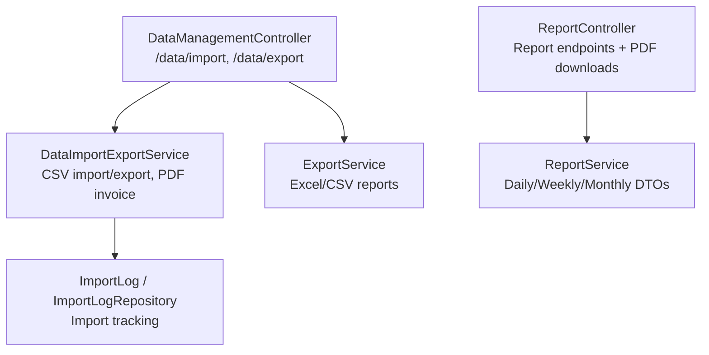
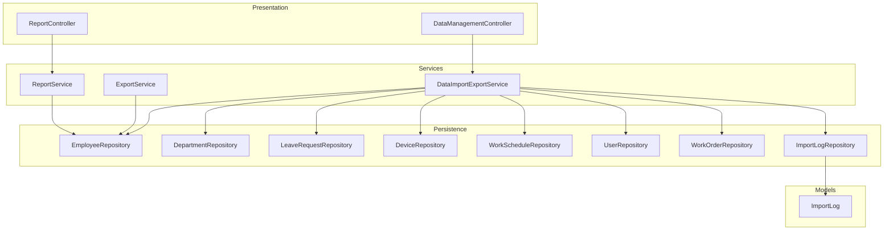
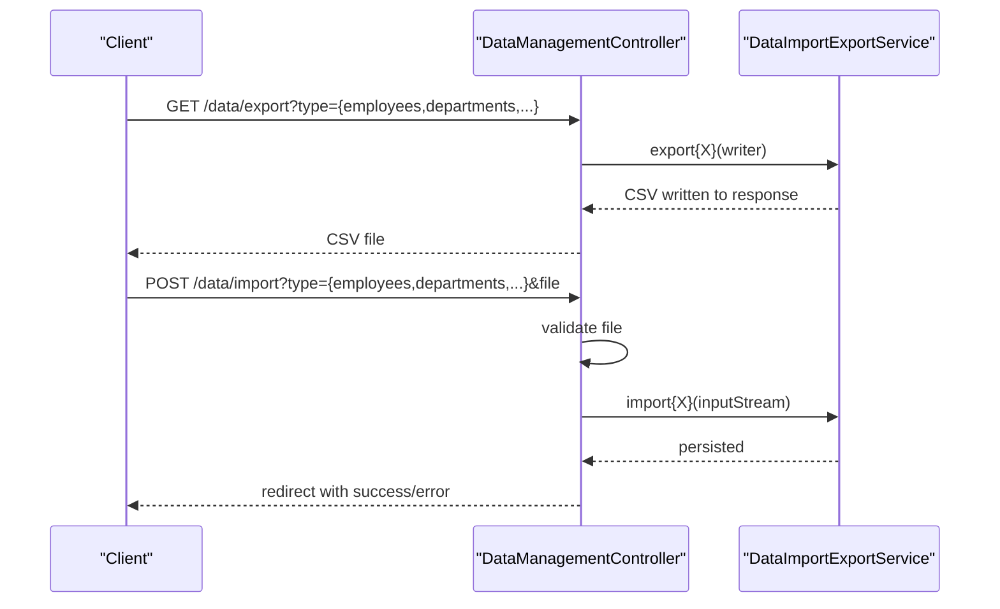
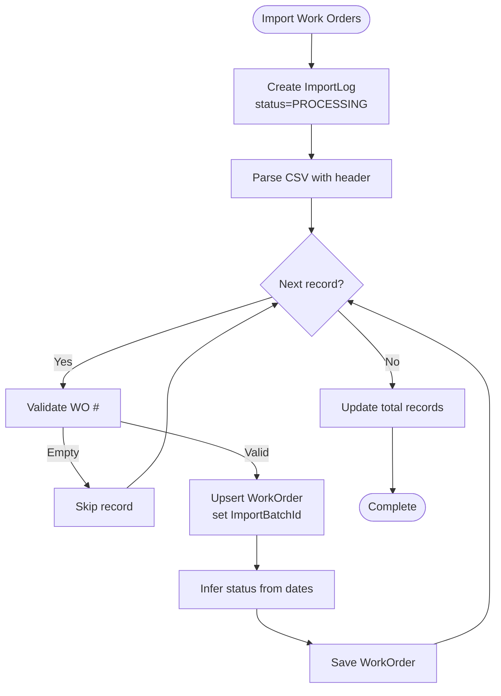
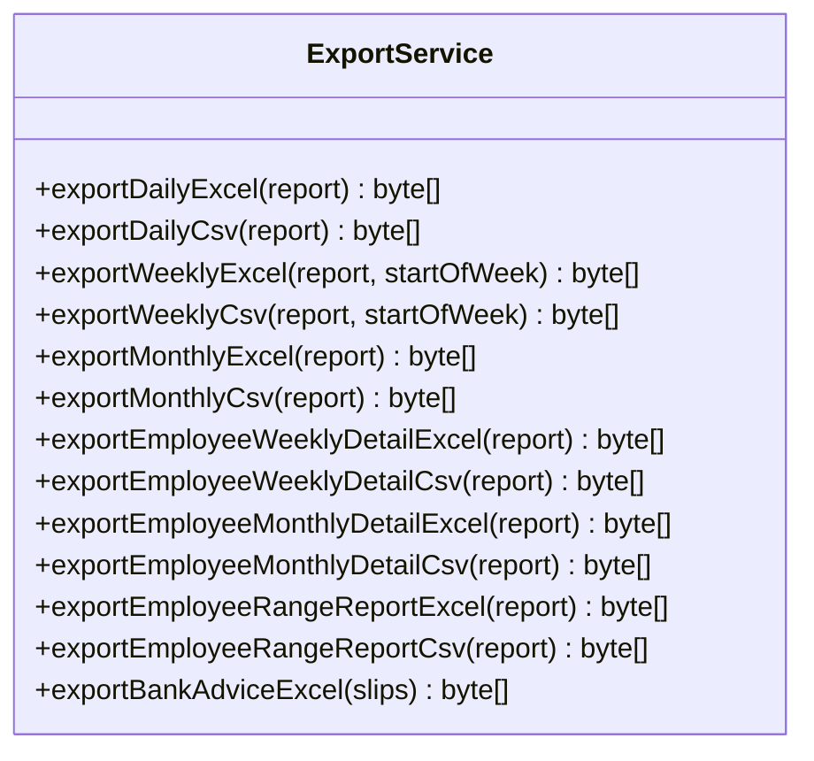
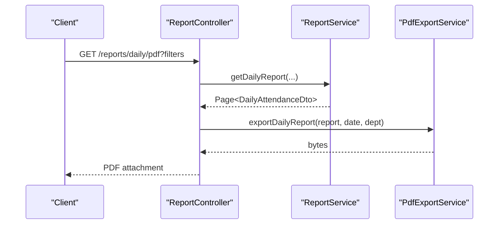
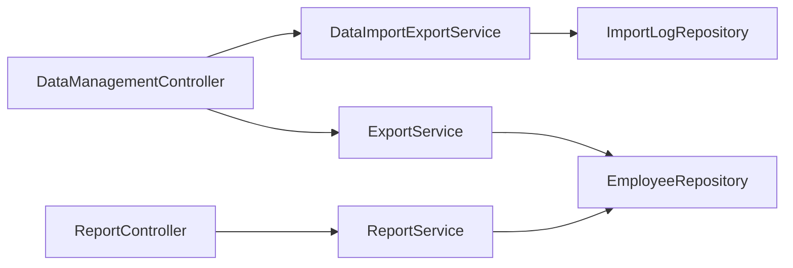

# Data Management

<cite>
**Referenced Files in This Document**
- [DataManagementController.java](file://src/main/java/root/cyb/mh/attendancesystem/controller/DataManagementController.java)
- [DataImportExportService.java](file://src/main/java/root/cyb/mh/attendancesystem/service/DataImportExportService.java)
- [ExportService.java](file://src/main/java/root/cyb/mh/attendancesystem/service/ExportService.java)
- [ReportService.java](file://src/main/java/root/cyb/mh/attendancesystem/service/ReportService.java)
- [ReportController.java](file://src/main/java/root/cyb/mh/attendancesystem/controller/ReportController.java)
- [ImportLog.java](file://src/main/java/root/cyb/mh/attendancesystem/model/ImportLog.java)
- [ImportLogRepository.java](file://src/main/java/root/cyb/mh/attendancesystem/repository/ImportLogRepository.java)
- [invoice_report.csv](file://invoice_report.csv)
</cite>

## Table of Contents
1. [Introduction](#introduction)
2. [Project Structure](#project-structure)
3. [Core Components](#core-components)
4. [Architecture Overview](#architecture-overview)
5. [Detailed Component Analysis](#detailed-component-analysis)
6. [Dependency Analysis](#dependency-analysis)
7. [Performance Considerations](#performance-considerations)
8. [Troubleshooting Guide](#troubleshooting-guide)
9. [Conclusion](#conclusion)
10. [Appendices](#appendices)

## Introduction
This document describes the data management capabilities of the Skylink Custom Backend with a focus on CSV/Excel import/export, data validation, bulk operations, report generation, and data migration. It explains the processing workflows, validation mechanisms, error handling, and supported export formats. Practical examples illustrate import/export processes, report generation, bulk data operations, and integration with external systems. Guidance is also provided for data quality assurance, backup procedures, and data lifecycle management.

## Project Structure
The data management features are implemented across controllers, services, repositories, and models. The primary entry points for data operations are:
- Data import/export endpoints exposed via a dedicated controller
- Services orchestrating import/export logic and report generation
- Repositories for persistence and lookup
- Models representing import history and related entities

**Diagram sources**
- [DataManagementController.java:14-82](file://src/main/java/root/cyb/mh/attendancesystem/controller/DataManagementController.java#L14-L82)
- [DataImportExportService.java:16-925](file://src/main/java/root/cyb/mh/attendancesystem/service/DataImportExportService.java#L16-L925)
- [ExportService.java:22-579](file://src/main/java/root/cyb/mh/attendancesystem/service/ExportService.java#L22-L579)
- [ReportService.java:23-1185](file://src/main/java/root/cyb/mh/attendancesystem/service/ReportService.java#L23-L1185)
- [ReportController.java:14-754](file://src/main/java/root/cyb/mh/attendancesystem/controller/ReportController.java#L14-L754)
- [ImportLog.java](file://src/main/java/root/cyb/mh/attendancesystem/model/ImportLog.java)
- [ImportLogRepository.java](file://src/main/java/root/cyb/mh/attendancesystem/repository/ImportLogRepository.java)

**Section sources**
- [DataManagementController.java:14-82](file://src/main/java/root/cyb/mh/attendancesystem/controller/DataManagementController.java#L14-L82)
- [DataImportExportService.java:16-925](file://src/main/java/root/cyb/mh/attendancesystem/service/DataImportExportService.java#L16-L925)
- [ExportService.java:22-579](file://src/main/java/root/cyb/mh/attendancesystem/service/ExportService.java#L22-L579)
- [ReportService.java:23-1185](file://src/main/java/root/cyb/mh/attendancesystem/service/ReportService.java#L23-L1185)
- [ReportController.java:14-754](file://src/main/java/root/cyb/mh/attendancesystem/controller/ReportController.java#L14-L754)

## Core Components
- Data import/export controller: Exposes endpoints to export CSV datasets and import CSV files for multiple entities. It validates request parameters and delegates to the import/export service.
- Data import/export service: Implements CSV parsing and writing for employees, departments, leave requests, devices, settings, users, and payment requests. It supports CSV exports and PDF generation for payment requests and invoices. It tracks work order imports with an import log.
- Export service: Generates Excel and CSV reports for daily, weekly, monthly, and bank advice formats. It supports multiple sheets for range reports and configurable column selection.
- Report service: Produces DTOs for daily, weekly, and monthly attendance reports, integrating live work status and leave/holiday calendars.
- Report controller: Provides endpoints to render HTML reports and download PDFs for daily, weekly, and monthly views, including employee-specific reports.
- Import log model/repository: Captures metadata for import batches, including status and total records processed.

Key capabilities:
- CSV import/export for core entities
- Excel/CSV report generation
- PDF export for payment requests and invoices
- Bulk work order import with import logging
- Report filtering, sorting, and pagination

**Section sources**
- [DataManagementController.java:14-82](file://src/main/java/root/cyb/mh/attendancesystem/controller/DataManagementController.java#L14-L82)
- [DataImportExportService.java:16-925](file://src/main/java/root/cyb/mh/attendancesystem/service/DataImportExportService.java#L16-L925)
- [ExportService.java:22-579](file://src/main/java/root/cyb/mh/attendancesystem/service/ExportService.java#L22-L579)
- [ReportService.java:23-1185](file://src/main/java/root/cyb/mh/attendancesystem/service/ReportService.java#L23-L1185)
- [ReportController.java:14-754](file://src/main/java/root/cyb/mh/attendancesystem/controller/ReportController.java#L14-L754)
- [ImportLog.java](file://src/main/java/root/cyb/mh/attendancesystem/model/ImportLog.java)
- [ImportLogRepository.java](file://src/main/java/root/cyb/mh/attendancesystem/repository/ImportLogRepository.java)

## Architecture Overview
The data management architecture follows a layered pattern:
- Controllers handle HTTP requests and delegate to services
- Services encapsulate business logic for import/export and reporting
- Repositories manage persistence
- Models represent domain entities and import metadata

**Diagram sources**
- [DataManagementController.java:14-82](file://src/main/java/root/cyb/mh/attendancesystem/controller/DataManagementController.java#L14-L82)
- [DataImportExportService.java:16-925](file://src/main/java/root/cyb/mh/attendancesystem/service/DataImportExportService.java#L16-L925)
- [ExportService.java:22-579](file://src/main/java/root/cyb/mh/attendancesystem/service/ExportService.java#L22-L579)
- [ReportService.java:23-1185](file://src/main/java/root/cyb/mh/attendancesystem/service/ReportService.java#L23-L1185)
- [ReportController.java:14-754](file://src/main/java/root/cyb/mh/attendancesystem/controller/ReportController.java#L14-L754)
- [ImportLog.java](file://src/main/java/root/cyb/mh/attendancesystem/model/ImportLog.java)
- [ImportLogRepository.java](file://src/main/java/root/cyb/mh/attendancesystem/repository/ImportLogRepository.java)

## Detailed Component Analysis

### Data Import/Export Controller
Responsibilities:
- Export endpoint streams CSV for employees, departments, leaves, devices, settings, users, and payment requests
- Import endpoint accepts multipart files and routes to appropriate import handlers
- Validates empty file and unknown type scenarios

Processing logic:
- Export: Sets CSV content type and filename, dispatches to service based on type parameter
- Import: Validates file presence, routes to service handler, and redirects with success/error parameters

**Diagram sources**
- [DataManagementController.java:20-82](file://src/main/java/root/cyb/mh/attendancesystem/controller/DataManagementController.java#L20-L82)
- [DataImportExportService.java:40-209](file://src/main/java/root/cyb/mh/attendancesystem/service/DataImportExportService.java#L40-L209)

**Section sources**
- [DataManagementController.java:14-82](file://src/main/java/root/cyb/mh/attendancesystem/controller/DataManagementController.java#L14-L82)

### Data Import/Export Service
Capabilities:
- CSV export for employees, departments, leave requests, devices, work schedules, users
- CSV import for employees, departments, leave requests, devices, work schedules, users
- Payment request export to CSV/PDF with configurable columns
- Invoice PDF generation for payment requests
- Bulk work order import with import log creation and per-record processing

Validation and error handling:
- CSV parsing uses Apache Commons CSV with first-row-as-header
- Date/time parsing uses flexible formatters for work order import
- Missing optional fields are handled gracefully
- Import status tracked via ImportLog entity

**Diagram sources**
- [DataImportExportService.java:750-800](file://src/main/java/root/cyb/mh/attendancesystem/service/DataImportExportService.java#L750-L800)

**Section sources**
- [DataImportExportService.java:16-925](file://src/main/java/root/cyb/mh/attendancesystem/service/DataImportExportService.java#L16-L925)
- [ImportLog.java](file://src/main/java/root/cyb/mh/attendancesystem/model/ImportLog.java)
- [ImportLogRepository.java](file://src/main/java/root/cyb/mh/attendancesystem/repository/ImportLogRepository.java)

### Export Service
Capabilities:
- Daily, weekly, monthly attendance reports in Excel and CSV
- Employee weekly/monthly detail and range reports (multi-sheet Excel)
- Bank advice Excel export
- Configurable column selection for payment request exports

Processing logic:
- Builds Excel workbooks with styled headers and auto-sized columns
- Generates CSV with configured headers
- Formats durations and numeric values consistently

**Diagram sources**
- [ExportService.java:22-579](file://src/main/java/root/cyb/mh/attendancesystem/service/ExportService.java#L22-L579)

**Section sources**
- [ExportService.java:22-579](file://src/main/java/root/cyb/mh/attendancesystem/service/ExportService.java#L22-L579)

### Report Service and Controller
Capabilities:
- Daily report with filtering and pagination
- Weekly report with daily status grid and live work status integration
- Monthly summary with leave quota calculations
- Employee-specific weekly/monthly/range reports
- PDF downloads for daily, weekly, monthly, and employee reports

Processing logic:
- Resolves work schedules and applies weekend/holiday rules
- Integrates attendance logs and live work status
- Computes durations and counts for summaries

**Diagram sources**
- [ReportController.java:328-357](file://src/main/java/root/cyb/mh/attendancesystem/controller/ReportController.java#L328-L357)
- [ReportService.java:47-100](file://src/main/java/root/cyb/mh/attendancesystem/service/ReportService.java#L47-L100)

**Section sources**
- [ReportService.java:23-1185](file://src/main/java/root/cyb/mh/attendancesystem/service/ReportService.java#L23-L1185)
- [ReportController.java:14-754](file://src/main/java/root/cyb/mh/attendancesystem/controller/ReportController.java#L14-L754)

## Dependency Analysis
- Controllers depend on services for business operations
- Services depend on repositories for persistence
- Payment request exports depend on a predefined column mapping
- Work order import depends on ImportLog for batch tracking
- Report generation integrates attendance logs, live work status, and leave/holiday data

**Diagram sources**
- [DataManagementController.java:14-82](file://src/main/java/root/cyb/mh/attendancesystem/controller/DataManagementController.java#L14-L82)
- [DataImportExportService.java:16-925](file://src/main/java/root/cyb/mh/attendancesystem/service/DataImportExportService.java#L16-L925)
- [ExportService.java:22-579](file://src/main/java/root/cyb/mh/attendancesystem/service/ExportService.java#L22-L579)
- [ReportService.java:23-1185](file://src/main/java/root/cyb/mh/attendancesystem/service/ReportService.java#L23-L1185)
- [ReportController.java:14-754](file://src/main/java/root/cyb/mh/attendancesystem/controller/ReportController.java#L14-L754)
- [ImportLogRepository.java](file://src/main/java/root/cyb/mh/attendancesystem/repository/ImportLogRepository.java)

**Section sources**
- [DataManagementController.java:14-82](file://src/main/java/root/cyb/mh/attendancesystem/controller/DataManagementController.java#L14-L82)
- [DataImportExportService.java:16-925](file://src/main/java/root/cyb/mh/attendancesystem/service/DataImportExportService.java#L16-L925)
- [ExportService.java:22-579](file://src/main/java/root/cyb/mh/attendancesystem/service/ExportService.java#L22-L579)
- [ReportService.java:23-1185](file://src/main/java/root/cyb/mh/attendancesystem/service/ReportService.java#L23-L1185)
- [ReportController.java:14-754](file://src/main/java/root/cyb/mh/attendancesystem/controller/ReportController.java#L14-L754)
- [ImportLogRepository.java](file://src/main/java/root/cyb/mh/attendancesystem/repository/ImportLogRepository.java)

## Performance Considerations
- CSV parsing uses streaming with Apache Commons CSV; ensure large files are processed with appropriate timeouts and memory limits
- Report generation for PDFs uses iText; avoid exporting extremely large datasets in a single request
- Weekly/monthly reports iterate over logs and statuses; consider pagination and filtering to reduce payload sizes
- Work order import writes records incrementally; monitor database transaction boundaries and commit frequency

## Troubleshooting Guide
Common issues and resolutions:
- Empty file upload during import: The controller rejects empty files and redirects with an error parameter. Verify file selection and size.
- Unknown import type: Ensure the type parameter matches supported values; otherwise, the controller redirects with an error.
- CSV parse errors: Confirm the CSV has a header row and expected columns; optional fields should be present or handled gracefully by the service.
- Date parsing failures: Work order import supports multiple date formats; ensure dates are readable by the configured formatter.
- Import log not found: Verify ImportLogRepository is initialized and accessible; confirm transaction boundaries for import operations.

**Section sources**
- [DataManagementController.java:49-82](file://src/main/java/root/cyb/mh/attendancesystem/controller/DataManagementController.java#L49-L82)
- [DataImportExportService.java:750-800](file://src/main/java/root/cyb/mh/attendancesystem/service/DataImportExportService.java#L750-L800)

## Conclusion
The Skylink Custom Backend provides robust data management capabilities centered around CSV/Excel import/export, comprehensive report generation, and bulk operations with import logging. The modular design separates concerns across controllers, services, and repositories, enabling maintainable and extensible data workflows. By following the validation and error-handling patterns outlined here, teams can reliably integrate external systems and ensure data quality.

## Appendices

### Supported Import Types
- employees
- departments
- leaves
- devices
- settings
- users
- workorders

**Section sources**
- [DataManagementController.java:55-76](file://src/main/java/root/cyb/mh/attendancesystem/controller/DataManagementController.java#L55-L76)
- [DataImportExportService.java:96-209](file://src/main/java/root/cyb/mh/attendancesystem/service/DataImportExportService.java#L96-L209)

### Supported Export Types
- employees
- departments
- leaves
- devices
- settings
- users
- payment requests (CSV/PDF)
- invoices (PDF)

**Section sources**
- [DataManagementController.java:25-46](file://src/main/java/root/cyb/mh/attendancesystem/controller/DataManagementController.java#L25-L46)
- [DataImportExportService.java:40-92](file://src/main/java/root/cyb/mh/attendancesystem/service/DataImportExportService.java#L40-L92)

### Report Formats and Endpoints
- Daily report (HTML): GET /reports
- Weekly report (HTML): GET /reports/weekly
- Monthly report (HTML): GET /reports/monthly
- Employee weekly report (HTML): GET /reports/weekly/{employeeId}
- Employee monthly report (HTML): GET /reports/monthly/{employeeId}
- PDF downloads:
  - Daily: GET /reports/daily/pdf
  - Weekly: GET /reports/weekly/pdf
  - Monthly: GET /reports/monthly/pdf
  - Employee monthly: GET /reports/monthly/{employeeId}/pdf

**Section sources**
- [ReportController.java:23-425](file://src/main/java/root/cyb/mh/attendancesystem/controller/ReportController.java#L23-L425)

### Example Files
- Sample invoice CSV for testing: [invoice_report.csv](file://invoice_report.csv)

**Section sources**
- [invoice_report.csv](file://invoice_report.csv)