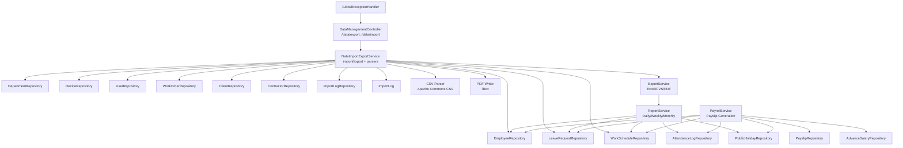
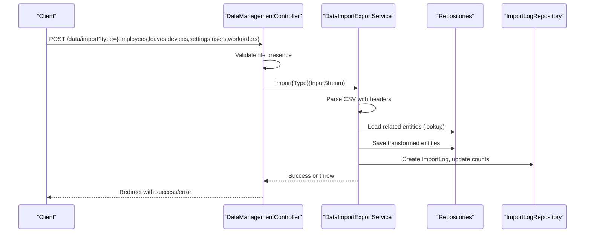
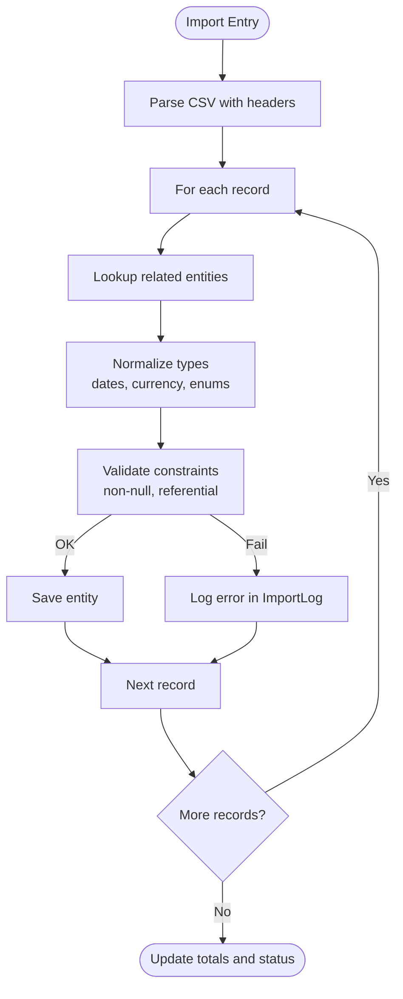
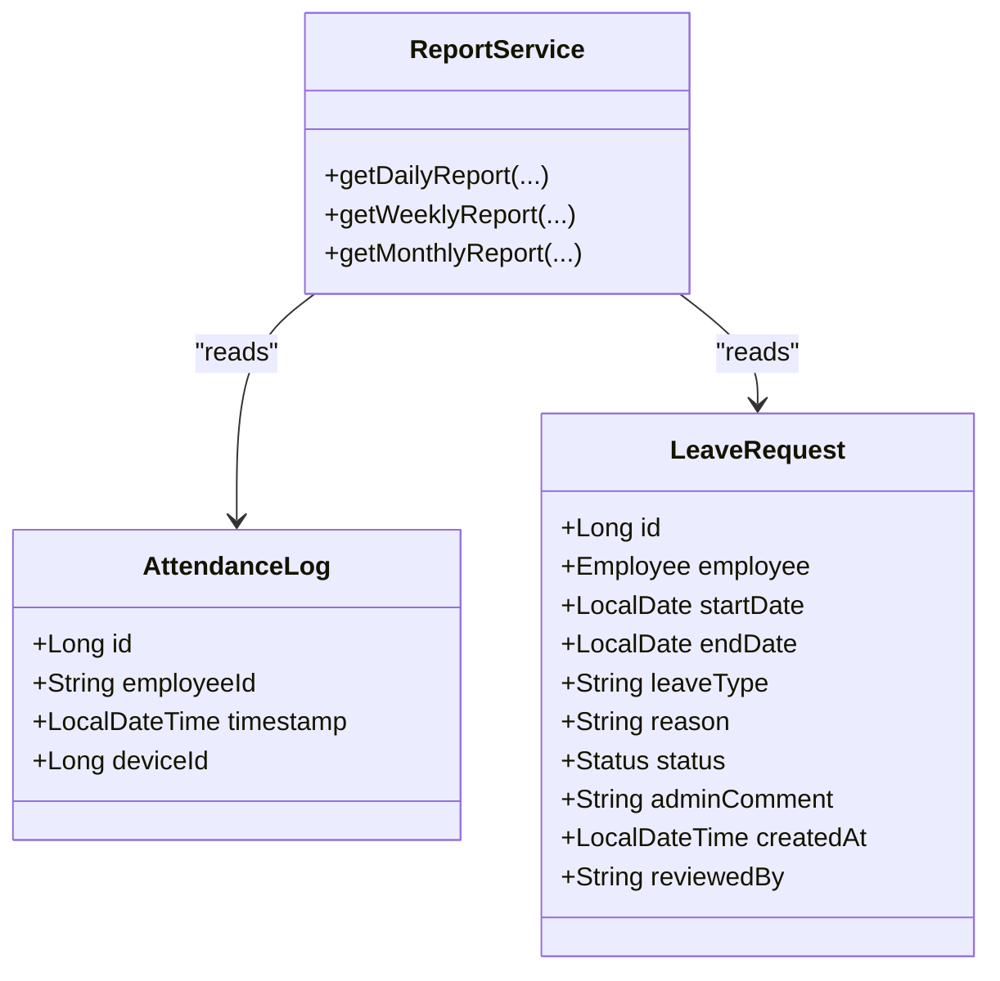
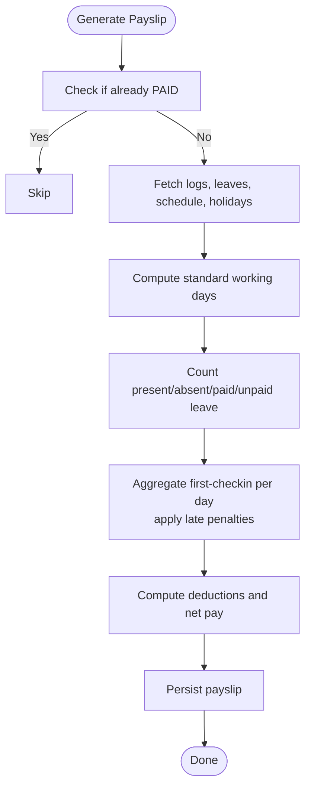
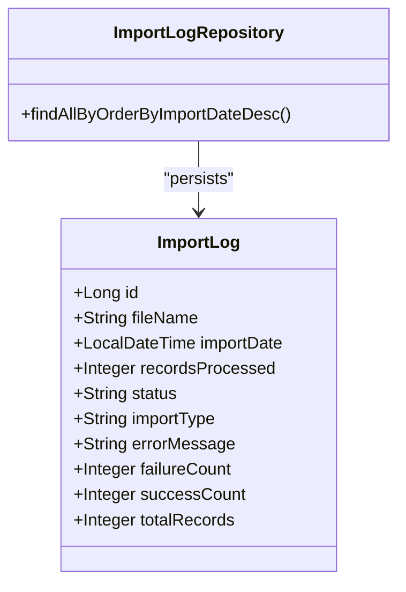
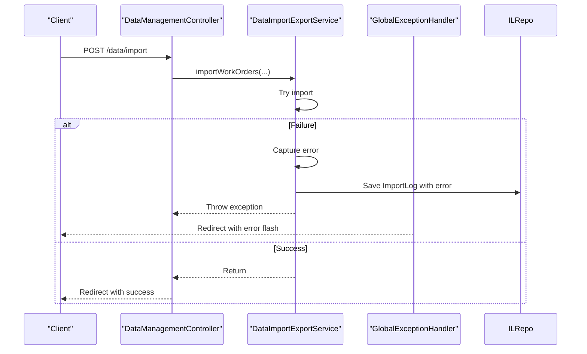
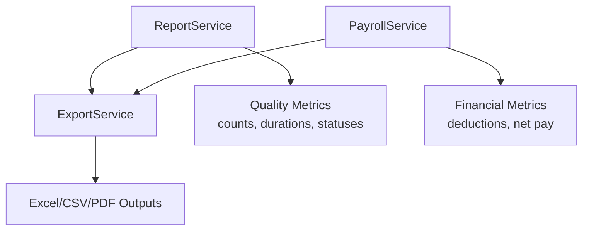
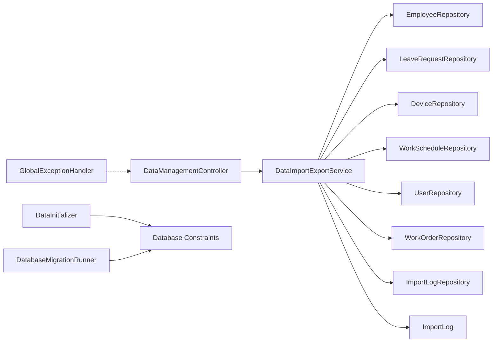

# Data Validation & Quality Assurance

<cite>
**Referenced Files in This Document**
- [DataImportExportService.java](file://src/main/java/root/cyb/mh/attendancesystem/service/DataImportExportService.java)
- [DataManagementController.java](file://src/main/java/root/cyb/mh/attendancesystem/controller/DataManagementController.java)
- [ImportLog.java](file://src/main/java/root/cyb/mh/attendancesystem/model/ImportLog.java)
- [ImportLogRepository.java](file://src/main/java/root/cyb/mh/attendancesystem/repository/ImportLogRepository.java)
- [GlobalExceptionHandler.java](file://src/main/java/root/cyb/mh/attendancesystem/exception/GlobalExceptionHandler.java)
- [ResourceNotFoundException.java](file://src/main/java/root/cyb/mh/attendancesystem/exception/ResourceNotFoundException.java)
- [Employee.java](file://src/main/java/root/cyb/mh/attendancesystem/model/Employee.java)
- [LeaveRequest.java](file://src/main/java/root/cyb/mh/attendancesystem/model/LeaveRequest.java)
- [AttendanceLog.java](file://src/main/java/root/cyb/mh/attendancesystem/model/AttendanceLog.java)
- [PayrollService.java](file://src/main/java/root/cyb/mh/attendancesystem/service/PayrollService.java)
- [ReportService.java](file://src/main/java/root/cyb/mh/attendancesystem/service/ReportService.java)
- [ExportService.java](file://src/main/java/root/cyb/mh/attendancesystem/service/ExportService.java)
- [DataInitializer.java](file://src/main/java/root/cyb/mh/attendancesystem/config/DataInitializer.java)
- [DatabaseMigrationRunner.java](file://src/main/java/root/cyb/mh/attendancesystem/config/DatabaseMigrationRunner.java)
</cite>

## Table of Contents
1. [Introduction](#introduction)
2. [Project Structure](#project-structure)
3. [Core Components](#core-components)
4. [Architecture Overview](#architecture-overview)
5. [Detailed Component Analysis](#detailed-component-analysis)
6. [Dependency Analysis](#dependency-analysis)
7. [Performance Considerations](#performance-considerations)
8. [Troubleshooting Guide](#troubleshooting-guide)
9. [Conclusion](#conclusion)
10. [Appendices](#appendices)

## Introduction
This document describes the data validation and quality assurance mechanisms in Skylink Custom Backend. It focuses on validation rules applied during data import, transformation processes, error detection and handling, and data quality checks. It also explains validation logic for different data types (employee records, attendance logs, leave requests, etc.), constraint checking, duplicate detection, referential integrity validation, and audit trail generation. Practical examples, error reporting, correction workflows, and integration with import/export processes are included, along with performance optimization strategies and automated reporting capabilities.

## Project Structure
The validation and QA surface spans several layers:
- Controllers expose endpoints for import/export and delegate to services.
- Services encapsulate parsing, transformation, validation, and persistence logic.
- Models define domain entities and constraints.
- Repositories provide persistence access.
- Exception handlers centralize error messaging.
- Audit/logging is captured via import logs.

**Diagram sources**
- [DataManagementController.java:13-84](file://src/main/java/root/cyb/mh/attendancesystem/controller/DataManagementController.java#L13-L84)
- [DataImportExportService.java:16-37](file://src/main/java/root/cyb/mh/attendancesystem/service/DataImportExportService.java#L16-L37)
- [ImportLog.java:6-31](file://src/main/java/root/cyb/mh/attendancesystem/model/ImportLog.java#L6-L31)
- [ImportLogRepository.java:7-9](file://src/main/java/root/cyb/mh/attendancesystem/repository/ImportLogRepository.java#L7-L9)
- [ExportService.java:22-579](file://src/main/java/root/cyb/mh/attendancesystem/service/ExportService.java#L22-L579)
- [ReportService.java:23-800](file://src/main/java/root/cyb/mh/attendancesystem/service/ReportService.java#L23-L800)
- [PayrollService.java:15-318](file://src/main/java/root/cyb/mh/attendancesystem/service/PayrollService.java#L15-L318)

**Section sources**
- [DataManagementController.java:13-84](file://src/main/java/root/cyb/mh/attendancesystem/controller/DataManagementController.java#L13-L84)
- [DataImportExportService.java:16-37](file://src/main/java/root/cyb/mh/attendancesystem/service/DataImportExportService.java#L16-L37)

## Core Components
- DataImportExportService: Implements import/export for multiple data types, CSV parsing, date and currency normalization, and import logging.
- DataManagementController: Exposes endpoints for CSV export and import, validates file presence and type.
- ImportLog and ImportLogRepository: Persist import metadata, counts, and error messages for audit and reporting.
- GlobalExceptionHandler: Centralized handling for upload size limits and flash error messages.
- Domain models: Employee, LeaveRequest, AttendanceLog define structural constraints and relationships.
- ReportService and ExportService: Generate quality metrics and standardized exports.
- PayrollService: Applies business rules to validate and compute payroll outcomes.
- DataInitializer and DatabaseMigrationRunner: Enforce schema and constraints at startup.

**Section sources**
- [DataImportExportService.java:16-925](file://src/main/java/root/cyb/mh/attendancesystem/service/DataImportExportService.java#L16-L925)
- [DataManagementController.java:13-84](file://src/main/java/root/cyb/mh/attendancesystem/controller/DataManagementController.java#L13-L84)
- [ImportLog.java:6-113](file://src/main/java/root/cyb/mh/attendancesystem/model/ImportLog.java#L6-L113)
- [ImportLogRepository.java:7-9](file://src/main/java/root/cyb/mh/attendancesystem/repository/ImportLogRepository.java#L7-L9)
- [GlobalExceptionHandler.java:9-26](file://src/main/java/root/cyb/mh/attendancesystem/exception/GlobalExceptionHandler.java#L9-L26)
- [Employee.java:13-64](file://src/main/java/root/cyb/mh/attendancesystem/model/Employee.java#L13-L64)
- [LeaveRequest.java:11-54](file://src/main/java/root/cyb/mh/attendancesystem/model/LeaveRequest.java#L11-L54)
- [AttendanceLog.java:13-27](file://src/main/java/root/cyb/mh/attendancesystem/model/AttendanceLog.java#L13-L27)
- [ReportService.java:23-800](file://src/main/java/root/cyb/mh/attendancesystem/service/ReportService.java#L23-L800)
- [ExportService.java:22-579](file://src/main/java/root/cyb/mh/attendancesystem/service/ExportService.java#L22-L579)
- [PayrollService.java:15-318](file://src/main/java/root/cyb/mh/attendancesystem/service/PayrollService.java#L15-L318)
- [DataInitializer.java:12-122](file://src/main/java/root/cyb/mh/attendancesystem/config/DataInitializer.java#L12-L122)
- [DatabaseMigrationRunner.java:8-43](file://src/main/java/root/cyb/mh/attendancesystem/config/DatabaseMigrationRunner.java#L8-L43)

## Architecture Overview
The validation pipeline integrates parsing, transformation, and persistence with explicit audit logging. Import endpoints trigger DataImportExportService, which parses CSV records, applies type-specific transformations, persists entities, and updates ImportLog. Errors are caught and logged centrally, while successful imports update counters and status.

**Diagram sources**
- [DataManagementController.java:49-82](file://src/main/java/root/cyb/mh/attendancesystem/controller/DataManagementController.java#L49-L82)
- [DataImportExportService.java:96-209](file://src/main/java/root/cyb/mh/attendancesystem/service/DataImportExportService.java#L96-L209)
- [ImportLogRepository.java:7-9](file://src/main/java/root/cyb/mh/attendancesystem/repository/ImportLogRepository.java#L7-L9)

## Detailed Component Analysis

### Data Import Pipeline and Validation Rules
- CSV Parsing: Uses Apache Commons CSV with first-row-as-header mode. Missing headers are tolerated by checking mapped fields before access.
- Type Normalization:
  - Dates: Robust parser with multiple patterns and whitespace cleanup; returns null on parse failure.
  - Currency: Removes currency symbols and commas; defaults to zero on parse failure.
  - Percentages: Placeholder method indicates extensibility for numeric normalization.
- Referential Integrity:
  - Employee ID and Department ID are validated via repository lookups before assignment.
  - LeaveRequest links to Employee via foreign key; status defaults to a safe value if missing.
- Duplicate Detection:
  - WorkOrder deduplication uses a unique identifier and sets an import batch ID for grouping.
  - Users are updated by username; new users receive a default temporary password.
- Constraint Checking:
  - Models enforce non-null fields at persistence level (e.g., LeaveRequest date fields and employee relationship).
  - Database-level constraints enforced via migrations and initializers.

**Diagram sources**
- [DataImportExportService.java:96-209](file://src/main/java/root/cyb/mh/attendancesystem/service/DataImportExportService.java#L96-L209)
- [LeaveRequest.java:21-37](file://src/main/java/root/cyb/mh/attendancesystem/model/LeaveRequest.java#L21-L37)
- [Employee.java:22-26](file://src/main/java/root/cyb/mh/attendancesystem/model/Employee.java#L22-L26)

**Section sources**
- [DataImportExportService.java:886-915](file://src/main/java/root/cyb/mh/attendancesystem/service/DataImportExportService.java#L886-L915)
- [LeaveRequest.java:21-37](file://src/main/java/root/cyb/mh/attendancesystem/model/LeaveRequest.java#L21-L37)
- [Employee.java:22-26](file://src/main/java/root/cyb/mh/attendancesystem/model/Employee.java#L22-L26)

### Attendance and Leave Validation
- AttendanceLog: Stores employee punch timestamps with device linkage; supports downstream validation for timing anomalies.
- LeaveRequest: Enforces non-null start/end dates and an enumerated status with a default value. Comments and audit fields support quality review.
- ReportService: Computes daily/weekly/monthly statuses using schedules, holidays, and approved leaves. It flags late/early entries and absent periods, integrating live work status for richer quality signals.

**Diagram sources**
- [AttendanceLog.java:13-27](file://src/main/java/root/cyb/mh/attendancesystem/model/AttendanceLog.java#L13-L27)
- [LeaveRequest.java:11-54](file://src/main/java/root/cyb/mh/attendancesystem/model/LeaveRequest.java#L11-L54)
- [ReportService.java:47-100](file://src/main/java/root/cyb/mh/attendancesystem/service/ReportService.java#L47-L100)

**Section sources**
- [ReportService.java:108-283](file://src/main/java/root/cyb/mh/attendancesystem/service/ReportService.java#L108-L283)
- [LeaveRequest.java:21-37](file://src/main/java/root/cyb/mh/attendancesystem/model/LeaveRequest.java#L21-L37)
- [AttendanceLog.java:19-26](file://src/main/java/root/cyb/mh/attendancesystem/model/AttendanceLog.java#L19-L26)

### Payroll Validation and Quality Checks
- PayrollService enforces:
  - Skip guests and future joiners.
  - Prevent re-generation of paid payslips.
  - Compute working days against weekend/holiday lists.
  - Classify present/absent/paid/unpaid leave by approved leave ranges.
  - Penalize late entries based on tolerance thresholds and configured penalty rules.
- These rules act as quality gates ensuring accurate compensation computation.

**Diagram sources**
- [PayrollService.java:39-290](file://src/main/java/root/cyb/mh/attendancesystem/service/PayrollService.java#L39-L290)

**Section sources**
- [PayrollService.java:94-290](file://src/main/java/root/cyb/mh/attendancesystem/service/PayrollService.java#L94-L290)

### Import Logging and Audit Trail
- ImportLog captures import metadata, total records, success/failure counts, and error messages. It enables post-import auditing and reporting.
- DataImportExportService creates an ImportLog at the start of work order imports and updates counts and status progressively.

**Diagram sources**
- [ImportLog.java:6-113](file://src/main/java/root/cyb/mh/attendancesystem/model/ImportLog.java#L6-L113)
- [ImportLogRepository.java:7-9](file://src/main/java/root/cyb/mh/attendancesystem/repository/ImportLogRepository.java#L7-L9)
- [DataImportExportService.java:750-785](file://src/main/java/root/cyb/mh/attendancesystem/service/DataImportExportService.java#L750-L785)

**Section sources**
- [ImportLog.java:10-111](file://src/main/java/root/cyb/mh/attendancesystem/model/ImportLog.java#L10-L111)
- [ImportLogRepository.java:7-9](file://src/main/java/root/cyb/mh/attendancesystem/repository/ImportLogRepository.java#L7-L9)
- [DataImportExportService.java:750-884](file://src/main/java/root/cyb/mh/attendancesystem/service/DataImportExportService.java#L750-L884)

### Error Handling and Reporting
- GlobalExceptionHandler handles file size limit exceeded errors and redirects with a flash message.
- DataImportExportService writes exceptions to ImportLog and rethrows to ensure visibility.
- DataManagementController redirects with success/error parameters for UI feedback.

**Diagram sources**
- [DataManagementController.java:49-82](file://src/main/java/root/cyb/mh/attendancesystem/controller/DataManagementController.java#L49-L82)
- [DataImportExportService.java:750-884](file://src/main/java/root/cyb/mh/attendancesystem/service/DataImportExportService.java#L750-L884)
- [GlobalExceptionHandler.java:12-25](file://src/main/java/root/cyb/mh/attendancesystem/exception/GlobalExceptionHandler.java#L12-L25)

**Section sources**
- [GlobalExceptionHandler.java:9-26](file://src/main/java/root/cyb/mh/attendancesystem/exception/GlobalExceptionHandler.java#L9-L26)
- [DataManagementController.java:49-82](file://src/main/java/root/cyb/mh/attendancesystem/controller/DataManagementController.java#L49-L82)
- [DataImportExportService.java:880-884](file://src/main/java/root/cyb/mh/attendancesystem/service/DataImportExportService.java#L880-L884)

### Data Profiling, Metrics, and Automated Reporting
- ExportService generates standardized exports (Excel/CSV/PDF) for reports, enabling cross-platform quality checks and distribution.
- ReportService computes daily/weekly/monthly metrics including present/absent/late/early/leave counts, active work durations, and break times.
- PayrollService produces financial summaries and penalty metrics suitable for audits.

**Diagram sources**
- [ExportService.java:22-579](file://src/main/java/root/cyb/mh/attendancesystem/service/ExportService.java#L22-L579)
- [ReportService.java:47-100](file://src/main/java/root/cyb/mh/attendancesystem/service/ReportService.java#L47-L100)
- [PayrollService.java:94-290](file://src/main/java/root/cyb/mh/attendancesystem/service/PayrollService.java#L94-L290)

**Section sources**
- [ExportService.java:27-579](file://src/main/java/root/cyb/mh/attendancesystem/service/ExportService.java#L27-L579)
- [ReportService.java:108-511](file://src/main/java/root/cyb/mh/attendancesystem/service/ReportService.java#L108-L511)
- [PayrollService.java:94-290](file://src/main/java/root/cyb/mh/attendancesystem/service/PayrollService.java#L94-L290)

## Dependency Analysis
- Controllers depend on services for orchestration.
- Services depend on repositories for persistence and on models for structure.
- ImportLog ties import operations to audit and reporting.
- Exception handling is centralized to avoid duplication.
- Database constraints and schema fixes are applied at startup to maintain integrity.

**Diagram sources**
- [DataManagementController.java:13-84](file://src/main/java/root/cyb/mh/attendancesystem/controller/DataManagementController.java#L13-L84)
- [DataImportExportService.java:16-37](file://src/main/java/root/cyb/mh/attendancesystem/service/DataImportExportService.java#L16-L37)
- [ImportLog.java:6-31](file://src/main/java/root/cyb/mh/attendancesystem/model/ImportLog.java#L6-L31)
- [GlobalExceptionHandler.java:9-26](file://src/main/java/root/cyb/mh/attendancesystem/exception/GlobalExceptionHandler.java#L9-L26)
- [DataInitializer.java:12-122](file://src/main/java/root/cyb/mh/attendancesystem/config/DataInitializer.java#L12-L122)
- [DatabaseMigrationRunner.java:8-43](file://src/main/java/root/cyb/mh/attendancesystem/config/DatabaseMigrationRunner.java#L8-L43)

**Section sources**
- [DataManagementController.java:13-84](file://src/main/java/root/cyb/mh/attendancesystem/controller/DataManagementController.java#L13-L84)
- [DataImportExportService.java:16-37](file://src/main/java/root/cyb/mh/attendancesystem/service/DataImportExportService.java#L16-L37)
- [ImportLog.java:6-31](file://src/main/java/root/cyb/mh/attendancesystem/model/ImportLog.java#L6-L31)
- [GlobalExceptionHandler.java:9-26](file://src/main/java/root/cyb/mh/attendancesystem/exception/GlobalExceptionHandler.java#L9-L26)
- [DataInitializer.java:12-122](file://src/main/java/root/cyb/mh/attendancesystem/config/DataInitializer.java#L12-L122)
- [DatabaseMigrationRunner.java:8-43](file://src/main/java/root/cyb/mh/attendancesystem/config/DatabaseMigrationRunner.java#L8-L43)

## Performance Considerations
- Bulk Fetching: ReportService and PayrollService pre-fetch data for a period to minimize repeated queries.
- Grouping and Aggregation: PayrollService groups attendance logs by date to compute first check-ins efficiently.
- Lazy Evaluation: Repository methods are used to filter and stream results, reducing memory overhead.
- CSV Parsing: Using header-first parsing avoids ad-hoc mapping and reduces runtime checks.
- PDF Generation: ExportService batches table cells and uses fixed widths to optimize rendering.

[No sources needed since this section provides general guidance]

## Troubleshooting Guide
Common issues and resolutions:
- Upload Size Exceeded: GlobalExceptionHandler redirects with a flash message; reduce file size or adjust server limits.
- Empty File Upload: Controller redirects with an error parameter; ensure a file is selected.
- Import Failures: Verify CSV headers match expected fields; check date formats and currency formatting; inspect ImportLog for error messages.
- Referential Integrity Errors: Confirm related entities exist (e.g., Employee exists before linking LeaveRequest).
- Schema Constraints: DatabaseMigrationRunner ensures status constraints are applied; re-run if missing.

**Section sources**
- [GlobalExceptionHandler.java:12-25](file://src/main/java/root/cyb/mh/attendancesystem/exception/GlobalExceptionHandler.java#L12-L25)
- [DataManagementController.java:49-82](file://src/main/java/root/cyb/mh/attendancesystem/controller/DataManagementController.java#L49-L82)
- [DataImportExportService.java:750-884](file://src/main/java/root/cyb/mh/attendancesystem/service/DataImportExportService.java#L750-L884)
- [DatabaseMigrationRunner.java:33-37](file://src/main/java/root/cyb/mh/attendancesystem/config/DatabaseMigrationRunner.java#L33-L37)

## Conclusion
Skylink Custom Backend implements a layered validation and QA strategy centered on CSV import/export, robust parsing with normalization, referential integrity enforcement, and comprehensive audit logging. Business rules for payroll and reporting ensure high-quality outputs, while centralized exception handling and export services facilitate automated reporting and distribution. Startup-time migrations and initializers maintain schema integrity, supporting reliable data operations.

[No sources needed since this section summarizes without analyzing specific files]

## Appendices

### Validation Scenarios and Examples
- Employee Import: Validates ID existence, optional Department linkage, and optional CardID; saves or updates Employee.
- Leave Request Import: Links to Employee, parses dates, infers Status if missing, and persists.
- Device Import: Parses IP/port/serial; updates existing or inserts new Device.
- Settings Import: Reads schedule fields and persists WorkSchedule.
- Users Import: Updates by Username; assigns default temporary password for new users.
- Work Orders Import: Deduplicates by unique identifier, sets Import Batch ID, and infers status from Sent/Client Paid fields; logs progress and errors.

**Section sources**
- [DataImportExportService.java:96-209](file://src/main/java/root/cyb/mh/attendancesystem/service/DataImportExportService.java#L96-L209)
- [DataImportExportService.java:750-884](file://src/main/java/root/cyb/mh/attendancesystem/service/DataImportExportService.java#L750-L884)

### Data Types and Constraints
- Employee: Non-empty ID, optional Department, optional card ID, optional roles and personal details.
- LeaveRequest: Non-null start/end dates, enumerated Status with default, optional reason/comment.
- AttendanceLog: Employee reference, timestamp, optional device linkage.
- ImportLog: Tracks import lifecycle, counts, and error messages.

**Section sources**
- [Employee.java:15-62](file://src/main/java/root/cyb/mh/attendancesystem/model/Employee.java#L15-L62)
- [LeaveRequest.java:21-52](file://src/main/java/root/cyb/mh/attendancesystem/model/LeaveRequest.java#L21-L52)
- [AttendanceLog.java:19-26](file://src/main/java/root/cyb/mh/attendancesystem/model/AttendanceLog.java#L19-L26)
- [ImportLog.java:10-111](file://src/main/java/root/cyb/mh/attendancesystem/model/ImportLog.java#L10-L111)

### Batch Validation Strategies
- Pre-parse CSV to detect header mismatches and malformed rows.
- Use repository lookups to validate foreign keys before saving.
- Group records by batch ID for work orders to enable partial retries and audit.
- Stream results in reports/payroll to avoid memory pressure.

**Section sources**
- [DataImportExportService.java:750-884](file://src/main/java/root/cyb/mh/attendancesystem/service/DataImportExportService.java#L750-L884)
- [ReportService.java:108-283](file://src/main/java/root/cyb/mh/attendancesystem/service/ReportService.java#L108-L283)
- [PayrollService.java:51-92](file://src/main/java/root/cyb/mh/attendancesystem/service/PayrollService.java#L51-L92)

### Integration with Import/Export Processes
- DataManagementController delegates to DataImportExportService for CSV operations.
- ExportService complements imports by providing standardized outputs for verification and distribution.
- ReportService consumes AttendanceLog and LeaveRequest to produce quality metrics.

**Section sources**
- [DataManagementController.java:20-82](file://src/main/java/root/cyb/mh/attendancesystem/controller/DataManagementController.java#L20-L82)
- [ExportService.java:27-579](file://src/main/java/root/cyb/mh/attendancesystem/service/ExportService.java#L27-L579)
- [ReportService.java:47-100](file://src/main/java/root/cyb/mh/attendancesystem/service/ReportService.java#L47-L100)