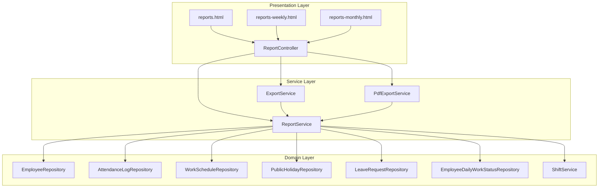
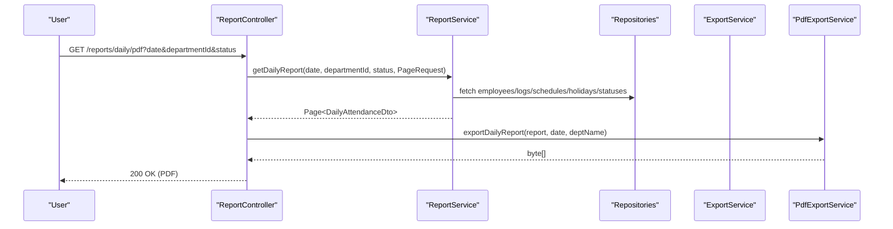
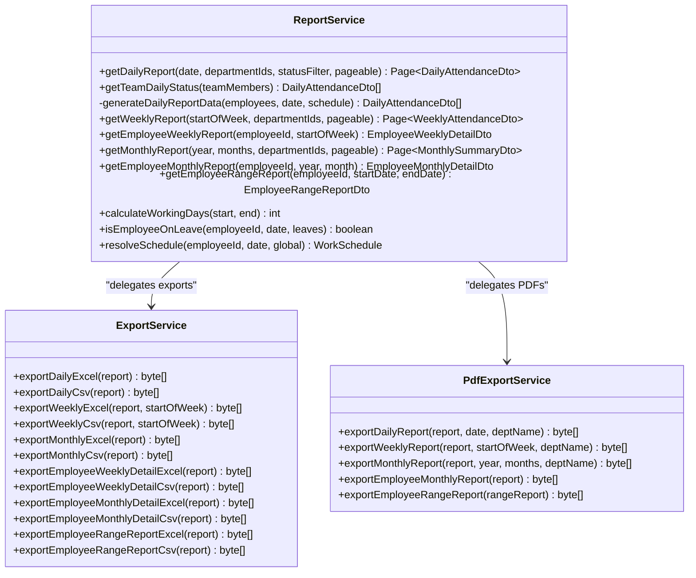
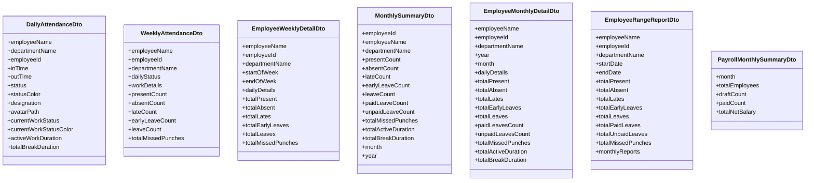
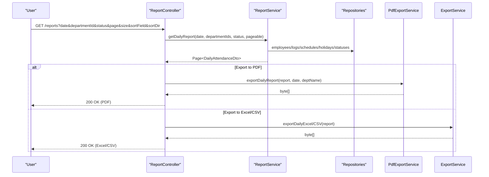
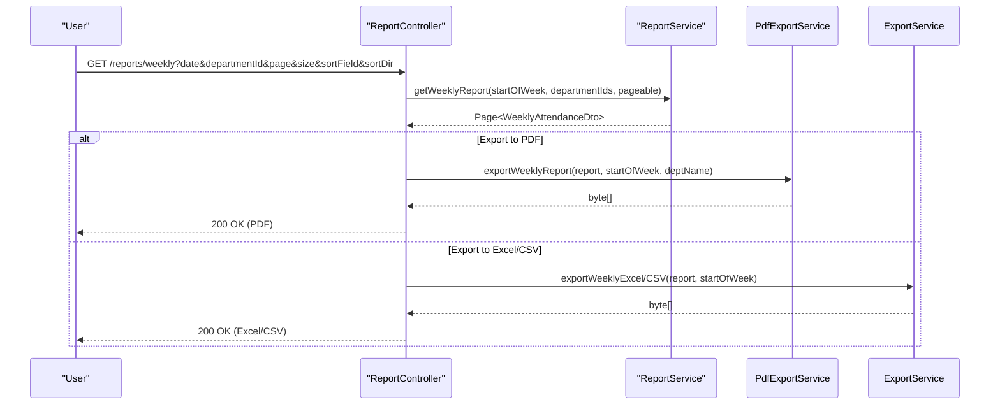
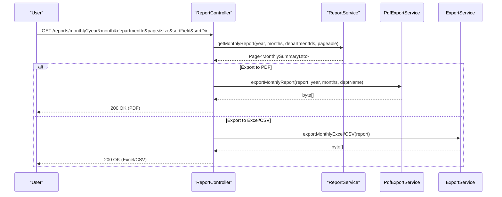
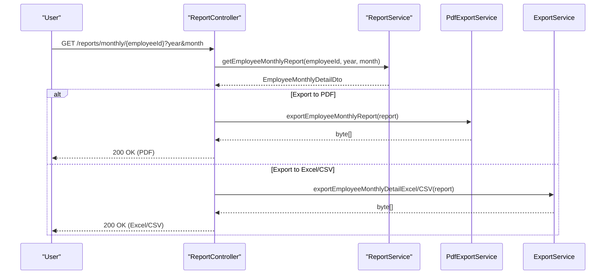
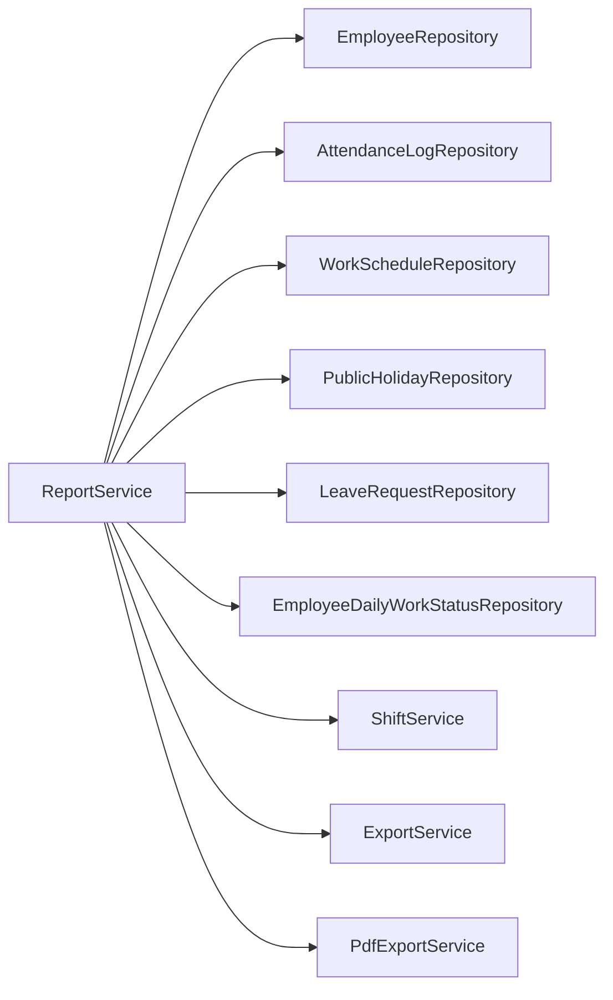

# Report Generation

<cite>
**Referenced Files in This Document**
- [ReportService.java](file://src/main/java/root/cyb/mh/attendancesystem/service/ReportService.java)
- [ReportController.java](file://src/main/java/root/cyb/mh/attendancesystem/controller/ReportController.java)
- [ExportService.java](file://src/main/java/root/cyb/mh/attendancesystem/service/ExportService.java)
- [PdfExportService.java](file://src/main/java/root/cyb/mh/attendancesystem/service/PdfExportService.java)
- [DailyAttendanceDto.java](file://src/main/java/root/cyb/mh/attendancesystem/dto/DailyAttendanceDto.java)
- [WeeklyAttendanceDto.java](file://src/main/java/root/cyb/mh/attendancesystem/dto/WeeklyAttendanceDto.java)
- [EmployeeWeeklyDetailDto.java](file://src/main/java/root/cyb/mh/attendancesystem/dto/EmployeeWeeklyDetailDto.java)
- [MonthlySummaryDto.java](file://src/main/java/root/cyb/mh/attendancesystem/dto/MonthlySummaryDto.java)
- [EmployeeMonthlyDetailDto.java](file://src/main/java/root/cyb/mh/attendancesystem/dto/EmployeeMonthlyDetailDto.java)
- [EmployeeRangeReportDto.java](file://src/main/java/root/cyb/mh/attendancesystem/dto/EmployeeRangeReportDto.java)
- [PayrollMonthlySummaryDto.java](file://src/main/java/root/cyb/mh/attendancesystem/dto/PayrollMonthlySummaryDto.java)
- [reports.html](file://src/main/resources/templates/reports.html)
- [reports-weekly.html](file://src/main/resources/templates/reports-weekly.html)
- [reports-monthly.html](file://src/main/resources/templates/reports-monthly.html)
</cite>

## Table of Contents
1. [Introduction](#introduction)
2. [Project Structure](#project-structure)
3. [Core Components](#core-components)
4. [Architecture Overview](#architecture-overview)
5. [Detailed Component Analysis](#detailed-component-analysis)
6. [Dependency Analysis](#dependency-analysis)
7. [Performance Considerations](#performance-considerations)
8. [Troubleshooting Guide](#troubleshooting-guide)
9. [Conclusion](#conclusion)
10. [Appendices](#appendices)

## Introduction
This document describes the report generation system in Skylink Custom Backend. It focuses on the ReportService implementation, attendance reporting formats (daily, weekly, monthly), DTO structures for report data transfer, and report generation workflows. It also covers practical examples for generating attendance reports, configuring report parameters, filtering criteria, and export formats. Additional topics include report data aggregation algorithms, date range handling, timezone considerations, performance optimization for large datasets, caching strategies, scheduled report generation, and integration with the export system.

## Project Structure
The report generation system spans the following layers:
- Controllers expose endpoints for report retrieval and export.
- Services implement report logic and integrate with repositories.
- DTOs define the shape of report data transferred between layers.
- Templates render HTML views and support export actions.

**Diagram sources**
- [ReportController.java:1-754](file://src/main/java/root/cyb/mh/attendancesystem/controller/ReportController.java#L1-L754)
- [ReportService.java:1-1185](file://src/main/java/root/cyb/mh/attendancesystem/service/ReportService.java#L1-L1185)
- [ExportService.java:1-579](file://src/main/java/root/cyb/mh/attendancesystem/service/ExportService.java#L1-L579)
- [PdfExportService.java:1-485](file://src/main/java/root/cyb/mh/attendancesystem/service/PdfExportService.java#L1-L485)

**Section sources**
- [ReportController.java:1-754](file://src/main/java/root/cyb/mh/attendancesystem/controller/ReportController.java#L1-L754)
- [ReportService.java:1-1185](file://src/main/java/root/cyb/mh/attendancesystem/service/ReportService.java#L1-L1185)

## Core Components
- ReportController: Exposes endpoints for daily, weekly, monthly, and range reports; supports sorting and pagination; integrates export endpoints.
- ReportService: Implements report generation logic, including daily, weekly, monthly, and range aggregations; integrates live work status and leave/holiday handling.
- ExportService: Provides export to Excel and CSV for all report types.
- PdfExportService: Generates PDFs for daily, weekly, monthly, and range reports.
- DTOs: Define report data structures for daily, weekly, monthly, and range views.

Key responsibilities:
- Daily report: per-employee status, in/out times, live work status, and break durations.
- Weekly report: per-employee grid of daily statuses and summary counts.
- Monthly report: per-employee aggregates with leave quotas and monthly totals.
- Range report: consolidated monthly breakdown for a date range.

**Section sources**
- [ReportController.java:23-754](file://src/main/java/root/cyb/mh/attendancesystem/controller/ReportController.java#L23-L754)
- [ReportService.java:47-1185](file://src/main/java/root/cyb/mh/attendancesystem/service/ReportService.java#L47-L1185)
- [ExportService.java:25-579](file://src/main/java/root/cyb/mh/attendancesystem/service/ExportService.java#L25-L579)
- [PdfExportService.java:34-485](file://src/main/java/root/cyb/mh/attendancesystem/service/PdfExportService.java#L34-L485)

## Architecture Overview
The report pipeline follows a layered architecture:
- Controller receives requests, applies filters/sorting, delegates to ReportService.
- ReportService fetches domain data and constructs DTOs.
- Export/PDF services transform DTOs into downloadable formats.

**Diagram sources**
- [ReportController.java:328-357](file://src/main/java/root/cyb/mh/attendancesystem/controller/ReportController.java#L328-L357)
- [ReportService.java:47-100](file://src/main/java/root/cyb/mh/attendancesystem/service/ReportService.java#L47-L100)
- [PdfExportService.java:34-67](file://src/main/java/root/cyb/mh/attendancesystem/service/PdfExportService.java#L34-L67)

## Detailed Component Analysis

### ReportService Implementation
ReportService orchestrates report generation across three primary formats and one range view:
- Daily report: per-employee status, timestamps, live work status, and break durations.
- Weekly report: daily status grid and summary counts per employee.
- Monthly report: aggregates per employee with leave accounting and monthly totals.
- Range report: monthly breakdown for a date range with aggregated totals.

**Diagram sources**
- [ReportService.java:47-1185](file://src/main/java/root/cyb/mh/attendancesystem/service/ReportService.java#L47-L1185)
- [ExportService.java:25-579](file://src/main/java/root/cyb/mh/attendancesystem/service/ExportService.java#L25-L579)
- [PdfExportService.java:34-485](file://src/main/java/root/cyb/mh/attendancesystem/service/PdfExportService.java#L34-L485)

**Section sources**
- [ReportService.java:47-1185](file://src/main/java/root/cyb/mh/attendancesystem/service/ReportService.java#L47-L1185)

### DTO Structures
- DailyAttendanceDto: employee identity, department, in/out times, status, live work status, and formatted durations.
- WeeklyAttendanceDto: employee identity, daily status map, daily work detail map, and summary counts.
- EmployeeWeeklyDetailDto: weekly details with daily breakdown and summary counts.
- MonthlySummaryDto: employee aggregates for a single month including leave accounting and totals.
- EmployeeMonthlyDetailDto: monthly details with daily breakdown and totals.
- EmployeeRangeReportDto: range-level aggregation with monthly breakdown.
- PayrollMonthlySummaryDto: payroll metrics for a given month.

**Diagram sources**
- [DailyAttendanceDto.java:1-24](file://src/main/java/root/cyb/mh/attendancesystem/dto/DailyAttendanceDto.java#L1-L24)
- [WeeklyAttendanceDto.java:1-35](file://src/main/java/root/cyb/mh/attendancesystem/dto/WeeklyAttendanceDto.java#L1-L35)
- [EmployeeWeeklyDetailDto.java:1-211](file://src/main/java/root/cyb/mh/attendancesystem/dto/EmployeeWeeklyDetailDto.java#L1-L211)
- [MonthlySummaryDto.java:1-143](file://src/main/java/root/cyb/mh/attendancesystem/dto/MonthlySummaryDto.java#L1-L143)
- [EmployeeMonthlyDetailDto.java:1-159](file://src/main/java/root/cyb/mh/attendancesystem/dto/EmployeeMonthlyDetailDto.java#L1-L159)
- [EmployeeRangeReportDto.java:1-30](file://src/main/java/root/cyb/mh/attendancesystem/dto/EmployeeRangeReportDto.java#L1-L30)
- [PayrollMonthlySummaryDto.java:1-22](file://src/main/java/root/cyb/mh/attendancesystem/dto/PayrollMonthlySummaryDto.java#L1-L22)

**Section sources**
- [DailyAttendanceDto.java:1-24](file://src/main/java/root/cyb/mh/attendancesystem/dto/DailyAttendanceDto.java#L1-L24)
- [WeeklyAttendanceDto.java:1-35](file://src/main/java/root/cyb/mh/attendancesystem/dto/WeeklyAttendanceDto.java#L1-L35)
- [EmployeeWeeklyDetailDto.java:1-211](file://src/main/java/root/cyb/mh/attendancesystem/dto/EmployeeWeeklyDetailDto.java#L1-L211)
- [MonthlySummaryDto.java:1-143](file://src/main/java/root/cyb/mh/attendancesystem/dto/MonthlySummaryDto.java#L1-L143)
- [EmployeeMonthlyDetailDto.java:1-159](file://src/main/java/root/cyb/mh/attendancesystem/dto/EmployeeMonthlyDetailDto.java#L1-L159)
- [EmployeeRangeReportDto.java:1-30](file://src/main/java/root/cyb/mh/attendancesystem/dto/EmployeeRangeReportDto.java#L1-L30)
- [PayrollMonthlySummaryDto.java:1-22](file://src/main/java/root/cyb/mh/attendancesystem/dto/PayrollMonthlySummaryDto.java#L1-L22)

### Report Types and Workflows

#### Daily Attendance Report
- Endpoint: GET /reports
- Parameters: date, departmentId (multi-select), status filter, page, size, sortField, sortDir.
- Workflow:
  - Controller builds Pageable and delegates to ReportService.getDailyReport.
  - ReportService filters employees by department, excludes guests, and computes status per employee.
  - Integrates live work status and break durations.
  - Applies status filter and pagination.
  - Controller renders HTML or delegates to Export/Pdf services for downloads.

**Diagram sources**
- [ReportController.java:23-94](file://src/main/java/root/cyb/mh/attendancesystem/controller/ReportController.java#L23-L94)
- [ReportService.java:47-100](file://src/main/java/root/cyb/mh/attendancesystem/service/ReportService.java#L47-L100)
- [PdfExportService.java:34-67](file://src/main/java/root/cyb/mh/attendancesystem/service/PdfExportService.java#L34-L67)
- [ExportService.java:27-91](file://src/main/java/root/cyb/mh/attendancesystem/service/ExportService.java#L27-L91)

**Section sources**
- [ReportController.java:23-94](file://src/main/java/root/cyb/mh/attendancesystem/controller/ReportController.java#L23-L94)
- [ReportService.java:47-100](file://src/main/java/root/cyb/mh/attendancesystem/service/ReportService.java#L47-L100)

#### Weekly Attendance Report
- Endpoint: GET /reports/weekly
- Parameters: date (used to compute startOfWeek), departmentId (multi-select), page, size, sortField, sortDir.
- Workflow:
  - Controller computes startOfWeek and delegates to ReportService.getWeeklyReport.
  - ReportService iterates employees and dates, computes daily status and live work details.
  - Aggregates counts per employee and returns paginated results.
  - Controller renders HTML or delegates to Export/Pdf services.

**Diagram sources**
- [ReportController.java:96-185](file://src/main/java/root/cyb/mh/attendancesystem/controller/ReportController.java#L96-L185)
- [ReportService.java:285-511](file://src/main/java/root/cyb/mh/attendancesystem/service/ReportService.java#L285-L511)
- [PdfExportService.java:69-151](file://src/main/java/root/cyb/mh/attendancesystem/service/PdfExportService.java#L69-L151)
- [ExportService.java:95-219](file://src/main/java/root/cyb/mh/attendancesystem/service/ExportService.java#L95-L219)

**Section sources**
- [ReportController.java:96-185](file://src/main/java/root/cyb/mh/attendancesystem/controller/ReportController.java#L96-L185)
- [ReportService.java:285-511](file://src/main/java/root/cyb/mh/attendancesystem/service/ReportService.java#L285-L511)

#### Monthly Attendance Report
- Endpoint: GET /reports/monthly
- Parameters: year, month (multi-select), departmentId (multi-select), page, size, sortField, sortDir.
- Workflow:
  - Controller validates year/month defaults and delegates to ReportService.getMonthlyReport.
  - ReportService iterates months and employees, computes aggregates, leave quotas, and totals.
  - Returns paginated results.
  - Controller renders HTML or delegates to Export/Pdf services.

**Diagram sources**
- [ReportController.java:200-283](file://src/main/java/root/cyb/mh/attendancesystem/controller/ReportController.java#L200-L283)
- [ReportService.java:673-849](file://src/main/java/root/cyb/mh/attendancesystem/service/ReportService.java#L673-L849)
- [PdfExportService.java:153-209](file://src/main/java/root/cyb/mh/attendancesystem/service/PdfExportService.java#L153-L209)
- [ExportService.java:223-303](file://src/main/java/root/cyb/mh/attendancesystem/service/ExportService.java#L223-L303)

**Section sources**
- [ReportController.java:200-283](file://src/main/java/root/cyb/mh/attendancesystem/controller/ReportController.java#L200-L283)
- [ReportService.java:673-849](file://src/main/java/root/cyb/mh/attendancesystem/service/ReportService.java#L673-L849)

#### Employee Monthly Detail and Range Reports
- Endpoints:
  - GET /reports/monthly/{employeeId} (single month)
  - GET /reports/monthly/{employeeId}?period=3M|6M|1Y (range)
- Workflow:
  - Controller delegates to ReportService.getEmployeeMonthlyReport or getEmployeeRangeReport.
  - ReportService computes daily details, leave accounting, and totals.
  - Controller renders HTML or delegates to Export/Pdf services.

**Diagram sources**
- [ReportController.java:285-323](file://src/main/java/root/cyb/mh/attendancesystem/controller/ReportController.java#L285-L323)
- [ReportService.java:851-1063](file://src/main/java/root/cyb/mh/attendancesystem/service/ReportService.java#L851-L1063)
- [PdfExportService.java:211-223](file://src/main/java/root/cyb/mh/attendancesystem/service/PdfExportService.java#L211-L223)
- [ExportService.java:391-404](file://src/main/java/root/cyb/mh/attendancesystem/service/ExportService.java#L391-L404)

**Section sources**
- [ReportController.java:285-323](file://src/main/java/root/cyb/mh/attendancesystem/controller/ReportController.java#L285-L323)
- [ReportService.java:851-1063](file://src/main/java/root/cyb/mh/attendancesystem/service/ReportService.java#L851-L1063)

### Practical Examples

- Generate a daily report for a specific date and department(s):
  - Endpoint: GET /reports?date={YYYY-MM-DD}&departmentId=1&departmentId=2
  - Sort by status: GET /reports?date={YYYY-MM-DD}&sortField=status&sortDir=asc
  - Export to PDF: GET /reports/daily/pdf?date={YYYY-MM-DD}&departmentId=1&departmentId=2

- Generate a weekly report for a given week:
  - Endpoint: GET /reports/weekly?date={YYYY-MM-DD}&departmentId=1
  - Sort by present count: GET /reports/weekly?date={YYYY-MM-DD}&sortField=present&sortDir=desc
  - Export to Excel: GET /reports/weekly/excel?date={YYYY-MM-DD}&departmentId=1

- Generate a monthly report for multiple months:
  - Endpoint: GET /reports/monthly?year=2024&month=1&month=2&departmentId=1
  - Sort by late count: GET /reports/monthly?year=2024&sortField=late&sortDir=desc
  - Export to CSV: GET /reports/monthly/csv?year=2024&month=1&month=2&departmentId=1

- Generate an employee monthly detail or range report:
  - Single month: GET /reports/monthly/{employeeId}?year=2024&month=1
  - Range: GET /reports/monthly/{employeeId}?period=3M
  - Export to PDF: GET /reports/monthly/{employeeId}/pdf?year=2024&month=1

**Section sources**
- [ReportController.java:23-754](file://src/main/java/root/cyb/mh/attendancesystem/controller/ReportController.java#L23-L754)

### Filtering Criteria and Sorting
- Filters:
  - Department selection via multi-select checkboxes.
  - Daily status filter (PRESENT, ABSENT, LEAVE, LATE).
- Sorting:
  - Daily: name, department, inTime, outTime, status.
  - Weekly: name, present, absent, late, early, leave.
  - Monthly: name, department, month, present, absent, late, early, leave.
- Pagination:
  - Page index and size controlled via page and size parameters.

**Section sources**
- [ReportController.java:32-94](file://src/main/java/root/cyb/mh/attendancesystem/controller/ReportController.java#L32-L94)
- [ReportController.java:96-185](file://src/main/java/root/cyb/mh/attendancesystem/controller/ReportController.java#L96-L185)
- [ReportController.java:200-283](file://src/main/java/root/cyb/mh/attendancesystem/controller/ReportController.java#L200-L283)

### Export Formats
- Supported formats: PDF, Excel (.xlsx), CSV.
- Endpoints:
  - Daily: /reports/daily/pdf, /reports/daily/excel, /reports/daily/csv
  - Weekly: /reports/weekly/pdf, /reports/weekly/excel, /reports/weekly/csv
  - Monthly: /reports/monthly/pdf, /reports/monthly/excel, /reports/monthly/csv
  - Employee Monthly/Range: /reports/monthly/{employeeId}/pdf, /reports/monthly/{employeeId}/excel, /reports/monthly/{employeeId}/csv

**Section sources**
- [ReportController.java:328-752](file://src/main/java/root/cyb/mh/attendancesystem/controller/ReportController.java#L328-L752)
- [ExportService.java:27-579](file://src/main/java/root/cyb/mh/attendancesystem/service/ExportService.java#L27-L579)
- [PdfExportService.java:34-273](file://src/main/java/root/cyb/mh/attendancesystem/service/PdfExportService.java#L34-L273)

### Date Range Handling and Timezone Considerations
- Date range handling:
  - Weekly: computed startOfWeek using previousOrSame(MONDAY).
  - Monthly: start/end of the month derived from provided year/month.
  - Range: iterative month-by-month aggregation across startDate to endDate.
- Timezone:
  - Timestamps are stored as LocalDateTime; computations use LocalDate arithmetic.
  - No explicit timezone conversion is applied in report generation logic.

**Section sources**
- [ReportController.java:96-185](file://src/main/java/root/cyb/mh/attendancesystem/controller/ReportController.java#L96-L185)
- [ReportService.java:673-849](file://src/main/java/root/cyb/mh/attendancesystem/service/ReportService.java#L673-L849)
- [ReportService.java:1123-1168](file://src/main/java/root/cyb/mh/attendancesystem/service/ReportService.java#L1123-L1168)

### Report Data Aggregation Algorithms
- Daily:
  - Filters logs by date, determines weekend/holiday, checks leave, computes thresholds, and integrates live work status.
- Weekly:
  - Iterates employees and dates, aggregates counts, and enriches with live work details per date.
- Monthly:
  - Computes presence/absence/lates/earlies, leave accounting with quotas, and accumulates active work/break durations.
- Range:
  - Iteratively generates monthly detail DTOs and aggregates totals across months.

**Section sources**
- [ReportService.java:108-283](file://src/main/java/root/cyb/mh/attendancesystem/service/ReportService.java#L108-L283)
- [ReportService.java:285-511](file://src/main/java/root/cyb/mh/attendancesystem/service/ReportService.java#L285-L511)
- [ReportService.java:673-849](file://src/main/java/root/cyb/mh/attendancesystem/service/ReportService.java#L673-L849)
- [ReportService.java:1123-1168](file://src/main/java/root/cyb/mh/attendancesystem/service/ReportService.java#L1123-L1168)

### UI Integration and Templates
- Thymeleaf templates provide interactive filtering, sorting, and export dropdowns.
- Daily/Weekly/Monthly templates render paginated tables with badges and icons for statuses.
- Export links delegate to controller endpoints for PDF/Excel/CSV.

**Section sources**
- [reports.html:1-227](file://src/main/resources/templates/reports.html#L1-L227)
- [reports-weekly.html:1-262](file://src/main/resources/templates/reports-weekly.html#L1-L262)
- [reports-monthly.html:1-298](file://src/main/resources/templates/reports-monthly.html#L1-L298)

## Dependency Analysis
ReportService depends on repositories and services for attendance, schedules, holidays, leaves, and live work status. Export/Pdf services depend on ReportService DTOs.

**Diagram sources**
- [ReportService.java:26-45](file://src/main/java/root/cyb/mh/attendancesystem/service/ReportService.java#L26-L45)

**Section sources**
- [ReportService.java:26-45](file://src/main/java/root/cyb/mh/attendancesystem/service/ReportService.java#L26-L45)

## Performance Considerations
- Pagination:
  - All report endpoints support pagination to limit payload sizes.
- Data fetching:
  - Weekly and Monthly queries filter logs by timestamp ranges to avoid scanning entire tables.
- In-memory processing:
  - Daily report applies status filtering and pagination after constructing the full list.
- Large dataset optimization:
  - Prefer server-side filtering and pagination.
  - Limit department selections to reduce result sets.
  - Use narrower date ranges for Monthly/Range reports.
- Export performance:
  - Export endpoints fetch up to a large page size to produce complete exports.

[No sources needed since this section provides general guidance]

## Troubleshooting Guide
- Empty reports:
  - Verify date ranges and department filters.
  - Confirm that AttendanceLog entries exist for the selected period.
- Incorrect statuses:
  - Check WorkSchedule weekend days and tolerance minutes.
  - Ensure LeaveRequest approvals fall within the selected period.
- Live work status not shown:
  - Confirm EmployeeDailyWorkStatus entries exist for the target date.
- Export failures:
  - Ensure ExportService/PdfExportService dependencies are available.
  - Validate that report DTO lists are populated before export.

**Section sources**
- [ReportService.java:108-283](file://src/main/java/root/cyb/mh/attendancesystem/service/ReportService.java#L108-L283)
- [ReportController.java:328-752](file://src/main/java/root/cyb/mh/attendancesystem/controller/ReportController.java#L328-L752)

## Conclusion
The Skylink report generation system provides comprehensive attendance reporting across daily, weekly, monthly, and range formats. It integrates live work status, leave/holiday handling, and robust export capabilities. By leveraging pagination, targeted date ranges, and efficient DTOs, it supports scalable report delivery. The modular design allows for future enhancements such as caching and scheduled generation.

[No sources needed since this section summarizes without analyzing specific files]

## Appendices

### Report Types and Use Cases
- Employee attendance summaries: Daily and Weekly reports for supervisors and HR.
- Department performance metrics: Monthly reports aggregated by department.
- Payroll-related reports: Range and Monthly reports with leave and punch metrics suitable for payroll reconciliation.

**Section sources**
- [ReportService.java:285-1185](file://src/main/java/root/cyb/mh/attendancesystem/service/ReportService.java#L285-L1185)
- [PayrollMonthlySummaryDto.java:1-22](file://src/main/java/root/cyb/mh/attendancesystem/dto/PayrollMonthlySummaryDto.java#L1-L22)

### Scheduled Report Generation and Caching Strategies
- Scheduling:
  - Implement scheduled tasks to pre-generate reports for common periods (e.g., end-of-month).
- Caching:
  - Cache DTO pages keyed by parameters (date, departments, status, page, size).
  - Invalidate cache on data changes (new logs, schedule updates, leave approvals).
- Notes:
  - Current implementation does not include caching or scheduling; these are recommendations for production hardening.

[No sources needed since this section provides general guidance]