# Database Design

<cite>
**Referenced Files in This Document**
- [build.gradle](file://build.gradle)
- [application.properties](file://src/main/resources/application.properties)
- [DatabaseMigrationRunner.java](file://src/main/java/root/cyb/mh/attendancesystem/config/DatabaseMigrationRunner.java)
- [DataInitializer.java](file://src/main/java/root/cyb/mh/attendancesystem/config/DataInitializer.java)
- [Employee.java](file://src/main/java/root/cyb/mh/attendancesystem/model/Employee.java)
- [User.java](file://src/main/java/root/cyb/mh/attendancesystem/model/User.java)
- [Department.java](file://src/main/java/root/cyb/mh/attendancesystem/model/Department.java)
- [AttendanceLog.java](file://src/main/java/root/cyb/mh/attendancesystem/model/AttendanceLog.java)
- [LeaveRequest.java](file://src/main/java/root/cyb/mh/attendancesystem/model/LeaveRequest.java)
- [Payslip.java](file://src/main/java/root/cyb/mh/attendancesystem/model/Payslip.java)
- [PaymentRequest.java](file://src/main/java/root/cyb/mh/attendancesystem/model/PaymentRequest.java)
- [WorkOrder.java](file://src/main/java/root/cyb/mh/attendancesystem/model/WorkOrder.java)
- [Client.java](file://src/main/java/root/cyb/mh/attendancesystem/model/Client.java)
- [Contractor.java](file://src/main/java/root/cyb/mh/attendancesystem/model/Contractor.java)
- [Company.java](file://src/main/java/root/cyb/mh/attendancesystem/model/Company.java)
- [PaymentMethod.java](file://src/main/java/root/cyb/mh/attendancesystem/model/PaymentMethod.java)
- [ContractorPaymentInfo.java](file://src/main/java/root/cyb/mh/attendancesystem/model/ContractorPaymentInfo.java)
- [SystemSetting.java](file://src/main/java/root/cyb/mh/attendancesystem/model/SystemSetting.java)
- [PublicHoliday.java](file://src/main/java/root/cyb/mh/attendancesystem/model/PublicHoliday.java)
- [Shift.java](file://src/main/java/root/cyb/mh/attendancesystem/model/Shift.java)
- [EmployeeShift.java](file://src/main/java/root/cyb/mh/attendancesystem/model/EmployeeShift.java)
- [WorkSchedule.java](file://src/main/java/root/cyb/mh/attendancesystem/model/WorkSchedule.java)
- [EmployeeDailyWorkStatus.java](file://src/main/java/root/cyb/mh/attendancesystem/model/EmployeeDailyWorkStatus.java)
- [Notification.java](file://src/main/java/root/cyb/mh/attendancesystem/model/Notification.java)
- [SharedResource.java](file://src/main/java/root/cyb/mh/attendancesystem/model/SharedResource.java)
</cite>

## Update Summary
**Changes Made**
- Expanded Database Schema section with comprehensive coverage of core entities
- Added detailed documentation for LeaveRequest and Payslip entities
- Enhanced master data entities coverage including Client, Contractor, PaymentMethod, and SystemSetting
- Added new entities: PublicHoliday, Shift, EmployeeShift, WorkSchedule, Notification, and SharedResource
- Updated entity relationship diagrams to reflect expanded schema
- Enhanced performance considerations with new entity-specific indexing strategies

## Table of Contents
1. [Introduction](#introduction)
2. [Project Structure](#project-structure)
3. [Core Components](#core-components)
4. [Architecture Overview](#architecture-overview)
5. [Detailed Component Analysis](#detailed-component-analysis)
6. [Dependency Analysis](#dependency-analysis)
7. [Performance Considerations](#performance-considerations)
8. [Troubleshooting Guide](#troubleshooting-guide)
9. [Conclusion](#conclusion)
10. [Appendices](#appendices)

## Introduction
This document describes the database design for the Skylink Custom Backend. It covers entity relationships, schema, JPA annotations, indexing strategies, constraints, and operational considerations. It also documents migration and initialization scripts, schema evolution, and performance tuning recommendations derived from the codebase.

## Project Structure
The backend uses Spring Boot with Spring Data JPA and supports both H2 (in-memory) and PostgreSQL databases. Profiles are configured via application properties, and database initialization and migrations are handled programmatically during startup.

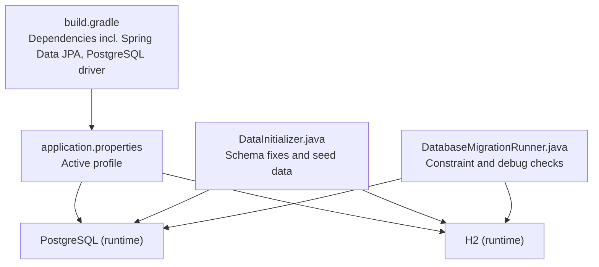

**Diagram sources**
- [build.gradle:34-54](file://build.gradle#L34-L54)
- [application.properties:1-1](file://src/main/resources/application.properties#L1-L1)
- [DataInitializer.java:18-31](file://src/main/java/root/cyb/mh/attendancesystem/config/DataInitializer.java#L18-L31)
- [DatabaseMigrationRunner.java:14-41](file://src/main/java/root/cyb/mh/attendancesystem/config/DatabaseMigrationRunner.java#L14-L41)

**Section sources**
- [build.gradle:1-60](file://build.gradle#L1-L60)
- [application.properties:1-1](file://src/main/resources/application.properties#L1-L1)

## Core Components
This section outlines the core entities and their JPA annotations, primary keys, and relationships inferred from the code.

### Human Resources and Administration Entities
- **Employee**
  - Primary key: id (String)
  - Relationships: Many-to-one to Department, self-referencing to reportsTo and reportsToAssistant
  - Notes: Uses Lombok @Data/@NoArgsConstructor/@AllArgsConstructor; includes payroll and bank fields

- **Department**
  - Primary key: id (Long, auto-generated)
  - Attributes: name, description

- **User**
  - Primary key: id (Long, auto-generated)
  - Unique constraints: username
  - Attributes: username (unique, not null), password (not null), role (not null)
  - Note: Table named app_users to avoid reserved keyword conflicts

### Attendance and Work Management Entities
- **AttendanceLog**
  - Primary key: id (Long, auto-generated)
  - Attributes: employeeId (String), timestamp (LocalDateTime), deviceId (Long)

- **EmployeeDailyWorkStatus**
  - Primary key: id (Long, auto-generated)
  - Composite natural key concept: employeeId + date
  - Enumerated status field mapped to STRING
  - Attributes: status (default NOT_ENTERED), timestamps, break durations

- **LeaveRequest**
  - Primary key: id (Long, auto-generated)
  - Relationships: Many-to-one to Employee
  - Attributes: startDate, endDate, leaveType, reason, status (default PENDING), adminComment, createdAt, reviewedBy
  - Enumerated Status: PENDING, APPROVED, REJECTED

- **Payslip**
  - Primary key: id (Long, auto-generated)
  - Relationships: Many-to-one to Employee
  - Attributes: month (format: "YYYY-MM"), generatedAt, status (default DRAFT)
  - Financial fields: basicSalary, allowanceAmount, bonusAmount, deductionAmount, netSalary
  - Attendance summary: totalWorkingDays, presentDays, absentDays, unpaidLeaveDays, paidLeaveDays
  - Penalty fields: lateDays, latePenaltyAmount
  - Advance salary: advanceSalaryAmount
  - Enumerated Status: DRAFT, PAID

### Master Data Entities
- **Client**
  - Primary key: id (Long, auto-generated)
  - Unique constraints: code
  - Attributes: code (unique, not null), name (not null), address (TEXT), active (default true)

- **Contractor**
  - Primary key: id (Long, auto-generated)
  - Unique constraints: name
  - Attributes: name (unique, not null), description (TEXT), email (length 100), defaultPaymentMethod (Many-to-one), accountDetails (TEXT), createdAt (updatable=false), active (default true), zipCode (length 20), area (length 100)
  - Relationships: One-to-many to ContractorPaymentInfo via paymentInfos

- **PaymentMethod**
  - Primary key: id (Long, auto-generated)
  - Unique constraints: methodName
  - Attributes: methodName (unique, not null), description (TEXT), active (default true)

- **ContractorPaymentInfo**
  - Primary key: id (Long, auto-generated)
  - Attributes: contractor (Many-to-one, fetch LAZY), paymentMethod (Many-to-one, fetch EAGER), accountDetails (TEXT), active (default true), createdBy, createdAt, deletedBy, deletedAt

- **Company**
  - Primary key: id (Long, auto-generated)
  - Attributes: name (not null), address (TEXT), phone, email, SMTP configuration, active (default true)

- **SystemSetting**
  - Primary key: setting_key (String, unique, not null)
  - Attributes: setting_key (unique, not null), setting_value (not null), description

### Work Order and Financial Entities
- **WorkOrder**
  - Primary key: id (Long, auto-generated)
  - Unique constraints: woNumber (not null)
  - Relationships: Many-to-one to Client and Contractor via foreign keys
  - Attributes: dates, financials, addresses, metadata, createdAt (updatable=false)

- **PaymentRequest**
  - Primary key: id (Long, auto-generated)
  - Relationships: Many-to-one to User (requester), Employee (employee_requester), Contractor, PaymentMethod, Company, Client
  - Attributes: amounts, priorities, statuses, timestamps, references, and optional requester_id drop-NOT-NULL fix applied at runtime

### Time and Schedule Management Entities
- **Shift**
  - Primary key: id (Long, auto-generated)
  - Attributes: name, startTime, endTime, lateToleranceMinutes (default 15), earlyLeaveToleranceMinutes (default 15)

- **EmployeeShift**
  - Primary key: id (Long, auto-generated)
  - Relationships: Many-to-one to Employee and Shift
  - Attributes: startDate, endDate

- **WorkSchedule**
  - Primary key: id (Long, auto-generated)
  - Attributes: startTime, endTime, lateToleranceMinutes, earlyLeaveToleranceMinutes, weekendDays (default "6,7"), defaultAnnualLeaveQuota (default 12), latePenaltyThreshold, latePenaltyDeduction, dailyRateBasis, dailyRateFixedValue

### Additional Support Entities
- **PublicHoliday**
  - Primary key: id (Long, auto-generated)
  - Attributes: name, date

- **Notification**
  - Primary key: id (Long, auto-generated)
  - Attributes: recipientUsername (not null), title (not null), message (TEXT), type (INFO, SUCCESS, WARNING, ERROR), linkAction, isRead (default false), createdAt, category

- **SharedResource**
  - Primary key: id (Long, auto-generated)
  - Relationships: Many-to-one to Employee
  - Attributes: resourceName (not null), resourceLink (length 1000), loginId, password, createdAt (updatable=false), updatedAt

**Section sources**
- [Employee.java:13-63](file://src/main/java/root/cyb/mh/attendancesystem/model/Employee.java#L13-L63)
- [Department.java:15-21](file://src/main/java/root/cyb/mh/attendancesystem/model/Department.java#L15-L21)
- [User.java:6-23](file://src/main/java/root/cyb/mh/attendancesystem/model/User.java#L6-L23)
- [AttendanceLog.java:13-26](file://src/main/java/root/cyb/mh/attendancesystem/model/AttendanceLog.java#L13-L26)
- [EmployeeDailyWorkStatus.java:9-45](file://src/main/java/root/cyb/mh/attendancesystem/model/EmployeeDailyWorkStatus.java#L9-L45)
- [LeaveRequest.java:15-54](file://src/main/java/root/cyb/mh/attendancesystem/model/LeaveRequest.java#L15-L54)
- [Payslip.java:14-57](file://src/main/java/root/cyb/mh/attendancesystem/model/Payslip.java#L14-L57)
- [Client.java:8-25](file://src/main/java/root/cyb/mh/attendancesystem/model/Client.java#L8-L25)
- [Contractor.java:8-49](file://src/main/java/root/cyb/mh/attendancesystem/model/Contractor.java#L8-L49)
- [PaymentMethod.java:8-22](file://src/main/java/root/cyb/mh/attendancesystem/model/PaymentMethod.java#L8-L22)
- [ContractorPaymentInfo.java:8-39](file://src/main/java/root/cyb/mh/attendancesystem/model/ContractorPaymentInfo.java#L8-L39)
- [Company.java:8-31](file://src/main/java/root/cyb/mh/attendancesystem/model/Company.java#L8-L31)
- [SystemSetting.java:12-27](file://src/main/java/root/cyb/mh/attendancesystem/model/SystemSetting.java#L12-L27)
- [WorkOrder.java:8-108](file://src/main/java/root/cyb/mh/attendancesystem/model/WorkOrder.java#L8-L108)
- [PaymentRequest.java:13-116](file://src/main/java/root/cyb/mh/attendancesystem/model/PaymentRequest.java#L13-L116)
- [Shift.java:14-30](file://src/main/java/root/cyb/mh/attendancesystem/model/Shift.java#L14-L30)
- [EmployeeShift.java:11-30](file://src/main/java/root/cyb/mh/attendancesystem/model/EmployeeShift.java#L11-L30)
- [WorkSchedule.java:13-49](file://src/main/java/root/cyb/mh/attendancesystem/model/WorkSchedule.java#L13-L49)
- [PublicHoliday.java:12-20](file://src/main/java/root/cyb/mh/attendancesystem/model/PublicHoliday.java#L12-L20)
- [Notification.java:14-43](file://src/main/java/root/cyb/mh/attendancesystem/model/Notification.java#L14-L43)
- [SharedResource.java:9-46](file://src/main/java/root/cyb/mh/attendancesystem/model/SharedResource.java#L9-L46)

## Architecture Overview
The database architecture centers around attendance, workforce, financial workflows, and administrative management. Entities are connected via foreign keys and enums, with explicit constraints and defaults.

```mermaid
erDiagram
DEPARTMENT {
bigint id PK
varchar name
varchar description
}
EMPLOYEE {
varchar id PK
varchar name
varchar cardId
varchar role
varchar designation
varchar email
varchar username
varchar password
varchar photoBase64
int annualLeaveQuota
boolean isGuest
date joiningDate
varchar avatarPath
numeric monthlySalary
numeric fixedAllowance
varchar bankName
varchar accountNumber
}
EMPLOYEE ||--o{ ATTENDANCE_LOG : "has logs"
EMPLOYEE ||--o{ EMPLOYEE_DAILY_WORK_STATUS : "has daily status"
EMPLOYEE ||--o{ LEAVE_REQUEST : "submits requests"
EMPLOYEE ||--o{ PAYSLIP : "generates payslips"
EMPLOYEE ||--o{ EMPLOYEE_SHIFT : "assigned shifts"
EMPLOYEE ||--o{ SHARED_RESOURCE : "owns resources"
EMPLOYEE }o--|| DEPARTMENT : "belongs to"
LEAVE_REQUEST {
bigint id PK
bigint employee_id FK
date startDate
date endDate
varchar leaveType
text reason
varchar status
text adminComment
timestamp createdAt
varchar reviewedBy
}
PAYSLIP {
bigint id PK
bigint employee_id FK
varchar month
timestamp generatedAt
varchar status
numeric basicSalary
numeric allowanceAmount
numeric bonusAmount
numeric deductionAmount
numeric netSalary
int totalWorkingDays
int presentDays
int absentDays
int unpaidLeaveDays
int paidLeaveDays
int lateDays
numeric latePenaltyAmount
numeric advanceSalaryAmount
}
ATTENDANCE_LOG {
bigint id PK
varchar employeeId
timestamp timestamp
bigint deviceId
}
EMPLOYEE_DAILY_WORK_STATUS {
bigint id PK
varchar employeeId
date date
varchar status
timestamp workStartTime
timestamp workEndTime
timestamp currentBreakStartTime
int totalBreakMinutes
int totalBreakSeconds
}
SHIFT {
bigint id PK
varchar name
time startTime
time endTime
int lateToleranceMinutes
int earlyLeaveToleranceMinutes
}
EMPLOYEE_SHIFT {
bigint id PK
bigint employee_id FK
bigint shift_id FK
date startDate
date endDate
}
WORK_SCHEDULE {
bigint id PK
time startTime
time endTime
int lateToleranceMinutes
int earlyLeaveToleranceMinutes
varchar weekendDays
int defaultAnnualLeaveQuota
int latePenaltyThreshold
numeric latePenaltyDeduction
varchar dailyRateBasis
int dailyRateFixedValue
}
CLIENT {
bigint id PK
varchar code UK
varchar name
text address
boolean active
}
CONTRACTOR {
bigint id PK
varchar name UK
text description
varchar email
bigint default_payment_method_id FK
text accountDetails
boolean active
timestamp createdAt
}
CONTRACTOR_PAYMENT_INFO {
bigint id PK
bigint contractor_id FK
bigint payment_method_id FK
text accountDetails
boolean active
varchar createdBy
timestamp createdAt
varchar deletedBy
timestamp deletedAt
}
PAYMENT_METHOD {
bigint id PK
varchar methodName UK
text description
boolean active
}
COMPANY {
bigint id PK
varchar name
text address
varchar phone
varchar email
varchar smtpHost
int smtpPort
varchar smtpUsername
varchar smtpPassword
boolean active
}
SYSTEM_SETTING {
varchar setting_key PK
varchar setting_value
varchar description
}
WORK_ORDER {
bigint id PK
varchar woNumber UK
varchar status
varchar workType
date dateDue
bigint client_id FK
varchar originalClientString
varchar address
varchar city
varchar state
varchar zip
bigint contractor_id FK
bigint importBatchId
varchar originalContractorString
int photosCount
varchar admin
varchar category
date dateReceived
boolean contractorInvoicePaid
boolean clientInvoicePaid
numeric clientInvoiceTotal
numeric contractorInvoiceTotal
date invoiceDate
timestamp createdAt
varchar invoiceNumber
varchar ppwNumber
varchar loanNumber
varchar customerBank
date dateDueClient
date sentToClientDate
date clientPaidDate
numeric contractorDiscountPercent
numeric contractorPaidAmount
numeric clientDiscountPercent
numeric clientDiscountTotal
numeric clientPaidAmount
numeric writeOffAmount
}
PAYMENT_REQUEST {
bigint id PK
date requestDate
timestamp lastModified
bigint requester_id
bigint employee_requester_id
varchar workOrderNumber
numeric amount
varchar contractorName
bigint contractor_id
varchar paymentMethodId
bigint payment_method_ref_id
text paymentAccountDetails
varchar paymentReferenceNumber
bigint company_id
varchar clientCode
bigint client_id
varchar priority
text reason
varchar checkStatus
varchar paymentStatus
bigint approval_authority_id
bigint approval_employee_id
varchar ppwUpdateStatus
text remarks
int reviewUpdateCount
text employeeNote
timestamp lastEmailSentAt
varchar lastEmailSentTo
varchar paymentProofPath
varchar status
}
NOTIFICATION {
bigint id PK
varchar recipientUsername
varchar title
text message
varchar type
varchar linkAction
boolean isRead
timestamp createdAt
varchar category
}
SHARED_RESOURCE {
bigint id PK
bigint employee_id FK
varchar resourceName
varchar resourceLink
varchar loginId
varchar password
timestamp createdAt
timestamp updatedAt
}
APP_USERS ||--o{ PAYMENT_REQUEST : "creates"
EMPLOYEE ||--o{ PAYMENT_REQUEST : "employee requester"
CLIENT ||--o{ WORK_ORDER : "client"
CONTRACTOR ||--o{ WORK_ORDER : "contractor"
CONTRACTOR ||--o{ CONTRACTOR_PAYMENT_INFO : "has payment infos"
EMPLOYEE ||--o{ EMPLOYEE_DAILY_WORK_STATUS : "daily status"
EMPLOYEE ||--o{ ATTENDANCE_LOG : "attendance logs"
EMPLOYEE ||--o{ LEAVE_REQUEST : "leave requests"
EMPLOYEE ||--o{ PAYSLIP : "payslips"
EMPLOYEE ||--o{ EMPLOYEE_SHIFT : "shift assignments"
EMPLOYEE ||--o{ SHARED_RESOURCE : "resources"
CONTRACTOR ||--o{ PAYMENT_REQUEST : "payment requests"
CLIENT ||--o{ PAYMENT_REQUEST : "payment requests"
```

**Diagram sources**
- [Employee.java:22-29](file://src/main/java/root/cyb/mh/attendancesystem/model/Employee.java#L22-L29)
- [Department.java:15-21](file://src/main/java/root/cyb/mh/attendancesystem/model/Department.java#L15-L21)
- [User.java:8-22](file://src/main/java/root/cyb/mh/attendancesystem/model/User.java#L8-L22)
- [AttendanceLog.java:23-25](file://src/main/java/root/cyb/mh/attendancesystem/model/AttendanceLog.java#L23-L25)
- [EmployeeDailyWorkStatus.java:18-19](file://src/main/java/root/cyb/mh/attendancesystem/model/EmployeeDailyWorkStatus.java#L18-L19)
- [LeaveRequest.java:21-23](file://src/main/java/root/cyb/mh/attendancesystem/model/LeaveRequest.java#L21-L23)
- [Payslip.java:20-22](file://src/main/java/root/cyb/mh/attendancesystem/model/Payslip.java#L20-L22)
- [Shift.java:15-28](file://src/main/java/root/cyb/mh/attendancesystem/model/Shift.java#L15-L28)
- [EmployeeShift.java:16-22](file://src/main/java/root/cyb/mh/attendancesystem/model/EmployeeShift.java#L16-L22)
- [WorkSchedule.java:18-47](file://src/main/java/root/cyb/mh/attendancesystem/model/WorkSchedule.java#L18-L47)
- [Client.java:14-23](file://src/main/java/root/cyb/mh/attendancesystem/model/Client.java#L14-L23)
- [Contractor.java:23-25](file://src/main/java/root/cyb/mh/attendancesystem/model/Contractor.java#L23-L25)
- [ContractorPaymentInfo.java:14-21](file://src/main/java/root/cyb/mh/attendancesystem/model/ContractorPaymentInfo.java#L14-L21)
- [PaymentMethod.java:14-20](file://src/main/java/root/cyb/mh/attendancesystem/model/PaymentMethod.java#L14-L20)
- [Company.java:14-29](file://src/main/java/root/cyb/mh/attendancesystem/model/Company.java#L14-L29)
- [SystemSetting.java:19-25](file://src/main/java/root/cyb/mh/attendancesystem/model/SystemSetting.java#L19-L25)
- [WorkOrder.java:24-37](file://src/main/java/root/cyb/mh/attendancesystem/model/WorkOrder.java#L24-L37)
- [PaymentRequest.java:33-58](file://src/main/java/root/cyb/mh/attendancesystem/model/PaymentRequest.java#L33-L58)
- [Notification.java:22-41](file://src/main/java/root/cyb/mh/attendancesystem/model/Notification.java#L22-L41)
- [SharedResource.java:16-18](file://src/main/java/root/cyb/mh/attendancesystem/model/SharedResource.java#L16-L18)

## Detailed Component Analysis

### Attendance and Work Status
- AttendanceLog captures punch events with employeeId, timestamp, and deviceId.
- EmployeeDailyWorkStatus tracks daily status per employee with composite natural key semantics (employeeId + date) and enumerated status values.

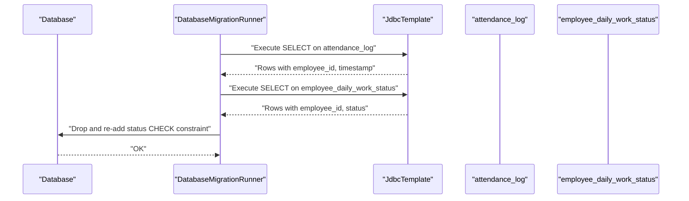

**Diagram sources**
- [DatabaseMigrationRunner.java:14-41](file://src/main/java/root/cyb/mh/attendancesystem/config/DatabaseMigrationRunner.java#L14-L41)

**Section sources**
- [AttendanceLog.java:13-26](file://src/main/java/root/cyb/mh/attendancesystem/model/AttendanceLog.java#L13-L26)
- [EmployeeDailyWorkStatus.java:9-45](file://src/main/java/root/cyb/mh/attendancesystem/model/EmployeeDailyWorkStatus.java#L9-L45)
- [DatabaseMigrationRunner.java:14-41](file://src/main/java/root/cyb/mh/attendancesystem/config/DatabaseMigrationRunner.java#L14-L41)

### Leave Management System
- LeaveRequest entity manages employee leave applications with comprehensive tracking
- Supports different leave types (Sick, Vacation, Personal) with approval workflow
- Includes audit trail with admin comments and reviewer tracking

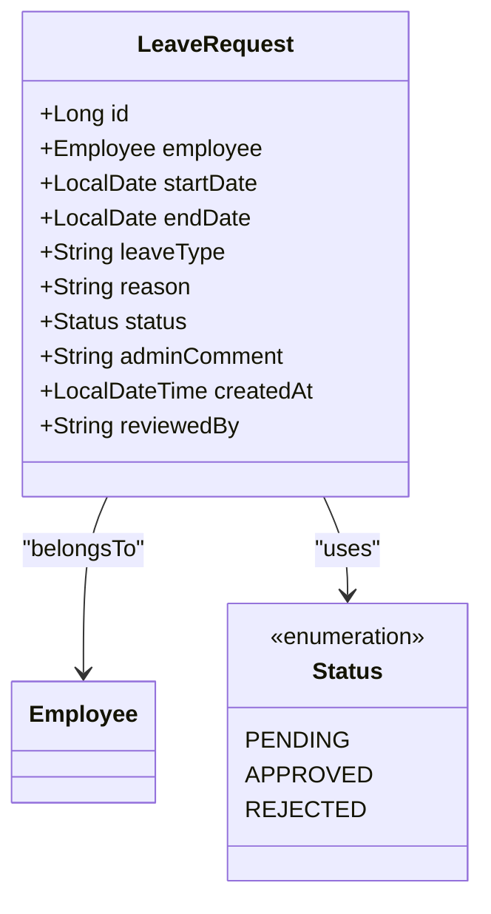

**Diagram sources**
- [LeaveRequest.java:15-54](file://src/main/java/root/cyb/mh/attendancesystem/model/LeaveRequest.java#L15-L54)

**Section sources**
- [LeaveRequest.java:15-54](file://src/main/java/root/cyb/mh/attendancesystem/model/LeaveRequest.java#L15-L54)

### Payroll and Compensation System
- Payslip entity generates monthly compensation statements with detailed breakdown
- Supports draft/paid status with comprehensive financial tracking
- Integrates attendance data for accurate salary calculations

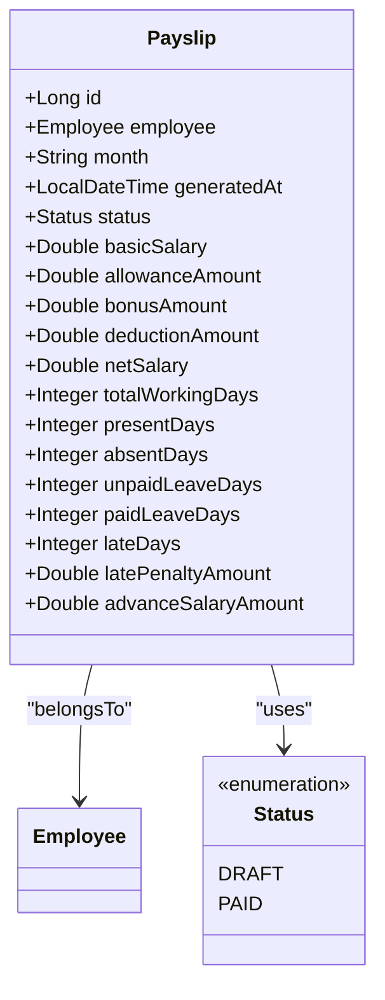

**Diagram sources**
- [Payslip.java:14-57](file://src/main/java/root/cyb/mh/attendancesystem/model/Payslip.java#L14-L57)

**Section sources**
- [Payslip.java:14-57](file://src/main/java/root/cyb/mh/attendancesystem/model/Payslip.java#L14-L57)

### Payment Requests and Schema Evolution
- PaymentRequest defines multiple relationships and uses enumerated fields for statuses/priorities.
- A runtime schema fix drops NOT NULL on requester_id in payment_requests to support legacy data.

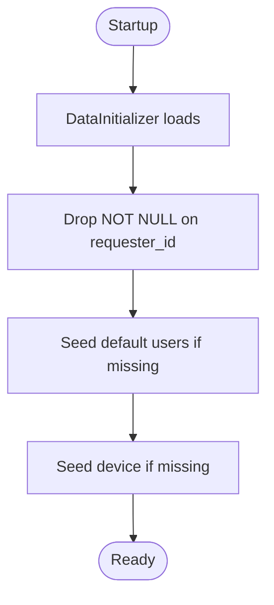

**Diagram sources**
- [DataInitializer.java:18-31](file://src/main/java/root/cyb/mh/attendancesystem/config/DataInitializer.java#L18-L31)

**Section sources**
- [PaymentRequest.java:13-116](file://src/main/java/root/cyb/mh/attendancesystem/model/PaymentRequest.java#L13-L116)
- [DataInitializer.java:18-31](file://src/main/java/root/cyb/mh/attendancesystem/config/DataInitializer.java#L18-L31)

### Work Orders and Clients/Contractors
- WorkOrder has a unique work order number and links to Client and Contractor.
- Financial and administrative fields support invoicing and reporting.

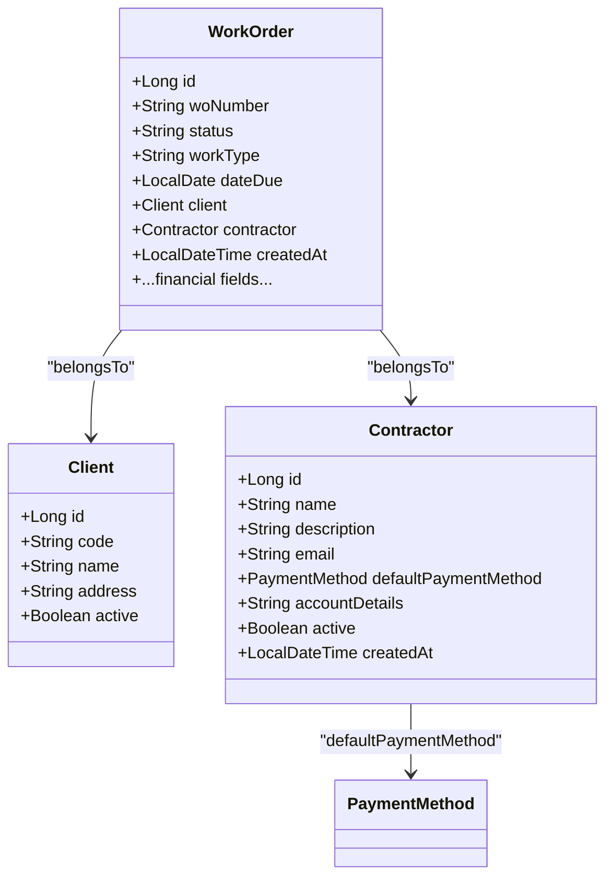

**Diagram sources**
- [WorkOrder.java:10-37](file://src/main/java/root/cyb/mh/attendancesystem/model/WorkOrder.java#L10-L37)
- [Client.java:14-23](file://src/main/java/root/cyb/mh/attendancesystem/model/Client.java#L14-L23)
- [Contractor.java:23-25](file://src/main/java/root/cyb/mh/attendancesystem/model/Contractor.java#L23-L25)

**Section sources**
- [WorkOrder.java:10-108](file://src/main/java/root/cyb/mh/attendancesystem/model/WorkOrder.java#L10-L108)

### Master Data Management
- SystemSetting provides centralized configuration management
- PaymentMethod supports multiple payment channels for contractors
- ContractorPaymentInfo manages multiple payment accounts per contractor

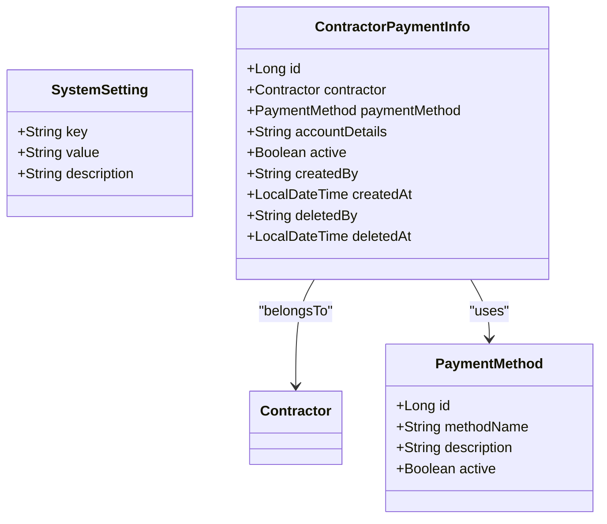

**Diagram sources**
- [SystemSetting.java:19-25](file://src/main/java/root/cyb/mh/attendancesystem/model/SystemSetting.java#L19-L25)
- [PaymentMethod.java:14-20](file://src/main/java/root/cyb/mh/attendancesystem/model/PaymentMethod.java#L14-L20)
- [ContractorPaymentInfo.java:14-21](file://src/main/java/root/cyb/mh/attendancesystem/model/ContractorPaymentInfo.java#L14-L21)

**Section sources**
- [SystemSetting.java:12-27](file://src/main/java/root/cyb/mh/attendancesystem/model/SystemSetting.java#L12-L27)
- [PaymentMethod.java:8-22](file://src/main/java/root/cyb/mh/attendancesystem/model/PaymentMethod.java#L8-L22)
- [ContractorPaymentInfo.java:8-39](file://src/main/java/root/cyb/mh/attendancesystem/model/ContractorPaymentInfo.java#L8-L39)

### Time and Schedule Management
- Shift entity defines standard work periods with tolerance configurations
- EmployeeShift links employees to specific shifts with date ranges
- WorkSchedule provides organizational-wide schedule defaults

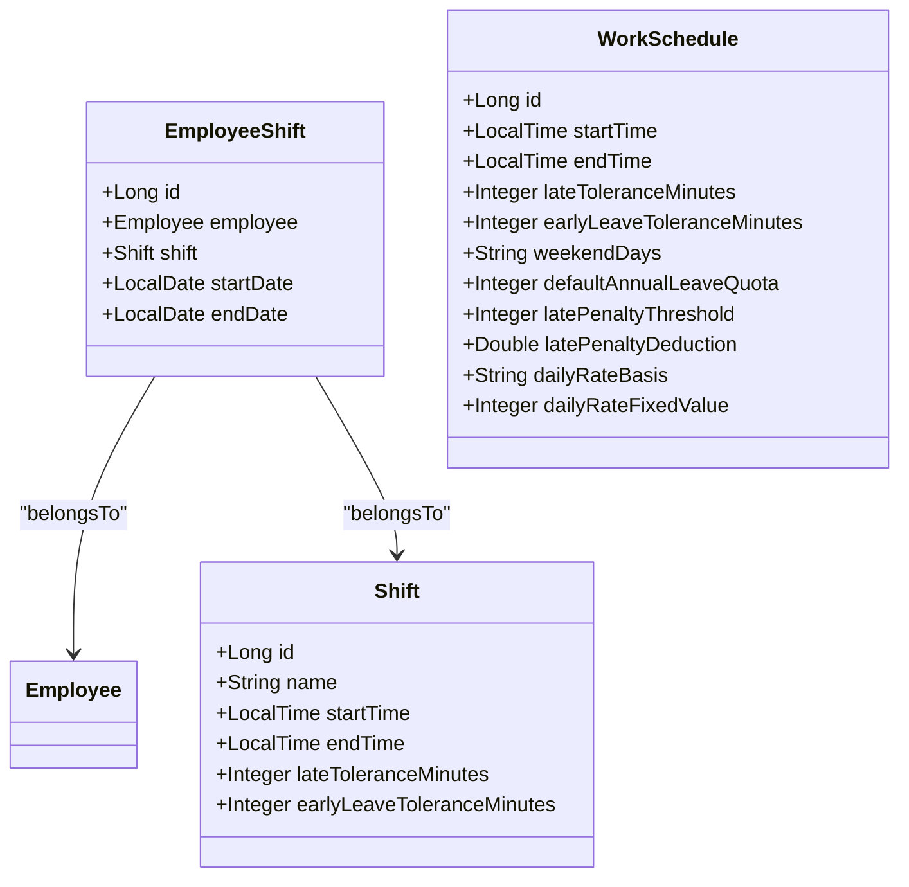

**Diagram sources**
- [Shift.java:15-28](file://src/main/java/root/cyb/mh/attendancesystem/model/Shift.java#L15-L28)
- [EmployeeShift.java:16-22](file://src/main/java/root/cyb/mh/attendancesystem/model/EmployeeShift.java#L16-L22)
- [WorkSchedule.java:18-47](file://src/main/java/root/cyb/mh/attendancesystem/model/WorkSchedule.java#L18-L47)

**Section sources**
- [Shift.java:14-30](file://src/main/java/root/cyb/mh/attendancesystem/model/Shift.java#L14-L30)
- [EmployeeShift.java:11-30](file://src/main/java/root/cyb/mh/attendancesystem/model/EmployeeShift.java#L11-L30)
- [WorkSchedule.java:13-49](file://src/main/java/root/cyb/mh/attendancesystem/model/WorkSchedule.java#L13-L49)

### Users and Authentication
- User entity stores credentials and roles, with unique username enforced at the database level.

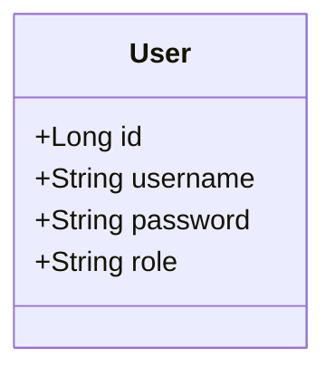

**Diagram sources**
- [User.java:6-23](file://src/main/java/root/cyb/mh/attendancesystem/model/User.java#L6-L23)

**Section sources**
- [User.java:6-23](file://src/main/java/root/cyb/mh/attendancesystem/model/User.java#L6-L23)

### Notifications and Shared Resources
- Notification entity manages system alerts with categorization and read status tracking
- SharedResource provides secure access to external resources with audit trails

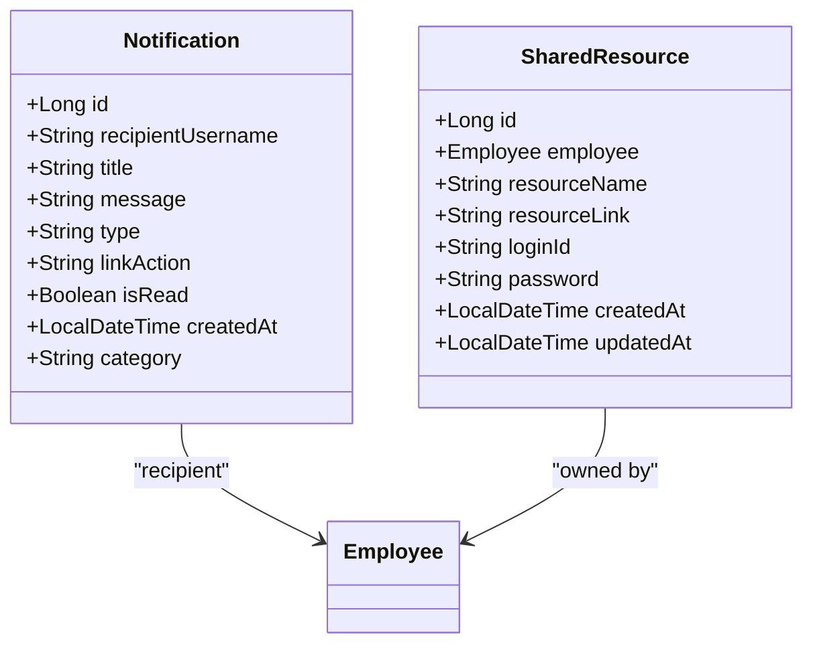

**Diagram sources**
- [Notification.java:22-41](file://src/main/java/root/cyb/mh/attendancesystem/model/Notification.java#L22-L41)
- [SharedResource.java:16-18](file://src/main/java/root/cyb/mh/attendancesystem/model/SharedResource.java#L16-L18)

**Section sources**
- [Notification.java:14-43](file://src/main/java/root/cyb/mh/attendancesystem/model/Notification.java#L14-L43)
- [SharedResource.java:9-46](file://src/main/java/root/cyb/mh/attendancesystem/model/SharedResource.java#L9-L46)

## Dependency Analysis
- JPA/Hibernate manages persistence for all entities.
- PostgreSQL is the primary runtime database; H2 is included for development/testing.
- Initialization and migration scripts adjust schema and seed data at startup.

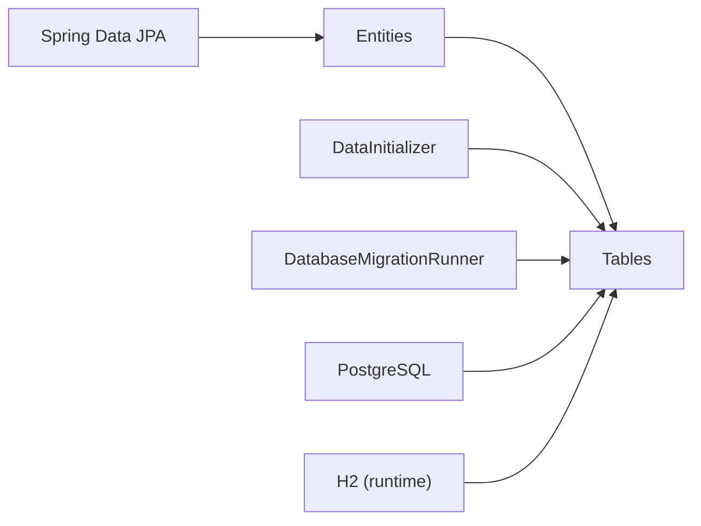

**Diagram sources**
- [build.gradle:34-54](file://build.gradle#L34-L54)
- [DataInitializer.java:18-31](file://src/main/java/root/cyb/mh/attendancesystem/config/DataInitializer.java#L18-L31)
- [DatabaseMigrationRunner.java:14-41](file://src/main/java/root/cyb/mh/attendancesystem/config/DatabaseMigrationRunner.java#L14-L41)

**Section sources**
- [build.gradle:34-54](file://build.gradle#L34-L54)

## Performance Considerations
- Indexing strategies
  - Primary keys are implicitly indexed by the RDBMS.
  - Consider adding indexes on frequently filtered/sorted columns:
    - AttendanceLog.employeeId and timestamp
    - EmployeeDailyWorkStatus.employeeId + date
    - LeaveRequest.employee_id + startDate + endDate
    - Payslip.employee_id + month + status
    - PaymentRequest.workOrderNumber, requester_id, employee_requester_id, contractor_id, client_id, company_id
    - WorkOrder.woNumber, client_id, contractor_id, createdAt
    - User.username (already unique)
    - EmployeeShift.employee_id + startDate + endDate
    - EmployeeShift.shift_id + startDate + endDate
    - Notification.recipientUsername + isRead + createdAt
    - SharedResource.employee_id + resourceName
- Query patterns
  - Daily status lookup by employeeId + date
  - AttendanceLog queries by date range and employeeId
  - LeaveRequest queries by employee and date ranges
  - Payslip generation with employee and month filters
  - PaymentRequest and WorkOrder filtering by foreign keys and dates
  - Notification retrieval by recipient and read status
- Data types and defaults
  - Numeric fields for monetary values; TEXT for long-form notes
  - Defaults for integer counters and booleans reduce NULL checks
  - ENUM types for status fields ensure data integrity
- Concurrency and transactions
  - Use appropriate transaction isolation levels for concurrent updates to daily status, leave requests, and payslips
  - Implement optimistic locking for concurrent payment request updates
- Batch operations
  - Bulk import/export paths may benefit from batch inserts and streaming reads
  - Payslip generation can leverage batch processing for monthly payroll runs

## Troubleshooting Guide
- Constraint violations on work status
  - A startup routine ensures the status CHECK constraint exists; re-apply it if missing
- Schema compatibility for payment_requests
  - requester_id may be altered to allow NULL to accommodate legacy data
- Leave request validation
  - Ensure leave dates are valid and don't overlap existing approved leaves
  - Check annual leave quota calculations before approval
- Payslip generation
  - Verify attendance data integration before generating payslips
  - Check for pending leave or absence adjustments
- Startup diagnostics
  - Migration runner prints recent attendance logs and daily statuses to console for quick verification

**Section sources**
- [DatabaseMigrationRunner.java:14-41](file://src/main/java/root/cyb/mh/attendancesystem/config/DatabaseMigrationRunner.java#L14-L41)
- [DataInitializer.java:18-31](file://src/main/java/root/cyb/mh/attendancesystem/config/DataInitializer.java#L18-L31)

## Conclusion
The Skylink Custom Backend employs a comprehensive normalized relational schema with clear entity relationships and constraints. The expanded design now includes complete HR management (LeaveRequest, Payslip), enhanced master data (Client, Contractor, PaymentMethod), advanced scheduling (Shift, EmployeeShift, WorkSchedule), and operational support (Notification, SharedResource). JPA annotations define primary keys, enumerations, and defaults, while programmatic initialization and migration routines maintain schema integrity across environments. Indexing and query tuning should target high-traffic paths such as daily status lookups, leave management workflows, payroll generation, and notification delivery systems.

## Appendices

### Appendix A: Notable JPA Annotations and Constraints
- @Entity, @Id, @GeneratedValue
- @Table(name = "...") for reserved keywords
- @Column(unique = true, nullable = false)
- @Enumerated(EnumType.STRING)
- @ManyToOne + @JoinColumn for foreign keys
- @OneToMany + @JoinColumn for one-to-many relationships
- @PrePersist for createdAt defaults
- ColumnDefinition defaults for integers and booleans
- @DateTimeFormat for time/date formatting
- @JsonIgnore for bidirectional relationships

**Section sources**
- [User.java:8-22](file://src/main/java/root/cyb/mh/attendancesystem/model/User.java#L8-L22)
- [WorkOrder.java:65-90](file://src/main/java/root/cyb/mh/attendancesystem/model/WorkOrder.java#L65-L90)
- [EmployeeDailyWorkStatus.java:30-38](file://src/main/java/root/cyb/mh/attendancesystem/model/EmployeeDailyWorkStatus.java#L30-L38)
- [PaymentRequest.java:27-31](file://src/main/java/root/cyb/mh/attendancesystem/model/PaymentRequest.java#L27-L31)
- [Contractor.java:30-31](file://src/main/java/root/cyb/mh/attendancesystem/model/Contractor.java#L30-L31)
- [ContractorPaymentInfo.java:16-17](file://src/main/java/root/cyb/mh/attendancesystem/model/ContractorPaymentInfo.java#L16-L17)

### Appendix B: Runtime Dependencies and Profiles
- PostgreSQL driver is active at runtime
- H2 is present for development/testing
- Active profile is prod by default

**Section sources**
- [build.gradle:46-47](file://build.gradle#L46-L47)
- [application.properties:1-1](file://src/main/resources/application.properties#L1-L1)

### Appendix C: Entity Relationship Patterns
- Hierarchical relationships: Employee → Department (many-to-one)
- Self-referencing: Employee → Employee (reportsTo, reportsToAssistant)
- Temporal relationships: Employee → EmployeeDailyWorkStatus (one-to-many)
- Enumerated status tracking: EmployeeDailyWorkStatus, LeaveRequest, Payslip, PaymentRequest
- Master data relationships: Client, Contractor, PaymentMethod, Company
- Schedule relationships: Shift → EmployeeShift → Employee
- Audit relationships: Notification, SharedResource with timestamps and user tracking

**Section sources**
- [Employee.java:22-29](file://src/main/java/root/cyb/mh/attendancesystem/model/Employee.java#L22-L29)
- [EmployeeDailyWorkStatus.java:18-19](file://src/main/java/root/cyb/mh/attendancesystem/model/EmployeeDailyWorkStatus.java#L18-L19)
- [LeaveRequest.java:21-23](file://src/main/java/root/cyb/mh/attendancesystem/model/LeaveRequest.java#L21-L23)
- [Payslip.java:20-22](file://src/main/java/root/cyb/mh/attendancesystem/model/Payslip.java#L20-L22)
- [Shift.java:15-28](file://src/main/java/root/cyb/mh/attendancesystem/model/Shift.java#L15-L28)
- [EmployeeShift.java:16-22](file://src/main/java/root/cyb/mh/attendancesystem/model/EmployeeShift.java#L16-L22)
- [Notification.java:22-41](file://src/main/java/root/cyb/mh/attendancesystem/model/Notification.java#L22-L41)
- [SharedResource.java:16-18](file://src/main/java/root/cyb/mh/attendancesystem/model/SharedResource.java#L16-L18)