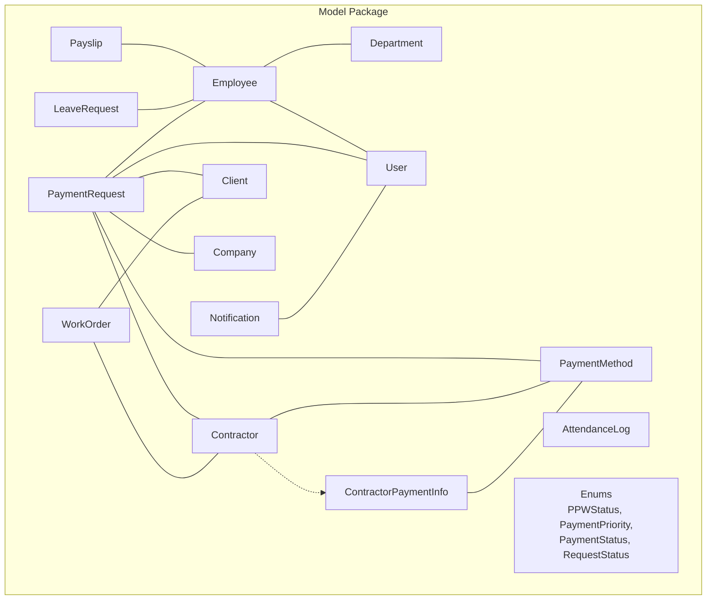
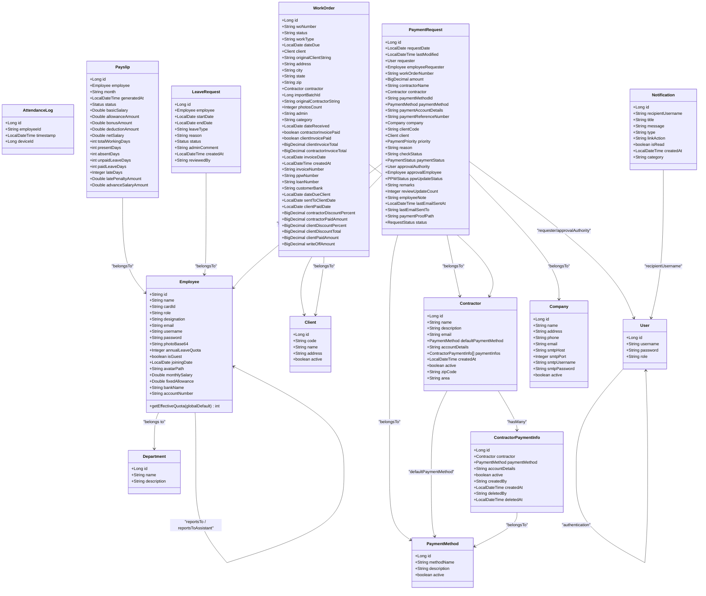
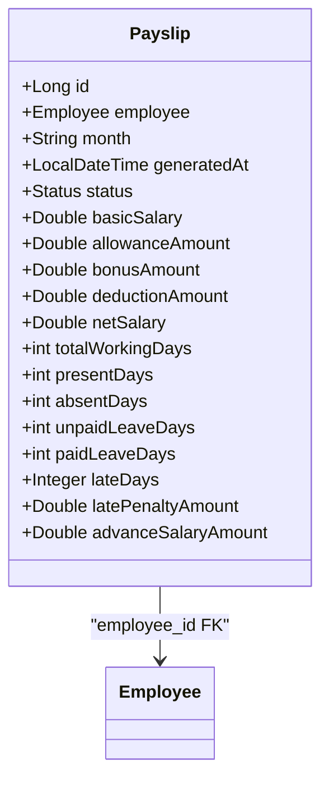
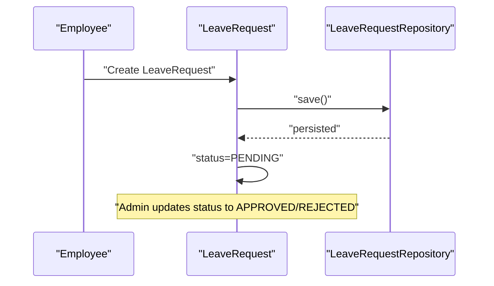
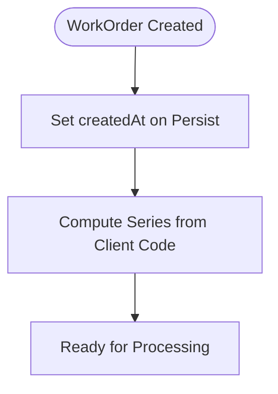
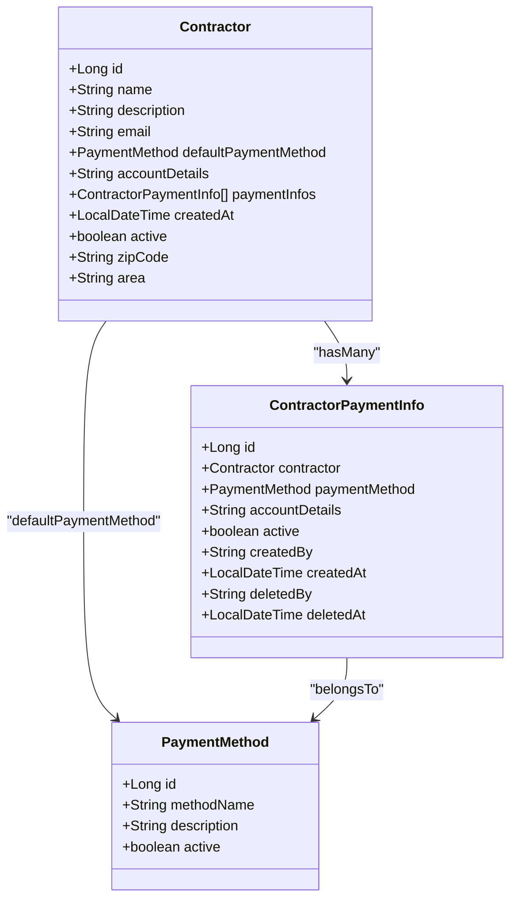
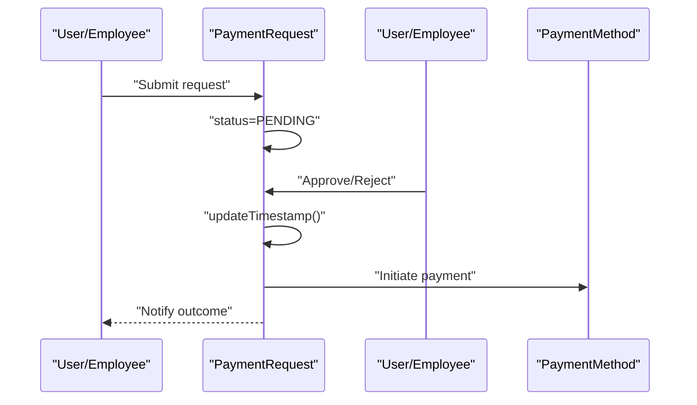
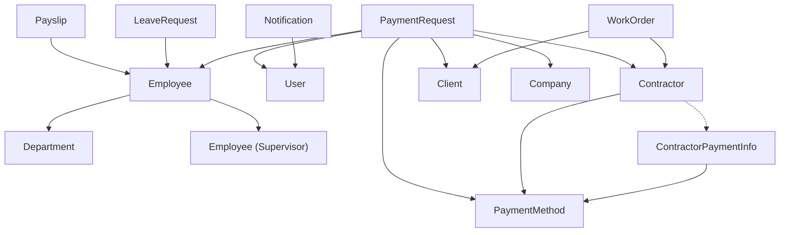

# Entity Models

<cite>
**Referenced Files in This Document**
- [Employee.java](file://src/main/java/root/cyb/mh/attendancesystem/model/Employee.java)
- [Department.java](file://src/main/java/root/cyb/mh/attendancesystem/model/Department.java)
- [AttendanceLog.java](file://src/main/java/root/cyb/mh/attendancesystem/model/AttendanceLog.java)
- [Payslip.java](file://src/main/java/root/cyb/mh/attendancesystem/model/Payslip.java)
- [LeaveRequest.java](file://src/main/java/root/cyb/mh/attendancesystem/model/LeaveRequest.java)
- [WorkOrder.java](file://src/main/java/root/cyb/mh/attendancesystem/model/WorkOrder.java)
- [Client.java](file://src/main/java/root/cyb/mh/attendancesystem/model/Client.java)
- [Contractor.java](file://src/main/java/root/cyb/mh/attendancesystem/model/Contractor.java)
- [PaymentRequest.java](file://src/main/java/root/cyb/mh/attendancesystem/model/PaymentRequest.java)
- [Notification.java](file://src/main/java/root/cyb/mh/attendancesystem/model/Notification.java)
- [User.java](file://src/main/java/root/cyb/mh/attendancesystem/model/User.java)
- [PPWStatus.java](file://src/main/java/root/cyb/mh/attendancesystem/model/enums/PPWStatus.java)
- [PaymentPriority.java](file://src/main/java/root/cyb/mh/attendancesystem/model/enums/PaymentPriority.java)
- [PaymentStatus.java](file://src/main/java/root/cyb/mh/attendancesystem/model/enums/PaymentStatus.java)
- [RequestStatus.java](file://src/main/java/root/cyb/mh/attendancesystem/model/enums/RequestStatus.java)
- [Company.java](file://src/main/java/root/cyb/mh/attendancesystem/model/Company.java)
- [PaymentMethod.java](file://src/main/java/root/cyb/mh/attendancesystem/model/PaymentMethod.java)
- [ContractorPaymentInfo.java](file://src/main/java/root/cyb/mh/attendancesystem/model/ContractorPaymentInfo.java)
</cite>

## Table of Contents
1. [Introduction](#introduction)
2. [Project Structure](#project-structure)
3. [Core Components](#core-components)
4. [Architecture Overview](#architecture-overview)
5. [Detailed Component Analysis](#detailed-component-analysis)
6. [Dependency Analysis](#dependency-analysis)
7. [Performance Considerations](#performance-considerations)
8. [Troubleshooting Guide](#troubleshooting-guide)
9. [Conclusion](#conclusion)

## Introduction
This document provides a comprehensive entity model reference for the Skylink Custom Backend. It focuses on JPA entities used for human resources, payroll, attendance, work orders, payments, and notifications. For each entity, we describe purpose, fields, data types, JPA annotations, Lombok usage, constraints, lifecycle hooks, and business significance. We also explain relationships, data mapping patterns, and validation rules derived from annotations and enums.

## Project Structure
Entities are located under the model package. Supporting enums reside under model/enums. Entities are mapped to database tables via JPA annotations, with Lombok simplifying boilerplate.

**Diagram sources**
- [Employee.java:1-64](file://src/main/java/root/cyb/mh/attendancesystem/model/Employee.java#L1-L64)
- [Department.java:1-22](file://src/main/java/root/cyb/mh/attendancesystem/model/Department.java#L1-L22)
- [AttendanceLog.java:1-27](file://src/main/java/root/cyb/mh/attendancesystem/model/AttendanceLog.java#L1-L27)
- [Payslip.java:1-57](file://src/main/java/root/cyb/mh/attendancesystem/model/Payslip.java#L1-L57)
- [LeaveRequest.java:1-54](file://src/main/java/root/cyb/mh/attendancesystem/model/LeaveRequest.java#L1-L54)
- [WorkOrder.java:1-109](file://src/main/java/root/cyb/mh/attendancesystem/model/WorkOrder.java#L1-L109)
- [Client.java:1-25](file://src/main/java/root/cyb/mh/attendancesystem/model/Client.java#L1-L25)
- [Contractor.java:1-49](file://src/main/java/root/cyb/mh/attendancesystem/model/Contractor.java#L1-L49)
- [PaymentMethod.java:1-22](file://src/main/java/root/cyb/mh/attendancesystem/model/PaymentMethod.java#L1-L22)
- [ContractorPaymentInfo.java:1-39](file://src/main/java/root/cyb/mh/attendancesystem/model/ContractorPaymentInfo.java#L1-L39)
- [PaymentRequest.java:1-117](file://src/main/java/root/cyb/mh/attendancesystem/model/PaymentRequest.java#L1-L117)
- [Notification.java:1-43](file://src/main/java/root/cyb/mh/attendancesystem/model/Notification.java#L1-L43)
- [User.java:1-24](file://src/main/java/root/cyb/mh/attendancesystem/model/User.java#L1-L24)
- [Company.java:1-31](file://src/main/java/root/cyb/mh/attendancesystem/model/Company.java#L1-L31)
- [PPWStatus.java:1-8](file://src/main/java/root/cyb/mh/attendancesystem/model/enums/PPWStatus.java#L1-L8)
- [PaymentPriority.java:1-8](file://src/main/java/root/cyb/mh/attendancesystem/model/enums/PaymentPriority.java#L1-L8)
- [PaymentStatus.java:1-9](file://src/main/java/root/cyb/mh/attendancesystem/model/enums/PaymentStatus.java#L1-L9)
- [RequestStatus.java:1-8](file://src/main/java/root/cyb/mh/attendancesystem/model/enums/RequestStatus.java#L1-L8)

**Section sources**
- [Employee.java:1-64](file://src/main/java/root/cyb/mh/attendancesystem/model/Employee.java#L1-L64)
- [Department.java:1-22](file://src/main/java/root/cyb/mh/attendancesystem/model/Department.java#L1-L22)
- [AttendanceLog.java:1-27](file://src/main/java/root/cyb/mh/attendancesystem/model/AttendanceLog.java#L1-L27)
- [Payslip.java:1-57](file://src/main/java/root/cyb/mh/attendancesystem/model/Payslip.java#L1-L57)
- [LeaveRequest.java:1-54](file://src/main/java/root/cyb/mh/attendancesystem/model/LeaveRequest.java#L1-L54)
- [WorkOrder.java:1-109](file://src/main/java/root/cyb/mh/attendancesystem/model/WorkOrder.java#L1-L109)
- [Client.java:1-25](file://src/main/java/root/cyb/mh/attendancesystem/model/Client.java#L1-L25)
- [Contractor.java:1-49](file://src/main/java/root/cyb/mh/attendancesystem/model/Contractor.java#L1-L49)
- [PaymentMethod.java:1-22](file://src/main/java/root/cyb/mh/attendancesystem/model/PaymentMethod.java#L1-L22)
- [ContractorPaymentInfo.java:1-39](file://src/main/java/root/cyb/mh/attendancesystem/model/ContractorPaymentInfo.java#L1-L39)
- [PaymentRequest.java:1-117](file://src/main/java/root/cyb/mh/attendancesystem/model/PaymentRequest.java#L1-L117)
- [Notification.java:1-43](file://src/main/java/root/cyb/mh/attendancesystem/model/Notification.java#L1-L43)
- [User.java:1-24](file://src/main/java/root/cyb/mh/attendancesystem/model/User.java#L1-L24)
- [Company.java:1-31](file://src/main/java/root/cyb/mh/attendancesystem/model/Company.java#L1-L31)
- [PPWStatus.java:1-8](file://src/main/java/root/cyb/mh/attendancesystem/model/enums/PPWStatus.java#L1-L8)
- [PaymentPriority.java:1-8](file://src/main/java/root/cyb/mh/attendancesystem/model/enums/PaymentPriority.java#L1-L8)
- [PaymentStatus.java:1-9](file://src/main/java/root/cyb/mh/attendancesystem/model/enums/PaymentStatus.java#L1-L9)
- [RequestStatus.java:1-8](file://src/main/java/root/cyb/mh/attendancesystem/model/enums/RequestStatus.java#L1-L8)

## Core Components
This section summarizes the purpose, key fields, and annotations for each entity.

- Employee
  - Purpose: Represents staff members, linking to Department and supervisors, storing payroll and personal details.
  - Key fields: id (String), name, cardId, role, designation, email, username, password, photoBase64, annualLeaveQuota, isGuest, joiningDate, avatarPath, monthlySalary, fixedAllowance, bankName, accountNumber.
  - Annotations: @Entity, @Data, @NoArgsConstructor, @AllArgsConstructor, @Id, @ManyToOne to Department, @ManyToOne to Employee (supervisor and assistant), @Column for large text and defaults.
  - Business significance: Central identity and payroll driver; supports leave quota override via getEffectiveQuota.
  - Lifecycle: None explicit.
  - Validation: None enforced at entity level; defaults applied via @Column.

- Department
  - Purpose: Organizational unit with optional description.
  - Key fields: id (Long), name, description.
  - Annotations: @Entity, @Data, @NoArgsConstructor, @AllArgsConstructor, @Id, @GeneratedValue.
  - Business significance: Hierarchical grouping for employees and reporting lines.

- AttendanceLog
  - Purpose: Records timestamps and device IDs for attendance events.
  - Key fields: id (Long), employeeId (String), timestamp (LocalDateTime), deviceId (Long).
  - Annotations: @Entity, @Data, @NoArgsConstructor, @AllArgsConstructor, @Id, @GeneratedValue.
  - Business significance: Raw input for payroll and reporting systems.

- Payslip
  - Purpose: Monthly salary statement with attendance summary and financial breakdown.
  - Key fields: id (Long), employee (Employee), month (String), generatedAt (LocalDateTime), status (Status enum), basicSalary, allowanceAmount, bonusAmount, deductionAmount, netSalary, totalWorkingDays, presentDays, absentDays, unpaidLeaveDays, paidLeaveDays, lateDays, latePenaltyAmount, advanceSalaryAmount.
  - Annotations: @Entity, @Data, @NoArgsConstructor, @AllArgsConstructor, @Id, @GeneratedValue, @ManyToOne to Employee, @Enumerated for Status.
  - Business significance: Finalized payroll record; draft/paid lifecycle.

- LeaveRequest
  - Purpose: Tracks leave applications with status and administrative comments.
  - Key fields: id (Long), employee (Employee), startDate (LocalDate), endDate (LocalDate), leaveType (String), reason (TEXT), status (Status enum), adminComment (TEXT), createdAt (LocalDateTime), reviewedBy (String).
  - Annotations: @Entity, @Data, @NoArgsConstructor, @AllArgsConstructor, @Id, @GeneratedValue, @ManyToOne to Employee, @Enumerated for Status, @Column for TEXT and non-null constraints.
  - Business significance: HR workflow and policy enforcement.

- WorkOrder
  - Purpose: Work order tracking with client/contractor linkage, invoicing, and financials.
  - Key fields: id (Long), woNumber (unique, not null), status, workType, dateDue, client (Client), originalClientString, address, city, state, zip, contractor (Contractor), importBatchId, originalContractorString, photosCount, admin, category, dateReceived, contractorInvoicePaid, clientInvoicePaid, clientInvoiceTotal, contractorInvoiceTotal, invoiceDate, createdAt (updatable=false), invoiceNumber, ppwNumber, loanNumber, customerBank, dateDueClient, sentToClientDate, clientPaidDate, contractorDiscountPercent, contractorPaidAmount, clientDiscountPercent, clientDiscountTotal, clientPaidAmount, writeOffAmount.
  - Annotations: @Entity, @Data, @Table, @Id, @GeneratedValue, @ManyToOne to Client and Contractor, @Column constraints, @PrePersist for createdAt.
  - Business significance: End-to-end work lifecycle and financial tracking.

- Client
  - Purpose: Named client with unique code and address.
  - Key fields: id (Long), code (unique, not null), name (not null), address (TEXT), active (boolean).
  - Annotations: @Entity, @Data, @Table, @Id, @GeneratedValue, @Column constraints.
  - Business significance: Primary party for billing and invoicing.

- Contractor
  - Purpose: Vendor/partner with default payment method and multiple payment accounts.
  - Key fields: id (Long), name (unique, not null), description (TEXT), email (length 100), defaultPaymentMethod (PaymentMethod), accountDetails (TEXT), paymentInfos (List<ContractorPaymentInfo>), createdAt (updatable=false), active (boolean), zipCode (length 20), area (length 100).
  - Annotations: @Entity, @Data, @Table, @Id, @GeneratedValue, @ManyToOne to PaymentMethod, @OneToMany with cascade and orphanRemoval, @PrePersist for createdAt.
  - Business significance: Vendor onboarding and payment routing.

- PaymentRequest
  - Purpose: Request for payment with requester, contractor, client, company, and payment method linkage.
  - Key fields: id (Long), requestDate (LocalDate), lastModified (@PrePersist/@PreUpdate), requester (User), employeeRequester (Employee), workOrderNumber (not null), amount (BigDecimal), contractorName, contractor (Contractor), paymentMethodId (deprecated), paymentMethod (PaymentMethod), paymentAccountDetails (TEXT), paymentReferenceNumber, company (Company), clientCode (deprecated), client (Client), priority (PaymentPriority enum), reason (TEXT), checkStatus, paymentStatus (PaymentStatus enum), approvalAuthority (User), approvalEmployee (Employee), ppwUpdateStatus (PPWStatus enum), remarks (TEXT), reviewUpdateCount, employeeNote (TEXT), lastEmailSentAt, lastEmailSentTo, paymentProofPath, status (RequestStatus enum).
  - Annotations: @Entity, @Data, @Table, @Id, @GeneratedValue, multiple @ManyToOne, @Enumerated enums, @PrePersist/@PreUpdate for timestamps.
  - Business significance: Payment workflow orchestration across parties.

- Notification
  - Purpose: Application notifications stored with recipient, title, message, type, and metadata.
  - Key fields: id (Long), recipientUsername (not null), title (not null), message (TEXT, not null), type (INFO/SUCCESS/WARNING/ERROR), linkAction, isRead (boolean), createdAt (LocalDateTime), category (PAYMENT/SYSTEM).
  - Annotations: @Entity, @Table, @Data, @NoArgsConstructor, @AllArgsConstructor, @Id, @GeneratedValue, @Column constraints.
  - Business significance: User communication and badge grouping.

- User
  - Purpose: Application user with credentials and role.
  - Key fields: id (Long), username (unique, not null), password (not null), role (not null).
  - Annotations: @Entity, @Data, @Table, @Id, @GeneratedValue, @Column constraints.
  - Business significance: Authentication and authorization anchor.

- Supporting Entities
  - Company: Organization profile and SMTP settings.
  - PaymentMethod: Payment channels (CashApp, Zelle, Check).
  - ContractorPaymentInfo: Per-contractor payment accounts linked to PaymentMethod.

**Section sources**
- [Employee.java:1-64](file://src/main/java/root/cyb/mh/attendancesystem/model/Employee.java#L1-L64)
- [Department.java:1-22](file://src/main/java/root/cyb/mh/attendancesystem/model/Department.java#L1-L22)
- [AttendanceLog.java:1-27](file://src/main/java/root/cyb/mh/attendancesystem/model/AttendanceLog.java#L1-L27)
- [Payslip.java:1-57](file://src/main/java/root/cyb/mh/attendancesystem/model/Payslip.java#L1-L57)
- [LeaveRequest.java:1-54](file://src/main/java/root/cyb/mh/attendancesystem/model/LeaveRequest.java#L1-L54)
- [WorkOrder.java:1-109](file://src/main/java/root/cyb/mh/attendancesystem/model/WorkOrder.java#L1-L109)
- [Client.java:1-25](file://src/main/java/root/cyb/mh/attendancesystem/model/Client.java#L1-L25)
- [Contractor.java:1-49](file://src/main/java/root/cyb/mh/attendancesystem/model/Contractor.java#L1-L49)
- [PaymentRequest.java:1-117](file://src/main/java/root/cyb/mh/attendancesystem/model/PaymentRequest.java#L1-L117)
- [Notification.java:1-43](file://src/main/java/root/cyb/mh/attendancesystem/model/Notification.java#L1-L43)
- [User.java:1-24](file://src/main/java/root/cyb/mh/attendancesystem/model/User.java#L1-L24)
- [Company.java:1-31](file://src/main/java/root/cyb/mh/attendancesystem/model/Company.java#L1-L31)
- [PaymentMethod.java:1-22](file://src/main/java/root/cyb/mh/attendancesystem/model/PaymentMethod.java#L1-L22)
- [ContractorPaymentInfo.java:1-39](file://src/main/java/root/cyb/mh/attendancesystem/model/ContractorPaymentInfo.java#L1-L39)

## Architecture Overview
The entity layer follows a relational model with clear foreign keys and enums. Relationships are primarily @ManyToOne with occasional @OneToMany. Enums encapsulate controlled statuses and priorities. Lombok reduces boilerplate while JPA handles persistence.

**Diagram sources**
- [Employee.java:1-64](file://src/main/java/root/cyb/mh/attendancesystem/model/Employee.java#L1-L64)
- [Department.java:1-22](file://src/main/java/root/cyb/mh/attendancesystem/model/Department.java#L1-L22)
- [AttendanceLog.java:1-27](file://src/main/java/root/cyb/mh/attendancesystem/model/AttendanceLog.java#L1-L27)
- [Payslip.java:1-57](file://src/main/java/root/cyb/mh/attendancesystem/model/Payslip.java#L1-L57)
- [LeaveRequest.java:1-54](file://src/main/java/root/cyb/mh/attendancesystem/model/LeaveRequest.java#L1-L54)
- [WorkOrder.java:1-109](file://src/main/java/root/cyb/mh/attendancesystem/model/WorkOrder.java#L1-L109)
- [Client.java:1-25](file://src/main/java/root/cyb/mh/attendancesystem/model/Client.java#L1-L25)
- [Contractor.java:1-49](file://src/main/java/root/cyb/mh/attendancesystem/model/Contractor.java#L1-L49)
- [PaymentMethod.java:1-22](file://src/main/java/root/cyb/mh/attendancesystem/model/PaymentMethod.java#L1-L22)
- [ContractorPaymentInfo.java:1-39](file://src/main/java/root/cyb/mh/attendancesystem/model/ContractorPaymentInfo.java#L1-L39)
- [PaymentRequest.java:1-117](file://src/main/java/root/cyb/mh/attendancesystem/model/PaymentRequest.java#L1-L117)
- [Notification.java:1-43](file://src/main/java/root/cyb/mh/attendancesystem/model/Notification.java#L1-L43)
- [User.java:1-24](file://src/main/java/root/cyb/mh/attendancesystem/model/User.java#L1-L24)
- [Company.java:1-31](file://src/main/java/root/cyb/mh/attendancesystem/model/Company.java#L1-L31)

## Detailed Component Analysis

### Employee
- Purpose: Core person entity with identity, roles, payroll, and reporting hierarchy.
- Fields and types: String id, String name, String cardId, String role, String designation, String email, String username, String password, String photoBase64, Integer annualLeaveQuota, boolean isGuest, LocalDate joiningDate, String avatarPath, Double monthlySalary, Double fixedAllowance, String bankName, String accountNumber.
- Annotations: @Entity, @Data, @NoArgsConstructor, @AllArgsConstructor, @Id, @ManyToOne to Department, @ManyToOne to Employee (reportsTo, reportsToAssistant), @Column for length and defaults.
- Business logic: getEffectiveQuota(int) returns entity-specific or global default.
- Validation: None enforced at entity level; defaults via @Column.

**Section sources**
- [Employee.java:1-64](file://src/main/java/root/cyb/mh/attendancesystem/model/Employee.java#L1-L64)

### Department
- Purpose: Organizational unit.
- Fields: Long id, String name, String description.
- Annotations: @Entity, @Data, @NoArgsConstructor, @AllArgsConstructor, @Id, @GeneratedValue.

**Section sources**
- [Department.java:1-22](file://src/main/java/root/cyb/mh/attendancesystem/model/Department.java#L1-L22)

### AttendanceLog
- Purpose: Attendance event log with device and timestamp.
- Fields: Long id, String employeeId, LocalDateTime timestamp, Long deviceId.
- Annotations: @Entity, @Data, @NoArgsConstructor, @AllArgsConstructor, @Id, @GeneratedValue.

**Section sources**
- [AttendanceLog.java:1-27](file://src/main/java/root/cyb/mh/attendancesystem/model/AttendanceLog.java#L1-L27)

### Payslip
- Purpose: Monthly payroll record with attendance snapshot and financials.
- Fields: Long id, Employee employee, String month, LocalDateTime generatedAt, Status status, Double basicSalary, allowanceAmount, bonusAmount, deductionAmount, netSalary, int totalWorkingDays, presentDays, absentDays, unpaidLeaveDays, paidLeaveDays, Integer lateDays, Double latePenaltyAmount, Double advanceSalaryAmount.
- Enums: Status (DRAFT, PAID).
- Annotations: @Entity, @Data, @NoArgsConstructor, @AllArgsConstructor, @Id, @GeneratedValue, @ManyToOne with @JoinColumn, @Enumerated STRING.

**Diagram sources**
- [Payslip.java:1-57](file://src/main/java/root/cyb/mh/attendancesystem/model/Payslip.java#L1-L57)
- [Employee.java:1-64](file://src/main/java/root/cyb/mh/attendancesystem/model/Employee.java#L1-L64)

**Section sources**
- [Payslip.java:1-57](file://src/main/java/root/cyb/mh/attendancesystem/model/Payslip.java#L1-L57)

### LeaveRequest
- Purpose: Leave application with status and admin comment.
- Fields: Long id, Employee employee, LocalDate startDate, LocalDate endDate, String leaveType, String reason (TEXT), Status status, String adminComment (TEXT), LocalDateTime createdAt, String reviewedBy.
- Enums: Status (PENDING, APPROVED, REJECTED).
- Annotations: @Entity, @Data, @NoArgsConstructor, @AllArgsConstructor, @Id, @GeneratedValue, @ManyToOne, @Enumerated STRING, @Column for TEXT and non-null.

**Diagram sources**
- [LeaveRequest.java:1-54](file://src/main/java/root/cyb/mh/attendancesystem/model/LeaveRequest.java#L1-L54)

**Section sources**
- [LeaveRequest.java:1-54](file://src/main/java/root/cyb/mh/attendancesystem/model/LeaveRequest.java#L1-L54)

### WorkOrder
- Purpose: Work order lifecycle with client/contractor, invoicing, and financials.
- Fields: Unique woNumber, status, workType, dateDue, client, originalClientString, address, city, state, zip, contractor, importBatchId, originalContractorString, photosCount, admin, category, dateReceived, contractorInvoicePaid, clientInvoicePaid, clientInvoiceTotal, contractorInvoiceTotal, invoiceDate, createdAt (updatable=false), invoiceNumber, ppwNumber, loanNumber, customerBank, dateDueClient, sentToClientDate, clientPaidDate, contractorDiscountPercent, contractorPaidAmount, clientDiscountPercent, clientDiscountTotal, clientPaidAmount, writeOffAmount.
- Annotations: @Entity, @Data, @Table("work_orders"), @Id, @GeneratedValue, @ManyToOne to Client and Contractor, @Column constraints, @PrePersist for createdAt.
- Business logic: getSeries() computes a series label from client code digits.

**Diagram sources**
- [WorkOrder.java:87-107](file://src/main/java/root/cyb/mh/attendancesystem/model/WorkOrder.java#L87-L107)

**Section sources**
- [WorkOrder.java:1-109](file://src/main/java/root/cyb/mh/attendancesystem/model/WorkOrder.java#L1-L109)

### Client
- Purpose: Named client with unique code.
- Fields: Long id, String code (unique, not null), String name (not null), String address (TEXT), boolean active.
- Annotations: @Entity, @Data, @Table("clients"), @Id, @GeneratedValue, @Column constraints.

**Section sources**
- [Client.java:1-25](file://src/main/java/root/cyb/mh/attendancesystem/model/Client.java#L1-L25)

### Contractor
- Purpose: Vendor with default payment method and multiple payment accounts.
- Fields: Long id, String name (unique, not null), String description (TEXT), String email (length 100), PaymentMethod defaultPaymentMethod, String accountDetails (TEXT), List<ContractorPaymentInfo> paymentInfos, LocalDateTime createdAt (updatable=false), boolean active, String zipCode (length 20), String area (length 100).
- Annotations: @Entity, @Data, @Table("contractors"), @Id, @GeneratedValue, @ManyToOne to PaymentMethod, @OneToMany with cascade and orphanRemoval, @PrePersist for createdAt.

**Diagram sources**
- [Contractor.java:1-49](file://src/main/java/root/cyb/mh/attendancesystem/model/Contractor.java#L1-L49)
- [PaymentMethod.java:1-22](file://src/main/java/root/cyb/mh/attendancesystem/model/PaymentMethod.java#L1-L22)
- [ContractorPaymentInfo.java:1-39](file://src/main/java/root/cyb/mh/attendancesystem/model/ContractorPaymentInfo.java#L1-L39)

**Section sources**
- [Contractor.java:1-49](file://src/main/java/root/cyb/mh/attendancesystem/model/Contractor.java#L1-L49)
- [ContractorPaymentInfo.java:1-39](file://src/main/java/root/cyb/mh/attendancesystem/model/ContractorPaymentInfo.java#L1-L39)

### PaymentRequest
- Purpose: Payment workflow across requester, contractor, client, company, and payment method.
- Fields: Long id, LocalDate requestDate, LocalDateTime lastModified (@PrePersist/@PreUpdate), User requester, Employee employeeRequester, String workOrderNumber (not null), BigDecimal amount, String contractorName, Contractor contractor, String paymentMethodId (deprecated), PaymentMethod paymentMethod, String paymentAccountDetails (TEXT), String paymentReferenceNumber, Company company, String clientCode (deprecated), Client client, PaymentPriority priority, String reason (TEXT), String checkStatus, PaymentStatus paymentStatus, User approvalAuthority, Employee approvalEmployee, PPWStatus ppwUpdateStatus, String remarks (TEXT), Integer reviewUpdateCount, String employeeNote (TEXT), LocalDateTime lastEmailSentAt, String lastEmailSentTo, String paymentProofPath, RequestStatus status.
- Enums: PaymentPriority (REGULAR, URGENT, HOLD), PaymentStatus (PAID, UNPAID, ISSUE, CASH_APP_REQUESTED), PPWStatus (UPDATED, NOT_UPDATED, DISPUTE), RequestStatus (PENDING, APPROVED, REJECTED).
- Annotations: @Entity, @Data, @Table("payment_requests"), @Id, @GeneratedValue, multiple @ManyToOne, @Enumerated STRING, @PrePersist/@PreUpdate for timestamps.

**Diagram sources**
- [PaymentRequest.java:1-117](file://src/main/java/root/cyb/mh/attendancesystem/model/PaymentRequest.java#L1-L117)
- [User.java:1-24](file://src/main/java/root/cyb/mh/attendancesystem/model/User.java#L1-L24)
- [Employee.java:1-64](file://src/main/java/root/cyb/mh/attendancesystem/model/Employee.java#L1-L64)
- [Contractor.java:1-49](file://src/main/java/root/cyb/mh/attendancesystem/model/Contractor.java#L1-L49)
- [Client.java:1-25](file://src/main/java/root/cyb/mh/attendancesystem/model/Client.java#L1-L25)
- [Company.java:1-31](file://src/main/java/root/cyb/mh/attendancesystem/model/Company.java#L1-L31)
- [PaymentMethod.java:1-22](file://src/main/java/root/cyb/mh/attendancesystem/model/PaymentMethod.java#L1-L22)
- [PPWStatus.java:1-8](file://src/main/java/root/cyb/mh/attendancesystem/model/enums/PPWStatus.java#L1-L8)
- [PaymentPriority.java:1-8](file://src/main/java/root/cyb/mh/attendancesystem/model/enums/PaymentPriority.java#L1-L8)
- [PaymentStatus.java:1-9](file://src/main/java/root/cyb/mh/attendancesystem/model/enums/PaymentStatus.java#L1-L9)
- [RequestStatus.java:1-8](file://src/main/java/root/cyb/mh/attendancesystem/model/enums/RequestStatus.java#L1-L8)

**Section sources**
- [PaymentRequest.java:1-117](file://src/main/java/root/cyb/mh/attendancesystem/model/PaymentRequest.java#L1-L117)

### Notification
- Purpose: Application notifications with categorization and read state.
- Fields: Long id, String recipientUsername (not null), String title (not null), String message (TEXT, not null), String type (INFO/SUCCESS/WARNING/ERROR), String linkAction, boolean isRead, LocalDateTime createdAt, String category (PAYMENT/SYSTEM).
- Annotations: @Entity, @Table("notifications"), @Data, @NoArgsConstructor, @AllArgsConstructor, @Id, @GeneratedValue, @Column constraints.

**Section sources**
- [Notification.java:1-43](file://src/main/java/root/cyb/mh/attendancesystem/model/Notification.java#L1-L43)

### User
- Purpose: Application user with credentials and role.
- Fields: Long id, String username (unique, not null), String password (not null), String role (not null).
- Annotations: @Entity, @Data, @Table("app_users"), @Id, @GeneratedValue, @Column constraints.

**Section sources**
- [User.java:1-24](file://src/main/java/root/cyb/mh/attendancesystem/model/User.java#L1-L24)

## Dependency Analysis
- Internal dependencies:
  - Employee depends on Department and self-referencing supervisors.
  - Payslip depends on Employee.
  - LeaveRequest depends on Employee.
  - PaymentRequest depends on User, Employee, Contractor, Client, Company, PaymentMethod.
  - WorkOrder depends on Client and Contractor.
  - Contractor depends on PaymentMethod and maintains ContractorPaymentInfo.
  - Notification depends on User via username.
- External dependencies:
  - Enums from model/enums package.
  - Lombok for boilerplate reduction.
  - JPA for persistence mapping.

**Diagram sources**
- [Employee.java:1-64](file://src/main/java/root/cyb/mh/attendancesystem/model/Employee.java#L1-L64)
- [Department.java:1-22](file://src/main/java/root/cyb/mh/attendancesystem/model/Department.java#L1-L22)
- [Payslip.java:1-57](file://src/main/java/root/cyb/mh/attendancesystem/model/Payslip.java#L1-L57)
- [LeaveRequest.java:1-54](file://src/main/java/root/cyb/mh/attendancesystem/model/LeaveRequest.java#L1-L54)
- [PaymentRequest.java:1-117](file://src/main/java/root/cyb/mh/attendancesystem/model/PaymentRequest.java#L1-L117)
- [WorkOrder.java:1-109](file://src/main/java/root/cyb/mh/attendancesystem/model/WorkOrder.java#L1-L109)
- [Contractor.java:1-49](file://src/main/java/root/cyb/mh/attendancesystem/model/Contractor.java#L1-L49)
- [ContractorPaymentInfo.java:1-39](file://src/main/java/root/cyb/mh/attendancesystem/model/ContractorPaymentInfo.java#L1-L39)
- [Notification.java:1-43](file://src/main/java/root/cyb/mh/attendancesystem/model/Notification.java#L1-L43)
- [User.java:1-24](file://src/main/java/root/cyb/mh/attendancesystem/model/User.java#L1-L24)
- [Client.java:1-25](file://src/main/java/root/cyb/mh/attendancesystem/model/Client.java#L1-L25)
- [Company.java:1-31](file://src/main/java/root/cyb/mh/attendancesystem/model/Company.java#L1-L31)
- [PaymentMethod.java:1-22](file://src/main/java/root/cyb/mh/attendancesystem/model/PaymentMethod.java#L1-L22)

**Section sources**
- [PaymentRequest.java:1-117](file://src/main/java/root/cyb/mh/attendancesystem/model/PaymentRequest.java#L1-L117)
- [WorkOrder.java:1-109](file://src/main/java/root/cyb/mh/attendancesystem/model/WorkOrder.java#L1-L109)
- [Contractor.java:1-49](file://src/main/java/root/cyb/mh/attendancesystem/model/Contractor.java#L1-L49)
- [ContractorPaymentInfo.java:1-39](file://src/main/java/root/cyb/mh/attendancesystem/model/ContractorPaymentInfo.java#L1-L39)
- [Notification.java:1-43](file://src/main/java/root/cyb/mh/attendancesystem/model/Notification.java#L1-L43)

## Performance Considerations
- Prefer lazy loading for collections (@ManyToOne(fetch = LAZY)) to avoid unnecessary joins.
- Use @PrePersist/@PreUpdate judiciously; they trigger on every persist/update operation.
- Index frequently filtered columns (e.g., woNumber, username) at the database level.
- Limit TEXT fields to essential use cases to reduce storage and transfer overhead.
- Use enums for controlled values to minimize string comparisons and improve cache locality.

## Troubleshooting Guide
- Missing @JoinColumn: Ensure foreign keys are annotated to prevent orphaned records.
- Enum mismatch: Verify enum values align with database constraints and application logic.
- Timestamps: Confirm @PrePersist/@PreUpdate are functioning if audit trails appear stale.
- Unique constraints: Validate unique fields (e.g., Client.code, Contractor.name, User.username) to prevent duplicates.
- Large TEXT fields: Confirm database supports large text sizes for photoBase64 and TEXT columns.

## Conclusion
The entity model provides a robust foundation for HR, payroll, attendance, work orders, and payment workflows. Clear JPA annotations, enums, and Lombok usage streamline development while maintaining strong relationships and constraints. Applying the recommended performance and troubleshooting practices ensures reliable operation at scale.