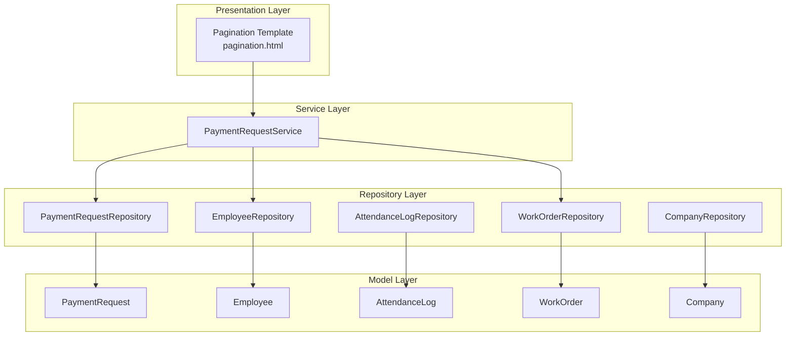
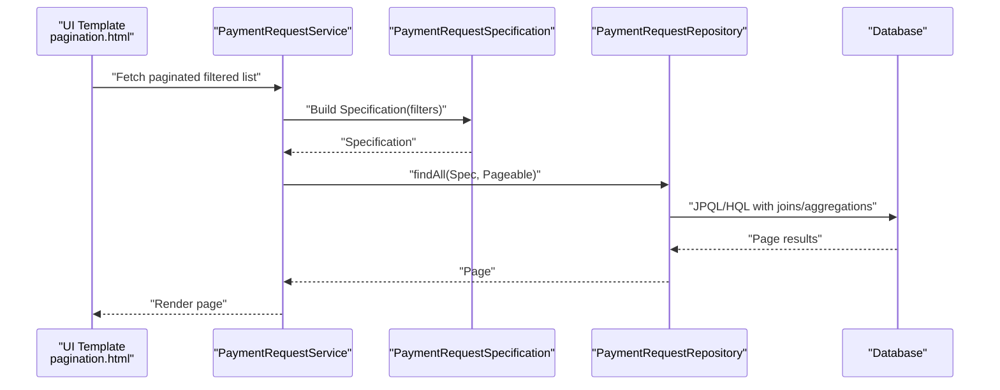
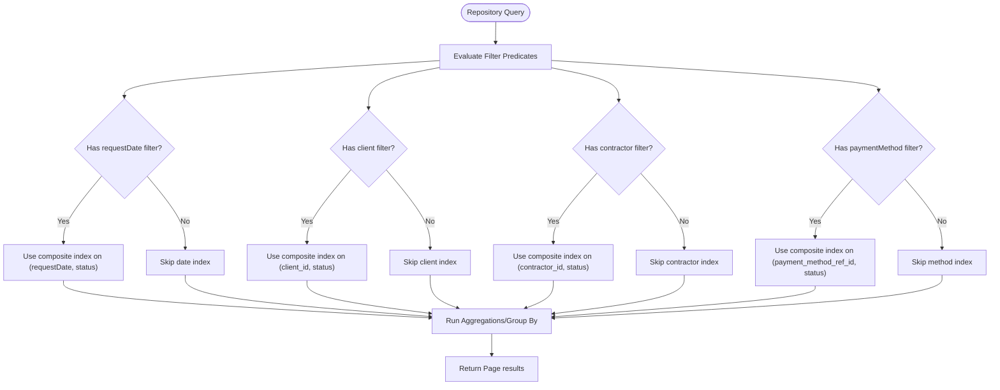
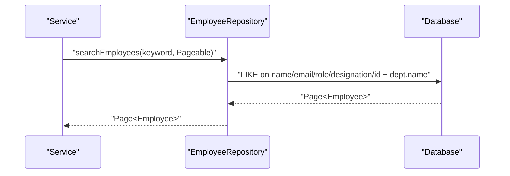
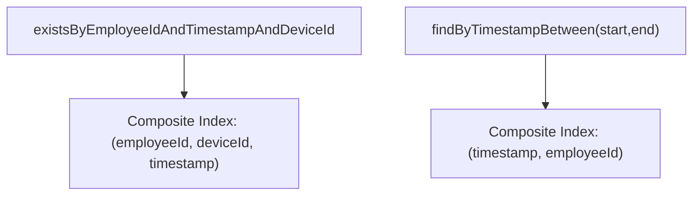
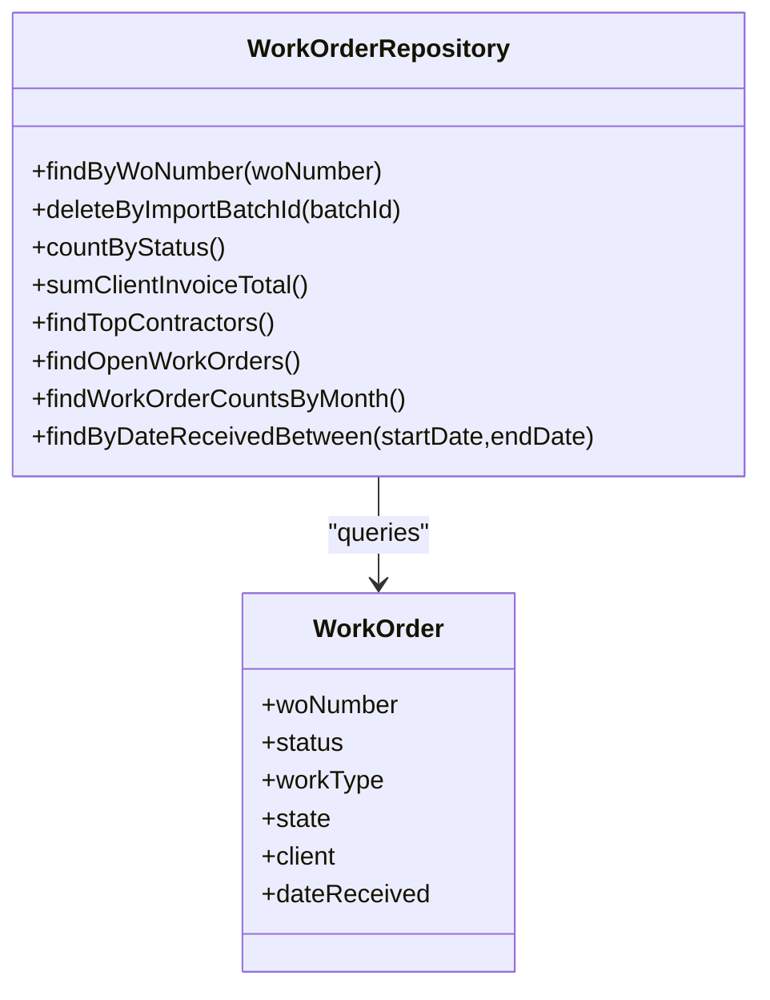
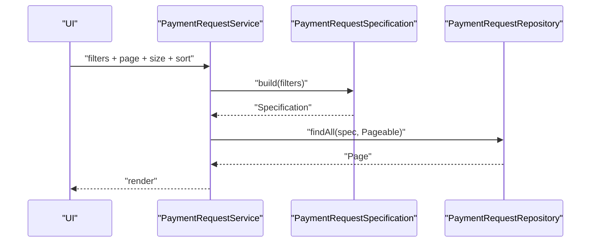
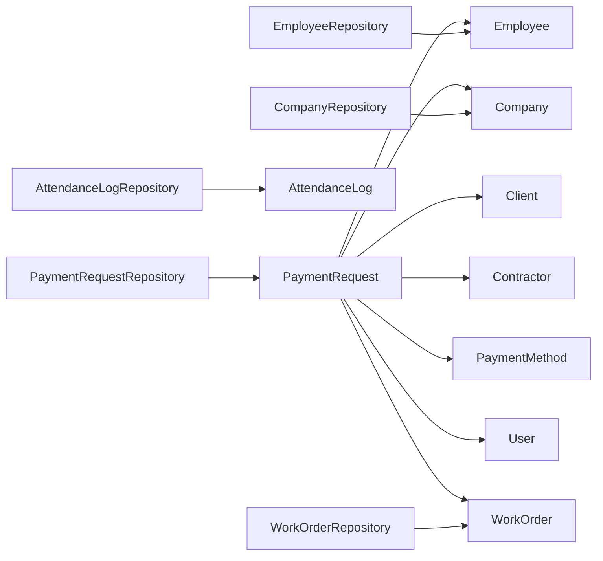

# Indexing and Performance

<cite>
**Referenced Files in This Document**
- [application.properties](file://src/main/resources/application.properties)
- [EmployeeRepository.java](file://src/main/java/root/cyb/mh/attendancesystem/repository/EmployeeRepository.java)
- [AttendanceLogRepository.java](file://src/main/java/root/cyb/mh/attendancesystem/repository/AttendanceLogRepository.java)
- [PaymentRequestRepository.java](file://src/main/java/root/cyb/mh/attendancesystem/repository/PaymentRequestRepository.java)
- [WorkOrderRepository.java](file://src/main/java/root/cyb/mh/attendancesystem/repository/WorkOrderRepository.java)
- [CompanyRepository.java](file://src/main/java/root/cyb/mh/attendancesystem/repository/CompanyRepository.java)
- [PaymentRequestService.java](file://src/main/java/root/cyb/mh/attendancesystem/service/PaymentRequestService.java)
- [PaymentRequestSpecification.java](file://src/main/java/root/cyb/mh/attendancesystem/specification/PaymentRequestSpecification.java)
- [PaymentRequest.java](file://src/main/java/root/cyb/mh/attendancesystem/model/PaymentRequest.java)
- [Employee.java](file://src/main/java/root/cyb/mh/attendancesystem/model/Employee.java)
- [AttendanceLog.java](file://src/main/java/root/cyb/mh/attendancesystem/model/AttendanceLog.java)
- [WorkOrder.java](file://src/main/java/root/cyb/mh/attendancesystem/model/WorkOrder.java)
- [Company.java](file://src/main/java/root/cyb/mh/attendancesystem/model/Company.java)
- [pagination.html](file://src/main/resources/templates/fragments/pagination.html)
</cite>

## Table of Contents
1. [Introduction](#introduction)
2. [Project Structure](#project-structure)
3. [Core Components](#core-components)
4. [Architecture Overview](#architecture-overview)
5. [Detailed Component Analysis](#detailed-component-analysis)
6. [Dependency Analysis](#dependency-analysis)
7. [Performance Considerations](#performance-considerations)
8. [Troubleshooting Guide](#troubleshooting-guide)
9. [Conclusion](#conclusion)
10. [Appendices](#appendices)

## Introduction
This document focuses on indexing and performance optimization for the Skylink Custom Backend database layer. It synthesizes repository-level query patterns, JPQL/HQL usage, pagination strategies, and service-layer orchestration to propose targeted indexing strategies, composite indexes, and performance tuning techniques. It also outlines monitoring approaches, execution plan analysis, and memory optimization for large datasets.

## Project Structure
The backend follows a layered Spring Boot architecture:
- Model layer defines entities mapped to database tables.
- Repository layer exposes typed Spring Data JPA interfaces and JPQL/HQL queries.
- Service layer orchestrates business logic and pagination/filtering.
- Templates provide pagination UI controls.

**Diagram sources**
- [pagination.html](file://src/main/resources/templates/fragments/pagination.html)
- [PaymentRequestService.java](file://src/main/java/root/cyb/mh/attendancesystem/service/PaymentRequestService.java)
- [PaymentRequestRepository.java](file://src/main/java/root/cyb/mh/attendancesystem/repository/PaymentRequestRepository.java)
- [EmployeeRepository.java](file://src/main/java/root/cyb/mh/attendancesystem/repository/EmployeeRepository.java)
- [AttendanceLogRepository.java](file://src/main/java/root/cyb/mh/attendancesystem/repository/AttendanceLogRepository.java)
- [WorkOrderRepository.java](file://src/main/java/root/cyb/mh/attendancesystem/repository/WorkOrderRepository.java)
- [CompanyRepository.java](file://src/main/java/root/cyb/mh/attendancesystem/repository/CompanyRepository.java)
- [PaymentRequest.java](file://src/main/java/root/cyb/mh/attendancesystem/model/PaymentRequest.java)
- [Employee.java](file://src/main/java/root/cyb/mh/attendancesystem/model/Employee.java)
- [AttendanceLog.java](file://src/main/java/root/cyb/mh/attendancesystem/model/AttendanceLog.java)
- [WorkOrder.java](file://src/main/java/root/cyb/mh/attendancesystem/model/WorkOrder.java)
- [Company.java](file://src/main/java/root/cyb/mh/attendancesystem/model/Company.java)

**Section sources**
- [application.properties](file://src/main/resources/application.properties)
- [PaymentRequestService.java](file://src/main/java/root/cyb/mh/attendancesystem/service/PaymentRequestService.java)
- [PaymentRequestRepository.java](file://src/main/java/root/cyb/mh/attendancesystem/repository/PaymentRequestRepository.java)
- [EmployeeRepository.java](file://src/main/java/root/cyb/mh/attendancesystem/repository/EmployeeRepository.java)
- [AttendanceLogRepository.java](file://src/main/java/root/cyb/mh/attendancesystem/repository/AttendanceLogRepository.java)
- [WorkOrderRepository.java](file://src/main/java/root/cyb/mh/attendancesystem/repository/WorkOrderRepository.java)
- [CompanyRepository.java](file://src/main/java/root/cyb/mh/attendancesystem/repository/CompanyRepository.java)
- [PaymentRequest.java](file://src/main/java/root/cyb/mh/attendancesystem/model/PaymentRequest.java)
- [Employee.java](file://src/main/java/root/cyb/mh/attendancesystem/model/Employee.java)
- [AttendanceLog.java](file://src/main/java/root/cyb/mh/attendancesystem/model/AttendanceLog.java)
- [WorkOrder.java](file://src/main/java/root/cyb/mh/attendancesystem/model/WorkOrder.java)
- [Company.java](file://src/main/java/root/cyb/mh/attendancesystem/model/Company.java)
- [pagination.html](file://src/main/resources/templates/fragments/pagination.html)

## Core Components
- PaymentRequestRepository: Extends JpaSpecificationExecutor and defines numerous JPQL/HQL queries for filtering, aggregation, and analytics. It is central to performance-critical dashboards and reporting.
- EmployeeRepository: Provides lookup by department, supervisor relationships, and search with LIKE patterns.
- AttendanceLogRepository: Supports existence checks and time-range scans.
- WorkOrderRepository: Uses JPQL for counts, sums, and grouped analytics.
- CompanyRepository: Filters active companies.
- PaymentRequestService: Orchestrates pagination, sorting, and filtering via Specification and repository queries.
- PaymentRequestSpecification: Builds dynamic filter predicates for PaymentRequestRepository.

Key performance-relevant observations:
- Heavy use of JPQL/HQL with joins and aggregations.
- Existence checks and range scans on temporal fields.
- Dynamic filters with optional parameters.
- Pagination via Pageable and Page implementations.

**Section sources**
- [PaymentRequestRepository.java](file://src/main/java/root/cyb/mh/attendancesystem/repository/PaymentRequestRepository.java)
- [EmployeeRepository.java](file://src/main/java/root/cyb/mh/attendancesystem/repository/EmployeeRepository.java)
- [AttendanceLogRepository.java](file://src/main/java/root/cyb/mh/attendancesystem/repository/AttendanceLogRepository.java)
- [WorkOrderRepository.java](file://src/main/java/root/cyb/mh/attendancesystem/repository/WorkOrderRepository.java)
- [CompanyRepository.java](file://src/main/java/root/cyb/mh/attendancesystem/repository/CompanyRepository.java)
- [PaymentRequestService.java](file://src/main/java/root/cyb/mh/attendancesystem/service/PaymentRequestService.java)
- [PaymentRequestSpecification.java](file://src/main/java/root/cyb/mh/attendancesystem/specification/PaymentRequestSpecification.java)

## Architecture Overview
The database layer relies on Spring Data JPA with JPQL/HQL and Criteria Specifications. Queries target entities with foreign keys and date ranges, often requiring composite indexes for optimal performance.

**Diagram sources**
- [pagination.html](file://src/main/resources/templates/fragments/pagination.html)
- [PaymentRequestService.java](file://src/main/java/root/cyb/mh/attendancesystem/service/PaymentRequestService.java)
- [PaymentRequestSpecification.java](file://src/main/java/root/cyb/mh/attendancesystem/specification/PaymentRequestSpecification.java)
- [PaymentRequestRepository.java](file://src/main/java/root/cyb/mh/attendancesystem/repository/PaymentRequestRepository.java)

## Detailed Component Analysis

### PaymentRequestRepository: Queries, Patterns, and Optimization Opportunities
- Filtering and aggregations dominate this repository. Examples include:
  - Date-based filters and aggregations (requestDate).
  - Joined filters on client, contractor, paymentMethod, requester (User/Employee).
  - Group-by analytics and ranking queries.
  - Native queries for day-of-week distributions and PostgreSQL-specific functions.
- JPQL/HQL patterns:
  - JOINs with entity associations.
  - Aggregate functions (COUNT, SUM, AVG, GROUP BY).
  - Parameterized queries with Pageable for pagination.
- Optimization opportunities:
  - Composite indexes for frequent filter combinations.
  - Denormalized columns for analytics (e.g., client_id, contractor_id, payment_method_ref_id) to avoid expensive joins in hot paths.
  - Materialized summaries for frequently accessed dashboards.

**Diagram sources**
- [PaymentRequestRepository.java](file://src/main/java/root/cyb/mh/attendancesystem/repository/PaymentRequestRepository.java)
- [PaymentRequest.java](file://src/main/java/root/cyb/mh/attendancesystem/model/PaymentRequest.java)

**Section sources**
- [PaymentRequestRepository.java](file://src/main/java/root/cyb/mh/attendancesystem/repository/PaymentRequestRepository.java)
- [PaymentRequest.java](file://src/main/java/root/cyb/mh/attendancesystem/model/PaymentRequest.java)

### EmployeeRepository: Search, Supervisor, and Department Queries
- Search across multiple fields with LIKE patterns and lowercasing.
- Supervisor relationship queries using OR conditions on primary and assistant supervisors.
- Department-based filtering.

Optimization opportunities:
- Full-text search or GIN/GiST indexes if supported by the database.
- Composite indexes for (department_id, id) for department-scoped lookups.
- Consider materialized supervisor hierarchies for deep trees.

**Diagram sources**
- [EmployeeRepository.java](file://src/main/java/root/cyb/mh/attendancesystem/repository/EmployeeRepository.java)

**Section sources**
- [EmployeeRepository.java](file://src/main/java/root/cyb/mh/attendancesystem/repository/EmployeeRepository.java)
- [Employee.java](file://src/main/java/root/cyb/mh/attendancesystem/model/Employee.java)

### AttendanceLogRepository: Temporal Range and Existence Checks
- Existence checks on (employeeId, timestamp, deviceId).
- Range scans on timestamp.

Optimization opportunities:
- Composite index on (employeeId, timestamp) for range scans.
- Composite index on (employeeId, deviceId, timestamp) for uniqueness and existence checks.

**Diagram sources**
- [AttendanceLogRepository.java](file://src/main/java/root/cyb/mh/attendancesystem/repository/AttendanceLogRepository.java)
- [AttendanceLog.java](file://src/main/java/root/cyb/mh/attendancesystem/model/AttendanceLog.java)

**Section sources**
- [AttendanceLogRepository.java](file://src/main/java/root/cyb/mh/attendancesystem/repository/AttendanceLogRepository.java)
- [AttendanceLog.java](file://src/main/java/root/cyb/mh/attendancesystem/model/AttendanceLog.java)

### WorkOrderRepository: Aggregation and Status Analytics
- Aggregations by status, state, workType, and client.
- Date range filtering and grouped analytics.

Optimization opportunities:
- Composite indexes for (status, id), (state, id), (workType, id), (client_id, id).
- Consider partial indexes for open/closed statuses.

**Diagram sources**
- [WorkOrderRepository.java](file://src/main/java/root/cyb/mh/attendancesystem/repository/WorkOrderRepository.java)
- [WorkOrder.java](file://src/main/java/root/cyb/mh/attendancesystem/model/WorkOrder.java)

**Section sources**
- [WorkOrderRepository.java](file://src/main/java/root/cyb/mh/attendancesystem/repository/WorkOrderRepository.java)
- [WorkOrder.java](file://src/main/java/root/cyb/mh/attendancesystem/model/WorkOrder.java)

### CompanyRepository: Active Companies
- Filters active companies.

Optimization opportunity:
- Index on (active) if not already present.

**Section sources**
- [CompanyRepository.java](file://src/main/java/root/cyb/mh/attendancesystem/repository/CompanyRepository.java)
- [Company.java](file://src/main/java/root/cyb/mh/attendancesystem/model/Company.java)

### PaymentRequestService and Specification: Dynamic Filtering and Pagination
- Service composes Specification from UI filters and applies Pageable.
- Sorting handled in-memory for non-indexable fields.

Optimization opportunities:
- Move sortable fields to database-backed columns and add indexes.
- Limit in-memory sorting to small result sets; rely on database ordering for large pages.

**Diagram sources**
- [PaymentRequestService.java](file://src/main/java/root/cyb/mh/attendancesystem/service/PaymentRequestService.java)
- [PaymentRequestSpecification.java](file://src/main/java/root/cyb/mh/attendancesystem/specification/PaymentRequestSpecification.java)
- [PaymentRequestRepository.java](file://src/main/java/root/cyb/mh/attendancesystem/repository/PaymentRequestRepository.java)

**Section sources**
- [PaymentRequestService.java](file://src/main/java/root/cyb/mh/attendancesystem/service/PaymentRequestService.java)
- [PaymentRequestSpecification.java](file://src/main/java/root/cyb/mh/attendancesystem/specification/PaymentRequestSpecification.java)

## Dependency Analysis
Repositories depend on entities and each other indirectly via joins and relations. The PaymentRequestRepository is the most complex and performance-sensitive.

**Diagram sources**
- [PaymentRequest.java](file://src/main/java/root/cyb/mh/attendancesystem/model/PaymentRequest.java)
- [Employee.java](file://src/main/java/root/cyb/mh/attendancesystem/model/Employee.java)
- [AttendanceLog.java](file://src/main/java/root/cyb/mh/attendancesystem/model/AttendanceLog.java)
- [WorkOrder.java](file://src/main/java/root/cyb/mh/attendancesystem/model/WorkOrder.java)
- [Company.java](file://src/main/java/root/cyb/mh/attendancesystem/model/Company.java)
- [PaymentRequestRepository.java](file://src/main/java/root/cyb/mh/attendancesystem/repository/PaymentRequestRepository.java)
- [EmployeeRepository.java](file://src/main/java/root/cyb/mh/attendancesystem/repository/EmployeeRepository.java)
- [AttendanceLogRepository.java](file://src/main/java/root/cyb/mh/attendancesystem/repository/AttendanceLogRepository.java)
- [WorkOrderRepository.java](file://src/main/java/root/cyb/mh/attendancesystem/repository/WorkOrderRepository.java)
- [CompanyRepository.java](file://src/main/java/root/cyb/mh/attendancesystem/repository/CompanyRepository.java)

**Section sources**
- [PaymentRequestRepository.java](file://src/main/java/root/cyb/mh/attendancesystem/repository/PaymentRequestRepository.java)
- [EmployeeRepository.java](file://src/main/java/root/cyb/mh/attendancesystem/repository/EmployeeRepository.java)
- [AttendanceLogRepository.java](file://src/main/java/root/cyb/mh/attendancesystem/repository/AttendanceLogRepository.java)
- [WorkOrderRepository.java](file://src/main/java/root/cyb/mh/attendancesystem/repository/WorkOrderRepository.java)
- [CompanyRepository.java](file://src/main/java/root/cyb/mh/attendancesystem/repository/CompanyRepository.java)
- [PaymentRequest.java](file://src/main/java/root/cyb/mh/attendancesystem/model/PaymentRequest.java)
- [Employee.java](file://src/main/java/root/cyb/mh/attendancesystem/model/Employee.java)
- [AttendanceLog.java](file://src/main/java/root/cyb/mh/attendancesystem/model/AttendanceLog.java)
- [WorkOrder.java](file://src/main/java/root/cyb/mh/attendancesystem/model/WorkOrder.java)
- [Company.java](file://src/main/java/root/cyb/mh/attendancesystem/model/Company.java)

## Performance Considerations

### Indexing Strategies
- Frequently queried columns:
  - PaymentRequest.requestDate
  - PaymentRequest.status
  - PaymentRequest.client_id
  - PaymentRequest.contractor_id
  - PaymentRequest.payment_method_ref_id
  - PaymentRequest.workOrderNumber
  - Employee.department_id
  - AttendanceLog.employeeId
  - AttendanceLog.timestamp
  - AttendanceLog.deviceId
  - WorkOrder.status
  - WorkOrder.state
  - WorkOrder.workType
  - WorkOrder.client_id
  - WorkOrder.dateReceived
  - Company.active
- Composite indexes:
  - PaymentRequest: (requestDate, status), (client_id, status), (contractor_id, status), (payment_method_ref_id, status)
  - AttendanceLog: (employeeId, timestamp), (employeeId, deviceId, timestamp)
  - WorkOrder: (status, id), (state, id), (workType, id), (client_id, id)
  - Employee: (department_id, id)
  - Company: (active, id)
- Additional suggestions:
  - Consider partial indexes for common filters (e.g., status IN ('Closed','Complete'), active = true).
  - Denormalize frequently joined fields for analytics queries to reduce JOINs.

### JPQL/HQL Optimization
- Prefer selective projections and limit columns in queries.
- Use EXISTS for existence checks instead of fetching rows.
- Avoid SELECT DISTINCT unless necessary.
- Use Pageable with database-side sorting for sortable fields backed by indexes.

### Pagination and Memory Optimization
- UI pagination controls adjust page size; keep sizes reasonable (e.g., 25–100).
- Prefer server-side sorting and filtering over in-memory operations.
- For large datasets, consider cursor-based pagination or keyset pagination to avoid deep pagination costs.

### Monitoring and Execution Plan Analysis
- Enable SQL logging and slow query logs in the active profile.
- Capture execution plans for:
  - PaymentRequestRepository queries with filters on client, contractor, paymentMethod, and date ranges.
  - EmployeeRepository search queries.
  - AttendanceLogRepository range scans.
  - WorkOrderRepository analytics queries.
- Look for:
  - Missing index warnings.
  - Table scans on large tables.
  - Expensive sorts or hash aggregates.
- Use database-specific EXPLAIN/EXPLAIN ANALYZE to guide index creation.

### Bottleneck Identification
- Hotspots:
  - PaymentRequestRepository analytics queries with GROUP BY and ORDER BY.
  - EmployeeRepository LIKE-based search across multiple fields.
  - AttendanceLogRepository range scans.
  - WorkOrderRepository grouped analytics.
- Remediation:
  - Add composite indexes for filter/sort combinations.
  - Reduce projection size for analytics.
  - Batch updates/deletes for legacy cleanup operations.

[No sources needed since this section provides general guidance]

## Troubleshooting Guide
- Slow search results:
  - Verify LIKE patterns are not preventing index usage; consider full-text search or GIN/GiST indexes.
- Excessive memory usage on large pages:
  - Reduce page size; move sorting to database-backed columns.
- Missing indexes:
  - Review execution plans for seq scans on large tables; add composite indexes for frequent filter combinations.
- Inefficient analytics:
  - Replace expensive GROUP BY queries with precomputed summaries or denormalized columns.

**Section sources**
- [PaymentRequestRepository.java](file://src/main/java/root/cyb/mh/attendancesystem/repository/PaymentRequestRepository.java)
- [EmployeeRepository.java](file://src/main/java/root/cyb/mh/attendancesystem/repository/EmployeeRepository.java)
- [AttendanceLogRepository.java](file://src/main/java/root/cyb/mh/attendancesystem/repository/AttendanceLogRepository.java)
- [WorkOrderRepository.java](file://src/main/java/root/cyb/mh/attendancesystem/repository/WorkOrderRepository.java)
- [pagination.html](file://src/main/resources/templates/fragments/pagination.html)

## Conclusion
Optimizing the Skylink Custom Backend database layer hinges on targeted composite indexes aligned with repository query patterns, JPQL/HQL refinement, and disciplined pagination and sorting. Monitoring execution plans and iteratively adding indexes for high-impact queries will yield significant performance improvements, especially for analytics-heavy dashboards and search features.

[No sources needed since this section summarizes without analyzing specific files]

## Appendices

### Appendix A: Repository Method Naming Conventions Observed
- findByXxx: Single-property equality filters.
- findByXxxAndYyy: Composite equality filters.
- findByXxxBetween: Range filters.
- existsByXxx: Existence checks.
- findTopNBy...: Top-N queries.
- findByXxxOrderByYyyDesc: Sort with limit.
- findAllByOrderBy...: Global sort.
- countByXxx: Aggregations returning counts.
- sumAmountByXxx: Aggregations returning sums.

These conventions align with Spring Data JPA expectations and enable efficient query generation.

**Section sources**
- [PaymentRequestRepository.java](file://src/main/java/root/cyb/mh/attendancesystem/repository/PaymentRequestRepository.java)
- [EmployeeRepository.java](file://src/main/java/root/cyb/mh/attendancesystem/repository/EmployeeRepository.java)
- [AttendanceLogRepository.java](file://src/main/java/root/cyb/mh/attendancesystem/repository/AttendanceLogRepository.java)
- [WorkOrderRepository.java](file://src/main/java/root/cyb/mh/attendancesystem/repository/WorkOrderRepository.java)
- [CompanyRepository.java](file://src/main/java/root/cyb/mh/attendancesystem/repository/CompanyRepository.java)