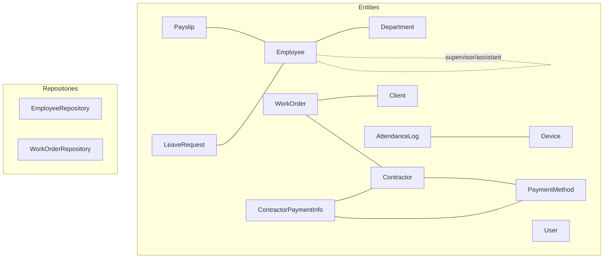
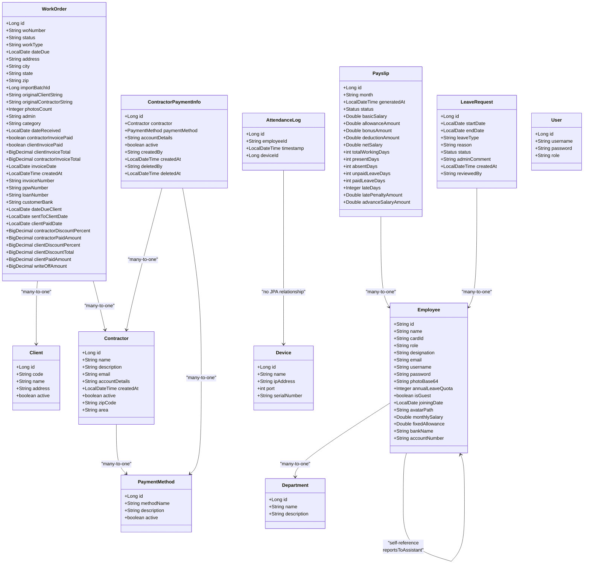
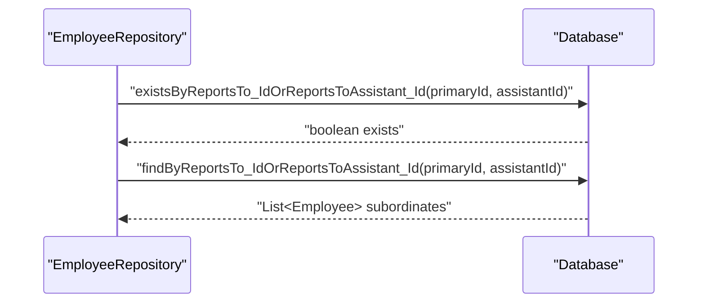
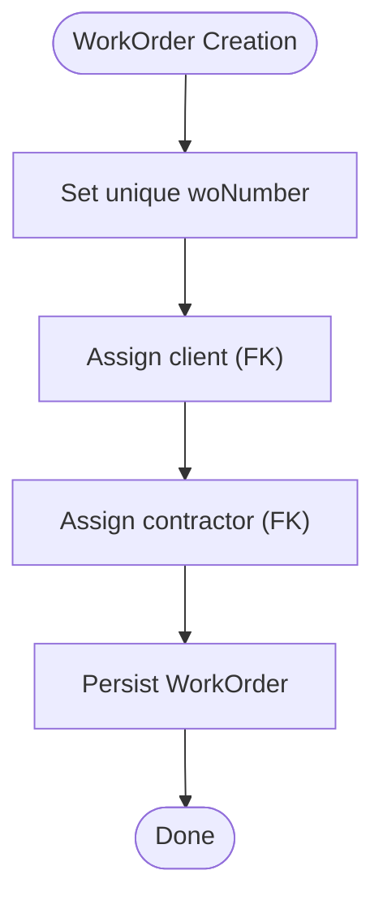
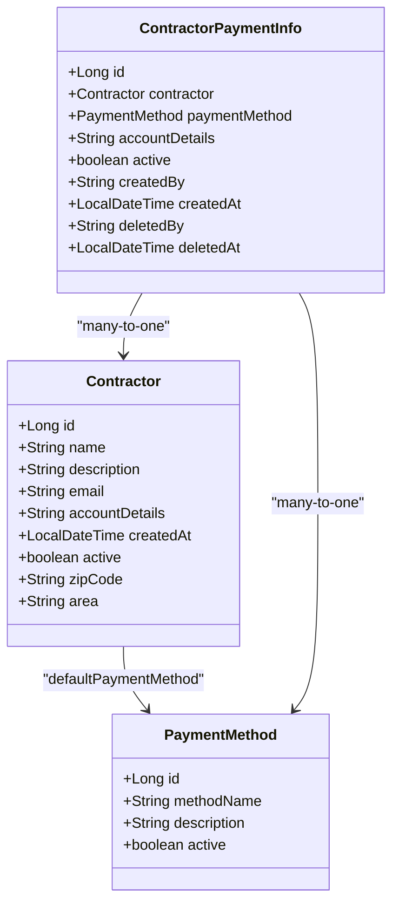
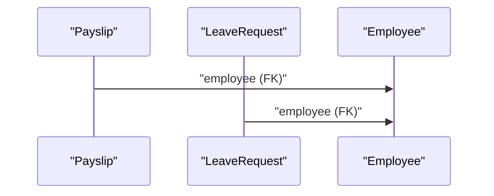
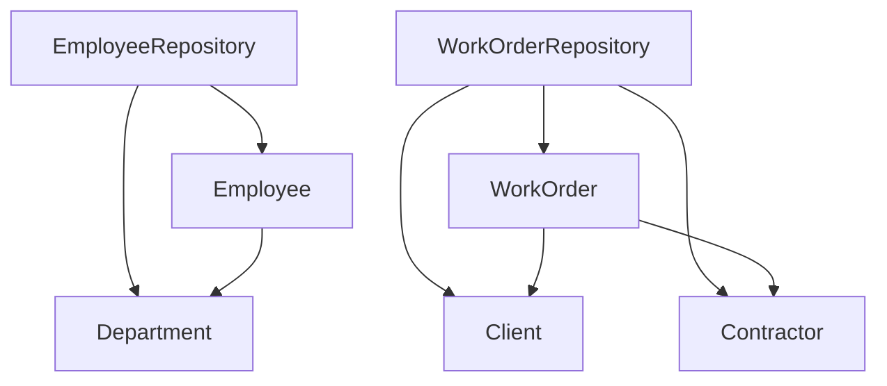

# Relationships and Constraints

<cite>
**Referenced Files in This Document**
- [Employee.java](file://src/main/java/root/cyb/mh/attendancesystem/model/Employee.java)
- [Department.java](file://src/main/java/root/cyb/mh/attendancesystem/model/Department.java)
- [User.java](file://src/main/java/root/cyb/mh/attendancesystem/model/User.java)
- [Client.java](file://src/main/java/root/cyb/mh/attendancesystem/model/Client.java)
- [Contractor.java](file://src/main/java/root/cyb/mh/attendancesystem/model/Contractor.java)
- [ContractorPaymentInfo.java](file://src/main/java/root/cyb/mh/attendancesystem/model/ContractorPaymentInfo.java)
- [PaymentMethod.java](file://src/main/java/root/cyb/mh/attendancesystem/model/PaymentMethod.java)
- [WorkOrder.java](file://src/main/java/root/cyb/mh/attendancesystem/model/WorkOrder.java)
- [Payslip.java](file://src/main/java/root/cyb/mh/attendancesystem/model/Payslip.java)
- [LeaveRequest.java](file://src/main/java/root/cyb/mh/attendancesystem/model/LeaveRequest.java)
- [AttendanceLog.java](file://src/main/java/root/cyb/mh/attendancesystem/model/AttendanceLog.java)
- [Device.java](file://src/main/java/root/cyb/mh/attendancesystem/model/Device.java)
- [EmployeeRepository.java](file://src/main/java/root/cyb/mh/attendancesystem/repository/EmployeeRepository.java)
- [WorkOrderRepository.java](file://src/main/java/root/cyb/mh/attendancesystem/repository/WorkOrderRepository.java)
</cite>

## Table of Contents
1. [Introduction](#introduction)
2. [Project Structure](#project-structure)
3. [Core Components](#core-components)
4. [Architecture Overview](#architecture-overview)
5. [Detailed Component Analysis](#detailed-component-analysis)
6. [Dependency Analysis](#dependency-analysis)
7. [Performance Considerations](#performance-considerations)
8. [Troubleshooting Guide](#troubleshooting-guide)
9. [Conclusion](#conclusion)

## Introduction
This document focuses on the database relationships and constraints implemented in the Skylink Custom Backend. It explains foreign keys, cascade behavior, referential integrity rules, and how many-to-one, one-to-many, and many-to-many relationships are modeled via JPA annotations. Practical examples illustrate constraints such as unique identifiers, non-null fields, and defaults. We also outline relationship mapping patterns, join table configurations, and query optimization strategies derived from repository usage.

## Project Structure
The persistence layer is organized around entity models under the model package and repositories under repository. Entities define relationships and constraints; repositories expose queries that leverage these relationships for reporting and filtering.

**Diagram sources**
- [Employee.java:1-64](file://src/main/java/root/cyb/mh/attendancesystem/model/Employee.java#L1-L64)
- [Department.java:1-22](file://src/main/java/root/cyb/mh/attendancesystem/model/Department.java#L1-L22)
- [User.java:1-24](file://src/main/java/root/cyb/mh/attendancesystem/model/User.java#L1-L24)
- [Client.java:1-25](file://src/main/java/root/cyb/mh/attendancesystem/model/Client.java#L1-L25)
- [Contractor.java:1-49](file://src/main/java/root/cyb/mh/attendancesystem/model/Contractor.java#L1-L49)
- [ContractorPaymentInfo.java:1-39](file://src/main/java/root/cyb/mh/attendancesystem/model/ContractorPaymentInfo.java#L1-L39)
- [PaymentMethod.java:1-22](file://src/main/java/root/cyb/mh/attendancesystem/model/PaymentMethod.java#L1-L22)
- [WorkOrder.java:1-109](file://src/main/java/root/cyb/mh/attendancesystem/model/WorkOrder.java#L1-L109)
- [Payslip.java:1-57](file://src/main/java/root/cyb/mh/attendancesystem/model/Payslip.java#L1-L57)
- [LeaveRequest.java:1-54](file://src/main/java/root/cyb/mh/attendancesystem/model/LeaveRequest.java#L1-L54)
- [AttendanceLog.java:1-27](file://src/main/java/root/cyb/mh/attendancesystem/model/AttendanceLog.java#L1-L27)
- [Device.java:1-26](file://src/main/java/root/cyb/mh/attendancesystem/model/Device.java#L1-L26)
- [EmployeeRepository.java:1-32](file://src/main/java/root/cyb/mh/attendancesystem/repository/EmployeeRepository.java#L1-L32)
- [WorkOrderRepository.java:1-80](file://src/main/java/root/cyb/mh/attendancesystem/repository/WorkOrderRepository.java#L1-L80)

**Section sources**
- [Employee.java:1-64](file://src/main/java/root/cyb/mh/attendancesystem/model/Employee.java#L1-L64)
- [WorkOrder.java:1-109](file://src/main/java/root/cyb/mh/attendancesystem/model/WorkOrder.java#L1-L109)
- [EmployeeRepository.java:1-32](file://src/main/java/root/cyb/mh/attendancesystem/repository/EmployeeRepository.java#L1-L32)
- [WorkOrderRepository.java:1-80](file://src/main/java/root/cyb/mh/attendancesystem/repository/WorkOrderRepository.java#L1-L80)

## Core Components
This section summarizes the principal entities and their constraints, focusing on foreign keys, uniqueness, and defaults.

- Employee
  - Many-to-one to Department via a reference field.
  - Self-referencing many-to-one for supervisor and assistant roles.
  - Non-business columns include username/password and optional photo storage.
- Department
  - Identity-generated numeric primary key.
- WorkOrder
  - Unique, non-null work order number.
  - Many-to-one to Client and Contractor via explicit join columns.
  - Timestamps and financial fields; lifecycle fields for invoice statuses.
- Client
  - Unique, non-null code; non-null name; active flag.
- Contractor
  - Unique, non-null name; optional default payment method; collection of payment info records.
- ContractorPaymentInfo
  - Many-to-one to Contractor and PaymentMethod; active flag and audit timestamps.
- PaymentMethod
  - Unique, non-null method name; active flag.
- Payslip
  - Many-to-one to Employee; non-null employee FK; status enumeration; financial and attendance metrics.
- LeaveRequest
  - Many-to-one to Employee; non-null dates and status enumeration.
- AttendanceLog
  - No JPA entity relationships; stores raw attendance events with device association.
- Device
  - No JPA entity relationships; stores device metadata.
- User
  - Unique, non-null username; non-null password and role.

**Section sources**
- [Employee.java:1-64](file://src/main/java/root/cyb/mh/attendancesystem/model/Employee.java#L1-L64)
- [Department.java:1-22](file://src/main/java/root/cyb/mh/attendancesystem/model/Department.java#L1-L22)
- [WorkOrder.java:1-109](file://src/main/java/root/cyb/mh/attendancesystem/model/WorkOrder.java#L1-L109)
- [Client.java:1-25](file://src/main/java/root/cyb/mh/attendancesystem/model/Client.java#L1-L25)
- [Contractor.java:1-49](file://src/main/java/root/cyb/mh/attendancesystem/model/Contractor.java#L1-L49)
- [ContractorPaymentInfo.java:1-39](file://src/main/java/root/cyb/mh/attendancesystem/model/ContractorPaymentInfo.java#L1-L39)
- [PaymentMethod.java:1-22](file://src/main/java/root/cyb/mh/attendancesystem/model/PaymentMethod.java#L1-L22)
- [Payslip.java:1-57](file://src/main/java/root/cyb/mh/attendancesystem/model/Payslip.java#L1-L57)
- [LeaveRequest.java:1-54](file://src/main/java/root/cyb/mh/attendancesystem/model/LeaveRequest.java#L1-L54)
- [AttendanceLog.java:1-27](file://src/main/java/root/cyb/mh/attendancesystem/model/AttendanceLog.java#L1-L27)
- [Device.java:1-26](file://src/main/java/root/cyb/mh/attendancesystem/model/Device.java#L1-L26)
- [User.java:1-24](file://src/main/java/root/cyb/mh/attendancesystem/model/User.java#L1-L24)

## Architecture Overview
The persistence layer follows a classic JPA/Hibernate pattern:
- Entities define relationships and constraints.
- Repositories encapsulate queries and aggregations.
- Cascading and orphan removal are configured per entity where applicable.

**Diagram sources**
- [Employee.java:1-64](file://src/main/java/root/cyb/mh/attendancesystem/model/Employee.java#L1-L64)
- [Department.java:1-22](file://src/main/java/root/cyb/mh/attendancesystem/model/Department.java#L1-L22)
- [Payslip.java:1-57](file://src/main/java/root/cyb/mh/attendancesystem/model/Payslip.java#L1-L57)
- [LeaveRequest.java:1-54](file://src/main/java/root/cyb/mh/attendancesystem/model/LeaveRequest.java#L1-L54)
- [WorkOrder.java:1-109](file://src/main/java/root/cyb/mh/attendancesystem/model/WorkOrder.java#L1-L109)
- [Client.java:1-25](file://src/main/java/root/cyb/mh/attendancesystem/model/Client.java#L1-L25)
- [Contractor.java:1-49](file://src/main/java/root/cyb/mh/attendancesystem/model/Contractor.java#L1-L49)
- [ContractorPaymentInfo.java:1-39](file://src/main/java/root/cyb/mh/attendancesystem/model/ContractorPaymentInfo.java#L1-L39)
- [PaymentMethod.java:1-22](file://src/main/java/root/cyb/mh/attendancesystem/model/PaymentMethod.java#L1-L22)
- [AttendanceLog.java:1-27](file://src/main/java/root/cyb/mh/attendancesystem/model/AttendanceLog.java#L1-L27)
- [Device.java:1-26](file://src/main/java/root/cyb/mh/attendancesystem/model/Device.java#L1-L26)
- [User.java:1-24](file://src/main/java/root/cyb/mh/attendancesystem/model/User.java#L1-L24)

## Detailed Component Analysis

### Employee and Department (Many-to-One, Self-References)
- Many-to-one: Employee belongs to Department.
- Self-referencing many-to-one: Employee can have a supervisor and an assistant supervisor.
- Business implications:
  - Hierarchical reporting requires referential integrity for supervisor/assistant IDs.
  - Queries in the repository demonstrate existence checks and subordinates retrieval using OR conditions across both supervisor fields.

**Diagram sources**
- [EmployeeRepository.java:15-19](file://src/main/java/root/cyb/mh/attendancesystem/repository/EmployeeRepository.java#L15-L19)

**Section sources**
- [Employee.java:22-29](file://src/main/java/root/cyb/mh/attendancesystem/model/Employee.java#L22-L29)
- [EmployeeRepository.java:15-19](file://src/main/java/root/cyb/mh/attendancesystem/repository/EmployeeRepository.java#L15-L19)

### WorkOrder Relationships (Many-to-One to Client and Contractor)
- Unique, non-null work order number enforces uniqueness at the database level.
- Many-to-one to Client and Contractor via explicit join columns.
- Additional fields support invoicing and lifecycle tracking.

**Diagram sources**
- [WorkOrder.java:17-37](file://src/main/java/root/cyb/mh/attendancesystem/model/WorkOrder.java#L17-L37)

**Section sources**
- [WorkOrder.java:17-37](file://src/main/java/root/cyb/mh/attendancesystem/model/WorkOrder.java#L17-L37)

### Contractor and PaymentMethod (Many-to-One)
- Contractor has a many-to-one relationship to PaymentMethod via a default payment method.
- ContractorPaymentInfo also has a many-to-one to PaymentMethod and to Contractor.
- Cascade and orphan removal are not declared on Contractor’s collection in the provided model; therefore, cascading behavior for this collection is not implied by the model.

**Diagram sources**
- [Contractor.java:23-25](file://src/main/java/root/cyb/mh/attendancesystem/model/Contractor.java#L23-L25)
- [ContractorPaymentInfo.java:14-21](file://src/main/java/root/cyb/mh/attendancesystem/model/ContractorPaymentInfo.java#L14-L21)
- [PaymentMethod.java:1-22](file://src/main/java/root/cyb/mh/attendancesystem/model/PaymentMethod.java#L1-L22)

**Section sources**
- [Contractor.java:23-31](file://src/main/java/root/cyb/mh/attendancesystem/model/Contractor.java#L23-L31)
- [ContractorPaymentInfo.java:14-21](file://src/main/java/root/cyb/mh/attendancesystem/model/ContractorPaymentInfo.java#L14-L21)

### Payslip and LeaveRequest (Many-to-One to Employee)
- Payslip and LeaveRequest both establish many-to-one relationships to Employee via explicit join columns.
- These relationships enforce referential integrity ensuring that payroll and leave records belong to existing employees.

**Diagram sources**
- [Payslip.java:20-22](file://src/main/java/root/cyb/mh/attendancesystem/model/Payslip.java#L20-L22)
- [LeaveRequest.java:21-23](file://src/main/java/root/cyb/mh/attendancesystem/model/LeaveRequest.java#L21-L23)

**Section sources**
- [Payslip.java:20-22](file://src/main/java/root/cyb/mh/attendancesystem/model/Payslip.java#L20-L22)
- [LeaveRequest.java:21-23](file://src/main/java/root/cyb/mh/attendancesystem/model/LeaveRequest.java#L21-L23)

### AttendanceLog and Device (No JPA Relationship)
- AttendanceLog stores raw event data with device identifiers but does not declare a JPA relationship to Device.
- This implies either a separate lookup mechanism or application-level joins when needed.

**Section sources**
- [AttendanceLog.java:1-27](file://src/main/java/root/cyb/mh/attendancesystem/model/AttendanceLog.java#L1-L27)
- [Device.java:1-26](file://src/main/java/root/cyb/mh/attendancesystem/model/Device.java#L1-L26)

### User (Application Users)
- Unique, non-null username; non-null password and role.
- Used for authentication and authorization; not directly related to Employees in the model.

**Section sources**
- [User.java:15-22](file://src/main/java/root/cyb/mh/attendancesystem/model/User.java#L15-L22)

## Dependency Analysis
This section maps repository-level dependencies and how they rely on entity relationships.

**Diagram sources**
- [EmployeeRepository.java:1-32](file://src/main/java/root/cyb/mh/attendancesystem/repository/EmployeeRepository.java#L1-L32)
- [WorkOrderRepository.java:1-80](file://src/main/java/root/cyb/mh/attendancesystem/repository/WorkOrderRepository.java#L1-L80)
- [Employee.java:1-64](file://src/main/java/root/cyb/mh/attendancesystem/model/Employee.java#L1-L64)
- [Department.java:1-22](file://src/main/java/root/cyb/mh/attendancesystem/model/Department.java#L1-L22)
- [WorkOrder.java:1-109](file://src/main/java/root/cyb/mh/attendancesystem/model/WorkOrder.java#L1-L109)
- [Client.java:1-25](file://src/main/java/root/cyb/mh/attendancesystem/model/Client.java#L1-L25)
- [Contractor.java:1-49](file://src/main/java/root/cyb/mh/attendancesystem/model/Contractor.java#L1-L49)

**Section sources**
- [EmployeeRepository.java:1-32](file://src/main/java/root/cyb/mh/attendancesystem/repository/EmployeeRepository.java#L1-L32)
- [WorkOrderRepository.java:1-80](file://src/main/java/root/cyb/mh/attendancesystem/repository/WorkOrderRepository.java#L1-L80)

## Performance Considerations
- Index-friendly queries:
  - WorkOrderRepository exposes grouped and aggregated queries by status, state, work type, and revenue. These benefit from appropriate database indexes on frequently filtered/sorted columns (status, state, workType, client, contractor, invoice dates).
- Fetch strategies:
  - ContractorPaymentInfo declares lazy fetch for the contractor side and eager for payment method. This reduces unnecessary contractor loading while ensuring payment method details are available when accessed.
- Projection and grouping:
  - Repositories use projections (lists of object arrays) for counts and sums, minimizing payload sizes for reporting endpoints.
- Search optimization:
  - EmployeeRepository performs a full-text-style search across multiple fields with a LEFT JOIN to Department. Consider indexing name/email/role/designation/id and department name for improved performance.

[No sources needed since this section provides general guidance]

## Troubleshooting Guide
- Unique constraint violations:
  - WorkOrder woNumber and Client code are unique. Attempting to insert duplicates triggers a unique constraint violation at persistence time.
- Not-null violations:
  - WorkOrder woNumber, Client code/name, and LeaveRequest start/end dates are non-null. Inserting nulls raises a not-null constraint violation.
- Cascade behavior:
  - Contractor’s collection of ContractorPaymentInfo is defined with a bidirectional relationship but no cascade on the owning side in the provided model. Deleting a Contractor may require explicit handling of its payment infos depending on downstream logic.
- Self-reference integrity:
  - Supervisor/assistant self-references in Employee rely on external validation to prevent cycles and ensure referential integrity.

**Section sources**
- [WorkOrder.java:17-18](file://src/main/java/root/cyb/mh/attendancesystem/model/WorkOrder.java#L17-L18)
- [Client.java:14-15](file://src/main/java/root/cyb/mh/attendancesystem/model/Client.java#L14-L15)
- [LeaveRequest.java:25-29](file://src/main/java/root/cyb/mh/attendancesystem/model/LeaveRequest.java#L25-L29)
- [Contractor.java:30-31](file://src/main/java/root/cyb/mh/attendancesystem/model/Contractor.java#L30-L31)

## Conclusion
The Skylink Custom Backend defines clear foreign key relationships and enforces referential integrity through JPA annotations and database constraints. Many-to-one relationships dominate, with self-referencing for hierarchical supervision and collections for contractor-related payment methods. Repositories reflect these relationships through targeted queries, aggregations, and projections. Ensuring proper indexing and understanding cascade semantics will improve query performance and maintain data integrity.