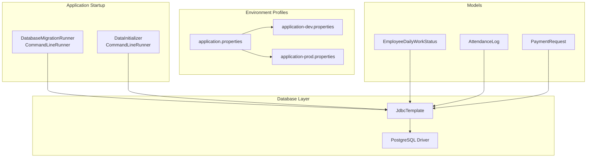
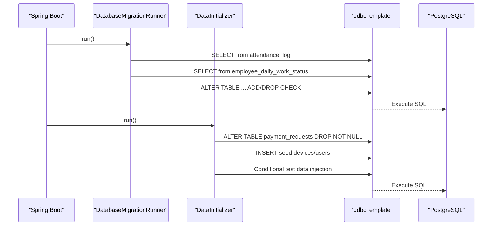
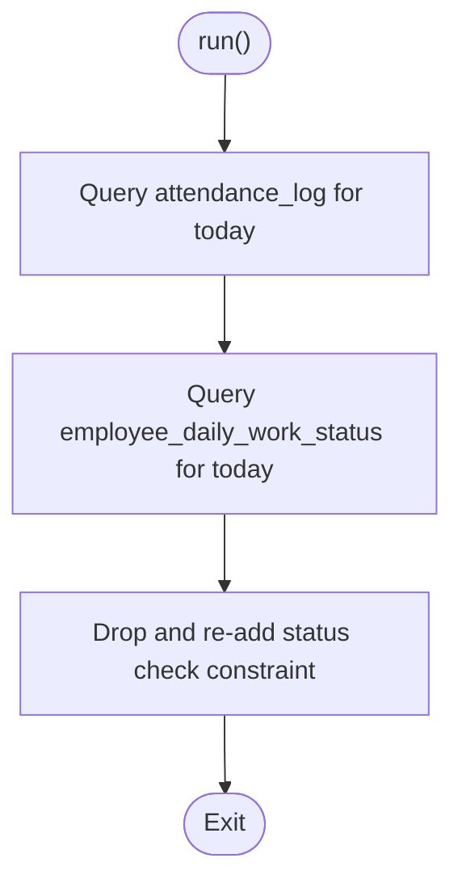
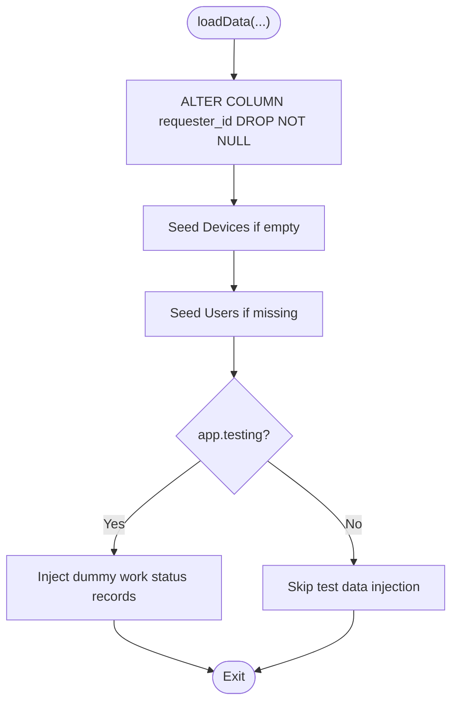
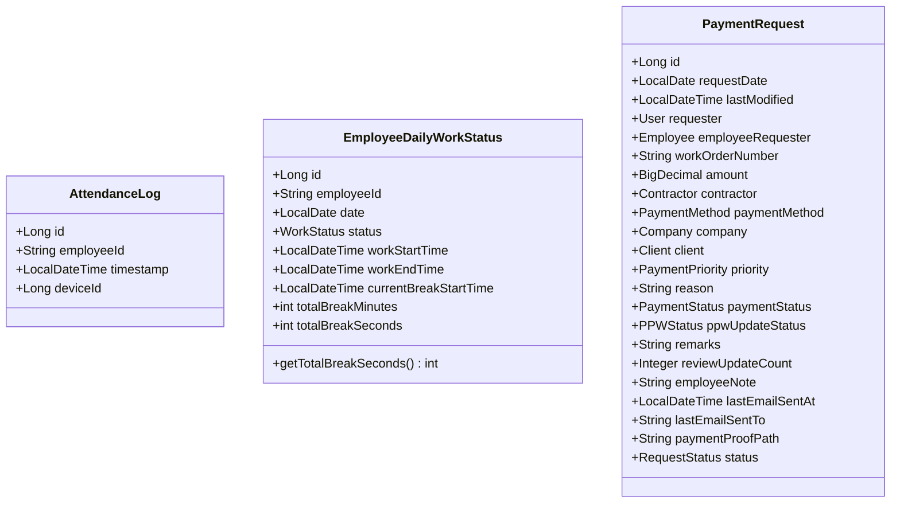
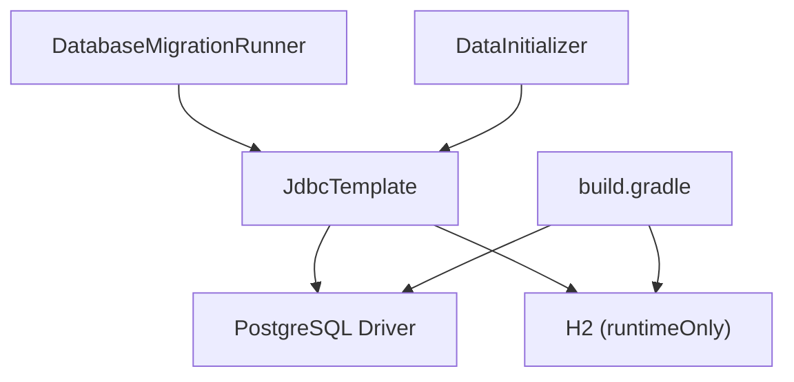

# Schema Evolution and Migration

<cite>
**Referenced Files in This Document**
- [DatabaseMigrationRunner.java](file://src/main/java/root/cyb/mh/attendancesystem/config/DatabaseMigrationRunner.java)
- [DataInitializer.java](file://src/main/java/root/cyb/mh/attendancesystem/config/DataInitializer.java)
- [DbFix.java](file://DbFix.java)
- [application.properties](file://src/main/resources/application.properties)
- [application-dev.properties](file://src/main/resources/application-dev.properties)
- [application-prod.properties](file://src/main/resources/application-prod.properties)
- [build.gradle](file://build.gradle)
- [AttendanceLog.java](file://src/main/java/root/cyb/mh/attendancesystem/model/AttendanceLog.java)
- [EmployeeDailyWorkStatus.java](file://src/main/java/root/cyb/mh/attendancesystem/model/EmployeeDailyWorkStatus.java)
- [PaymentRequest.java](file://src/main/java/root/cyb/mh/attendancesystem/model/PaymentRequest.java)
- [ReportService.java](file://src/main/java/root/cyb/mh/attendancesystem/service/ReportService.java)
- [AdmsService.java](file://src/main/java/root/cyb/mh/attendancesystem/service/AdmsService.java)
</cite>

## Table of Contents
1. [Introduction](#introduction)
2. [Project Structure](#project-structure)
3. [Core Components](#core-components)
4. [Architecture Overview](#architecture-overview)
5. [Detailed Component Analysis](#detailed-component-analysis)
6. [Dependency Analysis](#dependency-analysis)
7. [Performance Considerations](#performance-considerations)
8. [Troubleshooting Guide](#troubleshooting-guide)
9. [Conclusion](#conclusion)
10. [Appendices](#appendices)

## Introduction
This document describes the database schema evolution and migration strategies currently implemented in the Skylink Custom Backend. It focuses on how schema updates are applied, how data migrations are handled, and how the system maintains backward compatibility. It also outlines planning, version control, rollback procedures, environment-specific migrations, and production deployment considerations. The current implementation relies on ad-hoc SQL scripts executed via Spring’s JdbcTemplate and a dedicated runner, with explicit environment profiles for development and production.

## Project Structure
The schema evolution mechanisms are primarily implemented in configuration classes that run at application startup. Environment-specific configuration is managed through Spring profiles, and the build configuration defines database drivers and starter dependencies.

**Diagram sources**
- [DatabaseMigrationRunner.java:1-42](file://src/main/java/root/cyb/mh/attendancesystem/config/DatabaseMigrationRunner.java#L1-L42)
- [DataInitializer.java:1-122](file://src/main/java/root/cyb/mh/attendancesystem/config/DataInitializer.java#L1-L122)
- [application.properties:1-1](file://src/main/resources/application.properties#L1-L1)
- [application-dev.properties:1-33](file://src/main/resources/application-dev.properties#L1-L33)
- [application-prod.properties:1-33](file://src/main/resources/application-prod.properties#L1-L33)
- [build.gradle:34-55](file://build.gradle#L34-L55)

**Section sources**
- [application.properties:1-1](file://src/main/resources/application.properties#L1-L1)
- [application-dev.properties:1-33](file://src/main/resources/application-dev.properties#L1-L33)
- [application-prod.properties:1-33](file://src/main/resources/application-prod.properties#L1-L33)
- [build.gradle:34-55](file://build.gradle#L34-L55)

## Core Components
- DatabaseMigrationRunner: Executes debug queries and ensures referential integrity constraints are enforced on the work status table at startup.
- DataInitializer: Applies schema fixes (e.g., altering NOT NULL constraints) and seeds initial data (devices, users). Includes optional test data injection controlled by a profile flag.
- DbFix.java: A standalone script to add a column to the work status table, demonstrating manual schema changes outside the Spring lifecycle.
- Environment configuration: Separate property files define datasource URLs, credentials, and application flags per environment.

Key responsibilities:
- Schema enforcement and correction at startup
- Initial data provisioning and optional test data generation
- Manual schema adjustments for legacy issues
- Environment-aware configuration for dev/prod

**Section sources**
- [DatabaseMigrationRunner.java:1-42](file://src/main/java/root/cyb/mh/attendancesystem/config/DatabaseMigrationRunner.java#L1-L42)
- [DataInitializer.java:1-122](file://src/main/java/root/cyb/mh/attendancesystem/config/DataInitializer.java#L1-L122)
- [DbFix.java:1-20](file://DbFix.java#L1-L20)

## Architecture Overview
The migration architecture centers on two startup hooks:
- DatabaseMigrationRunner performs runtime checks and enforces constraints.
- DataInitializer applies schema corrections and seeds data.

**Diagram sources**
- [DatabaseMigrationRunner.java:14-41](file://src/main/java/root/cyb/mh/attendancesystem/config/DatabaseMigrationRunner.java#L14-L41)
- [DataInitializer.java:18-120](file://src/main/java/root/cyb/mh/attendancesystem/config/DataInitializer.java#L18-L120)

## Detailed Component Analysis

### DatabaseMigrationRunner
Purpose:
- Validates current day’s data for attendance logs and daily work status.
- Ensures the work status table has the correct check constraint for allowed statuses.

Behavior:
- On startup, executes queries against current-day records.
- Drops and re-applies a check constraint to align the status column with the allowed enum values.

**Diagram sources**
- [DatabaseMigrationRunner.java:14-41](file://src/main/java/root/cyb/mh/attendancesystem/config/DatabaseMigrationRunner.java#L14-L41)

**Section sources**
- [DatabaseMigrationRunner.java:14-41](file://src/main/java/root/cyb/mh/attendancesystem/config/DatabaseMigrationRunner.java#L14-L41)

### DataInitializer
Purpose:
- Applies schema corrections and seeds initial data.
- Conditionally injects test data when testing mode is enabled.

Behavior:
- Drops NOT NULL constraint on requester_id in payment_requests to support flexible requester assignment.
- Seeds devices and users if missing.
- In testing mode, generates dummy EmployeeDailyWorkStatus entries for all employees and statuses.

**Diagram sources**
- [DataInitializer.java:18-120](file://src/main/java/root/cyb/mh/attendancesystem/config/DataInitializer.java#L18-L120)

**Section sources**
- [DataInitializer.java:18-120](file://src/main/java/root/cyb/mh/attendancesystem/config/DataInitializer.java#L18-L120)

### DbFix.java
Purpose:
- Demonstrates a manual schema change (adding a column) executed outside Spring lifecycle.

Behavior:
- Establishes a direct JDBC connection and executes an ALTER TABLE statement.

**Section sources**
- [DbFix.java:1-20](file://DbFix.java#L1-L20)

### Environment Profiles and Configuration
- application.properties activates the prod profile by default.
- application-dev.properties and application-prod.properties define environment-specific datasource URLs, credentials, and application flags (e.g., testing mode).
- The dev profile enables Hibernate DDL auto-update, while the prod profile keeps ddl-auto set to update.

Operational impact:
- Development environment can auto-update schema via Hibernate.
- Production environment relies on explicit SQL scripts and runners to manage schema changes.

**Section sources**
- [application.properties:1-1](file://src/main/resources/application.properties#L1-L1)
- [application-dev.properties:1-33](file://src/main/resources/application-dev.properties#L1-L33)
- [application-prod.properties:1-33](file://src/main/resources/application-prod.properties#L1-L33)

### Model-Level Considerations
- EmployeeDailyWorkStatus includes a fallback method to compute total break seconds from minutes, ensuring backward compatibility for migrated records.
- PaymentRequest defines nullable and non-nullable columns explicitly, reflecting evolving business rules captured in schema fixes.
- AttendanceLog is a straightforward entity capturing attendance events.

**Diagram sources**
- [AttendanceLog.java:1-27](file://src/main/java/root/cyb/mh/attendancesystem/model/AttendanceLog.java#L1-L27)
- [EmployeeDailyWorkStatus.java:1-45](file://src/main/java/root/cyb/mh/attendancesystem/model/EmployeeDailyWorkStatus.java#L1-L45)
- [PaymentRequest.java:1-117](file://src/main/java/root/cyb/mh/attendancesystem/model/PaymentRequest.java#L1-L117)

**Section sources**
- [EmployeeDailyWorkStatus.java:30-38](file://src/main/java/root/cyb/mh/attendancesystem/model/EmployeeDailyWorkStatus.java#L30-L38)
- [PaymentRequest.java:22-116](file://src/main/java/root/cyb/mh/attendancesystem/model/PaymentRequest.java#L22-L116)

### Data Migration Scripts and Backward Compatibility
- The fallback method in EmployeeDailyWorkStatus ensures older records with minutes stored but not seconds are still usable.
- DataInitializer’s schema fix removes NOT NULL constraints conditionally, accommodating legacy data where requester references may be absent.
- The presence of a separate DbFix.java script indicates manual migrations for specific scenarios.

Best practices derived from current code:
- Prefer explicit SQL scripts for structural changes.
- Maintain backward-compatible getters to handle mixed data versions.
- Use environment flags to gate test data injection and schema changes.

**Section sources**
- [EmployeeDailyWorkStatus.java:30-38](file://src/main/java/root/cyb/mh/attendancesystem/model/EmployeeDailyWorkStatus.java#L30-L38)
- [DataInitializer.java:24-31](file://src/main/java/root/cyb/mh/attendancesystem/config/DataInitializer.java#L24-L31)
- [DbFix.java:1-20](file://DbFix.java#L1-L20)

### Rollback Procedures
Current implementation does not include automated rollback logic. Recommended approach:
- Maintain a changelog of applied SQL statements.
- Create reversible scripts for each change (e.g., drop/add constraints, revert column defaults).
- Version-control all migration scripts alongside the application.

[No sources needed since this section provides general guidance]

### Schema Validation and Testing
- DatabaseMigrationRunner validates current-day data and re-applies constraints, acting as a lightweight validator.
- DataInitializer’s test data injection helps validate work status computations under various conditions.

Integration points:
- ReportService and AdmsService rely on EmployeeDailyWorkStatus and derive statuses based on timestamps and thresholds.

**Section sources**
- [DatabaseMigrationRunner.java:14-41](file://src/main/java/root/cyb/mh/attendancesystem/config/DatabaseMigrationRunner.java#L14-L41)
- [DataInitializer.java:63-118](file://src/main/java/root/cyb/mh/attendancesystem/config/DataInitializer.java#L63-L118)
- [ReportService.java:183-434](file://src/main/java/root/cyb/mh/attendancesystem/service/ReportService.java#L183-L434)
- [AdmsService.java:242-262](file://src/main/java/root/cyb/mh/attendancesystem/service/AdmsService.java#L242-L262)

## Dependency Analysis
The migration components depend on Spring’s JdbcTemplate and PostgreSQL driver. The build configuration includes both H2 (for development/testing) and PostgreSQL drivers, with the latter being the runtime target.

**Diagram sources**
- [build.gradle:34-55](file://build.gradle#L34-L55)
- [DatabaseMigrationRunner.java:11-12](file://src/main/java/root/cyb/mh/attendancesystem/config/DatabaseMigrationRunner.java#L11-L12)
- [DataInitializer.java:20-21](file://src/main/java/root/cyb/mh/attendancesystem/config/DataInitializer.java#L20-L21)

**Section sources**
- [build.gradle:34-55](file://build.gradle#L34-L55)

## Performance Considerations
- Startup-time migrations (DDL and seed data) occur during application boot. Keep these operations minimal and idempotent to reduce startup latency.
- Use targeted queries (e.g., filtering by current date) to limit result sets during validation steps.
- Avoid heavy data transformations at startup; prefer batch jobs or scheduled tasks for large-scale migrations.

[No sources needed since this section provides general guidance]

## Troubleshooting Guide
Common issues and remedies:
- Constraint violations on status fields: DatabaseMigrationRunner re-applies the check constraint at startup. Verify logs for errors and rerun if needed.
- Payment requester reference inconsistencies: DataInitializer removes NOT NULL on requester_id to accommodate legacy data. Confirm the fix is applied and retry operations.
- Missing total_break_seconds: DbFix.java adds the column with a default value. Ensure the script runs successfully and verify the column exists.

Operational tips:
- Enable appropriate logging to capture migration outcomes.
- Use environment flags to control test data injection and schema changes during development.

**Section sources**
- [DatabaseMigrationRunner.java:14-41](file://src/main/java/root/cyb/mh/attendancesystem/config/DatabaseMigrationRunner.java#L14-L41)
- [DataInitializer.java:24-31](file://src/main/java/root/cyb/mh/attendancesystem/config/DataInitializer.java#L24-L31)
- [DbFix.java:1-20](file://DbFix.java#L1-L20)

## Conclusion
The Skylink Custom Backend currently employs a pragmatic, ad-hoc approach to schema evolution:
- Startup runners apply targeted validations and constraints.
- DataInitializer handles schema corrections and seeds essential data.
- Manual scripts address specific legacy issues.
- Environment profiles differentiate development and production behavior.

To evolve toward a robust migration framework, adopt formal migration tooling, maintain a strict changelog, and implement reversible scripts with comprehensive testing and rollback plans.

[No sources needed since this section summarizes without analyzing specific files]

## Appendices

### Migration Planning Checklist
- Define schema deltas and their rationale.
- Create reversible SQL scripts and version them.
- Test scripts in a staging environment mirroring production.
- Automate application of migrations at startup or via a dedicated job.
- Document rollback procedures and train operators.

[No sources needed since this section provides general guidance]