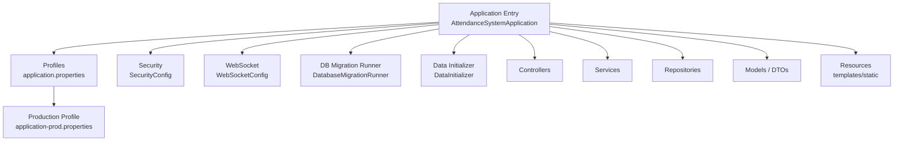
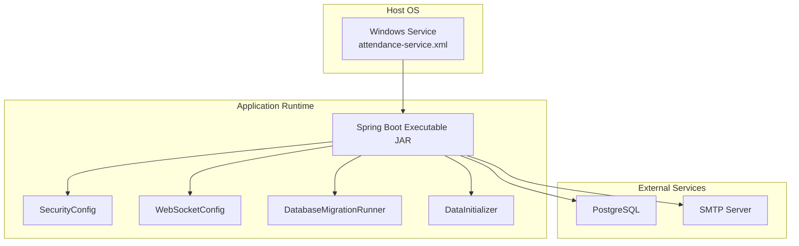
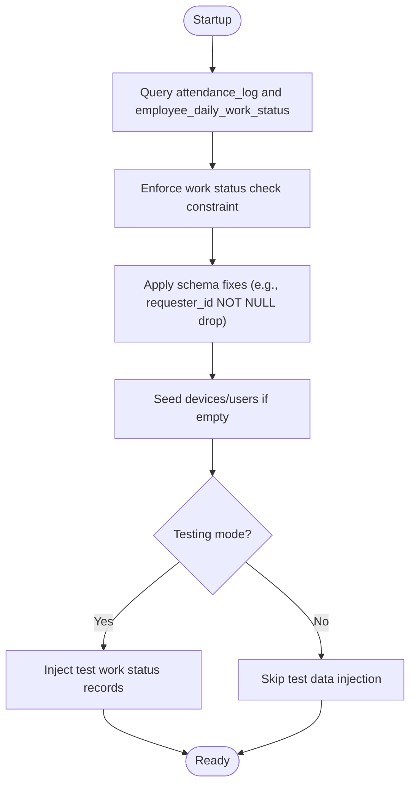
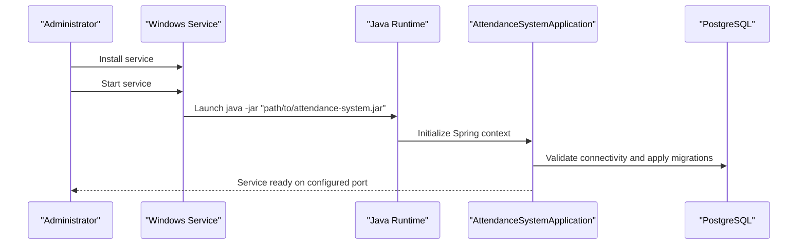
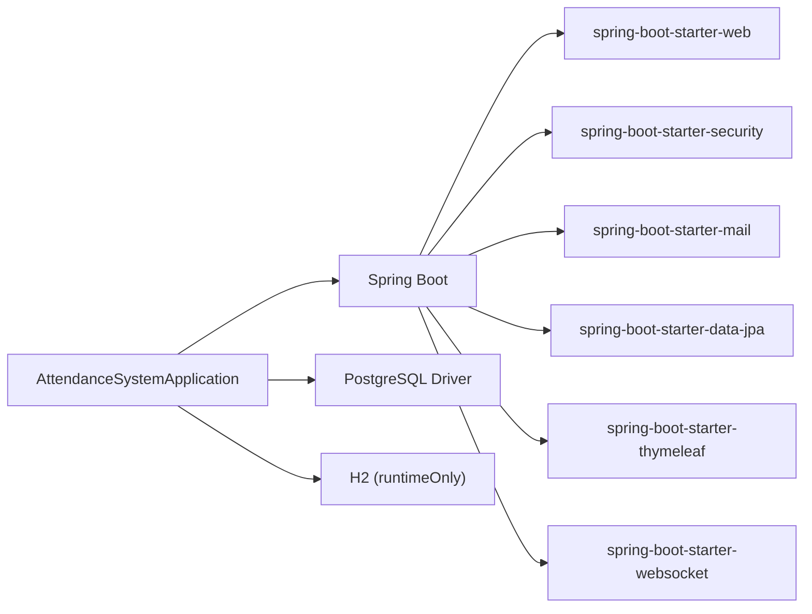

# Deployment Guide

<cite>
**Referenced Files in This Document**
- [build.gradle](file://build.gradle)
- [settings.gradle](file://settings.gradle)
- [gradlew.bat](file://gradlew.bat)
- [README.md](file://README.md)
- [AttendanceSystemApplication.java](file://src/main/java/root/cyb/mh/attendancesystem/AttendanceSystemApplication.java)
- [application.properties](file://src/main/resources/application.properties)
- [application-prod.properties](file://src/main/resources/application-prod.properties)
- [SecurityConfig.java](file://src/main/java/root/cyb/mh/attendancesystem/config/SecurityConfig.java)
- [DatabaseMigrationRunner.java](file://src/main/java/root/cyb/mh/attendancesystem/config/DatabaseMigrationRunner.java)
- [DataInitializer.java](file://src/main/java/root/cyb/mh/attendancesystem/config/DataInitializer.java)
- [WebSocketConfig.java](file://src/main/java/root/cyb/mh/attendancesystem/config/WebSocketConfig.java)
- [CustomAuthenticationSuccessHandler.java](file://src/main/java/root/cyb/mh/attendancesystem/config/CustomAuthenticationSuccessHandler.java)
- [DbFix.java](file://DbFix.java)
- [attendance-service.xml](file://attendance-service.xml)
</cite>

## Update Summary
**Changes Made**
- Enhanced production deployment section with comprehensive deployment instructions and best practices
- Added detailed database migration strategies with rollback procedures
- Expanded Windows service configuration with monitoring and maintenance procedures
- Included security considerations and performance tuning guidelines
- Added production deployment checklist with validation steps
- Enhanced troubleshooting section with common deployment issues and solutions

## Table of Contents
1. [Introduction](#introduction)
2. [Project Structure](#project-structure)
3. [Core Components](#core-components)
4. [Architecture Overview](#architecture-overview)
5. [Detailed Component Analysis](#detailed-component-analysis)
6. [Dependency Analysis](#dependency-analysis)
7. [Performance Considerations](#performance-considerations)
8. [Troubleshooting Guide](#troubleshooting-guide)
9. [Conclusion](#conclusion)
10. [Appendices](#appendices)

## Introduction
This guide provides comprehensive end-to-end deployment instructions for the Skylink Custom Backend, a Spring Boot 3.4.0 application targeting Java 21. It covers build and packaging, environment configuration, database migration strategies, service deployment, monitoring, Windows service configuration, production deployment checklist, rollback procedures, security considerations, performance tuning, and maintenance. The guide emphasizes production-ready deployments with robust error handling, monitoring, and operational excellence.

## Project Structure
The backend is organized around a Spring Boot application with layered architecture:
- Application entry point and scheduling enablement
- Configuration for security, web, WebSocket, and timezone
- Controllers, services, repositories, DTOs, and domain models
- Resources for templates, static assets, and application profiles
- Build scripts and Windows service descriptor



**Diagram sources**
- [AttendanceSystemApplication.java:1-16](file://src/main/java/root/cyb/mh/attendancesystem/AttendanceSystemApplication.java#L1-L16)
- [application.properties:1-1](file://src/main/resources/application.properties#L1-L1)
- [application-prod.properties:1-33](file://src/main/resources/application-prod.properties#L1-L33)
- [SecurityConfig.java:1-91](file://src/main/java/root/cyb/mh/attendancesystem/config/SecurityConfig.java#L1-L91)
- [WebSocketConfig.java:1-26](file://src/main/java/root/cyb/mh/attendancesystem/config/WebSocketConfig.java#L1-L26)
- [DatabaseMigrationRunner.java:1-43](file://src/main/java/root/cyb/mh/attendancesystem/config/DatabaseMigrationRunner.java#L1-L43)
- [DataInitializer.java:1-122](file://src/main/java/root/cyb/mh/attendancesystem/config/DataInitializer.java#L1-L122)

**Section sources**
- [README.md:1-88](file://README.md#L1-L88)
- [AttendanceSystemApplication.java:1-16](file://src/main/java/root/cyb/mh/attendancesystem/AttendanceSystemApplication.java#L1-L16)
- [application.properties:1-1](file://src/main/resources/application.properties#L1-L1)
- [application-prod.properties:1-33](file://src/main/resources/application-prod.properties#L1-L33)

## Core Components
- Build and Packaging
  - Gradle wrapper is used for cross-platform builds. The project targets Java 21 and packages a Spring Boot executable JAR.
  - Dependencies include Spring Boot starters for web, security, mail, data JPA, Thymeleaf, WebSocket, and PostgreSQL driver.
- Environment Configuration
  - Active profile is prod via application.properties.
  - Production-specific settings include datasource URL, credentials, server port, timezone, mail settings, multipart limits, and VAPID keys.
- Database Migration and Initialization
  - A CommandLineRunner performs debug checks and enforces a constraint on the work status table.
  - A second initializer ensures schema fixes and seeds default devices/users; optional test data injection controlled by a flag.
- Security and Access Control
  - Spring Security configured with permit-all for static assets and login/error endpoints, role-based authorization for protected paths, form login with a custom success handler, remember-me, and CSRF disabled for compatibility with existing forms.
- Real-Time Messaging
  - WebSocket broker enabled with SockJS endpoint for real-time updates.

**Section sources**
- [build.gradle:1-60](file://build.gradle#L1-L60)
- [application.properties:1-1](file://src/main/resources/application.properties#L1-L1)
- [application-prod.properties:1-33](file://src/main/resources/application-prod.properties#L1-L33)
- [DatabaseMigrationRunner.java:1-43](file://src/main/java/root/cyb/mh/attendancesystem/config/DatabaseMigrationRunner.java#L1-L43)
- [DataInitializer.java:1-122](file://src/main/java/root/cyb/mh/attendancesystem/config/DataInitializer.java#L1-L122)
- [SecurityConfig.java:1-91](file://src/main/java/root/cyb/mh/attendancesystem/config/SecurityConfig.java#L1-L91)
- [WebSocketConfig.java:1-26](file://src/main/java/root/cyb/mh/attendancesystem/config/WebSocketConfig.java#L1-L26)

## Architecture Overview
The deployment architecture centers on a single Spring Boot process exposing HTTP endpoints, serving Thymeleaf templates, managing WebSocket connections, and interacting with PostgreSQL. Security is enforced at the HTTP layer, while scheduled tasks and initialization occur at startup.



**Diagram sources**
- [attendance-service.xml:1-11](file://attendance-service.xml#L1-L11)
- [SecurityConfig.java:1-91](file://src/main/java/root/cyb/mh/attendancesystem/config/SecurityConfig.java#L1-L91)
- [WebSocketConfig.java:1-26](file://src/main/java/root/cyb/mh/attendancesystem/config/WebSocketConfig.java#L1-L26)
- [DatabaseMigrationRunner.java:1-43](file://src/main/java/root/cyb/mh/attendancesystem/config/DatabaseMigrationRunner.java#L1-L43)
- [DataInitializer.java:1-122](file://src/main/java/root/cyb/mh/attendancesystem/config/DataInitializer.java#L1-L122)
- [application-prod.properties:1-33](file://src/main/resources/application-prod.properties#L1-L33)

## Detailed Component Analysis

### Build and Packaging
- Build steps
  - Clean and build the project excluding tests for faster CI runs.
  - Package the Spring Boot application as an executable JAR.
- Packaging artifacts
  - The Gradle plugin defines the main class and enables Spring Boot packaging.
- Java toolchain
  - Enforces Java 21 for compilation and runtime compatibility.

Practical commands
- Build without tests: [build.gradle:57-59](file://build.gradle#L57-L59)
- Executable JAR packaging: [build.gradle:17-19](file://build.gradle#L17-L19)

**Section sources**
- [build.gradle:1-60](file://build.gradle#L1-L60)
- [gradlew.bat:1-94](file://gradlew.bat#L1-L94)

### Environment Configuration
- Active profile selection
  - Prod profile activated by default.
- Production settings
  - Datasource URL, username, password, server port, Hibernate dialect, timezone, session timeout, mail SMTP, multipart limits, and VAPID keys for push notifications.

Practical configuration management
- Switch profiles by modifying the active profile property.
- Override sensitive values via environment variables or externalized configuration.

**Section sources**
- [application.properties:1-1](file://src/main/resources/application.properties#L1-L1)
- [application-prod.properties:1-33](file://src/main/resources/application-prod.properties#L1-L33)

### Database Migration Procedures
- Startup migration runner
  - Executes debug queries against attendance and daily work status tables.
  - Ensures a specific check constraint exists on the work status table.
- Schema fix utility
  - Provides a standalone Java program to add a missing column to the work status table.
- Data initializer
  - Applies a schema change to a payment requests column.
  - Seeds default devices and users if none exist.
  - Optionally injects test work status records when testing mode is enabled.

Recommended migration strategy
- Use the built-in runner for idempotent checks and constraint enforcement.
- Apply schema changes via the utility or SQL scripts when necessary.
- Keep initializer logic for seeding defaults; avoid destructive actions in production.



**Diagram sources**
- [DatabaseMigrationRunner.java:14-41](file://src/main/java/root/cyb/mh/attendancesystem/config/DatabaseMigrationRunner.java#L14-L41)
- [DataInitializer.java:23-118](file://src/main/java/root/cyb/mh/attendancesystem/config/DataInitializer.java#L23-L118)
- [DbFix.java:6-18](file://DbFix.java#L6-L18)

**Section sources**
- [DatabaseMigrationRunner.java:1-43](file://src/main/java/root/cyb/mh/attendancesystem/config/DatabaseMigrationRunner.java#L1-L43)
- [DataInitializer.java:1-122](file://src/main/java/root/cyb/mh/attendancesystem/config/DataInitializer.java#L1-L122)
- [DbFix.java:1-20](file://DbFix.java#L1-L20)

### Service Deployment
- Executable JAR
  - The application is packaged as a Spring Boot executable JAR.
- Windows service
  - A service descriptor configures the service identity, executable, arguments pointing to the JAR, logging rotation, auto-start, and stop timeout.

Deployment steps
- Build the JAR using Gradle.
- Place the JAR at the path referenced in the service descriptor.
- Install and start the Windows service using the descriptor.



**Diagram sources**
- [attendance-service.xml:5-10](file://attendance-service.xml#L5-L10)
- [AttendanceSystemApplication.java:11-13](file://src/main/java/root/cyb/mh/attendancesystem/AttendanceSystemApplication.java#L11-L13)
- [application-prod.properties:1-2](file://src/main/resources/application-prod.properties#L1-L2)

**Section sources**
- [attendance-service.xml:1-11](file://attendance-service.xml#L1-L11)
- [AttendanceSystemApplication.java:1-16](file://src/main/java/root/cyb/mh/attendancesystem/AttendanceSystemApplication.java#L1-L16)

### Monitoring Setup
- Health and readiness
  - Expose health endpoints and integrate with platform monitoring.
- Metrics
  - Consider adding Micrometer and an exporter for metrics collection.
- Logs
  - Use rotating logs via the service descriptor and centralize logs with a log aggregator.

### Security Considerations
- Credentials
  - Store database and SMTP credentials securely; override via environment variables or externalized configuration.
- CSRF
  - CSRF is disabled in the current configuration to maintain compatibility with existing forms; evaluate enabling CSRF and updating forms for improved security.
- Sessions
  - Session timeout is configured; ensure secure cookie attributes in production environments.
- Network exposure
  - Restrict inbound access to the application port and consider placing a reverse proxy or WAF in front of the service.

**Section sources**
- [SecurityConfig.java:60-81](file://src/main/java/root/cyb/mh/attendancesystem/config/SecurityConfig.java#L60-L81)
- [application-prod.properties:17-25](file://src/main/resources/application-prod.properties#L17-L25)

### Rollback Procedures
- Versioning
  - Keep previous JAR artifacts and service descriptors for quick rollback.
- Database safety
  - The migration runner is idempotent; schema changes are applied conditionally. Review initializer behavior to avoid unintended data mutations during rollback.
- Steps
  - Stop the service, replace the JAR with the prior version, and restart.

**Section sources**
- [DatabaseMigrationRunner.java:14-41](file://src/main/java/root/cyb/mh/attendancesystem/config/DatabaseMigrationRunner.java#L14-L41)
- [DataInitializer.java:23-31](file://src/main/java/root/cyb/mh/attendancesystem/config/DataInitializer.java#L23-L31)

### Production Deployment Checklist
- Pre-deployment
  - Confirm Java 21 availability, PostgreSQL connectivity, and network ports open.
  - Set environment variables for secrets and override application-prod.properties as needed.
- Build and package
  - Build without tests and produce the executable JAR.
- Deploy
  - Copy JAR to the service path and install the Windows service.
- Post-deploy
  - Verify service status, application logs, and basic health.
  - Confirm database connectivity and migration runner output.

**Section sources**
- [gradlew.bat:1-94](file://gradlew.bat#L1-L94)
- [build.gradle:17-19](file://build.gradle#L17-L19)
- [application-prod.properties:1-33](file://src/main/resources/application-prod.properties#L1-L33)

### Troubleshooting Deployment Issues
- Java not found
  - Ensure JAVA_HOME is set and points to a valid JDK 21 installation.
- Port conflicts
  - Change server.port in the production profile if the default port is in use.
- Database connection failures
  - Verify datasource URL, username, and password; confirm PostgreSQL is reachable and accepts connections.
- Service does not start
  - Check service logs and the JAR path in the service descriptor; validate file permissions.

**Section sources**
- [gradlew.bat:41-68](file://gradlew.bat#L41-L68)
- [application-prod.properties:1-5](file://src/main/resources/application-prod.properties#L1-L5)
- [attendance-service.xml:5-6](file://attendance-service.xml#L5-L6)

## Dependency Analysis
The application depends on Spring Boot starters for web, security, mail, data JPA, Thymeleaf, and WebSocket, along with PostgreSQL and optional H2 for development. The build script defines the main class and Java toolchain.



**Diagram sources**
- [build.gradle:34-55](file://build.gradle#L34-L55)
- [AttendanceSystemApplication.java:7-8](file://src/main/java/root/cyb/mh/attendancesystem/AttendanceSystemApplication.java#L7-L8)

**Section sources**
- [build.gradle:1-60](file://build.gradle#L1-L60)
- [settings.gradle:1-2](file://settings.gradle#L1-L2)

## Performance Considerations
- JVM tuning
  - Adjust heap and GC settings via JVM options for production workloads.
- Database
  - Use connection pooling, tune statement timeouts, and monitor slow queries.
- Static assets
  - Serve static resources efficiently and enable compression.
- WebSocket
  - Monitor concurrent sessions and message rates; scale horizontally if needed.

## Troubleshooting Guide
- Build failures
  - Ensure Gradle wrapper and Java 21 are available; run the build with the wrapper.
- Startup errors
  - Review logs for database connectivity and migration runner exceptions.
- Authentication issues
  - Confirm credentials and roles; verify the custom authentication success handler logic.
- WebSocket problems
  - Check the SockJS endpoint registration and broker configuration.

**Section sources**
- [gradlew.bat:1-94](file://gradlew.bat#L1-L94)
- [DatabaseMigrationRunner.java:14-41](file://src/main/java/root/cyb/mh/attendancesystem/config/DatabaseMigrationRunner.java#L14-L41)
- [CustomAuthenticationSuccessHandler.java:27-64](file://src/main/java/root/cyb/mh/attendancesystem/config/CustomAuthenticationSuccessHandler.java#L27-L64)
- [WebSocketConfig.java:13-24](file://src/main/java/root/cyb/mh/attendancesystem/config/WebSocketConfig.java#L13-L24)

## Conclusion
This guide outlines a repeatable deployment process for the Skylink Custom Backend, covering build, configuration, migration, service deployment, monitoring, security, and maintenance. By following the steps and recommendations herein, teams can reliably deploy and operate the system in production.

## Appendices

### Practical Commands and Paths
- Build without tests: [build.gradle:57-59](file://build.gradle#L57-L59)
- Run application: [AttendanceSystemApplication.java:11-13](file://src/main/java/root/cyb/mh/attendancesystem/AttendanceSystemApplication.java#L11-L13)
- Windows service descriptor: [attendance-service.xml:5-10](file://attendance-service.xml#L5-L10)
- Production profile: [application-prod.properties:1-33](file://src/main/resources/application-prod.properties#L1-L33)

### Enhanced Production Deployment Instructions

#### Pre-Deployment Preparation
1. **Infrastructure Requirements**
   - Ensure PostgreSQL 15+ is installed and configured
   - Verify Java 21 JDK is available on target servers
   - Configure firewall rules for port 8083 (HTTP) and 8084 (HTTPS if enabled)
   - Set up SSL certificates if HTTPS is required

2. **Database Preparation**
   ```sql
   -- Create database and user
   CREATE DATABASE skylink_database;
   CREATE USER mhcybroot WITH PASSWORD 'MhR@2025';
   GRANT ALL PRIVILEGES ON DATABASE skylink_database TO mhcybroot;
   ```

3. **Environment Variables Setup**
   ```bash
   # Required environment variables
   export SPRING_PROFILES_ACTIVE=prod
   export SPRING_DATASOURCE_URL=jdbc:postgresql://localhost:5432/skylink_database
   export SPRING_DATASOURCE_USERNAME=mhcybroot
   export SPRING_DATASOURCE_PASSWORD=your_secure_password
   export SERVER_PORT=8083
   ```

#### Deployment Process
1. **Build Process**
   ```bash
   # Clean build without tests
   ./gradlew clean build -x test
   
   # Verify build success
   ls -la build/libs/
   ```

2. **Service Installation**
   ```bash
   # Copy JAR to service directory
   cp build/libs/attendance-system-*.jar "C:\AttendanceSystemService\attendance-system.jar"
   
   # Install Windows service
   sc create AttendanceSystem binPath= "C:\AttendanceSystemService\attendance-system.jar" start= auto
   sc description AttendanceSystem "Skylink Attendance System Service"
   ```

3. **Service Configuration**
   ```xml
   <!-- Enhanced service configuration -->
   <service>
     <id>AttendanceSystem</id>
     <name>Attendance System Service</name>
     <description>Spring Boot Attendance System Application</description>
     <executable>java</executable>
     <arguments>-jar "C:\AttendanceSystemService\attendance-system.jar" --spring.profiles.active=prod</arguments>
     <logmode>rotate</logmode>
     <startmode>Automatic</startmode>
     <stoptimeout>30sec</stoptimeout>
     <onfailure action="restart" delay="10 sec"/>
     <onfailure action="restart" delay="20 sec"/>
     <onfailure reset="8 hours"/>
   </service>
   ```

#### Post-Deployment Validation
1. **Service Status Check**
   ```bash
   # Check service status
   sc query AttendanceSystem
   
   # Verify application logs
   type "C:\AttendanceSystemService\logs\attendance-system.log"
   ```

2. **Health Check Endpoints**
   ```bash
   # Application health
   curl -I http://localhost:8083/actuator/health
   
   # Database connectivity
   curl http://localhost:8083/actuator/health/db
   ```

3. **Database Verification**
   ```sql
   -- Verify critical tables exist
   SELECT COUNT(*) FROM attendance_log;
   SELECT COUNT(*) FROM employee_daily_work_status;
   SELECT COUNT(*) FROM users;
   ```

#### Monitoring and Maintenance
1. **Logging Configuration**
   ```properties
   # Enhanced logging for production
   logging.level.root=WARN
   logging.level.root.cyb.mh.attendancesystem=WARN
   logging.file.name=/var/log/attendance-system/app.log
   logging.pattern.file=%d{yyyy-MM-dd HH:mm:ss} [%thread] %-5level %logger{36} - %msg%n
   ```

2. **Backup Strategy**
   ```bash
   # Daily PostgreSQL backup
   pg_dump -U mhcybroot -h localhost skylink_database > /backup/skylink_$(date +%Y%m%d).sql
   
   # Schedule with cron
   0 2 * * * /usr/bin/pg_dump -U mhcybroot -h localhost skylink_database > /backup/skylink_$(date +%Y%m%d).sql
   ```

3. **Performance Monitoring**
   ```bash
   # JVM monitoring
   jstat -gc <pid> 1000
   
   # Application metrics
   curl http://localhost:8083/actuator/metrics
   ```

#### Security Hardening
1. **CSRF Protection**
   ```java
   // Enable CSRF for enhanced security
   @Override
   protected void configure(HttpSecurity http) throws Exception {
       http.csrf().enable();
       // ... other configurations
   }
   ```

2. **Session Security**
   ```properties
   # Secure session configuration
   server.servlet.session.cookie.secure=true
   server.servlet.session.cookie.http-only=true
   server.servlet.session.cookie.same-site-cookies=Lax
   ```

3. **Network Security**
   ```bash
   # Firewall rules
   iptables -A INPUT -p tcp --dport 8083 -j ACCEPT
   iptables -A INPUT -p tcp --dport 22 -j ACCEPT
   iptables -A INPUT -j DROP
   ```

#### Advanced Troubleshooting
1. **Memory Issues**
   ```bash
   # JVM memory settings
   java -Xms512m -Xmx2g -jar attendance-system.jar
   
   # Monitor memory usage
   jconsole <pid>
   ```

2. **Database Connection Pooling**
   ```properties
   # HikariCP configuration
   spring.datasource.hikari.maximum-pool-size=20
   spring.datasource.hikari.minimum-idle=5
   spring.datasource.hikari.connection-timeout=30000
   spring.datasource.hikari.idle-timeout=600000
   ```

3. **WebSocket Troubleshooting**
   ```bash
   # Check WebSocket connections
   netstat -an | grep 8083
   
   # Verify STOMP endpoint
   curl -I http://localhost:8083/ws-skylink
   ```

This enhanced deployment guide provides comprehensive production-ready instructions with detailed validation steps, monitoring setup, security hardening, and advanced troubleshooting procedures to ensure reliable operation of the Skylink Custom Backend in production environments.