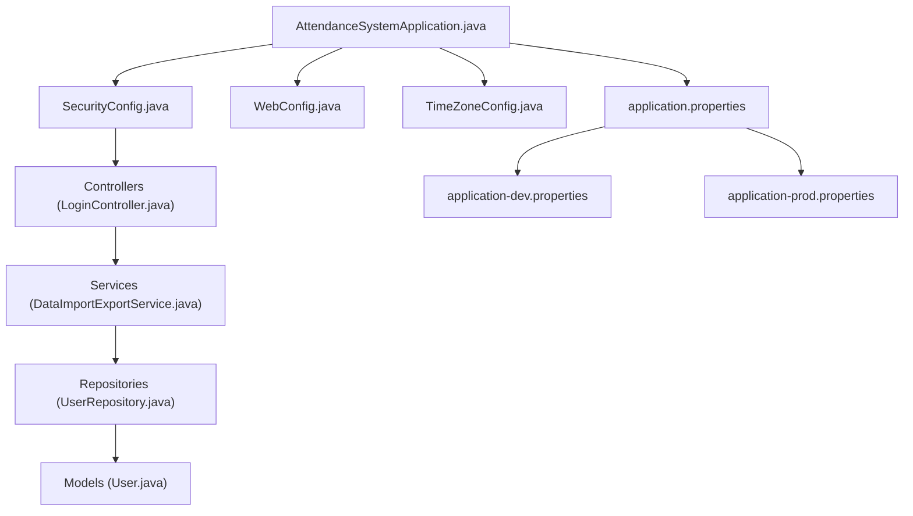
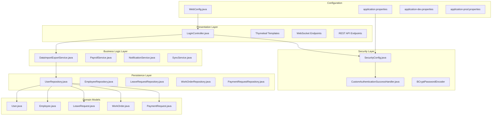
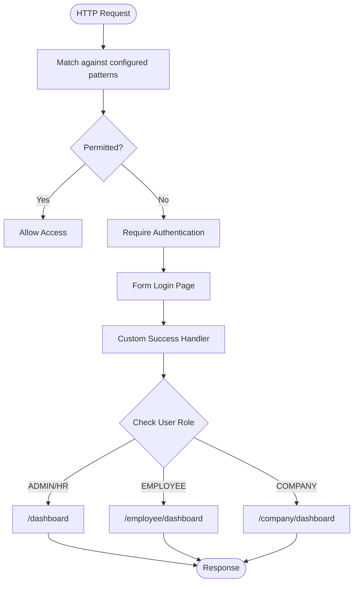
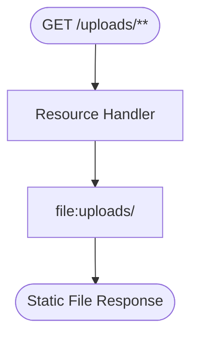
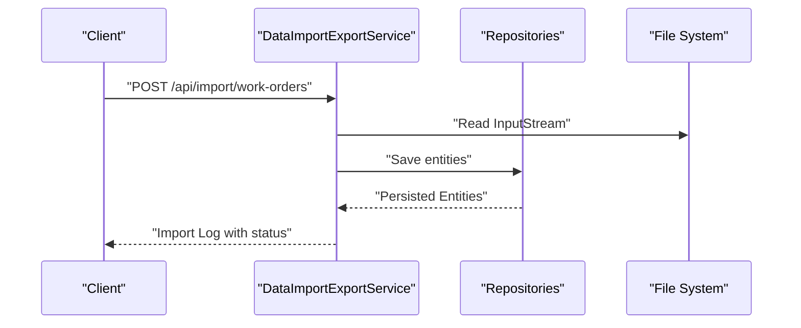
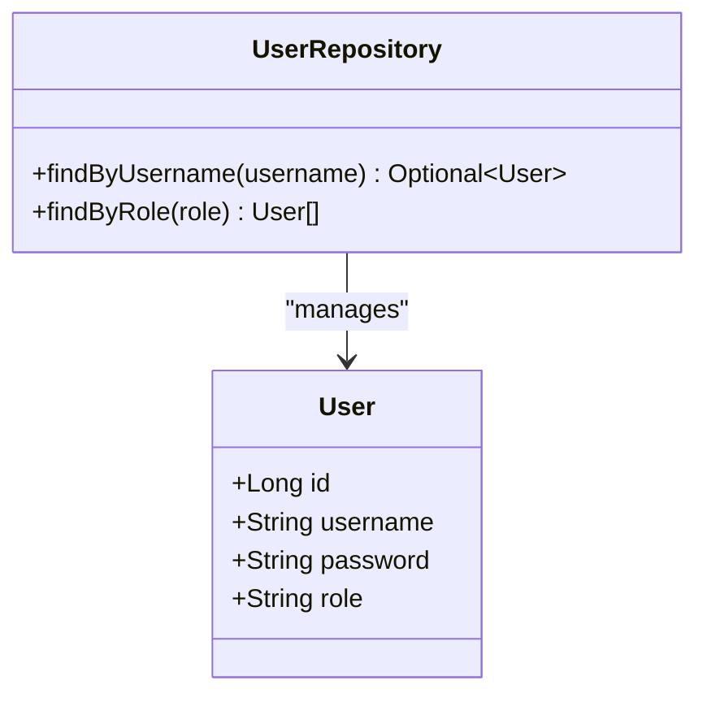
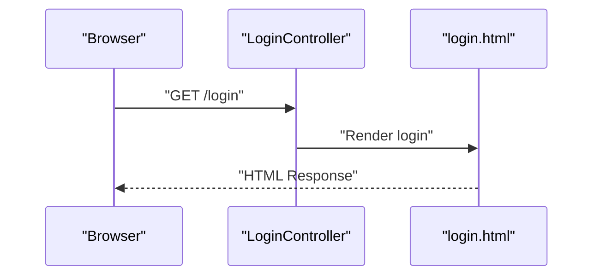
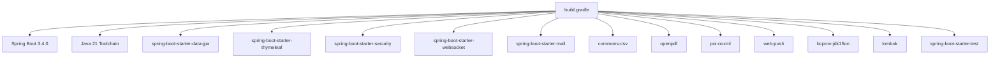

# Developer Guidelines

<cite>
**Referenced Files in This Document**
- [README.md](file://README.md)
- [build.gradle](file://build.gradle)
- [settings.gradle](file://settings.gradle)
- [gradle-wrapper.properties](file://gradle/wrapper/gradle-wrapper.properties)
- [AttendanceSystemApplication.java](file://src/main/java/root/cyb/mh/attendancesystem/AttendanceSystemApplication.java)
- [SecurityConfig.java](file://src/main/java/root/cyb/mh/attendancesystem/config/SecurityConfig.java)
- [WebConfig.java](file://src/main/java/root/cyb/mh/attendancesystem/config/WebConfig.java)
- [CustomAuthenticationSuccessHandler.java](file://src/main/java/root/cyb/mh/attendancesystem/config/CustomAuthenticationSuccessHandler.java)
- [LoginController.java](file://src/main/java/root/cyb/mh/attendancesystem/controller/LoginController.java)
- [DataImportExportService.java](file://src/main/java/root/cyb/mh/attendancesystem/service/DataImportExportService.java)
- [User.java](file://src/main/java/root/cyb/mh/attendancesystem/model/User.java)
- [UserRepository.java](file://src/main/java/root/cyb/mh/attendancesystem/repository/UserRepository.java)
- [application.properties](file://src/main/resources/application.properties)
- [application-dev.properties](file://src/main/resources/application-dev.properties)
- [application-prod.properties](file://src/main/resources/application-prod.properties)
- [.gitignore](file://.gitignore)
- [AttendanceSystemApplicationTests.java](file://src/test/java/root/cyb/mh/attendancesystem/AttendanceSystemApplicationTests.java)
- [PaymentRequestControllerTest.java](file://src/test/java/root/cyb/mh/attendancesystem/PaymentRequestControllerTest.java)
</cite>

## Update Summary
**Changes Made**
- Enhanced coding standards section with comprehensive Java 21 and Spring Boot 3.4.0 guidelines
- Expanded contribution guidelines with detailed workflow requirements
- Added comprehensive development practices documentation including testing strategies
- Updated branching strategy with GitFlow methodology
- Enhanced code review process with security and performance considerations
- Improved documentation standards with inline comment requirements
- Added code quality tools section with specific tool recommendations
- Expanded continuous integration requirements with security scanning

## Table of Contents
1. [Introduction](#introduction)
2. [Project Structure](#project-structure)
3. [Core Components](#core-components)
4. [Architecture Overview](#architecture-overview)
5. [Detailed Component Analysis](#detailed-component-analysis)
6. [Dependency Analysis](#dependency-analysis)
7. [Performance Considerations](#performance-considerations)
8. [Troubleshooting Guide](#troubleshooting-guide)
9. [Development Workflow](#development-workflow)
10. [Branching Strategy](#branching-strategy)
11. [Code Review Process](#code-review-process)
12. [Contribution Guidelines](#contribution-guidelines)
13. [Development Environment Setup](#development-environment-setup)
14. [Coding Conventions](#coding-conventions)
15. [Testing Requirements](#testing-requirements)
16. [Documentation Standards](#documentation-standards)
17. [Code Quality Tools and Static Analysis](#code-quality-tools-and-static-analysis)
18. [Continuous Integration Requirements](#continuous-integration-requirements)
19. [Practical Examples](#practical-examples)
20. [Conclusion](#conclusion)

## Introduction
This document provides comprehensive developer guidelines for the Skylink Custom Backend, a Spring Boot-based HR and Attendance Management System. It covers development workflow, branching strategy, code review, contribution guidelines, environment setup, coding conventions, testing, documentation, code quality tools, static analysis, and CI requirements. The goal is to ensure consistent, maintainable, and secure development across the team while supporting the system's complex features including real-time attendance tracking, payroll processing, and multi-role authentication.

## Project Structure
The backend follows a layered Spring Boot architecture with clear separation of concerns:
- Application bootstrap and scheduling enablement
- Configuration for security, web, WebSocket, and timezone management
- Controllers for HTTP and Thymeleaf template rendering
- Services for business logic including CSV/Excel/PDF export/import workflows
- Repositories for persistence via Spring Data JPA
- Models for JPA entities with Lombok support
- Resources for templates, static assets, and environment-specific configuration
- Comprehensive test suite with integration and unit testing



**Diagram sources**
- [AttendanceSystemApplication.java:1-16](file://src/main/java/root/cyb/mh/attendancesystem/AttendanceSystemApplication.java#L1-L16)
- [SecurityConfig.java:1-91](file://src/main/java/root/cyb/mh/attendancesystem/config/SecurityConfig.java#L1-L91)
- [WebConfig.java:1-18](file://src/main/java/root/cyb/mh/attendancesystem/config/WebConfig.java#L1-L18)
- [CustomAuthenticationSuccessHandler.java:1-66](file://src/main/java/root/cyb/mh/attendancesystem/config/CustomAuthenticationSuccessHandler.java#L1-L66)
- [LoginController.java:1-14](file://src/main/java/root/cyb/mh/attendancesystem/controller/LoginController.java#L1-L14)
- [DataImportExportService.java:1-200](file://src/main/java/root/cyb/mh/attendancesystem/service/DataImportExportService.java#L1-L200)
- [UserRepository.java:1-12](file://src/main/java/root/cyb/mh/attendancesystem/repository/UserRepository.java#L1-L12)
- [User.java:1-24](file://src/main/java/root/cyb/mh/attendancesystem/model/User.java#L1-L24)
- [application.properties:1-1](file://src/main/resources/application.properties#L1-L1)
- [application-dev.properties:1-33](file://src/main/resources/application-dev.properties#L1-L33)
- [application-prod.properties:1-33](file://src/main/resources/application-prod.properties#L1-L33)

**Section sources**
- [README.md:129-160](file://README.md#L129-L160)
- [AttendanceSystemApplication.java:1-16](file://src/main/java/root/cyb/mh/attendancesystem/AttendanceSystemApplication.java#L1-L16)
- [SecurityConfig.java:1-91](file://src/main/java/root/cyb/mh/attendancesystem/config/SecurityConfig.java#L1-L91)
- [WebConfig.java:1-18](file://src/main/java/root/cyb/mh/attendancesystem/config/WebConfig.java#L1-L18)
- [CustomAuthenticationSuccessHandler.java:1-66](file://src/main/java/root/cyb/mh/attendancesystem/config/CustomAuthenticationSuccessHandler.java#L1-L66)
- [LoginController.java:1-14](file://src/main/java/root/cyb/mh/attendancesystem/controller/LoginController.java#L1-L14)
- [DataImportExportService.java:1-200](file://src/main/java/root/cyb/mh/attendancesystem/service/DataImportExportService.java#L1-L200)
- [UserRepository.java:1-12](file://src/main/java/root/cyb/mh/attendancesystem/repository/UserRepository.java#L1-L12)
- [User.java:1-24](file://src/main/java/root/cyb/mh/attendancesystem/model/User.java#L1-L24)
- [application.properties:1-1](file://src/main/resources/application.properties#L1-L1)
- [application-dev.properties:1-33](file://src/main/resources/application-dev.properties#L1-L33)
- [application-prod.properties:1-33](file://src/main/resources/application-prod.properties#L1-L33)

## Core Components
The Skylink Custom Backend consists of several core components working together to provide a comprehensive HR and attendance management solution:

- **Application Bootstrap**: Enables scheduling and sets the main application class
- **Security Configuration**: Implements role-based access control with form-based authentication
- **Custom Authentication Handler**: Provides intelligent role-based redirection and work status management
- **Web Configuration**: Exposes local upload resources and static assets
- **Controllers**: Handle login, template rendering, and API endpoints
- **Services**: Encapsulate business logic including CSV/Excel/PDF export/import workflows
- **Repositories**: Provide JPA access for all domain entities
- **Models**: Define JPA entities with Lombok support for boilerplate reduction
- **Configuration Management**: Supports development and production environments
- **Testing Framework**: Comprehensive test suite with integration and unit testing

**Section sources**
- [AttendanceSystemApplication.java:1-16](file://src/main/java/root/cyb/mh/attendancesystem/AttendanceSystemApplication.java#L1-L16)
- [SecurityConfig.java:1-91](file://src/main/java/root/cyb/mh/attendancesystem/config/SecurityConfig.java#L1-L91)
- [CustomAuthenticationSuccessHandler.java:1-66](file://src/main/java/root/cyb/mh/attendancesystem/config/CustomAuthenticationSuccessHandler.java#L1-L66)
- [WebConfig.java:1-18](file://src/main/java/root/cyb/mh/attendancesystem/config/WebConfig.java#L1-L18)
- [LoginController.java:1-14](file://src/main/java/root/cyb/mh/attendancesystem/controller/LoginController.java#L1-L14)
- [DataImportExportService.java:1-200](file://src/main/java/root/cyb/mh/attendancesystem/service/DataImportExportService.java#L1-L200)
- [UserRepository.java:1-12](file://src/main/java/root/cyb/mh/attendancesystem/repository/UserRepository.java#L1-L12)
- [User.java:1-24](file://src/main/java/root/cyb/mh/attendancesystem/model/User.java#L1-L24)
- [AttendanceSystemApplicationTests.java:1-14](file://src/test/java/root/cyb/mh/attendancesystem/AttendanceSystemApplicationTests.java#L1-L14)
- [PaymentRequestControllerTest.java:1-34](file://src/test/java/root/cyb/mh/attendancesystem/PaymentRequestControllerTest.java#L1-L34)

## Architecture Overview
The system uses Spring MVC with Thymeleaf for server-side rendering and Spring Security for authentication and authorization. The architecture supports real-time features via WebSocket and integrates with PDF and CSV libraries for reporting. The system follows a layered architecture with clear separation between presentation, business logic, and data access layers.



**Diagram sources**
- [LoginController.java:1-14](file://src/main/java/root/cyb/mh/attendancesystem/controller/LoginController.java#L1-L14)
- [SecurityConfig.java:1-91](file://src/main/java/root/cyb/mh/attendancesystem/config/SecurityConfig.java#L1-L91)
- [CustomAuthenticationSuccessHandler.java:1-66](file://src/main/java/root/cyb/mh/attendancesystem/config/CustomAuthenticationSuccessHandler.java#L1-L66)
- [DataImportExportService.java:1-200](file://src/main/java/root/cyb/mh/attendancesystem/service/DataImportExportService.java#L1-L200)
- [UserRepository.java:1-12](file://src/main/java/root/cyb/mh/attendancesystem/repository/UserRepository.java#L1-L12)
- [User.java:1-24](file://src/main/java/root/cyb/mh/attendancesystem/model/User.java#L1-L24)
- [WebConfig.java:1-18](file://src/main/java/root/cyb/mh/attendancesystem/config/WebConfig.java#L1-L18)
- [application.properties:1-1](file://src/main/resources/application.properties#L1-L1)
- [application-dev.properties:1-33](file://src/main/resources/application-dev.properties#L1-L33)
- [application-prod.properties:1-33](file://src/main/resources/application-prod.properties#L1-L33)

## Detailed Component Analysis

### Security Configuration
SecurityConfig establishes comprehensive security measures:
- Permit-all for static assets and login/error endpoints
- Role-based authorization for admin, HR, employee, and supervisor areas
- Form login with custom success handler and remember-me functionality
- Logout configuration with proper URL mapping
- CSRF disabled for simplicity in the current context
- Password encoding with BCryptPasswordEncoder



**Diagram sources**
- [SecurityConfig.java:18-84](file://src/main/java/root/cyb/mh/attendancesystem/config/SecurityConfig.java#L18-L84)
- [CustomAuthenticationSuccessHandler.java:27-64](file://src/main/java/root/cyb/mh/attendancesystem/config/CustomAuthenticationSuccessHandler.java#L27-L64)

**Section sources**
- [SecurityConfig.java:1-91](file://src/main/java/root/cyb/mh/attendancesystem/config/SecurityConfig.java#L1-L91)
- [CustomAuthenticationSuccessHandler.java:1-66](file://src/main/java/root/cyb/mh/attendancesystem/config/CustomAuthenticationSuccessHandler.java#L1-L66)

### Web Configuration
WebConfig exposes local uploads directory for static resource serving and handles file upload limits.



**Diagram sources**
- [WebConfig.java:10-16](file://src/main/java/root/cyb/mh/attendancesystem/config/WebConfig.java#L10-L16)

**Section sources**
- [WebConfig.java:1-18](file://src/main/java/root/cyb/mh/attendancesystem/config/WebConfig.java#L1-L18)

### Data Import/Export Service
DataImportExportService provides comprehensive data management capabilities:
- CSV export methods for all major entities (employees, departments, leave requests, devices, settings, users)
- CSV import methods with validation and error handling
- Support for bulk operations with transactional processing
- Integration with Apache Commons CSV, OpenPDF, and Apache POI libraries



**Diagram sources**
- [DataImportExportService.java:96-200](file://src/main/java/root/cyb/mh/attendancesystem/service/DataImportExportService.java#L96-L200)

**Section sources**
- [DataImportExportService.java:1-200](file://src/main/java/root/cyb/mh/attendancesystem/service/DataImportExportService.java#L1-L200)

### Entity and Repository Example
User entity and UserRepository demonstrate JPA usage with Lombok annotations and Spring Data JPA patterns.



**Diagram sources**
- [User.java:1-24](file://src/main/java/root/cyb/mh/attendancesystem/model/User.java#L1-L24)
- [UserRepository.java:1-12](file://src/main/java/root/cyb/mh/attendancesystem/repository/UserRepository.java#L1-L12)

**Section sources**
- [User.java:1-24](file://src/main/java/root/cyb/mh/attendancesystem/model/User.java#L1-L24)
- [UserRepository.java:1-12](file://src/main/java/root/cyb/mh/attendancesystem/repository/UserRepository.java#L1-L12)

### Controller Example
LoginController maps the login page endpoint to a Thymeleaf template with proper controller annotations.



**Diagram sources**
- [LoginController.java:9-12](file://src/main/java/root/cyb/mh/attendancesystem/controller/LoginController.java#L9-L12)

**Section sources**
- [LoginController.java:1-14](file://src/main/java/root/cyb/mh/attendancesystem/controller/LoginController.java#L1-L14)

## Dependency Analysis
The project uses Gradle with Spring Boot 3.4.0 and Java 21, providing a robust foundation for enterprise-level development. Dependencies include comprehensive support for data persistence, security, templating, real-time communication, and external integrations.



**Diagram sources**
- [build.gradle:34-55](file://build.gradle#L34-L55)

**Section sources**
- [build.gradle:1-60](file://build.gradle#L1-L60)
- [settings.gradle:1-2](file://settings.gradle#L1-L2)
- [gradle-wrapper.properties:1-8](file://gradle/wrapper/gradle-wrapper.properties#L1-L8)

## Performance Considerations
- Prefer streaming for large CSV/PDF exports to reduce memory overhead
- Use pagination in repository queries for large datasets
- Minimize DTO projections to reduce payload sizes
- Cache infrequent static assets and leverage browser caching headers
- Keep CSRF disabled only if forms are Thymeleaf-based; otherwise enable CSRF and ensure tokens are included
- Optimize database queries with proper indexing and lazy loading
- Implement connection pooling for database connections
- Use asynchronous processing for long-running operations
- Monitor memory usage and implement garbage collection tuning

## Troubleshooting Guide
Common issues and resolutions:
- Database connectivity: Verify PostgreSQL is running and credentials in application properties are correct
- Port conflicts: Change server.port in application properties if 8083 is in use
- Uploads not served: Confirm the uploads directory exists and WebConfig resource mapping is correct
- Authentication failures: Ensure roles are set correctly in User entities and SecurityConfig patterns match URLs
- Test failures: Run tests with ./gradlew test and inspect MockMvc assertions
- Memory issues: Monitor heap usage and adjust JVM parameters if experiencing OutOfMemoryError
- WebSocket connection problems: Verify STOMP configuration and network connectivity
- Email delivery failures: Check SMTP configuration and credentials in application properties

**Section sources**
- [application.properties:1-1](file://src/main/resources/application.properties#L1-L1)
- [application-dev.properties:1-33](file://src/main/resources/application-dev.properties#L1-L33)
- [application-prod.properties:1-33](file://src/main/resources/application-prod.properties#L1-L33)
- [WebConfig.java:10-16](file://src/main/java/root/cyb/mh/attendancesystem/config/WebConfig.java#L10-L16)
- [SecurityConfig.java:18-84](file://src/main/java/root/cyb/mh/attendancesystem/config/SecurityConfig.java#L18-L84)
- [PaymentRequestControllerTest.java:1-34](file://src/test/java/root/cyb/mh/attendancesystem/PaymentRequestControllerTest.java#L1-L34)

## Development Workflow
The development workflow follows a structured approach to ensure code quality and maintainability:

### Daily Development
- Pull latest changes from develop branch before starting work
- Create feature branch from develop with descriptive naming
- Implement changes following coding conventions
- Write comprehensive tests for new functionality
- Document code changes and update relevant documentation

### Feature Development
- Break down complex features into smaller, manageable tasks
- Use feature flags for experimental functionality
- Implement incremental improvements with frequent commits
- Maintain clean commit messages following semantic versioning
- Update dependency versions appropriately

### Code Quality Practices
- Run all tests locally before committing
- Perform manual testing across different browsers and devices
- Review code for security vulnerabilities and performance issues
- Ensure proper error handling and logging
- Validate database migrations and schema changes

## Branching Strategy
The project uses GitFlow methodology to manage development, releases, and hotfixes:

### Main Branches
- **main**: Production-ready code, stable releases only
- **develop**: Integration branch for features, latest development state

### Feature Branches
- **feature/**: Feature-specific development, short-lived branches
- **feature/user-management**: Example feature branch naming
- Merge to develop after successful completion and testing

### Release Branches
- **release/**: Pre-production release preparation
- **release/1.2.3**: Example release branch for version 1.2.3
- Thorough testing and bug fixes in release branches

### Hotfix Branches
- **hotfix/**: Urgent production fixes
- **hotfix/security-patch**: Example hotfix branch
- Direct merge to both main and develop after deployment

### Branch Naming Conventions
- Use lowercase with hyphens for feature branches
- Include issue numbers when applicable (feature/JIRA-123)
- Keep branch names descriptive but concise

**Section sources**
- [README.md:129-160](file://README.md#L129-L160)

## Code Review Process
The code review process ensures code quality, security, and maintainability:

### Review Checklist
- **Functionality**: Does the code meet requirements and specifications?
- **Security**: Are there any security vulnerabilities or sensitive data exposure?
- **Performance**: Are there performance bottlenecks or memory leaks?
- **Testing**: Are appropriate tests included and passing?
- **Documentation**: Is the code properly documented and commented?
- **Standards**: Does the code follow established coding conventions?

### Review Process
1. **Automated Checks**: CI pipeline runs tests and static analysis
2. **Peer Review**: At least one team member reviews the code
3. **Security Review**: Critical security changes reviewed by senior developers
4. **Performance Review**: Performance-critical code reviewed by architects
5. **Documentation Review**: Ensure documentation updates are included
6. **Approval**: Multiple approvals required for production changes

### Review Tools and Standards
- Use GitHub pull request templates for consistent review process
- Include screenshots or test results for UI changes
- Document breaking changes and migration steps
- Provide context for complex architectural decisions

## Contribution Guidelines
Contributions to the Skylink Custom Backend should follow these comprehensive guidelines:

### Getting Started
- Fork the repository and create feature branches from develop
- Install required development tools and dependencies
- Review existing code to understand patterns and conventions
- Set up development environment with proper configuration

### Code Contributions
- Follow established coding conventions and style guides
- Write comprehensive unit and integration tests
- Include proper documentation for new features
- Update CHANGELOG.md with relevant changes
- Ensure backward compatibility where possible

### Pull Request Requirements
- Include descriptive title and detailed description
- Reference related issues and pull requests
- Ensure all tests pass and code coverage is maintained
- Update documentation and examples as needed
- Address all review comments promptly

### Issue Reporting
- Use appropriate issue templates for bugs and feature requests
- Provide detailed reproduction steps for bugs
- Include expected vs actual behavior
- Tag issues appropriately (bug, enhancement, question)

### Community Guidelines
- Be respectful and collaborative in all interactions
- Help other contributors and answer questions
- Follow project governance and decision-making processes
- Contribute to project maintenance and improvement

## Development Environment Setup
Setting up the development environment requires specific tools and configurations:

### Prerequisites
- **Java Development Kit (JDK) 21**: Required for Spring Boot 3.4.0 compatibility
- **PostgreSQL Server 15+**: Primary database for development and production
- **Git**: Version control system for source code management
- **IDE**: IntelliJ IDEA, Eclipse, or VS Code with Java support
- **Gradle**: Build tool with wrapper support

### Environment Configuration
- Configure database connection in application-dev.properties
- Set up environment variables for sensitive configuration
- Configure IDE for proper code formatting and inspection
- Set up debugging configurations for different environments

### Database Setup
- Create development database with appropriate permissions
- Configure connection pooling and performance settings
- Set up test database for automated testing
- Configure schema evolution and migration strategies

### Development Tools
- Install IDE plugins for Spring Boot development
- Configure code formatting and inspection rules
- Set up database visualization tools
- Configure logging and monitoring tools

**Section sources**
- [README.md:72-126](file://README.md#L72-L126)
- [application-dev.properties:1-33](file://src/main/resources/application-dev.properties#L1-L33)
- [application-prod.properties:1-33](file://src/main/resources/application-prod.properties#L1-L33)

## Coding Conventions
The Skylink Custom Backend follows strict coding conventions to ensure consistency and maintainability:

### Java and Spring Boot Standards
- **Package Naming**: Use reverse domain notation with lowercase letters
- **Class Names**: PascalCase for classes and interfaces
- **Method Names**: camelCase for methods and properties
- **Constant Names**: UPPERCASE_WITH_UNDERSCORES for constants
- **Variable Names**: camelCase for variables and parameters
- **Interface Names**: PascalCase with suffix Interface for marker interfaces

### Code Structure
- **Annotations**: Use explicit bean names for clarity and testability
- **Logging**: Use structured logging with SLF4J for errors and audit trails
- **Exception Handling**: Implement proper exception hierarchies and handling
- **Security**: Enforce role checks in controllers/services; avoid exposing sensitive endpoints
- **Configuration**: Externalize configuration using application properties files

### Spring Framework Patterns
- **Component Scanning**: Use @Component, @Service, @Repository, @Controller annotations
- **Dependency Injection**: Prefer constructor injection over field injection
- **Configuration**: Use @Configuration classes for complex setups
- **Security**: Implement method-level security with @PreAuthorize and @PostAuthorize
- **Validation**: Use Bean Validation annotations for input validation

### Code Quality Standards
- **Documentation**: Include JavaDoc for all public classes and methods
- **Comments**: Explain complex logic and business rules
- **Naming**: Use meaningful names that describe intent and purpose
- **Formatting**: Follow Google Java Style Guide or equivalent
- **Testing**: Write comprehensive unit and integration tests

**Section sources**
- [README.md:129-160](file://README.md#L129-L160)
- [SecurityConfig.java:1-91](file://src/main/java/root/cyb/mh/attendancesystem/config/SecurityConfig.java#L1-L91)
- [DataImportExportService.java:1-200](file://src/main/java/root/cyb/mh/attendancesystem/service/DataImportExportService.java#L1-L200)

## Testing Requirements
The Skylink Custom Backend implements comprehensive testing strategies to ensure reliability and maintainability:

### Test Categories
- **Unit Tests**: Test individual components in isolation
- **Integration Tests**: Test component interactions and database operations
- **Controller Tests**: Test web layer functionality with MockMvc
- **Security Tests**: Test authentication and authorization flows
- **End-to-End Tests**: Test complete user workflows

### Testing Framework
- **JUnit 5**: Modern testing framework with Jupiter engine
- **Mockito**: Mock framework for creating test doubles
- **Spring Boot Test**: Integration testing with test slices
- **MockMvc**: Test web controllers without full HTTP requests
- **Testcontainers**: Test with real database containers

### Test Organization
- **Test Classes**: Mirror production class structure
- **Test Methods**: Use descriptive names with test_ prefix
- **Assertions**: Use Hamcrest matchers and AssertJ for readable assertions
- **Fixtures**: Use @BeforeEach to set up test data
- **Mock Configuration**: Use @MockBean for dependency mocking

### Test Coverage
- **Unit Test Coverage**: Target 80%+ for critical business logic
- **Integration Test Coverage**: Cover major database operations
- **Security Test Coverage**: Validate all authorization scenarios
- **Performance Test Coverage**: Include load testing for critical paths

### Testing Best Practices
- **Isolation**: Each test should be independent and repeatable
- **Speed**: Tests should run quickly and not depend on external systems
- **Maintainability**: Tests should be easy to understand and modify
- **Coverage**: Aim for high coverage while maintaining test quality
- **CI Integration**: All tests run automatically in CI pipeline

**Section sources**
- [AttendanceSystemApplicationTests.java:1-14](file://src/test/java/root/cyb/mh/attendancesystem/AttendanceSystemApplicationTests.java#L1-L14)
- [PaymentRequestControllerTest.java:1-34](file://src/test/java/root/cyb/mh/attendancesystem/PaymentRequestControllerTest.java#L1-L34)
- [build.gradle:52-55](file://build.gradle#L52-L55)

## Documentation Standards
Documentation is crucial for maintaining a large codebase and ensuring knowledge transfer:

### Code Documentation
- **JavaDoc**: Include comprehensive JavaDoc for all public classes and methods
- **Inline Comments**: Explain complex logic and business rule implementations
- **Method Documentation**: Describe parameters, return values, and exceptions
- **Class Documentation**: Explain class purpose, responsibilities, and relationships
- **Package Documentation**: Include package-level documentation for complex packages

### Architecture Documentation
- **Design Documents**: Document major architectural decisions and trade-offs
- **Sequence Diagrams**: Show interaction flows between components
- **Component Diagrams**: Illustrate system component relationships
- **Data Flow Diagrams**: Show data movement through the system
- **Deployment Diagrams**: Illustrate production deployment architecture

### API Documentation
- **Endpoint Documentation**: Document all REST API endpoints with examples
- **Request/Response Formats**: Include detailed request/response schemas
- **Authentication**: Document authentication and authorization requirements
- **Error Codes**: Document all possible error responses
- **Rate Limiting**: Document API rate limiting and usage policies

### Operational Documentation
- **Installation Guides**: Step-by-step installation and configuration instructions
- **Deployment Guides**: Deployment procedures for different environments
- **Monitoring**: System monitoring and alerting configurations
- **Troubleshooting**: Common issues and resolution procedures
- **Maintenance**: Routine maintenance and upgrade procedures

### Process Documentation
- **Development Workflows**: Document development, testing, and deployment processes
- **Code Review**: Document code review procedures and checklists
- **Issue Management**: Document issue tracking and resolution processes
- **Release Management**: Document release procedures and versioning strategies
- **Knowledge Sharing**: Document learning resources and training materials

## Code Quality Tools and Static Analysis
The Skylink Custom Backend employs comprehensive code quality tools to maintain high standards:

### Static Analysis Tools
- **SpotBugs**: Detect potential bugs and security vulnerabilities
- **PMD**: Enforce coding standards and detect code smells
- **Checkstyle**: Enforce style guidelines and formatting rules
- **SonarQube**: Comprehensive code quality analysis and metrics
- **OWASP Dependency-Check**: Scan for vulnerable dependencies

### Code Formatting Tools
- **Google Java Format**: Automatic code formatting for consistency
- **EditorConfig**: Editor configuration for consistent formatting
- **Spotless**: Gradle plugin for code formatting enforcement
- **pre-commit hooks**: Automated formatting before commits

### Security Analysis
- **OWASP ZAP**: Automated security vulnerability scanning
- **Bandit**: Python security scanning (for any Python components)
- **Semgrep**: Pattern-based security scanning
- **Snyk**: Dependency vulnerability scanning
- **GitHub Security Alerts**: Automated vulnerability notifications

### Performance Analysis
- **JProfiler**: Java application profiling and performance analysis
- **VisualVM**: Runtime monitoring and profiling
- **Micrometer**: Application metrics and monitoring
- **Prometheus**: Metrics collection and alerting
- **Grafana**: Metrics visualization and dashboards

### Testing Tools
- **JaCoCo**: Test coverage measurement and reporting
- **Pitest**: Mutation testing for test quality assessment
- **TestNG**: Alternative testing framework for complex scenarios
- **Selenium**: Browser automation for UI testing
- **Cypress**: Modern end-to-end testing framework

### Continuous Integration Tools
- **GitHub Actions**: Automated build, test, and deployment pipelines
- **SonarCloud**: Cloud-based code quality analysis
- **Codecov**: Test coverage reporting and badge integration
- **Dependabot**: Automated dependency updates and security patches
- **Renovate**: Automated dependency management

**Section sources**
- [build.gradle:34-55](file://build.gradle#L34-L55)

## Continuous Integration Requirements
The CI/CD pipeline ensures code quality, security, and reliable deployments:

### Build Pipeline
- **Multi-stage Builds**: Separate compilation, testing, and packaging stages
- **Parallel Execution**: Run tests in parallel to reduce build time
- **Artifact Management**: Store and manage build artifacts securely
- **Versioning**: Automatic version bumping and tagging
- **Rollback Capability**: Ability to rollback failed deployments

### Quality Gates
- **Code Coverage**: Minimum coverage thresholds for acceptance
- **Static Analysis**: Pass all static analysis checks
- **Security Scanning**: No critical or high severity security issues
- **Performance Metrics**: Performance regression detection
- **License Compliance**: No prohibited third-party licenses

### Security Requirements
- **Dependency Scanning**: All dependencies scanned for vulnerabilities
- **Secret Detection**: No hardcoded secrets in source code
- **Vulnerability Assessment**: Regular security assessments
- **Compliance Checking**: Adherence to security policies and standards
- **Penetration Testing**: Periodic penetration testing for critical components

### Deployment Pipeline
- **Environment Parity**: Consistent environments across development, staging, and production
- **Blue-Green Deployment**: Zero-downtime deployments with rollback capability
- **Health Checks**: Comprehensive health checking before traffic switching
- **Canary Releases**: Gradual rollout for new features
- **Monitoring Integration**: Full observability during deployments

### Monitoring and Alerting
- **Build Monitoring**: Track build success rates and failure reasons
- **Test Monitoring**: Monitor test execution and coverage trends
- **Security Monitoring**: Alert on security violations and vulnerabilities
- **Performance Monitoring**: Track application performance metrics
- **User Experience Monitoring**: Monitor user experience and satisfaction

### Release Management
- **Automated Testing**: All tests run automatically on every commit
- **Release Candidates**: Automated creation of release candidate builds
- **Changelog Generation**: Automatic changelog generation from commit messages
- **Artifact Signing**: Secure artifact signing for production releases
- **Post-deployment Verification**: Automated verification after deployments

**Section sources**
- [build.gradle:57-59](file://build.gradle#L57-L59)
- [gradle-wrapper.properties:1-8](file://gradle/wrapper/gradle-wrapper.properties#L1-L8)

## Practical Examples

### Adding a New Controller Endpoint
Follow these steps to add a new controller endpoint:

1. **Create Controller Class**: Add new controller in appropriate package
2. **Add Security Annotations**: Apply role-based security or method-level security
3. **Implement Business Logic**: Delegate to service layer for business operations
4. **Handle Exceptions**: Implement proper exception handling and error responses
5. **Add Tests**: Write comprehensive unit and integration tests
6. **Update Documentation**: Document new endpoint in API documentation

```java
@RestController
@RequestMapping("/api/new-feature")
@PreAuthorize("hasRole('ADMIN')")
public class NewFeatureController {
    
    @Autowired
    private NewFeatureService newFeatureService;
    
    @GetMapping("/{id}")
    public ResponseEntity<NewFeatureDto> getFeature(@PathVariable String id) {
        NewFeatureDto feature = newFeatureService.findById(id);
        return ResponseEntity.ok(feature);
    }
    
    @PostMapping
    public ResponseEntity<NewFeatureDto> createFeature(@Valid @RequestBody CreateFeatureRequest request) {
        NewFeatureDto feature = newFeatureService.create(request);
        return ResponseEntity.status(HttpStatus.CREATED).body(feature);
    }
}
```

**Section sources**
- [LoginController.java:1-14](file://src/main/java/root/cyb/mh/attendancesystem/controller/LoginController.java#L1-L14)
- [SecurityConfig.java:18-84](file://src/main/java/root/cyb/mh/attendancesystem/config/SecurityConfig.java#L18-L84)
- [PaymentRequestControllerTest.java:1-34](file://src/test/java/root/cyb/mh/attendancesystem/PaymentRequestControllerTest.java#L1-L34)

### Implementing CSV Import/Export
Use the existing DataImportExportService as a pattern for implementing new import/export functionality:

1. **Define Data Model**: Create appropriate entity and DTO classes
2. **Implement Export Method**: Follow existing CSV export patterns
3. **Implement Import Method**: Handle validation and error cases
4. **Add Transaction Management**: Wrap operations in transactions
5. **Write Tests**: Test both positive and negative scenarios
6. **Handle Large Files**: Implement streaming for performance

```java
@Service
@Transactional
public class NewEntityImportExportService {
    
    @Autowired
    private NewEntityRepository newEntityRepository;
    
    public void exportNewEntities(PrintWriter writer) throws IOException {
        CSVPrinter printer = new CSVPrinter(writer, 
            CSVFormat.DEFAULT.withHeader("ID", "Name", "Description"));
        
        for (NewEntity entity : newEntityRepository.findAll()) {
            printer.printRecord(entity.getId(), entity.getName(), entity.getDescription());
        }
        printer.flush();
    }
    
    public void importNewEntities(InputStream is) throws IOException {
        BufferedReader reader = new BufferedReader(new InputStreamReader(is));
        Iterable<CSVRecord> records = CSVFormat.DEFAULT
            .withFirstRecordAsHeader().parse(reader);
            
        for (CSVRecord record : records) {
            NewEntity entity = new NewEntity();
            entity.setName(record.get("Name"));
            entity.setDescription(record.get("Description"));
            newEntityRepository.save(entity);
        }
    }
}
```

**Section sources**
- [DataImportExportService.java:38-210](file://src/main/java/root/cyb/mh/attendancesystem/service/DataImportExportService.java#L38-L210)
- [DataImportExportService.java:211-398](file://src/main/java/root/cyb/mh/attendancesystem/service/DataImportExportService.java#L211-L398)

### Generating PDF Reports
Use OpenPDF library for generating professional PDF reports:

1. **Choose PDF Library**: Use OpenPDF for PDF generation
2. **Define Report Layout**: Create consistent fonts, margins, and styling
3. **Handle Data**: Convert data to PDF-friendly formats
4. **Error Handling**: Implement proper exception handling
5. **Performance**: Stream large documents to reduce memory usage

```java
public class PdfReportGenerator {
    
    public byte[] generateInvoicePdf(InvoiceData data) throws DocumentException {
        ByteArrayOutputStream outputStream = new ByteArrayOutputStream();
        Document document = new Document(PageSize.A4, 50, 50, 50, 50);
        PdfWriter writer = PdfWriter.getInstance(document, outputStream);
        
        document.open();
        // Add header, content, footer
        document.close();
        
        return outputStream.toByteArray();
    }
}
```

**Section sources**
- [DataImportExportService.java:407-674](file://src/main/java/root/cyb/mh/attendancesystem/service/DataImportExportService.java#L407-L674)

### Pull Request Procedure
Follow this standardized procedure for pull requests:

1. **Branch Creation**: Create feature branch from develop
2. **Implementation**: Implement changes following coding standards
3. **Testing**: Write and run comprehensive tests
4. **Documentation**: Update relevant documentation
5. **Code Review**: Submit pull request with reviewer assignments
6. **Address Feedback**: Respond to all review comments
7. **Merge**: Merge after approval and CI success

### Git Workflow
1. **Commit Messages**: Use imperative mood with clear descriptions
2. **Branch Naming**: Use feature/, bugfix/, hotfix/ prefixes
3. **Pull Requests**: Always use pull requests for code changes
4. **Squash Merging**: Use squash merging for clean commit history
5. **Tagging**: Create semantic version tags for releases

## Conclusion
These comprehensive developer guidelines establish the foundation for consistent, high-quality development in the Skylink Custom Backend. By following these standards, contributing to the project becomes streamlined, maintainable, and scalable. The guidelines cover everything from environment setup to production deployment, ensuring that developers can contribute effectively while maintaining the system's reliability and security.

The guidelines emphasize the importance of security, testing, documentation, and code quality, which are essential for an enterprise-grade HR and attendance management system. Regular updates to these guidelines will ensure they remain relevant as the project evolves and adopts new technologies and best practices.

Adhering to these guidelines ensures that the Skylink Custom Backend continues to be a robust, maintainable, and secure platform for managing complex HR operations across multiple organizations.