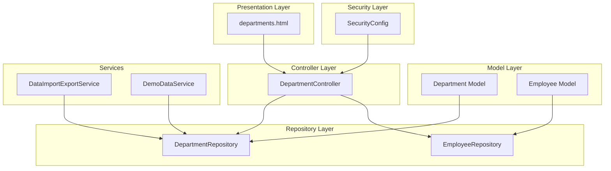
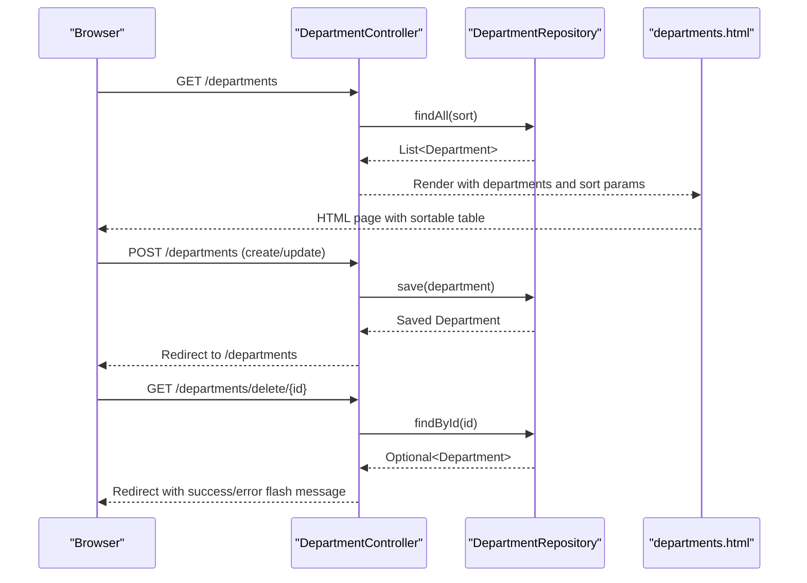
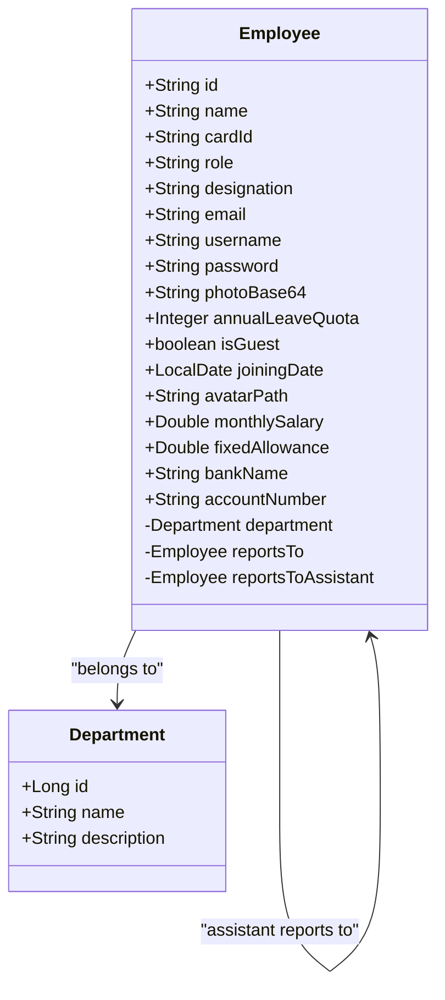
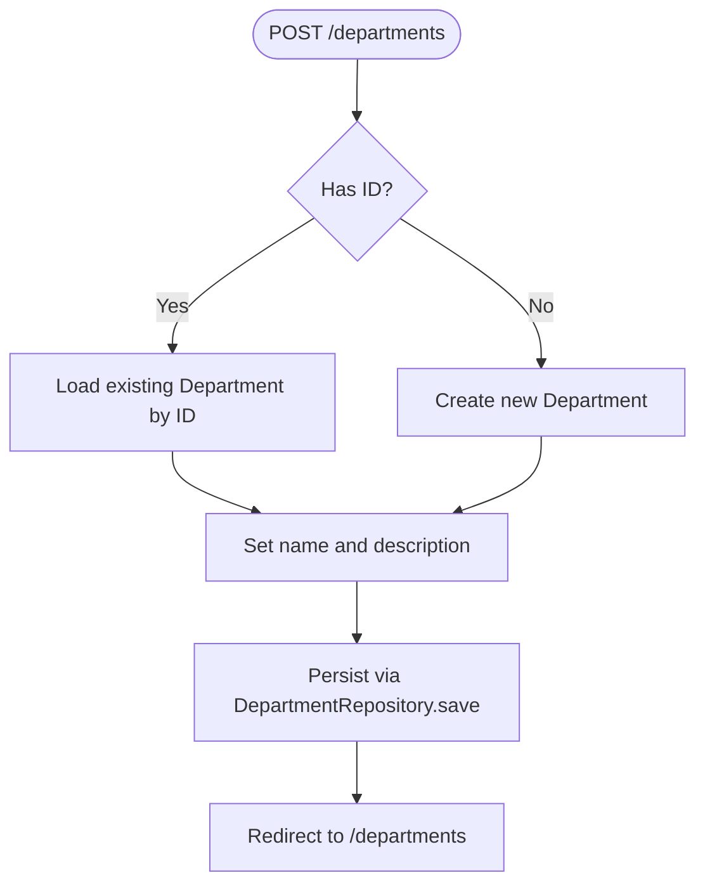
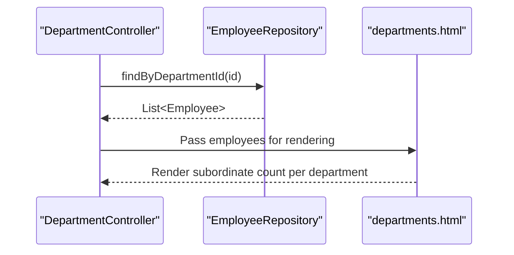
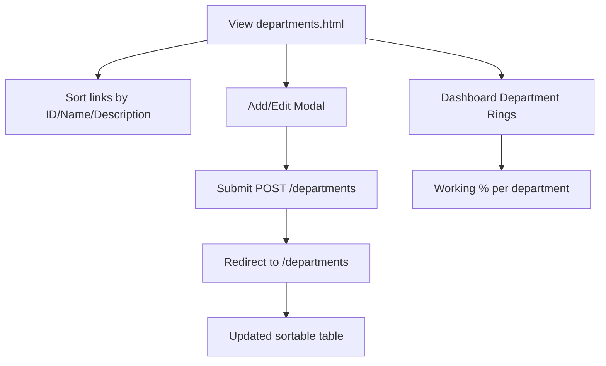
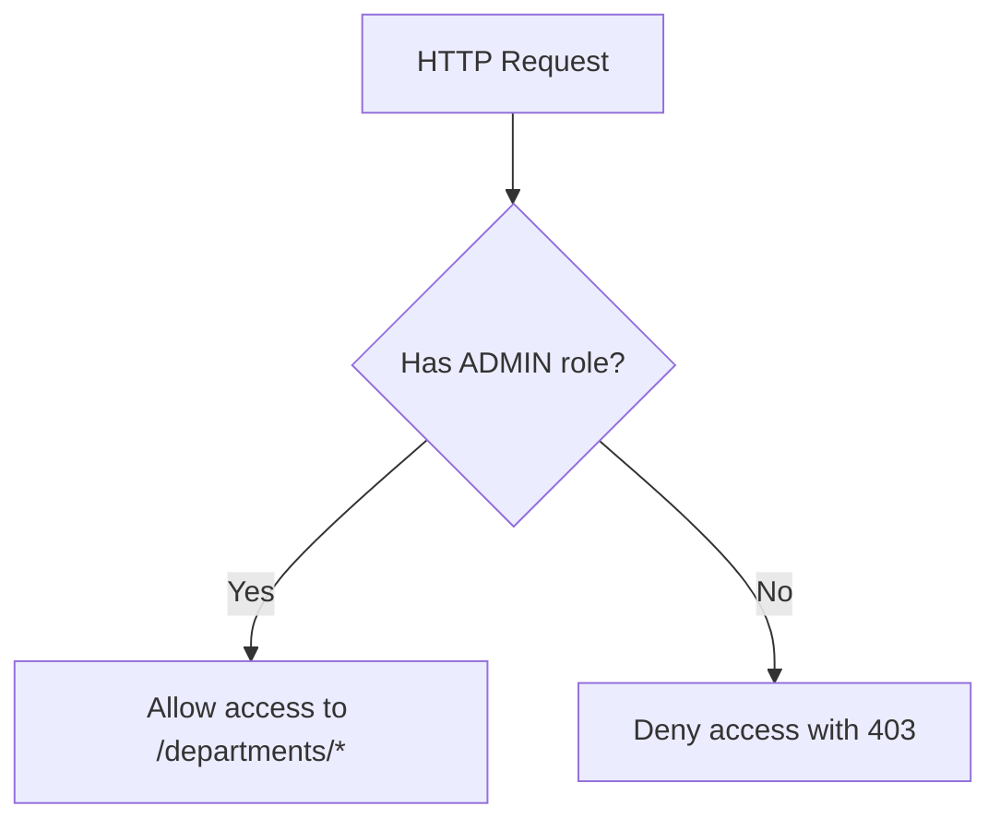
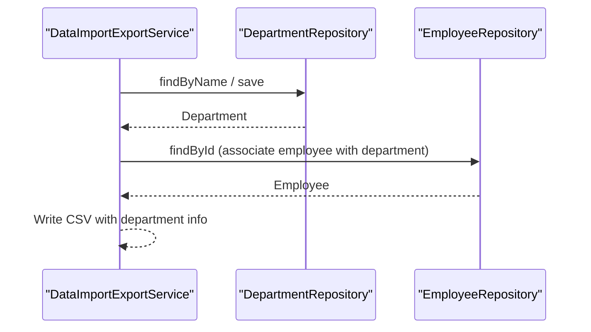
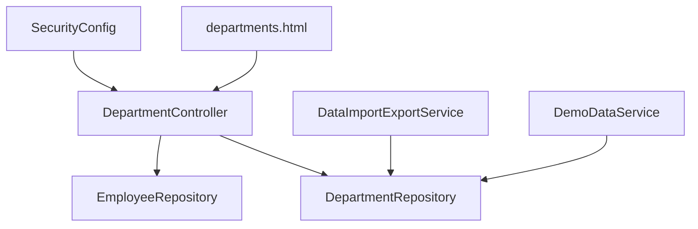

# Department Hierarchy Management

<cite>
**Referenced Files in This Document**
- [Department.java](file://src/main/java/root/cyb/mh/attendancesystem/model/Department.java)
- [Employee.java](file://src/main/java/root/cyb/mh/attendancesystem/model/Employee.java)
- [DepartmentController.java](file://src/main/java/root/cyb/mh/attendancesystem/controller/DepartmentController.java)
- [DepartmentRepository.java](file://src/main/java/root/cyb/mh/attendancesystem/repository/DepartmentRepository.java)
- [EmployeeRepository.java](file://src/main/java/root/cyb/mh/attendancesystem/repository/EmployeeRepository.java)
- [departments.html](file://src/main/resources/templates/departments.html)
- [SecurityConfig.java](file://src/main/java/root/cyb/mh/attendancesystem/config/SecurityConfig.java)
- [DataImportExportService.java](file://src/main/java/root/cyb/mh/attendancesystem/service/DataImportExportService.java)
- [DemoDataService.java](file://src/main/java/root/cyb/mh/attendancesystem/service/DemoDataService.java)
- [AttendanceSystemApplication.java](file://src/main/java/root/cyb/mh/attendancesystem/AttendanceSystemApplication.java)
</cite>

## Table of Contents
1. [Introduction](#introduction)
2. [Project Structure](#project-structure)
3. [Core Components](#core-components)
4. [Architecture Overview](#architecture-overview)
5. [Detailed Component Analysis](#detailed-component-analysis)
6. [Dependency Analysis](#dependency-analysis)
7. [Performance Considerations](#performance-considerations)
8. [Troubleshooting Guide](#troubleshooting-guide)
9. [Conclusion](#conclusion)

## Introduction
This document provides comprehensive documentation for department hierarchy management in the Skylink Custom Backend. It covers department CRUD operations, organizational structure maintenance, and hierarchical relationships. The system supports department creation, modification, and deletion, maintains department-to-employee associations, enforces reporting structures, and integrates with employee management workflows. Practical examples demonstrate department navigation, filtering, and visualization capabilities, along with department-specific permissions and resource allocation considerations.

## Project Structure
The department management functionality spans model, repository, controller, template, and security layers. The application uses Spring Boot with Thymeleaf for the web interface and JPA repositories for persistence.

**Diagram sources**
- [Department.java:15-21](file://src/main/java/root/cyb/mh/attendancesystem/model/Department.java#L15-L21)
- [Employee.java:22-29](file://src/main/java/root/cyb/mh/attendancesystem/model/Employee.java#L22-L29)
- [DepartmentRepository.java:6-8](file://src/main/java/root/cyb/mh/attendancesystem/repository/DepartmentRepository.java#L6-L8)
- [EmployeeRepository.java:12-31](file://src/main/java/root/cyb/mh/attendancesystem/repository/EmployeeRepository.java#L12-L31)
- [DepartmentController.java:14-68](file://src/main/java/root/cyb/mh/attendancesystem/controller/DepartmentController.java#L14-L68)
- [departments.html:10-142](file://src/main/resources/templates/departments.html#L10-L142)
- [SecurityConfig.java:39-40](file://src/main/java/root/cyb/mh/attendancesystem/config/SecurityConfig.java#L39-L40)
- [DataImportExportService.java:20-28](file://src/main/java/root/cyb/mh/attendancesystem/service/DataImportExportService.java#L20-L28)
- [DemoDataService.java:107-114](file://src/main/java/root/cyb/mh/attendancesystem/service/DemoDataService.java#L107-L114)

**Section sources**
- [AttendanceSystemApplication.java:7-15](file://src/main/java/root/cyb/mh/attendancesystem/AttendanceSystemApplication.java#L7-L15)

## Core Components
- Department Model: Defines department identity and attributes with JPA annotations for persistence.
- Employee Model: Establishes department-to-employee relationships and reporting hierarchies.
- Department Repository: Provides JPA-based persistence operations and name lookup.
- Employee Repository: Supports department-based queries and reporting structure checks.
- Department Controller: Implements CRUD endpoints with sorting and validation safeguards.
- Departments Template: Presents department listing, sorting controls, and add/edit modal.
- Security Configuration: Enforces administrative permissions for department operations.
- Services: Integrate department data for import/export and demo initialization.

**Section sources**
- [Department.java:15-21](file://src/main/java/root/cyb/mh/attendancesystem/model/Department.java#L15-L21)
- [Employee.java:22-29](file://src/main/java/root/cyb/mh/attendancesystem/model/Employee.java#L22-L29)
- [DepartmentRepository.java:6-8](file://src/main/java/root/cyb/mh/attendancesystem/repository/DepartmentRepository.java#L6-L8)
- [EmployeeRepository.java:12-31](file://src/main/java/root/cyb/mh/attendancesystem/repository/EmployeeRepository.java#L12-L31)
- [DepartmentController.java:22-67](file://src/main/java/root/cyb/mh/attendancesystem/controller/DepartmentController.java#L22-L67)
- [departments.html:31-78](file://src/main/resources/templates/departments.html#L31-L78)
- [SecurityConfig.java:39-40](file://src/main/java/root/cyb/mh/attendancesystem/config/SecurityConfig.java#L39-L40)
- [DataImportExportService.java:20-28](file://src/main/java/root/cyb/mh/attendancesystem/service/DataImportExportService.java#L20-L28)
- [DemoDataService.java:107-114](file://src/main/java/root/cyb/mh/attendancesystem/service/DemoDataService.java#L107-L114)

## Architecture Overview
The department management subsystem follows a layered architecture:
- Presentation: Thymeleaf template renders department listings and modals.
- Controller: Handles HTTP requests for listing, creating/updating, and deleting departments.
- Persistence: JPA repositories manage entity storage and retrieval.
- Security: Role-based access controls restrict department operations to administrators.
- Integration: Services coordinate department data during import/export and demo initialization.

**Diagram sources**
- [DepartmentController.java:22-67](file://src/main/java/root/cyb/mh/attendancesystem/controller/DepartmentController.java#L22-L67)
- [DepartmentRepository.java:6-8](file://src/main/java/root/cyb/mh/attendancesystem/repository/DepartmentRepository.java#L6-L8)
- [departments.html:31-78](file://src/main/resources/templates/departments.html#L31-L78)

## Detailed Component Analysis

### Department Entity and Relationships
The Department entity defines core attributes and integrates with the Employee entity through a many-to-one relationship. The Employee entity includes:
- Department association via ManyToOne
- Primary supervisor relationship (reportsTo)
- Assistant supervisor relationship (reportsToAssistant)

**Diagram sources**
- [Department.java:15-21](file://src/main/java/root/cyb/mh/attendancesystem/model/Department.java#L15-L21)
- [Employee.java:13-62](file://src/main/java/root/cyb/mh/attendancesystem/model/Employee.java#L13-L62)

**Section sources**
- [Department.java:15-21](file://src/main/java/root/cyb/mh/attendancesystem/model/Department.java#L15-L21)
- [Employee.java:22-29](file://src/main/java/root/cyb/mh/attendancesystem/model/Employee.java#L22-L29)

### Department CRUD Operations
- Listing: Retrieves all departments with configurable sorting by ID, name, or description.
- Creation/Update: Accepts optional ID parameter; creates new or updates existing department.
- Deletion: Prevents deletion if employees are assigned to the department and provides feedback via flash messages.

**Diagram sources**
- [DepartmentController.java:40-53](file://src/main/java/root/cyb/mh/attendancesystem/controller/DepartmentController.java#L40-L53)
- [DepartmentRepository.java:6-8](file://src/main/java/root/cyb/mh/attendancesystem/repository/DepartmentRepository.java#L6-L8)

**Section sources**
- [DepartmentController.java:22-67](file://src/main/java/root/cyb/mh/attendancesystem/controller/DepartmentController.java#L22-L67)

### Department-to-Employee Associations and Reporting Structures
- Department-to-Employee: Employees belong to a single department via ManyToOne.
- Reporting Structures: Employees can report to a primary supervisor and/or an assistant supervisor, enabling backup leadership chains.
- Subordinate Queries: Repositories support existence checks and retrieval of subordinates for supervisors.

**Diagram sources**
- [EmployeeRepository.java:13-19](file://src/main/java/root/cyb/mh/attendancesystem/repository/EmployeeRepository.java#L13-L19)
- [departments.html:1131-1150](file://src/main/resources/templates/departments.html#L1131-L1150)

**Section sources**
- [Employee.java:22-29](file://src/main/java/root/cyb/mh/attendancesystem/model/Employee.java#L22-L29)
- [EmployeeRepository.java:13-19](file://src/main/java/root/cyb/mh/attendancesystem/repository/EmployeeRepository.java#L13-L19)
- [departments.html:1131-1150](file://src/main/resources/templates/departments.html#L1131-L1150)

### Organizational Chart Management and Visualization
- Department Listing: The departments page displays departments in a sortable table with actions for editing and deleting.
- Sorting Controls: Links enable ascending/descending sort by ID, name, or description.
- Modal Interface: Add/Edit modal captures department details and submits via POST.
- Dashboard Visualization: The dashboard includes department ring charts showing working employee percentages per department.

**Diagram sources**
- [departments.html:31-78](file://src/main/resources/templates/departments.html#L31-L78)
- [departments.html:84-114](file://src/main/resources/templates/departments.html#L84-L114)
- [departments.html:1131-1150](file://src/main/resources/templates/departments.html#L1131-L1150)

**Section sources**
- [departments.html:10-142](file://src/main/resources/templates/departments.html#L10-L142)

### Department-Specific Permissions and Access Control
- Administrative Access: Department add and delete endpoints are restricted to users with ADMIN role.
- Role-Based Authorization: Security configuration enforces role-based access for sensitive operations.

**Diagram sources**
- [SecurityConfig.java:39-40](file://src/main/java/root/cyb/mh/attendancesystem/config/SecurityConfig.java#L39-L40)

**Section sources**
- [SecurityConfig.java:39-40](file://src/main/java/root/cyb/mh/attendancesystem/config/SecurityConfig.java#L39-L40)

### Integration with Employee Management Workflows
- Import/Export: Department data participates in import/export operations alongside employees and other entities.
- Demo Initialization: Departments are created or reused during demo data setup to support realistic workflows.

**Diagram sources**
- [DataImportExportService.java:20-28](file://src/main/java/root/cyb/mh/attendancesystem/service/DataImportExportService.java#L20-L28)
- [DataImportExportService.java:119-127](file://src/main/java/root/cyb/mh/attendancesystem/service/DataImportExportService.java#L119-L127)
- [DemoDataService.java:107-114](file://src/main/java/root/cyb/mh/attendancesystem/service/DemoDataService.java#L107-L114)

**Section sources**
- [DataImportExportService.java:20-28](file://src/main/java/root/cyb/mh/attendancesystem/service/DataImportExportService.java#L20-L28)
- [DataImportExportService.java:119-127](file://src/main/java/root/cyb/mh/attendancesystem/service/DataImportExportService.java#L119-L127)
- [DemoDataService.java:107-114](file://src/main/java/root/cyb/mh/attendancesystem/service/DemoDataService.java#L107-L114)

## Dependency Analysis
The department management module exhibits clear separation of concerns:
- Controller depends on DepartmentRepository and EmployeeRepository for persistence and validation.
- Template depends on controller for data binding and sorting parameters.
- Security configuration governs access to department endpoints.
- Services depend on repositories for data operations.

**Diagram sources**
- [DepartmentController.java:16-20](file://src/main/java/root/cyb/mh/attendancesystem/controller/DepartmentController.java#L16-L20)
- [DepartmentRepository.java:6-8](file://src/main/java/root/cyb/mh/attendancesystem/repository/DepartmentRepository.java#L6-L8)
- [EmployeeRepository.java:12-31](file://src/main/java/root/cyb/mh/attendancesystem/repository/EmployeeRepository.java#L12-L31)
- [departments.html:31-78](file://src/main/resources/templates/departments.html#L31-L78)
- [SecurityConfig.java:39-40](file://src/main/java/root/cyb/mh/attendancesystem/config/SecurityConfig.java#L39-L40)
- [DataImportExportService.java:20-28](file://src/main/java/root/cyb/mh/attendancesystem/service/DataImportExportService.java#L20-L28)
- [DemoDataService.java:107-114](file://src/main/java/root/cyb/mh/attendancesystem/service/DemoDataService.java#L107-L114)

**Section sources**
- [DepartmentController.java:16-20](file://src/main/java/root/cyb/mh/attendancesystem/controller/DepartmentController.java#L16-L20)
- [DepartmentRepository.java:6-8](file://src/main/java/root/cyb/mh/attendancesystem/repository/DepartmentRepository.java#L6-L8)
- [EmployeeRepository.java:12-31](file://src/main/java/root/cyb/mh/attendancesystem/repository/EmployeeRepository.java#L12-L31)
- [departments.html:31-78](file://src/main/resources/templates/departments.html#L31-L78)
- [SecurityConfig.java:39-40](file://src/main/java/root/cyb/mh/attendancesystem/config/SecurityConfig.java#L39-L40)
- [DataImportExportService.java:20-28](file://src/main/java/root/cyb/mh/attendancesystem/service/DataImportExportService.java#L20-L28)
- [DemoDataService.java:107-114](file://src/main/java/root/cyb/mh/attendancesystem/service/DemoDataService.java#L107-L114)

## Performance Considerations
- Sorting Efficiency: The listing endpoint applies server-side sorting using Spring Data JPA Sort, minimizing client-side processing overhead.
- Query Optimization: Repository methods are straightforward and leverage JPA's built-in query capabilities.
- Frontend Responsiveness: The departments page uses client-side modal interactions and server redirects, maintaining a lightweight UI.

[No sources needed since this section provides general guidance]

## Troubleshooting Guide
Common issues and resolutions:
- Cannot Delete Department: If employees are assigned to a department, deletion is blocked with a flash error message. Remove or reassign employees before attempting deletion again.
- Sorting Behavior: Ensure sortField and sortDir parameters are correctly passed; otherwise, default sorting by ID ascending is applied.
- Access Denied: Department add and delete endpoints require ADMIN role; verify user roles and authentication status.

**Section sources**
- [DepartmentController.java:55-67](file://src/main/java/root/cyb/mh/attendancesystem/controller/DepartmentController.java#L55-L67)
- [SecurityConfig.java:39-40](file://src/main/java/root/cyb/mh/attendancesystem/config/SecurityConfig.java#L39-L40)

## Conclusion
The Skylink Custom Backend provides a robust foundation for department hierarchy management. The current implementation supports essential CRUD operations, enforces access controls, and integrates with employee workflows. Future enhancements could include hierarchical tree views, advanced filtering, and policy-driven validations to further strengthen organizational governance.