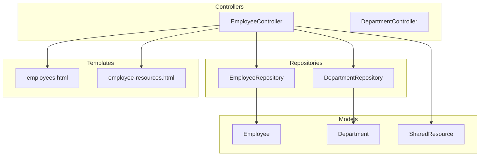
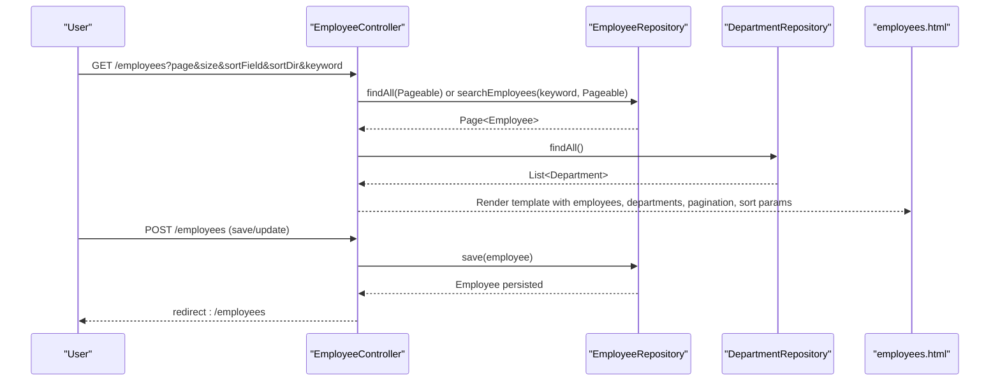
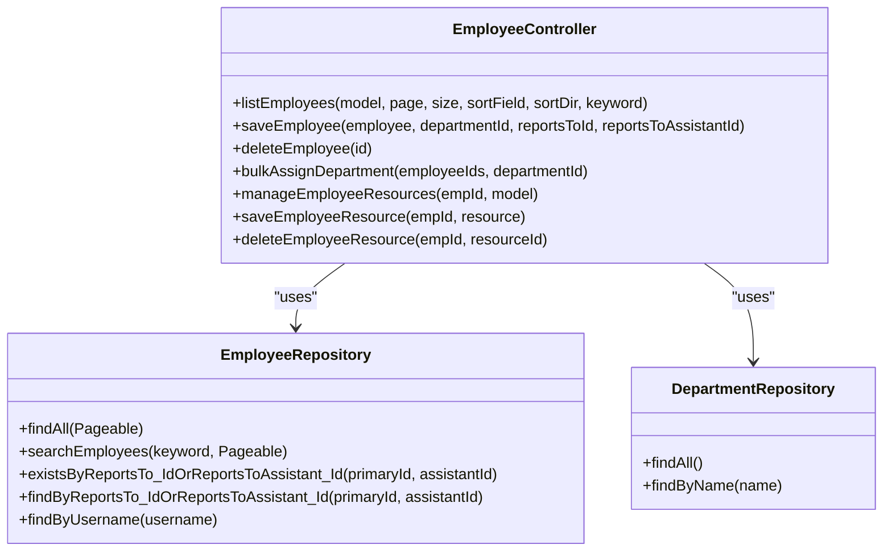
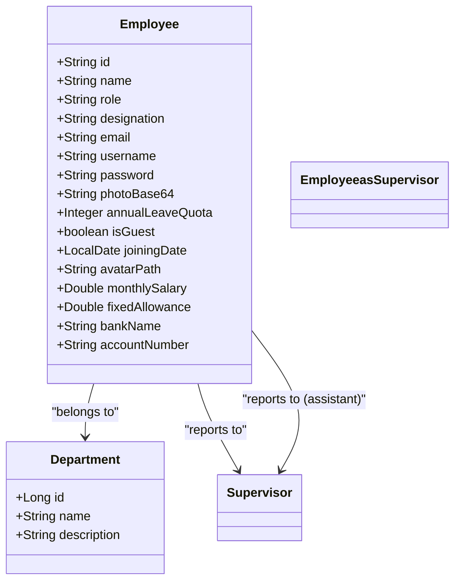
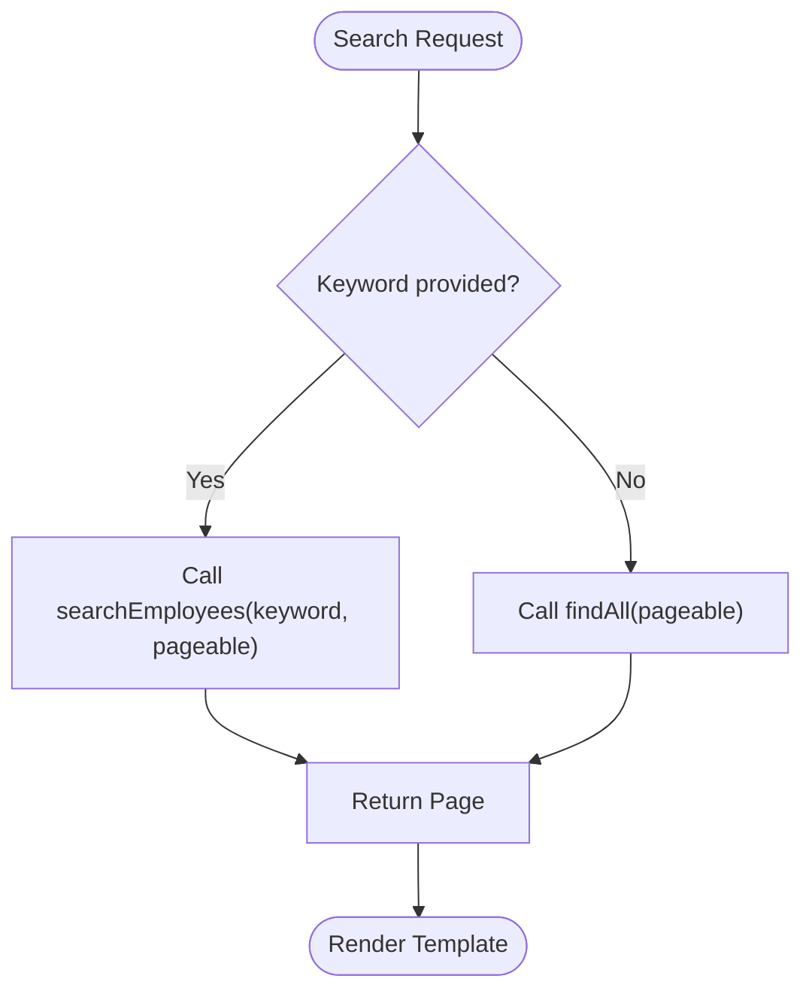
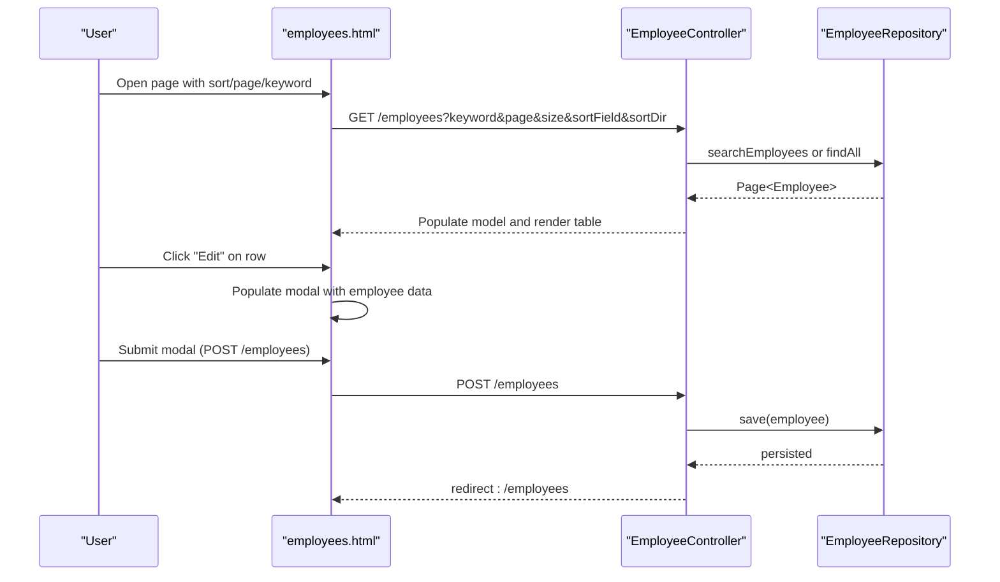
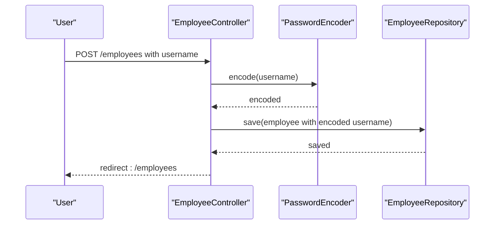
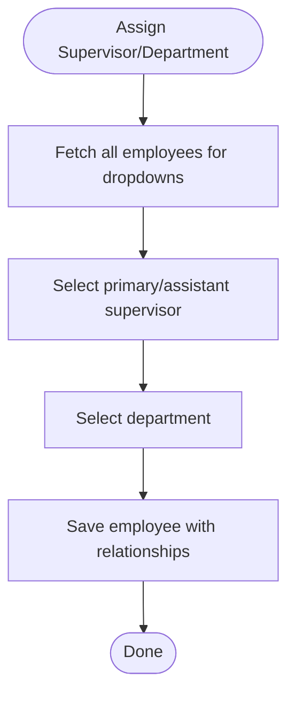
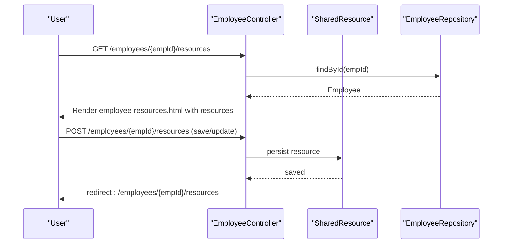
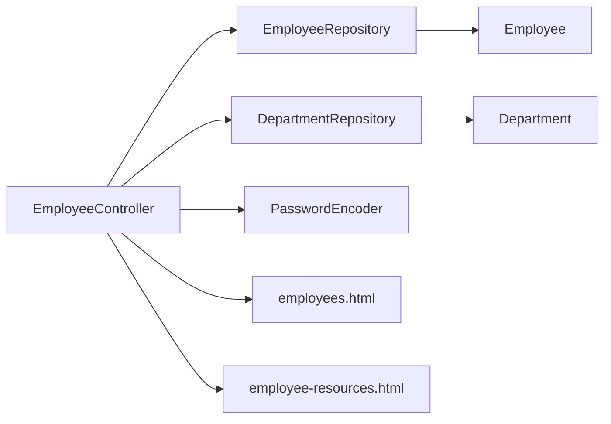

# Employee CRUD Operations

<cite>
**Referenced Files in This Document**
- [EmployeeController.java](file://src/main/java/root/cyb/mh/attendancesystem/controller/EmployeeController.java)
- [Employee.java](file://src/main/java/root/cyb/mh/attendancesystem/model/Employee.java)
- [EmployeeRepository.java](file://src/main/java/root/cyb/mh/attendancesystem/repository/EmployeeRepository.java)
- [Department.java](file://src/main/java/root/cyb/mh/attendancesystem/model/Department.java)
- [DepartmentRepository.java](file://src/main/java/root/cyb/mh/attendancesystem/repository/DepartmentRepository.java)
- [DepartmentController.java](file://src/main/java/root/cyb/mh/attendancesystem/controller/DepartmentController.java)
- [employees.html](file://src/main/resources/templates/employees.html)
- [employee-resources.html](file://src/main/resources/templates/employee-resources.html)
- [SharedResource.java](file://src/main/java/root/cyb/mh/attendancesystem/model/SharedResource.java)
- [SecurityConfig.java](file://src/main/java/root/cyb/mh/attendancesystem/config/SecurityConfig.java)
- [CustomUserDetailsService.java](file://src/main/java/root/cyb/mh/attendancesystem/service/CustomUserDetailsService.java)
- [EmployeeDashboardController.java](file://src/main/java/root/cyb/mh/attendancesystem/controller/EmployeeDashboardController.java)
- [GlobalExceptionHandler.java](file://src/main/java/root/cyb/mh/attendancesystem/exception/GlobalExceptionHandler.java)
- [ResourceNotFoundException.java](file://src/main/java/root/cyb/mh/attendancesystem/exception/ResourceNotFoundException.java)
</cite>

## Table of Contents
1. [Introduction](#introduction)
2. [Project Structure](#project-structure)
3. [Core Components](#core-components)
4. [Architecture Overview](#architecture-overview)
5. [Detailed Component Analysis](#detailed-component-analysis)
6. [Dependency Analysis](#dependency-analysis)
7. [Performance Considerations](#performance-considerations)
8. [Troubleshooting Guide](#troubleshooting-guide)
9. [Conclusion](#conclusion)

## Introduction
This document explains the complete employee CRUD workflow in the Skylink Custom Backend. It covers create, read, update, and delete operations, REST endpoint design, Thymeleaf templates, data validation, password encoding, form handling, search, pagination, sorting, bulk operations, department assignment, supervisor assignment, and resource management. It also addresses error handling, data consistency, and security considerations for manipulating employee data.

## Project Structure
The employee management feature spans backend controllers, domain models, repositories, and Thymeleaf templates:
- Controllers orchestrate HTTP requests and render views
- Models define employee, department, and shared resource entities
- Repositories provide data access and queries
- Templates render the UI for listing, searching, editing, and managing resources

**Diagram sources**
- [EmployeeController.java:16-213](file://src/main/java/root/cyb/mh/attendancesystem/controller/EmployeeController.java#L16-L213)
- [Employee.java:13-64](file://src/main/java/root/cyb/mh/attendancesystem/model/Employee.java#L13-L64)
- [EmployeeRepository.java:12-31](file://src/main/java/root/cyb/mh/attendancesystem/repository/EmployeeRepository.java#L12-L31)
- [Department.java:15-22](file://src/main/java/root/cyb/mh/attendancesystem/model/Department.java#L15-L22)
- [DepartmentRepository.java:6-8](file://src/main/java/root/cyb/mh/attendancesystem/repository/DepartmentRepository.java#L6-L8)
- [employees.html:1-441](file://src/main/resources/templates/employees.html#L1-L441)
- [employee-resources.html:1-138](file://src/main/resources/templates/employee-resources.html#L1-L138)

**Section sources**
- [EmployeeController.java:16-213](file://src/main/java/root/cyb/mh/attendancesystem/controller/EmployeeController.java#L16-L213)
- [Employee.java:13-64](file://src/main/java/root/cyb/mh/attendancesystem/model/Employee.java#L13-L64)
- [EmployeeRepository.java:12-31](file://src/main/java/root/cyb/mh/attendancesystem/repository/EmployeeRepository.java#L12-L31)
- [Department.java:15-22](file://src/main/java/root/cyb/mh/attendancesystem/model/Department.java#L15-L22)
- [DepartmentRepository.java:6-8](file://src/main/java/root/cyb/mh/attendancesystem/repository/DepartmentRepository.java#L6-L8)
- [employees.html:1-441](file://src/main/resources/templates/employees.html#L1-L441)
- [employee-resources.html:1-138](file://src/main/resources/templates/employee-resources.html#L1-L138)

## Core Components
- EmployeeController: Handles employee listing, creation/update, deletion, bulk department assignment, and per-employee resource management.
- Employee entity: Captures identity, personal info, payroll, bank details, supervisor relationships, and guest flag.
- EmployeeRepository: Provides paginated listing, search, supervisor existence checks, and subordinate retrieval.
- Department and DepartmentRepository: Support department selection and assignment.
- SharedResource: Stores credentials and links for employee access to external systems.
- Thymeleaf templates: Render the employee list, search/sort/pagination controls, and resource management UI.

**Section sources**
- [EmployeeController.java:16-213](file://src/main/java/root/cyb/mh/attendancesystem/controller/EmployeeController.java#L16-L213)
- [Employee.java:13-64](file://src/main/java/root/cyb/mh/attendancesystem/model/Employee.java#L13-L64)
- [EmployeeRepository.java:12-31](file://src/main/java/root/cyb/mh/attendancesystem/repository/EmployeeRepository.java#L12-L31)
- [Department.java:15-22](file://src/main/java/root/cyb/mh/attendancesystem/model/Department.java#L15-L22)
- [DepartmentRepository.java:6-8](file://src/main/java/root/cyb/mh/attendancesystem/repository/DepartmentRepository.java#L6-L8)
- [SharedResource.java:10-46](file://src/main/java/root/cyb/mh/attendancesystem/model/SharedResource.java#L10-L46)
- [employees.html:1-441](file://src/main/resources/templates/employees.html#L1-L441)
- [employee-resources.html:1-138](file://src/main/resources/templates/employee-resources.html#L1-L138)

## Architecture Overview
The employee feature follows a layered MVC architecture:
- Presentation: Thymeleaf templates render lists, forms, and actions
- Controller: EmployeeController handles HTTP requests and coordinates repositories
- Persistence: JPA repositories persist and query entities
- Security: Spring Security enforces role-based access for employee endpoints

**Diagram sources**
- [EmployeeController.java:32-64](file://src/main/java/root/cyb/mh/attendancesystem/controller/EmployeeController.java#L32-L64)
- [EmployeeRepository.java:12-31](file://src/main/java/root/cyb/mh/attendancesystem/repository/EmployeeRepository.java#L12-L31)
- [DepartmentRepository.java:6-8](file://src/main/java/root/cyb/mh/attendancesystem/repository/DepartmentRepository.java#L6-L8)
- [employees.html:33-63](file://src/main/resources/templates/employees.html#L33-L63)

**Section sources**
- [EmployeeController.java:32-64](file://src/main/java/root/cyb/mh/attendancesystem/controller/EmployeeController.java#L32-L64)
- [EmployeeRepository.java:12-31](file://src/main/java/root/cyb/mh/attendancesystem/repository/EmployeeRepository.java#L12-L31)
- [DepartmentRepository.java:6-8](file://src/main/java/root/cyb/mh/attendancesystem/repository/DepartmentRepository.java#L6-L8)
- [employees.html:33-63](file://src/main/resources/templates/employees.html#L33-L63)

## Detailed Component Analysis

### EmployeeController Implementation
- Endpoints:
  - GET /employees: Lists employees with pagination, sorting, and keyword search
  - POST /employees: Creates or updates an employee, encodes password if provided, assigns department and supervisors
  - GET /employees/delete/{id}: Deletes an employee
  - POST /employees/bulk/assign-department: Bulk assigns a department to selected employees
  - GET /employees/{empId}/resources: Manages shared resources for an employee
  - POST /employees/{empId}/resources: Saves or updates a shared resource
  - GET /employees/{empId}/resources/delete/{resourceId}: Deletes a shared resource

- Data binding and validation:
  - Uses @ModelAttribute Employee and @RequestParam for department and supervisor IDs
  - Password encoding via PasswordEncoder for new or updated employee credentials
  - Supervisor assignments support both primary and assistant supervisors

- Bulk operations:
  - Select multiple employees and assign a single department in one operation

- Resource management:
  - Dedicated endpoints to manage shared credentials and links per employee

**Diagram sources**
- [EmployeeController.java:16-213](file://src/main/java/root/cyb/mh/attendancesystem/controller/EmployeeController.java#L16-L213)
- [EmployeeRepository.java:12-31](file://src/main/java/root/cyb/mh/attendancesystem/repository/EmployeeRepository.java#L12-L31)
- [DepartmentRepository.java:6-8](file://src/main/java/root/cyb/mh/attendancesystem/repository/DepartmentRepository.java#L6-L8)

**Section sources**
- [EmployeeController.java:32-213](file://src/main/java/root/cyb/mh/attendancesystem/controller/EmployeeController.java#L32-L213)

### Employee Entity and Relationships
- Identity and attributes:
  - id (String): Device/User ID
  - name, role, designation, email, username/password placeholders
  - guest flag, joining date, photos, payroll fields, bank details
- Relationships:
  - ManyToOne to Department
  - ManyToOne to Employee for reportsTo and reportsToAssistant

**Diagram sources**
- [Employee.java:13-64](file://src/main/java/root/cyb/mh/attendancesystem/model/Employee.java#L13-L64)
- [Department.java:15-22](file://src/main/java/root/cyb/mh/attendancesystem/model/Department.java#L15-L22)

**Section sources**
- [Employee.java:13-64](file://src/main/java/root/cyb/mh/attendancesystem/model/Employee.java#L13-L64)
- [Department.java:15-22](file://src/main/java/root/cyb/mh/attendancesystem/model/Department.java#L15-L22)

### EmployeeRepository Queries
- Paginated listing and search:
  - searchEmployees supports wildcard matches across name, email, role, designation, id, and department name
- Supervisor-related queries:
  - existsByReportsTo_IdOrReportsToAssistant_Id
  - findByReportsTo_IdOrReportsToAssistant_Id

**Diagram sources**
- [EmployeeRepository.java:23-31](file://src/main/java/root/cyb/mh/attendancesystem/repository/EmployeeRepository.java#L23-L31)
- [EmployeeController.java:46-50](file://src/main/java/root/cyb/mh/attendancesystem/controller/EmployeeController.java#L46-L50)

**Section sources**
- [EmployeeRepository.java:12-31](file://src/main/java/root/cyb/mh/attendancesystem/repository/EmployeeRepository.java#L12-L31)
- [EmployeeController.java:46-50](file://src/main/java/root/cyb/mh/attendancesystem/controller/EmployeeController.java#L46-L50)

### Thymeleaf Templates and Forms
- employees.html:
  - Search bar with keyword parameter and clear link
  - Sortable columns for id, name, department, role, email
  - Pagination partial inclusion
  - Add/Edit modal with fields for ID, name, department, role, guest flag, email, username, designation, supervisors, leave quota, payroll, bank details, joining date
  - Bulk actions dropdown and checkbox selection for bulk department assignment
  - Per-row actions: Edit, Manage Resources, Delete
- employee-resources.html:
  - Form to add/edit shared resource entries (name, link, login, password)
  - Table listing shared resources with edit/delete actions

**Diagram sources**
- [employees.html:33-63](file://src/main/resources/templates/employees.html#L33-L63)
- [EmployeeController.java:32-64](file://src/main/java/root/cyb/mh/attendancesystem/controller/EmployeeController.java#L32-L64)
- [EmployeeRepository.java:23-31](file://src/main/java/root/cyb/mh/attendancesystem/repository/EmployeeRepository.java#L23-L31)

**Section sources**
- [employees.html:33-182](file://src/main/resources/templates/employees.html#L33-L182)
- [employee-resources.html:20-120](file://src/main/resources/templates/employee-resources.html#L20-L120)

### Password Encoding and Authentication
- Password encoding:
  - EmployeeController encodes the username field (used as the login credential) before saving
  - CustomUserDetailsService loads either a User or Employee by username/id and exposes hashed credentials
- Login behavior:
  - For employees, the principal is the employee id and the password is the hashed username field

**Diagram sources**
- [EmployeeController.java:94-112](file://src/main/java/root/cyb/mh/attendancesystem/controller/EmployeeController.java#L94-L112)
- [CustomUserDetailsService.java:24-52](file://src/main/java/root/cyb/mh/attendancesystem/service/CustomUserDetailsService.java#L24-L52)

**Section sources**
- [EmployeeController.java:94-112](file://src/main/java/root/cyb/mh/attendancesystem/controller/EmployeeController.java#L94-L112)
- [CustomUserDetailsService.java:24-52](file://src/main/java/root/cyb/mh/attendancesystem/service/CustomUserDetailsService.java#L24-L52)

### Supervisor Assignment and Department Selection
- Supervisor assignment:
  - Supports primary supervisor (reportsTo) and assistant supervisor (reportsToAssistant)
  - Dropdowns populate from all employees
- Department assignment:
  - Single or bulk assignment via dedicated endpoints
  - DepartmentController provides listing and safety checks for deletion

**Diagram sources**
- [employees.html:237-254](file://src/main/resources/templates/employees.html#L237-L254)
- [EmployeeController.java:115-135](file://src/main/java/root/cyb/mh/attendancesystem/controller/EmployeeController.java#L115-L135)
- [DepartmentController.java:55-67](file://src/main/java/root/cyb/mh/attendancesystem/controller/DepartmentController.java#L55-L67)

**Section sources**
- [employees.html:237-254](file://src/main/resources/templates/employees.html#L237-L254)
- [EmployeeController.java:115-135](file://src/main/java/root/cyb/mh/attendancesystem/controller/EmployeeController.java#L115-L135)
- [DepartmentController.java:55-67](file://src/main/java/root/cyb/mh/attendancesystem/controller/DepartmentController.java#L55-L67)

### Resource Management for Employees
- Endpoint: GET /employees/{empId}/resources renders resource management page
- Endpoint: POST /employees/{empId}/resources saves or updates a resource
- Endpoint: GET /employees/{empId}/resources/delete/{resourceId} deletes a resource
- SharedResource model stores system name, link, login, and password with timestamps

**Diagram sources**
- [EmployeeController.java:166-210](file://src/main/java/root/cyb/mh/attendancesystem/controller/EmployeeController.java#L166-L210)
- [employee-resources.html:20-120](file://src/main/resources/templates/employee-resources.html#L20-L120)
- [SharedResource.java:10-46](file://src/main/java/root/cyb/mh/attendancesystem/model/SharedResource.java#L10-L46)

**Section sources**
- [EmployeeController.java:166-210](file://src/main/java/root/cyb/mh/attendancesystem/controller/EmployeeController.java#L166-L210)
- [employee-resources.html:20-120](file://src/main/resources/templates/employee-resources.html#L20-L120)
- [SharedResource.java:10-46](file://src/main/java/root/cyb/mh/attendancesystem/model/SharedResource.java#L10-L46)

### Practical Examples
- Creating an employee:
  - Open the Add Employee modal in employees.html
  - Fill in ID, name, department, role, guest flag, email, optional username for login
  - Optionally select supervisors and set leave quota, payroll, bank details, joining date
  - Submit to POST /employees
- Editing an employee:
  - Click Edit on a row; modal auto-fills current values
  - Adjust fields and submit to update
- Bulk department assignment:
  - Select employees via checkboxes, click Bulk Actions → Assign Department
  - Choose department and submit POST /employees/bulk/assign-department
- Managing employee resources:
  - Click Resources on a row, then add or edit shared credentials and links

**Section sources**
- [employees.html:184-326](file://src/main/resources/templates/employees.html#L184-L326)
- [EmployeeController.java:147-162](file://src/main/java/root/cyb/mh/attendancesystem/controller/EmployeeController.java#L147-L162)
- [employee-resources.html:20-120](file://src/main/resources/templates/employee-resources.html#L20-L120)

## Dependency Analysis
- Controller dependencies:
  - EmployeeController depends on EmployeeRepository, DepartmentRepository, SharedResourceRepository, and PasswordEncoder
- Repository dependencies:
  - EmployeeRepository extends JpaRepository and defines custom queries
  - DepartmentRepository extends JpaRepository
- Template dependencies:
  - employees.html binds to model attributes provided by EmployeeController
  - employee-resources.html binds to model attributes for resource management

**Diagram sources**
- [EmployeeController.java:16-31](file://src/main/java/root/cyb/mh/attendancesystem/controller/EmployeeController.java#L16-L31)
- [EmployeeRepository.java:12-31](file://src/main/java/root/cyb/mh/attendancesystem/repository/EmployeeRepository.java#L12-L31)
- [DepartmentRepository.java:6-8](file://src/main/java/root/cyb/mh/attendancesystem/repository/DepartmentRepository.java#L6-L8)
- [employees.html:52-182](file://src/main/resources/templates/employees.html#L52-L182)
- [employee-resources.html:10-120](file://src/main/resources/templates/employee-resources.html#L10-L120)

**Section sources**
- [EmployeeController.java:16-31](file://src/main/java/root/cyb/mh/attendancesystem/controller/EmployeeController.java#L16-L31)
- [EmployeeRepository.java:12-31](file://src/main/java/root/cyb/mh/attendancesystem/repository/EmployeeRepository.java#L12-L31)
- [DepartmentRepository.java:6-8](file://src/main/java/root/cyb/mh/attendancesystem/repository/DepartmentRepository.java#L6-L8)
- [employees.html:52-182](file://src/main/resources/templates/employees.html#L52-L182)
- [employee-resources.html:10-120](file://src/main/resources/templates/employee-resources.html#L10-L120)

## Performance Considerations
- Pagination and sorting:
  - Use PageRequest with explicit sort fields to avoid N+1 queries and large result sets
- Search:
  - The searchEmployees query scans multiple fields; ensure database indexes on name, email, role, designation, id, and department name for optimal performance
- Bulk operations:
  - Bulk department assignment fetches employees by ids and saves them in a loop; consider batching for very large selections
- Image handling:
  - photoBase64 is stored as a large text field; consider storing images externally and keeping only paths for scalability

[No sources needed since this section provides general guidance]

## Troubleshooting Guide
- Access denied:
  - Ensure the user has ADMIN or HR roles for employee endpoints as enforced by SecurityConfig
- Password errors:
  - Employee login credentials are stored in the username field (hashed). Use the employee change password flow for updates
- Resource not found:
  - ResourceNotFoundException is mapped to HTTP 404; verify IDs passed to resource endpoints
- Upload limits:
  - GlobalExceptionHandler handles MaxUploadSizeExceededException; adjust limits if needed
- Supervisor assignment:
  - If supervisors do not appear, verify that the selected employee IDs exist and are correct

**Section sources**
- [SecurityConfig.java:27-48](file://src/main/java/root/cyb/mh/attendancesystem/config/SecurityConfig.java#L27-L48)
- [CustomUserDetailsService.java:24-52](file://src/main/java/root/cyb/mh/attendancesystem/service/CustomUserDetailsService.java#L24-L52)
- [ResourceNotFoundException.java:6-15](file://src/main/java/root/cyb/mh/attendancesystem/exception/ResourceNotFoundException.java#L6-L15)
- [GlobalExceptionHandler.java:12-25](file://src/main/java/root/cyb/mh/attendancesystem/exception/GlobalExceptionHandler.java#L12-L25)
- [EmployeeDashboardController.java:391-425](file://src/main/java/root/cyb/mh/attendancesystem/controller/EmployeeDashboardController.java#L391-L425)

## Conclusion
The Skylink Custom Backend implements a robust employee management system with comprehensive CRUD capabilities, secure authentication, flexible search and sorting, pagination, bulk operations, and integrated resource management. The design leverages Spring MVC, JPA, and Thymeleaf to deliver a maintainable and extensible solution suitable for enterprise environments.