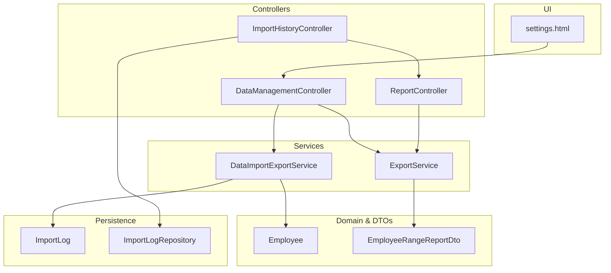
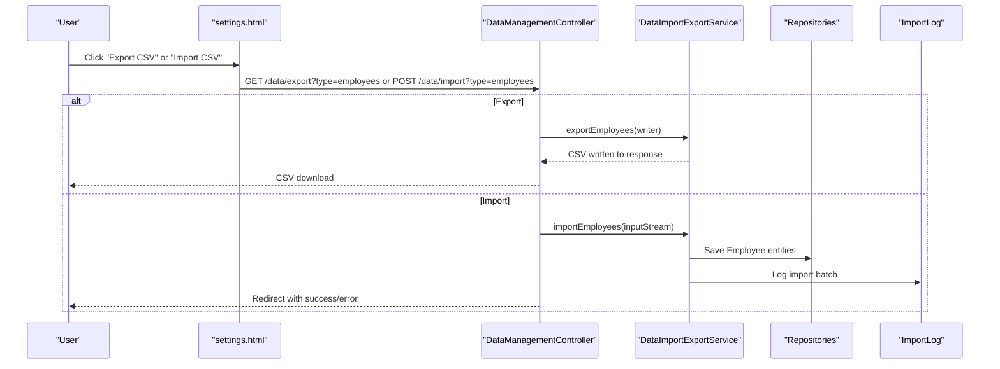
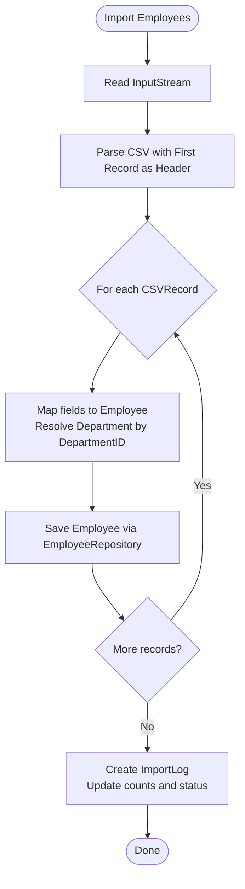
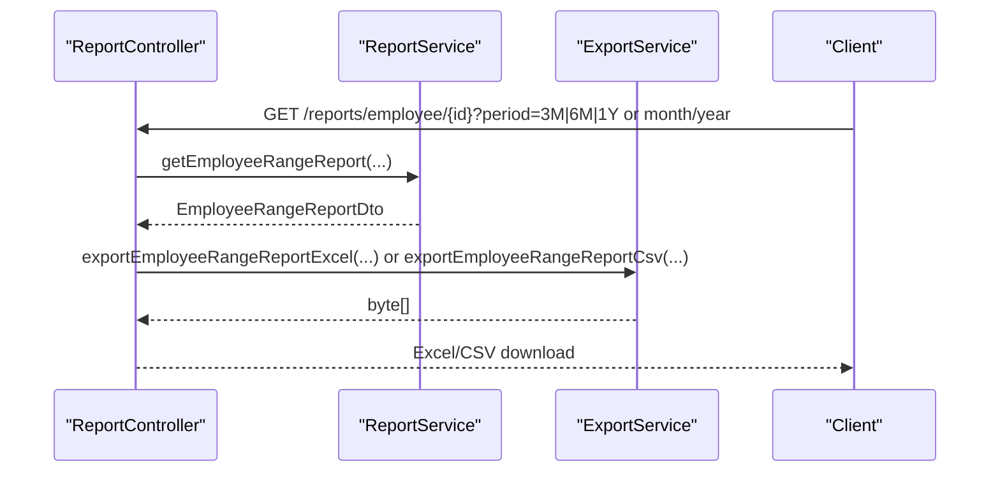
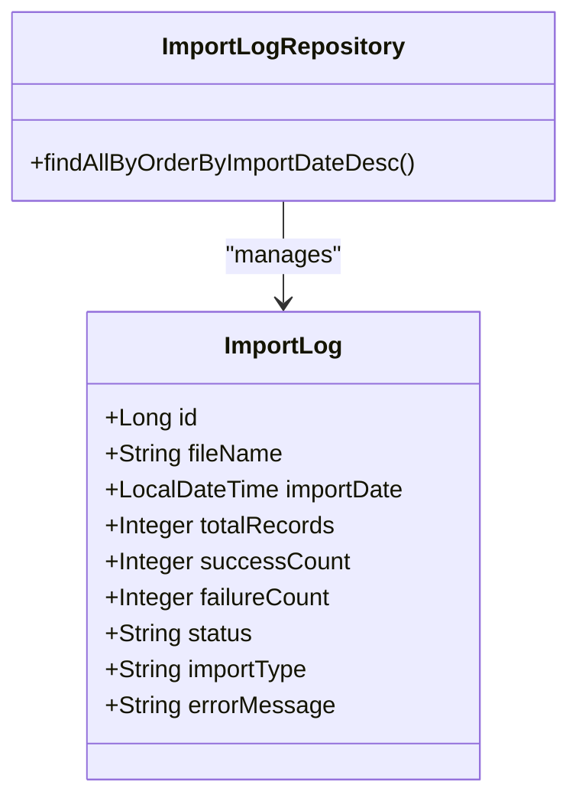
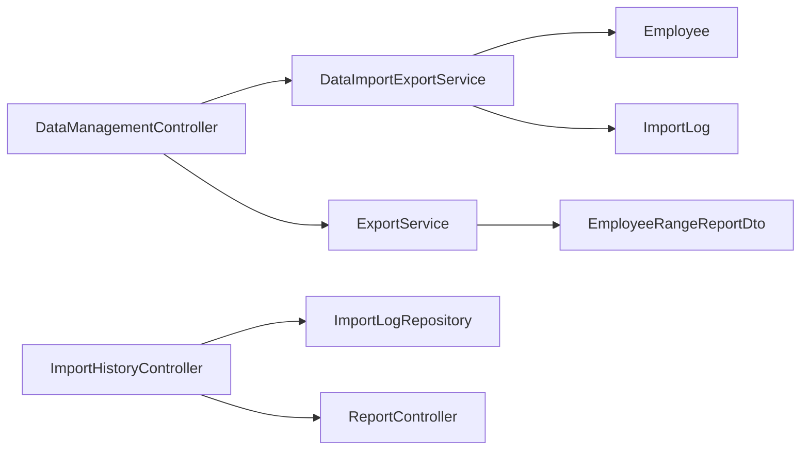

# Employee Import & Export

<cite>
**Referenced Files in This Document**
- [DataManagementController.java](file://src/main/java/root/cyb/mh/attendancesystem/controller/DataManagementController.java)
- [DataImportExportService.java](file://src/main/java/root/cyb/mh/attendancesystem/service/DataImportExportService.java)
- [ExportService.java](file://src/main/java/root/cyb/mh/attendancesystem/service/ExportService.java)
- [ImportHistoryController.java](file://src/main/java/root/cyb/mh/attendancesystem/controller/ImportHistoryController.java)
- [ImportLog.java](file://src/main/java/root/cyb/mh/attendancesystem/model/ImportLog.java)
- [ImportLogRepository.java](file://src/main/java/root/cyb/mh/attendancesystem/repository/ImportLogRepository.java)
- [settings.html](file://src/main/resources/templates/settings.html)
- [Employee.java](file://src/main/java/root/cyb/mh/attendancesystem/model/Employee.java)
- [EmployeeRangeReportDto.java](file://src/main/java/root/cyb/mh/attendancesystem/dto/EmployeeRangeReportDto.java)
- [ReportController.java](file://src/main/java/root/cyb/mh/attendancesystem/controller/ReportController.java)
- [TestCsvParse.java](file://src/test/java/root/cyb/mh/attendancesystem/TestCsvParse.java)
</cite>

## Table of Contents
1. [Introduction](#introduction)
2. [Project Structure](#project-structure)
3. [Core Components](#core-components)
4. [Architecture Overview](#architecture-overview)
5. [Detailed Component Analysis](#detailed-component-analysis)
6. [Dependency Analysis](#dependency-analysis)
7. [Performance Considerations](#performance-considerations)
8. [Troubleshooting Guide](#troubleshooting-guide)
9. [Conclusion](#conclusion)
10. [Appendices](#appendices)

## Introduction
This document explains the employee import and export functionality in the Skylink Custom Backend. It covers how CSV files are processed for bulk employee data operations, including validation rules, data transformation, and error handling. It also documents export formats, report generation, and data formatting options. Practical examples demonstrate employee data migration, bulk updates, and data synchronization. Supported file formats, column mappings, and validation constraints are outlined, along with data integrity checks, duplicate detection, and conflict resolution during imports. Finally, export templates, filtering options, and batch processing capabilities are described.

## Project Structure
The import/export feature spans controllers, services, models, repositories, and templates:
- Controllers handle HTTP endpoints for exporting and importing data.
- Services implement parsing, validation, transformation, and persistence logic.
- Models define persisted entities and DTOs for reporting.
- Repositories manage entity storage and retrieval.
- Templates provide UI for initiating exports and imports.

**Diagram sources**
- [settings.html:205-314](file://src/main/resources/templates/settings.html#L205-L314)
- [DataManagementController.java:14-82](file://src/main/java/root/cyb/mh/attendancesystem/controller/DataManagementController.java#L14-L82)
- [DataImportExportService.java:16-36](file://src/main/java/root/cyb/mh/attendancesystem/service/DataImportExportService.java#L16-L36)
- [ExportService.java:22-21](file://src/main/java/root/cyb/mh/attendancesystem/service/ExportService.java#L22-L21)
- [ImportHistoryController.java:16-52](file://src/main/java/root/cyb/mh/attendancesystem/controller/ImportHistoryController.java#L16-L52)
- [ImportLog.java:6-31](file://src/main/java/root/cyb/mh/attendancesystem/model/ImportLog.java#L6-L31)
- [ImportLogRepository.java:7-9](file://src/main/java/root/cyb/mh/attendancesystem/repository/ImportLogRepository.java#L7-L9)
- [Employee.java:9-63](file://src/main/java/root/cyb/mh/attendancesystem/model/Employee.java#L9-L63)
- [EmployeeRangeReportDto.java:8-29](file://src/main/java/root/cyb/mh/attendancesystem/dto/EmployeeRangeReportDto.java#L8-L29)
- [ReportController.java:665-734](file://src/main/java/root/cyb/mh/attendancesystem/controller/ReportController.java#L665-L734)

**Section sources**
- [DataManagementController.java:14-82](file://src/main/java/root/cyb/mh/attendancesystem/controller/DataManagementController.java#L14-L82)
- [settings.html:205-314](file://src/main/resources/templates/settings.html#L205-L314)

## Core Components
- DataManagementController: Exposes endpoints for exporting and importing data by type (employees, departments, leaves, devices, settings, users). It sets appropriate content types and redirects with success/error parameters.
- DataImportExportService: Implements CSV parsing and persistence for multiple data types. Includes robust parsing helpers for dates, currency, and percentages, and maintains import logs for batch operations.
- ExportService: Generates Excel and CSV reports for attendance and payroll-related summaries, including employee weekly/monthly/range reports.
- ImportHistoryController and ImportLog/ImportLogRepository: Track import batches, statuses, counts, and errors, enabling rollback and cleanup operations.
- UI Template (settings.html): Provides buttons and forms to trigger exports and imports for supported data types.

Key responsibilities:
- CSV parsing with Apache Commons CSV and header-first records.
- Entity mapping and persistence with Spring Data JPA repositories.
- Robust date, currency, and percentage parsing with fallbacks.
- Import logging and transactional batch processing.
- Exporting Excel and CSV with standardized headers and formatting.

**Section sources**
- [DataManagementController.java:20-82](file://src/main/java/root/cyb/mh/attendancesystem/controller/DataManagementController.java#L20-L82)
- [DataImportExportService.java:96-209](file://src/main/java/root/cyb/mh/attendancesystem/service/DataImportExportService.java#L96-L209)
- [ExportService.java:27-579](file://src/main/java/root/cyb/mh/attendancesystem/service/ExportService.java#L27-L579)
- [ImportHistoryController.java:26-51](file://src/main/java/root/cyb/mh/attendancesystem/controller/ImportHistoryController.java#L26-L51)
- [ImportLog.java:6-112](file://src/main/java/root/cyb/mh/attendancesystem/model/ImportLog.java#L6-L112)
- [ImportLogRepository.java:7-9](file://src/main/java/root/cyb/mh/attendancesystem/repository/ImportLogRepository.java#L7-L9)
- [settings.html:205-314](file://src/main/resources/templates/settings.html#L205-L314)

## Architecture Overview
The import/export pipeline follows a layered architecture:
- Presentation: settings.html exposes export/import actions.
- Controller Layer: DataManagementController orchestrates requests and delegates to services.
- Service Layer: DataImportExportService parses CSV and persists entities; ExportService generates reports.
- Persistence: JPA repositories persist entities; ImportLog tracks batch operations.
- Reporting: ExportService and ReportController produce Excel/CSV reports.

**Diagram sources**
- [settings.html:216-229](file://src/main/resources/templates/settings.html#L216-L229)
- [DataManagementController.java:20-82](file://src/main/java/root/cyb/mh/attendancesystem/controller/DataManagementController.java#L20-L82)
- [DataImportExportService.java:96-112](file://src/main/java/root/cyb/mh/attendancesystem/service/DataImportExportService.java#L96-L112)
- [ImportLog.java:6-31](file://src/main/java/root/cyb/mh/attendancesystem/model/ImportLog.java#L6-L31)

## Detailed Component Analysis

### Data Import Pipeline (CSV Parsing and Persistence)
The import pipeline reads CSV records with the first row as headers, validates and transforms fields, and persists entities. It supports:
- Employees: ID, Name, DepartmentID, CardID.
- Departments: ID, Name.
- Leave Requests: ID, EmployeeID, StartDate, EndDate, Reason, Status.
- Devices: ID, Name, IP, Port, Serial.
- Settings: StartTime, EndTime, LateTolerance, EarlyTolerance, Weekends.
- Users: ID, Username, Role (password defaults for new users).

Validation and transformation:
- Date parsing uses flexible patterns and handles non-breaking spaces.
- Currency and percentage parsing strips symbols and normalizes values.
- Existing entities are matched by ID when present; otherwise, new entities are created.
- Import logs capture total records, success/failure counts, and error messages.

**Diagram sources**
- [DataImportExportService.java:96-112](file://src/main/java/root/cyb/mh/attendancesystem/service/DataImportExportService.java#L96-L112)
- [DataImportExportService.java:750-884](file://src/main/java/root/cyb/mh/attendancesystem/service/DataImportExportService.java#L750-L884)

**Section sources**
- [DataImportExportService.java:96-209](file://src/main/java/root/cyb/mh/attendancesystem/service/DataImportExportService.java#L96-L209)
- [DataImportExportService.java:886-923](file://src/main/java/root/cyb/mh/attendancesystem/service/DataImportExportService.java#L886-L923)

### Data Export Pipeline (CSV and Excel)
Exports are implemented as CSV writers or Excel generators:
- CSV exports: Standardized headers per data type.
- Excel exports: Structured sheets with bold headers and auto-sized columns.

Supported exports:
- Employees: ID, Name, DepartmentID, CardID.
- Departments: ID, Name.
- Leave Requests: ID, EmployeeID, StartDate, EndDate, Reason, Status.
- Devices: ID, Name, IP, Port, Serial.
- Settings: StartTime, EndTime, LateTolerance, EarlyTolerance, Weekends.
- Users: ID, Username, Role.

Report exports:
- Daily, Weekly, Monthly, Employee Weekly Detail, Employee Monthly Detail, Employee Range Report (Excel and CSV).
- Range reports aggregate multiple months into a single Excel workbook with summary and monthly sheets.

**Diagram sources**
- [ReportController.java:665-734](file://src/main/java/root/cyb/mh/attendancesystem/controller/ReportController.java#L665-L734)
- [ExportService.java:406-455](file://src/main/java/root/cyb/mh/attendancesystem/service/ExportService.java#L406-L455)
- [ExportService.java:516-539](file://src/main/java/root/cyb/mh/attendancesystem/service/ExportService.java#L516-L539)

**Section sources**
- [DataManagementController.java:20-47](file://src/main/java/root/cyb/mh/attendancesystem/controller/DataManagementController.java#L20-L47)
- [ExportService.java:27-579](file://src/main/java/root/cyb/mh/attendancesystem/service/ExportService.java#L27-L579)
- [ReportController.java:665-734](file://src/main/java/root/cyb/mh/attendancesystem/controller/ReportController.java#L665-L734)

### Import Logging and Batch Operations
Import batches are tracked with ImportLog:
- Fields include file name, import date, total records, success/failure counts, status, and error message.
- ImportHistoryController lists imports, deletes a batch (including related entities), and cleans up legacy data.

**Diagram sources**
- [ImportLog.java:6-112](file://src/main/java/root/cyb/mh/attendancesystem/model/ImportLog.java#L6-L112)
- [ImportLogRepository.java:7-9](file://src/main/java/root/cyb/mh/attendancesystem/repository/ImportLogRepository.java#L7-L9)

**Section sources**
- [ImportHistoryController.java:26-51](file://src/main/java/root/cyb/mh/attendancesystem/controller/ImportHistoryController.java#L26-L51)
- [ImportLog.java:6-112](file://src/main/java/root/cyb/mh/attendancesystem/model/ImportLog.java#L6-L112)

### Supported File Formats and Column Mappings
- Supported formats: CSV (single-file per operation).
- Column mappings for employees:
  - ID, Name, DepartmentID, CardID.
- Additional mappings for other types are defined in the import/export services.

Note: The current implementation focuses on CSV. Excel support is available for report generation via ExportService.

**Section sources**
- [DataManagementController.java:20-47](file://src/main/java/root/cyb/mh/attendancesystem/controller/DataManagementController.java#L20-L47)
- [DataImportExportService.java:40-92](file://src/main/java/root/cyb/mh/attendancesystem/service/DataImportExportService.java#L40-L92)
- [DataImportExportService.java:96-209](file://src/main/java/root/cyb/mh/attendancesystem/service/DataImportExportService.java#L96-L209)

### Validation Rules and Data Transformation
- Date parsing: Flexible patterns and trimming; non-breaking spaces are normalized.
- Currency parsing: Removes currency symbols and commas; defaults to zero on parse errors.
- Percentage parsing: Removes percent sign; defaults to zero on parse errors.
- Presence checks: Skips records with missing identifiers; updates existing entities when IDs are present.
- Defaults: Status fields default to safe values when absent.

**Section sources**
- [DataImportExportService.java:886-923](file://src/main/java/root/cyb/mh/attendancesystem/service/DataImportExportService.java#L886-L923)
- [DataImportExportService.java:129-154](file://src/main/java/root/cyb/mh/attendancesystem/service/DataImportExportService.java#L129-L154)
- [DataImportExportService.java:175-186](file://src/main/java/root/cyb/mh/attendancesystem/service/DataImportExportService.java#L175-L186)

### Error Handling Mechanisms
- Transactional import batches: ImportLog captures status and error messages.
- Controlled failures: Exceptions during import are caught, logged, and rethrown to surface errors to the caller.
- UI feedback: Redirects include success/error parameters for user feedback.

**Section sources**
- [DataImportExportService.java:750-884](file://src/main/java/root/cyb/mh/attendancesystem/service/DataImportExportService.java#L750-L884)
- [DataManagementController.java:49-82](file://src/main/java/root/cyb/mh/attendancesystem/controller/DataManagementController.java#L49-L82)

### Export Templates, Filtering, and Formatting Options
- Export templates: CSV headers are standardized per data type; Excel exports include bold headers and auto-sized columns.
- Filtering options: Reports support range-based filtering (3M, 6M, 1Y) and month/year selection.
- Formatting options: Excel sheets include styled headers and summary rows; CSV exports maintain tabular readability.

**Section sources**
- [ExportService.java:27-579](file://src/main/java/root/cyb/mh/attendancesystem/service/ExportService.java#L27-L579)
- [ReportController.java:665-734](file://src/main/java/root/cyb/mh/attendancesystem/controller/ReportController.java#L665-L734)

### Practical Examples

#### Example 1: Employee Data Migration
- Export current employees to CSV.
- Modify CSV (e.g., update DepartmentID, CardID).
- Upload modified CSV to trigger import.
- Verify import status via Import History.

**Section sources**
- [DataManagementController.java:20-47](file://src/main/java/root/cyb/mh/attendancesystem/controller/DataManagementController.java#L20-L47)
- [DataImportExportService.java:96-112](file://src/main/java/root/cyb/mh/attendancesystem/service/DataImportExportService.java#L96-L112)
- [ImportHistoryController.java:26-51](file://src/main/java/root/cyb/mh/attendancesystem/controller/ImportHistoryController.java#L26-L51)

#### Example 2: Bulk Updates
- Export departments, devices, settings, or users.
- Update values in CSV.
- Import CSV to apply bulk changes.
- Confirm counts and status in Import History.

**Section sources**
- [DataManagementController.java:20-47](file://src/main/java/root/cyb/mh/attendancesystem/controller/DataManagementController.java#L20-L47)
- [DataImportExportService.java:114-173](file://src/main/java/root/cyb/mh/attendancesystem/service/DataImportExportService.java#L114-L173)
- [ImportLog.java:6-112](file://src/main/java/root/cyb/mh/attendancesystem/model/ImportLog.java#L6-L112)

#### Example 3: Data Synchronization
- Export reports (weekly, monthly, range) as Excel/CSV.
- Share with stakeholders for reconciliation.
- Use Import History to track synchronization runs.

**Section sources**
- [ExportService.java:27-579](file://src/main/java/root/cyb/mh/attendancesystem/service/ExportService.java#L27-L579)
- [ReportController.java:665-734](file://src/main/java/root/cyb/mh/attendancesystem/controller/ReportController.java#L665-L734)

## Dependency Analysis
The import/export subsystem exhibits clear separation of concerns:
- Controllers depend on services for orchestration.
- Services depend on repositories for persistence and ImportLog for batch tracking.
- ExportService depends on DTOs for report generation.
- UI template depends on controller endpoints.

**Diagram sources**
- [DataManagementController.java:14-82](file://src/main/java/root/cyb/mh/attendancesystem/controller/DataManagementController.java#L14-L82)
- [DataImportExportService.java:16-36](file://src/main/java/root/cyb/mh/attendancesystem/service/DataImportExportService.java#L16-L36)
- [ExportService.java:22-21](file://src/main/java/root/cyb/mh/attendancesystem/service/ExportService.java#L22-L21)
- [ImportHistoryController.java:16-52](file://src/main/java/root/cyb/mh/attendancesystem/controller/ImportHistoryController.java#L16-L52)
- [ImportLog.java:6-31](file://src/main/java/root/cyb/mh/attendancesystem/model/ImportLog.java#L6-L31)
- [ImportLogRepository.java:7-9](file://src/main/java/root/cyb/mh/attendancesystem/repository/ImportLogRepository.java#L7-L9)
- [Employee.java:9-63](file://src/main/java/root/cyb/mh/attendancesystem/model/Employee.java#L9-L63)
- [EmployeeRangeReportDto.java:8-29](file://src/main/java/root/cyb/mh/attendancesystem/dto/EmployeeRangeReportDto.java#L8-L29)
- [ReportController.java:665-734](file://src/main/java/root/cyb/mh/attendancesystem/controller/ReportController.java#L665-L734)

**Section sources**
- [DataManagementController.java:14-82](file://src/main/java/root/cyb/mh/attendancesystem/controller/DataManagementController.java#L14-L82)
- [DataImportExportService.java:16-36](file://src/main/java/root/cyb/mh/attendancesystem/service/DataImportExportService.java#L16-L36)
- [ExportService.java:22-21](file://src/main/java/root/cyb/mh/attendancesystem/service/ExportService.java#L22-L21)
- [ImportHistoryController.java:16-52](file://src/main/java/root/cyb/mh/attendancesystem/controller/ImportHistoryController.java#L16-L52)

## Performance Considerations
- CSV parsing: Header-first parsing is efficient; consider streaming large files and batching saves to reduce memory pressure.
- Date and numeric parsing: Preprocessing removes noise (non-breaking spaces, currency symbols) to minimize retries.
- Excel generation: Auto-size columns improves readability but can increase output size; consider limiting sheet rows for very large datasets.
- Import logging: Tracking totals and counts enables quick diagnostics without scanning entire datasets.

## Troubleshooting Guide
Common issues and resolutions:
- Empty file upload: Controller redirects with an error parameter; ensure a valid CSV is selected.
- Unknown data type: Controller redirects with an error parameter; verify the type parameter matches supported values.
- Date parsing failures: Review raw date formats and ensure consistency; the parser tolerates non-breaking spaces and multiple patterns.
- Currency/percentage parsing failures: Ensure numeric formats are clean; the parser strips symbols and defaults on errors.
- Import failures: Check Import History for status and error messages; use cleanup to remove orphaned data.

**Section sources**
- [DataManagementController.java:49-82](file://src/main/java/root/cyb/mh/attendancesystem/controller/DataManagementController.java#L49-L82)
- [DataImportExportService.java:886-923](file://src/main/java/root/cyb/mh/attendancesystem/service/DataImportExportService.java#L886-L923)
- [ImportHistoryController.java:34-51](file://src/main/java/root/cyb/mh/attendancesystem/controller/ImportHistoryController.java#L34-L51)

## Conclusion
The Skylink Custom Backend provides a robust, extensible framework for importing and exporting employee and related data. CSV-based imports offer straightforward bulk operations with strong validation and logging. Export capabilities deliver standardized reports in both CSV and Excel formats. The architecture cleanly separates concerns, enabling future enhancements such as Excel import support, advanced validation, and expanded export filters.

## Appendices

### Appendix A: Supported Data Types and Endpoints
- Export endpoints: /data/export?type={employees|departments|leaves|devices|settings|users}
- Import endpoints: /data/import?type={employees|departments|leaves|devices|settings|users|workorders}

**Section sources**
- [DataManagementController.java:20-82](file://src/main/java/root/cyb/mh/attendancesystem/controller/DataManagementController.java#L20-L82)
- [settings.html:205-314](file://src/main/resources/templates/settings.html#L205-L314)

### Appendix B: Employee Import Columns
- ID, Name, DepartmentID, CardID

**Section sources**
- [DataImportExportService.java:96-112](file://src/main/java/root/cyb/mh/attendancesystem/service/DataImportExportService.java#L96-L112)
- [Employee.java:15-23](file://src/main/java/root/cyb/mh/attendancesystem/model/Employee.java#L15-L23)

### Appendix C: Date Parsing Behavior
- Patterns: MM-dd-yy, M-d-yy, MM/dd/yy, M/d/yy.
- Normalization: Non-breaking spaces are removed before parsing.

**Section sources**
- [DataImportExportService.java:767-772](file://src/main/java/root/cyb/mh/attendancesystem/service/DataImportExportService.java#L767-L772)
- [DataImportExportService.java:886-898](file://src/main/java/root/cyb/mh/attendancesystem/service/DataImportExportService.java#L886-L898)
- [TestCsvParse.java:36-68](file://src/test/java/root/cyb/mh/attendancesystem/TestCsvParse.java#L36-L68)